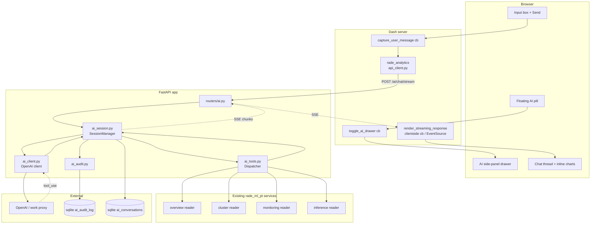

# RADE Analytics — AI Assistant Implementation Guide

| Field | Value |
| --- | --- |
| **Status** | Design — implementation pending |
| **Scope** | `rade_analytics` Dash UI + `ensemble.api` FastAPI backend |
| **LLM provider** | OpenAI (assumed; switchable via single client class) |
| **Intended readers** | Quants, platform engineers, product stakeholders |
| **Last updated** | 2026-06-09 |

---

## Table of Contents

- [Part 1 — Generic AI + Dash Integration](#part-1--generic-ai--dash-integration)
  - [1.1 Why integrate AI into a Dash UI](#11-why-integrate-ai-into-a-dash-ui)
  - [1.2 Architectural pattern](#12-architectural-pattern)
  - [1.3 The five core components](#13-the-five-core-components)
  - [1.4 Request lifecycle in theory](#14-request-lifecycle-in-theory)
  - [1.5 The six capability tiers](#15-the-six-capability-tiers)
  - [1.6 Per-tier requirements](#16-per-tier-requirements)
  - [1.7 Compliance and audit](#17-compliance-and-audit)
  - [1.8 Cost and rate-limit considerations](#18-cost-and-rate-limit-considerations)
- [Part 2 — `rade_analytics` Integration](#part-2--rade_analytics-integration)
  - [2.1 Where the AI assistant lives in the architecture](#21-where-the-ai-assistant-lives-in-the-architecture)
  - [2.2 Backend script structure (FastAPI)](#22-backend-script-structure-fastapi)
  - [2.3 Frontend script structure (Dash)](#23-frontend-script-structure-dash)
  - [2.4 Configuration changes](#24-configuration-changes)
  - [2.5 Component interaction diagram](#25-component-interaction-diagram)
  - [2.6 Request lifecycle — concrete example](#26-request-lifecycle--concrete-example)
  - [2.7 Page Contract compliance](#27-page-contract-compliance)
  - [2.8 Activity log integration](#28-activity-log-integration)
- [Part 3 — Capabilities Catalogue](#part-3--capabilities-catalogue)
  - [3.1 Stakeholder personas](#31-stakeholder-personas)
  - [3.2 Tier 1 — Conversational data access](#32-tier-1--conversational-data-access)
  - [3.3 Tier 2 — Cross-source synthesis](#33-tier-2--cross-source-synthesis)
  - [3.4 Tier 3 — Reasoning and explanation](#34-tier-3--reasoning-and-explanation)
  - [3.5 Tier 4 — Generative actions](#35-tier-4--generative-actions)
  - [3.6 Tier 5 — Proactive and agentic](#36-tier-5--proactive-and-agentic)
  - [3.7 Tier 6 — Domain-differentiating capabilities](#37-tier-6--domain-differentiating-capabilities)
  - [3.8 Prioritisation matrix](#38-prioritisation-matrix)
- [Part 4 — Mock Visualisations](#part-4--mock-visualisations)
- [Appendix A — OpenAI API specifics](#appendix-a--openai-api-specifics)
- [Appendix B — Tool registry skeleton](#appendix-b--tool-registry-skeleton)
- [Appendix C — System prompt templates](#appendix-c--system-prompt-templates)
- [Appendix D — Implementation phase plan](#appendix-d--implementation-phase-plan)

---

# Part 1 — Generic AI + Dash Integration

## 1.1 Why integrate AI into a Dash UI

A modern analytics dashboard like `rade_analytics` exposes dozens of API endpoints, hundreds of charts, and tens of thousands of cells of data. Even an experienced user is limited by:

- **Discoverability** — they can only ask what they remember the dashboard supports.
- **Click cost** — answering "what's the worst cluster this week, and why?" requires opening 3–4 tabs, sorting tables, eyeballing charts, and synthesising mentally.
- **Cross-context reasoning** — joining drift data with inference results with governance history is a manual, error-prone task done in Excel.
- **Onboarding** — new joiners take weeks to learn where each chart lives.

An AI assistant inverts the model: the user describes the *outcome* they want in natural language, and the system orchestrates the existing endpoints to deliver it. It is not a replacement for the dashboard — it is a **second navigation layer** that complements clicking with describing.

The implementation pattern is well-established (Anthropic's Claude in Slack, OpenAI's ChatGPT plugins, Linear's AI assistant, Notion AI, Hex's Magic). The architectural shape is consistent: a side panel in the UI talking to a backend orchestrator that uses tool-calling to compose the existing API.

## 1.2 Architectural pattern

```
┌──────────────────────────────────────────────────────────────────────────────┐
│                                                                              │
│  ┌────────────────────────┐                                                  │
│  │ Dash UI (browser)      │                                                  │
│  │                        │      POST /ai/chat (streaming)                   │
│  │  ┌──────────────────┐  │      ─────────────────────────►                  │
│  │  │ AI side panel    │  │                                                  │
│  │  │  - chat thread   │  │      ◄─────────────────────────                  │
│  │  │  - input box     │  │      SSE stream: text chunks, tool_use,         │
│  │  │  - inline chart  │  │                   tool_result, complete         │
│  │  │  - context chips │  │                                                  │
│  │  └──────────────────┘  │                                                  │
│  │                        │                                                  │
│  └────────────────────────┘                                                  │
│                                                                              │
│         ▲                                                                    │
│         │ (renders)                                                          │
│         │                                                                    │
│  ┌──────┴─────────────────────────────────────────────────────────────────┐ │
│  │ FastAPI backend                                                         │ │
│  │                                                                         │ │
│  │  ┌─────────────────┐    ┌──────────────────┐    ┌──────────────────┐  │ │
│  │  │ routers/ai.py   │ ─► │ ai_session.py    │ ─► │ ai_client.py     │  │ │
│  │  │ (HTTP layer)    │    │ (orchestration)  │    │ (LLM HTTP I/O)   │  │ │
│  │  └─────────────────┘    └──────────────────┘    └──────────────────┘  │ │
│  │                                  │                                      │ │
│  │                                  ▼                                      │ │
│  │                          ┌──────────────────┐                           │ │
│  │                          │ ai_tools.py      │  registry + dispatcher    │ │
│  │                          └──────────────────┘                           │ │
│  │                                  │                                      │ │
│  │                  ┌───────────────┼───────────────┐                      │ │
│  │                  ▼               ▼               ▼                      │ │
│  │           ┌───────────┐   ┌───────────┐   ┌───────────┐                 │ │
│  │           │ /clusters │   │ /portfolio│   │ /monitoring│   …            │ │
│  │           │  router   │   │  router   │   │   router   │                │ │
│  │           └───────────┘   └───────────┘   └───────────┘                 │ │
│  │                                                                         │ │
│  │  ┌─────────────────┐    ┌──────────────────┐                            │ │
│  │  │ ai_audit.py     │    │ ai_conversations │  sqlite or in-memory       │ │
│  │  │ (compliance)    │    │ (state mgmt)     │                            │ │
│  │  └─────────────────┘    └──────────────────┘                            │ │
│  └─────────────────────────────────────────────────────────────────────────┘ │
│                                  │                                           │
│                                  ▼                                           │
│                          ┌──────────────────┐                                │
│                          │ OpenAI API       │  api.openai.com or             │
│                          │ (or work proxy)  │  enterprise gateway            │
│                          └──────────────────┘                                │
└──────────────────────────────────────────────────────────────────────────────┘
```

Key architectural principles:

1. **The LLM never touches the database directly.** It calls *your* API endpoints as tools. This means every AI answer goes through the same auth, audit, and validation layers as a regular UI click — no new attack surface or data exfiltration path.
2. **Tools are dumb proxies.** Each tool maps 1:1 to an existing endpoint. No new business logic. This keeps the AI integration testable in isolation and ensures parity between "what the AI can see" and "what the UI shows".
3. **Streaming is non-optional.** A 4-second wait for a synchronous LLM response feels broken; the same response streamed feels instant. Build with SSE from day one.
4. **Conversation state lives on the backend.** The browser only holds a `conversation_id`. This keeps prompts auditable and lets the user reopen old chats.
5. **Context is injected automatically.** Every request silently includes "user is on the X tab, looking at cluster Y, in ensemble version Z" so the user never has to repeat themselves.

## 1.3 The five core components

| Component | Responsibility | Lives in |
| --- | --- | --- |
| **LLM client** | Thin HTTP wrapper around the OpenAI API (or work proxy). Handles auth, retries, timeouts, streaming primitive. | `services/ai_client.py` |
| **Tool registry** | List of tool definitions (name, description, JSON schema for input). Each tool has a dispatch handler that calls an existing API endpoint or service. | `services/ai_tools.py` |
| **Session orchestrator** | Multi-turn loop: send message + tools to LLM → receive tool_use → dispatch → feed tool_result back → repeat until text-only response. Streams events out via async generator. | `services/ai_session.py` |
| **Router** | HTTP layer: defines the endpoints (`/ai/chat`, `/ai/chat/stream`, `/ai/investigate/{id}`, etc.). Validates input, calls session orchestrator, emits SSE. | `routers/ai.py` |
| **UI panel** | Dash component: floating pill + collapsible drawer + chat thread + input box + inline chart renderer. Streams responses via `EventSource` (clientside callback) or polling. | `layouts/ai_panel.py` + `callbacks/ai_assistant_cb.py` |

These five components are the **complete** scope of an AI assistant integration. Everything else (specialised endpoints, proactive triggers, reports) is built *on top* of these five.

## 1.4 Request lifecycle in theory

A single user message flows through the system like this:

```
┌──────────┐   1. user types message                ┌────────────────┐
│ Browser  │ ─────────────────────────────────────► │ ai_panel cb    │
└──────────┘                                        └────────────────┘
                                                            │
                                                            │ 2. POST /ai/chat/stream
                                                            │    {conversation_id, text, page_context}
                                                            ▼
                                                    ┌────────────────┐
                                                    │ routers/ai.py  │
                                                    └────────────────┘
                                                            │
                                                            │ 3. handoff to async generator
                                                            ▼
                                                    ┌────────────────┐
                                                    │ ai_session     │
                                                    │   load history │
                                                    │   inject ctx   │
                                                    └────────────────┘
                                                            │
                                                            │ 4. call OpenAI with tools
                                                            ▼
                                                    ┌────────────────┐
                                                    │ OpenAI API     │
                                                    └────────────────┘
                                                            │
                          ┌─────────────────────────────────┤
                          │ 5a. text chunks                 │
                          │     (stream straight through)   │
                          │                                 │
                          │ 5b. tool_use chunk              │
                          ▼                                 │
                  ┌───────────────┐                         │
                  │ ai_tools      │                         │
                  │   dispatch    │ ─► calls /clusters/cl-7/summary
                  └───────────────┘                         │
                          │                                 │
                          │ 6. tool_result fed back         │
                          │                                 │
                          ▼                                 │
                  ┌───────────────┐                         │
                  │ OpenAI API    │ ──── repeat from 5 ────►│
                  │ (continues)   │                         │
                  └───────────────┘                         │
                                                            │
                                                            │ 7. SSE chunks
                                                            ▼
                                                    ┌────────────────┐
                                                    │ Browser (Dash) │
                                                    │   incremental  │
                                                    │   render       │
                                                    └────────────────┘
                                                            │
                                                            │ 8. persist final message
                                                            ▼
                                                    ┌────────────────┐
                                                    │ ai_audit       │
                                                    │ conversations  │
                                                    └────────────────┘
```

The critical loop is between steps 5 and 6: the LLM can call multiple tools across multiple turns, all transparent to the user. From the browser's perspective, one question produces one streaming response — even if the backend made 7 tool calls to assemble it.

## 1.5 The six capability tiers

| Tier | Theme | One-line description | Risk | WOW factor |
| --- | --- | --- | --- | --- |
| **Tier 1** | Conversational data access | "Tell me X" — retrieve and display existing data | Low | Low–Medium |
| **Tier 2** | Cross-source synthesis | "Join data from multiple tabs to answer a question" | Low | Medium |
| **Tier 3** | Reasoning and explanation | "Why is X happening?" — produce hypotheses with evidence | Medium | High |
| **Tier 4** | Generative actions | "Build / draft / propose X" — produces artefacts the user reviews | Medium | High |
| **Tier 5** | Proactive and agentic | AI acts without being asked — briefings, alerts, investigations | High | Very high |
| **Tier 6** | Domain-differentiating | Capabilities specific to your codebase that off-the-shelf AI cannot do | High | Very high |

The tiers build on each other architecturally:
- T1 needs only the basic five components.
- T2 needs T1 + a richer tool registry covering all major endpoints.
- T3 needs T2 + structured output schemas + careful system prompts.
- T4 needs T3 + write-capable tools + approval flows.
- T5 needs T4 + background workers + push notifications.
- T6 needs T5 + deep integration with model internals and domain artefacts.

## 1.6 Per-tier requirements

| Tier | Backend | Frontend | Compliance | Dev effort |
| --- | --- | --- | --- | --- |
| **Tier 1** | LLM client, single `/ai/chat` endpoint, 6–10 read tools | Side panel, chat thread, simple text rendering | Audit log of prompts + responses | 1–2 weeks |
| **Tier 2** | Expanded tool registry (~20 tools), multi-turn orchestration | Inline tables, citation chips | (same as T1) | +1 week |
| **Tier 3** | Structured output schemas (Pydantic), reasoning system prompts, evidence-citing requirement | Inline charts (Plotly JSON), evidence cards, structured rendering | Citation auditing — every claim links to a tool call | +2 weeks |
| **Tier 4** | Write-capable tools (gated), approval flow endpoints, draft persistence | Review modal, edit-before-confirm UX, draft library | Human-in-the-loop gating, mandatory review log | +2 weeks |
| **Tier 5** | Background job runner (e.g. `apscheduler`), webhook receivers, push channel | Notification badge, briefing card on landing, opt-in scheduler UI | Per-user trigger preferences, "do not page" hours, all auto-actions logged | +3 weeks |
| **Tier 6** | Hooks into model internals (GNN attention, RNN states), governance graph queries, lineage queries | Specialised rendering for each capability (explainability heatmaps, lineage trees) | (domain-specific) | +4–6 weeks |

## 1.7 Compliance and audit

Even though OpenAI's enterprise tier offers strong data handling guarantees, a quant-finance shop will typically require an additional audit and compliance layer:

| Requirement | Implementation |
| --- | --- |
| **Prompt logging** | Every prompt + response written to `ai_audit_log` table (sqlite or PostgreSQL) with timestamp, user, model, token counts, and a hash of the prompt for later replay |
| **PII / position redaction** | Pre-LLM redactor that masks trade IDs, counterparty names, etc. before sending. Post-response un-redactor restores them. Implemented as middleware around `ai_client.complete()` |
| **Read-only by default** | The tool registry has a `mutates: bool` field on each tool. Mutating tools require an explicit "approval_token" in the request, granted by a separate UI confirmation step |
| **Rate limiting** | Per-user, per-day token cap (e.g. 100k tokens/user/day) and per-org cost cap. Enforced in `ai_session` before LLM call |
| **Right to be forgotten** | `DELETE /ai/conversations/{id}` purges both the conversation store and the audit log entries (within legal retention requirements) |
| **Hallucination indicator** | Every answer ends with `confidence: high | medium | low` based on whether all claims were backed by tool results. Low-confidence answers display a warning banner |

## 1.8 Cost and rate-limit considerations

OpenAI pricing (as of 2026) makes "always-on" AI assistant viable but not free. Plan for:

- **Average chat turn cost** — 1k–5k input tokens + 200–1k output tokens. At `gpt-4o` prices, ~$0.01–$0.05 per turn.
- **Tool-heavy turns** — 5–10x more input tokens because tool results are appended to history. Plan for $0.05–$0.50 per "investigate this cluster" turn.
- **Daily user budget** — 50 chat turns per active user = ~$2.50/day. A team of 20 active users = $50/day = $15k/year.
- **Background briefing cost** — 1 morning briefing per day per user = ~$0.20 each. Linear in users.

Mitigations:
- Use `gpt-4o-mini` for Tier 1 lookups (10x cheaper) and reserve `gpt-4o` / `o1` family for Tier 3+ reasoning.
- Cache common tool results (e.g. "latest ensemble version") for 5 minutes.
- Trim conversation history aggressively — keep only the last 10 turns by default, with explicit "extend context" option.
- For background jobs, batch into hourly windows and use the OpenAI Batch API for 50% discount.

---

# Part 2 — `rade_analytics` Integration

## 2.1 Where the AI assistant lives in the architecture

The existing system has:

- **FastAPI backend** at `src/rade_ml_pt/ensemble/api/` exposing 17 routers (overview, clusters, portfolio, monitoring, inference, etc.).
- **Dash UI** at `src/ui/apps/rade_analytics/` with 7 tabs (Overview, Evaluation, Risk Management, Inference, Monitoring, Governance, etc.).
- **Page Contract** rules defining how callbacks must be structured (mount-tripwire pattern, captured-vs-render separation).
- **Activity log** pattern via `infer_events.py` for stage events.

The AI assistant slots in as:

- **One new router** (`ai.py`) alongside the existing 17.
- **Three new services** (`ai_client.py`, `ai_session.py`, `ai_tools.py`) alongside the existing ones.
- **One new layout** (`ai_panel.py`) mounted globally in the app shell — not a tab.
- **One new callback file** (`ai_assistant_cb.py`) following Page Contract rules.
- **One new API client method** (`chat_with_ai`) on the rade_analytics API client.

No existing files are modified except for `app.py` (mount the panel + include the router) and `api/dependencies.py` (provide the AI client). The AI integration is fully additive.

## 2.2 Backend script structure (FastAPI)

```
src/rade_ml_pt/ensemble/api/
├── app.py                            ← MODIFY: include ai_router, add startup hook
├── config.py                         ← MODIFY: add OPENAI_API_KEY, OPENAI_MODEL, OPENAI_BASE_URL
├── dependencies.py                   ← MODIFY: add get_ai_client(), get_ai_session_mgr()
├── models/
│   ├── ai.py                         ← NEW: Pydantic models for AI requests/responses
│   │   - ChatRequest, ChatResponse
│   │   - ChatStreamChunk (text, tool_use, tool_result, done, error)
│   │   - InvestigateRequest, InvestigationReport
│   │   - GenerateReportRequest, ReportDraft
│   │   - Citation, EvidenceChartSpec
│   └── ... (existing)
├── routers/
│   ├── ai.py                         ← NEW: AI HTTP endpoints
│   │   POST /prism/v1/ai/chat            — synchronous single-turn (testing)
│   │   POST /prism/v1/ai/chat/stream     — SSE streaming, multi-turn
│   │   POST /prism/v1/ai/investigate/{monitoring_run_id}
│   │   POST /prism/v1/ai/summarise/inference/{inference_run_id}
│   │   POST /prism/v1/ai/generate-report
│   │   GET  /prism/v1/ai/conversations/{conv_id}
│   │   GET  /prism/v1/ai/conversations            — list user's conversations
│   │   DELETE /prism/v1/ai/conversations/{conv_id}
│   │   GET  /prism/v1/ai/health
│   │   GET  /prism/v1/ai/tools                    — list available tools (for debugging)
│   └── ... (existing 17 routers)
└── services/
    ├── ai_client.py                  ← NEW: OpenAI HTTP wrapper
    │   - Class AiClient(openai.AsyncOpenAI)
    │   - chat(messages, tools, stream) → AsyncIterator[chunk]
    │   - structured_output(messages, schema) → BaseModel
    │   - estimate_cost(messages) → float
    ├── ai_tools.py                   ← NEW: tool registry + dispatcher
    │   - TOOLS: list[ToolDef]
    │   - dispatch(name, input_dict, ctx) → ToolResult
    │   - Each tool wraps an existing service call (NOT an HTTP call)
    ├── ai_session.py                 ← NEW: multi-turn orchestrator
    │   - Class AiSessionManager (in-memory store of conversations)
    │   - run_chat(conv_id, user_msg, page_ctx) → AsyncIterator[StreamChunk]
    │   - Handles the tool-call loop until LLM stops calling tools
    │   - Persists every turn to ai_audit + conversation store
    ├── ai_audit.py                   ← NEW: compliance log writer
    │   - log_prompt(...) → audit_id
    │   - log_response(audit_id, ...)
    │   - log_tool_call(audit_id, tool_name, input, output)
    │   - Writes to sqlite table `ai_audit_log`
    ├── ai_redaction.py               ← NEW: PII/position redaction
    │   - redact(text) → (redacted_text, restore_map)
    │   - restore(text, restore_map) → original_text
    │   - Trade IDs, counterparty IDs, large notional values
    └── ... (existing services: reader.py, paths.py, cache.py, etc.)
```

### Database additions

```
src/rade_ml_pt/ensemble/db_schema.sql   ← MODIFY: add ai_audit_log + ai_conversations
```

```sql
CREATE TABLE ai_audit_log (
    id              INTEGER PRIMARY KEY AUTOINCREMENT,
    conversation_id TEXT NOT NULL,
    user_id         TEXT,
    model           TEXT NOT NULL,
    role            TEXT NOT NULL,            -- 'user', 'assistant', 'tool'
    content_hash    TEXT NOT NULL,            -- sha256 of prompt/response
    content_preview TEXT,                     -- first 200 chars, redacted
    token_count_in  INTEGER,
    token_count_out INTEGER,
    cost_usd        REAL,
    tool_calls      TEXT,                     -- json: [{name, input_hash}, ...]
    ts              TEXT NOT NULL DEFAULT (datetime('now')),
    INDEX idx_ai_audit_conv (conversation_id),
    INDEX idx_ai_audit_user_ts (user_id, ts)
);

CREATE TABLE ai_conversations (
    id              TEXT PRIMARY KEY,         -- uuid4
    user_id         TEXT,
    title           TEXT,                     -- auto-generated from first message
    page_context    TEXT,                     -- json: starting page/cluster/run
    messages_json   TEXT NOT NULL,            -- full message history
    created_at      TEXT NOT NULL DEFAULT (datetime('now')),
    updated_at      TEXT NOT NULL DEFAULT (datetime('now')),
    archived        INTEGER NOT NULL DEFAULT 0,
    INDEX idx_ai_conv_user (user_id, updated_at DESC)
);
```

## 2.3 Frontend script structure (Dash)

```
src/ui/apps/rade_analytics/
├── app.py                            ← MODIFY: mount ai_panel in app shell
├── api_client.py                     ← MODIFY: add AI client methods
│   - chat_with_ai_stream(conv_id, message, ctx) → AsyncIterator
│   - get_ai_conversations() → list
│   - investigate_run(run_id) → InvestigationReport
├── config.py                         ← MODIFY: add AI_PANEL_DEFAULT_OPEN, AI_QUICK_PROMPTS
├── layouts/
│   ├── ai_panel.py                   ← NEW: floating pill + drawer + chat
│   │   - ai_panel_layout() → Component
│   │     - dmc.Affix wrapping a pill button (bottom-right)
│   │     - dmc.Drawer (slides from right) containing:
│   │       - Header: title, conversation chip, "New chat", "History", close
│   │       - Context chips row: [ensemble vX] [cluster cY] [tab Z]
│   │       - Chat thread: list of message bubbles
│   │       - Suggested actions row (changes per page)
│   │       - Input box + Send + slash-command hints
│   │       - Footer: model name, tool list, audit indicator
│   │   - _message_bubble(msg) → Component (renders text + inline charts/tables)
│   │   - _suggested_actions(page_context) → list[Component]
│   └── ... (existing layouts)
├── callbacks/
│   ├── ai_assistant_cb.py            ← NEW: chat callbacks
│   │   - register_callbacks(app):
│   │     - toggle_ai_drawer (pill click → open drawer)
│   │     - capture_user_message (send button / enter → server message)
│   │     - render_streaming_response (clientside_callback via EventSource)
│   │     - load_conversation (history click → reload thread)
│   │     - new_conversation (button → reset thread + new conv_id)
│   │     - update_context_chips (url change → update displayed context)
│   └── ... (existing callback files)
├── components/                       ← NEW: AI-specific small components
│   ├── ai_message_bubble.py          ← user vs assistant bubble rendering
│   ├── ai_inline_chart.py            ← Plotly chart embedded in chat
│   ├── ai_evidence_card.py           ← evidence + citation rendering for T3
│   ├── ai_investigation_card.py      ← structured investigation rendering
│   └── ai_context_chip.py            ← dismissable context indicator
├── figures/
│   ├── ai_evidence_charts.py         ← NEW: helpers that turn tool results into Plotly figs
│   └── ... (existing figures)
└── assets/
    ├── ai_panel.css                  ← NEW: styling for panel + bubbles + streaming cursor
    └── ai_panel.js                   ← NEW: EventSource handling for streaming
```

## 2.4 Configuration changes

### `src/rade_ml_pt/ensemble/api/config.py`

```python
class Settings(BaseSettings):
    # ... existing fields ...

    # AI integration
    openai_api_key:      str = Field(default="", env="OPENAI_API_KEY")
    openai_base_url:     str = Field(default="https://api.openai.com/v1", env="OPENAI_BASE_URL")
    openai_model_chat:   str = Field(default="gpt-4o-mini", env="OPENAI_MODEL_CHAT")
    openai_model_reason: str = Field(default="gpt-4o",       env="OPENAI_MODEL_REASON")
    openai_org_id:       Optional[str] = Field(default=None, env="OPENAI_ORG_ID")

    # Audit / compliance
    ai_audit_enabled:    bool = Field(default=True, env="AI_AUDIT_ENABLED")
    ai_redaction_enabled: bool = Field(default=True, env="AI_REDACTION_ENABLED")
    ai_max_tokens_per_user_per_day: int = Field(default=100_000, env="AI_USER_TOKEN_CAP")
    ai_max_cost_per_org_per_day_usd: float = Field(default=500.0, env="AI_ORG_COST_CAP")

    # Performance
    ai_default_max_tool_iterations: int = Field(default=8, env="AI_MAX_TOOL_ITERATIONS")
    ai_default_timeout_seconds:     int = Field(default=60, env="AI_TIMEOUT_SECONDS")
```

### `src/ui/apps/rade_analytics/config.py`

```python
# AI panel
AI_PANEL_ENABLED       = True
AI_PANEL_DEFAULT_OPEN  = False
AI_PANEL_WIDTH         = 480              # px when drawer is open
AI_API_BASE            = "/prism/v1/ai"

# Per-page suggested prompts (rendered as chips above the input)
AI_QUICK_PROMPTS_BY_TAB = {
    "overview":         ["Summarise today's portfolio health",
                         "What's changed since yesterday?",
                         "Which clusters need attention?"],
    "evaluation":       ["Worst-performing 5 clusters this split",
                         "Compare to last evaluation run",
                         "Explain RMSE drivers"],
    "risk-management":  ["What's the tail loss attribution?",
                         "Show me cluster-level VaR contributions",
                         "Find scenarios with extreme losses"],
    "inference":        ["Diff this run vs the previous",
                         "Which clusters were re-priced?",
                         "Explain the predicted PnL change"],
    "monitoring":       ["Investigate this drift run",
                         "Which clusters drifted most?",
                         "Is this severity critical?"],
    "governance":       ["Show me the deployment history",
                         "Why was vX promoted?",
                         "Draft a model risk review entry"],
}
```

## 2.5 Component interaction diagram



## 2.6 Request lifecycle — concrete example

Consider the user typing `"What's the worst-performing cluster this week?"` while on the Evaluation tab, with ensemble version `v2026-05-30` loaded.

```
Step 1 — Browser
  User types message → presses Send
  Dash `Input` triggers capture_user_message callback

Step 2 — Dash callback (capture_user_message)
  Reads:
    - conversation_id from dcc.Store("ai-conversation-id")
    - page context from dcc.Store("session-store") + url.pathname
  Calls:
    api_client.chat_with_ai_stream(
      conv_id="conv-abc123",
      message="What's the worst-performing cluster this week?",
      page_ctx={"tab": "evaluation",
                "ensemble_version": "v2026-05-30",
                "selected_cluster": None,
                "selected_run": None,
                "iso_date": "2026-06-09"}
    )
  Returns: nothing (clientside callback takes over for streaming)

Step 3 — Clientside callback opens EventSource
  new EventSource("/prism/v1/ai/chat/stream?conv_id=conv-abc123&...")
  Appends an empty assistant message bubble to the thread
  Each SSE event appends a token chunk to that bubble

Step 4 — FastAPI router/ai.py
  POST /ai/chat/stream
    - Validate request (Pydantic)
    - Get session manager from dependency
    - Return StreamingResponse(ai_session.run_chat(...), media_type="text/event-stream")

Step 5 — ai_session.py: run_chat() async generator
  - audit_id = ai_audit.log_prompt(conv_id, user_msg)
  - history = load_conversation(conv_id)
  - system_prompt = build_system_prompt(page_ctx)
  - messages = [system_prompt, *history, user_msg]
  - yield {"event": "start", "audit_id": audit_id}

  Loop:
    response_iter = ai_client.chat(messages, tools=TOOLS, stream=True)
    async for chunk in response_iter:
      if chunk.type == "text":
        yield {"event": "text", "delta": chunk.text}
      elif chunk.type == "tool_use":
        tool_result = ai_tools.dispatch(chunk.name, chunk.input, ctx)
        ai_audit.log_tool_call(audit_id, chunk.name, chunk.input, tool_result)
        yield {"event": "tool_use", "name": chunk.name, "input": chunk.input}
        yield {"event": "tool_result", "name": chunk.name, "summary": tool_result.summary}
        messages.append({"role": "assistant", "tool_use": chunk})
        messages.append({"role": "tool", "tool_result": tool_result})
        # continue outer loop to call LLM again
      elif chunk.type == "done":
        ai_audit.log_response(audit_id, full_response)
        save_conversation(conv_id, messages)
        yield {"event": "done"}
        return

Step 6 — Inside the loop, an example tool dispatch:
  ai_tools.dispatch("list_clusters_with_metrics", {"sort_by": "mae_desc", "limit": 5}, ctx)
    → calls cluster_reader.list_with_metrics(ensemble_version=ctx.ensemble_version,
                                             sort_by="mae_desc", limit=5)
    → returns: [{"cluster_id": "cl-3", "mae": 0.24, ...}, ...]

Step 7 — LLM responds with text now that it has the data:
  "The worst-performing cluster this week is **cl-3** with MAE 0.24, up from 0.18 last week..."
  (streamed token by token via SSE)

Step 8 — When the LLM decides to render a chart:
  tool_use: render_chart({type: "bar", x: ["cl-3", "cl-5", "cl-7"], y: [0.24, 0.21, 0.18], ...})
  The dispatcher returns immediately; the panel renders the chart inline.

Step 9 — Browser receives "event: done" → finalises bubble, removes typing indicator
```

The user perceived 1 question, ~3 seconds, 1 streamed answer with an inline chart. The backend did 3 tool calls and 2 LLM round-trips.

## 2.7 Page Contract compliance

Following the project's established callback rules (see `docs/rade_analytics/page_contract.md`):

| Rule | How `ai_assistant_cb.py` complies |
| --- | --- |
| **L4 mount-tripwire** | Drawer's `is_open` state is captured-vs-rendered through a `dcc.Store` so reopening the panel restores the last conversation |
| **C4 pathname is State, never Input** | The chat callback reads `url.pathname` as `State` to compute `page_context`; pathname changes do NOT auto-fire chat |
| **C5 capture / render separation** | `capture_user_message` only writes the user message into a `dcc.Store("ai-pending-message")`; `render_streaming_response` is a separate clientside cb that reads the store and opens the EventSource |
| **C7 prevent_initial_call** | All AI callbacks use `prevent_initial_call=True` except the toggle (which needs to handle browser refresh state) |

## 2.8 Activity log integration

The existing `infer_events.py` activity-log pattern is reused. When the AI assistant takes an action that materially affects state (creating a scenario, drafting a report, promoting a model), the same event vocabulary is used so the action appears in the same activity log the user already trusts:

```python
# Inside an AI tool that writes
event(
    stage="ai_assistant",
    phase="Scenario draft created",
    status="ok",
    target=scenario_id,
    detail=f"prompt: {prompt[:100]}... · user={user_id}",
)
```

This means stakeholders never wonder "did the AI do that or did the user do that?" — both routes flow through the same observability stack.

---

# Part 3 — Capabilities Catalogue

## 3.1 Stakeholder personas

The capabilities below are labelled by which stakeholder gets the most value. The four personas in our environment:

| Persona | Role | What they care about | When they use the dashboard |
| --- | --- | --- | --- |
| **Trader** | Front office, takes risk | Real-time PnL, position changes, risk attribution, scenario sensitivities | Intraday — needs fast answers, low patience for clicking |
| **FO (Front Office) Analyst** | Quant support to traders | Trade-level explanations, what-if scenarios, structuring help | Throughout the day — supports trader's questions |
| **Risk Management** | Independent risk function, oversight | Drift, model breaks, governance, regulatory compliance, capital impact | Daily / weekly — methodical, needs evidence trails |
| **Quant** | Builds and maintains models | Model performance debugging, retraining decisions, scenario design | Throughout development cycles + when issues escalate |

Some capabilities are universal; others are clearly aimed at one persona. The catalogue makes this explicit.

## 3.2 Tier 1 — Conversational data access

Replaces clicking through tabs with a sentence. Low risk, fast to build, immediate value.

### T1.1 — NLQ for KPIs and metrics

> **"What is the portfolio MAE on the test set for the current ensemble?"**

| Aspect | Detail |
| --- | --- |
| **Stakeholders** | All (Trader, FO, Risk, Quant) |
| **Value** | Replaces remembering which tab → opening it → finding the KPI card |
| **Tools required** | `get_overview`, `get_portfolio_metrics` |
| **System prompt** | Standard chat prompt |
| **UI rendering** | Plain text + KPI mini-card |
| **Effort** | S (1 day) — part of Phase A |
| **Risk** | Low — pure read |

### T1.2 — Cluster ranking and filtering

> **"Show me the 5 worst-performing FX clusters on test"**

| Aspect | Detail |
| --- | --- |
| **Stakeholders** | Quant (primary), Risk |
| **Value** | Today requires sorting a 50-row table and visually filtering by attribute |
| **Tools required** | `list_clusters` (with sort + filter params), `get_cluster_metrics` |
| **System prompt** | Tell LLM that cluster attributes include `desk`, `ccy`, `product_class` |
| **UI rendering** | Inline table with cluster cards; "Open in dashboard" link per row |
| **Effort** | S (1 day) |
| **Risk** | Low |

### T1.3 — Run history and lookup

> **"What inference runs did we do yesterday?"**

| Aspect | Detail |
| --- | --- |
| **Stakeholders** | Risk (audit), Quant (debugging) |
| **Value** | Replaces opening run list, filtering by date |
| **Tools required** | `list_inference_runs`, `list_monitoring_runs` |
| **System prompt** | Today's date injected in context |
| **UI rendering** | Inline table; clicking a run navigates to the run page |
| **Effort** | S (½ day) |
| **Risk** | Low |

### T1.4 — Trade lookup

> **"Show me trade T-91823's prediction breakdown"**

| Aspect | Detail |
| --- | --- |
| **Stakeholders** | Trader (primary), FO |
| **Value** | Currently requires knowing which cluster the trade is in |
| **Tools required** | `lookup_trade`, `get_trade_predictions`, `get_trade_attributes` |
| **System prompt** | Standard |
| **UI rendering** | Trade card + small predicted-vs-target chart |
| **Effort** | S (1 day) |
| **Risk** | Low |

### T1.5 — Quick metric comparisons

> **"How does v2026-05-30 compare to v2026-05-23 on portfolio metrics?"**

| Aspect | Detail |
| --- | --- |
| **Stakeholders** | Quant, Risk |
| **Value** | Replaces opening two governance tabs and copying numbers |
| **Tools required** | `get_portfolio_metrics` × 2 with different version params |
| **UI rendering** | Side-by-side KPI cards with deltas |
| **Effort** | S (1 day) |
| **Risk** | Low |

### T1.6 — Drift status check

> **"Is anything drifting badly right now?"**

| Aspect | Detail |
| --- | --- |
| **Stakeholders** | Risk (primary), Quant |
| **Value** | Replaces opening monitoring tab → loading latest run → reading severity |
| **Tools required** | `get_latest_monitoring_run`, `get_drift_summary` |
| **UI rendering** | Plain text + severity badge + small histogram |
| **Effort** | S (½ day) |
| **Risk** | Low |

**Tier 1 cumulative effort: ~5 days**, after which 70% of conversational questions are answered.

## 3.3 Tier 2 — Cross-source synthesis

Joining data from multiple endpoints to answer questions that today require switching tabs.

### T2.1 — Portfolio PnL attribution

> **"Why is portfolio PnL up 2% versus last week?"**

| Aspect | Detail |
| --- | --- |
| **Stakeholders** | Trader (primary), FO, Risk |
| **Value** | Currently a manual exercise across inference + governance + cluster tabs |
| **Tools required** | `get_inference_run` × 2, `list_clusters_with_metrics`, `get_cluster_predictions` (top N contributors) |
| **System prompt** | Reasoning prompt asking for ranked attribution |
| **UI rendering** | Waterfall chart + bullet attribution + suggested follow-up actions |
| **Effort** | M (2 days) |
| **Risk** | Low — read-only synthesis |

### T2.2 — Cluster underperformance investigation

> **"Why is cluster cl-7 underperforming this week?"**

| Aspect | Detail |
| --- | --- |
| **Stakeholders** | Quant (primary), Risk |
| **Value** | Joins residuals + training curve + drift + trade composition; today 4 tabs of clicking |
| **Tools required** | `get_cluster_metrics`, `get_cluster_residuals`, `get_cluster_training_curve`, `get_cluster_drift`, `get_cluster_trade_composition` |
| **System prompt** | Reasoning prompt: rank 3 candidate causes with evidence strength |
| **UI rendering** | Multi-card output: each candidate cause = 1 card with chart + evidence |
| **Effort** | M (3 days) |
| **Risk** | Medium — hypotheses may be wrong; needs confidence indicator |

### T2.3 — Ensemble version comparison

> **"Compare ensemble v2026-05-30 with v2026-05-23 on the test set"**

| Aspect | Detail |
| --- | --- |
| **Stakeholders** | Quant, Risk |
| **Value** | Currently requires opening governance tab, loading both versions, comparing manually |
| **Tools required** | `get_overview` × 2, `get_portfolio_metrics` × 2, `list_clusters_with_metrics` × 2 |
| **UI rendering** | Comparison cards + diff table for clusters with biggest changes |
| **Effort** | M (2 days) |
| **Risk** | Low |

### T2.4 — Risk committee briefing

> **"Prepare a risk committee briefing on this ensemble's model health"**

| Aspect | Detail |
| --- | --- |
| **Stakeholders** | Risk Management (primary), Quant |
| **Value** | Currently 30-60 minutes of manual screen-grabbing and Word-doc writing |
| **Tools required** | `get_overview`, `get_portfolio_metrics`, `list_clusters_with_metrics`, `get_latest_drift_summary`, `get_recent_governance_events` |
| **System prompt** | Heavy structured prompt: 5 sections (Executive summary, Performance, Drift, Recent changes, Recommendations) |
| **UI rendering** | Structured briefing card with 5 collapsible sections + export-to-PDF button |
| **Effort** | M (3 days) |
| **Risk** | Medium — needs human review before sending to committee |

### T2.5 — Trade-to-cluster context

> **"For trade T-91823, what does the model think and why?"**

| Aspect | Detail |
| --- | --- |
| **Stakeholders** | Trader (primary), FO |
| **Value** | Joins trade attributes + cluster context + recent residuals + nearby trades in graph |
| **Tools required** | `lookup_trade`, `get_cluster_summary`, `get_trade_neighbours` (graph), `get_trade_predictions` |
| **UI rendering** | Trade card → cluster card → graph mini-view → recent prediction chart |
| **Effort** | M (3 days) |
| **Risk** | Low |

### T2.6 — Cross-cluster correlation diagnosis

> **"Which clusters tend to move together this week?"**

| Aspect | Detail |
| --- | --- |
| **Stakeholders** | Quant, Risk |
| **Value** | Identifies hidden risk concentrations not visible from per-cluster views |
| **Tools required** | `get_group_correlations`, `get_cluster_predictions` (bulk) |
| **UI rendering** | Correlation matrix heatmap + narrative explanation |
| **Effort** | M (2 days) |
| **Risk** | Low |

**Tier 2 cumulative effort: +15 days**. After this, the AI is "useful for actual work" not just a toy.

## 3.4 Tier 3 — Reasoning and explanation

The AI goes beyond retrieval to produce hypotheses, attributions, and quantitative reasoning. **Requires structured outputs and evidence-citing system prompts**.

### T3.1 — Quantitative attribution

> **"Predicted PnL is $2.3M, target PnL is $1.8M. Explain the $0.5M gap."**

| Aspect | Detail |
| --- | --- |
| **Stakeholders** | Trader (primary), Quant, Risk |
| **Value** | Quantifies what's driving prediction error — replaces a quant spending an hour |
| **Tools required** | `get_inference_run`, `get_cluster_predictions` (all), `get_cluster_residuals`, `decompose_pnl_gap` (NEW tool) |
| **System prompt** | Structured: produce `Attribution(total_gap, contributors=[Contributor(cluster, amount, residual_z_score), ...])` |
| **UI rendering** | Waterfall chart + ranked contributor cards with z-score badges |
| **Effort** | L (4 days) — needs the decompose_pnl_gap helper |
| **Risk** | Medium — quantitative claims; needs strict tool-citation requirement |

### T3.2 — Anomaly attribution chain

> **"Drift is critical on this run — what's the root cause?"**

| Aspect | Detail |
| --- | --- |
| **Stakeholders** | Risk Management (primary), Quant |
| **Value** | Replaces 30+ mins of investigating which risk factor → which clusters → why |
| **Tools required** | `get_drift_summary`, `get_cluster_drift_table` (all clusters), `lookup_rf_by_cluster`, `get_baseline_stats` |
| **System prompt** | Reasoning prompt: trace cause from risk factor → cluster impact → recommended action |
| **UI rendering** | Cause-chain diagram (RF → Clusters → Impact) + recommended actions |
| **Effort** | L (5 days) |
| **Risk** | Medium |

### T3.3 — Counter-factual reasoning

> **"If you exclude the 5 most-drifted clusters, what does portfolio MAE become?"**

| Aspect | Detail |
| --- | --- |
| **Stakeholders** | Quant, Risk |
| **Value** | Lets users explore "what if" without rerunning anything |
| **Tools required** | `get_cluster_metrics` (all), `compute_filtered_portfolio_metric` (NEW pure-compute tool) |
| **System prompt** | "Use compute_filtered_portfolio_metric to answer counter-factual questions. Always show the original and the filtered side-by-side." |
| **UI rendering** | Side-by-side KPI cards with delta |
| **Effort** | M (3 days) |
| **Risk** | Low — pure compute, results are deterministic |

### T3.4 — Trend extraction and trajectory analysis

> **"Has cl-7's performance degraded steadily or suddenly?"**

| Aspect | Detail |
| --- | --- |
| **Stakeholders** | Quant (primary), Risk |
| **Value** | Identifies whether to retrain (sudden) or investigate data (gradual) |
| **Tools required** | `get_cluster_metrics_history` (NEW endpoint, reads recent inference runs) |
| **System prompt** | Reasoning prompt: classify trajectory (monotonic, sudden-shift, oscillating) and recommend action |
| **UI rendering** | Time-series chart with annotation + recommendation card |
| **Effort** | L (4 days) — needs the metrics history endpoint |
| **Risk** | Medium |

### T3.5 — Statistical significance reasoning

> **"Is the difference in MAE between v2026-05-30 and v2026-05-23 statistically meaningful?"**

| Aspect | Detail |
| --- | --- |
| **Stakeholders** | Quant (primary), Risk |
| **Value** | Prevents over-reading noise; supports promotion / rollback decisions |
| **Tools required** | `get_cluster_residuals` × 2 (paired), `compute_paired_t_test` (NEW pure-compute tool) |
| **System prompt** | "Report p-value, effect size, and a plain-English interpretation." |
| **UI rendering** | Statistical result card with confidence indicator |
| **Effort** | M (2 days) |
| **Risk** | Low |

### T3.6 — Hypothesis ranking

> **"Why might cluster cl-12 have started predicting too low?"**

| Aspect | Detail |
| --- | --- |
| **Stakeholders** | Quant (primary) |
| **Value** | Generates ranked hypothesis list with falsifiable tests |
| **Tools required** | Same as T2.2 + `list_recent_trade_changes`, `get_recent_market_moves` |
| **System prompt** | Structured: produce `HypothesisList(hypotheses=[Hypothesis(claim, evidence, test_to_falsify), ...])` ranked by likelihood |
| **UI rendering** | Hypothesis cards with strength bars + suggested test buttons |
| **Effort** | L (4 days) |
| **Risk** | Medium |

**Tier 3 cumulative effort: +22 days**. This is where the AI becomes a "thinking partner" not just a search bar.

## 3.5 Tier 4 — Generative actions

The AI produces draft artefacts the user reviews before they take effect. Requires write-capable tools + approval flows.

### T4.1 — Synthetic scenario generation

> **"Build me a stress scenario based on Brexit 2016, scaled 1.5x"**

| Aspect | Detail |
| --- | --- |
| **Stakeholders** | FO (primary), Risk, Quant |
| **Value** | Currently requires manually editing shock CSVs by hand |
| **Tools required** | `list_historical_events`, `get_event_market_moves`, `draft_scenario` (NEW write tool — produces files in a staging dir) |
| **System prompt** | "Scenarios must specify shock values for every risk factor in the user's portfolio. Use historical-analogue scaling for any RFs not directly affected by the event." |
| **UI rendering** | Scenario preview table + "Apply to monitoring run" button (with approval modal) |
| **Effort** | L (5 days) |
| **Risk** | Medium — write capability needs human-in-the-loop |

### T4.2 — Regulator-facing explanation drafts

> **"Draft a paragraph explaining cluster cl-7's PSI spike for the FRTB regulator"**

| Aspect | Detail |
| --- | --- |
| **Stakeholders** | Risk Management (primary) |
| **Value** | Replaces 30-60 mins of careful writing |
| **Tools required** | Same as T3.2 + `get_regulatory_template` |
| **System prompt** | Heavy: tone, vocabulary constraints, mandatory citation format, no hedging |
| **UI rendering** | Draft editor with citation chips + "Send to compliance review" button |
| **Effort** | L (4 days) |
| **Risk** | High — regulatory output; mandatory human review enforced in UI |

### T4.3 — Hyperparameter suggestions

> **"Suggest training hyperparameters for retraining cl-7 given its current residual pattern"**

| Aspect | Detail |
| --- | --- |
| **Stakeholders** | Quant (primary) |
| **Value** | Encodes tuning intuition; helps junior quants |
| **Tools required** | `get_cluster_residuals`, `get_current_training_config`, `propose_training_config` (NEW pure compute) |
| **System prompt** | "Reason from residual patterns to specific hyperparameter changes. Justify each change." |
| **UI rendering** | Config diff view + "Apply to next training run" button (gated) |
| **Effort** | L (4 days) |
| **Risk** | Medium |

### T4.4 — Monitoring alert configuration

> **"Set up an alert when cluster cl-9's PSI exceeds 0.2"**

| Aspect | Detail |
| --- | --- |
| **Stakeholders** | Risk Management (primary) |
| **Value** | Self-service alerting without engineering work |
| **Tools required** | `create_alert_rule` (NEW write tool) |
| **System prompt** | "Parse the user's intent into an AlertRule(metric, threshold, comparison, channel)" |
| **UI rendering** | Rule preview card + "Create alert" button (approval modal) |
| **Effort** | M (3 days) |
| **Risk** | Medium |

### T4.5 — Cluster grouping suggestions

> **"Group these 50 trades into 4 reasonable clusters for retraining"**

| Aspect | Detail |
| --- | --- |
| **Stakeholders** | Quant (primary) |
| **Value** | Speeds up cluster design — currently a manual process |
| **Tools required** | `get_trade_attributes` (bulk), `propose_clustering` (NEW pure compute, uses simple feature distance) |
| **System prompt** | "Propose clusterings that group by economically meaningful attributes (currency, tenor, product type)." |
| **UI rendering** | Proposed clustering with editable group assignments |
| **Effort** | L (5 days) |
| **Risk** | Low |

### T4.6 — Report template instantiation

> **"Generate a weekly model health report"**

| Aspect | Detail |
| --- | --- |
| **Stakeholders** | Risk Management (primary), Quant |
| **Value** | Currently takes ~1 hour weekly; AI does 90% of it |
| **Tools required** | Same as T2.4 + `generate_pdf_from_template` |
| **System prompt** | Template-bound; AI fills narrative slots only |
| **UI rendering** | Live PDF preview + section-by-section approval + Export |
| **Effort** | L (5 days) |
| **Risk** | Medium |

**Tier 4 cumulative effort: +26 days**. This is where the AI starts to materially save time on recurring work.

## 3.6 Tier 5 — Proactive and agentic

The AI takes action without being explicitly asked. **Highest WOW factor but requires background workers and careful triggering.**

### T5.1 — Morning briefing

> **Auto-generated at 7am: "Here's what changed overnight"**

| Aspect | Detail |
| --- | --- |
| **Stakeholders** | All (especially Trader and Risk Management) |
| **Value** | Replaces opening 5 tabs to see what happened overnight |
| **Tools required** | All Tier 1 + Tier 2 tools |
| **Triggering** | Background `apscheduler` job at user-configured time |
| **Delivery** | (a) Notification badge on AI panel pill (b) Email digest (c) Slack/Teams webhook |
| **UI rendering** | Briefing card on landing dashboard with 5 sections; clicking each opens AI panel with full context |
| **Effort** | L (5 days) — needs background runner |
| **Risk** | Medium — emails/Slack need rate limiting and opt-out |

### T5.2 — Auto-investigation on alert

> **When monitoring detects critical drift, AI pre-investigates so users open the panel and find the answer waiting**

| Aspect | Detail |
| --- | --- |
| **Stakeholders** | Risk Management (primary), Quant |
| **Value** | Time-to-first-explanation drops from 30+ mins to ~0 |
| **Tools required** | T3.2 tools |
| **Triggering** | Hook into `infer_events` — when stage="monitoring", phase="severity_critical", invoke `/ai/investigate/{run_id}` in background |
| **Delivery** | Notification badge + pre-filled investigation in AI panel |
| **UI rendering** | T3.2 structured investigation card, but appears unprompted |
| **Effort** | L (4 days) |
| **Risk** | Medium — false positives create noise |

### T5.3 — Tab-aware spotlight

> **As user opens each tab, AI flags 1–2 interesting things proactively**

| Aspect | Detail |
| --- | --- |
| **Stakeholders** | All |
| **Value** | "Did you notice?" — surfaces things users would otherwise miss |
| **Tools required** | Tab-specific Tier 2 tools |
| **Triggering** | URL change → debounced background call to `/ai/spotlight?tab=...&context=...` |
| **Delivery** | Subtle inline banner at top of each page; dismissable |
| **UI rendering** | One-line teaser + "Tell me more" → opens AI panel |
| **Effort** | L (5 days) |
| **Risk** | Medium — risk of becoming annoying; needs strong relevance filter |

### T5.4 — Conversational debugging

> **When an API call fails, AI sees the error + recent logs and explains in plain English**

| Aspect | Detail |
| --- | --- |
| **Stakeholders** | Quant (primary), Platform engineers |
| **Value** | Replaces Slack escalation to platform team for "why did this fail?" |
| **Tools required** | `get_recent_logs`, `get_failed_request_context`, `lookup_error_pattern` |
| **Triggering** | Toast notification on UI error includes "Ask AI" button |
| **UI rendering** | Error card → AI explanation card |
| **Effort** | L (5 days) |
| **Risk** | Low — read-only |

### T5.5 — Intent prediction

> **AI suggests next likely action based on navigation pattern**

| Aspect | Detail |
| --- | --- |
| **Stakeholders** | All |
| **Value** | Reduces clicks by anticipating |
| **Tools required** | `get_user_recent_actions` (NEW endpoint), tab-specific tools |
| **Triggering** | After 30s on a page, AI panel shows a single suggested action |
| **UI rendering** | Subtle suggestion chip near AI pill |
| **Effort** | M (3 days) |
| **Risk** | Medium — privacy implications (need to log user actions); opt-in |

### T5.6 — Cross-run pattern detection

> **AI notices "this drift run looks similar to one 3 weeks ago" and suggests the same fix worked then**

| Aspect | Detail |
| --- | --- |
| **Stakeholders** | Risk Management, Quant |
| **Value** | Institutional memory — captures "we've seen this before" |
| **Tools required** | `embed_drift_run` (NEW — produces vector embedding), `search_similar_runs` (vector search) |
| **Triggering** | Either on-demand ("any similar runs?") or auto-detected during investigation |
| **UI rendering** | Linked runs card with similarity score |
| **Effort** | XL (10 days) — needs vector DB or embedding store |
| **Risk** | Medium |

**Tier 5 cumulative effort: +32 days**. This is the "we built something special" tier.

## 3.7 Tier 6 — Domain-differentiating capabilities

Specific to your codebase and data; not buildable by anyone without your stack. **These are the demos that convince a stakeholder this is uniquely yours.**

### T6.1 — Cluster lineage narrative

> **"Tell me the story of cluster cl-7 across all ensemble versions"**

| Aspect | Detail |
| --- | --- |
| **Stakeholders** | Quant, Risk Management |
| **Value** | Replaces digging through governance for version history |
| **Tools required** | `get_cluster_lineage` (NEW — joins versions, retraining events, performance over time) |
| **System prompt** | "Tell the cluster's story chronologically with performance arc highlighted." |
| **UI rendering** | Vertical timeline with retraining markers + performance line chart underneath |
| **Effort** | L (5 days) |
| **Risk** | Low |

### T6.2 — Scenario coverage gap analysis

> **"Does our test scenario set cover the magnitude of last week's market moves?"**

| Aspect | Detail |
| --- | --- |
| **Stakeholders** | Risk Management (primary), Quant |
| **Value** | Identifies blind spots in stress coverage — critical for regulatory comfort |
| **Tools required** | `get_test_scenario_distribution` (per RF), `get_recent_market_moves`, `compute_coverage_gap` |
| **System prompt** | "Identify RFs where recent moves exceed test scenario extremes. Recommend new scenarios to add." |
| **UI rendering** | Per-RF coverage chart (test min/max as bars, recent moves as dots overlaid) |
| **Effort** | L (5 days) |
| **Risk** | Low |

### T6.3 — Model decision explainability

> **"Why did the model predict $X for trade T?"**

| Aspect | Detail |
| --- | --- |
| **Stakeholders** | FO (primary), Trader, Risk Management |
| **Value** | Massive value for FO desks; today this is "the model is a black box" |
| **Tools required** | `get_gnn_attention` (NEW hook into model.forward, returns attention weights), `get_rnn_regime_classification` (NEW), `get_residual_decomposition` (NEW) |
| **System prompt** | Heavy: combine three internal signals into one coherent explanation |
| **UI rendering** | Trade card → 3 evidence cards (graph attention heatmap, RNN regime card, residual contribution) → synthesised paragraph |
| **Effort** | XL (10 days) — needs model hooks |
| **Risk** | Medium |

### T6.4 — Risk attribution debate

> **User: "I think cluster cl-12 is broken." AI: "Here's evidence for and against"**

| Aspect | Detail |
| --- | --- |
| **Stakeholders** | Quant, Risk Management |
| **Value** | Prevents premature retraining / disabling; provides balanced view |
| **Tools required** | Same as T2.2 + T3.5 |
| **System prompt** | "Argue both sides. Conclude with a recommended action and a confidence level." |
| **UI rendering** | Two-column "for / against" card + recommendation banner |
| **Effort** | L (5 days) |
| **Risk** | Medium — model risk: AI might be too confident |

### T6.5 — Auto-generate eval narratives for model-risk review

> **"Draft the model documentation paragraph for cluster cl-7"**

| Aspect | Detail |
| --- | --- |
| **Stakeholders** | Quant (primary), Risk Management |
| **Value** | Replaces hours of writing per cluster for MRM submissions |
| **Tools required** | All Tier 1/2 tools, `get_cluster_governance_history`, `get_model_risk_template` |
| **System prompt** | Strict format, regulatory tone, no hedging, mandatory citations |
| **UI rendering** | Draft editor with section-by-section approve + export to MRM portal |
| **Effort** | XL (10 days) |
| **Risk** | High — regulatory artefact; mandatory review enforced |

### T6.6 — Pricing kernel anomaly detection

> **AI watches per-cluster pricing residuals and flags when the *pricing* (not the model) is drifting**

| Aspect | Detail |
| --- | --- |
| **Stakeholders** | Quant, Trader |
| **Value** | Identifies when the upstream pricing library (rade_sr) has changed behaviour, not the model |
| **Tools required** | `get_pricing_residuals_trend`, `compare_pricing_versions` |
| **Triggering** | Background job comparing today's pricing kernel outputs to a reference set |
| **UI rendering** | Alert card with deviated trades highlighted |
| **Effort** | XL (8 days) |
| **Risk** | Medium |

## 3.8 Prioritisation matrix

Plotting effort vs. value (qualitative; calibrate as you go):

```
            ▲ Stakeholder value
       HIGH │
            │
            │  ┌──────┐                      ┌──────┐
            │  │ T3.1 │              T6.3 →  │ MODEL│
            │  │ ATTR │                      │  XAI │
            │  └──────┘                      └──────┘
            │  ┌──────┐  ┌──────┐                    ┌──────┐
            │  │ T2.2 │  │ T2.4 │                    │ T6.5 │
            │  │ CLUS │  │ COMM │                    │ MRM  │
            │  │ DBG  │  │ BRIEF│                    │ DOC  │
            │  └──────┘  └──────┘                    └──────┘
            │  ┌──────┐  ┌──────┐  ┌──────┐
            │  │ T5.1 │  │ T5.2 │  │ T3.2 │
            │  │ DAILY│  │ AUTO │  │ DRIFT│
            │  │ BRIEF│  │ INV  │  │ CAUSE│
            │  └──────┘  └──────┘  └──────┘
       MED  │
            │  ┌──────┐  ┌──────┐  ┌──────┐  ┌──────┐
            │  │ T1.1 │  │ T1.2 │  │ T4.6 │  │ T6.1 │
            │  │ KPI  │  │ RANK │  │ REPRT│  │ LINE │
            │  │ LKP  │  │      │  │      │  │ AGE  │
            │  └──────┘  └──────┘  └──────┘  └──────┘
            │  ┌──────┐  ┌──────┐  ┌──────┐  ┌──────┐
            │  │ T1.3 │  │ T1.6 │  │ T2.3 │  │ T4.1 │
            │  │ RUN  │  │ DRIFT│  │ VER  │  │ SCEN │
            │  │ LIST │  │ CHK  │  │ DIFF │  │ GEN  │
            │  └──────┘  └──────┘  └──────┘  └──────┘
       LOW  │
            └────────────────────────────────────────────────► Effort
                S            M            L            XL
```

**Recommended ordering**:

1. **Quick wins** (high value, S/M effort): T1.1, T1.2, T1.6, T2.2, T2.4 — ship first ~4 weeks
2. **Differentiators** (high value, L effort): T3.1, T3.2, T5.1, T5.2 — ship in months 2–3
3. **Transformers** (massive value, XL effort): T6.3, T6.5 — ship later, drives strategic conversations

---

# Part 4 — Mock Visualisations

The following mocks illustrate selected capabilities in action. They are stylistically consistent with the existing `rade_*.png` family (dark navy, violet accent, card-based layout, AI panel docked to the right).

## Mock 1 — Tier 1: Conversational data access ("worst clusters this week")

> User asks for a ranked list; AI returns a compact bar chart inline plus a clickable cluster table. Replaces sorting a large evaluation table by hand.


## Mock 2 — Tier 1: NLQ filter ("MAPE for FX clusters")

> Free-text filter against the cluster catalog; AI returns a focused bar chart and table without the user navigating to evaluation.


## Mock 3 — Tier 2: Cross-source investigation ("why is cl-7 underperforming?")

> AI joins residuals, training curves, drift status, and trade composition — producing 3 ranked candidate causes, each with its own evidence card and a chart.


## Mock 4 — Tier 3: Quantitative attribution ("explain the $0.5M PnL gap")

> AI decomposes a portfolio gap into ranked cluster contributors with z-scores, evidence chips, and a waterfall chart — replacing an hour of quant analysis.


## Mock 5 — Tier 5: Morning briefing (proactive)

> No question asked — AI runs overnight and posts a 5-section briefing to the landing dashboard. Each section has one chart and clear "what changed" deltas.


## Mock 6 — Tier 5: Auto-investigation on alert (proactive)

> Monitoring drift goes critical → AI auto-investigates → user opens the panel and finds a pre-built investigation waiting, with cause chain and recommended actions.


---

# Appendix A — OpenAI API specifics

The implementation assumes the OpenAI Python SDK (`openai>=1.50`) and either direct OpenAI access or a compatible enterprise gateway.

## Key SDK features to use

| Feature | Purpose | Endpoint / SDK |
| --- | --- | --- |
| **Chat Completions API** | Standard chat with tools + streaming | `client.chat.completions.create(..., stream=True)` |
| **Function calling (`tools` parameter)** | Lets the LLM call your dispatch handlers | `tools=[{type: "function", function: {...}}]` |
| **Structured outputs (`response_format`)** | Force the model to return JSON matching a Pydantic schema — critical for T3 quantitative answers and T4 drafts | `response_format={type: "json_schema", json_schema: {...}}` |
| **Streaming via SSE** | Token-by-token UX | iterate over `client.chat.completions.create(stream=True)` |
| **`tool_choice="auto" / "required" / "none"`** | Force / forbid tool use per turn | Useful for guard-railing certain endpoints |
| **`temperature`** | Set 0–0.3 for factual, 0.7 for creative drafts | per call |
| **`max_tokens`** | Cap response size; protect cost | per call |
| **`reasoning_effort`** (o-series models) | Trade speed for quality on hard reasoning tasks | per call, `low | medium | high` |
| **Batch API** | 50% discount for non-interactive workloads (morning briefings) | `client.batches.create(...)` |
| **Embeddings** | T5.6 cross-run similarity | `client.embeddings.create(input=..., model="text-embedding-3-small")` |

## Model selection guidelines

| Model | When to use | Cost (approx, 2026) |
| --- | --- | --- |
| `gpt-4o-mini` | Tier 1 lookups, simple tool calls | $0.15 / $0.60 per M tokens |
| `gpt-4o` | Tier 2 synthesis, Tier 3 reasoning | $2.50 / $10 per M tokens |
| `o1-mini` / `o3-mini` | Hard reasoning (T3.6, T6.3) | $1.10 / $4.40 per M tokens |
| `o1` / `o3` | Critical model-risk work where reasoning matters more than latency | $15 / $60 per M tokens |

## Streaming response chunk shapes

```python
# Text chunk
{
    "choices": [{
        "delta": {"content": "The worst-performing cluster is "},
        "index": 0,
    }]
}

# Tool call chunk (arrives at the start of a tool use)
{
    "choices": [{
        "delta": {
            "tool_calls": [{
                "index": 0,
                "id": "call_abc123",
                "type": "function",
                "function": {"name": "get_cluster_metrics", "arguments": ""}
            }]
        }
    }]
}

# Subsequent chunks stream the arguments
{
    "choices": [{
        "delta": {
            "tool_calls": [{"index": 0, "function": {"arguments": '{"cluster_id": "cl-7"}'}}]
        }
    }]
}

# Done
{"choices": [{"finish_reason": "tool_calls" | "stop"}]}
```

The session manager accumulates `tool_calls[i].function.arguments` across chunks before parsing JSON, dispatching, and looping.

---

# Appendix B — Tool registry skeleton

The initial registry of 12 tools covers ~70% of conversational use cases.

```python
# src/rade_ml_pt/ensemble/api/services/ai_tools.py

from typing import Any, Callable, Dict, List
from pydantic import BaseModel

# Each tool maps directly to an existing service function.
# NO new business logic in this file — pure plumbing.

class ToolDef(BaseModel):
    name: str
    description: str
    input_schema: Dict[str, Any]    # JSON Schema (sent to LLM)
    handler: Callable                # callable(input_dict, ctx) -> tool_result
    mutates: bool = False            # write capability flag
    requires_approval: bool = False  # gates write tools


TOOLS: List[ToolDef] = [
    # ── Tier 1 lookups ─────────────────────────────────────────────
    ToolDef(
        name="get_ensemble_overview",
        description="Get headline information about the currently loaded ensemble model — version, "
                    "training date, cluster count, portfolio metrics.",
        input_schema={"type": "object", "properties": {}, "required": []},
        handler=lambda inp, ctx: ctx.overview_svc.get_overview(),
    ),
    ToolDef(
        name="list_clusters",
        description="List clusters with optional filtering by attribute (desk, currency, product_class). "
                    "Returns cluster_id, name, attributes, headline metric.",
        input_schema={
            "type": "object",
            "properties": {
                "desk":          {"type": "string"},
                "currency":      {"type": "string"},
                "product_class": {"type": "string"},
                "sort_by":       {"type": "string",
                                  "enum": ["mae_asc", "mae_desc", "rmse_asc", "rmse_desc"]},
                "limit":         {"type": "integer", "default": 50},
            },
            "required": [],
        },
        handler=lambda inp, ctx: ctx.cluster_svc.list_with_metrics(**inp),
    ),
    ToolDef(
        name="get_cluster_summary",
        description="Get full summary for one cluster: KPIs, attributes, recent residuals.",
        input_schema={
            "type": "object",
            "properties": {
                "cluster_id": {"type": "string"},
                "split":      {"type": "string", "enum": ["train", "val", "test"], "default": "test"},
            },
            "required": ["cluster_id"],
        },
        handler=lambda inp, ctx: ctx.cluster_svc.get_summary(**inp),
    ),
    ToolDef(
        name="get_cluster_metrics",
        description="Numerical evaluation metrics (MAE, RMSE, MAPE, R²) for one cluster on a split.",
        input_schema={
            "type": "object",
            "properties": {
                "cluster_id": {"type": "string"},
                "split":      {"type": "string", "enum": ["train", "val", "test"]},
            },
            "required": ["cluster_id"],
        },
        handler=lambda inp, ctx: ctx.cluster_svc.get_metrics(**inp),
    ),
    ToolDef(
        name="get_portfolio_metrics",
        description="Aggregate portfolio-level metrics for an ensemble version.",
        input_schema={
            "type": "object",
            "properties": {
                "ensemble_version": {"type": "string", "description": "Defaults to current"},
                "split":            {"type": "string", "enum": ["train", "val", "test"]},
            },
            "required": [],
        },
        handler=lambda inp, ctx: ctx.portfolio_svc.get_metrics(**inp),
    ),
    ToolDef(
        name="list_inference_runs",
        description="List recent inference runs, newest first.",
        input_schema={
            "type": "object",
            "properties": {
                "limit": {"type": "integer", "default": 20},
                "since": {"type": "string", "description": "ISO date, e.g. '2026-06-01'"},
            },
            "required": [],
        },
        handler=lambda inp, ctx: ctx.inference_svc.list_runs(**inp),
    ),
    ToolDef(
        name="get_inference_run",
        description="Detailed view of one inference run: scenario count, cluster predictions, portfolio totals.",
        input_schema={
            "type": "object",
            "properties": {"run_id": {"type": "string"}},
            "required": ["run_id"],
        },
        handler=lambda inp, ctx: ctx.inference_svc.get_run(**inp),
    ),
    ToolDef(
        name="list_monitoring_runs",
        description="List recent drift monitoring runs, newest first.",
        input_schema={
            "type": "object",
            "properties": {
                "limit": {"type": "integer", "default": 20},
                "severity": {"type": "string", "enum": ["info", "warn", "critical"]},
            },
            "required": [],
        },
        handler=lambda inp, ctx: ctx.monitoring_svc.list_runs(**inp),
    ),
    ToolDef(
        name="get_drift_summary",
        description="Portfolio-level drift summary for a monitoring run: severity, n_clusters affected, "
                    "top contributing risk factors.",
        input_schema={
            "type": "object",
            "properties": {"run_id": {"type": "string"}},
            "required": ["run_id"],
        },
        handler=lambda inp, ctx: ctx.monitoring_svc.get_drift_summary(**inp),
    ),
    ToolDef(
        name="get_cluster_drift",
        description="Per-feature drift table for one cluster on one monitoring run.",
        input_schema={
            "type": "object",
            "properties": {
                "run_id":     {"type": "string"},
                "cluster_id": {"type": "string"},
            },
            "required": ["run_id", "cluster_id"],
        },
        handler=lambda inp, ctx: ctx.monitoring_svc.get_cluster_drift(**inp),
    ),

    # ── Tier 2 visualisation tools ─────────────────────────────────
    ToolDef(
        name="render_chart",
        description="Render a chart inline in the chat. Provide a Plotly figure spec following "
                    "the JSON schema. Only the supported chart types are listed; do not invent others.",
        input_schema={
            "type": "object",
            "properties": {
                "chart_type": {"type": "string",
                               "enum": ["line", "bar", "scatter", "waterfall", "heatmap", "histogram"]},
                "title":      {"type": "string"},
                "data":       {"type": "object", "description": "Plotly-compatible data spec"},
                "layout":     {"type": "object", "description": "Plotly layout overrides (optional)"},
            },
            "required": ["chart_type", "data"],
        },
        handler=lambda inp, ctx: {"rendered": True, "spec": inp},
    ),
    ToolDef(
        name="render_table",
        description="Render a table inline in the chat with columns and rows.",
        input_schema={
            "type": "object",
            "properties": {
                "columns": {"type": "array", "items": {"type": "string"}},
                "rows":    {"type": "array",
                            "items": {"type": "array", "items": {"type": ["string", "number", "null"]}}},
                "title":   {"type": "string"},
            },
            "required": ["columns", "rows"],
        },
        handler=lambda inp, ctx: {"rendered": True, "spec": inp},
    ),
]


def dispatch(tool_name: str, tool_input: Dict[str, Any], ctx: Any) -> Dict[str, Any]:
    """Invoke a registered tool. Returns a dict that will be sent back to the LLM."""
    tool = _by_name(tool_name)
    if tool.mutates and not ctx.approval_granted:
        return {"error": "Tool requires approval; ask the user to confirm."}
    try:
        result = tool.handler(tool_input, ctx)
        return {"ok": True, "data": result}
    except Exception as exc:
        return {"ok": False, "error": str(exc)}


def _by_name(name: str) -> ToolDef:
    for tool in TOOLS:
        if tool.name == name:
            return tool
    raise KeyError(f"Tool not registered: {name}")


def openai_schema() -> List[Dict[str, Any]]:
    """Convert TOOLS into OpenAI's `tools` request format."""
    return [
        {
            "type": "function",
            "function": {
                "name": t.name,
                "description": t.description,
                "parameters": t.input_schema,
            },
        }
        for t in TOOLS
    ]
```

---

# Appendix C — System prompt templates

System prompts shape behaviour more than any other lever. Three template shapes cover most needs.

## C.1 — Base chat prompt (Tier 1 / 2)

```
You are PRISM AI, embedded in the RADE analytics dashboard for an ensemble of
cluster-level hybrid GNN-RNN models that predict portfolio P&L under stress
scenarios.

CONTEXT:
  - User: {user_id}
  - Current page: {tab_name}
  - Active ensemble version: {ensemble_version}
  - Selected cluster (if any): {cluster_id}
  - Selected monitoring run (if any): {run_id}
  - Date today: {iso_date}

INSTRUCTIONS:
  - Answer questions using the tools provided. Do NOT invent numbers.
  - When the user uses "this", "the cluster", "the run", interpret as the
    active selection above unless they specify otherwise.
  - For numerical answers, always cite the tool call that produced them by
    including the cluster_id, run_id, and metric name inline.
  - Prefer rendering tables and charts over long prose for data-heavy answers.
  - Use `render_chart` only with chart types listed in its schema.
  - If a question cannot be answered with available tools, say so plainly.
  - Keep responses concise; finance professionals value brevity.
```

## C.2 — Investigation prompt (Tier 3)

```
You are PRISM Investigator. The user (or the system) has asked you to
investigate why {target} is exhibiting {symptom}. Produce a structured
investigation report following the JSON schema provided.

PROCESS:
  1. Gather evidence using the tools provided.
  2. Form 2-4 candidate hypotheses ranked by evidence strength.
  3. For each hypothesis, cite the specific tool call and number that supports
     or contradicts it.
  4. Choose the most likely hypothesis and recommend a specific next action.

OUTPUT MUST FOLLOW THE SCHEMA EXACTLY. Required fields:
  - summary: one-paragraph executive summary
  - hypotheses: list of {claim, evidence_for, evidence_against, likelihood}
  - recommended_action: one of {investigate_further, retrain, accept, escalate}
  - confidence: low | medium | high
  - evidence_charts: list of chart specs (renderable inline)

CONSTRAINTS:
  - Do NOT speculate beyond evidence. If a hypothesis is unsupported, say "no
    evidence available" rather than guessing.
  - Confidence = "high" requires at least 2 independent tools supporting the
    conclusion.
  - If you cannot reach a confident conclusion, set confidence="low" and
    recommend investigate_further with specific next steps.
```

## C.3 — Draft/generation prompt (Tier 4)

```
You are PRISM Drafter. The user wants you to draft {artefact_type}.

ROLE: producing first-draft material for HUMAN REVIEW. You are not the final
author; a domain expert will edit before any external publication.

CONSTRAINTS:
  - Use {tone_register}: formal | conversational | regulatory
  - Maximum length: {word_limit} words
  - Cite all numerical claims using the tools provided
  - Do not include hedging language ("seems", "appears to") in regulatory artefacts
  - Mark every draft section with [REVIEW REQUIRED] tags around any claim that
    could not be verified by a tool call

OUTPUT FORMAT: structured per the schema. The user will see each section
separately with edit-and-approve controls.

If the request requires data you cannot fetch, return a draft with [MISSING:
<what you would need>] placeholders rather than guessing.
```

---

# Appendix D — Implementation phase plan

## Phase A — Plumbing & hello-world chat (Week 1)

**Goal**: end-to-end "I can chat with the LLM in the dashboard."

- [ ] Add `openai>=1.50` to dependencies
- [ ] Implement `ai_client.py` (sync chat, no tools, no streaming)
- [ ] Implement `ai_audit.py` (sqlite-backed)
- [ ] Add `ai_audit_log` + `ai_conversations` tables to `db_schema.sql`
- [ ] Implement `routers/ai.py` with `POST /ai/chat` (single-turn, sync)
- [ ] Implement `models/ai.py` (ChatRequest, ChatResponse)
- [ ] Wire `ai_router` into `app.py`; add AI dependencies
- [ ] Implement `layouts/ai_panel.py` (floating pill + drawer + simple chat thread)
- [ ] Implement `callbacks/ai_assistant_cb.py` (sync send + receive)
- [ ] Add `chat_with_ai()` to `api_client.py`
- [ ] Mount panel in app shell
- [ ] **Acceptance**: type "say hello" → get response → audit log row exists

**Effort**: 4–5 days. **Risk**: confirming work's OpenAI endpoint actually works programmatically.

## Phase B — Tool calling (Weeks 2–3)

**Goal**: AI can answer real data questions using existing endpoints.

- [ ] Implement `ai_tools.py` with the 12 tools from Appendix B
- [ ] Implement `ai_session.py` (multi-turn loop, in-memory conversation store)
- [ ] Extend `routers/ai.py` to use the session manager
- [ ] Add OpenAI `tools` parameter; handle `tool_calls` in response
- [ ] Update `models/ai.py` with tool_use / tool_result types
- [ ] Update UI to render tool_use steps as collapsible "Looked at X" chips
- [ ] **Acceptance**: ask "what's the test MAE on cl-7?" → get real number

**Effort**: 6–8 days. **Risk**: tool dispatch edge cases (timeouts, exceptions, large results).

## Phase C — Streaming + inline charts (Week 4)

**Goal**: the panel feels like ChatGPT.

- [ ] Add `POST /ai/chat/stream` SSE endpoint
- [ ] Convert `ai_session.run_chat` to async generator
- [ ] Implement `render_chart` and `render_table` tools
- [ ] Implement clientside callback using `EventSource` for streaming
- [ ] Implement inline Plotly figure rendering in message bubbles
- [ ] Add structured outputs for chart specs (Plotly JSON schema)
- [ ] **Acceptance**: ask "plot residuals for cl-7" → response streams with chart at the end

**Effort**: 4–5 days. **Risk**: SSE through any reverse proxies (test the production deployment).

## Phase D — Context awareness (Week 5)

**Goal**: "this", "the cluster", "the run" just work.

- [ ] Add `page_context` field to `ChatRequest`
- [ ] Update Dash callback to inject current tab, ensemble version, selected cluster/run
- [ ] Update system prompt template to interpolate context
- [ ] Add context chips to AI panel header
- [ ] Add per-tab suggested prompts (`AI_QUICK_PROMPTS_BY_TAB`)
- [ ] **Acceptance**: navigate to cluster cl-7 detail → ask "explain this" → AI knows what "this" means

**Effort**: 2–3 days. **Risk**: low.

## Phase E — Specialised agents (Weeks 6–7)

**Goal**: structured investigations and reports.

- [ ] Implement Investigation schema (Pydantic with structured outputs)
- [ ] Implement `POST /ai/investigate/{monitoring_run_id}` (T3.2 / Mock 4-style)
- [ ] Implement `POST /ai/summarise/inference/{inference_run_id}`
- [ ] Implement `POST /ai/generate-report` with template library
- [ ] Implement `components/ai_investigation_card.py`
- [ ] Implement PDF export via WeasyPrint
- [ ] **Acceptance**: click "investigate" on a monitoring run → structured 5-section report

**Effort**: 8–10 days. **Risk**: prompt engineering iteration time.

## Phase F — Proactive surface (Weeks 8–10)

**Goal**: AI starts acting without being asked.

- [ ] Add `apscheduler` for background jobs
- [ ] Implement morning briefing job (`/ai/briefing/daily`)
- [ ] Add notification badge to AI pill
- [ ] Hook into `infer_events`: critical drift → auto-invoke `/ai/investigate/{run_id}`
- [ ] Implement opt-in scheduler UI in user settings
- [ ] Implement T5.4 conversational debugging hook on errors
- [ ] **Acceptance**: critical drift in monitoring → 30 seconds later, notification badge shows; click → investigation waiting

**Effort**: 10–12 days. **Risk**: false positives create noise; rate-limit carefully.

## Phase G — Domain capabilities (Weeks 11+)

**Goal**: the wow-factor capabilities specific to your stack.

Build T6 capabilities individually as appetite + stakeholder priority dictates. Each is its own mini-project. Start with T6.3 (Model decision explainability) or T6.5 (MRM doc auto-draft) based on which stakeholder is pushing hardest.

## Cumulative timeline

| Phase | Weeks | Capabilities delivered | Cumulative effort |
| --- | --- | --- | --- |
| A | 1 | Hello-world chat | ~5 dev days |
| B | 2–3 | Tier 1 (all 6 caps) | ~13 dev days |
| C | 4 | Streaming + inline charts | ~18 dev days |
| D | 5 | Tier 2.1, 2.2, 2.3 + context | ~21 dev days |
| E | 6–7 | Tier 2.4–6, Tier 3.1–2, Tier 4.6 | ~31 dev days |
| F | 8–10 | Tier 5.1, 5.2 + parts of 5.3–4 | ~43 dev days |
| G | 11+ | Tier 6 (one at a time) | open-ended |

Roughly **3 months for Phases A–F**, after which the AI assistant is a genuine differentiator. Phase G is "best in class" territory.

---

## Closing notes

- **Build small, ship continuously.** Don't try to launch Tier 5 features on day one. Each phase makes the AI noticeably more useful — release each one to a small user group and gather feedback before moving on.
- **Audit log everything.** It's much cheaper to have it from day one than retrofit it after compliance asks.
- **Treat the LLM as a junior analyst.** Useful, fast, but needs supervision. Build the UI assuming a human will check every important output.
- **Iterate on prompts more than code.** 80% of perceived quality comes from system prompts. Set up a prompt testing harness early.
- **Talk to compliance EARLY.** Whether OpenAI can be called from a service is a policy question, not an engineering question. Get a written yes before you build.

Maintainer: `rade_analytics` team.

