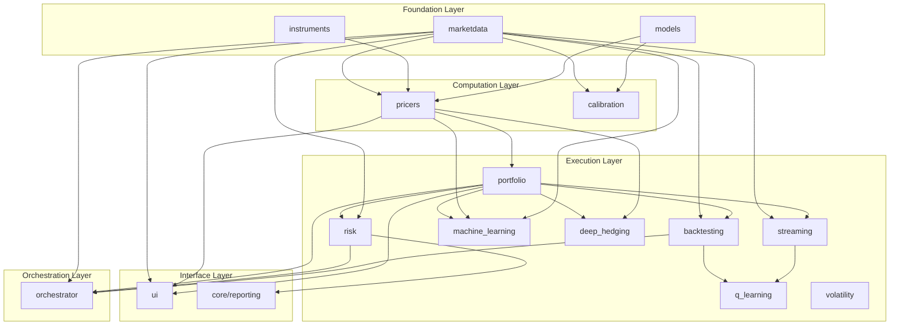

# QuantStrata Library — Architecture Overview

**Audience:** Quants, structurers, and developers  
**Purpose:** Single-document overview of the library’s design, components, workflows, and ecosystem  
**Last Updated:** January 2026

---

## 1. Introduction

QuantStrata is a **Python quantitative finance library** for derivatives pricing, risk, calibration, backtesting, and ML/RL applications. It is built as a **layered, protocol-based** system: instruments and models stay independent of market data and pricing glue, so you can mix asset classes, models, and numerics in a consistent way.

### 1.1 What the library covers

| Domain | Capabilities |
|--------|----------------|
| **Market data** | Curves, volatility surfaces, scenarios, time series, static/synthetic/historical/streaming providers |
| **Instruments** | FX, equity, IR (vanilla, barrier, digital, Asian, lookback, touch; swaps, caps, swaptions; exotics: cliquet, autocallable, range accrual) |
| **Models** | BSM, Black76, Bachelier; local vol, Heston, SABR; Hull-White, Black-Karasinski; jump-diffusion, variance gamma; Monte Carlo, finite difference; Neural SDE |
| **Pricing** | Analytic, MC, FD; pricer registry for instrument → pricer routing; portfolio-level aggregation |
| **Risk** | VaR (historical, parametric, MC), sensitivities, scenario analysis, P&L attribution |
| **Calibration** | SABR, Dupire, Heston, Hull-White; generic calibration engine |
| **Backtesting & streaming** | Historical backtest engine, streaming/live engine, same strategy interface |
| **ML/RL** | Generic ML training/inference, GNN-LSTM pricer, experiment tracking, tuning, model registry; Q-learning environments and runners; deep hedging (agents, costs, risk measures, backtesting adapters); Neural SDE |
| **Volatility & portfolio** | Variance swaps, dispersion, vol-of-vol; mean-variance, risk parity, Black-Litterman, covariance estimation |
| **Orchestration** | Pipelines (market data, pricing, risk, calibration, ML, portfolio, backtest, workflows), context, artifacts, CLI |

### 1.2 Design goals

- **Separation of concerns:** Instruments = definitions; models = pure math; pricers = adapters (market → model); portfolio = aggregation.
- **Protocol-based interfaces:** `Curve`, `VolSurface`, `MarketDataProvider`, `InstrumentPricer`, `Trainable`, etc., so implementations are swappable.
- **Layered dependencies:** Foundation (marketdata, instruments, models) has no internal cross-deps; higher layers depend only downward.
- **Production-oriented:** Type hints, docstrings, unit tests, reference docs, pipelines, and example scripts for key workflows.

---

## 2. Architecture at a Glance

The library is organised into five layers. Data and definitions sit at the bottom; execution and orchestration at the top.

- **Foundation:** `marketdata` (curves, surfaces, scenarios, providers), `instruments` (trade definitions), `models` (analytic formulae, payoffs, numeric methods, Neural SDE).
- **Computation:** `pricers` (instrument + market → model → price/Greeks), `calibration` (market quotes → model parameters).
- **Execution:** `portfolio` (positions, aggregation, pricing via registry), `risk` (VaR, sensitivities, scenarios), `backtesting`, `streaming`, `machine_learning`, `deep_hedging`, `q_learning`, `volatility` (variance swaps, dispersion, vol-of-vol).
- **Orchestration:** `orchestrator` (pipelines, steps, context, artifacts, CLI).
- **Interface:** `ui` (e.g. Dash pricing calculator), `core/reporting` (plots, export).

Detailed module-by-module reference: [Component Reference](component_reference.md).  
Workflow and dependency diagrams: [Ecosystem Diagrams](ecosystem_diagrams.md).

---

## 3. Design Principles

| Principle | Description |
|-----------|-------------|
| **Separation of concerns** | Instruments hold no pricing logic; models take only parameters (no `Market`); pricers map market + instrument → model inputs and call models. |
| **Protocol-based interfaces** | `Curve`, `VolSurface`, `MarketDataProvider`, `InstrumentPricer`, `Trainable`, `RLAgent`, `RLEnvironment` are protocols; multiple implementations can coexist. |
| **Immutability** | Core objects are frozen dataclasses (`Market`, `MarketId`, `Portfolio`, many steps); state is explicit in `Context.state`. |
| **Registry pattern** | `PricerRegistry` maps instrument type → pricer; `PipelineRegistry` discovers pipelines; new pricers/pipelines can be registered without changing core code. |
| **Layered dependencies** | Foundation has no internal library dependencies; each layer depends only on layers below it. |

---

## 4. Layer-by-Layer Component Summary

### 4.1 Foundation Layer

**marketdata**  
- **Role:** Quotes, curves, volatility surfaces, scenarios, time series, and providers.  
- **Key types:** `Market`, `MarketId`, `Quote`, `Curve` (protocol), `VolSurface` (protocol), `MarketDataset`, `MarketDataProvider` (protocol), `ScenarioShock` and concrete shocks (`SpotShock`, `VolShock`, `ParallelRateShock`, etc.).  
- **Structure:** `core/` (market, ids, interfaces, dataset, panel, requests), `curves/` (term structures, bootstrapper), `surfaces/` (vol, local vol, FX calibration), `providers/` (static, synthetic, historical, hybrid, streaming), `scenarios/` (shocks, runner).  
- **Dependencies:** NumPy only (foundation).

**instruments**  
- **Role:** Trade definitions only (no pricing).  
- **Key types:** FX/equity/IR/multi-asset instruments (vanilla, barrier, digital, Asian, lookback, touch; cliquet, autocallable; swap, cap, swaption, range accrual; basket, rainbow, spread). All frozen dataclasses with `MarketId` references for spot, vol, curve.  
- **Structure:** `core/types.py`, `fx/`, `equity/`, `ir/`, `multi_asset/`.  
- **Dependencies:** `marketdata.core.ids.MarketId`, payoff types from `models.payoffs.types`.

**models**  
- **Role:** Pure mathematics: analytic formulae, payoffs, dynamics, numeric methods. No market objects.  
- **Key types:** BSM/Black76/Bachelier engines, Heston/SABR dynamics, Hull-White/Black-Karasinski, jump-diffusion, variance gamma; `VanillaPayoff`, `BarrierPayoff`, `CliquetPayoff`, `AutocallablePayoff`, `RangeAccrualPayoff`, etc.; `PayoffFactory`; MC (estimators, RNG, control variates), FD (grids, operators, schemes, solvers); Neural SDE (networks, solvers, dynamics, training, generation).  
- **Structure:** `analytic/`, `stochastic_volatility/`, `short_rate/`, `jump_diffusion/`, `levy/`, `dynamics/`, `payoffs/`, `numeric/` (monte_carlo, finite_difference), `neural_sde/` (where implemented).  
- **Dependencies:** NumPy, SciPy (foundation).

### 4.2 Computation Layer

**pricers**  
- **Role:** Adaptors: resolve market data from `Market` via `MarketId`, call model layer, return price and Greeks.  
- **Protocol:** `InstrumentPricer`: `price(instrument, market) -> float`, `greeks(instrument, market) -> Dict[str, float]`.  
- **Key types:** `PricerRegistry`, asset-class pricers (FX, equity, IR, multi-asset, exotics: cliquet, autocallable, range accrual). Naming: `{product}_{model}_{method}.py` (e.g. `european_bsm_mc.py`, `cliquet_gbm_mc.py`).  
- **Dependencies:** `marketdata`, `instruments`, `models`.

**calibration**  
- **Role:** Fit model parameters to market (e.g. vol surface, curve).  
- **Key types:** `CalibrationEngine`, SABR/Dupire/Heston/Hull-White calibrators, objective functions, optimisers.  
- **Dependencies:** `models`, `marketdata.surfaces`.

### 4.3 Execution Layer

**portfolio**  
- **Role:** Hold positions, price via `PricerRegistry`, aggregate results.  
- **Key types:** `Position`, `Portfolio`, `PortfolioPricer`, `ParallelPortfolioPricer`, `PortfolioResult`, `PortfolioTotals`.  
- **Dependencies:** `pricers.registry`, `marketdata.core.market`.

**risk**  
- **Role:** VaR (historical, parametric, MC), sensitivities (bump/reval or analytic), scenario analysis, P&L attribution.  
- **Key types:** `compute_var()`, `compute_sensitivities()`, `run_portfolio_scenarios()`, `VarResult`, `SensitivitiesReport`, scenario and attribution reports.  
- **Dependencies:** `portfolio`, `marketdata.scenarios`, `pricers`.

**backtesting**  
- **Role:** Run strategies on historical data with performance metrics.  
- **Key types:** `BacktestEngine`, `BacktestConfig`, `BacktestResult`, `PerformanceMetrics`, data adapters and providers.  
- **Strategy signature:** `(market, portfolio, context) -> Sequence[Order]`.  
- **Dependencies:** `marketdata.providers`, `portfolio`.

**streaming**  
- **Role:** Run the same strategy interface on live or paper streams.  
- **Key types:** `StreamingEngine`, `BrokerageAdapter` (protocol), `PaperBrokerageAdapter`, `LiveContext`.  
- **Dependencies:** `marketdata.providers.streaming`, `portfolio`.

**machine_learning**  
- **Role:** Training, evaluation, inference; data prep for pricing/calibration/GNN; production ML (tracking, tuning, registry).  
- **Key types:** `Trainable` protocol, `run_training()`, `Trainer`, `TrainingManager`, GNN-RNN hybrid model, `build_pricing_data`, `build_calibration_dataset`, `build_gnn_data`, experiment trackers, `SearchSpace`, `ModelRegistry`.  
- **Dependencies:** `portfolio`, `pricers`, `marketdata`; optional TensorFlow.

**deep_hedging**  
- **Role:** RL-based hedging: environments (GBM, multi-asset, historical), transaction costs, risk measures (variance, CVaR, entropic), deep and delta-hedging agents, training, evaluation, backtesting adapters.  
- **Key types:** `HedgingEnvironment`, `GBMHedgingEnv`, `MultiAssetHedgingEnv`, `HistoricalHedgingEnv`, `DeepHedgingAgent`, `DeltaHedgingAgent`, cost models, `HedgingTrainer`, `BacktestEngineAdapter`, `HistoricalDataAdapter`, `HedgingBacktestMetrics`.  
- **Dependencies:** Pricers (Greeks), MC simulation, backtesting; conceptually RL framework (7.2).

**q_learning**  
- **Role:** Generic RL: environments (trading, hedging, streaming), runners (backtest, live), training/evaluation/inference pipelines.  
- **Key types:** `RLAgent`, `RLEnvironment`, `TradingEnvironment`, `HedgingEnvironment`, `StreamingEnvironment`, `BacktestRunner`, `LiveRunner`, `run_training()`, `evaluate_agent()`, `save_agent()`/`load_agent()`.  
- **Dependencies:** Backtesting, streaming, pricers for envs.

**volatility**  
- **Role:** Variance swap pricing, dispersion trading, vol-of-vol analytics.  
- **Key types:** `VarianceSwap`, `VarianceSwapPricer`, `DispersionTrader`, `VolOfVolAnalyzer`.  
- **Dependencies:** Vol surface, multi-asset where relevant.

**portfolio (optimisation)**  
- **Role:** Mean-variance, risk parity, Black-Litterman; covariance estimation (sample, EWM, shrinkage).  
- **Key types:** `MeanVarianceOptimizer`, `RiskParityOptimizer`, `BlackLittermanModel`, `CovarianceEstimator`, `ShrinkageEstimator`.  
- **Dependencies:** `portfolio` module, risk infrastructure.

### 4.4 Orchestration Layer

**orchestrator**  
- **Role:** Define and run pipelines (sequences of steps), shared context, artifact store, CLI.  
- **Key types:** `Pipeline`, `PipelineRunner`, `Context` (run_id, config, logger, artifact_store, state), `Step` (protocol), `PipelineRegistry`, `ArtifactStore`, `run_pipeline_from_config()`.  
- **Pipelines:** Market data (build curves, vol surface, timeseries, replay), portfolio (build from config, construct hedge, optimise), pricing (price portfolio), risk (sensitivities, VaR, scenarios, validate Greeks, PnL attribution), calibration (short rate, stochastic vol, vol surface), ML (hyperparameter tuning, train GNN/deep hedging/calibration), backtest (run strategy, model comparison), workflow (hedging simulation, options desk daily, trade lifecycle).  
- **Dependencies:** `portfolio`, `risk`, `marketdata` (and thus downstream modules as needed).

Full pipeline list and usage: [Orchestrator Pipeline Documentation](orchestrator_pipeline_documentation.md).

### 4.5 Interface Layer

**ui**  
- **Role:** Dash apps (e.g. FX vanilla pricing calculator).  
- **Key types:** `create_pricing_calculator_app()`, shared layout and components.  
- **Dependencies:** `dash`, `marketdata`, `instruments`, `pricers`.

**core/reporting**  
- **Role:** Plotting and export (curves, surfaces, scenarios, Greeks, PnL, portfolio).  
- **Key types:** Style, utils, marketdata/portfolio/pricers/risk plot modules.  
- **Dependencies:** Matplotlib, library modules for data.

---

## 5. Key Workflows

### 5.1 Single-instrument pricing

1. **Instrument** (e.g. `FxVanillaEuropeanOption`) carries `spot_id`, `vol_id`, `curve_id` (`MarketId`s).  
2. **Market** supplies quotes, curves, vol surface for those ids.  
3. **PricerRegistry** resolves instrument type → pricer (e.g. `FxVanillaEuropeanOptionBsmPricer`).  
4. **Pricer** reads spot, discount curve, implied vol from market, calls e.g. `bsm_vanilla_price()` / `bsm_vanilla_greeks()`, returns PV and Greeks.

See [Ecosystem Diagrams — Pricing Flow](ecosystem_diagrams.md) for a diagram.

### 5.2 Portfolio pricing and risk

1. **Portfolio** holds a list of **Position** (instrument, quantity, metadata).  
2. **PortfolioPricer** uses **PricerRegistry** to price each position under a **Market**, aggregates into **PortfolioResult** (per-position results + **PortfolioTotals**).  
3. **Risk:**  
   - **Sensitivities:** `compute_sensitivities(portfolio, market)` → bump/reval or analytic → **SensitivitiesReport**.  
   - **Scenarios:** `run_portfolio_scenarios(portfolio, market, shocks)` → shocked markets → reprice → **ScenarioResult**.  
   - **VaR:** `compute_var(portfolio, market, config)` → historical/parametric/MC → **VarResult**.

See [Ecosystem Diagrams — Portfolio Pricing Flow, Risk Computation Flow](ecosystem_diagrams.md).

### 5.3 Calibration

1. Market quotes (e.g. option prices or implied vols) and structure (strikes, expiries, forward).  
2. **CalibrationEngine** or model-specific entry points (e.g. `calibrate_sabr_to_smile`, `calibrate_heston`, `calibrate_hull_white`, Dupire) produce model parameters or surfaces.  
3. Calibrated parameters/surfaces are used by pricers (e.g. SABR/Heston/local vol pricers).

See [Ecosystem Diagrams — Calibration Flow](ecosystem_diagrams.md).

### 5.4 Backtesting and streaming

1. **Backtest:** A **MarketDataProvider** (e.g. historical, CSV) supplies time series of **Market**; **BacktestEngine** runs a **strategy(market, portfolio, context) → orders** each date; orders are filled with costs/slippage; **PerformanceMetrics** (Sharpe, drawdown, etc.) and **BacktestResult** are produced.  
2. **Streaming:** Same strategy interface; **StreamingMarketDataProtocol** yields (timestamp, Market); **StreamingEngine** calls strategy and passes orders to a **BrokerageAdapter** (paper or live).

See [Ecosystem Diagrams — Backtesting Flow, Streaming / Live Trading Flow](ecosystem_diagrams.md).

### 5.5 ML training and inference

1. **Data:** Build datasets (pricing from MC/analytic, calibration from IV, GNN from portfolio) via `machine_learning.data`.  
2. **Training:** Generic `run_training()` (Trainable + NumPy) or model-specific `Trainer`/`TrainingManager`; optional experiment tracking, hyperparameter tuning (e.g. Optuna), model registry.  
3. **Evaluation:** Standardised metrics and evaluation outputs.  
4. **Inference:** Load saved model (Trainable or Keras/SavedModel), run predictions; can be wired into pricers or reports.

### 5.6 Deep hedging

1. **Environment:** e.g. `GBMHedgingEnv`, `MultiAssetHedgingEnv`, or `HistoricalHedgingEnv` (with **HistoricalDataAdapter**).  
2. **Agents:** `DeepHedgingAgent` (policy network), `DeltaHedgingAgent` (benchmark).  
3. **Training:** **HedgingTrainer** / `train_deep_hedging()` with cost and risk-measure configuration.  
4. **Evaluation:** Hedging metrics (P&L distribution, costs, benchmark comparison).  
5. **Backtesting:** **BacktestEngineAdapter** and **HistoricalDataAdapter** connect trained agents to the backtesting framework for out-of-sample evaluation.

### 5.7 Neural SDE (where implemented)

1. **Neural SDE:** Drift and diffusion networks, SDE solvers (e.g. Euler-Maruyama), dynamics wrapper.  
2. **Training:** Score matching / likelihood-style losses, calibration to options, training pipeline with validation and checkpointing.  
3. **Use:** Path generation for pricing or scenario generation; optional MC pricer and Greeks via differentiation.

---

## 6. Pipeline Ecosystem

Pipelines live under `src/orchestrator/pipelines/` and are discovered via **PipelineRegistry**. Each pipeline is a list of **Step**s that read/write **Context.state** and optionally write to **ArtifactStore**.

| Area | Example pipelines |
|------|-------------------|
| **Market data** | `build_curves`, `build_vol_surface`, `build_timeseries`, `replay_static` |
| **Portfolio** | `build_from_config`, `construct_hedge`, `optimise_portfolio` |
| **Pricing** | `price_portfolio` |
| **Risk** | `compute_sensitivities`, `compute_var`, `run_scenarios`, `validate_greeks`, `pnl_attribution` |
| **Calibration** | `short_rate`, `stochastic_vol`, `volatility_surface` |
| **ML** | `hyperparameter_tuning`, `train_gnn_pricer`, `train_deep_hedging`, `train_calibration_model` |
| **Backtest** | `run_strategy`, `model_comparison` |
| **Workflow** | `hedging_simulation`, `options_desk_daily`, `trade_lifecycle` |

Example scripts that invoke pipelines live under `examples/pipelines/` (e.g. `run_portfolio_optimisation.py`, `run_hyperparameter_tuning.py`, `run_var.py`).  
Full list and configuration: [Orchestrator Pipeline Documentation](orchestrator_pipeline_documentation.md).

---

## 7. Data Flow and State

- **Market:** Immutable snapshot (asof, quotes, curves, vol surfaces) keyed by **MarketId**.  
- **Instruments:** Reference market data by **MarketId**; no market data stored inside.  
- **Pricing:** Instrument + Market → Pricer → model parameters from Market → model → PV/Greeks.  
- **Portfolio:** List of positions; pricing is stateless given (Portfolio, Market).  
- **Orchestrator:** State is in **Context.state** (dict); steps read/write it; **ArtifactStore** persists outputs (curves, surfaces, portfolio, results, models).  
- **Backtesting/streaming:** Strategy receives (market, portfolio_state, context) and returns orders; engine updates portfolio state and optional brokerage.

---

## 8. Technology Stack

- **Core:** Python 3.x, NumPy, SciPy.  
- **Optional:** TensorFlow/Keras (ML, GNN-RNN, deep hedging), JAX (optional MC backend), Numba (optional MC/FD kernels).  
- **Docs:** Sphinx, Markdown (reference, guides, tutorials).  
- **UI:** Dash.  
- **Orchestration:** YAML/JSON config, CLI entry points.

---

## 9. Where to Go Next

| Need | Document or location |
|------|------------------------|
| Module-by-module API and structure | [Component Reference](component_reference.md) |
| Mermaid diagrams (layers, pricing, risk, calibration, backtest, streaming, ML) | [Ecosystem Diagrams](ecosystem_diagrams.md) |
| Pipeline list, config, state keys, best practices | [Orchestrator Pipeline Documentation](orchestrator_pipeline_documentation.md) |
| High-level architecture and principles | [Architecture README](README.md) |
| Implementation status and checklist per phase | `docs/development/roadmap.md`, `docs/development/IMPLEMENTATION_CHECKLIST_REVIEW.md` |
| Reference docs (models, risk, ML, vol, portfolio, etc.) | `docs/reference/` |
| How-to guides | `docs/guides/` |
| Tutorial notebooks | `docs/tutorials/` |
| Example scripts | `examples/` (fundamentals, pricing, risk, pipelines, workflows, showcase) |

---

*This overview is the recommended entry point for quants and developers to understand how QuantStrata is structured and how its components interact. For implementation details and API, use the Component Reference and the referenced docs.*
