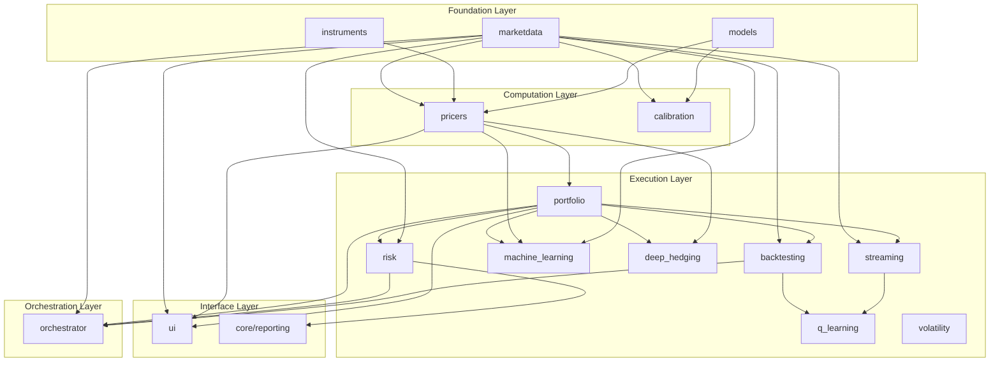

# QuantStrata Library — Architecture Overview

**Audience:** Quants, structurers, and developers  
**Purpose:** Single-document overview of the library’s design, components, workflows, and ecosystem  
**Last Updated:** January 2026

---

## 1. Introduction

QuantStrata is a **Python quantitative finance library** for derivatives pricing, risk, calibration, backtesting, and ML/RL applications. It is built as a **layered, protocol-based** system: instruments and models stay independent of market data and pricing glue, so you can mix asset classes, models, and numerics in a consistent way.

### 1.1 What the library covers

| Domain | Capabilities |
|--------|----------------|
| **Market data** | Curves, volatility surfaces, scenarios, time series, static/synthetic/historical/streaming providers |
| **Instruments** | FX, equity, IR (vanilla, barrier, digital, Asian, lookback, touch; swaps, caps, swaptions; exotics: cliquet, autocallable, range accrual) |
| **Models** | BSM, Black76, Bachelier; local vol, Heston, SABR; Hull-White, Black-Karasinski; jump-diffusion, variance gamma; Monte Carlo, finite difference; Neural SDE |
| **Pricing** | Analytic, MC, FD; pricer registry for instrument → pricer routing; portfolio-level aggregation |
| **Risk** | VaR (historical, parametric, MC), sensitivities, scenario analysis, P&L attribution |
| **Calibration** | SABR, Dupire, Heston, Hull-White; generic calibration engine |
| **Backtesting & streaming** | Historical backtest engine, streaming/live engine, same strategy interface |
| **ML/RL** | Generic ML training/inference, GNN-LSTM pricer, experiment tracking, tuning, model registry; Q-learning environments and runners; deep hedging (agents, costs, risk measures, backtesting adapters); Neural SDE |
| **Volatility & portfolio** | Variance swaps, dispersion, vol-of-vol; mean-variance, risk parity, Black-Litterman, covariance estimation |
| **Orchestration** | Pipelines (market data, pricing, risk, calibration, ML, portfolio, backtest, workflows), context, artifacts, CLI |

### 1.2 Design goals

- **Separation of concerns:** Instruments = definitions; models = pure math; pricers = adapters (market → model); portfolio = aggregation.
- **Protocol-based interfaces:** `Curve`, `VolSurface`, `MarketDataProvider`, `InstrumentPricer`, `Trainable`, etc., so implementations are swappable.
- **Layered dependencies:** Foundation (marketdata, instruments, models) has no internal cross-deps; higher layers depend only downward.
- **Production-oriented:** Type hints, docstrings, unit tests, reference docs, pipelines, and example scripts for key workflows.

---

## 2. Architecture at a Glance

The library is organised into five layers. Data and definitions sit at the bottom; execution and orchestration at the top.



- **Foundation:** `marketdata` (curves, surfaces, scenarios, providers), `instruments` (trade definitions), `models` (analytic formulae, payoffs, numeric methods, Neural SDE).
- **Computation:** `pricers` (instrument + market → model → price/Greeks), `calibration` (market quotes → model parameters).
- **Execution:** `portfolio` (positions, aggregation, pricing via registry), `risk` (VaR, sensitivities, scenarios), `backtesting`, `streaming`, `machine_learning`, `deep_hedging`, `q_learning`, `volatility` (variance swaps, dispersion, vol-of-vol).
- **Orchestration:** `orchestrator` (pipelines, steps, context, artifacts, CLI).
- **Interface:** `ui` (e.g. Dash pricing calculator), `core/reporting` (plots, export).

Detailed module-by-module reference: [Component Reference](component_reference.md).  
Workflow and dependency diagrams: [Ecosystem Diagrams](ecosystem_diagrams.md).

---

## 3. Design Principles

| Principle | Description |
|-----------|-------------|
| **Separation of concerns** | Instruments hold no pricing logic; models take only parameters (no `Market`); pricers map market + instrument → model inputs and call models. |
| **Protocol-based interfaces** | `Curve`, `VolSurface`, `MarketDataProvider`, `InstrumentPricer`, `Trainable`, `RLAgent`, `RLEnvironment` are protocols; multiple implementations can coexist. |
| **Immutability** | Core objects are frozen dataclasses (`Market`, `MarketId`, `Portfolio`, many steps); state is explicit in `Context.state`. |
| **Registry pattern** | `PricerRegistry` maps instrument type → pricer; `PipelineRegistry` discovers pipelines; new pricers/pipelines can be registered without changing core code. |
| **Layered dependencies** | Foundation has no internal library dependencies; each layer depends only on layers below it. |

---

## 4. Layer-by-Layer Component Summary

### 4.1 Foundation Layer

**marketdata**  
- **Role:** Quotes, curves, volatility surfaces, scenarios, time series, and providers.  
- **Key types:** `Market`, `MarketId`, `Quote`, `Curve` (protocol), `VolSurface` (protocol), `MarketDataset`, `MarketDataProvider` (protocol), `ScenarioShock` and concrete shocks (`SpotShock`, `VolShock`, `ParallelRateShock`, etc.).  
- **Structure:** `core/` (market, ids, interfaces, dataset, panel, requests), `curves/` (term structures, bootstrapper), `surfaces/` (vol, local vol, FX calibration), `providers/` (static, synthetic, historical, hybrid, streaming), `scenarios/` (shocks, runner).  
- **Dependencies:** NumPy only (foundation).

**instruments**  
- **Role:** Trade definitions only (no pricing).  
- **Key types:** FX/equity/IR/multi-asset instruments (vanilla, barrier, digital, Asian, lookback, touch; cliquet, autocallable; swap, cap, swaption, range accrual; basket, rainbow, spread). All frozen dataclasses with `MarketId` references for spot, vol, curve.  
- **Structure:** `core/types.py`, `fx/`, `equity/`, `ir/`, `multi_asset/`.  
- **Dependencies:** `marketdata.core.ids.MarketId`, payoff types from `models.payoffs.types`.

**models**  
- **Role:** Pure mathematics: analytic formulae, payoffs, dynamics, numeric methods. No market objects.  
- **Key types:** BSM/Black76/Bachelier engines, Heston/SABR dynamics, Hull-White/Black-Karasinski, jump-diffusion, variance gamma; `VanillaPayoff`, `BarrierPayoff`, `CliquetPayoff`, `AutocallablePayoff`, `RangeAccrualPayoff`, etc.; `PayoffFactory`; MC (estimators, RNG, control variates), FD (grids, operators, schemes, solvers); Neural SDE (networks, solvers, dynamics, training, generation).  
- **Structure:** `analytic/`, `stochastic_volatility/`, `short_rate/`, `jump_diffusion/`, `levy/`, `dynamics/`, `payoffs/`, `numeric/` (monte_carlo, finite_difference), `neural_sde/` (where implemented).  
- **Dependencies:** NumPy, SciPy (foundation).

### 4.2 Computation Layer

**pricers**  
- **Role:** Adaptors: resolve market data from `Market` via `MarketId`, call model layer, return price and Greeks.  
- **Protocol:** `InstrumentPricer`: `price(instrument, market) -> float`, `greeks(instrument, market) -> Dict[str, float]`.  
- **Key types:** `PricerRegistry`, asset-class pricers (FX, equity, IR, multi-asset, exotics: cliquet, autocallable, range accrual). Naming: `{product}_{model}_{method}.py` (e.g. `european_bsm_mc.py`, `cliquet_gbm_mc.py`).  
- **Dependencies:** `marketdata`, `instruments`, `models`.

**calibration**  
- **Role:** Fit model parameters to market (e.g. vol surface, curve).  
- **Key types:** `CalibrationEngine`, SABR/Dupire/Heston/Hull-White calibrators, objective functions, optimisers.  
- **Dependencies:** `models`, `marketdata.surfaces`.

### 4.3 Execution Layer

**portfolio**  
- **Role:** Hold positions, price via `PricerRegistry`, aggregate results.  
- **Key types:** `Position`, `Portfolio`, `PortfolioPricer`, `ParallelPortfolioPricer`, `PortfolioResult`, `PortfolioTotals`.  
- **Dependencies:** `pricers.registry`, `marketdata.core.market`.

**risk**  
- **Role:** VaR (historical, parametric, MC), sensitivities (bump/reval or analytic), scenario analysis, P&L attribution.  
- **Key types:** `compute_var()`, `compute_sensitivities()`, `run_portfolio_scenarios()`, `VarResult`, `SensitivitiesReport`, scenario and attribution reports.  
- **Dependencies:** `portfolio`, `marketdata.scenarios`, `pricers`.

**backtesting**  
- **Role:** Run strategies on historical data with performance metrics.  
- **Key types:** `BacktestEngine`, `BacktestConfig`, `BacktestResult`, `PerformanceMetrics`, data adapters and providers.  
- **Strategy signature:** `(market, portfolio, context) -> Sequence[Order]`.  
- **Dependencies:** `marketdata.providers`, `portfolio`.

**streaming**  
- **Role:** Run the same strategy interface on live or paper streams.  
- **Key types:** `StreamingEngine`, `BrokerageAdapter` (protocol), `PaperBrokerageAdapter`, `LiveContext`.  
- **Dependencies:** `marketdata.providers.streaming`, `portfolio`.

**machine_learning**  
- **Role:** Training, evaluation, inference; data prep for pricing/calibration/GNN; production ML (tracking, tuning, registry).  
- **Key types:** `Trainable` protocol, `run_training()`, `Trainer`, `TrainingManager`, GNN-RNN hybrid model, `build_pricing_data`, `build_calibration_dataset`, `build_gnn_data`, experiment trackers, `SearchSpace`, `ModelRegistry`.  
- **Dependencies:** `portfolio`, `pricers`, `marketdata`; optional TensorFlow.

**deep_hedging**  
- **Role:** RL-based hedging: environments (GBM, multi-asset, historical), transaction costs, risk measures (variance, CVaR, entropic), deep and delta-hedging agents, training, evaluation, backtesting adapters.  
- **Key types:** `HedgingEnvironment`, `GBMHedgingEnv`, `MultiAssetHedgingEnv`, `HistoricalHedgingEnv`, `DeepHedgingAgent`, `DeltaHedgingAgent`, cost models, `HedgingTrainer`, `BacktestEngineAdapter`, `HistoricalDataAdapter`, `HedgingBacktestMetrics`.  
- **Dependencies:** Pricers (Greeks), MC simulation, backtesting; conceptually RL framework (7.2).

**q_learning**  
- **Role:** Generic RL: environments (trading, hedging, streaming), runners (backtest, live), training/evaluation/inference pipelines.  
- **Key types:** `RLAgent`, `RLEnvironment`, `TradingEnvironment`, `HedgingEnvironment`, `StreamingEnvironment`, `BacktestRunner`, `LiveRunner`, `run_training()`, `evaluate_agent()`, `save_agent()`/`load_agent()`.  
- **Dependencies:** Backtesting, streaming, pricers for envs.

**volatility**  
- **Role:** Variance swap pricing, dispersion trading, vol-of-vol analytics.  
- **Key types:** `VarianceSwap`, `VarianceSwapPricer`, `DispersionTrader`, `VolOfVolAnalyzer`.  
- **Dependencies:** Vol surface, multi-asset where relevant.

**portfolio (optimisation)**  
- **Role:** Mean-variance, risk parity, Black-Litterman; covariance estimation (sample, EWM, shrinkage).  
- **Key types:** `MeanVarianceOptimizer`, `RiskParityOptimizer`, `BlackLittermanModel`, `CovarianceEstimator`, `ShrinkageEstimator`.  
- **Dependencies:** `portfolio` module, risk infrastructure.

### 4.4 Orchestration Layer

**orchestrator**  
- **Role:** Define and run pipelines (sequences of steps), shared context, artifact store, CLI.  
- **Key types:** `Pipeline`, `PipelineRunner`, `Context` (run_id, config, logger, artifact_store, state), `Step` (protocol), `PipelineRegistry`, `ArtifactStore`, `run_pipeline_from_config()`.  
- **Pipelines:** Market data (build curves, vol surface, timeseries, replay), portfolio (build from config, construct hedge, optimise), pricing (price portfolio), risk (sensitivities, VaR, scenarios, validate Greeks, PnL attribution), calibration (short rate, stochastic vol, vol surface), ML (hyperparameter tuning, train GNN/deep hedging/calibration), backtest (run strategy, model comparison), workflow (hedging simulation, options desk daily, trade lifecycle).  
- **Dependencies:** `portfolio`, `risk`, `marketdata` (and thus downstream modules as needed).

Full pipeline list and usage: [Orchestrator Pipeline Documentation](orchestrator_pipeline_documentation.md).

### 4.5 Interface Layer

**ui**  
- **Role:** Dash apps (e.g. FX vanilla pricing calculator).  
- **Key types:** `create_pricing_calculator_app()`, shared layout and components.  
- **Dependencies:** `dash`, `marketdata`, `instruments`, `pricers`.

**core/reporting**  
- **Role:** Plotting and export (curves, surfaces, scenarios, Greeks, PnL, portfolio).  
- **Key types:** Style, utils, marketdata/portfolio/pricers/risk plot modules.  
- **Dependencies:** Matplotlib, library modules for data.

---

## 5. Key Workflows

### 5.1 Single-instrument pricing

1. **Instrument** (e.g. `FxVanillaEuropeanOption`) carries `spot_id`, `vol_id`, `curve_id` (`MarketId`s).  
2. **Market** supplies quotes, curves, vol surface for those ids.  
3. **PricerRegistry** resolves instrument type → pricer (e.g. `FxVanillaEuropeanOptionBsmPricer`).  
4. **Pricer** reads spot, discount curve, implied vol from market, calls e.g. `bsm_vanilla_price()` / `bsm_vanilla_greeks()`, returns PV and Greeks.

See [Ecosystem Diagrams — Pricing Flow](ecosystem_diagrams.md) for a diagram.

### 5.2 Portfolio pricing and risk

1. **Portfolio** holds a list of **Position** (instrument, quantity, metadata).  
2. **PortfolioPricer** uses **PricerRegistry** to price each position under a **Market**, aggregates into **PortfolioResult** (per-position results + **PortfolioTotals**).  
3. **Risk:**  
   - **Sensitivities:** `compute_sensitivities(portfolio, market)` → bump/reval or analytic → **SensitivitiesReport**.  
   - **Scenarios:** `run_portfolio_scenarios(portfolio, market, shocks)` → shocked markets → reprice → **ScenarioResult**.  
   - **VaR:** `compute_var(portfolio, market, config)` → historical/parametric/MC → **VarResult**.

See [Ecosystem Diagrams — Portfolio Pricing Flow, Risk Computation Flow](ecosystem_diagrams.md).

### 5.3 Calibration

1. Market quotes (e.g. option prices or implied vols) and structure (strikes, expiries, forward).  
2. **CalibrationEngine** or model-specific entry points (e.g. `calibrate_sabr_to_smile`, `calibrate_heston`, `calibrate_hull_white`, Dupire) produce model parameters or surfaces.  
3. Calibrated parameters/surfaces are used by pricers (e.g. SABR/Heston/local vol pricers).

See [Ecosystem Diagrams — Calibration Flow](ecosystem_diagrams.md).

### 5.4 Backtesting and streaming

1. **Backtest:** A **MarketDataProvider** (e.g. historical, CSV) supplies time series of **Market**; **BacktestEngine** runs a **strategy(market, portfolio, context) → orders** each date; orders are filled with costs/slippage; **PerformanceMetrics** (Sharpe, drawdown, etc.) and **BacktestResult** are produced.  
2. **Streaming:** Same strategy interface; **StreamingMarketDataProtocol** yields (timestamp, Market); **StreamingEngine** calls strategy and passes orders to a **BrokerageAdapter** (paper or live).

See [Ecosystem Diagrams — Backtesting Flow, Streaming / Live Trading Flow](ecosystem_diagrams.md).

### 5.5 ML training and inference

1. **Data:** Build datasets (pricing from MC/analytic, calibration from IV, GNN from portfolio) via `machine_learning.data`.  
2. **Training:** Generic `run_training()` (Trainable + NumPy) or model-specific `Trainer`/`TrainingManager`; optional experiment tracking, hyperparameter tuning (e.g. Optuna), model registry.  
3. **Evaluation:** Standardised metrics and evaluation outputs.  
4. **Inference:** Load saved model (Trainable or Keras/SavedModel), run predictions; can be wired into pricers or reports.

### 5.6 Deep hedging

1. **Environment:** e.g. `GBMHedgingEnv`, `MultiAssetHedgingEnv`, or `HistoricalHedgingEnv` (with **HistoricalDataAdapter**).  
2. **Agents:** `DeepHedgingAgent` (policy network), `DeltaHedgingAgent` (benchmark).  
3. **Training:** **HedgingTrainer** / `train_deep_hedging()` with cost and risk-measure configuration.  
4. **Evaluation:** Hedging metrics (P&L distribution, costs, benchmark comparison).  
5. **Backtesting:** **BacktestEngineAdapter** and **HistoricalDataAdapter** connect trained agents to the backtesting framework for out-of-sample evaluation.

### 5.7 Neural SDE (where implemented)

1. **Neural SDE:** Drift and diffusion networks, SDE solvers (e.g. Euler-Maruyama), dynamics wrapper.  
2. **Training:** Score matching / likelihood-style losses, calibration to options, training pipeline with validation and checkpointing.  
3. **Use:** Path generation for pricing or scenario generation; optional MC pricer and Greeks via differentiation.

---

## 6. Pipeline Ecosystem

Pipelines live under `src/orchestrator/pipelines/` and are discovered via **PipelineRegistry**. Each pipeline is a list of **Step**s that read/write **Context.state** and optionally write to **ArtifactStore**.

| Area | Example pipelines |
|------|-------------------|
| **Market data** | `build_curves`, `build_vol_surface`, `build_timeseries`, `replay_static` |
| **Portfolio** | `build_from_config`, `construct_hedge`, `optimise_portfolio` |
| **Pricing** | `price_portfolio` |
| **Risk** | `compute_sensitivities`, `compute_var`, `run_scenarios`, `validate_greeks`, `pnl_attribution` |
| **Calibration** | `short_rate`, `stochastic_vol`, `volatility_surface` |
| **ML** | `hyperparameter_tuning`, `train_gnn_pricer`, `train_deep_hedging`, `train_calibration_model` |
| **Backtest** | `run_strategy`, `model_comparison` |
| **Workflow** | `hedging_simulation`, `options_desk_daily`, `trade_lifecycle` |

Example scripts that invoke pipelines live under `examples/pipelines/` (e.g. `run_portfolio_optimisation.py`, `run_hyperparameter_tuning.py`, `run_var.py`).  
Full list and configuration: [Orchestrator Pipeline Documentation](orchestrator_pipeline_documentation.md).


# Orchestrator Pipeline Documentation

**Version:** 1.0  
**Last Updated:** 2026-01-27  
**Status:** Comprehensive Reference

---

## Table of Contents

1. [Overview](#1-overview)
2. [Pipeline Architecture](#2-pipeline-architecture)
3. [Directory Structure](#3-directory-structure)
4. [Pipeline Reference](#4-pipeline-reference)
   - [4.1 Market Data Pipelines](#41-market-data-pipelines)
   - [4.2 Portfolio Pipelines](#42-portfolio-pipelines)
   - [4.3 Pricing Pipelines](#43-pricing-pipelines)
   - [4.4 Risk Pipelines](#44-risk-pipelines)
   - [4.5 Calibration Pipelines](#45-calibration-pipelines)
   - [4.6 Machine Learning Pipelines](#46-machine-learning-pipelines)
   - [4.7 Backtesting Pipelines](#47-backtesting-pipelines)
   - [4.8 End-to-End Workflow Pipelines](#48-end-to-end-workflow-pipelines)
5. [State Keys Reference](#5-state-keys-reference)
6. [Configuration Reference](#6-configuration-reference)
7. [Best Practices](#7-best-practices)

---

## 1. Overview

### 1.1 Purpose

The orchestrator module provides a **standardised framework** for building end-to-end quantitative finance workflows. Each pipeline is a sequence of **atomic steps** that:

- Transform data through well-defined interfaces
- Pass state via a shared `Context` object
- Support checkpointing, logging, and artifact persistence
- Enable composition into larger workflows

### 1.2 Design Principles

| Principle | Description |
|-----------|-------------|
| **Atomicity** | Each step performs one logical operation |
| **Idempotency** | Steps can be re-run safely with same inputs |
| **Fail-Fast** | Validate inputs early with clear error messages |
| **Composability** | Pipelines can be chained or nested |
| **Traceability** | Full logging and artifact trail for audit |

### 1.3 Core Concepts

```
┌─────────────────────────────────────────────────────────────────┐
│                         ORCHESTRATOR                            │
├─────────────────────────────────────────────────────────────────┤
│                                                                 │
│   RunConfig ──► Pipeline ──► Context ──► ArtifactStore         │
│       │            │            │              │                │
│       │            │            │              │                │
│   (YAML/JSON)   (Steps)     (State)      (Outputs)             │
│                                                                 │
│   Pipeline = [Step₁, Step₂, ..., Stepₙ]                        │
│                                                                 │
│   Each Step:                                                    │
│     - Reads from ctx.state (inputs)                            │
│     - Performs computation                                      │
│     - Writes to ctx.state (outputs)                            │
│     - Optionally writes to artifact_store                      │
│                                                                 │
└─────────────────────────────────────────────────────────────────┘
```

---

## 2. Pipeline Architecture

### 2.1 Context Object

The `Context` is the shared state container passed between steps:

```python
@dataclass
class Context:
    run_id: RunId              # Unique run identifier
    cfg: RunConfig             # Pipeline configuration
    logger: Logger             # Run logger
    artifact_store: ArtifactStore  # For persisting outputs
    provider: Optional[object] # Market data provider
    state: Dict[str, Any]      # Mutable state dictionary
```

### 2.2 Step Interface

Every step implements the `Step` protocol:

```python
@dataclass(frozen=True)
class Step:
    name: str  # Unique step identifier
    
    def run(self, ctx: Context) -> Context:
        """Execute step logic, return updated context."""
        ...
```

### 2.3 Pipeline Execution Flow

```
                    ┌──────────────┐
                    │  RunConfig   │
                    └──────┬───────┘
                           │
                           ▼
              ┌────────────────────────┐
              │   Pipeline.run(ctx)    │
              └────────────┬───────────┘
                           │
         ┌─────────────────┼─────────────────┐
         ▼                 ▼                 ▼
    ┌─────────┐       ┌─────────┐       ┌─────────┐
    │  Step₁  │ ───►  │  Step₂  │ ───►  │  Step₃  │
    └─────────┘       └─────────┘       └─────────┘
         │                 │                 │
         ▼                 ▼                 ▼
    ctx.state         ctx.state         ctx.state
    updated           updated           updated
```

---

## 3. Directory Structure

### 3.1 Pipeline Organisation

```
src/orchestrator/pipelines/
│
├── __init__.py
│
├── marketdata/                    # Market data acquisition & transformation
│   ├── __init__.py
│   ├── build_timeseries.py        # [EXISTING] Build timeseries dataset
│   ├── replay_static.py           # [EXISTING] Replay static dataset
│   ├── build_curves.py            # [NEW] Bootstrap yield curves
│   └── build_vol_surface.py       # [NEW] Build volatility surface
│
├── portfolio/                     # Portfolio construction & management
│   ├── __init__.py
│   ├── build_from_config.py       # [NEW] Build portfolio from config
│   └── construct_hedge.py         # [NEW] Construct hedge portfolio
│
├── pricing/                       # Pricing operations
│   ├── __init__.py
│   └── price_portfolio.py         # [EXISTING] Price portfolio
│
├── risk/                          # Risk analytics
│   ├── __init__.py
│   ├── run_scenarios.py           # [EXISTING] Run scenario analysis
│   ├── compute_sensitivities.py   # [NEW] Compute Greeks
│   ├── compute_var.py             # [NEW] Compute Value-at-Risk
│   ├── pnl_attribution.py         # [NEW] P&L attribution
│   └── validate_greeks.py         # [NEW] Greeks validation
│
├── calibration/                   # Model calibration
│   ├── __init__.py
│   ├── volatility_surface.py      # [NEW] Calibrate vol surface
│   ├── stochastic_vol.py          # [NEW] Calibrate Heston
│   └── short_rate.py              # [NEW] Calibrate Hull-White
│
├── ml/                            # Machine learning training
│   ├── __init__.py
│   ├── train_deep_hedging.py      # [NEW] Train deep hedging agent
│   ├── train_gnn_pricer.py        # [NEW] Train GNN pricing model
│   └── train_calibration_model.py # [NEW] Train calibration accelerator
│
├── backtest/                      # Backtesting & validation
│   ├── __init__.py
│   ├── run_strategy.py            # [NEW] Run strategy backtest
│   └── model_comparison.py        # [NEW] Compare pricing models
│
└── workflow/                      # End-to-end workflows
    ├── __init__.py
    ├── options_desk_daily.py      # [NEW] Daily options desk workflow
    ├── trade_lifecycle.py         # [NEW] Trade lifecycle management
    └── hedging_simulation.py      # [NEW] Hedging simulation
```

### 3.2 Naming Conventions

| Element | Convention | Example |
|---------|------------|---------|
| Pipeline file | `snake_case.py` | `build_vol_surface.py` |
| Pipeline name | `category.action_object` | `marketdata.build_vol_surface` |
| Step class | `PascalCaseStep` | `BuildVolSurfaceStep` |
| State key | `SCREAMING_SNAKE_CASE` | `VOL_SURFACE` |
| Config block | `snake_case` | `vol_surface_config` |

---

## 4. Pipeline Reference

---

### 4.1 Market Data Pipelines

#### 4.1.1 `marketdata.build_timeseries` [EXISTING]

**Purpose:** Build a timeseries market dataset from synthetic or external providers.

**Pipeline Name:** `marketdata.build_timeseries`

**Steps:**

| Step | Name | Description |
|------|------|-------------|
| 1 | `BuildProviderStep` | Initialise market data provider (synthetic/external) |
| 2 | `BuildMarketIdsStep` | Parse and validate market identifiers |
| 3 | `BuildUniverseStep` | Create universe of instruments to fetch |
| 4 | `BuildTimeseriesRequestStep` | Build request with date range and frequency |
| 5 | `BuildDatasetStep` | Fetch and build `MarketDataset` |
| 6 | `BuildSnapshotStep` | Create point-in-time `Market` snapshot |

**Required Configuration:**

```yaml
params:
  marketdata:
    provider: "synthetic"          # Provider type: synthetic | static | hybrid
    universe:
      - "FX.SPOT.EURUSD"
      - "FX.VOL.EURUSD"
      - "IR.ZERO.USD"
    start_date: "2024-01-01"
    end_date: "2024-12-31"
    frequency: "1D"
    snapshot_date: "2024-06-30"    # Optional: date for snapshot
```

**State Outputs:**

| Key | Type | Description |
|-----|------|-------------|
| `DATASET` | `MarketDataset` | Full timeseries dataset |
| `MARKET` | `Market` | Point-in-time snapshot |
| `PROVIDER` | `MarketDataProvider` | Configured provider |

**Data Flow Diagram:**

```
┌─────────────┐    ┌─────────────┐    ┌─────────────┐
│   Config    │───►│  Provider   │───►│  Universe   │
└─────────────┘    └─────────────┘    └──────┬──────┘
                                             │
                                             ▼
┌─────────────┐    ┌─────────────┐    ┌─────────────┐
│   Market    │◄───│   Dataset   │◄───│   Request   │
│  (Snapshot) │    │ (Timeseries)│    │ (Dates/Freq)│
└─────────────┘    └─────────────┘    └─────────────┘
```

---

#### 4.1.2 `marketdata.replay_static` [EXISTING]

**Purpose:** Load a saved dataset and create a static provider for replay.

**Pipeline Name:** `marketdata.replay_static`

**Steps:**

| Step | Name | Description |
|------|------|-------------|
| 1 | `LoadDatasetStep` | Load `MarketDataset` from artifact store |
| 2 | `BuildStaticProviderStep` | Create `StaticProvider` from dataset |
| 3 | `SaveDatasetStep` | Optionally save to new location |

**Required Configuration:**

```yaml
params:
  marketdata:
    load_path: "datasets/fx_data_2024.pkl"
    save_path: "datasets/fx_data_replay.pkl"  # Optional
```

**State Outputs:**

| Key | Type | Description |
|-----|------|-------------|
| `DATASET` | `MarketDataset` | Loaded dataset |
| `PROVIDER` | `StaticProvider` | Static provider for queries |

---

#### 4.1.3 `marketdata.build_curves` [NEW]

**Purpose:** Bootstrap yield curves from market rate quotes (deposits, FRAs, swaps).

**Pipeline Name:** `marketdata.build_curves`

**Steps:**

| Step | Name | Description |
|------|------|-------------|
| 1 | `LoadRateQuotesStep` | Load rate quotes from provider or config |
| 2 | `ValidateQuotesStep` | Validate quote consistency and coverage |
| 3 | `BootstrapCurveStep` | Bootstrap discount factors using curve bootstrapper |
| 4 | `InterpolateCurveStep` | Apply interpolation method (log-linear, cubic) |
| 5 | `StoreCurveStep` | Store `TermStructure` in state and artifacts |

**Required Configuration:**

```yaml
params:
  curves:
    currency: "USD"
    curve_type: "zero"             # zero | discount | forward
    quotes:
      deposits:
        - { tenor: "1M", rate: 0.0525 }
        - { tenor: "3M", rate: 0.0530 }
      swaps:
        - { tenor: "1Y", rate: 0.0540 }
        - { tenor: "5Y", rate: 0.0485 }
        - { tenor: "10Y", rate: 0.0450 }
    interpolation: "log_linear"    # log_linear | cubic_spline | monotone
    day_count: "ACT/360"
    calendar: "US"
```

**State Outputs:**

| Key | Type | Description |
|-----|------|-------------|
| `RATE_QUOTES` | `List[RateQuote]` | Input quotes |
| `TERM_STRUCTURE` | `TermStructure` | Bootstrapped curve |
| `DISCOUNT_FACTORS` | `Dict[date, float]` | Discount factors by date |

**Data Flow Diagram:**

```
┌─────────────────┐    ┌─────────────────┐    ┌─────────────────┐
│   Rate Quotes   │───►│    Validate     │───►│   Bootstrap     │
│  (Deps, Swaps)  │    │  (Consistency)  │    │  (Solve DFs)    │
└─────────────────┘    └─────────────────┘    └────────┬────────┘
                                                       │
                                                       ▼
                       ┌─────────────────┐    ┌─────────────────┐
                       │  TermStructure  │◄───│   Interpolate   │
                       │    (Output)     │    │  (Log-linear)   │
                       └─────────────────┘    └─────────────────┘
```

**Functions Used:**

| Function | Module | Purpose |
|----------|--------|---------|
| `CurveBootstrapper.bootstrap()` | `src.marketdata.curves.bootstrapper` | Solve for discount factors |
| `LogLinearInterpolator` | `src.marketdata.curves.interpolation` | Interpolate between nodes |
| `TermStructureFactory.create()` | `src.marketdata.curves.factory` | Create curve object |

---

#### 4.1.4 `marketdata.build_vol_surface` [NEW]

**Purpose:** Build and validate a volatility surface from option quotes.

**Pipeline Name:** `marketdata.build_vol_surface`

**Steps:**

| Step | Name | Description |
|------|------|-------------|
| 1 | `LoadVolQuotesStep` | Load vol quotes (delta or strike conventions) |
| 2 | `ConvertQuotesStep` | Convert to standard strike/expiry format |
| 3 | `BuildRawSurfaceStep` | Build raw vol surface from quotes |
| 4 | `ValidateArbitrageStep` | Check calendar/butterfly arbitrage constraints |
| 5 | `InterpolateSurfaceStep` | Apply surface interpolation (SABR, SVI, etc.) |
| 6 | `StoreSurfaceStep` | Store `VolSurface` in state and artifacts |

**Required Configuration:**

```yaml
params:
  vol_surface:
    underlying: "EURUSD"
    spot: 1.0850
    surface_type: "implied"        # implied | local
    quote_convention: "delta"      # delta | strike | moneyness
    quotes:
      - { expiry: "1M", delta: 0.25, vol: 0.082 }
      - { expiry: "1M", delta: 0.50, vol: 0.078 }
      - { expiry: "1M", delta: 0.75, vol: 0.085 }
      - { expiry: "3M", delta: 0.25, vol: 0.088 }
      # ... more quotes
    interpolation:
      strike: "cubic_spline"
      time: "linear_variance"
    arbitrage_check: true
    arbitrage_tolerance: 0.001
```

**State Outputs:**

| Key | Type | Description |
|-----|------|-------------|
| `VOL_QUOTES` | `List[VolQuote]` | Input vol quotes |
| `VOL_SURFACE` | `VolSurface` | Calibrated surface |
| `ARBITRAGE_REPORT` | `Dict` | Arbitrage validation results |

**Data Flow Diagram:**

```
┌─────────────────┐    ┌─────────────────┐    ┌─────────────────┐
│   Vol Quotes    │───►│  Convert to     │───►│   Build Raw     │
│ (Delta/Strike)  │    │  Strike/Expiry  │    │    Surface      │
└─────────────────┘    └─────────────────┘    └────────┬────────┘
                                                       │
         ┌─────────────────────────────────────────────┤
         │                                             │
         ▼                                             ▼
┌─────────────────┐                           ┌─────────────────┐
│   Validate      │                           │   Interpolate   │
│   Arbitrage     │                           │  (SABR/SVI)     │
└────────┬────────┘                           └────────┬────────┘
         │                                             │
         ▼                                             ▼
┌─────────────────┐                           ┌─────────────────┐
│  Arbitrage OK?  │─── Yes ──────────────────►│   VolSurface    │
│  (Constraints)  │                           │    (Output)     │
└─────────────────┘                           └─────────────────┘
```

**Functions Used:**

| Function | Module | Purpose |
|----------|--------|---------|
| `VolSurfaceFactory.from_quotes()` | `src.marketdata.surfaces.factory` | Build surface |
| `ArbitrageValidator.validate()` | `src.marketdata.surfaces.validation.arbitrage` | Check constraints |
| `SABRCalibrator.calibrate()` | `src.calibration.volatility_surface.sabr` | SABR interpolation |

---

### 4.2 Portfolio Pipelines

#### 4.2.1 `portfolio.build_from_config` [NEW]

**Purpose:** Construct a portfolio from a YAML/JSON position specification.

**Pipeline Name:** `portfolio.build_from_config`

**Steps:**

| Step | Name | Description |
|------|------|-------------|
| 1 | `ParsePositionConfigStep` | Parse position specifications from config |
| 2 | `BuildInstrumentsStep` | Instantiate instrument objects |
| 3 | `ValidateInstrumentsStep` | Validate instrument parameters |
| 4 | `BuildPositionsStep` | Create `Position` objects with quantities |
| 5 | `AssemblePortfolioStep` | Assemble into `Portfolio` object |

**Required Configuration:**

```yaml
params:
  portfolio:
    name: "FX_Options_Book"
    base_currency: "USD"
    positions:
      - id: "pos_001"
        instrument:
          type: "FxVanillaOption"
          underlying: "EURUSD"
          strike: 1.10
          expiry: "2024-06-30"
          option_type: "call"
          notional: 10_000_000
        quantity: 1
        direction: "long"
      
      - id: "pos_002"
        instrument:
          type: "FxVanillaOption"
          underlying: "EURUSD"
          strike: 1.08
          expiry: "2024-06-30"
          option_type: "put"
          notional: 10_000_000
        quantity: 1
        direction: "short"
      
      - id: "pos_003"
        instrument:
          type: "FxForward"
          underlying: "EURUSD"
          forward_rate: 1.0920
          maturity: "2024-06-30"
          notional: 5_000_000
        quantity: 1
        direction: "long"
```

**State Outputs:**

| Key | Type | Description |
|-----|------|-------------|
| `POSITION_CONFIGS` | `List[Dict]` | Parsed position configs |
| `INSTRUMENTS` | `List[Instrument]` | Instantiated instruments |
| `POSITIONS` | `List[Position]` | Position objects |
| `PORTFOLIO` | `Portfolio` | Assembled portfolio |

**Data Flow Diagram:**

```
┌─────────────────┐    ┌─────────────────┐    ┌─────────────────┐
│  Config YAML    │───►│  Parse Config   │───►│ Build Instruments│
│  (Positions)    │    │  (Validate)     │    │  (Instantiate)  │
└─────────────────┘    └─────────────────┘    └────────┬────────┘
                                                       │
                                                       ▼
┌─────────────────┐    ┌─────────────────┐    ┌─────────────────┐
│   Portfolio     │◄───│ Build Positions │◄───│    Validate     │
│   (Output)      │    │ (Qty/Direction) │    │  (Parameters)   │
└─────────────────┘    └─────────────────┘    └─────────────────┘
```

**Functions Used:**

| Function | Module | Purpose |
|----------|--------|---------|
| `InstrumentFactory.create()` | `src.instruments` | Create instrument from config |
| `Position.from_config()` | `src.portfolio.core` | Create position |
| `Portfolio.from_positions()` | `src.portfolio.portfolio` | Assemble portfolio |

---

#### 4.2.2 `portfolio.construct_hedge` [NEW]

**Purpose:** Construct a hedge portfolio to neutralise specific Greek exposures.

**Pipeline Name:** `portfolio.construct_hedge`

**Steps:**

| Step | Name | Description |
|------|------|-------------|
| 1 | `LoadPortfolioStep` | Load portfolio to hedge from state |
| 2 | `ComputeGreeksStep` | Compute current Greek exposures |
| 3 | `DefineTargetGreeksStep` | Define target Greeks (e.g., delta=0, vega=0) |
| 4 | `SelectHedgeInstrumentsStep` | Select available hedging instruments |
| 5 | `OptimiseHedgeStep` | Solve for optimal hedge quantities |
| 6 | `BuildHedgePortfolioStep` | Construct hedge portfolio |
| 7 | `ValidateHedgeStep` | Verify residual Greeks within tolerance |

**Required Configuration:**

```yaml
params:
  hedge:
    target_greeks:
      delta: 0.0
      gamma: null                  # null = don't hedge
      vega: 0.0
      theta: null
    hedge_instruments:
      - type: "FxSpot"
        underlying: "EURUSD"
      - type: "FxVanillaOption"
        underlying: "EURUSD"
        expiry: "1M"
        option_type: "call"
        strikes: [1.05, 1.08, 1.10, 1.12, 1.15]
    optimisation:
      method: "least_squares"      # least_squares | quadratic_program
      cost_penalty: 0.001          # Transaction cost weight
      max_notional: 100_000_000
    tolerance:
      delta: 0.01
      vega: 0.05
```

**State Outputs:**

| Key | Type | Description |
|-----|------|-------------|
| `PORTFOLIO_GREEKS` | `Dict[str, float]` | Current Greek exposures |
| `TARGET_GREEKS` | `Dict[str, float]` | Target exposures |
| `HEDGE_QUANTITIES` | `Dict[str, float]` | Optimal hedge quantities |
| `HEDGE_PORTFOLIO` | `Portfolio` | Constructed hedge |
| `RESIDUAL_GREEKS` | `Dict[str, float]` | Greeks after hedging |

**Data Flow Diagram:**

```
┌─────────────────┐    ┌─────────────────┐    ┌─────────────────┐
│   Portfolio     │───►│ Compute Greeks  │───►│ Define Targets  │
│   (To Hedge)    │    │ (Δ, Γ, V, Θ)   │    │  (Δ=0, V=0)     │
└─────────────────┘    └─────────────────┘    └────────┬────────┘
                                                       │
┌─────────────────┐    ┌─────────────────┐            │
│ Hedge Portfolio │◄───│ Optimise Hedge  │◄───────────┘
│   (Output)      │    │  (Solve Qty)    │
└────────┬────────┘    └────────┬────────┘
         │                      │
         ▼                      │
┌─────────────────┐            │
│ Validate Hedge  │◄───────────┘
│ (Residual < ε)  │
└─────────────────┘
```

**Functions Used:**

| Function | Module | Purpose |
|----------|--------|---------|
| `SensitivitiesEngine.compute()` | `src.risk.sensitivities.engine` | Compute Greeks |
| `HedgeOptimiser.solve()` | `src.portfolio.hedge_optimiser` | Optimise quantities |
| `Portfolio.merge()` | `src.portfolio.portfolio` | Combine portfolios |

---

### 4.3 Pricing Pipelines

#### 4.3.1 `pricing.price_portfolio` [EXISTING]

**Purpose:** Price a portfolio using the pricer registry.

**Pipeline Name:** `pricing.price_portfolio`

**Steps:**

| Step | Name | Description |
|------|------|-------------|
| 1 | `BuildPricerRegistryStep` | Build `DefaultPricerRegistry` |
| 2 | `PricePortfolioStep` | Price portfolio via `PortfolioPricer` |

**Required Inputs (from state):**

| Key | Type | Required | Description |
|-----|------|----------|-------------|
| `PORTFOLIO` | `Portfolio` | Yes | Portfolio to price |
| `MARKET` | `Market` | Yes | Market snapshot |

**State Outputs:**

| Key | Type | Description |
|-----|------|-------------|
| `PRICER_REGISTRY` | `PricerRegistry` | Configured registry |
| `PORTFOLIO_PRICING_RESULT` | `PortfolioResult` | Full pricing result |
| `PORTFOLIO_PRICING_SUMMARY` | `Dict` | Summary (total PV, etc.) |

---

### 4.4 Risk Pipelines

#### 4.4.1 `risk.run_scenarios` [EXISTING]

**Purpose:** Run scenario analysis (spot/vol/rate shocks) on a portfolio.

**Pipeline Name:** `risk.run_scenarios`

**Steps:**

| Step | Name | Description |
|------|------|-------------|
| 1 | `BuildScenarioPackStep` | Parse scenarios from config |
| 2 | `RunScenarioStep` | Apply shocks and reprice |
| 3 | `WriteScenarioReportStep` | Write CSV/JSON reports |

**Required Configuration:**

```yaml
params:
  risk:
    scenarios:
      - name: "spot_up_1pct"
        type: "spot"
        key: "FX.SPOT.EURUSD"
        mode: "relative"
        bump: 0.01
      - name: "vol_up_25bp"
        type: "vol"
        key: "FX.VOL.EURUSD"
        mode: "absolute"
        bump: 0.0025
      - name: "usd_rate_up_10bp"
        type: "rate_parallel"
        key: "IR.ZERO.USD"
        mode: "absolute"
        bump: 0.001
```

**State Outputs:**

| Key | Type | Description |
|-----|------|-------------|
| `SCENARIO_PACK` | `List[Tuple[str, Shock]]` | Scenario definitions |
| `SCENARIO_RESULT` | `ScenarioResult` | Full scenario results |
| `SCENARIO_REPORT` | `ScenarioReport` | Formatted report |

---

#### 4.4.2 `risk.compute_sensitivities` [NEW]

**Purpose:** Compute portfolio Greeks with aggregation by risk factor.

**Pipeline Name:** `risk.compute_sensitivities`

**Steps:**

| Step | Name | Description |
|------|------|-------------|
| 1 | `LoadPortfolioStep` | Load portfolio from state |
| 2 | `LoadMarketStep` | Load market snapshot from state |
| 3 | `ConfigureSensitivitiesStep` | Configure which Greeks to compute |
| 4 | `ComputePositionGreeksStep` | Compute Greeks per position |
| 5 | `AggregateGreeksStep` | Aggregate by underlying, currency, desk |
| 6 | `ComputeCrossGreeksStep` | Compute cross-gamma (optional) |
| 7 | `WriteSensitivitiesReportStep` | Write sensitivity report |

**Required Configuration:**

```yaml
params:
  sensitivities:
    greeks:
      - delta
      - gamma
      - vega
      - theta
      - rho
    bump_sizes:
      spot: 0.01                   # 1% for delta/gamma
      vol: 0.01                    # 1 vol point for vega
      rate: 0.0001                 # 1bp for rho
    aggregation:
      - underlying                 # Group by underlying
      - currency                   # Group by currency
      - desk                       # Group by desk (if tagged)
    cross_gamma: true              # Compute cross-gamma matrix
```

**State Outputs:**

| Key | Type | Description |
|-----|------|-------------|
| `POSITION_GREEKS` | `Dict[str, Greeks]` | Greeks per position |
| `AGGREGATED_GREEKS` | `Dict[str, Dict]` | Greeks by aggregation |
| `CROSS_GAMMA_MATRIX` | `DataFrame` | Cross-gamma matrix |
| `SENSITIVITIES_REPORT` | `SensitivitiesReport` | Full report |

**Data Flow Diagram:**

```
┌─────────────────┐    ┌─────────────────┐    ┌─────────────────┐
│   Portfolio     │───►│   Configure     │───►│ Compute Position│
│   + Market      │    │   (Greeks)      │    │     Greeks      │
└─────────────────┘    └─────────────────┘    └────────┬────────┘
                                                       │
         ┌─────────────────────────────────────────────┤
         │                                             │
         ▼                                             ▼
┌─────────────────┐                           ┌─────────────────┐
│  Cross-Gamma    │                           │   Aggregate     │
│    Matrix       │                           │  (Underlying)   │
└────────┬────────┘                           └────────┬────────┘
         │                                             │
         └─────────────────┬───────────────────────────┘
                           │
                           ▼
                  ┌─────────────────┐
                  │  Sensitivities  │
                  │     Report      │
                  └─────────────────┘
```

**Functions Used:**

| Function | Module | Purpose |
|----------|--------|---------|
| `SensitivitiesEngine.compute()` | `src.risk.sensitivities.engine` | Compute Greeks |
| `SensitivitiesEngine.aggregate()` | `src.risk.sensitivities.engine` | Aggregate results |
| `SensitivitiesReport.to_dataframe()` | `src.risk.sensitivities.result` | Format report |

---

#### 4.4.3 `risk.compute_var` [NEW]

**Purpose:** Compute Value-at-Risk using multiple methods.

**Pipeline Name:** `risk.compute_var`

**Steps:**

| Step | Name | Description |
|------|------|-------------|
| 1 | `LoadPortfolioStep` | Load portfolio from state |
| 2 | `LoadMarketStep` | Load market snapshot from state |
| 3 | `LoadHistoricalDataStep` | Load historical returns (for historical VaR) |
| 4 | `ComputeHistoricalVaRStep` | Historical simulation VaR |
| 5 | `ComputeParametricVaRStep` | Parametric (delta-normal) VaR |
| 6 | `ComputeMonteCarloVaRStep` | Monte Carlo VaR |
| 7 | `ComputeExpectedShortfallStep` | Compute CVaR/ES for each method |
| 8 | `CompareVaRMethodsStep` | Compare results across methods |
| 9 | `WriteVaRReportStep` | Write VaR report |

**Required Configuration:**

```yaml
params:
  var:
    confidence_levels: [0.95, 0.99]
    horizon_days: 1                # VaR horizon
    methods:
      historical:
        enabled: true
        lookback_days: 252         # 1 year of data
        decay: 0.94                # Exponential decay (optional)
      parametric:
        enabled: true
        covariance: "exponential"  # exponential | sample | shrinkage
        decay: 0.94
      monte_carlo:
        enabled: true
        n_simulations: 10000
        model: "gbm"               # gbm | garch | historical_bootstrap
    compute_es: true               # Also compute Expected Shortfall
    decomposition: true            # Decompose by risk factor
```

**State Outputs:**

| Key | Type | Description |
|-----|------|-------------|
| `HISTORICAL_RETURNS` | `DataFrame` | Historical return data |
| `HISTORICAL_VAR` | `Dict[float, float]` | VaR by confidence level |
| `PARAMETRIC_VAR` | `Dict[float, float]` | Parametric VaR |
| `MONTE_CARLO_VAR` | `Dict[float, float]` | MC VaR |
| `EXPECTED_SHORTFALL` | `Dict[str, Dict]` | ES by method |
| `VAR_DECOMPOSITION` | `Dict[str, float]` | VaR by risk factor |
| `VAR_REPORT` | `VaRReport` | Full report |

**Data Flow Diagram:**

```
┌─────────────────┐    ┌─────────────────┐
│   Portfolio     │───►│   Historical    │───┐
│   + Market      │    │     Returns     │   │
└─────────────────┘    └─────────────────┘   │
                                             │
         ┌───────────────────────────────────┼───────────────────┐
         │                                   │                   │
         ▼                                   ▼                   ▼
┌─────────────────┐               ┌─────────────────┐   ┌─────────────────┐
│   Historical    │               │   Parametric    │   │  Monte Carlo    │
│      VaR        │               │      VaR        │   │      VaR        │
└────────┬────────┘               └────────┬────────┘   └────────┬────────┘
         │                                 │                     │
         └─────────────────────────────────┼─────────────────────┘
                                           │
                                           ▼
                              ┌─────────────────────┐
                              │   Compare Methods   │
                              │   + Compute ES      │
                              └──────────┬──────────┘
                                         │
                                         ▼
                              ┌─────────────────────┐
                              │     VaR Report      │
                              └─────────────────────┘
```

**Functions Used:**

| Function | Module | Purpose |
|----------|--------|---------|
| `HistoricalVaR.compute()` | `src.risk.var.historical` | Historical simulation |
| `ParametricVaR.compute()` | `src.risk.var.parametric` | Delta-normal VaR |
| `MonteCarloVaR.compute()` | `src.risk.var.monte_carlo` | MC simulation |
| `ExpectedShortfall.compute()` | `src.risk.var.expected_shortfall` | CVaR computation |

---

#### 4.4.4 `risk.pnl_attribution` [NEW]

**Purpose:** Attribute P&L changes to risk factors (spot, vol, rates, time).

**Pipeline Name:** `risk.pnl_attribution`

**Steps:**

| Step | Name | Description |
|------|------|-------------|
| 1 | `LoadPortfolioStep` | Load portfolio from state |
| 2 | `LoadStartMarketStep` | Load T-1 market snapshot |
| 3 | `LoadEndMarketStep` | Load T market snapshot |
| 4 | `ComputeStartPVStep` | Compute T-1 portfolio value |
| 5 | `ComputeEndPVStep` | Compute T portfolio value |
| 6 | `ComputeTotalPnLStep` | Compute total P&L |
| 7 | `ComputeDeltaPnLStep` | Attribute to spot moves (delta P&L) |
| 8 | `ComputeGammaPnLStep` | Attribute to convexity (gamma P&L) |
| 9 | `ComputeVegaPnLStep` | Attribute to vol moves (vega P&L) |
| 10 | `ComputeThetaPnLStep` | Attribute to time decay (theta P&L) |
| 11 | `ComputeRhoPnLStep` | Attribute to rate moves (rho P&L) |
| 12 | `ComputeUnexplainedPnLStep` | Compute residual/unexplained P&L |
| 13 | `WriteAttributionReportStep` | Write attribution report |

**Required Configuration:**

```yaml
params:
  attribution:
    start_date: "2024-06-28"
    end_date: "2024-06-29"
    factors:
      - delta                      # Spot moves
      - gamma                      # Spot convexity
      - vega                       # Vol moves
      - theta                      # Time decay
      - rho                        # Rate moves
    cross_effects: true            # Include cross-gamma
    unexplained_threshold: 0.05    # Warn if unexplained > 5%
    aggregation:
      - position
      - underlying
      - desk
```

**State Outputs:**

| Key | Type | Description |
|-----|------|-------------|
| `START_PV` | `float` | T-1 portfolio value |
| `END_PV` | `float` | T portfolio value |
| `TOTAL_PNL` | `float` | Total P&L |
| `DELTA_PNL` | `float` | Delta P&L |
| `GAMMA_PNL` | `float` | Gamma P&L |
| `VEGA_PNL` | `float` | Vega P&L |
| `THETA_PNL` | `float` | Theta P&L |
| `RHO_PNL` | `float` | Rho P&L |
| `UNEXPLAINED_PNL` | `float` | Unexplained residual |
| `ATTRIBUTION_REPORT` | `AttributionReport` | Full breakdown |

**Data Flow Diagram:**

```
┌─────────────────┐                           ┌─────────────────┐
│  T-1 Market     │                           │   T Market      │
│  (Start)        │                           │   (End)         │
└────────┬────────┘                           └────────┬────────┘
         │                                             │
         ▼                                             ▼
┌─────────────────┐                           ┌─────────────────┐
│  Compute        │                           │  Compute        │
│  Start PV       │                           │  End PV         │
└────────┬────────┘                           └────────┬────────┘
         │                                             │
         └─────────────────┬───────────────────────────┘
                           │
                           ▼
                  ┌─────────────────┐
                  │  Total P&L      │
                  │  = End - Start  │
                  └────────┬────────┘
                           │
    ┌──────────┬──────────┬┴─────────┬──────────┬──────────┐
    │          │          │          │          │          │
    ▼          ▼          ▼          ▼          ▼          ▼
┌───────┐ ┌───────┐ ┌───────┐ ┌───────┐ ┌───────┐ ┌───────┐
│Delta  │ │Gamma  │ │Vega   │ │Theta  │ │Rho    │ │Unexpl.│
│P&L    │ │P&L    │ │P&L    │ │P&L    │ │P&L    │ │P&L    │
└───┬───┘ └───┬───┘ └───┬───┘ └───┬───┘ └───┬───┘ └───┬───┘
    │         │         │         │         │         │
    └─────────┴─────────┴────┬────┴─────────┴─────────┘
                             │
                             ▼
                    ┌─────────────────┐
                    │  Attribution    │
                    │    Report       │
                    └─────────────────┘
```

**P&L Attribution Formula:**

```
Total P&L ≈ Δ·dS + ½Γ·dS² + V·dσ + Θ·dt + ρ·dr + ε

Where:
  Δ·dS    = Delta P&L (first-order spot)
  ½Γ·dS²  = Gamma P&L (second-order spot)
  V·dσ    = Vega P&L (vol change)
  Θ·dt    = Theta P&L (time decay)
  ρ·dr    = Rho P&L (rate change)
  ε       = Unexplained (higher-order, cross-effects)
```

**Functions Used:**

| Function | Module | Purpose |
|----------|--------|---------|
| `AttributionRunner.run()` | `src.risk.attribution.runner` | Main attribution |
| `AttributionReport.from_result()` | `src.risk.attribution.report` | Format report |

---

#### 4.4.5 `risk.validate_greeks` [NEW]

**Purpose:** Validate analytic Greeks against bump-and-reprice calculations.

**Pipeline Name:** `risk.validate_greeks`

**Steps:**

| Step | Name | Description |
|------|------|-------------|
| 1 | `LoadPortfolioStep` | Load portfolio from state |
| 2 | `LoadMarketStep` | Load market snapshot from state |
| 3 | `ComputeAnalyticGreeksStep` | Compute closed-form Greeks |
| 4 | `ComputeBumpedGreeksStep` | Compute Greeks via bump-and-reprice |
| 5 | `CompareGreeksStep` | Compare analytic vs bumped |
| 6 | `IdentifyDiscrepanciesStep` | Flag positions with large differences |
| 7 | `WriteValidationReportStep` | Write validation report |

**Required Configuration:**

```yaml
params:
  validation:
    greeks: [delta, gamma, vega, theta, rho]
    bump_sizes:
      spot: 0.0001                 # 1bp bump for finite difference
      vol: 0.0001
      rate: 0.00001
    tolerance:
      delta: 0.001                 # 0.1% tolerance
      gamma: 0.01
      vega: 0.01
      theta: 0.01
      rho: 0.01
    report_all: false              # Only report discrepancies
```

**State Outputs:**

| Key | Type | Description |
|-----|------|-------------|
| `ANALYTIC_GREEKS` | `Dict[str, Greeks]` | Analytic Greeks |
| `BUMPED_GREEKS` | `Dict[str, Greeks]` | Bump-and-reprice Greeks |
| `VALIDATION_RESULTS` | `Dict[str, Dict]` | Comparison results |
| `DISCREPANCIES` | `List[Dict]` | Positions with issues |
| `VALIDATION_REPORT` | `ValidationReport` | Full report |

**Functions Used:**

| Function | Module | Purpose |
|----------|--------|---------|
| `GreeksValidator.validate()` | `src.risk.validation.greeks_vs_scenarios` | Run validation |

---

### 4.5 Calibration Pipelines

#### 4.5.1 `calibration.volatility_surface` [NEW]

**Purpose:** Calibrate volatility surface (Dupire local vol or SABR).

**Pipeline Name:** `calibration.volatility_surface`

**Steps:**

| Step | Name | Description |
|------|------|-------------|
| 1 | `LoadVolQuotesStep` | Load market vol quotes |
| 2 | `LoadYieldCurveStep` | Load yield curves for forward calculation |
| 3 | `SelectCalibrationMethodStep` | Select method (Dupire, SABR, SVI) |
| 4 | `SetupCalibrationObjectiveStep` | Define objective function |
| 5 | `RunCalibrationStep` | Execute optimisation |
| 6 | `ValidateCalibrationStep` | Check calibration quality |
| 7 | `BuildCalibratedSurfaceStep` | Build surface from parameters |
| 8 | `StoreCalibrationResultStep` | Store parameters and surface |

**Required Configuration:**

```yaml
params:
  calibration:
    method: "sabr"                 # dupire | sabr | svi
    underlying: "EURUSD"
    
    # Input data
    vol_quotes:
      source: "state"              # state | config | file
      key: "VOL_QUOTES"
    yield_curve:
      domestic: "IR.ZERO.USD"
      foreign: "IR.ZERO.EUR"
    
    # SABR-specific
    sabr:
      initial_params:
        alpha: 0.2
        beta: 0.5                  # Often fixed
        rho: -0.3
        nu: 0.4
      fix_beta: true
      beta_value: 0.5
    
    # Dupire-specific
    dupire:
      grid_strikes: 50
      grid_times: 20
      regularisation: 0.001
    
    # Optimisation
    optimiser: "L-BFGS-B"          # L-BFGS-B | SLSQP | DE
    max_iterations: 1000
    tolerance: 1e-8
    
    # Validation
    max_error_bps: 50              # Max acceptable error in bps
```

**State Outputs:**

| Key | Type | Description |
|-----|------|-------------|
| `CALIBRATION_OBJECTIVE` | `CalibrationObjective` | Objective function |
| `CALIBRATION_RESULT` | `CalibrationResult` | Optimisation result |
| `CALIBRATED_PARAMS` | `Dict[str, float]` | Model parameters |
| `CALIBRATED_SURFACE` | `VolSurface` | Calibrated surface |
| `CALIBRATION_ERRORS` | `Dict[str, float]` | Error by quote |

**Data Flow Diagram:**

```
┌─────────────────┐    ┌─────────────────┐    ┌─────────────────┐
│   Vol Quotes    │───►│  Select Method  │───►│ Setup Objective │
│  (Market Data)  │    │  (SABR/Dupire)  │    │   (Weights)     │
└─────────────────┘    └─────────────────┘    └────────┬────────┘
                                                       │
┌─────────────────┐    ┌─────────────────┐            │
│   Calibrated    │◄───│    Validate     │◄───────────┘
│    Surface      │    │  (Error Check)  │
└────────┬────────┘    └────────┬────────┘
         │                      │
         ▼                      │
┌─────────────────┐            │
│  Run Optimiser  │◄───────────┘
│  (L-BFGS-B)     │
└─────────────────┘
```

**Functions Used:**

| Function | Module | Purpose |
|----------|--------|---------|
| `SABRCalibrator.calibrate()` | `src.calibration.volatility_surface.sabr` | SABR calibration |
| `DupireCalibrator.calibrate()` | `src.calibration.volatility_surface.dupire` | Dupire calibration |
| `CalibrationEngine.run()` | `src.calibration.core.engine` | Generic optimisation |

---

#### 4.5.2 `calibration.stochastic_vol` [NEW]

**Purpose:** Calibrate Heston stochastic volatility model to vanilla options.

**Pipeline Name:** `calibration.stochastic_vol`

**Steps:**

| Step | Name | Description |
|------|------|-------------|
| 1 | `LoadOptionPricesStep` | Load vanilla option prices/vols |
| 2 | `LoadYieldCurveStep` | Load yield curves |
| 3 | `SetupHestonObjectiveStep` | Define Heston pricing objective |
| 4 | `SetInitialParamsStep` | Set initial parameter guess |
| 5 | `RunCalibrationStep` | Run optimisation (DE + L-BFGS-B) |
| 6 | `ValidateFellerConditionStep` | Check Feller condition (2κθ > σ²) |
| 7 | `ComputeModelPricesStep` | Price options with calibrated params |
| 8 | `ComputeCalibrationErrorStep` | Compute pricing errors |
| 9 | `StoreHestonParamsStep` | Store calibrated parameters |

**Required Configuration:**

```yaml
params:
  calibration:
    model: "heston"
    underlying: "SPX"
    
    # Market data
    options:
      source: "state"
      key: "OPTION_PRICES"
    
    # Heston parameters (initial guess)
    initial_params:
      v0: 0.04                     # Initial variance (σ² ≈ 0.2²)
      kappa: 2.0                   # Mean reversion speed
      theta: 0.04                  # Long-term variance
      sigma: 0.3                   # Vol of vol
      rho: -0.7                    # Spot-vol correlation
    
    # Parameter bounds
    bounds:
      v0: [0.001, 1.0]
      kappa: [0.01, 10.0]
      theta: [0.001, 1.0]
      sigma: [0.01, 2.0]
      rho: [-0.99, 0.99]
    
    # Optimisation
    global_optimiser: "differential_evolution"
    local_optimiser: "L-BFGS-B"
    n_global_iterations: 100
    
    # Validation
    enforce_feller: true           # 2κθ > σ²
```

**State Outputs:**

| Key | Type | Description |
|-----|------|-------------|
| `HESTON_PARAMS` | `HestonParams` | Calibrated parameters |
| `MODEL_PRICES` | `Dict[str, float]` | Model option prices |
| `MARKET_PRICES` | `Dict[str, float]` | Market option prices |
| `CALIBRATION_ERRORS` | `Dict[str, float]` | Pricing errors |
| `FELLER_CONDITION` | `bool` | Whether Feller holds |

**Heston Model:**

```
dS_t = (r - q) S_t dt + √v_t S_t dW_t^S
dv_t = κ(θ - v_t) dt + σ √v_t dW_t^v

Correlation: dW_t^S · dW_t^v = ρ dt

Parameters:
  v₀    : Initial variance
  κ     : Mean reversion speed
  θ     : Long-term variance
  σ     : Volatility of volatility
  ρ     : Spot-vol correlation

Feller Condition: 2κθ > σ² (ensures variance stays positive)
```

**Functions Used:**

| Function | Module | Purpose |
|----------|--------|---------|
| `HestonCalibrator.calibrate()` | `src.calibration.stochastic_volatility.heston` | Heston calibration |
| `HestonPricer.price()` | `src.models.stochastic_vol.heston` | Heston pricing |

---

#### 4.5.3 `calibration.short_rate` [NEW]

**Purpose:** Calibrate Hull-White short rate model to yield curve and swaptions.

**Pipeline Name:** `calibration.short_rate`

**Steps:**

| Step | Name | Description |
|------|------|-------------|
| 1 | `LoadYieldCurveStep` | Load initial yield curve |
| 2 | `LoadSwaptionVolsStep` | Load swaption volatilities |
| 3 | `SetupHullWhiteObjectiveStep` | Define calibration objective |
| 4 | `CalibrateToYieldCurveStep` | Fit θ(t) to match yield curve |
| 5 | `CalibrateToSwaptionsStep` | Fit a, σ to swaption vols |
| 6 | `ValidateCalibrationStep` | Check yield curve and swaption fit |
| 7 | `StoreHullWhiteParamsStep` | Store calibrated parameters |

**Required Configuration:**

```yaml
params:
  calibration:
    model: "hull_white"
    currency: "USD"
    
    # Market data
    yield_curve:
      source: "state"
      key: "TERM_STRUCTURE"
    swaption_vols:
      source: "config"
      matrix:
        - { expiry: "1Y", tenor: "1Y", vol: 0.0045 }
        - { expiry: "1Y", tenor: "5Y", vol: 0.0055 }
        - { expiry: "5Y", tenor: "5Y", vol: 0.0060 }
        # ... more swaptions
    
    # Initial parameters
    initial_params:
      a: 0.05                      # Mean reversion
      sigma: 0.01                  # Volatility
    
    # Calibration options
    fit_yield_curve: true          # Fit θ(t) exactly
    fit_swaptions: true            # Fit a, σ to swaptions
    
    # Bounds
    bounds:
      a: [0.001, 1.0]
      sigma: [0.0001, 0.1]
```

**State Outputs:**

| Key | Type | Description |
|-----|------|-------------|
| `HULL_WHITE_PARAMS` | `HullWhiteParams` | Calibrated parameters |
| `THETA_FUNCTION` | `Callable` | Time-dependent θ(t) |
| `MODEL_SWAPTION_VOLS` | `Dict` | Model swaption vols |
| `CALIBRATION_ERRORS` | `Dict` | Swaption vol errors |

**Hull-White Model:**

```
dr_t = [θ(t) - a·r_t] dt + σ dW_t

Parameters:
  a      : Mean reversion speed
  σ      : Short rate volatility
  θ(t)   : Time-dependent drift (fitted to yield curve)

Calibration:
  1. Fit θ(t) to exactly match initial yield curve
  2. Fit a, σ to match swaption volatilities
```

**Functions Used:**

| Function | Module | Purpose |
|----------|--------|---------|
| `HullWhiteCalibrator.calibrate()` | `src.calibration.short_rate.hull_white` | HW calibration |

---

### 4.6 Machine Learning Pipelines

#### 4.6.1 `ml.train_deep_hedging` [NEW]

**Purpose:** Train a deep hedging agent to learn optimal hedging policies.

**Pipeline Name:** `ml.train_deep_hedging`

**Steps:**

| Step | Name | Description |
|------|------|-------------|
| 1 | `LoadHedgingConfigStep` | Load hedging environment config |
| 2 | `BuildEnvironmentStep` | Create `GBMHedgingEnv` |
| 3 | `BuildCostModelStep` | Create transaction cost model |
| 4 | `BuildRiskMeasureStep` | Create risk measure (CVaR, mean-var) |
| 5 | `BuildPolicyNetworkStep` | Create MLP policy network |
| 6 | `BuildAgentStep` | Create `DeepHedgingAgent` |
| 7 | `BuildBenchmarkAgentStep` | Create `DeltaHedgingAgent` benchmark |
| 8 | `TrainAgentStep` | Run training loop |
| 9 | `EvaluateAgentStep` | Evaluate against benchmark |
| 10 | `CompareAgentsStep` | Compare performance metrics |
| 11 | `SaveAgentStep` | Save trained agent |
| 12 | `WriteTrainingReportStep` | Write training report |

**Required Configuration:**

```yaml
params:
  deep_hedging:
    # Environment
    environment:
      option_type: "call"
      strike: 100.0
      maturity: 0.25               # 3 months
      spot_initial: 100.0
      volatility: 0.20
      risk_free_rate: 0.05
      n_steps: 63                  # Daily rebalancing
    
    # Transaction costs
    costs:
      type: "proportional"
      spread_bps: 10.0
    
    # Risk measure
    risk_measure:
      type: "mean_variance"
      risk_aversion: 0.5
    
    # Policy network
    policy:
      hidden_layers: [64, 64]
      activation: "relu"
      output_activation: "tanh"
    
    # Training
    training:
      n_epochs: 100
      batch_size: 256
      learning_rate: 0.001
      early_stopping_patience: 20
      checkpoint_every: 10
    
    # Evaluation
    evaluation:
      n_episodes: 1000
      seed: 42
```

**State Outputs:**

| Key | Type | Description |
|-----|------|-------------|
| `HEDGING_ENV` | `GBMHedgingEnv` | Hedging environment |
| `DEEP_AGENT` | `DeepHedgingAgent` | Trained agent |
| `DELTA_AGENT` | `DeltaHedgingAgent` | Benchmark agent |
| `TRAINING_RESULT` | `Dict` | Training history |
| `EVALUATION_RESULT` | `ComparisonResult` | Evaluation metrics |
| `AGENT_PATH` | `str` | Path to saved agent |

**Data Flow Diagram:**

```
┌─────────────────┐    ┌─────────────────┐    ┌─────────────────┐
│   Config        │───►│ Build Env       │───►│ Build Agent     │
│ (Option, Costs) │    │ (GBMHedgingEnv) │    │ (MLP Policy)    │
└─────────────────┘    └─────────────────┘    └────────┬────────┘
                                                       │
┌─────────────────┐    ┌─────────────────┐            │
│  Training       │◄───│ Build Benchmark │◄───────────┘
│  Report         │    │ (Delta Agent)   │
└────────┬────────┘    └────────┬────────┘
         │                      │
         │    ┌─────────────────┤
         │    │                 │
         │    ▼                 ▼
         │  ┌─────────────────┐ ┌─────────────────┐
         │  │  Train Agent    │ │   Evaluate &    │
         │  │  (Risk Min.)    │ │   Compare       │
         │  └────────┬────────┘ └────────┬────────┘
         │           │                   │
         │           ▼                   │
         │  ┌─────────────────┐         │
         │  │  Save Agent     │◄────────┘
         │  │  (Checkpoint)   │
         │  └────────┬────────┘
         │           │
         ▼           ▼
┌─────────────────────────────────┐
│       Training Report           │
│  (Loss, Metrics, Comparison)    │
└─────────────────────────────────┘
```

**Functions Used:**

| Function | Module | Purpose |
|----------|--------|---------|
| `GBMHedgingEnv` | `src.deep_hedging.environments.gbm` | Hedging environment |
| `DeepHedgingAgent` | `src.deep_hedging.agents.deep` | Neural hedging agent |
| `HedgingTrainer.train()` | `src.deep_hedging.training.trainer` | Training loop |
| `compare_agents()` | `src.deep_hedging.evaluation.evaluator` | Performance comparison |

---

#### 4.6.2 `ml.train_gnn_pricer` [NEW]

**Purpose:** Train GNN-RNN hybrid model for portfolio pricing.

**Pipeline Name:** `ml.train_gnn_pricer`

**Steps:**

| Step | Name | Description |
|------|------|-------------|
| 1 | `LoadTrainingConfigStep` | Load ML training config |
| 2 | `BuildDatasetStep` | Build training dataset |
| 3 | `SplitDatasetStep` | Train/validation/test split |
| 4 | `BuildDataLoadersStep` | Create data loaders |
| 5 | `BuildModelStep` | Create GNN-RNN hybrid model |
| 6 | `ConfigureOptimizerStep` | Configure optimizer and scheduler |
| 7 | `TrainModelStep` | Run training loop |
| 8 | `EvaluateModelStep` | Evaluate on test set |
| 9 | `SaveModelStep` | Save trained model |
| 10 | `WriteTrainingReportStep` | Write training report |

**Required Configuration:**

```yaml
params:
  gnn_pricer:
    # Data
    dataset:
      source: "synthetic"          # synthetic | historical
      n_samples: 100000
      portfolio_size: [10, 50]     # Min/max positions
      instruments: ["FxVanillaOption", "FxForward"]
    
    # Model architecture
    model:
      gnn_layers: 3
      gnn_hidden_dim: 128
      rnn_hidden_dim: 256
      attention_heads: 4
      dropout: 0.1
    
    # Training
    training:
      epochs: 100
      batch_size: 64
      learning_rate: 0.001
      weight_decay: 0.0001
      scheduler: "cosine"          # cosine | step | plateau
      early_stopping: 10
    
    # Evaluation
    evaluation:
      metrics: [mse, mae, r2, max_error]
```

**State Outputs:**

| Key | Type | Description |
|-----|------|-------------|
| `TRAIN_DATASET` | `Dataset` | Training data |
| `VAL_DATASET` | `Dataset` | Validation data |
| `TEST_DATASET` | `Dataset` | Test data |
| `MODEL` | `GNNRNNHybrid` | Trained model |
| `TRAINING_HISTORY` | `Dict` | Loss history |
| `EVALUATION_METRICS` | `Dict` | Test metrics |
| `MODEL_PATH` | `str` | Path to saved model |

**Functions Used:**

| Function | Module | Purpose |
|----------|--------|---------|
| `GNNRNNHybrid` | `src.machine_learning.models.gnn_rnn_hybrid` | Model architecture |
| `TrainingLoop.run()` | `src.machine_learning.training.loop` | Training loop |
| `Evaluator.evaluate()` | `src.machine_learning.evaluation.evaluator` | Model evaluation |

---

#### 4.6.3 `ml.train_calibration_model` [NEW]

**Purpose:** Train ML model to accelerate model calibration.

**Pipeline Name:** `ml.train_calibration_model`

**Steps:**

| Step | Name | Description |
|------|------|-------------|
| 1 | `LoadCalibrationDataStep` | Load calibration examples |
| 2 | `BuildFeatureEngineerStep` | Engineer input features |
| 3 | `BuildTargetEncoderStep` | Encode calibration targets |
| 4 | `SplitDatasetStep` | Train/validation/test split |
| 5 | `BuildModelStep` | Create calibration NN |
| 6 | `TrainModelStep` | Train model |
| 7 | `EvaluateCalibrationStep` | Evaluate calibration accuracy |
| 8 | `CompareWithTraditionalStep` | Compare speed vs traditional |
| 9 | `SaveModelStep` | Save model |
| 10 | `WriteReportStep` | Write report |

**Required Configuration:**

```yaml
params:
  calibration_model:
    # Target model to accelerate
    target_model: "heston"         # heston | sabr | hull_white
    
    # Data generation
    data:
      n_samples: 50000
      param_ranges:
        v0: [0.01, 0.25]
        kappa: [0.5, 5.0]
        theta: [0.01, 0.25]
        sigma: [0.1, 1.0]
        rho: [-0.9, -0.1]
    
    # Model
    model:
      type: "mlp"                  # mlp | transformer
      hidden_layers: [256, 256, 128]
      activation: "gelu"
    
    # Training
    training:
      epochs: 200
      batch_size: 128
      learning_rate: 0.0005
```

**State Outputs:**

| Key | Type | Description |
|-----|------|-------------|
| `CALIBRATION_MODEL` | `nn.Module` | Trained model |
| `SPEEDUP_FACTOR` | `float` | Speed improvement |
| `ACCURACY_METRICS` | `Dict` | Parameter prediction accuracy |

---

### 4.7 Backtesting Pipelines

#### 4.7.1 `backtest.run_strategy` [NEW]

**Purpose:** Run a trading strategy backtest with full performance attribution.

**Pipeline Name:** `backtest.run_strategy`

**Steps:**

| Step | Name | Description |
|------|------|-------------|
| 1 | `LoadBacktestConfigStep` | Load backtest configuration |
| 2 | `LoadHistoricalDataStep` | Load historical market data |
| 3 | `BuildStrategyStep` | Instantiate trading strategy |
| 4 | `InitialiseBacktestStep` | Set up backtest engine |
| 5 | `RunBacktestStep` | Execute backtest simulation |
| 6 | `ComputePerformanceMetricsStep` | Compute Sharpe, drawdown, etc. |
| 7 | `ComputeAttributionStep` | Attribute returns to factors |
| 8 | `GenerateTradeLogStep` | Generate trade history |
| 9 | `WriteBacktestReportStep` | Write full report |

**Required Configuration:**

```yaml
params:
  backtest:
    # Time range
    start_date: "2023-01-01"
    end_date: "2024-01-01"
    
    # Strategy
    strategy:
      type: "delta_hedging"        # delta_hedging | vol_trading | mean_reversion
      params:
        rebalance_frequency: "daily"
        delta_threshold: 0.01      # Rebalance if |Δ| > threshold
    
    # Portfolio
    initial_portfolio:
      cash: 1_000_000
      positions: []
    
    # Execution
    execution:
      slippage_bps: 2
      commission_bps: 1
    
    # Metrics
    metrics:
      risk_free_rate: 0.05
      benchmark: "SPY"
```

**State Outputs:**

| Key | Type | Description |
|-----|------|-------------|
| `BACKTEST_RESULT` | `BacktestResult` | Full backtest result |
| `PERFORMANCE_METRICS` | `PerformanceMetrics` | Sharpe, drawdown, etc. |
| `TRADE_LOG` | `DataFrame` | All trades executed |
| `EQUITY_CURVE` | `Series` | Portfolio value over time |
| `ATTRIBUTION` | `Dict` | Return attribution |

**Performance Metrics:**

| Metric | Formula | Description |
|--------|---------|-------------|
| **Sharpe Ratio** | `(R - Rf) / σ` | Risk-adjusted return |
| **Sortino Ratio** | `(R - Rf) / σ_down` | Downside risk-adjusted |
| **Max Drawdown** | `max(peak - trough)` | Worst peak-to-trough |
| **Calmar Ratio** | `CAGR / MaxDD` | Return per unit drawdown |
| **Win Rate** | `# wins / # trades` | Trade success rate |
| **Profit Factor** | `gross profit / gross loss` | Profitability ratio |

**Functions Used:**

| Function | Module | Purpose |
|----------|--------|---------|
| `BacktestEngine.run()` | `src.backtesting.core.engine` | Run backtest |
| `PerformanceMetrics.compute()` | `src.backtesting.metrics` | Compute metrics |

---

#### 4.7.2 `backtest.model_comparison` [NEW]

**Purpose:** Compare pricing results across multiple models.

**Pipeline Name:** `backtest.model_comparison`

**Steps:**

| Step | Name | Description |
|------|------|-------------|
| 1 | `LoadComparisonConfigStep` | Load comparison config |
| 2 | `LoadPortfolioStep` | Load test portfolio |
| 3 | `LoadMarketStep` | Load market snapshot |
| 4 | `PriceWithAnalyticStep` | Price with BSM/analytic |
| 5 | `PriceWithMonteCarloStep` | Price with Monte Carlo |
| 6 | `PriceWithFDEStep` | Price with finite difference |
| 7 | `CompareResultsStep` | Compare prices and Greeks |
| 8 | `ComputeConvergenceStep` | Check MC/FDE convergence |
| 9 | `WriteComparisonReportStep` | Write comparison report |

**Required Configuration:**

```yaml
params:
  comparison:
    models:
      - name: "analytic_bsm"
        type: "analytic"
      - name: "monte_carlo"
        type: "monte_carlo"
        n_paths: [1000, 10000, 100000]
      - name: "finite_difference"
        type: "finite_difference"
        grid_points: [100, 200, 500]
    
    metrics:
      - price_diff
      - delta_diff
      - gamma_diff
      - vega_diff
    
    convergence:
      reference: "analytic_bsm"
      tolerance: 0.001
```

**State Outputs:**

| Key | Type | Description |
|-----|------|-------------|
| `MODEL_RESULTS` | `Dict[str, PortfolioResult]` | Results by model |
| `COMPARISON_MATRIX` | `DataFrame` | Price/Greek comparison |
| `CONVERGENCE_ANALYSIS` | `Dict` | MC/FDE convergence |

---

### 4.8 End-to-End Workflow Pipelines

#### 4.8.1 `workflow.options_desk_daily` [NEW]

**Purpose:** Complete daily workflow for an options trading desk.

**Pipeline Name:** `workflow.options_desk_daily`

**Workflow Overview:**

```
┌─────────────────────────────────────────────────────────────────────────────┐
│                     OPTIONS DESK DAILY WORKFLOW                              │
├─────────────────────────────────────────────────────────────────────────────┤
│                                                                             │
│  ┌──────────┐    ┌──────────┐    ┌──────────┐    ┌──────────┐              │
│  │  Market  │───►│Portfolio │───►│  Pricing │───►│   Risk   │              │
│  │   Data   │    │  Build   │    │          │    │          │              │
│  └──────────┘    └──────────┘    └──────────┘    └──────────┘              │
│       │                                               │                     │
│       │         ┌──────────────────────────────────────┘                    │
│       │         │                                                           │
│       ▼         ▼                                                           │
│  ┌──────────┐    ┌──────────┐    ┌──────────┐                              │
│  │ Calibrate│───►│   P&L    │───►│  Reports │                              │
│  │   Vols   │    │ Attrib.  │    │          │                              │
│  └──────────┘    └──────────┘    └──────────┘                              │
│                                                                             │
└─────────────────────────────────────────────────────────────────────────────┘
```

**Steps:**

| Step | Name | Description |
|------|------|-------------|
| 1 | `LoadMarketDataStep` | Load today's market data |
| 2 | `LoadYesterdayMarketStep` | Load T-1 market data |
| 3 | `BuildYieldCurvesStep` | Bootstrap yield curves |
| 4 | `CalibrateVolSurfaceStep` | Calibrate vol surfaces |
| 5 | `LoadPortfolioStep` | Load current portfolio |
| 6 | `PricePortfolioStep` | Price all positions |
| 7 | `ComputeGreeksStep` | Compute portfolio Greeks |
| 8 | `RunScenariosStep` | Run stress scenarios |
| 9 | `ComputeVaRStep` | Compute Value-at-Risk |
| 10 | `ComputePnLAttributionStep` | Attribute P&L to factors |
| 11 | `ValidateGreeksStep` | Validate Greeks vs scenarios |
| 12 | `GenerateDailyReportStep` | Generate daily report |
| 13 | `SendAlertsStep` | Send limit breach alerts |

**Required Configuration:**

```yaml
params:
  workflow:
    name: "options_desk_daily"
    run_date: "2024-06-30"
    
    # Market data
    marketdata:
      provider: "static"
      dataset_path: "datasets/fx_data.pkl"
    
    # Portfolio
    portfolio:
      source: "config"
      config_path: "portfolios/fx_options_book.yaml"
    
    # Calibration
    calibration:
      vol_surfaces:
        - underlying: "EURUSD"
          method: "sabr"
        - underlying: "GBPUSD"
          method: "sabr"
    
    # Risk
    risk:
      scenarios:
        - { name: "spot_down_5pct", type: "spot", bump: -0.05 }
        - { name: "vol_up_5pct", type: "vol", bump: 0.05 }
      var:
        confidence: 0.99
        horizon: 1
    
    # Alerts
    alerts:
      var_limit: 5_000_000
      delta_limit: 1_000_000
      vega_limit: 500_000
```

**State Outputs:**

| Key | Type | Description |
|-----|------|-------------|
| `TODAY_MARKET` | `Market` | Today's market snapshot |
| `YESTERDAY_MARKET` | `Market` | T-1 market snapshot |
| `YIELD_CURVES` | `Dict[str, TermStructure]` | Bootstrapped curves |
| `VOL_SURFACES` | `Dict[str, VolSurface]` | Calibrated surfaces |
| `PORTFOLIO` | `Portfolio` | Current portfolio |
| `PRICING_RESULT` | `PortfolioResult` | Pricing results |
| `GREEKS` | `Dict[str, float]` | Portfolio Greeks |
| `SCENARIO_RESULT` | `ScenarioResult` | Scenario P&L |
| `VAR_RESULT` | `VaRResult` | VaR numbers |
| `PNL_ATTRIBUTION` | `AttributionReport` | P&L breakdown |
| `DAILY_REPORT` | `DailyReport` | Full daily report |
| `ALERTS` | `List[Alert]` | Limit breach alerts |

**Artifacts Written:**

| Artifact | Format | Description |
|----------|--------|-------------|
| `daily_report.html` | HTML | Full daily report |
| `daily_report.pdf` | PDF | Print-ready report |
| `position_pnl.csv` | CSV | Position-level P&L |
| `scenario_results.csv` | CSV | Scenario analysis |
| `greeks_summary.csv` | CSV | Greeks by underlying |
| `var_decomposition.json` | JSON | VaR breakdown |

---

#### 4.8.2 `workflow.trade_lifecycle` [NEW]

**Purpose:** Manage the full lifecycle of a trade from capture to settlement.

**Pipeline Name:** `workflow.trade_lifecycle`

**Steps:**

| Step | Name | Description |
|------|------|-------------|
| 1 | `ParseTradeRequestStep` | Parse trade request |
| 2 | `ValidateTradeStep` | Validate trade parameters |
| 3 | `LoadMarketStep` | Load current market |
| 4 | `PriceTradeStep` | Price the trade |
| 5 | `ComputeGreeksStep` | Compute trade Greeks |
| 6 | `CheckLimitsStep` | Check risk limits |
| 7 | `BookTradeStep` | Book trade to portfolio |
| 8 | `UpdatePortfolioStep` | Update portfolio Greeks |
| 9 | `GenerateConfirmationStep` | Generate trade confirmation |
| 10 | `ScheduleSettlementStep` | Schedule settlement events |

**Required Configuration:**

```yaml
params:
  trade:
    request:
      instrument:
        type: "FxVanillaOption"
        underlying: "EURUSD"
        strike: 1.10
        expiry: "2024-09-30"
        option_type: "call"
        notional: 10_000_000
      direction: "buy"
      counterparty: "ABC_BANK"
      trader: "JSmith"
    
    limits:
      max_delta_impact: 500_000
      max_vega_impact: 100_000
      max_notional: 50_000_000
```

**State Outputs:**

| Key | Type | Description |
|-----|------|-------------|
| `TRADE` | `Trade` | Validated trade |
| `TRADE_PRICE` | `float` | Trade price |
| `TRADE_GREEKS` | `Greeks` | Trade Greeks |
| `LIMIT_CHECK` | `Dict` | Limit check results |
| `CONFIRMATION` | `TradeConfirmation` | Trade confirmation |

---

#### 4.8.3 `workflow.hedging_simulation` [NEW]

**Purpose:** Simulate hedging strategy over time with full P&L tracking.

**Pipeline Name:** `workflow.hedging_simulation`

**Steps:**

| Step | Name | Description |
|------|------|-------------|
| 1 | `LoadSimulationConfigStep` | Load simulation config |
| 2 | `BuildInitialPortfolioStep` | Build initial portfolio |
| 3 | `GenerateMarketPathsStep` | Generate market scenarios |
| 4 | `InitialiseHedgingStrategyStep` | Set up hedging strategy |
| 5 | `RunSimulationStep` | Run multi-step simulation |
| 6 | `TrackPnLStep` | Track P&L over time |
| 7 | `TrackCostsStep` | Track transaction costs |
| 8 | `ComputeFinalMetricsStep` | Compute final metrics |
| 9 | `WriteSimulationReportStep` | Write simulation report |

**Required Configuration:**

```yaml
params:
  simulation:
    # Initial position
    portfolio:
      positions:
        - instrument:
            type: "FxVanillaOption"
            underlying: "EURUSD"
            strike: 1.10
            expiry: "2024-09-30"
            option_type: "call"
            notional: 10_000_000
          quantity: -1             # Short the option
    
    # Market simulation
    market:
      model: "gbm"                 # gbm | heston | historical
      spot_initial: 1.0850
      volatility: 0.08
      drift: 0.02
      n_paths: 1000
    
    # Hedging strategy
    hedging:
      strategy: "delta"            # delta | deep_hedging | none
      rebalance_frequency: "daily"
      delta_threshold: 0.01
    
    # Costs
    costs:
      spread_bps: 5
      fixed_cost: 0
    
    # Simulation period
    start_date: "2024-06-30"
    end_date: "2024-09-30"
```

**State Outputs:**

| Key | Type | Description |
|-----|------|-------------|
| `MARKET_PATHS` | `ndarray` | Simulated market paths |
| `HEDGING_PATHS` | `List[HedgingEpisode]` | Hedging trajectories |
| `PNL_DISTRIBUTION` | `ndarray` | Terminal P&L distribution |
| `COST_BREAKDOWN` | `Dict` | Cost analysis |
| `SIMULATION_METRICS` | `Dict` | Sharpe, VaR, etc. |

---

## 5. State Keys Reference

All state keys are defined in `src/orchestrator/core/state_keys.py`:

```python
class StateKeys:
    # Market Data
    DATASET = "dataset"
    MARKET = "market"
    SNAPSHOT = "snapshot"
    PROVIDER = "provider"
    
    # Curves & Surfaces
    TERM_STRUCTURE = "term_structure"
    VOL_SURFACE = "vol_surface"
    VOL_QUOTES = "vol_quotes"
    RATE_QUOTES = "rate_quotes"
    
    # Portfolio
    PORTFOLIO = "portfolio"
    POSITIONS = "positions"
    INSTRUMENTS = "instruments"
    
    # Pricing
    PRICER_REGISTRY = "pricer_registry"
    PORTFOLIO_PRICING_RESULT = "portfolio_pricing_result"
    PORTFOLIO_PRICING_SUMMARY = "portfolio_pricing_summary"
    
    # Risk
    SCENARIO_PACK = "scenario_pack"
    SCENARIO_RESULT = "scenario_result"
    SCENARIO_REPORT = "scenario_report"
    POSITION_GREEKS = "position_greeks"
    AGGREGATED_GREEKS = "aggregated_greeks"
    VAR_RESULT = "var_result"
    ATTRIBUTION_REPORT = "attribution_report"
    
    # Calibration
    CALIBRATION_RESULT = "calibration_result"
    CALIBRATED_PARAMS = "calibrated_params"
    HESTON_PARAMS = "heston_params"
    HULL_WHITE_PARAMS = "hull_white_params"
    
    # ML
    MODEL = "model"
    TRAINING_RESULT = "training_result"
    EVALUATION_RESULT = "evaluation_result"
    
    # Deep Hedging
    HEDGING_ENV = "hedging_env"
    DEEP_AGENT = "deep_agent"
    DELTA_AGENT = "delta_agent"
    
    # Backtest
    BACKTEST_RESULT = "backtest_result"
    PERFORMANCE_METRICS = "performance_metrics"
    EQUITY_CURVE = "equity_curve"
```

---

## 6. Configuration Reference

### 6.1 RunConfig Structure

```yaml
pipeline: "workflow.options_desk_daily"  # Pipeline to run
run_id: "run_20240630_001"               # Optional: explicit run ID

# Pipeline-specific parameters
params:
  marketdata:
    # Market data config...
  portfolio:
    # Portfolio config...
  risk:
    # Risk config...
  # ... more sections

# Artifact settings
artifacts:
  enable_save: true
  base_path: "./artifacts"
  formats: [csv, json, html]

# Logging
logging:
  level: "INFO"
  file: "./logs/pipeline.log"
```

### 6.2 Common Configuration Patterns

**Date Handling:**
```yaml
start_date: "2024-01-01"           # ISO format string
end_date: "2024-12-31"
snapshot_date: "2024-06-30"
```

**Parameter Ranges:**
```yaml
bounds:
  param_name: [min_value, max_value]
```

**Source Specification:**
```yaml
data:
  source: "state"                  # state | config | file
  key: "STATE_KEY"                 # If source=state
  path: "./data/file.csv"          # If source=file
```

---

## 7. Best Practices

### 7.1 Pipeline Design

1. **Single Responsibility**: Each step should do one thing well
2. **Fail Fast**: Validate inputs at the start of each step
3. **Idempotency**: Steps should be safe to re-run
4. **Logging**: Log key events and metrics (not debug noise)
5. **Error Messages**: Provide actionable error messages

### 7.2 State Management

1. **Use StateKeys**: Always use constants, not string literals
2. **Document Dependencies**: Clearly document required inputs
3. **Type Safety**: Use `ctx.require()` with `expected_type`
4. **Clean State**: Don't pollute state with temporary variables

### 7.3 Configuration

1. **Defaults**: Provide sensible defaults where possible
2. **Validation**: Validate config early, fail with clear messages
3. **Documentation**: Document all config parameters
4. **Versioning**: Consider config schema versioning

### 7.4 Testing

1. **Unit Tests**: Test each step in isolation
2. **Integration Tests**: Test full pipeline with mock data
3. **Regression Tests**: Compare outputs against known good runs
4. **Performance Tests**: Monitor pipeline execution time

---

## Appendix A: Pipeline Registration

Pipelines are registered via the discovery mechanism:

```python
# src/orchestrator/pipelines/risk/compute_var.py

def build_pipeline(cfg: RunConfig) -> Pipeline:
    """Build the risk.compute_var pipeline."""
    return Pipeline(
        name="risk.compute_var",
        steps=[
            LoadPortfolioStep(name="load_portfolio"),
            LoadMarketStep(name="load_market"),
            # ... more steps
        ],
    )
```

The pipeline is automatically discovered and registered as `risk.compute_var`.

---

## Appendix B: Running Pipelines

### Command Line

```bash
# Run a pipeline
python -m src.orchestrator.runtime.cli run \
    --pipeline workflow.options_desk_daily \
    --config configs/daily_workflow.yaml

# List available pipelines
python -m src.orchestrator.runtime.cli list

# Resume a failed run
python -m src.orchestrator.runtime.cli resume \
    --run-id run_20240630_001 \
    --from-step compute_var
```

### Programmatic

```python
from src.orchestrator.runtime.entrypoints import run_pipeline
from src.orchestrator.config.loader import load_config

cfg = load_config("configs/daily_workflow.yaml")
result = run_pipeline("workflow.options_desk_daily", cfg)
```

---

**End of Document**

---

## 7. Data Flow and State

- **Market:** Immutable snapshot (asof, quotes, curves, vol surfaces) keyed by **MarketId**.  
- **Instruments:** Reference market data by **MarketId**; no market data stored inside.  
- **Pricing:** Instrument + Market → Pricer → model parameters from Market → model → PV/Greeks.  
- **Portfolio:** List of positions; pricing is stateless given (Portfolio, Market).  
- **Orchestrator:** State is in **Context.state** (dict); steps read/write it; **ArtifactStore** persists outputs (curves, surfaces, portfolio, results, models).  
- **Backtesting/streaming:** Strategy receives (market, portfolio_state, context) and returns orders; engine updates portfolio state and optional brokerage.

---

## 8. Technology Stack

- **Core:** Python 3.x, NumPy, SciPy.  
- **Optional:** TensorFlow/Keras (ML, GNN-RNN, deep hedging), JAX (optional MC backend), Numba (optional MC/FD kernels).  
- **Docs:** Sphinx, Markdown (reference, guides, tutorials).  
- **UI:** Dash.  
- **Orchestration:** YAML/JSON config, CLI entry points.

---

## 9. Where to Go Next

| Need | Document or location |
|------|------------------------|
| Module-by-module API and structure | [Component Reference](component_reference.md) |
| Mermaid diagrams (layers, pricing, risk, calibration, backtest, streaming, ML) | [Ecosystem Diagrams](ecosystem_diagrams.md) |
| Pipeline list, config, state keys, best practices | [Orchestrator Pipeline Documentation](orchestrator_pipeline_documentation.md) |
| High-level architecture and principles | [Architecture README](README.md) |
| Implementation status and checklist per phase | `docs/development/roadmap.md`, `docs/development/IMPLEMENTATION_CHECKLIST_REVIEW.md` |
| Reference docs (models, risk, ML, vol, portfolio, etc.) | `docs/reference/` |
| How-to guides | `docs/guides/` |
| Tutorial notebooks | `docs/tutorials/` |
| Example scripts | `examples/` (fundamentals, pricing, risk, pipelines, workflows, showcase) |

---

*This overview is the recommended entry point for quants and developers to understand how QuantStrata is structured and how its components interact. For implementation details and API, use the Component Reference and the referenced docs.*
