# QuantStrata Ecosystem Architecture

This document provides visual diagrams showing how all library components interact. Each section covers a different aspect of the architecture.

---

## 1. High-Level Module Overview

The library is organised into **core infrastructure** (data, instruments, models), **computation engines** (pricers, risk, calibration), and **execution frameworks** (portfolio, backtesting, streaming, orchestrator, ML).

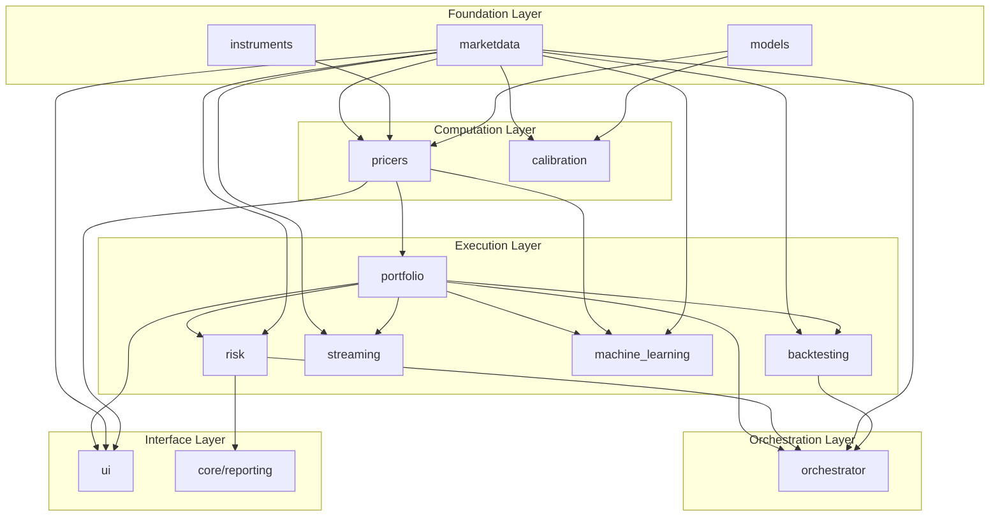

---

## 2. Module Dependency Graph

Shows what each module imports from other modules.

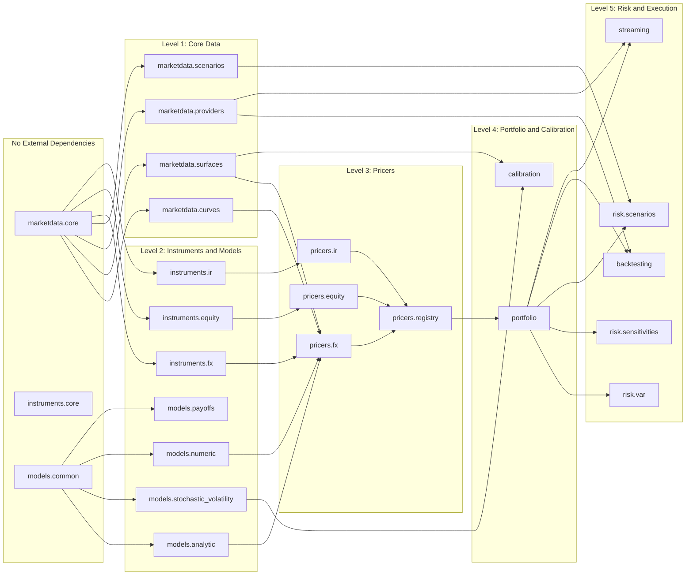

---

## 3. Pricing Flow

How an instrument gets priced: from instrument definition through market data lookup to model calculation.

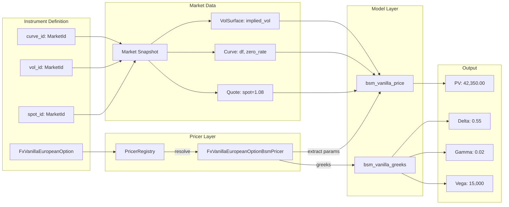

---

## 4. Portfolio Pricing Flow

How a portfolio of instruments gets priced and aggregated.

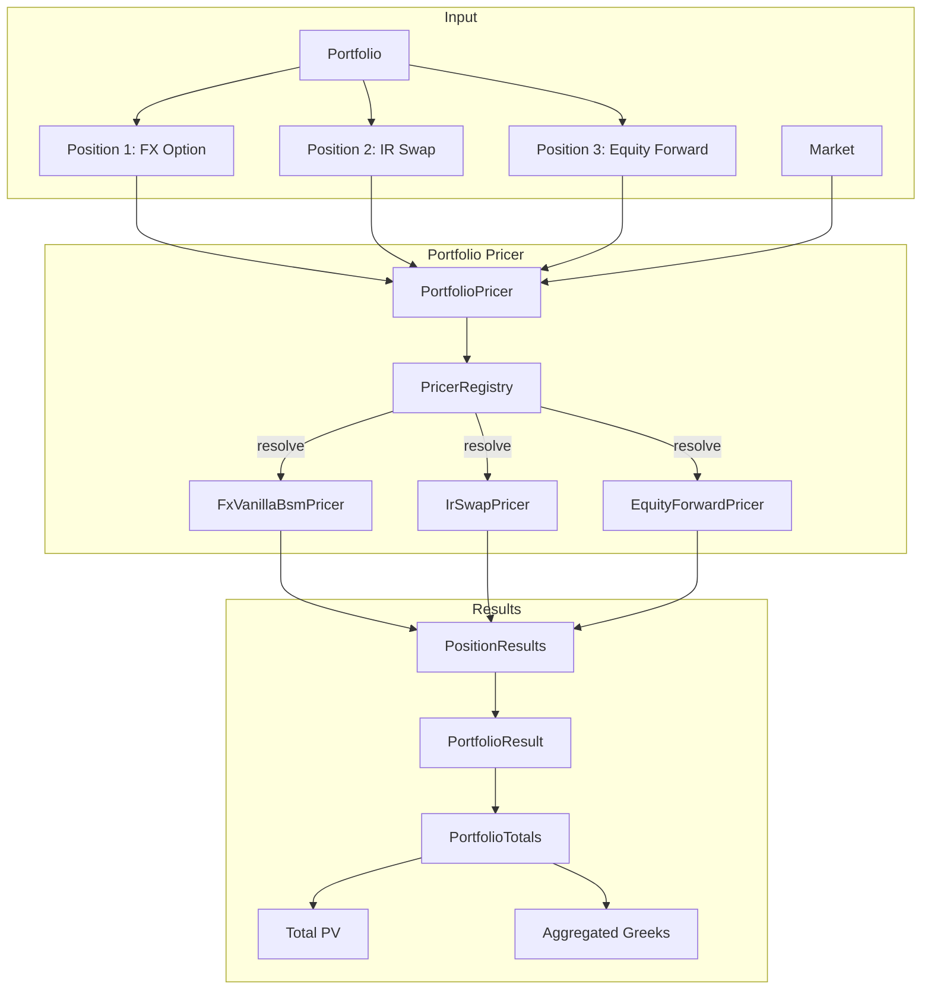

---

## 5. Risk Computation Flow

How risk metrics (VaR, sensitivities, scenarios) are computed.

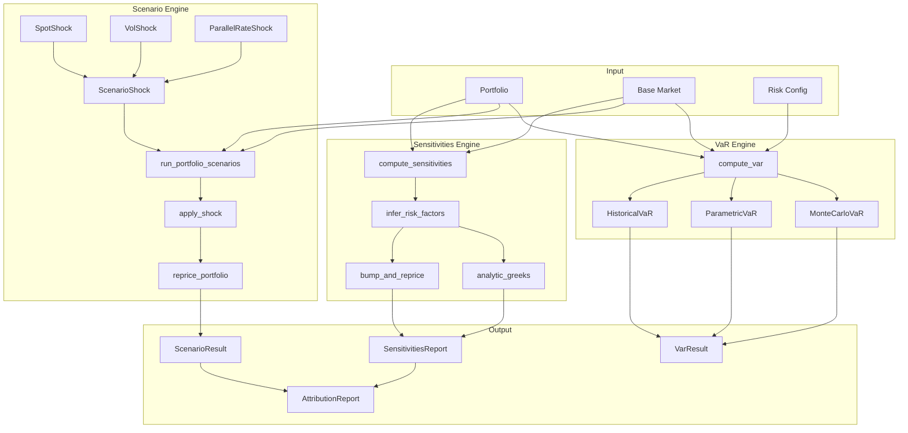

---

## 6. Calibration Flow

How models are calibrated to market data.

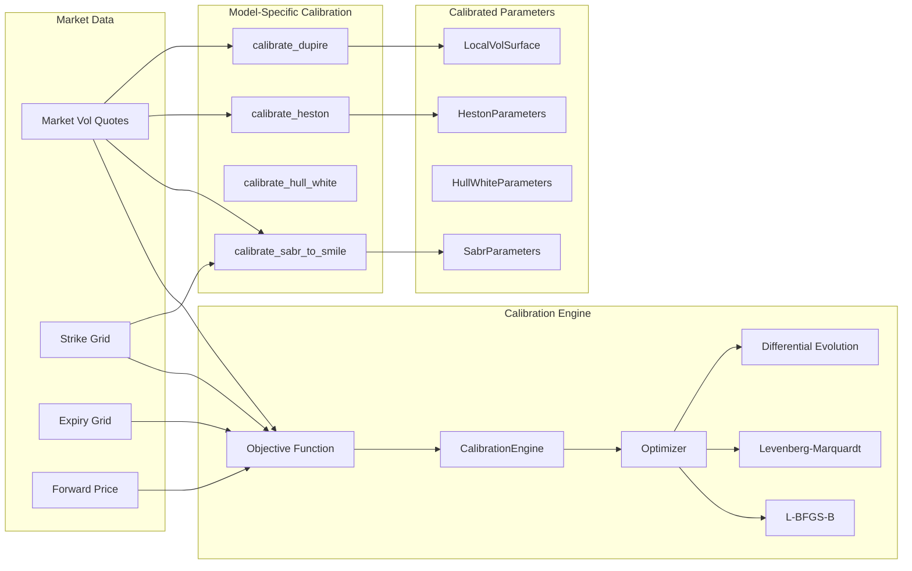

---

## 7. Backtesting Flow

How strategies are backtested on historical data.

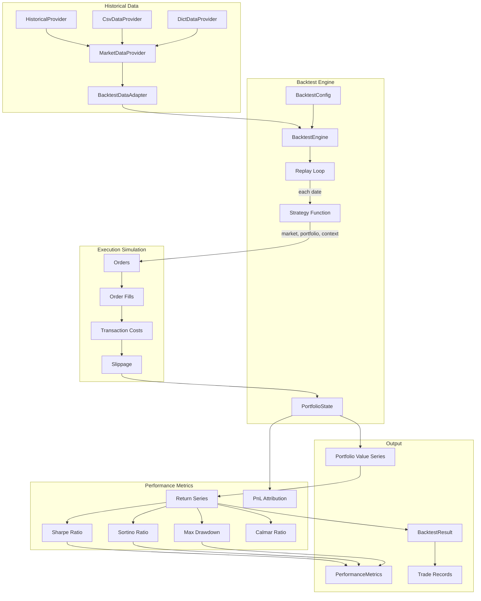

---

## 8. Streaming / Live Trading Flow

How strategies execute on live or paper markets.

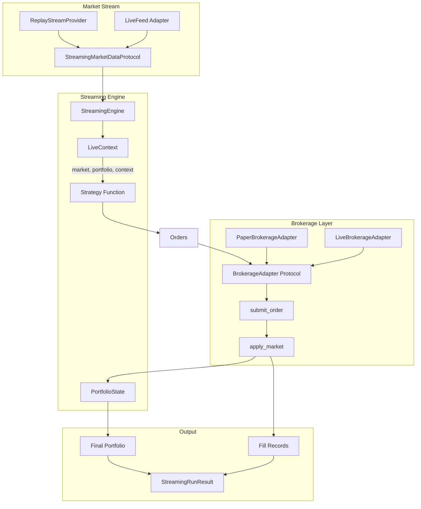

---

## 9. Orchestrator Pipeline Flow

How pipelines coordinate multiple steps and modules.

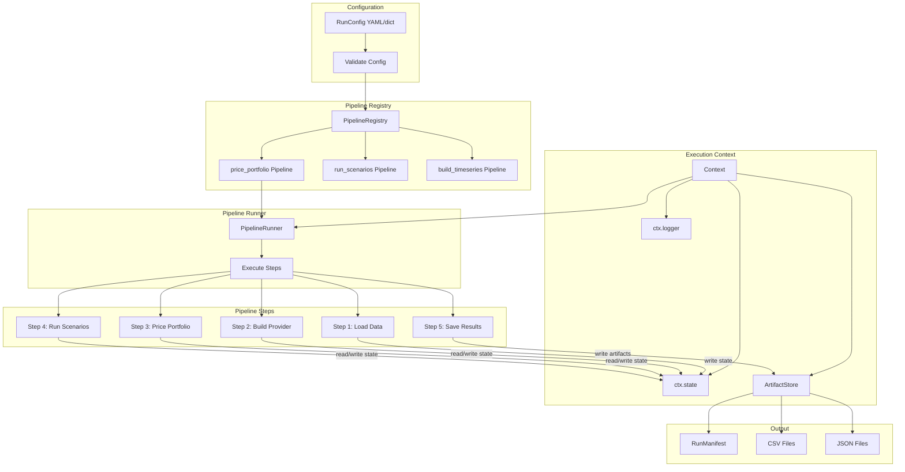

---

## 10. ML Pipeline Flow

How the ML framework trains, evaluates, and deploys models.

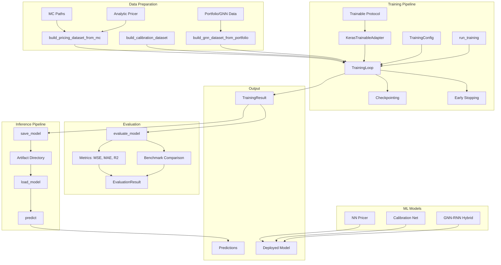

---

## 11. Models and Numeric Methods

How analytic and numeric methods relate to each other.

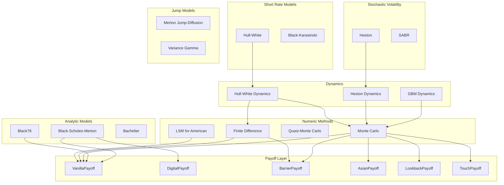

---

## 12. Complete Data Flow: Instrument to Report

End-to-end flow from trade definition to risk report.

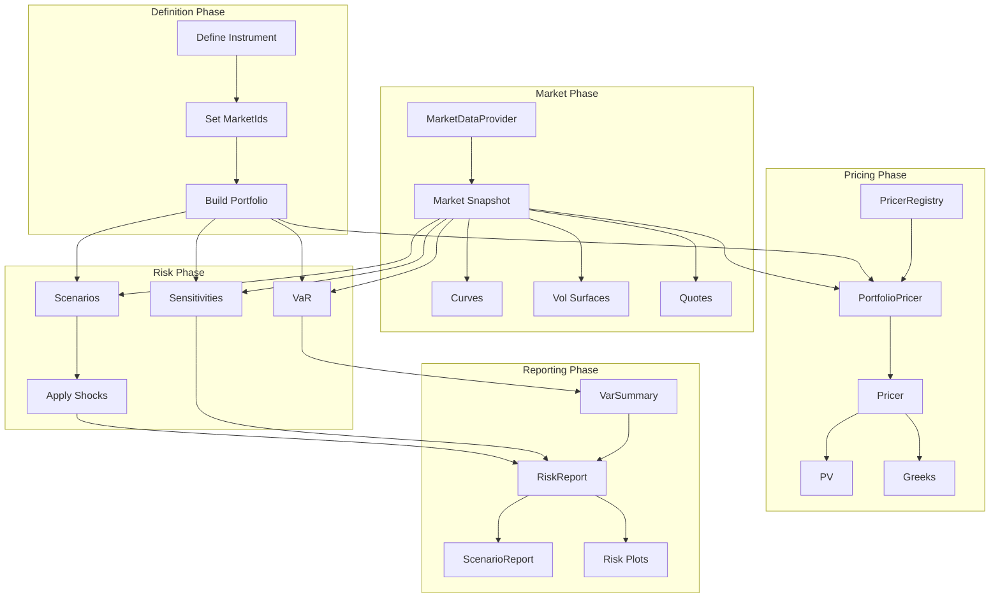

---

## Summary Table: Module Responsibilities

| Module | Primary Responsibility | Key Interfaces |
|--------|----------------------|----------------|
| **marketdata** | Market data infrastructure | `Market`, `MarketId`, `Curve`, `VolSurface`, `MarketDataProvider` |
| **instruments** | Trade/product definitions | `FxVanillaEuropeanOption`, `IrSwap`, etc. (dataclasses) |
| **models** | Mathematical pricing models | `bsm_price()`, `HestonDynamics`, `GbmDynamics`, payoffs |
| **pricers** | Pricing adapters | `InstrumentPricer` protocol, `PricerRegistry` |
| **portfolio** | Portfolio management | `Portfolio`, `Position`, `PortfolioPricer` |
| **risk** | Risk computation | `compute_var()`, `compute_sensitivities()`, `run_portfolio_scenarios()` |
| **calibration** | Model calibration | `CalibrationEngine`, `calibrate_sabr_to_smile()` |
| **backtesting** | Historical strategy testing | `BacktestEngine`, `PerformanceMetrics` |
| **streaming** | Live/paper trading | `StreamingEngine`, `BrokerageAdapter` |
| **orchestrator** | Workflow coordination | `Pipeline`, `PipelineRunner`, `Context` |
| **machine_learning** | ML training/inference | `Trainable`, `run_training()`, `evaluate_model()`, `predict()` |
| **core** | Utilities and plotting | `style`, `utils`, risk/marketdata/pricer plots |
| **ui** | Dash UIs | `create_app()`, shared components |

---

## Dependency Summary

```
Level 0: marketdata.core, instruments.core, models.common
    ↓
Level 1: marketdata (curves, surfaces, providers, scenarios)
    ↓
Level 2: instruments (fx, equity, ir), models (analytic, numeric, dynamics, payoffs)
    ↓
Level 3: pricers (fx, equity, ir, registry)
    ↓
Level 4: portfolio, calibration
    ↓
Level 5: risk, backtesting, streaming, machine_learning
    ↓
Level 6: orchestrator, ui
```
