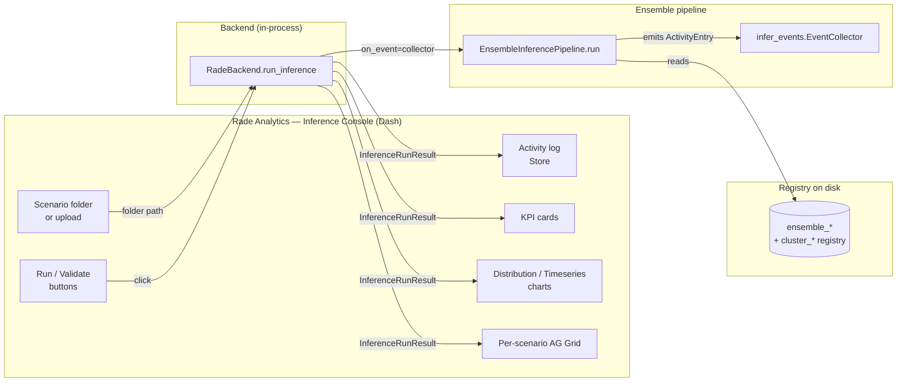

# Inference Console — Implementation Specification

> **Status:** Phase 1 of 6 complete (foundations).
> **Audience:** anyone wiring up the *Inference Console* page in
> `src/ui/apps/rade_analytics/` or maintaining the underlying
> `EnsembleInferencePipeline`.

This document is the single long-form reference for the *Rade
Analytics → Inference Console* page implementation.  It explains
**what** is being added, **why**, the **data structures** carrying
state between the backend and the UI, **how** the UI consumes that
state, and **how** we know it works.

The *layout* of the page lives in
[`RADE_UI_DESIGN.md` Appendix A](../platform_designs/RADE_UI_DESIGN.md).
This file picks up where that one stops — at the layout-only V2
contract — and walks the path from "no callbacks" to a fully wired
production page.

---

## 0 · Scope

In scope:

- The lifecycle-event protocol the pipeline emits (`infer_events`).
- The wiring inside `EnsembleInferencePipeline` so each meaningful
  transition is reported (`Pipeline started → Loading ensemble →
  Cluster context loaded → Forward pass started → Pipeline
  complete`).
- The UI-facing wrapper (`RadeBackend.run_inference`) that turns
  one pipeline run into one `BackendResult[InferenceRunResult]`
  (predictions + activity log + run metadata).
- The full data-structure catalogue (TypedDicts + dataclasses).
- The test pyramid (unit / integration / smoke / manual).

Out of scope (handled in later phases — see §6):

- Dash callback wiring (Phase 2).
- Per-cluster fan-out using `EnsembleSession` (Phase 3).
- Risk attribution / VaR / CVaR analytics (Phase 4).
- Full-fat KPI computation (Phase 5).
- Production hardening — auth, rate limits, audit trail (Phase 6).

---

## 1 · System architecture



The arrows that cross the BE/UI boundary carry **plain
JSON-serialisable dicts** so everything round-trips through Dash
`dcc.Store` without custom (de)serialisation.

---

## 2 · The six implementation phases

| Phase | Goal | Status |
|---|---|---|
| **1. Foundations** | Event protocol; `EnsembleInferencePipeline` emits; `RadeBackend.run_inference` wraps; tests prove the contract. | ✅ done |
| 2. UI wiring | Dash long-callback / Interval drains the activity log to the page Store; manifest preview; KPI / chart binding. | ⏳ next |
| 3. Session-mode fan-out | Use `EnsembleSession` for warm starts so successive runs don't re-load the whole ensemble. | ⏳ |
| 4. Risk attribution & tails | Phase-2 callbacks for `Risk attribution` + `Stress & tails` tabs. | ⏳ |
| 5. KPI hardening | Real VaR / CVaR / worst-N implementations replacing the placeholders. | ⏳ |
| 6. Production hardening | Auth, audit, run history, cancellation, structured failure replay. | ⏳ |

---

## 3 · Phase 1 — file-by-file deep dive

### 3.1 `src/rade_ml_pt/pipelines/ensemble/infer_events.py` (NEW)

**Why this exists.**  The *Inference Console* must narrate the run
in real time so an analyst can see *what happened, when, in which
cluster*.  We could have done this with `logging` + a queue
handler, but logging is an output channel — re-binding it for the
UI silently affects every other consumer.  Instead, the pipeline
exposes a **first-class event hook** with a tiny, stable contract.

**Public surface.**

| Name | Kind | Role |
|---|---|---|
| `Stage` / `Status` | `Literal` | The closed vocabulary the UI maps to icons. |
| `STAGE_INGEST`, `STAGE_VALIDATE`, `STAGE_INFERENCE` | constants | Stage tokens. |
| `STATUS_OK`, `STATUS_FAIL`, `STATUS_RUNNING`, `STATUS_PENDING` | constants | Status tokens. |
| `ActivityEntry` | type alias for `Dict[str, Any]` | Wire shape: `id`, `stage`, `phase`, `status`, `ts`, optional `target` / `detail`. |
| `TypedActivityEntry` | frozen dataclass | Type-friendly mirror; `to_dict()` round-trips to the wire shape. |
| `EmitFn` | `Callable[[ActivityEntry], None]` | What the pipeline accepts. Must be non-blocking. |
| `noop_emit` | function | Default when no UI is present. |
| `event(stage, phase, *, status=OK, target=None, detail=None)` | factory | Auto-fills `id` (`uuid4`) and `ts` (UTC ISO-8601, second precision). |
| `EventCollector` | class | Thread-safe in-memory buffer that **is itself an `EmitFn`**. |

**Why `EventCollector` is callable.**  The pipeline only needs an
`EmitFn`.  Making the collector callable means the same object is
passed in (`on_event=collector`) and read back out
(`collector.snapshot()`) — no separate "extract events" step.  The
mutex guards both the append in `__call__` and the copy in
`snapshot()` so the parallel-load path in
`EnsembleSession._load_parallel` stays safe.

**Why `event()` is a factory, not a constructor.**  Call-sites
should specify *what happened*, never *when* — the factory
guarantees `id`-uniqueness (so React reconciliation in the UI
doesn't dedupe rows) and `ts`-monotonicity (one source of clock
truth, UTC, second precision so timestamps render cleanly without
microsecond noise).

### 3.2 `src/rade_ml_pt/pipelines/ensemble/infer.py` (PATCH)

**What changed.**  Added one keyword-only constructor argument,
`on_event: Optional[EmitFn] = None`, and sprinkled `self._emit(...)`
calls at the natural seams of `run()`.  No existing behaviour
changed — `on_event=None` falls back to `noop_emit` and the
pipeline runs identically (proved in
`TestPipelineEmits.test_default_on_event_is_noop_behavioural`).

**The seam points** — exact `phase` / `status` strings — are part
of the public contract:

| # | Where in code | `phase` | `status` | `target` | When |
|---|---|---|---|---|---|
| 1 | `run()` entry | `Pipeline started` | `running` | ensemble version | Always first |
| 2 | `_load_from_registry` start | `Loading ensemble from registry` | `running` | ensemble version | Cold start only |
| 3 | `_load_from_registry` end (model) | `Ensemble assembled` | `ok` | `"N members"` | Cold start |
| 4 | per-cluster context start | `Cluster context loading` | `running` | cluster id | One per cluster, cold start |
| 5 | per-cluster context done | `Cluster context loaded` | `ok` | cluster id | Per cluster, cold start |
| 6 | per-cluster context fail | `Cluster context failed` | `fail` | cluster id, `detail`=traceback | Per cluster, on failure |
| 7 | `_load_from_session` | `Reusing pre-loaded session` → `Session ready` | `running` → `ok` | ensemble version | Warm-start path |
| 8 | `_build_member_inputs` short-circuit | `Using pre-built member inputs` | `ok` | `"N members"` | Tests + headless callers |
| 9 | `_build_new_scenarios_inputs` start | `Loading new-scenario shocks` → `Shocks loaded` | `running` → `ok` | scenario dir | New-scenarios mode only |
| 10 | per-cluster build | `Building cluster inputs` → `Cluster inputs ready` | `running` → `ok` | cluster id, `detail`=`"N scenarios · K target trades"` | Per cluster |
| 11 | per-cluster build fail | `Cluster input build failed` | `fail` | cluster id, `detail`=traceback | Per cluster, on failure |
| 12 | `_ensemble.predict()` | `Forward pass started` → `Forward pass complete` | `running` → `ok` | `"N members"` / `"N scenarios"` | Once per run |
| 13 | `run()` exit | `Pipeline complete` | `ok` | `"X ms · N samples"` | Always last on success |
| 14 | `run()` failure handler | `Pipeline failed` | `fail` | exception class, `detail`=`str(exc)` | Always last on failure |

**Failure semantics.**  Whenever the pipeline raises, the *last
emitted event is always a `status='fail'` row* before the exception
re-raises.  This is critical for the UI — without it, a silent
exception propagates straight back to the Dash callback as a 500
and the activity-log feed stops mid-narration with no explanation.

### 3.3 `src/ui/apps/rade_analytics/data/backend.py` (PATCH)

**What changed.**  Two additions:

1. New `InferenceRunResult` frozen dataclass next to
   `BackendResult`.  Field-by-field reasoning is in §4.4.
2. New `RadeBackend.run_inference(...)` method.  Invariants:
   - **Lazy imports** — `EnsembleInferencePipeline` (and its
     pytorch dependency tree) is only imported inside the method
     body, not at module level.  Keeps page-load cost flat for
     every other backend method.
   - **Uncached, intentionally** — every call re-runs the
     pipeline.  Caching on `(registry, scenario_dir)` would silently
     mask the activity log on a hit, breaking the UI narration.
   - **Tri-state result** — failures (load fail, run fail) come
     back as `BackendResult.failure(...)`.  The UI never sees a raw
     traceback.
   - **Resolves tags to versions** — the returned
     `InferenceRunResult.ensemble_version` is the concrete
     `ens_*` string, never the input tag.  Subsequent artifact
     reads can pin to that snapshot.

### 3.4 `tests/rade_ml_pt/pipelines/ensemble/test_infer_events.py` (NEW)

22 assertions across 18 tests, runtime <1 s.  Three layers:

1. **`event()` factory** — required keys present, optional keys
   omitted when `None`, IDs unique, timestamp shape stable.
2. **`EventCollector`** — append, snapshot-is-a-copy, clear,
   thread-safety under 8 × 250 concurrent appends.
3. **`EnsembleInferencePipeline` integration** — default behaviour
   unchanged with `on_event=None`; expected phase strings present
   on success; failure path emits a `status='fail'` row before
   re-raising.

### 3.5 `tests/ui/apps/rade_analytics/test_run_inference_backend.py` (NEW)

4 assertions.  Stubs the HTTP client (`MagicMock`), uses a
`NoOpCache`, registers the synthetic two-cluster ensemble from the
existing fixture, then drives `RadeBackend.run_inference` and
asserts:

- `BackendResult.ok == True` with the right shape.
- `activity_log[0]` is `Pipeline started` and `[-1]` is
  `Pipeline complete`.
- Unknown version returns a `BackendResult.failure(...)` rather
  than raising.
- The returned `ensemble_version` is a resolved `ens_*` string,
  not the input tag.

---

## 4 · Data structures (full catalogue)

The UI ↔ backend boundary speaks **JSON-serialisable dicts**.  We
maintain typed mirrors (TypedDict / dataclass) for self-documenting
call-sites + IDE autocompletion, but the wire shape is always the
plain dict.

### 4.1 `ActivityEntry` — the activity log row

```python
class ActivityEntry(TypedDict, total=False):
    id:      str             # uuid4 hex; React reconciliation key
    stage:   Literal["ingest", "validate", "inference"]
    phase:   str             # human-readable; bold middle column
    status:  Literal["ok", "fail", "running", "pending"]
    ts:      str             # ISO-8601 UTC, second precision
    target:  str             # optional — filename / cluster id / risk factor
    detail:  str             # optional — failure reason or sub-text
```

**Where it goes.**  Straight into the page-level
`activity_log_store` Dash Store.  The layout helper
`render_activity_entries(entries)` consumes a `List[ActivityEntry]`
and builds the icon + phase + target row layout.  No re-shaping
between backend → store → renderer.

### 4.2 `IngestMeta` — what the file bar reports

```python
class FileMeta(TypedDict):
    filename:  str
    size_bytes: int
    n_scenarios: int
    n_risk_factors: int
    risk_factor: Optional[str]   # parsed from filename when possible
    ok:        bool
    error:     Optional[str]

class IngestMeta(TypedDict):
    folder:    str               # absolute path
    files:     List[FileMeta]
    total_scenarios: int
    n_failed:  int
    ts:        str               # ISO-8601 UTC
```

**Owned by Phase 2.**  Phase 1 leaves the `ingest_meta_store`
empty; the placeholder card in `_manifest_card()` reads it once
the upload callback lands in Phase 2.

### 4.3 `RunMeta` — a thin summary the UI binds to KPIs

```python
class RunMeta(TypedDict):
    ensemble_version:  str
    started_at:        str        # ISO-8601 UTC
    finished_at:       Optional[str]
    n_scenarios:       int
    n_targets:         int
    latency_ms:        float
    status:            Literal["running", "ok", "fail"]
    error:             Optional[str]
```

**Phase 1 is the source of truth.**  `RadeBackend.run_inference`
returns enough to build a `RunMeta` from the returned
`InferenceRunResult`; the Phase 2 callback layer is responsible for
shaping it into this exact dict before storing it in
`run_meta_store`.

### 4.4 `InferenceRunResult` — the backend return shape

```python
@dataclass(frozen=True)
class InferenceRunResult:
    ensemble_version:  str
    n_scenarios:       int
    n_targets:         int
    latency_seconds:   float
    predictions:       np.ndarray            # [n_scenarios, n_targets]
    sample_ids:        Optional[List[str]]
    activity_log:      List[ActivityEntry]   # full ordered run history
```

**Why frozen.**  Callbacks can hash the result by identity for
cheap memoisation.  The result is *not* picklable across processes
(predictions are large numpy arrays); Phase 2 long-callbacks live
in the same Python interpreter as the Dash worker, which is fine.

**Why expose the raw `predictions` array.**  Different consumers
(KPI cards / distribution chart / per-scenario AG Grid /
risk-attribution view) want different summaries.  Computing them
all here would couple the backend to every UI shape.  Phase 2
slices `predictions` per consumer and passes only the slice
through `dcc.Store`.

---

## 5 · How the UI consumes Phase 1

Phase 2 will own the actual callback wiring (see §6 for the
full plan).  The contract Phase 1 establishes for it is:

```python
# Pseudocode for the Phase-2 long-callback that drives a run.
@app.long_callback(
    output=[
        Output(INFERENCE_IDS["activity_log_store"], "data"),
        Output(INFERENCE_IDS["run_meta_store"],     "data"),
        Output(INFERENCE_IDS["kpi_pnl_mean"],       "children"),
        ...,
    ],
    inputs=[Input(INFERENCE_IDS["btn_run"], "n_clicks")],
    state=[State(INFERENCE_IDS["scenario_path"], "value")],
    progress=[Output(INFERENCE_IDS["activity_log_store"], "data")],
    prevent_initial_call=True,
)
def _run_inference(set_progress, n_clicks, scenario_path):
    res = backend.run_inference(
        registry_dir=current_app.config["REGISTRY_DIR"],
        ensemble_version=session.active_version,
        new_scenario_dir=scenario_path,
    )
    if not res.ok:
        return [], _run_meta_failure(res.error), "—", ...

    run = res.data
    return (
        run.activity_log,                 # → activity_log_store
        _run_meta_from(run),              # → run_meta_store
        f"{run.predictions.mean():.4f}",  # → kpi_pnl_mean
        ...
    )
```

The two contracts that matter:

1. **`activity_log` is already in the wire shape** — pass it
   through to the Store with no transformation.  The
   `render_activity_entries` layout helper consumes this exact
   dict shape.
2. **The backend is synchronous; UI streaming is the
   long-callback's job.**  Phase 1 returns the *complete* event
   list at the end of the run.  Phase 2 will wrap that with a
   queue + `set_progress` so the activity log paints
   incrementally rather than as a single batch dump.  That
   wrapping is Phase 2 work — Phase 1 is intentionally
   non-streaming so we have a one-shot end-to-end test path.

---

## 6 · How we test it

The strategy is a four-layer pyramid; lower layers are wider,
faster, cheaper.

### 6.1 Unit tests — `tests/rade_ml_pt/pipelines/ensemble/test_infer_events.py`

| What | Why |
|---|---|
| `event()` shape, IDs unique, ts ISO-8601 UTC | Schema invariants the UI binds to. |
| `noop_emit` is a no-op | Default path doesn't accidentally do work. |
| `EventCollector` append / snapshot / clear | Buffer semantics. |
| `EventCollector` thread-safety (8 × 250 concurrent appends) | Parallel-load path in `EnsembleSession`. |
| `TypedActivityEntry.to_dict()` preserves all fields | Round-trip safety. |

### 6.2 Pipeline integration tests — same file

| What | Why |
|---|---|
| `on_event=None` is behavioural no-op | Existing CLI / batch callers untouched. |
| Required `phase` strings present in successful run | Public contract — UI binds to phase strings. |
| First event = `Pipeline started` (`running`) | Lifecycle marker the UI uses to switch from "idle" to "in-flight". |
| Last event = `Pipeline complete` (`ok`) | Lifecycle marker the UI uses to switch back. |
| Failure path → final event is `status='fail'` before re-raising | UI must paint a red-x row, not time out silently. |
| Total event count in `[5, 30]` for the synthetic 2-cluster fixture | Sanity bound — too few = silent narration; too many = log flood. |

### 6.3 Backend wrapper tests — `tests/ui/apps/rade_analytics/test_run_inference_backend.py`

| What | Why |
|---|---|
| Returns `BackendResult.success` with the typed `InferenceRunResult` | Tri-state envelope contract. |
| `activity_log` is populated and starts/ends with the lifecycle markers | UI-facing wire shape. |
| Unknown version → `BackendResult.failure`, no exception escapes | Callbacks rely on the envelope, not try/except. |
| Tag inputs resolve to a concrete `ens_*` version | Pinning subsequent artifact reads to one snapshot. |

### 6.4 Manual smoke (Phase 2 once UI wiring lands)

The manual checklist for verifying the complete page once Phase 2
ships, kept here so it doesn't drift from the data contracts:

1. Land on `/inference`.  Activity log card shows the empty state
   (`render_activity_entries(None)`).  KPIs are em-dashes.
   `dcc.Upload` and the path TextInput are empty.
2. Paste a valid scenario folder path → click "Upload scenarios".
   The file bar shows a spinner; on success a green tick + the
   manifest preview populates.  Activity log gains rows for the
   ingest stage.
3. Click "Run".  The activity log streams `Pipeline started → …`
   in real time.  Dash worker stays responsive (long-callback +
   `dcc.Interval` polling pattern).
4. On completion: KPIs populate; `Charts` tab renders the
   distribution; the per-scenario AG Grid populates; clicking a
   row narrows the chart to the highlighted scenario.
5. Re-run with the same folder → faster (Phase 3 warm-start).
6. Force a failure (e.g. point at a folder missing a risk-factor
   shock CSV).  The activity log paints a red-x row; the run-meta
   chip flips to "FAIL"; KPIs fall back to em-dashes.

### 6.5 How to test the underlying `EnsembleInferencePipeline`

The pipeline test in §6.2 uses the synthetic two-cluster registry
from `tests/rade_ml_pt/pipelines/ensemble/conftest.py`.  This
fixture is the *single source of truth* for "registered ensemble
that runs" — both the existing `test_ensemble_pipelines.py` and
the new `test_infer_events.py` share it via pytest fixture
discovery / re-export.  When extending the pipeline (e.g. adding
the `new_trades` mode in a future phase), reuse the fixture and
add a sibling test class — don't fork the registry stand-up.

For end-to-end coverage against a *real* trained ensemble, the
existing `examples/rade_ml_pt/hybrid_gnn_rnn/06_test_ensemble_train.py`
+ `07_test_ensemble_eval.py` already produce a registered ensemble
on disk; a Phase-2 example
(`examples/rade_analytics/13_use_rade_client.py`-style) will
demonstrate the same `RadeBackend.run_inference` call against that
real ensemble + a real scenario folder.

---

## 7 · Anti-patterns to avoid

- **Don't put `if on_event:` checks at every call-site.**
  `_emit = on_event if on_event is not None else noop_emit` was
  set once in `__init__`; call-sites just `self._emit(event(...))`.

  ⚠️ **Subtle pitfall:** the obvious `on_event or noop_emit`
  short-circuit is wrong because `EventCollector` defines
  `__len__` and an empty collector is falsy.  Always use
  `is not None` for emit-fn defaults.

- **Don't use `logging` as the event channel.**  Logs are
  cross-cutting; binding the UI to the log stream pulls in every
  other subsystem's chatter and makes ordering racy.

- **Don't change the wire shape without bumping the layout's
  `INFERENCE_IDS` count.**  The smoke test asserts on the count;
  drift here is the most common cause of "the UI rendered but
  nothing populated".

- **Don't cache `run_inference` results.**  Caching would silently
  bypass the activity log on a hit; the UI would render an empty
  feed under the (mistaken) assumption no run had been triggered.

- **Don't mutate `InferenceRunResult`.**  It's `frozen=True` for
  a reason — callbacks may hash it for memoisation in Phase 2+.

- **Don't pickle `InferenceRunResult` across processes.**
  `predictions` is a large numpy array.  Long-callbacks must run
  in the same interpreter (`dash[diskcache]`'s thread pool, not
  the multi-process pool) so the array doesn't have to traverse
  IPC.

---

## 8 · Glossary

- **Stage** — coarse phase of work: `ingest` (file → memory),
  `validate` (manifest sanity), `inference` (forward pass).
- **Phase** — a short human-readable label inside a stage (e.g.
  `Loading ensemble from registry`).
- **Status** — colour / icon: `ok` (green tick), `fail` (red x),
  `running` (spinner), `pending` (greyed).
- **Cold start** — pipeline path that loads everything from the
  registry on disk.
- **Warm start** — pipeline path that reuses an `EnsembleSession`'s
  pre-loaded models + contexts (Phase 3).
- **Pre-built inputs** — caller passes
  `metadata['inference']['member_inputs']` directly, short-
  circuiting the input-build phase.  Used by tests + the
  model-agnostic API path.

---

## 9 · References

- Layout contract: [`RADE_UI_DESIGN.md`](../platform_designs/RADE_UI_DESIGN.md)
- Page contract: [`docs/rade_analytics/page_contract.md`](page_contract.md)
- Pipeline source: `src/rade_ml_pt/pipelines/ensemble/infer.py`
- Pipeline tests: `tests/rade_ml_pt/pipelines/ensemble/test_ensemble_pipelines.py`
- Phase-1 tests: `tests/rade_ml_pt/pipelines/ensemble/test_infer_events.py`
- Backend wrapper: `src/ui/apps/rade_analytics/data/backend.py::RadeBackend.run_inference`
- Backend tests: `tests/ui/apps/rade_analytics/test_run_inference_backend.py`
