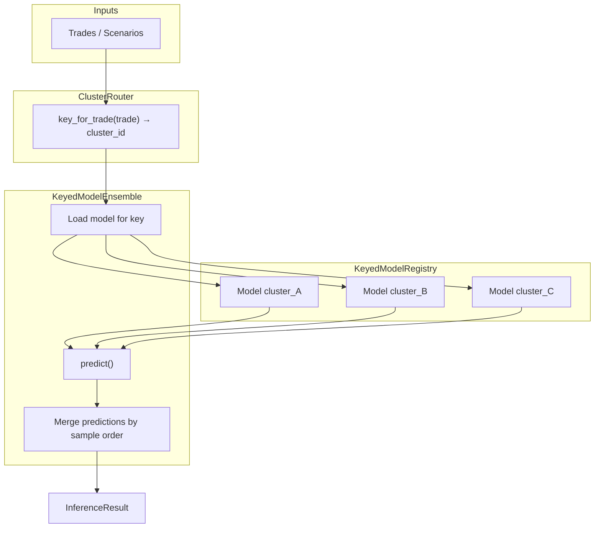
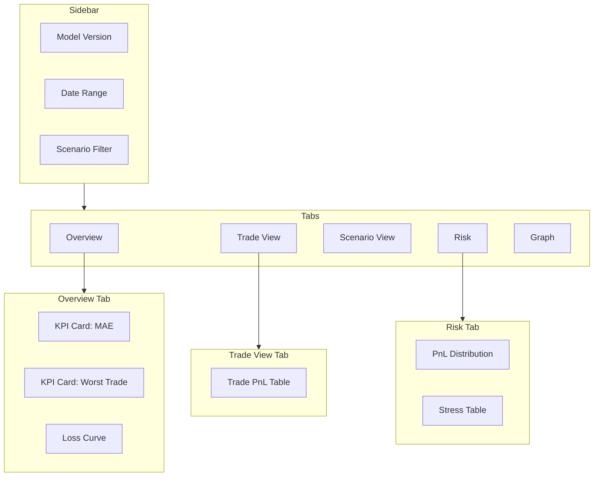
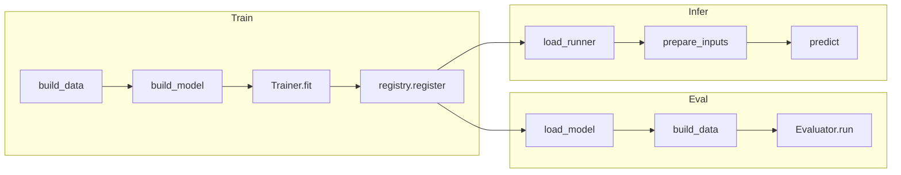

# rade_ml Implementation Plan — Work Environment

> **Purpose**: A detailed, executable checklist for bringing rade_ml to parity (and beyond) on the work environment. Based on the personal QuantStrata/rade_ml library structure.  
> **Audience**: QuantStrata ML maintainer executing on work infrastructure.  
> **Last updated**: 2026-02-22.

---

## Table of Contents

1. [Executive Summary](#1-executive-summary)
2. [Phase 1: Eval & Inference Pipelines](#2-phase-1-eval--inference-pipelines)
3. [Phase 2: Ensemble Model Framework](#3-phase-2-ensemble-model-framework)
4. [Phase 3: Dash UI for Hybrid GNN-RNN](#4-phase-3-dash-ui-for-hybrid-gnn-rnn)
5. [Phase 4: Unit Test Suite](#5-phase-4-unit-test-suite)
6. [Sync Strategy: Personal ↔ Work](#6-sync-strategy-personal--work)
7. [Appendix A: Code Snippets](#7-appendix-a-code-snippets)
8. [Appendix B: Workflow Diagrams](#8-appendix-b-workflow-diagrams)

---

## 1. Executive Summary

| Component | Personal (QuantStrata) | Work | Action |
|-----------|------------------------|------|--------|
| **eval.py** | ✅ `HybridGnnRnnEvalPipeline` | ❌ Missing | Port + adapt |
| **infer.py** | ✅ `HybridGnnRnnInferencePipeline` | ❌ Missing | Port + adapt |
| **Ensemble** | ❌ Planned only (KeyedModelRegistry, ClusterRouter) | ❌ Not built | Design + implement |
| **Dash UI** | ✅ Generic (`src/ui/`) — FX pricing calc only | ❌ No Hybrid GNN-RNN dashboard | Build new app |
| **Unit tests** | ✅ `tests/rade_ml/` (~25 test modules) | ❌ Not run/synced | Port + run |

---

## 2. Phase 1: Eval & Inference Pipelines

### 2.1 What Exists (Personal)

| File | Purpose |
|------|---------|
| `src/rade_ml/pipelines/hybrid_gnn_rnn/eval.py` | `HybridGnnRnnEvalPipeline` — loads model, builds test data, runs `Evaluator`, `post_eval` logs per-target MAE |
| `src/rade_ml/pipelines/hybrid_gnn_rnn/infer.py` | `HybridGnnRnnInferencePipeline` — loads graph builder + encoder, extends adjacency for new trades, runs inference via `InferenceRunner` |

**Dependencies**:
- `EvalPipeline` / `InferencePipeline` base classes (`pipelines/base.py`)
- `Evaluator` (`evaluation/evaluator.py`)
- `InferenceRunner` (`inference/runner.py`)
- `ModelRegistry` for loading
- `HybridGnnRnnDataConfig`, `build_dataset`, `TradeGraphBuilder`, `TradeAttributeEncoder`

### 2.2 Implementation Checklist (Work)

- [ ] **1.1** Sync `src/rade_ml/pipelines/base.py` (EvalPipeline, InferencePipeline orchestration)
- [ ] **1.2** Sync `src/rade_ml/evaluation/evaluator.py` and `EvaluationResult` in `core/types.py`
- [ ] **1.3** Sync `src/rade_ml/inference/runner.py` and `InferenceResult`
- [ ] **1.4** Sync `src/rade_ml/pipelines/hybrid_gnn_rnn/eval.py` and `infer.py`
- [ ] **1.5** Sync `src/rade_ml/pipelines/config.py` (PipelineConfig, metadata schema)
- [ ] **1.6** Create `examples/rade_ml/hybrid_gnn_rnn/04_evaluate_hybrid_gnn_rnn.py` — script to run eval after training
- [ ] **1.7** Create `examples/rade_ml/hybrid_gnn_rnn/05_infer_hybrid_gnn_rnn.py` — script demonstrating inference with/without new trades
- [ ] **1.8** Verify `Evaluator.run()` accepts `tf.data.Dataset` with dict inputs (Hybrid GNN-RNN uses `{"trade_features": ..., "adjacency_indices": ..., ...}`)
- [ ] **1.9** Document `config.metadata.inference` schema for infer pipeline: `graph_builder_path`, `encoder_path`, `pnl_history`, `new_trade_attribs`, `trade_ids`

### 2.3 Eval Pipeline Flow

```text
PipelineConfig (version_or_tag, registry_dir, data_config, metadata.job)
       │
       ▼
┌──────────────────────────────────────────────────────────────────┐
│ HybridGnnRnnEvalPipeline.run()                                    │
├──────────────────────────────────────────────────────────────────┤
│ 1. load_model(config) → ModelRegistry.load(version_or_tag)         │
│ 2. build_data(config) → build_dataset(job, HybridGnnRnnDataConfig)│
│ 3. Evaluator(model).run(data_result.test_ds)                      │
│ 4. post_eval(eval_result) → log per-target MAE, worst trade        │
└──────────────────────────────────────────────────────────────────┘
       │
       ▼
EvaluationResult (loss, metrics, residuals, predictions, targets)
```

### 2.4 Inference Pipeline Flow

```text
PipelineConfig (metadata.inference: graph_builder_path, encoder_path, pnl_history, new_trade_attribs?)
       │
       ▼
┌──────────────────────────────────────────────────────────────────┐
│ HybridGnnRnnInferencePipeline.run()                               │
├──────────────────────────────────────────────────────────────────┤
│ 1. load_runner(config) → InferenceRunner.from_registry(...)       │
│ 2. prepare_inputs(config):                                        │
│    - TradeGraphBuilder.load(graph_builder_path)                   │
│    - TradeAttributeEncoder.load(encoder_path)                     │
│    - If new_trade_attribs: build_graph_projection()               │
│    - Else: use trained graph as-is                                │
│    - Assemble dict inputs for model (trade_features, adjacency,   │
│      pnl_history, elementary_indices, target_indices)              │
│ 3. runner.predict(inputs)                                         │
│ 4. post_infer(result) → log mean/std PnL                          │
└──────────────────────────────────────────────────────────────────┘
       │
       ▼
InferenceResult (predictions, n_samples, sample_ids, latency_seconds)
```

---

## 3. Phase 2: Ensemble Model Framework

### 3.1 Reference Design (Planned, Not Implemented)

The framework is **designed but not coded** in QuantStrata. References:
- `docs/guides/machine_learning/REFERENCE_FRAMEWORK_BUILD_GUIDE.md` — **detailed code skeletons** for `KeyedModelRegistry`, `KeyedModelEnsemble`, `ClusterRouter` (lines ~886–1066)
- `docs/guides/machine_learning/ML_FRAMEWORK_SCRIPT_INVENTORY.md` §15
- `docs/guides/machine_learning/ml_comparison_and_roadmap.md` §3.5

**Proposed components**:

| Component | Purpose |
|-----------|---------|
| `KeyedModelRegistry` | Registry keyed by cluster/segment (e.g. `cluster_id` per trade) |
| `KeyedModelEnsemble` | Holds multiple models; routes each input to the correct one |
| `ClusterRouter` | `key_for_trade(trade) → cluster_id`, `keys_for_scenarios(scenarios) → cluster_ids` |
| `ClusterEnsembleWrapper` | Thin wrapper: router + ensemble; exposes single `predict()` |

**Use case**: Per-cluster Hybrid GNN-RNN (e.g. one model per underlying, product type, or desk). Each cluster has its own graph, encoder, and model checkpoint.

### 3.2 Implementation Checklist (Work & Personal)

- [ ] **2.1** Create `src/rade_ml/ensemble/__init__.py`
- [ ] **2.2** Create `src/rade_ml/ensemble/registry.py`:
  - `KeyedModelRegistry` — `register(key, model, ...)`, `load(key, version_or_tag)`, `list_keys()`
  - Store per-key in subdirs: `registry_dir/{key}/v1/`, etc.
- [ ] **2.3** Create `src/rade_ml/ensemble/ensemble.py`:
  - `KeyedModelEnsemble` — `__init__(registry, router)`
  - `predict(inputs, sample_ids)` → router assigns keys → load/cache models per key → run predict → merge results in order
- [ ] **2.4** Create `src/rade_ml/ensemble/routers/__init__.py` and `cluster.py`:
  - `ClusterRouter` base: `key_for_trade(trade_attrs) -> str`, `keys_for_scenarios(scenarios) -> List[str]`
  - Concrete: `ProductTypeRouter`, `UnderlyingRouter` — config-driven routing
- [ ] **2.5** Define interface: router receives `metadata` dict (trade attributes, scenario metadata) → returns cluster key(s)
- [ ] **2.6** Wire `HybridGnnRnnInferencePipeline` to optionally use `KeyedModelEnsemble` when `config.metadata.inference.ensemble_mode=True`
- [ ] **2.7** Document ensemble config schema and migration path from single-model to ensemble

### 3.3 Ensemble Architecture (Mermaid)



### 3.4 Alternative: Simple Weighted Average Ensemble

If per-cluster routing is overkill initially, a **simpler ensemble** can be implemented first:

- **`WeightedEnsemble`**: Hold N model paths, weights `[w1,...,wN]`. `predict()` runs all N models, returns `sum(wi * pred_i)`.
- Use case: bagging / different seeds or architectures for variance reduction.
- This can be a stepping stone before `KeyedModelEnsemble`.

---

## 4. Phase 3: Dash UI for Hybrid GNN-RNN

### 4.1 Existing UI Infrastructure (Personal)

| Path | Description |
|------|-------------|
| `src/ui/run.py` | Entry point: `python -m src.ui.run <app_name> [--port]` |
| `src/ui/_shared/` | `layout.py`, `components.py`, `styles.py` — shared building blocks |
| `src/ui/apps/pricing_calculator/` | FX vanilla option pricing calculator |
| `requirements-ui.txt` | `dash >= 2.0.0` |

### 4.2 Hybrid GNN-RNN Dashboard — Stakeholder Views

| Stakeholder | Key Information | Visualisations |
|-------------|-----------------|----------------|
| **Front Office** | Per-trade PnL, Greeks proxy, scenario PnL paths | Trade-level PnL table, scenario fan chart, residual heatmap |
| **Risk** | Portfolio VaR/ES proxy, stress scenario PnL, model vs reval divergence | PnL distribution, scenario stress table, model drift indicator |
| **Senior Management** | Portfolio-level summary, model health, run metadata | KPI cards, loss curve, model version, data coverage |

### 4.3 Implementation Checklist (Work & Personal)

- [ ] **3.1** Create `src/ui/apps/hybrid_gnn_rnn_dashboard/` directory
- [ ] **3.2** Define `app.py` with `create_app() -> dash.Dash`
- [ ] **3.3** Layout structure:
  - **Sidebar**: Model selector (version/tag from registry), date range, scenario filter
  - **Tab 1 — Overview**: KPI cards (mean MAE, worst trade, model version, data freshness), loss curve thumbnail
  - **Tab 2 — Trade View**: Table of target trades with predicted vs actual PnL, residuals, sortable
  - **Tab 3 — Scenario View**: Scenario selector → PnL fan chart or bar chart for that scenario
  - **Tab 4 — Risk**: PnL distribution, percentile table, stress scenario comparison
  - **Tab 5 — Graph**: Embed `plot_trade_graph()` output (or link to static PNG from artifacts)
- [ ] **3.4** Data loading:
  - Callback: Load eval result from `artifacts_dir/eval_results.json` or from a designated path
  - Option: Run `HybridGnnRnnEvalPipeline.run()` on demand (expensive) or pre-compute and cache
- [ ] **3.5** Register app in `src/ui/run.py`: add `"hybrid_gnn_rnn"` → `create_hybrid_gnn_rnn_dashboard_app()`
- [ ] **3.6** Add `requirements-ui.txt` (or extend) with `dash`, `plotly` if not already present
- [ ] **3.7** Document: `python -m src.ui.run hybrid_gnn_rnn --port 8051`

### 4.4 Dashboard Layout Sketch (Mermaid)



---

## 5. Phase 4: Unit Test Suite

### 5.1 Existing Tests (Personal)

| Directory | Coverage |
|-----------|----------|
| `tests/rade_ml/core/` | BaseModel, config, types |
| `tests/rade_ml/data/` | dataset, result, io, deep_hedging build |
| `tests/rade_ml/evaluation/` | evaluator, metrics |
| `tests/rade_ml/inference/` | InferenceRunner |
| `tests/rade_ml/models/hybrid_gnn_rnn/` | model, config, layers (gnn, rnn, fusion, attention, projection) |
| `tests/rade_ml/pipelines/` | config, base |
| `tests/rade_ml/registry/` | store, entry |
| `tests/rade_ml/training/` | trainer, callbacks, schedules |
| `tests/rade_ml/validation/` | base, exceptions |

### 5.2 Implementation Checklist (Work)

- [ ] **4.1** Ensure `pytest`, `pytest-cov` (optional) are in work env `requirements-dev.txt` or equivalent
- [ ] **4.2** Sync entire `tests/rade_ml/` tree from personal to work
- [ ] **4.3** Run: `pytest tests/rade_ml/ -v --tb=short`
- [ ] **4.4** Fix any environment-specific failures (paths, fixtures, missing data)
- [ ] **4.5** Add CI job (e.g. GitHub Actions, Jenkins) to run `pytest tests/rade_ml/` on commit
- [ ] **4.6** Document which tests require GPU and which are CPU-only (for CI)
- [ ] **4.7** Add tests for `HybridGnnRnnEvalPipeline` and `HybridGnnRnnInferencePipeline` if not present:
  - `tests/rade_ml/pipelines/test_hybrid_gnn_rnn_eval.py`
  - `tests/rade_ml/pipelines/test_hybrid_gnn_rnn_infer.py`

### 5.3 Test Execution Snippet

```bash
# From project root
cd /path/to/QuantStrata
pytest tests/rade_ml/ -v --tb=short

# With coverage
pytest tests/rade_ml/ -v --cov=src.rade_ml --cov-report=html

# Single module
pytest tests/rade_ml/models/hybrid_gnn_rnn/layers/test_projection_layer.py -v
```

---

## 6. Sync Strategy: Personal ↔ Work

### 6.1 One-Way Sync (Personal → Work)

If work has no rade_ml yet:

1. Copy `src/rade_ml/` and `tests/rade_ml/` from personal to work.
2. Copy `examples/rade_ml/`.
3. Ensure `requirements.txt` (or equivalent) includes: `tensorflow`, `numpy`, `pandas`, `scikit-learn`, etc.
4. Run tests to validate.

### 6.2 Bidirectional Sync (Both Repos Active)

- Use **feature branches** and **pull/merge** for shared components.
- Keep work-specific configs (paths, secrets) in `config/work/` and exclude from personal repo.
- Use **environment variables** for `registry_dir`, `artifacts_dir`, data paths.
- Document any work-only extensions in `docs/rade_ml/WORK_EXTENSIONS.md`.

### 6.3 Files to Exclude from Sync

- `config/local/*` (paths, API keys)
- `*.keras` checkpoints (large)
- `artifacts/` (run outputs)
- Work-specific Dash themes or branding

---

## 7. Appendix A: Code Snippets

### A.1 Running Eval Pipeline

```python
from pathlib import Path
from src.rade_ml.pipelines.config import PipelineConfig
from src.rade_ml.pipelines.hybrid_gnn_rnn import HybridGnnRnnEvalPipeline

config = PipelineConfig(
    registry_dir=Path("registry"),
    version_or_tag="best",  # or "v1.2.3"
    data_config={...},  # HybridGnnRnnDataConfig as dict
    metadata={"job": {...}},
)
pipeline = HybridGnnRnnEvalPipeline(config)
result = pipeline.run()
print(result.summary())
result.to_json("eval_results.json")
```

### A.2 Running Inference Pipeline

```python
from src.rade_ml.pipelines.hybrid_gnn_rnn import HybridGnnRnnInferencePipeline

config = PipelineConfig(
    registry_dir=Path("registry"),
    version_or_tag="best",
    metadata={
        "inference": {
            "graph_builder_path": "artifacts/graph_builder.pkl",
            "encoder_path": "artifacts/encoder.pkl",
            "pnl_history": np.random.randn(32, 20).astype(np.float32),  # [batch, seq, elem]
            "new_trade_attribs": None,  # or dict of new trade attributes
            "trade_ids": ["trade_1", "trade_2", ...],
        }
    },
)
pipeline = HybridGnnRnnInferencePipeline(config)
result = pipeline.run()
print(result.predictions.shape)  # [batch, n_targets]
```

### A.3 Ensemble Router Interface (Proposed)

```python
class ClusterRouter(ABC):
    @abstractmethod
    def key_for_trade(self, trade_attrs: Dict[str, Any]) -> str:
        """Return cluster key for a single trade."""
        ...

    def keys_for_batch(self, batch_attrs: List[Dict[str, Any]]) -> List[str]:
        """Return cluster keys for a batch (default: map key_for_trade)."""
        return [self.key_for_trade(t) for t in batch_attrs]
```

---

## 8. Appendix B: Workflow Diagrams

### B.1 End-to-End Hybrid GNN-RNN Lifecycle (Mermaid)



### B.2 Phase Execution Order

```text
Week 1–2:  Phase 1 (Eval + Infer) — Port, validate, document
Week 3–4:  Phase 4 (Tests) — Sync, run, fix, CI
Week 5–6:  Phase 3 (Dash UI) — Build dashboard, connect to eval artifacts
Week 7+:   Phase 2 (Ensemble) — Design router, implement registry + ensemble
```

---

*Plan version: 1.0*
