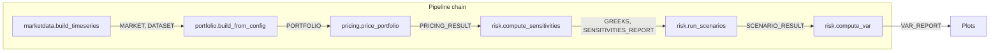

# Option Analytics Workflow Implementation Plan

## Goal

Deliver a **front-office quant / hedge-fund library grade** Option Analytics workflow (workflow only, no UI) under `examples/workflows/option_analytics/`, with:

- **Run script** that accepts config via **file**, **direct (in-code)**, or **CLI**, and runs one or more pipelines in sequence, passing state between them.
- **Plots module** that produces comprehensive visualisations from pipeline outputs.
- **config.yaml** that drives market data, portfolio, pricing, risk, and plot options.
- **README.md** written at **PhD-level mathematics / theory depth**: derivations, definitions, and interview-oriented explanations so the workflow doubles as a learning and interview-prep resource.

Existing folder already has empty `run_option_analytics.py`, `plots.py`, `config.yaml`, and `README.md`; these will be implemented. This plan document lives in the same folder (`PLAN.md`) for reference.

---

## 1. Workflow design (pipeline chain)

Align with Application Project 1: Market Data → Snapshot → Portfolio → Calibration (optional) → Pricing → Risk (Greeks, scenarios, VaR) → Visualisation.

**Pipeline sequence (production-realistic):**

- **marketdata.build_timeseries**: Produces `MARKET` (snapshot) and `DATASET` from config.
- **portfolio.build_from_config**: Builds `PORTFOLIO` from `config.portfolio.positions`.
- **pricing.price_portfolio**: Requires `MARKET` + `PORTFOLIO`; produces `PORTFOLIO_PRICING_RESULT`, `PORTFOLIO_PRICING_SUMMARY`.
- **risk.compute_sensitivities**: Requires `MARKET`, `PORTFOLIO`; produces `POSITION_GREEKS`, `AGGREGATED_GREEKS`, `SENSITIVITIES_REPORT`.
- **risk.run_scenarios**: Requires `MARKET`, `PORTFOLIO`; produces `SCENARIO_RESULT`, `SCENARIO_REPORT`.
- **risk.compute_var**: Requires `MARKET`, `PORTFOLIO` (and optionally historical data); produces `VAR_REPORT`.

State is accumulated: after each pipeline run, merge `ctx.state` into a shared state dict and pass it as `initial_state` to the next pipeline.

---

## 2. Config: file, direct, and CLI

The workflow **must** be driven by configuration in three supported ways:

1. **From file**: Load a YAML (or JSON) config from disk. Default: `config.yaml` in the same directory as the run script. Override via CLI (see below).
2. **From CLI**: `--config path/to/config.yaml` to specify the file. Optional `--no-plots` to disable plot generation. Optional `--workdir path` to override `io.workdir` in config. Any CLI override takes precedence over the loaded file.
3. **Direct (programmatic)**: The run script exposes an entry point that accepts a **config dictionary** (and optionally `workdir`, `generate_plots`) so that the workflow can be invoked from another Python script or notebook with a dict (e.g. built in code or from a different format). Example: `run_option_analytics(config_dict=my_config, workdir="./out")`.

**Implementation notes:**

- **File loading**: Use `src.orchestrator.config.loader.load_run_config(path)` if the file matches the existing `RunConfig` schema (single pipeline + params). For a **workflow** config (multiple pipelines, workflow section), implement a small loader that reads YAML/JSON and either (a) builds a workflow-specific structure (list of pipeline names + full params), or (b) produces one RunConfig per pipeline. The run script then runs in a loop. If the existing loader only supports single-pipeline format, add a thin wrapper: e.g. `load_workflow_config(path)` that returns a dict with keys `workflow`, `io`, `params`, and the run script builds per-pipeline `RunConfig` from that.
- **CLI**: Use `argparse` (or similar): `--config`, `--no-plots`, `--workdir`. Parse and pass into the same code path as file/direct.
- **Direct**: `def run(config: dict | str | Path, *, workdir: Optional[str] = None, generate_plots: Optional[bool] = None) -> dict` (or return final context/state). If `config` is a dict, use it directly; if str/Path, load from file first.

Config shape (see Section 3) is the same whether loaded from file or passed directly.

---

## 3. Config shape (config.yaml)

Single YAML (or JSON) with:

- **workflow**: Optional list of pipeline names to run (default: full chain), and flags: `run_calibration`, `run_var`, `generate_plots`.
- **io**: `workdir`, optional `artifacts_dir`, `logs_dir`.
- **params.marketdata**: For `marketdata.build_timeseries` (universe, start_date, end_date, snapshot_date, provider).
- **params.portfolio**: For `portfolio.build_from_config` (name, base_currency, positions).
- **params.pricing**: Optional overrides for `pricing.price_portfolio`.
- **params.risk**: Nested: **sensitivities**, **scenarios**, **var**.
- **params.plots**: Which plots to generate, output directory (default: under `io.workdir`).

Run script builds one `RunConfig` per pipeline (same `io`, `params` or relevant slice) and runs in order with state chaining.

---

## 4. Run script (run_option_analytics.py)

**Responsibilities:**

1. **Path setup**: Add repo root to `sys.path`.
2. **Config resolution**: Support (a) load from file (default or `--config`), (b) override from CLI (`--workdir`, `--no-plots`), (c) direct dict input when called programmatically.
3. **Run pipeline chain**: For each pipeline in order, build `RunConfig`, call `run_pipeline_from_config(cfg, initial_state=state)`, merge `ctx.state` into `state`.
4. **Artifacts**: Pipelines write via artifact store; run script may write a workflow summary JSON.
5. **Plots**: If config (or direct arg) requests plots, call `plots.generate_all(state, config, out_dir)`.

**CLI**: `--config path`, `--no-plots`, `--workdir path`.

**Error handling**: Validate required state keys after each pipeline; clear messages for missing keys.

---

## 5. Plots module (plots.py)

- **generate_all(state, config, out_dir)** and per-plot functions reusing `src/core/reporting/plots` (greeks_surface, vol_surface, pnl_by_scenario, etc.).
- Portfolio summary, VaR summary, Greeks-by-underlying; all tolerate missing state keys.
- Use report style; save PNG (and optionally PDF) under `out_dir` with stable names.

---

## 6. README.md (option_analytics) — PhD-level mathematics and theory

The README **must** be **incredibly detailed** and written at **almost PhD mathematics level** so that running and reading the workflow serves as a **learning and interview-preparation** resource. It should cover:

### 6.1 Structure and depth

- **Notation**: Define all symbols used (S, K, T, r, q, σ, Δ, Γ, ν, Θ, ρ, etc.) in one place.
- **Definitions**: Formal mathematical definitions for option value, Greeks, implied volatility, VaR, CVaR, scenario PnL, etc.
- **Derivations**: Where instructive, include short derivations (e.g. Black–Scholes call price, Black–Scholes Greeks, VaR definitions, relationship between VaR and CVaR).
- **Assumptions**: State model assumptions (risk-neutral measure, lognormal underlying, no arbitrage, etc.) and where they are used in the pipeline.
- **Interview angles**: For each major concept (pricing, Greeks, vol surface, scenarios, VaR), add a subsection “Interview focus” or “Key points for interviews” (e.g. why delta-hedging works, why vega is positive for long options, limitations of VaR, difference between historical and parametric VaR).

### 6.2 Suggested README sections (detailed)

1. **Title and purpose**  
   Option Analytics workflow: pricing, Greeks, volatility surface, scenario analysis, VaR/CVaR, and visualisations. Purpose: production-style run + deep reference for theory and interview prep.

2. **Prerequisites and how to run**  
   - Prerequisites (Python, packages, repo layout).  
   - Run from file: `python run_option_analytics.py`, `python run_option_analytics.py --config path/to/config.yaml`.  
   - CLI options: `--config`, `--no-plots`, `--workdir`.  
   - Programmatic: `run(config_dict=..., workdir=..., generate_plots=...)` (with exact function signature).

3. **Mathematical framework**  
   - **Probability and measure**: Risk-neutral measure Q, discount factor, martingale property of discounted asset price.  
   - **Option payoff**: European call/put payoff notation; cash settlement.  
   - **Black–Scholes–Merton (BSM)**: SDE for S under Q, solution, lognormal distribution; BSM formula for call and put; put-call parity.  
   - **Greeks**: Definition as partial derivatives (Δ = ∂V/∂S, Γ = ∂²V/∂S², ν = ∂V/∂σ, Θ = ∂V/∂t, ρ = ∂V/∂r); BSM closed forms where used; interpretation (hedge ratios, convexity, time decay, vol sensitivity, rate sensitivity).  
   - **Implied volatility**: Definition (σ_impl such that BSM price = market price); invertibility; smile and term structure.  
   - **Volatility surface**: σ(T, K); no-arbitrage (calendar spread, butterfly); brief mention of SABR/local vol if referenced in calibration.  
   - **Scenario analysis**: Shocks (parallel, relative); PnL = V(S',σ',r') − V(S,σ,r); use for stress testing.  
   - **Value-at-Risk (VaR)**: Definition (quantile of loss distribution); confidence level α; historical vs parametric (variance-covariance) vs Monte Carlo; limitations (non-subadditive, tail blindness).  
   - **Conditional VaR (CVaR / Expected Shortfall)**: Definition E[Loss | Loss ≥ VaR]; coherence; comparison to VaR.

4. **Pipeline chain and state**  
   - Order of pipelines and what each step consumes/produces (state keys).  
   - Short explanation of why this order (market first, then portfolio, then pricing, then risk).  
   - Diagram (ASCII or reference to a figure) of data flow.

5. **Config reference**  
   - Every top-level key and important nested key: meaning, type, default, and how it affects each pipeline.  
   - Example snippets for marketdata, portfolio, risk (scenarios, VaR), plots.

6. **Outputs and artifacts**  
   - Directory layout (workdir, logs, artifacts, plots).  
   - List of generated plots with one sentence each on what they show and which state keys they use.

7. **Interview-oriented summary**  
   - One-page “cheat sheet”: key formulas (BSM, Greeks, VaR, CVaR), key interview questions (e.g. “Explain delta-hedging”, “Why is vega positive for long options?”, “What is wrong with VaR?”), and where in the workflow each concept appears.

8. **Related documentation**  
   - Links to Application Project 1, orchestrator pipeline docs, library overview, and `examples/workflows/README.md`.

No need to duplicate the full library API; the README should be self-contained for **theory and workflow** and point to code/docs for implementation details.

---

## 7. Implementation order (recommended)

1. **config.yaml**: Full schema with sensible defaults.  
2. **run_option_analytics.py**: Config loading (file + direct + CLI), pipeline chain, state merge, plots call, error handling.  
3. **plots.py**: `generate_all` and per-plot functions; reuse existing reporting plotters; handle missing keys.  
4. **README.md**: PhD-level sections (notation, definitions, derivations, assumptions, pipeline/state, config, outputs, interview summary, links).  
5. **examples/workflows/README.md**: Add row for `option_analytics/` and brief description.

---

## 8. Out of scope

- UI (Dash app).  
- New orchestrator pipelines.  
- Changing existing pipeline implementations or state key contracts.

---

## 9. Files to create or edit

| File | Action |
|------|--------|
| `examples/workflows/option_analytics/config.yaml` | Implement full schema (workflow, io, params.*). |
| `examples/workflows/option_analytics/run_option_analytics.py` | Implement: config (file / direct / CLI), pipeline chain, state merge, plots call. |
| `examples/workflows/option_analytics/plots.py` | Implement: generate_all, per-plot functions; reuse reporting plotters. |
| `examples/workflows/option_analytics/README.md` | Write at PhD-level: notation, definitions, derivations, assumptions, pipeline/state, config, outputs, interview summary, links. |
| `examples/workflows/README.md` | Add row for `option_analytics/` and brief description. |
| `examples/workflows/option_analytics/PLAN.md` | This plan (saved in-project for reference). |

No changes to `src/` or other pipelines required for this workflow-only implementation.
