# `tranql/models/rade/rade_qnet/rade_qnet/docs`

6 file(s). Create the directory, then create each file below with the exact contents of its block.

| # | File | Lines | Bytes | SHA-256 |
| --- | --- | ---: | ---: | --- |
| 1 | `ARCHITECTURE.md` | 1501 | 72827 | `a3fb518abd400722` |
| 2 | `CODING_STANDARDS.md` | 394 | 16492 | `36ccc834b3a6e610` |
| 3 | `GUIDE.md` | 1149 | 45270 | `c82a3b4e2f97e0a3` |
| 4 | `IMPLEMENTATION.md` | 445 | 22286 | `ab00d7895cb5df61` |
| 5 | `MODEL_IMPLEMENTATION.md` | 851 | 37552 | `94ad0612437a98ee` |
| 6 | `README.md` | 54 | 2659 | `ef24e3568f6a7890` |

---

## 1. `tranql/models/rade/rade_qnet/rade_qnet/docs/ARCHITECTURE.md`

72827 bytes · SHA-256 `a3fb518abd400722`

````markdown
# rade_qnet — Architecture

A model-independent framework for machine learning and reinforcement learning
in quantitative finance.

> **Status.** Phases S to 6 are delivered: supervised training, evaluation,
> inference and tuning on three engines, job sets, and refactor parity for the
> flagship. Phase 7, reinforcement learning, has its scaffold delivered -- the
> interactive path runs end to end with a control learner that performs no
> update -- and no algorithm yet. See [`IMPLEMENTATION.md`](IMPLEMENTATION.md).
>
> **Reading the planned parts.** This document describes what exists, and
> marks what does not. Anything not yet built is labelled **⬜ Planned**,
> drawn with a dashed grey outline in diagrams, and listed with what it needs
> in [§15](#15-roadmap-what-is-planned-and-what-it-needs). Nothing marked
> planned exists as an importable module: an empty base class would answer
> `isinstance` checks and imports for a capability the framework cannot
> deliver, which is worse than its absence.

---

## Contents

1. [The problem](#1-the-problem)
2. [The central idea](#2-the-central-idea)
3. [The layer stack](#3-the-layer-stack)
4. [The vocabulary: `core`](#4-the-vocabulary-core)
5. [Stage contracts and the train pipeline](#5-stage-contracts-and-the-train-pipeline)
6. [One protocol for ML and RL: `BatchSource`](#6-one-protocol-for-ml-and-rl-batchsource)
7. [Engines](#7-engines)
8. [Orchestration: one run, and many](#8-orchestration-one-run-and-many)
9. [Storage: the system of record](#9-storage-the-system-of-record)
10. [Analysis: metrics, visuals, reports](#10-analysis-metrics-visuals-reports)
11. [Writing a model](#11-writing-a-model)
12. [Using the framework](#12-using-the-framework)
13. [Design decisions and the defects they fix](#13-design-decisions-and-the-defects-they-fix)
14. [Glossary](#14-glossary)
15. [Roadmap: what is planned, and what it needs](#15-roadmap-what-is-planned-and-what-it-needs)

---

## 1. The problem

A quantitative researcher with a model idea currently has to build, before
learning anything: a data loader, a split that does not leak, a training loop,
checkpointing, early stopping, metric computation, plots, a way to save the
model so it can be reloaded in three months, a way to run it across forty
clusters, and a way to do all of that again on a GPU box.

That work is almost entirely independent of the model. It is also where the
expensive mistakes live. A split that shuffles before slicing, a scaler fitted
on the test set, a saved model that cannot be reloaded after a refactor — none
of these announce themselves. They produce encouraging numbers.

`rade_qnet` takes that work away and does it once, correctly. A model author
supplies three things:

| They supply | The framework supplies |
| --- | --- |
| The architecture (`model.py`) | Training, evaluation, inference, tuning |
| How its data is built (`data.py`) | Leakage-aware splits, fitted-state handling |
| What state it needs at inference (`state.py`) | Versioned bundles, catalog, provenance |
| *(optional)* pipeline step overrides | Metrics, figures, reports, fan-out, placement |

The flagship model, a hybrid graph-temporal network for P&L replication, is
deliberately the hardest case the framework has to serve. If the abstractions
hold for it, they will hold for most things. The reference models check the
opposite end: `ridge`, `xgb_tabular` and `lstm_tabular` sit beside the flagship
in `models/`, and a ridge regression must still cost a few short files.

---

## 2. The central idea

The framework owns the **lifecycle**; the model owns the **mathematics**.

Every model, regardless of library or complexity, moves through the same four
pipelines, and each pipeline is a *template method*: `run()` calls a sequence of
small, individually typed, individually overridable steps.

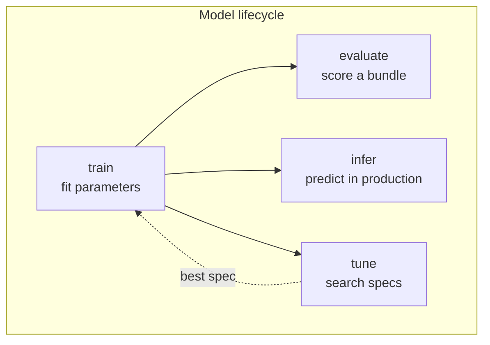

The granularity of the steps is the whole design. A model author who wants a
different loss overrides one step. They do not reimplement training, and they
do not fork the framework.

### Four customisation tiers

Use the lowest tier that works. Most models never leave tier 1.

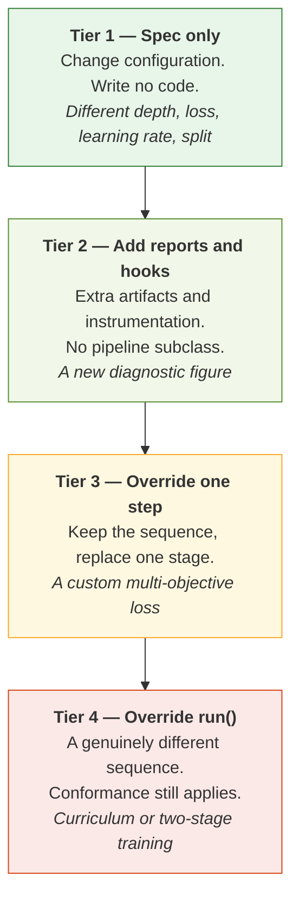

If a model needs tier 4 often, that is a signal about the framework, not about
the model, and it should be raised rather than worked around.

---

## 3. The layer stack

Eight top-level packages, forming a one-way stack. A package may import from
the packages below it and never from the packages above.

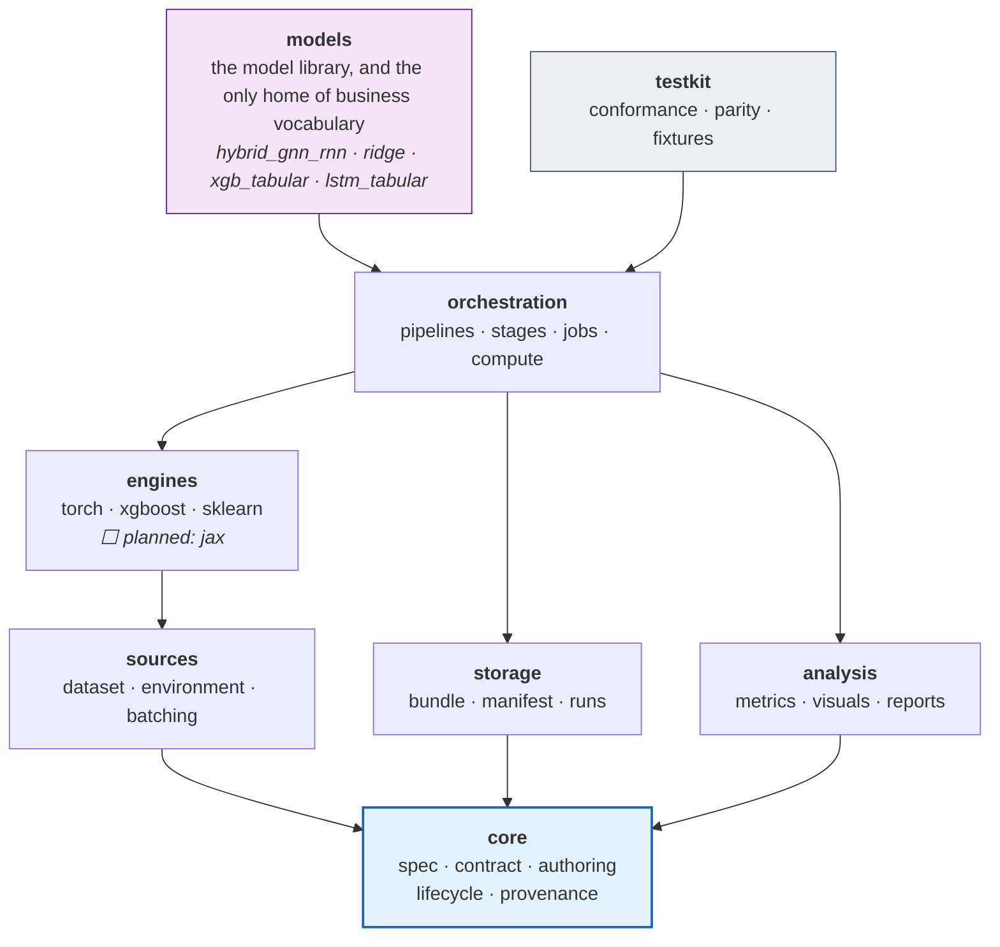

The permitted dependencies are not a convention. They are encoded in
`ALLOWED_DEPENDENCIES` in `tranql/models/rade/rade_qnet/tests/test_scaffold.py` and checked by
walking the abstract syntax tree of every module in the package. Architectural
boundaries are rarely broken by a decision to break them; they are broken by
one convenient import in a hurry. The test turns that import into a CI failure
rather than a precedent.

Four of those rules carry most of the weight:

**`core` depends on nothing, and imports no training library.** Only the
standard library, `pydantic` and `numpy`. This is what lets a specification be
parsed, validated, hashed and shipped to a worker in a process that has never
imported PyTorch. A job set spawning sixteen workers pays every import cost
sixteen times, so this is a throughput property as much as a design one. It is
enforced by an allowlist, because what actually needs protecting is "`core`
stays cheap", and that is broken by the next heavy dependency nobody thought to
ban.

**`orchestration` may not import `models`.** Pipelines resolve a model by name
through the component registry. If a pipeline imported a model, the framework
would depend on the library it exists to serve, and no user could add a model
without editing the framework.

**Business vocabulary lives only in `models`.** Knowing that a number is a
P&L in a particular currency on a particular desk is a model's business,
expressed in its own `data.py`. The moment a training loop knows it, the
framework stops being reusable on the next problem. An earlier design gave
such knowledge its own `domains` layer; on inspection everything in it was
either generic machinery (now `orchestration.jobs.groups` and `.fanout`) or
one model's vocabulary (now in that model), so the layer was removed. The
test for where a new file belongs: *would it be different on another team's
problem?* If yes, it belongs in a model.

**`storage` may not import `engines`.** Serialising weights is the engine's
job — it knows what a `state_dict` is. Storage takes the bytes an engine hands
it and is responsible for getting them onto disk safely.

---

## 4. The vocabulary: `core`

`core` defines what things are called and what shape they have. Five
sub-packages, five distinct jobs.

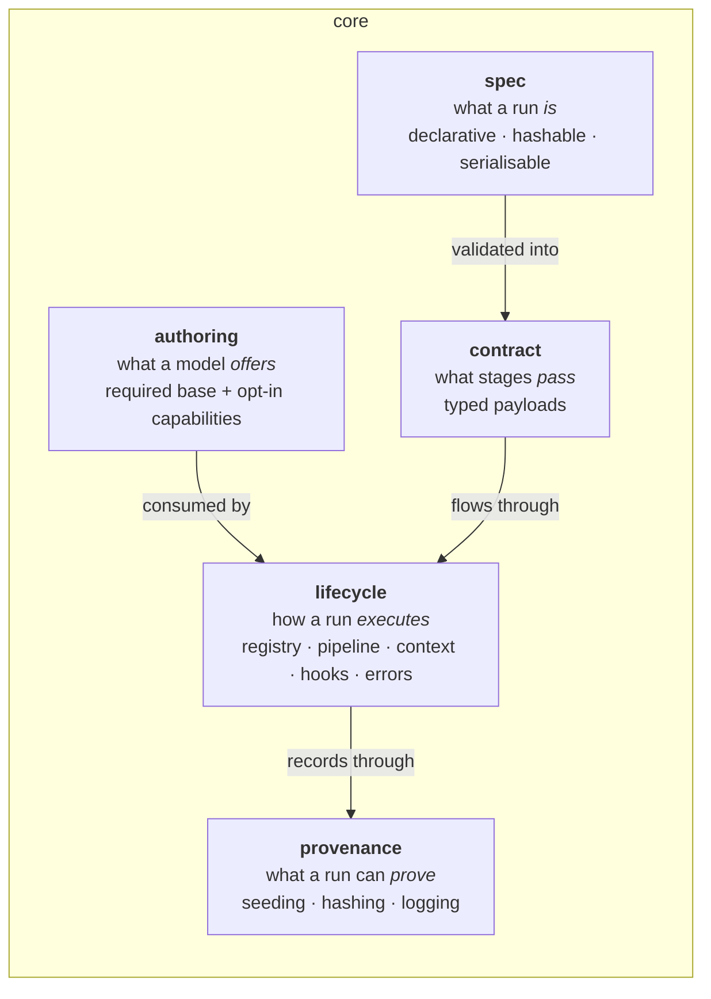

The two that look alike are the ones to be clear about. `spec` is what a
YAML file may say; `contract` is what the code
promises between stages. `authoring` is the only one a model author has to
read. `lifecycle` and `provenance` were one package called `runtime`, and
they split on *who opens the file*: someone extending the framework reads
the first, someone who has to answer for a result reads the second.

### 4.1 Specs — what a run is

Every spec is a `pydantic` model with `extra="forbid"`. A typo in a YAML key is
a load-time error, not a silently ignored setting. Specs round-trip exactly:
`Spec.model_validate(spec.model_dump())` returns an equal object, which is what
makes a persisted spec a faithful record of how a model was produced.

Specs describe *intent only*. They hold no fitted state, no file handles, no
tensors and no live objects, which keeps them cheap to hash, log and send
across a process boundary.

Unions are **discriminated**, so a validation error names the field rather than
reporting five failed alternatives:

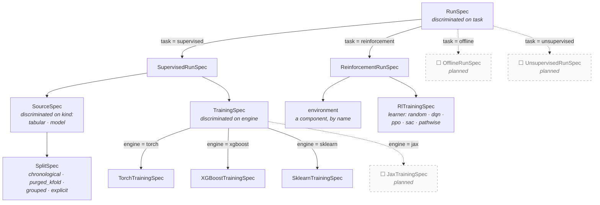

Every run spec, whatever its task, also carries a `HardwareSpec`, a
`ReportsSpec`, a seed, an output root and tags; they are left off the diagram
because they never vary by branch.

`RlTrainingSpec.learner` already names four algorithms that are not built.
The names are reserved so a configuration written today stays valid, and
selecting one is refused when the run resolves its learner -- `no learner
named 'dqn'; available: random, supervised` -- rather than at some later
point. The two dashed tasks are new discriminator values, which is why adding
a paradigm is a new branch here and not a change to the existing two.

One separation is worth calling out. `HardwareSpec` answers *how does a single
job use its machine* — device, precision, compilation, distribution,
determinism. `PlacementSpec` (in the job-set spec) answers *where do jobs
run* — executor, worker count, visible GPUs. Conflating them is why
"run it on the GPU" and "run forty of them in parallel" so often turn into the
same tangled flag.

### 4.2 Contracts — what stages pass

A contract is the promise one stage makes to the next. Because the promise is a
declared type rather than a convention, a stage can be overridden, cached,
replayed or executed in another process without the neighbouring stages
changing.

Contracts are generic over the engine where it matters:

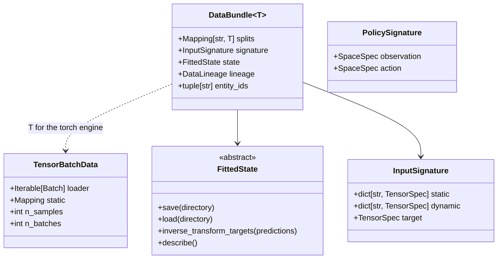

`T` is whatever the engine consumes: `TensorBatchData` for Torch, plain
feature and target arrays for XGBoost and scikit-learn. `PolicySignature` is
the interactive counterpart of `InputSignature` -- an observation space and an
action space, and no target, which is why §6 needs two learner protocols.

Two of these deserve emphasis.

**`InputSignature`** separates *static* from *dynamic* inputs. A static input
is constant across every batch — a graph, an entity feature matrix, an index
array. A dynamic input varies per sample. The distinction is what lets static
tensors be uploaded to the device once rather than collated per sample, and it
is also what lets a model be rebuilt from a saved bundle without re-running the
data build.

**`FittedState`** is the abstract base for everything a model fits during
training and needs again at inference time: target scalers, a selected feature
basis, an entity encoder, a graph. It replaces the sidecar-file sprawl of the
implementation this framework supersedes — roughly twenty loose artifacts whose
relationship to each other existed only in the loading code — with one typed,
self-describing object that knows how to save itself, load itself, and invert a
prediction back into the original target units.

### 4.3 Capabilities — what a model offers

The base class demands very little: build a model object from a spec and a
signature. That minimum is what keeps a simple model small.

There is one base per paradigm, both under `ModelDefinition` in
`core/authoring`: `SupervisedModel` (a `PredictorDefinition`, which maps
inputs to a target) and `PolicyModel` (a `PolicyDefinition`, which maps an
observation to an action). A third paradigm is a third base beside them --
see [§15](#15-roadmap-what-is-planned-and-what-it-needs) -- and touches
neither of these.

Everything beyond it is an **opt-in capability** — a narrow protocol a model
*may* implement. The framework checks with a runtime `isinstance` test, so a
model never pays for a feature it does not use, and a new capability never
breaks an existing model.

| Capability | The model is saying | The framework then |
| --- | --- | --- |
| `StaticInputs` | "Some of my inputs are the same every batch." | Moves them to the device once; keeps them out of collation. |
| `Precomputable` | "An expensive encoding of those can be reused." | Computes it once per evaluation pass. |
| `CustomStep` | "I own my loss computation." | Delegates the training step. |
| `Routable` | "I can be a member of a job set." | Records which targets this member covers. |
| `Inductive` | "I can predict for entities I never saw." | Enables the unseen-entity inference path. |

### 4.4 Lifecycle — how a run executes

Every stage goes through `Pipeline.step()`. That single choke point is where
the framework's observability comes from:

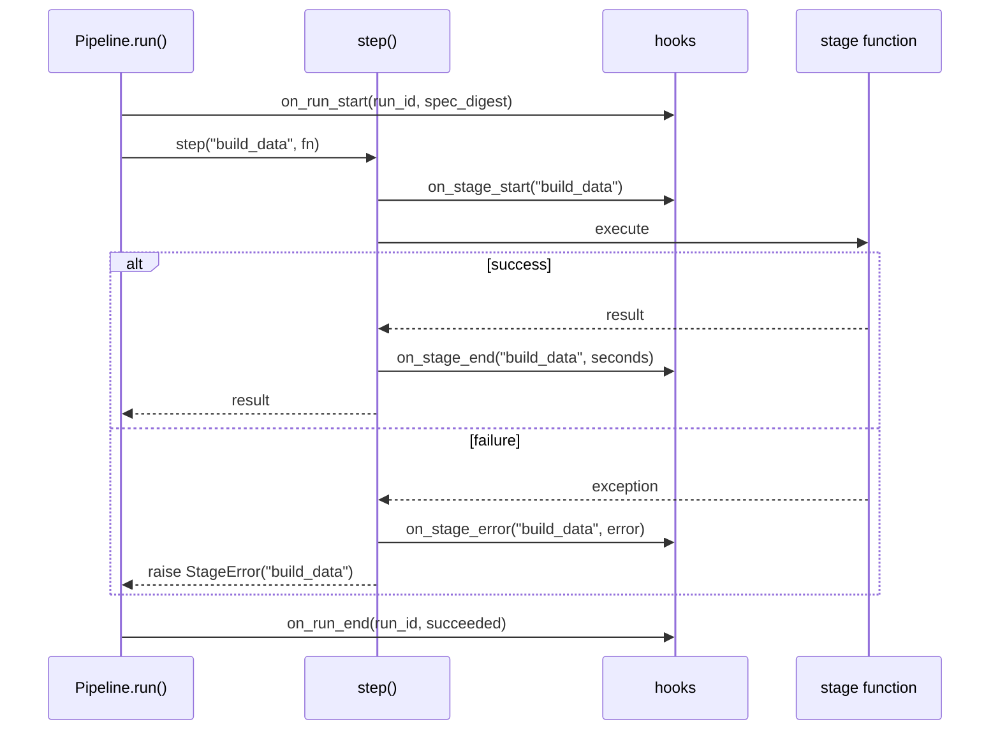

A failure therefore always names the stage it occurred in, and a hook can
observe any stage -- plus epochs, metrics and written artifacts, through
`on_epoch_end`, `on_metrics` and `on_artifact` -- without a pipeline change.

There is deliberately no general step cache. An early outline put one here;
it was replaced by two narrower mechanisms, because a cache keyed on "spec
hash plus stage" cannot tell when the *code* that produced an entry has
changed. `sources.dataset.cache.DatasetCache` caches a prepared dataset on
disk, keyed on the source spec, the raw input's fingerprint and the framework
version, so a fix to the splitter invalidates every entry built by the old
one. And the tune pipeline holds one prepared dataset for the whole search, so
forty trials read the data once. Why, in detail:
[Phase 5 §8.1](phases/PHASE_5_EVALUATE_INFER_TUNE.md).

`core.lifecycle` also holds the component registry (`@model`, `@engine`,
`@learner`, `@report`), which resolves a *name* in a spec to a class. Names
rather than importable dotted paths, so moving a class does not invalidate
every saved spec that referenced it. `core.provenance` holds the other half of
running: seeding, hashing and structured logging, which is what a run can
later prove about itself.

---

## 5. Stage contracts and the train pipeline

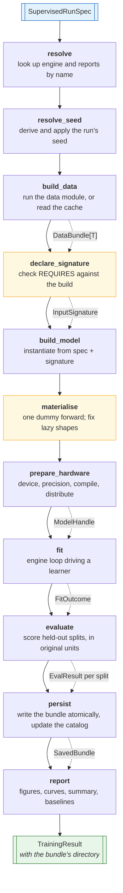

Three stages are easy to overlook and all exist because of real failures.

**`declare_signature` checks the model can use the data before the model
exists.** The build declares what it produced; the model's `REQUIRES` names
what it consumes and at which ranks. A mismatch fails here, naming the input,
instead of training on whichever tensor happened to arrive first -- see §11,
*The input contract*.

**`materialise` runs before `prepare_hardware`.** A model with lazily-shaped
parameters has no parameters at all until it has seen one batch. Wrapping it
for distributed training, handing it to an optimiser, or checkpointing it
before that point produces either an empty parameter group or a crash deep
inside the distributed library. The order here is not incidental.

**`persist` is the only stage that writes to the store, and `report` follows
it.** A run that fails before `persist` leaves no half-registered bundle. A
report reads a finished bundle, so it cannot run earlier, and because a report
never fails a run -- unless `reports.fail_fast` asks it to -- running it last
means a figure that will not render can never cost a trained model.

The evaluate, infer and tune pipelines share the vocabulary and the step
runner. There are five pipelines in all, in `orchestration/pipelines/`; the
fifth, `reinforce`, is in §6.

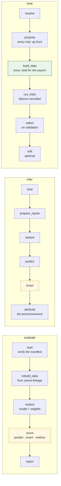

Inverting the target transform is never optional. In `infer` it is its own
stage, `invert`; in `evaluate` and in training it happens inside scoring, in
`orchestration.stages.scoring`, before any metric is computed. A mean absolute
error reported in standardised space is not a quantity anyone can act on, so
predictions are returned to original units *before* `analysis.metrics` is
reached. Every number a user reads is in the units they think it is in.

The shared stages live in `orchestration/stages/`: `resolve` (names to
components), `reload` (a saved bundle back to a working model or policy),
`scoring` and `search`. A pipeline is the sequence; a stage module is the
work, so two pipelines that both need to reopen a bundle do it the same way.

### Two fitting axes, two leakage rules

This distinction matters enough to state precisely, because getting it wrong in
either direction is costly.

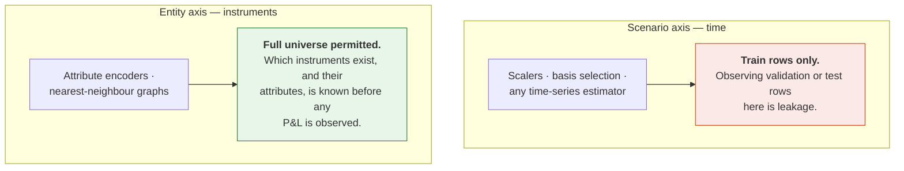

A conformance rule that simply said "fitted transforms may only see training
indices" would be wrong, and would falsely fail the flagship model — whose
graph construction legitimately spans the whole instrument universe. The
conformance suite distinguishes the axes.

---

## 6. One protocol for ML and RL: `BatchSource`

Supervised learning and reinforcement learning differ far less than their
tooling suggests. Both consume a stream of batches. They disagree only about
where the batches come from.

`BatchSource` makes that the *only* difference. One protocol, one training
loop, and five ways of feeding it -- two built, three **⬜ planned**:

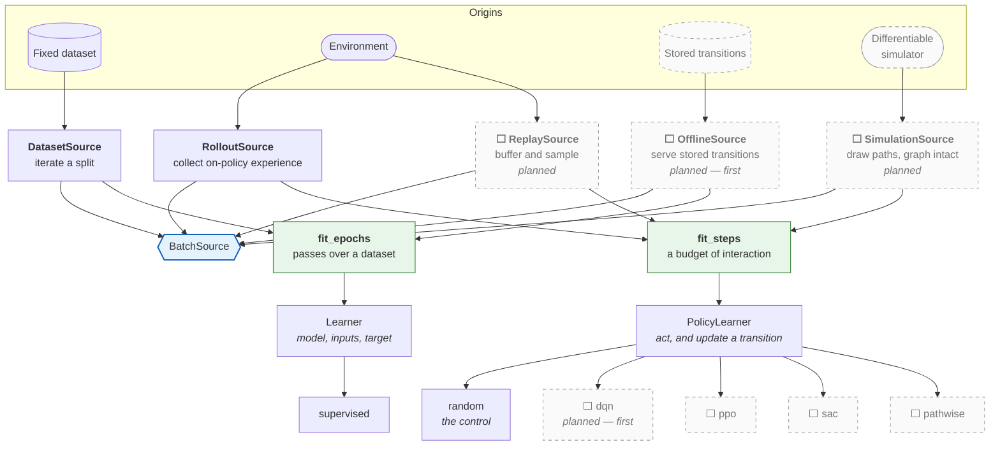

What runs today: `DatasetSource` under `fit_epochs` for every supervised
model, and `RolloutSource` under `fit_steps` driving `random`, a learner that
acts from the policy's output and performs no update. `random` is the control
an algorithm must beat, and it is what proves the interactive path -- the
`reinforce` pipeline, policy bundles, `api.agent` -- works end to end before
any algorithm is trusted with it. The dashed half is the roadmap in
[§15](#15-roadmap-what-is-planned-and-what-it-needs).

> ⬜ **Planned: which driver serves stored transitions.** The diagram routes
> `OfflineSource` to `fit_epochs`, because a fixed set of transitions is finite
> and a pass over it means something. But `fit_epochs` drives a `Learner`, and
> a transition has no target -- it needs a `PolicyLearner.update`. That
> tension is resolved when `OfflineSource` is built, not by guessing now; the
> constraint it must satisfy is that neither driver grows a branch for the
> other's case.

The interactive pipeline mirrors the supervised one stage for stage:

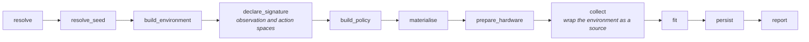

The loop decides *when* to step, validate, checkpoint and stop. The learner
decides *what one update means*. A supervised regression, a deep Q-network and
a pathwise hedging objective are then three learners sharing one loop shape,
instead of three training scripts that drift apart.

**Two drivers, chosen by the source and nothing else.** A source that reports
`steps_per_epoch=None` is unbounded, and that single value selects the driver:
`fit_epochs` for a finite dataset with a meaningful notion of a pass,
`fit_steps` for an environment where only the step count is meaningful. Each
driver refuses the other's source by name, rather than inventing the missing
number — an invented pass length would silently become the denominator of every
reported metric and the period of every schedule.

**Two learner protocols, because a policy has no target.** This is the one
place the unification is narrower than it first looks, and it is worth being
precise about. `Learner` takes `(model, inputs, target)`, because `fit_epochs`
splits each batch using the signature's declared target. `PolicySignature` has
an observation space and an action space and nothing resembling a target, and
an interactive update consumes a whole transition rather than a pair. So
`PolicyLearner` declares `act` and `update` instead.

The alternative — widening `Learner` so `target` is optional — would have
pushed an interactive branch into every supervised learner, which is the
coupling the loop/learner split exists to prevent. What the split bought is
still real: both drivers are the same shape, share their callbacks and
records, and the interactive pipeline is a sibling of the supervised one rather
than a forked lifecycle.

### Why `DifferentiableEnvironment` is first-class

Most reinforcement-learning libraries model only step-and-reward dynamics, so a
hedging or replication problem has to be forced into a transition-based
interface — which discards the exact gradients that make it tractable in the
first place.

When the dynamics are themselves differentiable, a risk measure can be
back-propagated straight through a simulated path. No value function, no policy
gradient estimator, no variance to fight. For a quantitative-finance framework
this is not an exotic case; it is a large fraction of the interesting problems,
so it gets its own protocol rather than an adapter.

The protocol is not declared yet, and the reason is a rule worth stating
generally: **a `runtime_checkable` protocol with no distinguishing member is
satisfied by everything.** An `isinstance` check against a
`DifferentiableEnvironment` that added no members would answer `True` for a
plainly non-differentiable environment, which is worse than having no check.
The member it needs is whatever the pathwise learner reads, so it arrives with
that learner.

**On the existing `q_learning` package:** the reinforcement-learning design
here is a clean redesign, not a port. `q_learning`'s agent and environment
protocols assume tabular and transition-based learning throughout, which cannot
express the pathwise case and does not compose with the `BatchSource`
unification. Its *use cases* informed the requirements; none of its structure
is carried over.

---

## 7. Engines

An engine is the only place in the framework permitted to know about a specific
training library. It answers a fixed set of questions for its library:

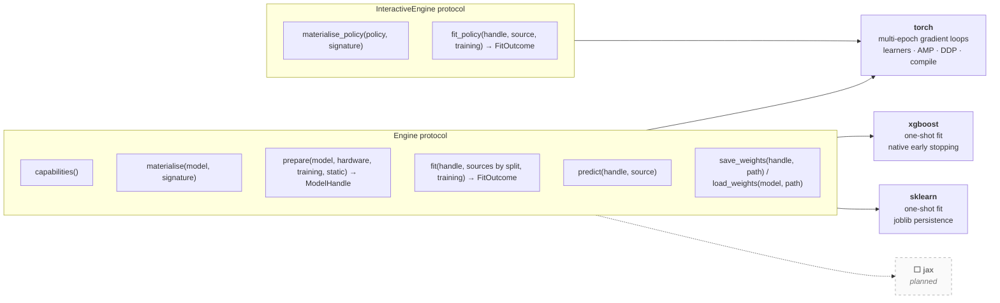

An engine does not build models: the model definition does, from the spec and
the signature, which is what lets the same `build_model` serve a model whose
engine is chosen in configuration. The engine takes the built object from
there. `InteractiveEngine` is a separate protocol rather than optional methods
on `Engine`, so an engine that cannot train a policy is not forced to carry
two methods that raise; only Torch implements it.

The XGBoost engine is the honesty test. Trees fit in a single call with no loop
at all. If the engine contract can only accommodate a model that trains over
epochs, then it is a PyTorch interface with a generic name. It is held to the
same shared conformance suite as the Torch engine, and it produces the same
artifacts — including a boosting history reported through the same `FitOutcome`
a neural network produces.

Because the pipelines talk only to this interface, adding a backend is a new
sub-package, a new member of the `TrainingSpec` union, and one registration
line. It is not a change to any pipeline. A JAX engine is planned on exactly
those terms; TensorFlow is not, for the reasons in
[§15](#15-roadmap-what-is-planned-and-what-it-needs).

---

## 8. Orchestration: one run, and many

### 8.1 What a job set is

A job set is deliberately unglamorous: **a list of jobs, each a full
independent training run of the same model**, differing in its data slice and —
optionally — in its architecture complexity. A liquid cluster with abundant
history can be given a wider, deeper configuration than a sparse one, from the
same specification file.

What a job set is *not* is a kind of model. There is no ensemble model class,
no shared parameters and no joint optimisation. Fan-out is an execution
concern, which is why `jobs` sits beside `compute` rather than inside `models`.

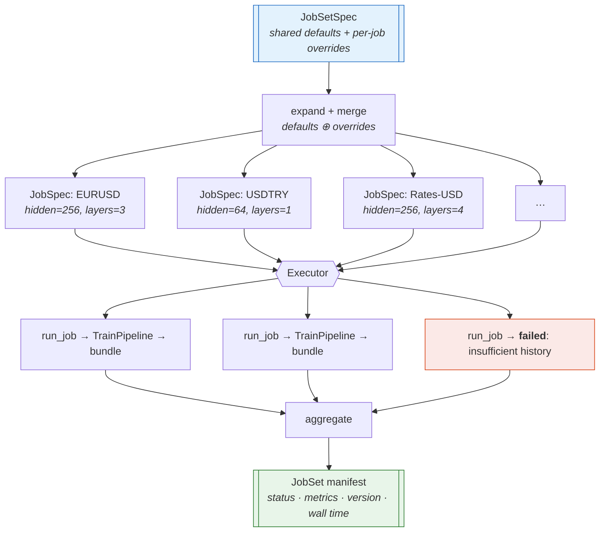

**Partial failure is first-class.** A set of forty clusters where one has
insufficient history returns thirty-nine trained models and one recorded
failure with its reason. Discarding thirty-nine good models because of one bad
input is the behaviour that makes a framework untrustworthy at scale.

### 8.2 Placement cannot change results

An executor takes a list of callables and runs them. That is the entire
interface, and its narrowness is what keeps parallelism out of pipeline logic.
A pipeline cannot observe which executor is running it, so moving from
sequential to eight processes is a configuration change that *cannot* alter
results — and the test suite verifies exactly that by running both and
comparing artifacts.

| Executor | Use | Why it exists |
| --- | --- | --- |
| `local` | Sequential, in-process | The reference implementation every other executor must reproduce, and the only sane way to debug |
| `processes` | CPU parallel | Spawn start method, with per-worker thread budgets so N workers do not each claim every core |
| `gpus` | One worker per device | Device visibility pinned *before* the training library is imported — the only point at which pinning reliably takes effect |
| `cluster` | **⬜ Planned** | Jobs across machines. The executor interface needs no change; what it needs is a shared output root and the catalog's single writer kept on one host |

`executor: auto`, the default, is resolved by
`orchestration/compute/placement.py`: it picks an executor and worker count
from the hardware actually present and the size of the job set -- `gpus` when
devices are visible and the job set wants them, `processes` otherwise, `local`
for a single job -- capped at sixteen workers, so placement need not be
hand-tuned to get reasonable throughput.

---

## 9. Storage: the system of record

A bundle is **self-describing**. Given only a bundle directory, the framework
can state which model produced it, from which spec, against which data
fingerprint, at which code version — and can rebuild the model and invert its
target transforms without consulting the original run.

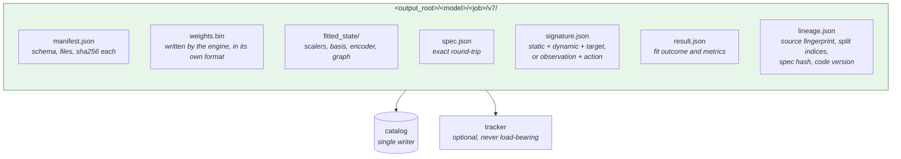

Four properties, each fixing a specific way this goes wrong:

**Atomic writes.** A bundle is built in a temporary directory and renamed into
place. An interrupted write leaves nothing that *looks* valid, which is worse
than leaving nothing at all.

**Content hashes.** Every file is hashed in the manifest, so corruption and
silent drift are detected at load rather than surfacing as inexplicable
predictions.

**`state_dict`, not pickled modules.** A pickled `nn.Module` embeds the import
path of your class. Rename the class and every saved model becomes
unloadable — which is precisely the situation a refactor creates. It also means
loading a model executes arbitrary code from the file. So the Torch engine
writes the `state_dict` alone and reads it back with `weights_only=True`, and
XGBoost writes its own raw booster format. The one exception is scikit-learn,
whose only supported persistence is `joblib` -- a pickle. A scikit-learn bundle
should therefore be loaded only from a store you trust, and its manifest hash
is what tells you the file is the one that was written.

**One catalog writer.** A catalog updated by eight worker processes through
read-modify-write loses entries. Not often. Just often enough that nobody
trusts the catalog, and the index gets rebuilt by hand.

**Decisions are events, not edits.** Choosing among runs -- by tag, by best
metric, by an alias such as `production` -- is `storage.runs.registry`. A tag
added after training, or a promotion, is appended to a log beside the
catalog rather than written into the bundle, so the record of what was
trained never depends on what was decided later, and the log is the audit
trail. Every run under one `output_root` shares one catalog, so a sweep's
variants and successive retrains can be compared. See `GUIDE.md` §12.

**Tracking is optional infrastructure.** A run must never fail because a
tracking server is unreachable. The default is a no-op.

---

## 10. Analysis: metrics, visuals, reports

The split between the last two is the one that usually gets lost in research
code, and it is worth being strict about.

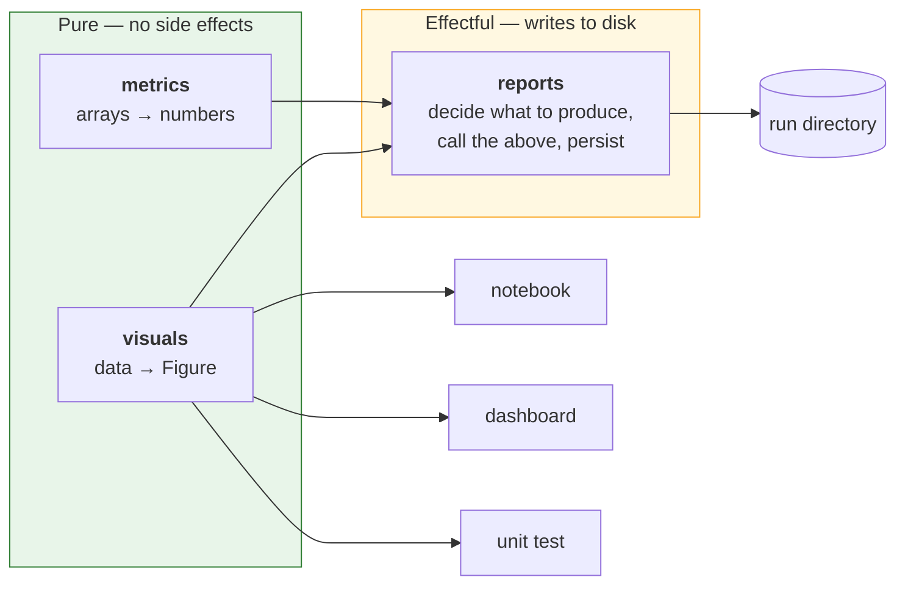

A visual takes data and returns a figure. It does not save, show, close or
mutate global plotting state. That purity is the entire reason the same
function can serve a saved report, a notebook, a dashboard and a test — and it
is what makes it testable at all, since a test can assert on axis labels,
series count and data limits without rendering anything.

A report, by contrast, is where the effects live. Reports are **declarative**
(enabled in the spec, resolved by name) and **never load-bearing**: a report
that raises produces a warning, not a lost training run. Discarding four hours
of training because a figure failed to render is not a trade anyone would make
deliberately.

---

## 11. Writing a model

Every model is a **package** under `rade_qnet/models/`, and every package has the
same five files whatever its size. Capability is added by *adding* files,
never by moving or renaming them.

Three of the five are universal. The other two say what the model learns
from, and so differ by paradigm: a supervised model has `model.py` and
`data.py`; a policy has `policy.py` and `environment.py`. A package with
neither pair, or both, fails the layout test, which is also where a third
paradigm's pair would be added (§15).

> The full procedure -- tier classification, per-file contracts, flowcharts,
> the sign-off checklist and the failure-mode table -- is
> [`MODEL_IMPLEMENTATION.md`](MODEL_IMPLEMENTATION.md). This section states
> the design decision and its rationale; that document is how you follow it.

### One shape, four tiers

```text
models/<name>/
├── __init__.py     ALWAYS   the charter, and `from .register import …`
├── spec.py         ALWAYS   what can be configured
├── register.py     ALWAYS   how it plugs in       (contains no mathematics)
├── model.py        SUPERVISED  what is computed   (imports no framework wiring)
├── data.py         SUPERVISED  REQUIRES, and where the data comes from
├── policy.py       POLICY   observation to action  (in place of model.py)
├── environment.py  POLICY   what it acts in        (in place of data.py)
├── state.py        TIER 2   the FittedState subclass
├── layers/         TIER 3   one architectural block per file
├── features/       TIER 3   model-specific feature construction
├── pipelines/      TIER 4   train.py · eval.py · tune.py  (no infer.py: see below)
└── reports.py, visuals.py   optional, any tier
```

There are no loose modules under `models/` and no category sub-folders:
`rade_qnet.models.<name>` is a model, always. The vocabulary above is closed
and `tranql/models/rade/rade_qnet/tests/models/test_model_layout.py` enforces it, so a file named
anything else is a failing test rather than a convention somebody did not
know about.

### Why the smallest model pays the ceremony too

An earlier version of this document said *"a simple model is one file…
splitting fifty lines across four files helps nobody"*. That was reversed,
for three reasons:

1. **The rule was not true.** It stated that registration lived in
   `model.py`; no simple model had a `model.py` -- the file on disk was
   `ridge.py`. Anyone following the documentation would have written
   something that did not match the repository.
2. **The library had two incompatible shapes and no rule distinguishing
   them.** Simple models were loose files under `models/baselines/`; the
   flagship was a package. A contributor could not tell which applied, and
   either choice was inconsistent with half the library.
3. **The saving was smaller than claimed.** One-file `ridge` was 25
   statements; the split version is 30 before `data.py` and 51 with it.
   "Fifty lines across four files" was never the actual trade, and the
   increase that did arrive bought a checked input contract.

What the uniform shape buys: one procedure with no judgement call, no
migration when a model grows a capability, mathematics that can be read and
unit-tested with no framework present, and a reviewer who always knows which
file to open.

### The input contract

`data.py` is mandatory at every tier, and it carries more than a data module.
It exports a `REQUIRES` naming the inputs the model consumes and their ranks,
which the pipeline checks against the data build at `declare_signature` --
before the model is constructed.

That is the one place in a run where information flows model to data.
Everywhere else the build declares what it produced and the model copes, and
coping is what turns a wrong data build into a plausible loss curve rather
than an error. Two defects motivated it: a recurrent model that scanned the
batch and trained on whichever tensor the dictionary yielded first, and a
wrongly placed time axis that produced a tensor the recurrence accepted and
learned nonsense from. Both ran to completion and reported a falling loss.

`data.py` is required even when it returns the framework's own table module
in one line. The reason is that it almost never stays that way -- the moment
the data lives in a store rather than a CSV, `load()` is the user's -- and a
file that is present from the start means that change touches one function
instead of restructuring the package. See
[`MODEL_IMPLEMENTATION.md` §4.4](MODEL_IMPLEMENTATION.md).

### The `model.py` / `register.py` split

The load-bearing decision. `model.py` reads as a piece of mathematics -- a
reader asking *what does this compute?* opens it and finds nothing else.
`register.py` holds the wiring, for the reader asking *how does this plug
in?* The split is enforced: `model.py` may not import the registry, the run
spec or the training spec.

A tier 1 model, complete:

```python
# rade_qnet/models/ridge/model.py  -- no framework import anywhere
def build(settings: RidgeSpec) -> Ridge:
    return Ridge(alpha=settings.alpha, fit_intercept=settings.fit_intercept)
```

```python
# rade_qnet/models/ridge/data.py  -- what is required, and where it comes from
REQUIRES = InputRequirement.unconstrained()   # a flattening model has no constraints


def data_module(spec: SupervisedRunSpec) -> TabularDataModule:
    del spec
    return TabularDataModule()
```

```python
# rade_qnet/models/ridge/register.py
from ...engines import sklearn as _engine  # noqa: F401  -- registers the engine
from .data import REQUIRES, data_module

@model("ridge", engine="sklearn")
class RidgeModel(SupervisedModel):
    """Framework declaration for the ridge regression."""

    requires = REQUIRES
    spec = RidgeSpec

    def data_module(self, spec: SupervisedRunSpec) -> TabularDataModule:
        return data_module(spec)

    def build_model(
        self, spec: SupervisedRunSpec, signature: InputSignature
    ) -> Ridge:
        del signature
        return build(RidgeSpec.model_validate(dict(spec.model.params)))
```

Note that `build_model` receives the whole `SupervisedRunSpec` and validates
its own parameters out of it, rather than receiving a `RidgeSpec` directly.
The framework cannot type `model.params` -- it is the one block whose shape
only the model knows -- so the model is the thing that parses it.

Note also the engine import. `engine="sklearn"` is a *declaration*; importing
`rade_qnet.engines.sklearn` is what makes the name resolvable. Without it the
model works whenever something else in the process happened to import the
engine, and fails the first time it is run alone.

That model gets the full lifecycle: leakage-aware splits, a versioned bundle,
the standard metrics and reports, and fan-out across a job set. A framework
that only pays off for large models is a framework people work around.

### The same shape at tier 4

```python
# rade_qnet/models/hybrid_gnn_rnn/register.py
@model("hybrid_gnn_rnn", engine="torch")
class HybridGnnRnnModel(SupervisedModel):
    """Framework declaration for the hybrid graph-temporal network."""

    requires = REQUIRES             # the six inputs it consumes, by name
    spec = HybridModelSpec          # validates model.params
    data_spec = HybridDataSpec      # validates source.params
    state_cls = HybridState         # the FittedState subclass
    pipelines: Mapping[str, type] = MappingProxyType(
        {
            "train": HybridTrainPipeline,
            "eval": HybridEvalPipeline,
            "tune": HybridTunePipeline,
        }
    )

    def data_module(self, spec: SupervisedRunSpec) -> HybridDataModule:
        del spec
        return HybridDataModule()

    def build_model(
        self, spec: SupervisedRunSpec, signature: InputSignature
    ) -> HybridGnnRnn:
        ...
```

Four declarations more than `ridge`, in the same file, with the same two
methods. That is what makes the convention worth its ceremony: a reader who
has understood the smallest model has understood the largest one's wiring.

Separate files per stage rather than one `pipelines.py`: a model needing a
custom evaluation but standard training should not have to open a file that
also contains training code.

There is no `infer.py`. Inference is "load the bundle and run the model
forward", and a model that needs to change that has changed what its bundle
means -- which is a problem to fix in the bundle, not to paper over with a
fourth override.

---

## 12. Using the framework

### Train one model

```python
from rade_qnet import api

result = api.train("configs/hybrid_eurusd.yaml")
print(result.evaluations["test"].metrics["mae"])   # already in original target units
```

### Train it across many groups

```python
manifest = api.train_jobs("configs/hybrid_portfolio.yaml")
print(manifest.summary())                      # "39 of 40 job(s) succeeded in 1842.3s"
for record in manifest.failed:                 # a failed job is a record, not an exception
    print(record.job_id, record.failure_kind, record.failure_message)
```

Or, when the jobs are the groups of a dataset described by a `groups.json`
manifest rather than a hand-written list — which is the usual case:

```python
manifest = api.train_groups(
    "data/eod",
    defaults={...},                            # the fragment every group shares
    output_root="artifacts/eod",
    overrides_for=lambda group: {              # per-group complexity
        "model": {"params": {"units": min(32, len(group.input_ids))}}
    },
)
```

```yaml
# configs/hybrid_portfolio.yaml
model: hybrid_gnn_rnn           # shorthand for defaults.model.name

defaults:                       # a run-specification fragment, shared by every job
  source:
    kind: model                 # the model's own data module reads the directory
    split: {kind: chronological, validation_fraction: 0.15, test_fraction: 0.15}
    transforms:
      sequence: {length: 20}
      reduction: {method: basis_selection, fit_on: train}   # no selection leakage
  training:
    engine: torch
    epochs: 200
    early_stopping: {patience: 20, monitor: val_loss}
  hardware:
    device: cpu
    precision: fp32
    threads_per_worker: 1       # pinned, so placement cannot change the numbers
  reports: {enabled: [summary, curves, quality, hybrid_graph]}

jobs:                           # per-job overrides, including complexity
  - id: FX__G10
    source: {params: {directory: data/books/eod/FX__G10}}
    model: {params: {units: 256, gnn_layers: 3}}
  - id: FX__EM
    source: {params: {directory: data/books/eod/FX__EM}}
    model: {params: {units: 64, gnn_layers: 1}}    # sparse history, smaller model
  - id: RATES__USD
    source: {params: {directory: data/books/eod/RATES__USD}}
    model: {params: {units: 256, gnn_layers: 4}}

placement:
  executor: gpus                # or processes, local, or auto
  workers: 4
```

Each job's overrides are deep-merged **over** `defaults`, as raw mappings,
before validation. Naming one field leaves its siblings alone at every
depth: `FX__EM` above changes two model parameters and keeps every training,
hardware and transform setting the set declared. Merging *validated*
specifications instead would be simpler and silently wrong — once a mapping
has been through the schema, a field the user never mentioned is
indistinguishable from one they set, so every job would carry its own copy
of every default and overwrite the shared ones.

A note on `hardware.threads_per_worker`. It is pinned here because the
number of intra-op threads fixes the order a reduction accumulates in, and
therefore the last few significant figures of every metric. Pinned, a set
scores identically whether it ran sequentially or across eight processes;
left unset, the budget is whatever each host decided. See
`phases/PHASE_4_JOB_SETS.md` §8.1.

### Evaluate, tune, infer

A bundle is addressed by its directory, `<output_root>/<model>/<job>/v<n>`;
`api.registry(output_root)` finds one by tag, best metric or alias instead.

```python
bundle = "artifacts/eod/hybrid_gnn_rnn/FX__G10/v7"

api.evaluate(bundle)                              # train, validation, test; original units
api.evaluate(bundle, source=newer, splits=("test",))   # re-score on newer data
api.tune("configs/hybrid_tune.yaml")              # data built once, reused per trial
api.infer(bundle, split="test")                   # or source=<a SourceSpec> for new data
```

### Serving: one shot, or held open

`infer` and `act` rebuild the model on every call. For a scheduled batch run
that is the guarantee rather than the waste — the artefact on disk is provably
the artefact that produced the numbers. For a service answering requests it is
unusable, so there is a held form of each:

```python
predictor = api.load(bundle)                        # supervised
predictor.predict(split="test")

hedger = api.agent(policy_bundle)                   # reinforcement learning
hedger.act(observation)                             # one-shot form: api.act(policy_bundle, observation)
```

Two types rather than one with a flag. A predictor is handed a dataset and
returns values with provenance; an agent is handed one observation and returns
one action, with no split, no identifiers and nothing to attribute a number to.
One class covering both would mean a method that sometimes took a `source` and
sometimes an `observation`, discovered at run time.

What a held handle caches is a correctness decision, not a performance one. The
opened bundle and the weight-loaded model depend on the bundle alone and are
kept. The *device-prepared* model is kept only when the model has no static
inputs: a graph adjacency or an entity-attribute table comes from the data
build, can change between requests, and a handle prepared against a stale one
answers confidently from the wrong neighbourhood with no symptom. Most models
have none.

Two things a handle does not promise. It is **not thread-safe** — the engines
mutate the model during a forward pass, so the supported pattern is one handle
per worker. And it is a **snapshot**: promoting a new run to an alias does not
move an open handle onto it, because swapping the model under a running service
with no event in the log to explain the change in numbers is worse than
requiring a restart.

#### Acting is refused until it can be honest

`PolicyLearner.act` is the *exploratory* action — `RandomLearner` samples from
the policy's output rather than taking its argmax, deliberately. Serving
through it would give a deployed policy that returned a different action each
time it was asked the same question, silently. So `Agent.act` looks for an
`act_greedily` on the learner and raises a `ComponentError` naming it when
absent, which is the state until the first real algorithm lands.

It is looked up on the learner *type*, not an instance, and that constraint is
deliberate. Constructing a learner needs an optimiser over the policy's
parameters, which a served policy has no business building — and a greedy
action depends on the policy's output and the action space, never on the
exploration schedule or the optimiser's state, so a correct implementation
never needed an instance anyway.

> ⬜ **Planned: a command line.** There is no `rade-qnet` executable yet;
> every entry point is a function in `rade_qnet.api`. When it arrives it is a
> thin `argparse` layer over those functions -- `train`, `train-set`,
> `evaluate`, `tune` -- adding no behaviour of its own, so that nothing can
> be done from a shell that cannot be done, and tested, from Python.

### Add your own model

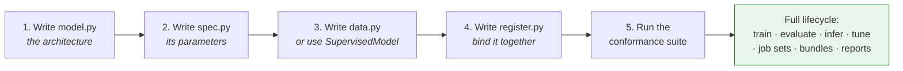

Step 5 is not optional and not a formality. `rade_qnet.testkit.conformance`
checks that the model builds from its spec and signature, that its fitted state
round-trips, that its bundle reloads into an equivalent model, that metrics come
back in original target units, and that scenario-axis transforms saw training
rows only. A documented contract that nothing executes is a contract that gets
violated.

---

## 13. Design decisions and the defects they fix

Much of this architecture is a direct response to specific, diagnosed failures
in the implementation it supersedes (`rade_ml_pt`). Recording them here is what
stops them being reintroduced — and several were silent, which is why they
survived.

| # | Defect | Consequence | Architectural fix |
| --- | --- | --- | --- |
| 1 | Data config `to_dict`/`from_dict` dropped inherited fields | Saved config was lossy; `seq_length=5` reloaded as `1` | Pydantic specs with exact round-trip, verified by test |
| 2 | Data config could not be constructed with defaults | `Config()` raised | Specs validate standalone; no required field hidden in a default factory |
| 3 | One `shuffle` flag drove both the scenario split and batch order | Random, leaky splits; with `seq_length>1`, windows straddled splits | `SplitSpec` and `LoaderSpec` are separate objects |
| 4 | Collation compared every static tensor for every sample | Pure overhead on every batch of every epoch | Static inputs live in `TensorBatchData.static`, uploaded once |
| 5 | Registry index read-modify-write | Lost entries under a process pool | Single-writer catalog, append-oriented |
| 6 | Distributed wrapper applied before lazy parameters materialised | Empty parameter groups or a crash in the distributed library | `materialise` is a pipeline stage, ordered before `prepare_hardware` |
| 7 | Tune passed unknown fields to a frozen training config | `TypeError` (latent — masked by a model override) | Typed trial-override merge with validation |
| 8 | Global deterministic algorithms forced inside a swallowed `try`/`except` | Unpredictable performance; failures invisible | `determinism: off \| warn \| strict`, explicit and per-run |
| 9 | Basis selection fitted on the full scaled history | Selection leakage from validation and test | `basis.fit_on: train \| all`, defaulting to `train` |
| 10 | Registry pickled whole modules, loaded with `weights_only=False` | Refactor-fragile; executes arbitrary code on load | Engines write weights in their own non-pickle format -- a Torch `state_dict` read with `weights_only=True`, XGBoost's raw booster -- under a hashed manifest. scikit-learn's `joblib` is the stated exception (§9) |
| 11 | Config loader `setattr`s every key it is handed onto the target object | Any misspelled setting is silently ignored. Found via `use_baseline_norm` in the config against `use_baseline_weight_norm` on the layer — a feature that had never once been switched on | Specs are Pydantic models that reject unknown fields, so the same typo is a startup error naming the field |
| 12 | Components register as an import side effect, with nothing recording which import | Under a process pool the worker resolves a name only if the *entry point* happened to import the model, because spawn re-imports `__main__`. The same job set works from one script and fails with "no model named ..." from another | `RegistryEntry.defining_module` records the module; `JobPayload.registration_modules` carries it; the worker replays the imports. Resolved in the parent, so an unknown name fails where the error can list the alternatives |
| 13 | Thread budget set only by environment variable, before a worker imports its libraries | Works for a worker (fresh interpreter), silently does nothing for the launching process (already imported). The number of threads fixes the order of a reduction, so the same job scored differently sequentially than pooled — seventh significant figure, reproducible | `HardwareSpec.threads_per_worker` is applied in-process by `apply_thread_budget`, so the budget travels in the specification and holds wherever the job lands |

Defect 11 was found during Phase 3 rather than during the Phase 0 audit, which
is itself the argument for the parity gate: a silent setting is invisible to
every test that does not already know it exists. Detail in
[`phases/PHASE_3_HYBRID_GNN_RNN.md` §8.2](phases/PHASE_3_HYBRID_GNN_RNN.md#82-defect-11-found-during-the-port).

### Refactor parity

The flagship is not rewritten on trust. A golden fixture is captured from the
current implementation *before* any new code is written, and the refactor must
reproduce it at five levels:

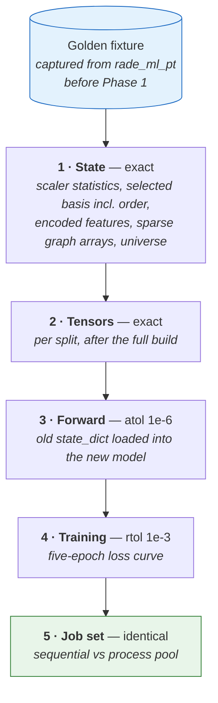

Tolerances widen down the list for a reason. Levels 1 and 2 are deterministic
array computations and must match exactly; anything else is a bug, not noise.
Level 3 allows accumulated floating-point reassociation. Level 4 allows
kernel-level non-determinism across a short training run. Level 5 is back to
exact, because placement must not change results.

Where a defect in the table above changes behaviour, parity is asserted against
the *old* behaviour via a compatibility flag — `basis.fit_on: all` reproduces
defect 9 — and the flag is then flipped to the correct default in a separate,
visible, reviewable change. Fixing bugs and proving a refactor are two
different tasks, and doing them in one commit means neither is verified.

Full detail: [`phases/PHASE_0_BASELINE.md`](phases/PHASE_0_BASELINE.md).

---

## 14. Glossary

| Term | Meaning |
| --- | --- |
| **Spec** | A declarative, validated, hashable description of intent. Holds no state. |
| **Contract** | A typed payload passed between pipeline stages. |
| **Capability** | A narrow protocol a model may optionally implement to unlock behaviour. |
| **Engine** | The adapter for one training library. The only code that imports it. |
| **Learner** | An update rule — what one optimisation step means. |
| **`PolicyLearner`** | The interactive learner protocol: `act` on an observation, `update` from a transition. |
| **Paradigm** | What a training step consumes: inputs and a target (supervised), transitions (reinforcement). A paradigm is a `task` value, a model base and a pipeline. |
| **Control learner** | `random`: acts, never updates. The baseline an algorithm must beat, and the proof the interactive path works. |
| **Loop driver** | `fit_epochs` or `fit_steps` — when to step, validate, checkpoint, stop. |
| **`BatchSource`** | The single protocol every training loop consumes. |
| **`DataBundle`** | Splits, fitted state, input signature and lineage, from a data module. |
| **`FittedState`** | Everything fitted at training time and needed again at inference. |
| **`InputSignature`** | Declared shapes and dtypes of static inputs, dynamic inputs and target. |
| **Static input** | An input constant across every batch (a graph, entity features). |
| **Scenario axis** | The time axis. Fitting here may observe training rows only. |
| **Entity axis** | The instrument axis. Fitting here may observe the full universe. |
| **Bundle** | The self-describing, versioned on-disk artifact of a completed run. |
| **Lineage** | Source fingerprint, split indices, spec hash and code version. |
| **Job** | One independent training run within a job set. |
| **Job set** | A list of jobs for the same model, each with optional overrides. |
| **Executor** | Runs a list of callables. Cannot be observed by a pipeline. |
| **Report** | A declarative, never-load-bearing writer of run artifacts. |
| **Visual** | A pure function returning a figure. Writes nothing. |
| **Conformance** | The executable check that a model satisfies the framework's contracts. |
| **`Predictor` / `Agent`** | Held serving handles: a loaded supervised bundle, or a loaded policy. |
| **⬜ Planned** | Designed and placed, not built. Never an importable module. See §15. |
| **Parity** | The executable check that a refactored model reproduces a golden fixture. |

---

## 15. Roadmap: what is planned, and what it needs

Each item below is a placeholder in the only form this framework allows: a
place in the design, the seam it plugs into, and the condition for calling it
done. None of it exists as code. The rule behind that is the one stated in
§6 for `DifferentiableEnvironment` and paid for in §12 with `act_greedily`: an
importable class with nothing behind it satisfies every `isinstance` check
and every import while delivering nothing, which is worse than an honest
absence. When an item is built, its entry here is deleted and the sections
above stop marking it.

### Paradigms: what is covered, and what is not

Supervised, unsupervised and reinforcement learning are *paradigms* -- they
differ in what one training step consumes. Q-learning and deep Q-learning are
not paradigms; they are *learners* within reinforcement learning, and need no
structural change at all.

| Asked for | Status | What it takes |
| --- | --- | --- |
| Supervised learning | ✅ Built | -- |
| Self-supervised learning | ✅ Covered | No new paradigm: supervised learning whose `data.py` manufactures its own target, such as the next value of a series |
| Semi-supervised learning | ✅ Covered | No new paradigm: supervised learning with a loss that tolerates masked targets, a tier 3 `CustomStep` |
| Reinforcement learning, online | ✅ Scaffold | Pipeline, policy bundles, serving and the control learner run; no algorithm yet |
| Q-learning / DQN | ⬜ Planned | One learner, `@learner("dqn")`. The name is already reserved in `RlTrainingSpec` |
| PPO, SAC | ⬜ Planned | One learner each, names reserved |
| Offline reinforcement learning | ⬜ Planned, next | A new task, source and pipeline -- below |
| Pathwise (differentiable) control | ⬜ Planned | A learner plus the `DifferentiableEnvironment` protocol (§6) |
| Unsupervised learning | ⬜ Planned | A new paradigm -- below |

### Offline reinforcement learning — next

The case that matters most for a bank: learn a policy from logged decisions,
because letting an agent explore in a live market is not an option.

- **Spec.** ⬜ `OfflineRunSpec`, `task: offline`. Names the behaviour policy
  that produced the log, and an effective-sample-size threshold.
- **Source.** ⬜ `OfflineSource` in `sources/batching/`, serving transitions
  `(observation, action, reward, next_observation, done)` from Parquet or CSV
  through the existing `sources/dataset/tables.py` readers, so a transition
  file gets the same fingerprinting and caching as a supervised table.
- **Pipeline.** ⬜ `orchestration/pipelines/offline.py`, a sibling of
  `reinforce.py`, with no `build_environment` or `collect` stage.
- **Evaluation.** Off-policy estimates are only as good as the overlap between
  the behaviour policy and the learned one. The pipeline records the behaviour
  policy and **refuses to report a score** when the effective sample size
  falls below the threshold, rather than reporting a number nobody should act
  on. The same refusal rule as `Agent.act` (§12).
- **Done when.** A DQN trained offline on a logged file is persisted, served
  through `api.agent`, and its evaluation refuses on a deliberately drifted
  log.

### DQN — first algorithm

- ⬜ `engines/torch/learners/dqn.py`, registered as `dqn`, implementing
  `PolicyLearner` and the static `act_greedily` that `Agent.act` looks for.
- ⬜ `ReplaySource`, for the online form: a bounded buffer filled by rollouts
  and sampled uniformly.
- **Done when.** It beats `random` on a reference environment by a margin
  fixed in advance, and a served DQN policy returns the same action for the
  same observation every time.

### The rest of Phase 7

- ⬜ `ppo` and `sac` learners.
- ⬜ `pathwise` learner, `DifferentiableEnvironment`, `SimulationSource` and
  `engines.torch.risk` (the risk measures it back-propagates through).
- ⬜ `analysis.metrics.episode` and `analysis.visuals.episodes`: returns,
  episode lengths and action distributions, pure like every other metric.
- ⬜ A hedging model. Planned in [Phase 7](phases/PHASE_7_REINFORCEMENT_LEARNING.md)
  as `domains.hedging`; since §3 removed the `domains` layer, it lands as an
  ordinary package, `models/hedger/`, with its environment in its own
  `environment.py`.

### Unsupervised learning

The one genuinely missing paradigm: no target at all, so neither learner
protocol fits, and "inference" means *transform* -- assign a cluster, project
onto factors, score an anomaly -- rather than predict.

| Seam | Addition |
| --- | --- |
| Spec | ⬜ `UnsupervisedRunSpec`, `task: unsupervised` |
| Authoring | ⬜ A `TransformerDefinition` base beside `PredictorDefinition` and `PolicyDefinition` |
| Contract | `InputSignature` with no target, which needs an unsupervised branch in its validator |
| Pipeline | ⬜ `orchestration/pipelines/fit_transform.py` |
| Metrics | ⬜ Measures needing no ground truth: silhouette, reconstruction error, explained variance, stability across seeds |
| Models | ⬜ e.g. `models/pca_factors/`, `models/regime_clusters/` |

**Done when** a PCA factor model trains, persists, reloads and transforms new
data through `api`, and `test_model_layout.py` accepts its file set as a third
paradigm.

### Engines

- ⬜ **JAX**, later: `engines/jax/`, a `JaxTrainingSpec` in the `TrainingSpec`
  union, and the shared engine conformance suite. Worth it for pathwise
  control and for sensitivities computed by differentiating through a pricer.
- **TensorFlow: not planned.** What it would add over Torch -- mainly a
  serving and TPU path -- is now available from Torch through ONNX export,
  and a second deep-learning engine doubles the conformance surface for no new
  capability. Revisit only if a consumer can accept nothing but a TensorFlow
  artefact.

### Infrastructure

- ⬜ `cluster` executor (§8.2).
- ⬜ Command line over `rade_qnet.api` (§12).
- ⬜ `CAPABILITIES.md`, a generated table of which paradigm, engine and
  learner combinations exist, with `test_paradigm_seams.py` failing whenever
  that table and the registry disagree -- so this roadmap cannot claim
  something is built when it is not, or the reverse.

---

## Where to go next

- [`GUIDE.md`](GUIDE.md) — **how to use the framework**: the contracts you
  must satisfy, worked examples at every level of complexity, the flagship in
  single-member and portfolio mode, and what running this in production
  asks of you. Start there if you want to *build* something; stay here if you
  want to know why it is shaped this way.

| You want to | Read |
| --- | --- |
| Build the framework | [`IMPLEMENTATION.md`](IMPLEMENTATION.md) |
| Know the standard code is held to | [`CODING_STANDARDS.md`](CODING_STANDARDS.md) |
| Understand one phase in depth | [`phases/`](phases/) |
| Know what belongs in a package | That package's `__init__.py` charter |
````

---

## 2. `tranql/models/rade/rade_qnet/rade_qnet/docs/CODING_STANDARDS.md`

16492 bytes · SHA-256 `36ccc834b3a6e610`

````markdown
# rade_qnet — Coding Standards

The standard every contribution to `rade_qnet` is held to. It is referenced by
every phase's definition of done in [`IMPLEMENTATION.md`](IMPLEMENTATION.md).

Three things make this document worth reading rather than skimming:

- Most of it is **machine-checked**. Where a rule can be enforced by Ruff it
  is, so review time goes on design rather than on formatting.
- Every rule states **why**. A rule whose reason you disagree with is worth
  challenging; a rule you follow without knowing why gets applied wrongly.
- The section on [comments](#3-comments) **departs from a literal reading of
  the brief**, and explains the reasoning. Please read it and push back if you
  disagree.

---

## Contents

1. [Tooling](#1-tooling)
2. [Docstrings](#2-docstrings)
3. [Comments](#3-comments)
4. [Typing](#4-typing)
5. [Naming](#5-naming)
6. [Errors](#6-errors)
7. [Purity and side effects](#7-purity-and-side-effects)
8. [Imports](#8-imports)
9. [Tests](#9-tests)
10. [Review checklist](#10-review-checklist)

---

## 1. Tooling

```bash
# Lint — must report zero findings.
.venv/bin/python -m ruff check tranql/models/rade/rade_qnet/rade_qnet tranql/models/rade/rade_qnet/tests

# Format — must report zero files needing change.
.venv/bin/python -m ruff format --check tranql/models/rade/rade_qnet/rade_qnet tranql/models/rade/rade_qnet/tests

# Test — must pass.
.venv/bin/python -m pytest tranql/models/rade/rade_qnet/tests -q
```

Configuration lives in [`../ruff.toml`](../ruff.toml), with the test tree's
[`tranql/models/rade/rade_qnet/tests/ruff.toml`](../../tests/ruff.toml) extending it so
both trees are held to one standard stated in one place.

Two deliberate choices about that configuration:

**It is scoped to `rade_qnet`.** Ruff resolves configuration by walking up from
each linted file, so a config inside the package applies to the package and
nothing else. The repository's older packages predate this standard and would
bury a clean run in pre-existing findings, which would make the signal
worthless on day one.

**Rules are selected explicitly, not by exclusion.** The `select` list is long
and enumerated. That means upgrading Ruff cannot silently introduce new
failures, and the list itself documents the standard rather than deferring to a
default that may change under us. `select` covers the flake8 rule families
(`F`, `E`, `W`), import order (`I`), naming (`N`), docstrings (`D`), typing
(`ANN`), likely bugs (`B`), and a dozen more — see the file for the annotated
list.

> **Note.** Ruff is not currently in `requirements.txt`, and neither is
> `pydantic`, though `pydantic` 2.12 is installed in the virtual environment.
> Both need adding; see the open items in [`IMPLEMENTATION.md`](IMPLEMENTATION.md).

---

## 2. Docstrings

NumPy convention, enforced by `D` with `convention = "numpy"`. Chosen to match
the scientific Python stack this framework sits on, so a `rade_qnet` docstring
has the same shape as a NumPy or SciPy one.

**Every module, class, function and method needs one.** No exceptions for
private helpers — a private helper is exactly the thing a reader encounters
with no context.

A docstring states the **contract**: what goes in, what comes out, what can go
wrong, and any invariant a caller must respect. It is written for someone who
will call the function without reading it.

```python
def split_chronologically(
    n_scenarios: int,
    validation_fraction: float,
    test_fraction: float,
    sequence_length: int,
) -> SplitIndices:
    """
    Split a scenario axis into train, validation and test by time order.

    Boundaries are placed so that no sequence window straddles a split: the
    last ``sequence_length - 1`` scenarios before each boundary are dropped.
    Without that gap a window beginning in the training set would extend into
    validation, and the validation score would be partly a memory of training.

    Parameters
    ----------
    n_scenarios
        Length of the scenario axis.
    validation_fraction, test_fraction
        Fractions of the axis assigned to validation and test. Must sum to
        less than one.
    sequence_length
        Window length the model consumes. Pass ``1`` for a non-sequential
        model.

    Returns
    -------
    SplitIndices
        Disjoint index arrays covering the axis apart from the dropped gaps.

    Raises
    ------
    SpecError
        If the fractions are not in ``(0, 1)``, if they sum to one or more, or
        if the requested splits leave no training scenarios.
    """
```

### Package charters

A package's `__init__.py` docstring is its **charter** and carries more weight
than a normal module docstring. It states what belongs in the package, what
does not, which modules it will hold and in which phase, and — for a top-level
package — its dependency rule.

The charter is the first thing a contributor reads, and it is the only thing
that stops a sub-package quietly becoming a dumping ground. Every `__init__.py`
in the tree has one already; keep them current as modules land.

---

## 3. Comments

**This section departs from a literal reading of the original requirement
("plenty of code comments to allow a user to understand what each line is
doing"), and the reason is given below.**

### Why not comment every line

Taken literally, per-line commenting is actively harmful, for three reasons.

*It drifts.* A comment is not executed, so nothing detects when it stops being
true. Per-line comments produce the maximum possible surface area for drift,
and a comment that contradicts its code is worse than no comment — a reader who
trusts it is misled, and a reader who does not has learned to ignore all of
them.

*It buries the signal.* When every line is commented, the comment marking the
genuinely subtle line looks exactly like the comment on `total = a + b`. The
important remark becomes invisible by being surrounded.

*It substitutes for naming.* `x = d * 86400  # convert days to seconds` is a
comment compensating for a bad name. `seconds = days * SECONDS_PER_DAY` needs
no comment and cannot drift. Reaching for a comment is often a signal that the
code should be clearer instead.

### What this framework does instead

The underlying goal — *a reader can follow what is happening and why* — is
taken seriously and met by four mechanisms, applied in this order:

1. **Names that make the line self-explanatory.** The first tool, always.
2. **Docstrings that carry the contract.** Required everywhere, as above.
3. **Comments on intent, constraint and non-obvious mechanics.** Generous
   where they earn their place.
4. **Tests that demonstrate behaviour.** An executable explanation, and the
   only kind that cannot drift.

### When to write a comment

Write one when the code cannot say it itself:

| Write a comment for | Example |
| --- | --- |
| **Why**, when the reason is not local | `# Wrapping before materialise gives DDP an empty parameter group.` |
| **An ordering constraint** | `# Must precede any import of torch; CUDA caches visibility at import.` |
| **A non-obvious invariant** | `# train_indices is sorted; the gap logic below relies on it.` |
| **A deliberate deviation** | `# Fitting on all rows reproduces the legacy path for parity. Not the default.` |
| **A reference** | `# Clipping follows Schulman et al. (2017), eq. 7.` |
| **A rejected alternative** | `# A set would be faster here but the order is part of the saved state.` |

Do not write one to restate the code, to mark a section that should be a
function, to record who changed what (that is `git`), or to leave code
commented out (`ERA` rejects this).

### Density in practice

The commented lines in this framework cluster, as they should, around the parts
that are genuinely hard: the ordering of lazy-parameter materialisation,
split-boundary arithmetic, the device-visibility dance before import, the merge
rules for job overrides. Straightforward construction and delegation code
carries few comments and needs none.

As a calibration: `tranql/models/rade/rade_qnet/tests/test_scaffold.py` is commented at roughly the
intended density. Every constant that encodes a decision explains that
decision; the loops that walk directories do not.

**If you want literal per-line commenting instead, say so and the standard will
be changed — but it should be a deliberate decision, not an accident of
phrasing.**

---

## 4. Typing

Full annotations on every signature, enforced by `ANN`. Return types included,
including `-> None`.

```python
from __future__ import annotations
```

At the top of every module. It makes annotations lazy, which means a forward
reference needs no quotes and a type-only import costs nothing at run time.

**`Protocol` over inheritance for extension points.** A `BatchSource`, an
`Engine`, a `Report` and every capability are protocols. A user's class
satisfies one by having the right methods, with no import of ours and no base
class — which is what lets a model live outside this repository.

**No bare `Any`.** If a type is genuinely open, say so precisely: a `TypeVar`
with a bound, a narrow union, or `object` with a documented narrowing. `Any`
disables checking exactly where a reader most needs help.

**`TYPE_CHECKING` for heavy imports.** A type-only import of `torch` in a
`core` module would violate the layering rule and slow every worker's start-up:

```python
if TYPE_CHECKING:
    from torch import Tensor
```

---

## 5. Naming

Names are the primary documentation mechanism, so they get more attention than
style guides usually give them.

| Rule | Instead of | Write |
| --- | --- | --- |
| No abbreviations a newcomer must decode | `cfg`, `ds`, `idx`, `tgt`, `hist` | `spec`, `source`, `indices`, `target`, `history` |
| Booleans read as assertions | `flag`, `check` | `is_fitted`, `has_static_inputs`, `should_stop` |
| Collections are plural; elements singular | `job` holding many | `jobs`, iterated as `job` |
| Functions are verb phrases | `data_build` | `build_data` |
| Predicates start `is_` / `has_` / `can_` | `valid` | `is_valid` |
| Dimensions named, not numbered | `n`, `m`, `d` | `n_scenarios`, `n_entities`, `n_features` |
| Units in the name when ambiguous | `timeout` | `timeout_seconds` |
| No stuttering | `spec.spec_version` | `spec.version` |

**Domain vocabulary is used consistently and exactly.** `scenario` is a point
on the time axis. `entity` is an instrument. `elementary` and `target` are the
two instrument roles. `job` is one run in a set, never "member", "cluster" or
"model". Where a word has an established meaning on the desk, that meaning
wins; where it does not, pick one and use it everywhere.

**Single-letter names are permitted in exactly one place:** a short
mathematical expression where the symbols match a cited formula, with the
citation in a comment. Not in a loop, not for a DataFrame, not for a path.

---

## 6. Errors

**Never swallow an exception.** `except Exception: pass` is how
`use_deterministic_algorithms(True)` came to be set globally in the previous
implementation without anybody knowing whether it had worked. If a failure is
tolerable, log it at warning with the exception attached and say in the message
what the consequence is.

```python
try:
    tracker.log_metrics(metrics)
except TrackerError:
    # Tracking is optional infrastructure: an unreachable server must not
    # discard a completed training run. The metrics are already in the bundle.
    logger.warning("metric tracking failed; metrics remain in the bundle", exc_info=True)
```

**Raise the framework's own error types,** from `core.lifecycle.errors`. A
`SpecError` is actionable by the user; a `ContractError` is a framework bug.
Collapsing both into `ValueError` loses that distinction at exactly the moment
it matters.

**Fail at the earliest possible point.** A spec is validated before a source is
built; a source is validated before a model is built. The cost of a late
failure is not the exception — it is the four hours of training that preceded
it.

**Error messages state three things:** what was expected, what was received,
and what to do.

```python
raise SpecError(
    f"split fractions must sum to less than 1.0, received "
    f"validation={validation_fraction} + test={test_fraction} "
    f"= {validation_fraction + test_fraction}; reduce one of them"
)
```

---

## 7. Purity and side effects

The layering is enforced by test. These rules are the finer-grained version,
enforced by review.

| Rule | Reason |
| --- | --- |
| `core` imports only stdlib, `pydantic`, `numpy` | A worker that only parses a spec must not import PyTorch. Enforced by test. |
| A spec holds no state, handles or tensors | So it can be hashed, logged and pickled to a worker. |
| A metric is a pure function of arrays | So it is testable against a hand-computed value. |
| A visual returns a figure and writes nothing | So the same function serves a report, a notebook, a dashboard and a test. |
| Only `reports` and `storage` write to a run directory | So "what did this run produce?" has one answer. |
| No module-level mutable state | Two jobs in one process must not interfere. |
| No global library configuration at import | Importing `rade_qnet` must not change NumPy's print options or Matplotlib's backend. |

---

## 8. Imports

**Relative inside the package, absolute outside.**

```python
from ..core.contract import DataBundle    # inside rade_qnet
from ...core.lifecycle.errors import StageError
```

This is what keeps the package **relocatable**: it behaves identically imported
as `tranql.models.rade.rade_qnet.rade_qnet` from this repository or as `rade_qnet` from an installed
distribution. Absolute self-imports would pin it to one of those and break the
other. (`TID252`, which bans parent-relative imports, is therefore switched off
with that reasoning recorded in the config.)

Order is handled by Ruff's `I` rules: future, standard library, third party,
first party, local — each group separated by a blank line.

**No star imports, and no imports for side effects** other than registry
population, which happens in exactly one place per model package and is
commented as such.

---

## 9. Tests

Tests are specifications, and are held to the same standard as the code. The
only rules relaxed in the test tree are argument annotations, literal
comparisons and unused fixtures — see the test `ruff.toml` for the reasoning.
**Docstrings stay mandatory**, because a test name plus its docstring is how a
failure gets diagnosed from a CI log by someone who did not write it.

| Rule | Reason |
| --- | --- |
| Assert against hand-computed values, not a second implementation | Two implementations of a wrong formula agree. |
| One behaviour per test | A test asserting six things reports one failure and hides five. |
| Deterministic: fixed seeds, no clock, no network, no shared directory | A flaky test gets re-run until it passes, then ignored. |
| Test the failure path, not just the happy path | Most of these components exist *because* of a failure mode. |
| Protocol implementations go through one shared contract suite | So "add a new source" stays a safe operation. |
| Mark and skip hardware-dependent tests, never silently omit them | An untested GPU path should be visible, not absent. |
| Name files `test_<package>_<module>.py` | Matches this repository's existing suites. |

Every test package's `__init__.py` lists its planned modules and the phase that
delivers them, so the suite doubles as a build checklist.

---

## 10. Review checklist

Mechanical:

- [ ] `ruff check` reports zero findings.
- [ ] `ruff format --check` reports zero files needing change.
- [ ] `pytest tranql/models/rade/rade_qnet/tests` passes.
- [ ] New packages have a charter; new modules have a docstring.
- [ ] `test_scaffold.py` still passes — layering and mirroring intact.

Judgement:

- [ ] Every public signature is fully annotated, with no bare `Any`.
- [ ] Docstrings state the contract, not the implementation.
- [ ] Comments explain *why*; none restates its line.
- [ ] Names need no decoding; domain vocabulary is used exactly.
- [ ] No exception is swallowed; framework error types are raised.
- [ ] Failures happen as early as they can be detected.
- [ ] Pure things stayed pure; nothing new writes to disk outside `reports`
      and `storage`.
- [ ] Tests assert hand-computed values and cover the failure path.
- [ ] The phase's definition of done is met in full.
````

---

## 3. `tranql/models/rade/rade_qnet/rade_qnet/docs/GUIDE.md`

45270 bytes · SHA-256 `c82a3b4e2f97e0a3`

````markdown
# rade_qnet — The Guide

**How to use the framework, what it will ask of you, and what it gives back.**

This is the companion to [`ARCHITECTURE.md`](ARCHITECTURE.md). That document
answers *why is the framework shaped like this*. This one answers *how do I
use it*, and it is written to be read front to back by somebody who has never
seen the codebase.

Every code block below is real. The examples are taken from working modules
and the outputs are from actual runs, not illustrations.

---

## Contents

1. [The one idea](#1-the-one-idea)
2. [The lifecycle, stage by stage](#2-the-lifecycle-stage-by-stage)
3. [The four tiers of model](#3-the-four-tiers-of-model)
4. [Tier 1 — the smallest complete model](#4-tier-1--the-smallest-complete-model)
5. [Still tier 1 — your own architecture](#5-still-tier-1--your-own-architecture)
6. [Tier 3 — your own data: the flagship, single member](#6-tier-3--your-own-data-the-flagship-single-member)
7. [Tier 4 — your own pipeline stages](#7-tier-4--your-own-pipeline-stages)
8. [Group mode — one model, many slices of data](#8-group-mode--one-model-many-slices-of-data)
9. [The contracts, precisely](#9-the-contracts-precisely)
10. [The registry](#10-the-registry)
11. [The run specification](#11-the-run-specification)
12. [What you get back](#12-what-you-get-back)
13. [Running in production](#13-running-in-production)
14. [Failure modes the framework catches for you](#14-failure-modes-the-framework-catches-for-you)

---

## 1. The one idea

A machine-learning run is the same shape every time. Build the data, declare
the interface, build the model, fit it, score it, save it, report it. What
changes between a ridge regression and a graph-temporal network is *what goes
in each box*, not the boxes.

So the framework owns the boxes and you own the contents.

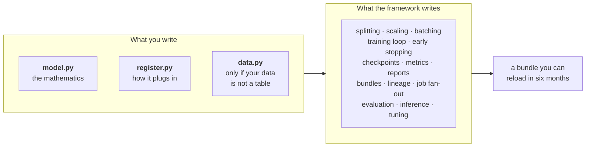

The practical consequence is the thing worth internalising: **you never write
a training loop.** If you find yourself writing one, you are fighting the
framework and something above you is wrong.

### Who owns what

| Concern | Owner | Why it is there and not elsewhere |
| --- | --- | --- |
| What the model computes | You | It is the only part that is actually your problem |
| How raw inputs become arrays | You, if non-tabular | Only you know what a trade file looks like |
| Splitting, scaling, windowing | Framework | Every model needs it and every model gets it wrong the same way |
| The training loop | Framework | Writing it per model is how two models stop being comparable |
| Early stopping, checkpointing | Engine | It is backend-specific and nothing above needs to know |
| Metrics, reports, bundles | Framework | A result that cannot be compared to another result is not a result |
| Running one model many times | Framework | Fan-out is an operational concern, not a modelling one |

---

## 2. The lifecycle, stage by stage

Four pipelines exist: **train**, **evaluate**, **infer**, **tune**. Each is a
named sequence of stages. The stage names are not decorative — they appear in
logs, in error messages, and they are the unit you override.

### The train pipeline

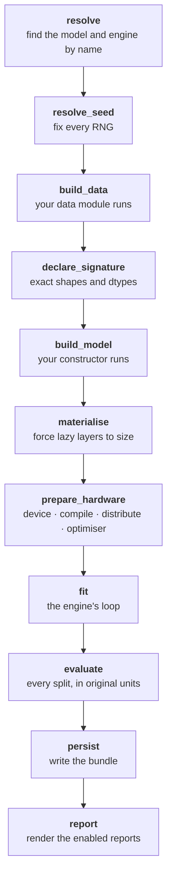

Two of those deserve explanation because they are not obvious.

**`declare_signature`** produces an `InputSignature`: the exact name, shape
and dtype of every input the model will see, plus the target. It exists so
that `build_model` can size every layer *before* a single batch is loaded. A
model with lazily-sized layers has no parameters until its first forward
pass, and an optimiser built over an empty parameter set reports success and
updates nothing — the loss curve looks normal because the layers that *did*
exist still train. The signature is also what makes a saved bundle reloadable
without the original data.

**`materialise`** runs a dummy forward pass built from the signature, to force
any remaining lazy layers to size. It happens *before* `prepare_hardware`,
and the order is a contract: device placement, then compilation, then
distribution, then the optimiser. Each depends on the previous one having
happened.

### The other three

```
evaluate:  load → rebuild_data → restore → score → report
infer:     load → prepare_inputs → restore → predict → invert → attribute
tune:      resolve → propose → build_data → run_trials → select → refit
```

`evaluate` **rebuilds** the data rather than re-deriving it: the split indices
and the fitted scalers come out of the bundle. That is what makes a re-score
of unchanged data reproduce the training metrics *exactly* rather than
approximately.

`infer` has an `invert` stage because predictions come out of the model in
scaled units and nobody wants those. It also has `attribute`, which attaches
the bundle version, the spec digest and the data fingerprints to the numbers,
so a prediction can be reconciled three weeks later.

---

## 3. The four tiers of model

The framework is built so that complexity is **paid for only when used**. The
tiers are not formal categories; they are a description of how much you end
up writing.

| Tier | You add | Files | Example |
| --- | --- | --- | --- |
| 1 | A spec, a constructor and an input contract | the five required | `ridge`, `xgb_tabular`, `lstm_tabular` |
| 2 | …a fitted artefact that must survive to inference | `+ state.py` | — |
| 3 | …your own data build (in the `data.py` you already have) | `+ layers/`, `features/` | `hybrid_gnn_rnn` |
| 4 | …pipeline stage overrides | `+ pipelines/` | `hybrid_gnn_rnn` |

Every model is a package with the **same five files** whatever its tier;
higher tiers *add* files and never rename or move them. The exact rules,
the per-file contracts and the enforcement are in
[`MODEL_IMPLEMENTATION.md`](MODEL_IMPLEMENTATION.md) — this section is the
tour, that document is the procedure.

The important property is that **tier 1 does not know tiers 3 and 4 exist**.
Nothing in `models/ridge/` imports a pipeline, a data module or a state class.

Note what does *not* raise the tier: a custom `nn.Module` is still tier 1.
`lstm_tabular` writes its own network and remains five files, because a
custom architecture lives in `model.py` — which every model has anyway.
Needing your own *data build* is what moves you up, and even that adds no
file: it changes what `data.py` returns.

Most real models end up at tier 3, and that is the expected destination
rather than an advanced case. `TabularDataModule` reads a CSV; anything
behind a store, a warehouse or an internal service needs its own `load()`.
`data.py` exists from tier 1 precisely so that change touches one function.

---

## 4. Tier 1 — the smallest complete model

Here is a complete, registered, production-usable model: three short files
plus a charter, shown minus their docstrings.

```python
# tranql/models/rade/rade_qnet/rade_qnet/models/ridge/spec.py        — what can be configured

class RidgeSpec(Spec):
    alpha: float = Field(default=1.0, gt=0.0)
    fit_intercept: bool = True
```

```python
# tranql/models/rade/rade_qnet/rade_qnet/models/ridge/model.py       — what is computed
# Imports no registry, no run spec, no engine. Callable from a notebook.

def build(settings: RidgeSpec) -> Ridge:
    return Ridge(alpha=settings.alpha, fit_intercept=settings.fit_intercept)
```

```python
# tranql/models/rade/rade_qnet/rade_qnet/models/ridge/data.py        — what data is required, and from where
# REQUIRES is checked against the data build before the model is constructed.
REQUIRES = InputRequirement.unconstrained()   # ridge flattens whatever it is given


def data_module(spec: SupervisedRunSpec) -> TabularDataModule:
    del spec
    return TabularDataModule()
```

```python
# tranql/models/rade/rade_qnet/rade_qnet/models/ridge/register.py    — how it plugs in
from ...engines import sklearn as _engine  # noqa: F401  — registers the engine
from .data import REQUIRES, data_module


@model("ridge", engine="sklearn")
class RidgeModel(SupervisedModel):
    requires = REQUIRES
    spec = RidgeSpec

    def data_module(self, spec: SupervisedRunSpec) -> TabularDataModule:
        return data_module(spec)

    def build_model(
        self, spec: SupervisedRunSpec, signature: InputSignature
    ) -> Ridge:
        del signature
        return build(RidgeSpec.model_validate(dict(spec.model.params)))
```

```python
# tranql/models/rade/rade_qnet/rade_qnet/models/ridge/__init__.py    — the charter
from .register import RidgeModel
from .spec import RidgeSpec
```

That is the whole contract for a simple model: **say what your settings are,
say where your data comes from, and return an unfitted model.**

Why four files rather than one is argued in
[`MODEL_IMPLEMENTATION.md` §2.3](MODEL_IMPLEMENTATION.md); the short version
is that the split is what lets `build` be unit-tested with no framework
present, and what means a model growing a data build *adds* a file instead
of being taken apart.

### What each piece does

`class RidgeSpec(Spec)` — a Pydantic model that validates the `model.params`
block of a run specification. `alpha` is constrained to be positive, so a
specification with `alpha: -1` is rejected when it is parsed rather than
producing an obscure failure inside scikit-learn twenty minutes later.

`@model("ridge", engine="sklearn")` — registers the class under the name
`"ridge"` and declares that it trains on the sklearn engine. This is what
makes `{"model": {"name": "ridge"}}` resolve.

`SupervisedModel` — the base class for any model that learns from inputs
with known targets, whatever shape the data takes (a table, sequences, a
graph). It supplies `build_data`, `signature` and `rebuild_data` for you. You override
only `data_module` and `build_model`.

`del spec` / `del signature` — an explicit statement that the argument is
genuinely unused, rather than silence that could be an oversight.

`from ...engines import sklearn` — importing the engine package is what puts
`"sklearn"` in the engine registry. The decorator *declares* the engine; this
import is what makes the declaration resolvable. Omit it and the model works
whenever something else in the process happened to import the engine, and
fails the first time it runs alone.

### Running it

```python
from rade_qnet.api import train, evaluate, infer
import rade_qnet.models.ridge  # registers it

result = train({
    "task": "supervised",
    "model": {"name": "ridge", "params": {"alpha": 0.1}},
    "source": {"kind": "tabular", "path": "data/book.csv"},
    "training": {"engine": "sklearn"},
}, output_root="artifacts/demo")

print(result.metric("test", "mae"))

bundle = result.bundle_directory
evaluate(bundle)                    # re-scores, identically
infer(bundle)                       # predicts, with provenance attached
```

### What you did not write

Splitting. Scaling. Batching. The fit call. Metric computation. Inverse
transforms so the metrics are in original units. The bundle. The lineage
record. Four reports. Re-scoring from disk. Inference with provenance. All of
it came from declaring two methods.

---

## 5. Still tier 1 — your own architecture

When the network is yours but the data is still a table, you write
`model.py` and change nothing else. **This is still tier 1** — a custom
architecture does not raise the tier, because `model.py` is a file every
model has. What raises it is needing a fitted artefact of your own (tier 2)
or a data build of your own (tier 3).

That is worth stating plainly, because "my model is complicated, so it must
need the complicated machinery" is the most common way people over-build
here. `lstm_tabular` is a recurrent network written from scratch and it is
four files, the same four as `ridge`.

```python
# tranql/models/rade/rade_qnet/rade_qnet/models/lstm_tabular/  (abridged)

class LstmTabular(nn.Module):
    def __init__(self, settings: LstmTabularSpec, *, n_features: int) -> None:
        super().__init__()
        self.rnn = nn.LSTM(
            input_size=n_features,
            hidden_size=settings.units,
            num_layers=settings.layers,
            batch_first=True,
        )
        self.head = nn.Linear(settings.units, 1)

    def forward(self, **inputs: Tensor) -> Tensor:
        sequence = _sequence_of(inputs)
        output, _ = self.rnn(sequence)
        return self.head(output[:, -1, :])


@model("lstm_tabular", engine="torch")
class LstmTabularModel(SupervisedModel):
    spec = LstmTabularSpec

    def data_module(self, spec: SupervisedRunSpec) -> TabularDataModule:
        del spec
        return TabularDataModule()

    def build_model(self, spec, signature) -> LstmTabular:
        settings = LstmTabularSpec.model_validate(dict(spec.model.params))
        return LstmTabular(settings, n_features=_feature_width(signature))
```

Three things to copy from this.

**Inputs arrive as keyword arguments.** The engine calls
`model(**batch)`, by name rather than position, because a model with four
inputs cannot afford positional arguments. The target is *not* among them —
the loader removes it before calling, so there is nothing to filter out.

**Size from the signature, not from a first batch.** `n_features` comes from
`signature`, which is why `build_model` receives it. This is the lazy-layer
trap described in §2 and it is worth taking seriously.

**Changing engine is a one-word change.** `engine="torch"` here versus
`engine="sklearn"` in §4. Nothing else in either file differs structurally,
and no pipeline code knows which is which.

---

## 6. Tier 3 — your own data: the flagship, single member

`hybrid_gnn_rnn` is the model the framework was built to hold. Its data is not
a table: it is a set of trades with attributes, a graph over them, and P&L
time series. So it brings its own data module.

### The package layout

```
models/hybrid_gnn_rnn/
├── model.py          the network's forward pass
├── layers/           the blocks it is made of
│   ├── gnn.py            graph encoder
│   ├── rnn.py            temporal encoder
│   ├── fusion.py         how the two combine
│   └── attention.py      target attention
├── features/         basis selection, attribute encoding, graph building
├── data.py           HybridDataModule: raw files → arrays
├── state.py          HybridState: the fitted transforms
├── spec.py           HybridModelSpec, HybridDataSpec
├── register.py       the framework declaration
└── pipelines/        train.py, eval.py, tune.py  (tier 4, see §7)
```

The separation between `model.py` and `register.py` is deliberate and worth
copying. `model.py` is what a quant reads and argues with. `register.py` is
what a platform engineer maintains. Interleaving them means neither can skim
their own half — and in practice the wiring wins, because a reader looking for
the mathematics finds registration boilerplate first and gives up.

### The registration

```python
# tranql/models/rade/rade_qnet/rade_qnet/models/hybrid_gnn_rnn/register.py  (abridged)

@model("hybrid_gnn_rnn", engine="torch")
class HybridGnnRnnModel(SupervisedModel):
    spec = HybridModelSpec          # validates model.params
    data_spec = HybridDataSpec      # validates source.params
    state_cls = HybridState         # what the data build fits
    pipelines = MappingProxyType({
        "train": HybridTrainPipeline,
        "eval": HybridEvalPipeline,
        "tune": HybridTunePipeline,
    })

    def data_module(self, spec: SupervisedRunSpec) -> HybridDataModule:
        del spec
        return HybridDataModule()

    def build_model(self, spec, signature) -> HybridGnnRnn:
        return HybridGnnRnn(
            HybridModelSpec.model_validate(dict(spec.model.params)), signature
        )
```

Compare this to `ridge.py`. It is *the same four declarations* plus three
optional ones. There is no separate "advanced" API: the complex model uses
more of the same surface, not a different surface.

**`spec` and `data_spec` are separate types on purpose.** The data build and
the network are configured independently. Changing the recurrent width should
not invalidate a cached dataset, and two distinct types is what makes that
structurally true rather than merely intended.

### The data module contract

If your data is not a table, you implement five methods:

| Method | Returns | What it is for |
| --- | --- | --- |
| `load(spec)` | your raw type | Read files. The only method that touches disk |
| `n_scenarios(raw)` | `int` | How many rows exist, so the framework can split them |
| `fit_state(raw, indices, spec)` | a `FittedState` | Fit scalers **on train only** |
| `transform(raw, state, spec)` | arrays | Apply the fitted state |
| `signature(…)` | `InputSignature` | Declare exact shapes and dtypes |

The split between `fit_state` and `transform` is the framework's leakage rule
made structural. `fit_state` receives the *training* indices and nothing else,
so fitting a scaler on the test set is not something you have to remember not
to do — there is no code path that would let you.

### Running it on one cluster

```python
import rade_qnet.models.hybrid_gnn_rnn  # registers it

result = train({
    "task": "supervised",
    "name": "eurusd-member",
    "seed": 0,
    "model": {"name": "hybrid_gnn_rnn", "params": {"units": 16}},
    "source": {
        "kind": "model",                       # use the model's data module
        "transforms": {"sequence": {"length": 4}},
        "split": {
            "kind": "chronological",
            "validation_fraction": 0.15,
            "test_fraction": 0.15,
        },
        "loader": {"batch_size": 16, "shuffle": True},
        "params": {                            # validated by HybridDataSpec
            "directory": "data/clusters/EURUSD",
            "variance_threshold": 0.99,
            "encoder": {},
            "graph": {"n_neighbours": 5},
        },
    },
    "training": {"engine": "torch", "epochs": 30, "loss": "mse"},
    "hardware": {"device": "cpu"},
}, output_root="artifacts/member")
```

`"kind": "model"` is the switch. It means *do not look for a CSV; call the
model's own data module and hand it `source.params`*. That block is validated
by `HybridDataSpec`, so `n_neighbours: 0` is rejected at parse time.

The split is **chronological**, which matters for a time series: a random
split lets the model see the future. The framework also inserts a boundary gap
so a four-step window cannot straddle two splits — and it refuses the
combination it cannot make safe:

> sequence length 4 with an explicit split: the framework cannot insert a
> boundary gap into caller-supplied indices, so a window could straddle two
> splits.

---

## 7. Tier 4 — your own pipeline stages

Sometimes the standard lifecycle is right in shape but incomplete in content.
The flagship overrides three of the four, and each override is worth
understanding because they are three different *kinds* of override.

### Additive: `train`

`HybridTrainPipeline` runs the framework's train pipeline unchanged and adds
model-specific reports at the end. It changes no numbers.

### Corrective: `eval`

`HybridEvalPipeline` adds a per-target error breakdown. The pooled error of a
model predicting three targets hides the case where it replicates two well and
one badly — which is the case a desk needs to know about.

This override is also where a real bug was caught. The first version compared
a scaled forward pass against inverted targets and reported errors ten times
too large. The fix, and the test that now pins it:

```python
predictions = data.state.inverse_transform_targets(
    np.asarray(self._engine(loaded).predict(handle, source), dtype=np.float64)
)
targets = collect_targets(data, source, split="test")
```

> `test_the_mean_of_the_per_target_errors_is_the_pooled_error`

### Restrictive: `tune`

`HybridTunePipeline` overrides `propose` to discard infeasible trials before
they are spent. A fusion width of 24 cannot be split into 4 equal heads, and a
naive grid discovers that one wasted trial at a time. The framework cannot
know this constraint; the model can.

### How an override is wired

```python
pipelines = MappingProxyType({"train": ..., "eval": ..., "tune": ...})
```

Four keys are legal: `train`, `eval`, `infer`, `tune`. An override must be a
subclass of the pipeline it replaces. All three conditions are enforced:

```python
# orchestration/stages/resolve.py
LIFECYCLES = frozenset({"train", "eval", "infer", "tune"})

def pipeline_for(definition, lifecycle, default): ...
```

A typo like `"evaluate"` raises `ComponentError` naming the valid keys rather
than silently never being read. Note the flagship deliberately has **no**
`infer` override — inheriting the framework's is the right answer and the
absence is documented so a reader does not assume it was forgotten.

---

## 8. Group mode — one model, many slices of data

Group mode is not a different model or a different code path. It is the same
model run once per data group, with per-group configuration. A group is
whatever slice your problem has -- a region, a desk, a product line, one
cluster of a P&L book. The framework does not care what a group means; it
only needs a manifest naming the groups and a directory per group.

### The layout

```
data/
├── groups.json            the manifest
├── FX__G10/               one directory per group
├── FX__EM/
└── RATES__USD/
```

```json
{
  "groups": [
    {"name": "FX__G10", "input_ids": ["..."], "target_ids": ["..."],
     "asset_class": "FX"},
    {"name": "FX__EM",  "input_ids": ["..."], "target_ids": ["..."],
     "asset_class": "FX"}
  ]
}
```

`name` is required and becomes the job id. `input_ids` and `target_ids` are
optional and used only for provenance and log lines -- the model reads its
own columns through its own `data.py`. Any other key (`asset_class` above) is
kept as a free-form attribute your override hook can read.

### Running it

```python
from rade_qnet import api

manifest = api.train_groups(
    "data",
    defaults={
        "model": {"name": "hybrid_gnn_rnn"},
        "source": {"kind": "model", "transforms": {"sequence": {"length": 4}}},
        "training": {"engine": "torch", "epochs": 30},
        "hardware": {"device": "cpu", "determinism": "strict",
                     "threads_per_worker": 1},
    },
    output_root="artifacts/groups",
    name="nightly",
    overrides_for=complexity_for,
)

print(manifest.summary())
print(manifest.metric_by_job("test", "mae"))
```

### The hook that makes it worth having

```python
def complexity_for(group) -> dict:
    units = max(8, min(32, len(group.input_ids)))
    return {"model": {"params": {"units": units}}}
```

This is why a group set is a job set rather than a `for` loop. Forcing one
configuration on every group means underfitting the data-rich ones or
overfitting the thin ones. The rule is written against the group -- its
column counts and its attributes -- so it does not go stale the first time
the data changes.

### Three properties that matter operationally

**Partial failure is a result, not a crash.** One broken group does not take
down the run. The manifest records which jobs succeeded and which did not, and
the successful bundles are on disk.

**Placement cannot change the numbers.** Running across processes or
sequentially produces bit-identical metrics, provided the thread budget is
pinned in the specification. This is a tested gate, not an aspiration:

> `tranql/models/rade/rade_qnet/tests/orchestration/jobs/test_jobs_parity.py`

The reason `threads_per_worker: 1` appears in the defaults above is exactly
this: the thread count fixes the order a floating-point reduction accumulates
in, and therefore the last few significant figures.

**Every job is an ordinary run.** Each group produces a normal bundle, tagged
with the snapshot fingerprint of the data it was trained on. You evaluate,
infer from and compare them with the same functions you use for a single
model. There is no group-specific artefact format to learn.

---

## 9. The contracts, precisely

This is the reference section. Everything above is an application of it.

### `ModelDefinition` → `PredictorDefinition` → `SupervisedModel`

What you must implement, by base class:

| Base | Abstract methods | Use when |
| --- | --- | --- |
| `PredictorDefinition` | `build_data`, `signature`, `build_model` | Your data module cannot return the standard prepared dataset and you want full control |
| `SupervisedModel` | `data_module`, `build_model` | Almost always, for learning from inputs with known targets |
| `PolicyDefinition` | `build_environment`, `signature`, `build_policy` | Your policy's spaces cannot be read off its environment — a multi-agent setup, say |
| `PolicyModel` | `build_environment`, `build_policy` | Learning by acting in an environment |

One base per *learning paradigm*, not per data shape. `SupervisedModel` serves
a table, a sequence and a graph alike; what distinguishes `PolicyModel` is that
there are no targets at all, only a reward for what the policy did.

#### Writing an agent

```python
@model("my_hedger", engine="torch")
class MyHedger(PolicyModel):
    def build_environment(self, spec):
        return MyMarket(**spec.environment.params)

    def build_policy(self, spec, signature):
        return MyNetwork(signature)
```

Two methods, because `PolicyModel` supplies the third: it reads the two spaces
off the environment. It *reads* them rather than measuring them by resetting —
which matters six months later, when the bundle has a `PolicySignature` and no
environment, and the policy has to be rebuilt from the spec and that signature
alone.

Run it the same way as anything else. `api.train` reads the task and routes:

```yaml
task: reinforcement
model: my_hedger
environment:
  name: my_market
  params: {horizon: 30}
training:
  learner: random      # the no-update control; algorithms arrive with the rest of Phase 7
  total_steps: 100_000
  steps_per_update: 2048
  evaluate_every_steps: 10_000
```

The environment belongs to your model package, not to the framework. Its
reward *is* the problem being solved, and a shared layer of reward functions is
the last thing that should be shared by accident. A hedging environment used
by three models is a module inside whichever package owns it, imported by the
other two.

What you get is what a supervised run gets: a validated spec, a seeded and
reproducible run, a versioned bundle, a catalog entry, tags, and fan-out across
a job set. What you do not get yet is an algorithm — `random` samples from the
untrained policy and updates nothing. It is the control a real algorithm is
measured against.

Optional class attributes on any of them:

| Attribute | Type | Default |
| --- | --- | --- |
| `spec` | `type[Spec]` | validates `model.params` |
| `data_spec` | `type[Spec]` | validates `source.params` |
| `state_cls` | `type[FittedState]` | what the data build fits |
| `pipelines` | `Mapping[str, type]` | lifecycle overrides |

### `BatchSource` — the protocol everything iterates

```python
class BatchSource(Protocol):
    @property
    def signature(self) -> InputSignature: ...
    @property
    def static(self) -> Mapping[str, TensorLike]: ...
    @property
    def steps_per_epoch(self) -> int | None: ...
    @property
    def n_samples(self) -> int | None: ...
    def batches(self) -> Iterator[Batch]: ...
```

Note which are **properties** and which are **methods** — `signature` and
`steps_per_epoch` are properties, `batches()` is a method.

Two things make this protocol carry more weight than it looks:

- `steps_per_epoch` returning `None` means *unbounded*. That is how an
  interactive, reinforcement-learning source behaves, and it is the only
  field that distinguishes the two cases to a training loop. One protocol
  therefore covers both supervised and RL.
- A source must be **re-iterable**. A source backed by a bare generator
  yields nothing from the second epoch onwards, and the symptom is a training
  curve that flatlines for no visible reason.

### `DataBundle` — what the data build produces

```python
@dataclass
class DataBundle[PayloadT]:
    splits: Mapping[str, PayloadT]   # must contain "train"
    signature: InputSignature
    state: FittedState
    lineage: DataLineage
    entity_ids: tuple[str, ...] | None = None
```

### `FittedState` — what must survive to inference

```python
class FittedState(ABC):
    @abstractmethod
    def save(self, directory: Path) -> None: ...
    @classmethod
    @abstractmethod
    def load(cls, directory: Path) -> Self: ...
    @abstractmethod
    def inverse_transform_targets(self, predictions): ...
```

`inverse_transform_targets` is the method that keeps every metric in the units
the desk thinks in. A pipeline that forgets to call it reports an error about
*σ* times too small, which looks like a very good model.

### `Engine` — the backend contract

```python
class Engine(Protocol):
    def capabilities(self) -> EngineCapabilities: ...
    def materialise(self, model, signature): ...
    def prepare(self, model, *, hardware, training, static=None) -> ModelHandle: ...
    def fit(self, handle, sources, training, *, on_epoch_end=None) -> FitOutcome: ...
    def predict(self, handle, source) -> NDArray[np.floating]: ...
    def save_weights(self, handle, path) -> None: ...
    def load_weights(self, model, path) -> object: ...
```

Three engines ship: `torch`, `sklearn`, `xgboost`. If you write a fourth, run
the conformance suite against it:

```python
from rade_qnet.testkit.conformance import check_engine

report = check_engine(
    MyEngine(),
    model_factory=lambda: MyModel(),
    source_factory=make_source,
    signature=signature,
    directory=tmp_path,
    training=MyTrainingSpec(),
    hardware=HardwareSpec(device="cpu"),
)
assert report.passed, report.describe()
```

Seven clauses, each corresponding to a failure that otherwise produces a run
which completes and reports plausible numbers. The most valuable is
`engine.fit_is_an_improvement`, which catches an engine that trains a *copy*
and leaves the caller's model untouched — easy to do when a wrapper is
involved and invisible in a `FitOutcome`.

---

## 10. The registry

Four registries, one decorator each:

```python
from rade_qnet.core.lifecycle.components import model, engine, learner, report

@model("my_model", engine="torch")   # MODELS
@engine("my_engine")                 # ENGINES
@learner("my_learner", engine="torch")  # LEARNERS  (RL)
@report("my_report")                 # REPORTS
```

### Importing is registration

There is no plugin scan and no entry-point discovery. **A component is
registered when its module is imported, and not before.** The framework
deliberately does not import every model on its own behalf: a host that only
wants a ridge regression should not pay for Torch to load.

The consequence to internalise: if you see

> `ComponentError: no model named 'hybrid_gnn_rnn'; available: <none registered>`

…from a correct specification, you have not imported the model package.

```python
import rade_qnet.models.hybrid_gnn_rnn  # this line is the fix
```

A model package should import the engine it declares, for the same reason —
`register.py` above does `from ...engines import torch as _torch_engine`, so
that declaring `engine="torch"` cannot resolve to an empty registry.

### Your model does not have to live in this repository

This is the question that matters most for production use, so it gets a
direct answer: **a model in your own package, importing `rade_qnet` as a
third-party dependency, works identically to one that ships here.** There is
no plugin interface to implement and no manifest to write, because
registration is just an import.

```python
# acme_alpha/model.py  —  a different distribution entirely

from pydantic import Field
from sklearn.ensemble import RandomForestRegressor

from rade_qnet.core.authoring.supervised import SupervisedModel
from rade_qnet.core.lifecycle.components import model
from rade_qnet.core.spec.base import Spec
from rade_qnet.engines import sklearn as _engine     # registers the engine
from rade_qnet.sources.dataset.tabular import TabularDataModule


class AcmeMomentumSpec(Spec):
    n_estimators: int = Field(default=50, ge=1)
    max_depth: int = Field(default=4, ge=1)


@model("acme_momentum", engine="sklearn")
class AcmeMomentum(SupervisedModel):
    spec = AcmeMomentumSpec

    def data_module(self, spec) -> TabularDataModule:
        del spec
        return TabularDataModule()

    def build_model(self, spec, signature) -> RandomForestRegressor:
        del signature
        settings = AcmeMomentumSpec.model_validate(dict(spec.model.params))
        return RandomForestRegressor(
            n_estimators=settings.n_estimators,
            max_depth=settings.max_depth,
            random_state=0,
        )
```

```python
from rade_qnet.api import train, evaluate, infer
import acme_alpha          # the import is the registration

result = train({
    "task": "supervised",
    "model": {"name": "acme_momentum", "params": {"n_estimators": 30}},
    "source": {"kind": "tabular", "path": "book.csv"},
    "training": {"engine": "sklearn"},
    "reports": {"enabled": ["summary", "baselines"]},
}, output_root="runs")

evaluate(result.bundle_directory)   # re-scores identically
infer(result.bundle_directory)      # predicts, with provenance
```

Six public names is the entire surface: `SupervisedModel`, `model`, `Spec`, a
data module, the engine package, and `api`. Everything in §12 — the bundle,
the lineage, the reports, exact re-scoring — comes with it.

This is pinned by `tranql/models/rade/rade_qnet/tests/test_extensibility.py`, which deliberately
uses only those public names. If any of them moves, that test fails, which is
the point: it is a test of whether the public surface is *sufficient*, not of
whether the internals exist.

### Duplicate names are refused

Registering two things under one name raises. It would otherwise be a
last-import-wins race: which model a name refers to would depend on import
order, and a specification would silently train a different model than it
named.

### Isolating registries in tests

```python
from rade_qnet.testkit.fixtures import isolated_registries

with isolated_registries(empty=True):
    ...
```

Pass `empty=True` when your test *claims* a name a shipped component also
uses. Without it, whether the test passes depends on what an earlier test
imported — which is a real failure this framework has already had once.

---

## 11. The run specification

A specification is a dict, a YAML file, or a validated `RunSpec`. All three
reach the same object.

```yaml
task: supervised           # or: reinforcement
name: eurusd-nightly       # label; appears in the run id
seed: 0
output_root: artifacts/rade_qnet
tags: [nightly, fx]

model:
  name: hybrid_gnn_rnn     # registry key
  params: {units: 16}      # validated by the model's `spec`

source:
  kind: model              # "model" (its own data module) or "tabular" (a CSV)
  params: {...}            # validated by the model's `data_spec`
  transforms:
    sequence: {length: 4}
    scaling: {...}
    reduction: {...}
  split:
    kind: chronological    # chronological | purged_kfold | grouped | explicit
    validation_fraction: 0.15
    test_fraction: 0.15
  loader: {batch_size: 16, shuffle: true}
  cache: {...}

training:                  # discriminated on `engine`
  engine: torch            # torch | sklearn | xgboost
  epochs: 30
  loss: mse

hardware:
  device: cpu              # cpu | cuda | mps
  determinism: strict
  threads_per_worker: 1

reports:
  enabled: [summary, curves, quality, baselines]
```

`model.params` and `source.params` are the only deliberately open-ended
blocks, and both are narrow and named. Everything else is strictly validated,
so a typo is a parse error rather than a silently ignored key.

The `training` block is a **discriminated union** on `engine`. Handing a Torch
spec to the XGBoost engine does not quietly run with partially-matching
settings; it raises, because an epoch budget silently read as a round budget
is the kind of bug that is never found.

---

## 12. What you get back

### The bundle

```
artifacts/demo/ridge-8ec065234d59/
├── bundles/ridge/v1/
│   ├── manifest.json          what this is, and its digests
│   ├── spec.json              the exact specification that produced it
│   ├── signature.json         input shapes and dtypes
│   ├── lineage.json           data fingerprints
│   ├── result.json            every metric, every epoch
│   ├── weights.bin            the model
│   └── fitted_state/          the scalers, saved
└── reports/
    ├── summary.md
    ├── baselines.md
    ├── data_quality.md
    └── *.png
```

The bundle is **self-describing**. `signature.json` plus `weights.bin` is
sufficient to rebuild the identical object with no access to the original
data, which is what makes a six-month-old model reloadable at all.

### The results

```python
result.metric("test", "mae")       # one number
result.evaluations                 # EvalResult per split
result.fit.history                 # EpochRecord per epoch
result.fit.best_epoch              # and whether it was restored
result.bundle_directory            # where it went
result.notes                       # model-specific extras
```

Every `EvalResult` carries `in_original_units`, which is checked rather than
assumed, and `baseline_metrics` — the score of a predictor with no
information. A mean absolute error of 0.03 is either excellent or embarrassing
and only the baseline says which.

### Choosing among runs: tags, best, aliases

Every run under one `output_root` is recorded in one catalog, whether it came
from `api.train`, `api.train_jobs` or `api.train_groups`. `api.registry`
reads that catalog. It answers the questions that follow a batch of training,
and records the answer to the last one:

```python
from rade_qnet import api

# Train with tags: they are written into each bundle's manifest.
for lr in (1e-2, 1e-3, 1e-4):
    api.train({**config, "tags": ["lr-sweep"],
               "training": {**config["training"], "learning_rate": lr}})

runs = api.registry("artifacts/eod")

runs.runs(tags=["lr-sweep"])                               # which runs are the sweep?
best = runs.best("mae", direction="minimise", tags=["lr-sweep"])   # which was best?
runs.promote(best, "production")                           # this one is in production
runs.tag(best, "reviewed")                                 # recorded after the fact

live = runs.get("ridge", alias="production")               # later, from anywhere
api.infer(live.directory, source=new_data)
for event in runs.history(model="ridge"):                  # who promoted what, and when
    print(event.describe())
```

There are two kinds of label:

| | Tag | Alias |
| --- | --- | --- |
| Says what a run… | *was* — `lr-sweep`, `baseline`, `reviewed` | *is for* — `production`, `champion` |
| Points at | any number of runs | exactly one version per model and job |
| Set | at training time (`tags:` in the spec), or later with `tag()` | with `promote()`, moved by promoting another run |

Aliases are scoped per job, so in a group set each group has its own
`production` model. `latest` always means the highest version.

**Bundles are never rewritten.** A tag added later and every promotion are
appended to `registry.jsonl` beside the catalog, under the same
cross-process lock. Two people promoting at once both get recorded, and the
log doubles as the audit trail. A tag set at training time is part of the
bundle's record and cannot be removed.

**`best` needs a direction.** `r2` is maximised and `mae` minimised. A
guess based on the metric's name would eventually guess wrong on a custom
metric and quietly select the worst run.

**There is no `delete`.** Removing bundles is a retention decision: how
long, which ones, who may. A one-line delete makes the irreversible
operation the easy one. To stop a run being selected, untag or demote it.
To reclaim disk, act on the bundle directories deliberately.

---

## 13. Running in production

A checklist, each item backed by something in the framework rather than by
discipline.

**Pin the hardware.** `determinism: strict` and `threads_per_worker: 1`.
Without the thread pin, the same run on a busier machine produces different
last digits, because a floating-point reduction accumulates in a different
order.

**Pin the seed.** `seed` is a required field with a default, and
`resolve_seed` is a named stage, so there is no path through the pipeline that
leaves an RNG unseeded.

**Let partial failure happen.** In a group run, one bad group should not
block the other forty. Check `manifest.jobs` for `succeeded` and alert on the
count, not on the exception.

**Re-score before you trust.** `evaluate(bundle)` reproduces the training
metrics exactly if everything is sound. Make that a post-training gate; it
catches a surprising amount.

**Treat the conformance suite as a gate for custom components.**
`check_engine`, `check_source`, `check_data_bundle`, `check_fitted_state` and
`check_model_capabilities` exist precisely so that a contributed component
fails loudly in CI rather than quietly in production.

**Know your optional dependencies.** `xgboost` and `torch` are optional. On
macOS, importing `xgboost` before `torch` deadlocks on duplicate OpenMP
runtimes — the engine package handles this for you, but do not reach around
it with a direct `import xgboost` ahead of it.

**Do not use the Phase 0 golden fixture to justify a model.** Its targets are
near-exact linear combinations of its inputs (R² ≈ 0.999), so a ridge
regression reaches the noise floor and beats the flagship on it. It is sound
for pinning determinism and unsound for comparing architectures. See
[`PHASE_6` §8.6](phases/PHASE_6_ADDITIONAL_ENGINES.md#86-the-phase-0-fixture-cannot-discriminate-between-models).

---

## 14. Failure modes the framework catches for you

The design is largely a list of answers to "how does a run complete and report
plausible numbers that are wrong?". These are the ones worth knowing, because
each is invisible without the guard.

| Failure | What you would see | The guard |
| --- | --- | --- |
| Optimiser built over an empty parameter set | A normal-looking loss curve, a model that never learned | `materialise` before `prepare` |
| Scaler fitted on the test split | Excellent metrics, bad live performance | `fit_state` only receives train indices |
| Metrics reported in scaled units | An error *σ* times too small | `in_original_units`, checked |
| Engine trains a copy of your model | Correct `FitOutcome`, untrained bundle | `engine.fit_is_an_improvement` |
| Sequence window straddles a split | Mild lookahead, hard to spot | Boundary gap, and refusal when impossible |
| Source is a bare generator | Flat curve from epoch two | Re-iterability checked by `check_source` |
| Early stopping fires but prediction uses the last round | Served model worse than the reported one | `best_iteration` honoured in `predict` |
| Two components registered under one name | Depends on import order | Duplicate registration refused |
| Thread count varies between hosts | Metrics differ in the last digits | `threads_per_worker` pinned and parity-tested |

---

## Where to go next

- [`ARCHITECTURE.md`](ARCHITECTURE.md) — why the framework is shaped this way
- [`IMPLEMENTATION.md`](IMPLEMENTATION.md) — the phase plan and current status
- `examples/rade_qnet/` — runnable scripts for every phase, in order
- `tranql/models/rade/rade_qnet/rade_qnet/models/ridge/` — the shortest complete model in the codebase
- `tranql/models/rade/rade_qnet/rade_qnet/testkit/conformance.py` — the suite your custom components must pass
````

---

## 4. `tranql/models/rade/rade_qnet/rade_qnet/docs/IMPLEMENTATION.md`

22286 bytes · SHA-256 `ab00d7895cb5df61`

````markdown
# rade_qnet — Implementation Plan

How `rade_qnet` gets built: in what order, why that order, and how each phase
proves it is finished.

> **Read [`ARCHITECTURE.md`](ARCHITECTURE.md) first.** This document assumes
> the vocabulary defined there — specs, contracts, capabilities, engines,
> sources, bundles, jobs.

---

## Contents

1. [How to use this document](#1-how-to-use-this-document)
2. [Current state](#2-current-state)
3. [Build order, and why](#3-build-order-and-why)
4. [Phase map](#4-phase-map)
5. [Definition of done — every phase](#5-definition-of-done--every-phase)
6. [The phases](#6-the-phases)
7. [Open items needing a decision](#7-open-items-needing-a-decision)
8. [Tracking progress](#8-tracking-progress)

---

## 1. How to use this document

**If you are picking up the build** — human or agent — start here:

1. Read [`ARCHITECTURE.md`](ARCHITECTURE.md) for the design.
2. Read [`CODING_STANDARDS.md`](CODING_STANDARDS.md) for the standard.
3. Find the lowest phase in [§4](#4-phase-map) not marked complete.
4. Open that phase's document in [`phases/`](phases/). It is the detailed
   specification: module by module, decision by decision, test by test.
5. Build it. Satisfy the phase's definition of done *and*
   [§5](#5-definition-of-done--every-phase).
6. Update the status in [§4](#4-phase-map).

Do not start a phase whose dependencies are incomplete. The ordering is not
bureaucratic — each phase is verified against components already proven in the
phase before it, which is what keeps a failure attributable.

**If you are looking for one specific thing:** the `__init__.py` charter of any
package lists its modules and the phase that delivers each. That is the fastest
route from "where does X live?" to the right document.

---

## 2. Current state

**Phase S (scaffold) — complete.**

| Delivered | Where |
| --- | --- |
| Package tree, 9 top-level packages, every directory a documented package | `tranql/models/rade/rade_qnet/rade_qnet/` |
| Charter docstring in all 33 `__init__.py` files, naming modules and phases | `tranql/models/rade/rade_qnet/rade_qnet/**/__init__.py` |
| Architecture, coding standard, this plan, 8 phase documents | `tranql/models/rade/rade_qnet/rade_qnet/docs/` |
| Lint and format configuration, scoped to the package | `tranql/models/rade/rade_qnet/rade_qnet/ruff.toml` |
| Test tree mirroring the source tree, with planned modules listed | `tranql/models/rade/rade_qnet/tests/` |
| Structural test suite: layering, mirroring, documentation, charters | `tranql/models/rade/rade_qnet/tests/test_scaffold.py` |

```bash
.venv/bin/python -m ruff check tranql/models/rade/rade_qnet/rade_qnet tranql/models/rade/rade_qnet/tests     # zero findings
.venv/bin/python -m ruff format --check tranql/models/rade/rade_qnet/rade_qnet tranql/models/rade/rade_qnet/tests
.venv/bin/python -m pytest tranql/models/rade/rade_qnet/tests -q                  # all pass
```

No framework logic exists yet. `test_scaffold.py` is already load-bearing: its
layering test walks the abstract syntax tree of every module and fails any
import that crosses a dependency boundary, so the architecture is enforced from
the first line of Phase 1 rather than audited after the fact.

---

## 3. Build order, and why

Three principles determine the order, and they occasionally override the
instinct to build the exciting part first.

**Capture the baseline before changing the thing it describes.** A golden
fixture is taken from the existing `rade_ml_pt` implementation, and it must be
captured before that implementation is touched: once a refactor is underway,
the temptation to "fix" the old code while capturing it is irresistible, and a
baseline that has been improved is not a baseline.

What this constrains is ordering against `rade_ml_pt`, not ordering against
`rade_qnet` — which is why the capture now sits inside Phase 3 rather than ahead
of Phase 1 (see the note under §4). Nothing in Phases 1 or 2 modifies
`rade_ml_pt`, so nothing in them can spoil the capture.

**Build the contract before the thing it constrains.** `core` precedes every
consumer, because a contract retrofitted to code that already works is a
description of that code rather than a constraint on it.

**Prove the hardest model early, but on narrow foundations.** The flagship
lands in Phase 3 — as a *single member*, against the plain training pipeline,
with no fan-out and no parallelism. Phase 4 then adds fan-out to an already-
verified model. Doing it the other way round means debugging a new model and a
new execution layer simultaneously, with no way to tell which is at fault.

A fourth consideration shapes where the finish line sits: **the framework has
to earn its keep before the RL work starts.** Phases 1–6 deliver a complete,
production-usable supervised framework with three engines. Phase 7 extends it
to interactive learning. If Phase 7 were earlier, the abstractions would be
designed around a use case nobody was yet running.

---

## 4. Phase map

| Phase | Name | Delivers | Depends on | Status |
| :---: | --- | --- | :---: | :---: |
| **S** | Scaffold | Tree, docs, lint, test skeleton | — | ✅ |
| **1** | [Core](phases/PHASE_1_CORE.md) | `core`, `storage`, `analysis` bases, `testkit` | S | ✅ |
| **2** | [Torch engine](phases/PHASE_2_TORCH_ENGINE.md) | `engines.torch`, `sources.dataset`, `TrainPipeline`; first model trains | 1 | ✅ |
| **0+3** | [Baseline](phases/PHASE_0_BASELINE.md) + [Flagship](phases/PHASE_3_HYBRID_GNN_RNN.md) | Golden fixture, `testkit.parity`, `hybrid_gnn_rnn` single member, parity levels 1–4 | 2 | ✅ |
| **4** | [Job sets](phases/PHASE_4_JOB_SETS.md) | `jobs` (incl. group sets), `compute`, `api`; parity level 5 | 3 | ✅ |
| **5** | [Evaluate · infer · tune](phases/PHASE_5_EVALUATE_INFER_TUNE.md) | The other three pipelines, plus flagship overrides | 3 | ✅ |
| **6** | [More engines](phases/PHASE_6_ADDITIONAL_ENGINES.md) | `engines.xgboost`, `engines.sklearn`, `baselines` | 2 | ✅ |
| **7** | [Reinforcement learning](phases/PHASE_7_REINFORCEMENT_LEARNING.md) | `environment`, rollout/replay/offline/simulation, learners, `domains.hedging` | 5 | ⬜ |

```mermaid
flowchart TD
    S["<b>S · Scaffold</b><br/>tree · docs · lint · tests"]
    P1["<b>1 · Core</b><br/>spec · contract · authoring<br/>lifecycle · provenance<br/>storage · analysis bases · testkit"]
    P2["<b>2 · Torch engine</b><br/>engine · loops · dataset source<br/>TrainPipeline — <i>first model trains</i>"]
    P3["<b>0+3 · Baseline and flagship</b><br/>golden fixture · parity harness ·<br/>hybrid_gnn_rnn, single member<br/><i>parity levels 1–4</i>"]
    P4["<b>4 · Job sets</b><br/>jobs · executors · group sets<br/><i>parity level 5</i>"]
    P5["<b>5 · Eval · infer · tune</b><br/>the other three pipelines"]
    P6["<b>6 · More engines</b><br/>xgboost · sklearn · baselines"]
    P7["<b>7 · Reinforcement learning</b><br/>environments · learners · hedging"]

    S --> P1
    P1 --> P2
    P2 --> P3
    P2 --> P6
    P3 --> P4
    P3 --> P5
    P5 --> P7

    style S fill:#e8f5e9,stroke:#2e7d32,stroke-width:2px
    style P1 fill:#e8f5e9,stroke:#2e7d32,stroke-width:2px
    style P3 fill:#f3e5f5,stroke:#6a1b9a
    style P7 fill:#fff3e0,stroke:#e65100
```

Phases 5 and 6 are independent once 0+3 lands. The critical path is
**S → 1 → 2 → 0+3 → 4**.

> **Phase 0 merged into Phase 3.** Originally a standalone phase, the baseline
> capture now runs at the start of the flagship refactor. The documents stay
> separate because [`PHASE_0_BASELINE.md`](phases/PHASE_0_BASELINE.md) is the
> specification for the fixture and the parity harness, and
> [`PHASE_3_HYBRID_GNN_RNN.md`](phases/PHASE_3_HYBRID_GNN_RNN.md) is the
> specification for the model.
>
> **The one discipline the merge must not lose:** capture the fixture *first*,
> against **unmodified** `rade_ml_pt`, before writing any `rade_qnet` model code.
> The reason Phase 0 came first was never sequencing — it was that reading the
> old implementation closely enough to capture it means noticing its defects,
> and once new code exists to compare against, "fix it while capturing it"
> becomes irresistible. At that point the baseline records intended behaviour
> rather than actual behaviour, and the parity claim is worthless. The Phase 0
> definition-of-done item "`rade_ml_pt` has **no** modifications in this
> phase's diff" is now the gate between the two halves of the merged phase.

### What becomes usable, and when

| After | A user can |
| --- | --- |
| 2 | Train a simple supervised model end to end, with bundles, metrics and reports |
| 3 | Train the flagship as a single member, verified identical to the old implementation |
| 4 | Run the flagship across a whole portfolio, in parallel, on GPUs |
| 5 | Evaluate a saved bundle, tune hyper-parameters, serve inference |
| 6 | Plug in tree and linear models, and compare them against the flagship |
| 7 | Train policies and differentiable hedgers in the same framework |

---

## 5. Definition of done — every phase

These apply to **every** phase, in addition to the phase's own criteria. A
phase is not complete until all of them hold.

### Code

- [ ] `ruff check tranql/models/rade/rade_qnet/rade_qnet tranql/models/rade/rade_qnet/tests` — zero findings.
- [ ] `ruff format --check tranql/models/rade/rade_qnet/rade_qnet tranql/models/rade/rade_qnet/tests` — zero changes needed.
- [ ] Every new module has a docstring; every new package has a charter.
- [ ] Every signature fully annotated; no bare `Any`.
- [ ] [`CODING_STANDARDS.md`](CODING_STANDARDS.md) §10 checklist satisfied.

### Tests

- [ ] `pytest tranql/models/rade/rade_qnet/tests` passes.
- [ ] Every new module has a corresponding test module.
- [ ] Failure paths tested, not only happy paths.
- [ ] Tests deterministic: fixed seeds, no clock, no network, no shared state.
- [ ] `test_scaffold.py` passes — layering and mirroring intact.

### Architecture

- [ ] No new dependency crosses a layer boundary. (Enforced by test; if you
      changed `ALLOWED_DEPENDENCIES`, that change is the subject of review, not
      a detail of it.)
- [ ] `core` still imports only stdlib, `pydantic` and `numpy`.
- [ ] New extension points are protocols, not base classes.
- [ ] New configuration is a spec with `extra="forbid"` and exact round-trip.

### Documentation

- [ ] Package charters updated: modules that landed no longer say "planned".
- [ ] [`ARCHITECTURE.md`](ARCHITECTURE.md) updated if any decision changed.
- [ ] Status in [§4](#4-phase-map) updated.
- [ ] Any deviation from the phase document recorded in that document, with
      reasoning. A phase document that no longer matches the code is worse
      than none.

### Demonstration

- [ ] An example script under `examples/rade_qnet/` runs end to end and shows
      what the phase made possible. A phase that cannot be demonstrated has
      not delivered anything a user can use.

---

## 6. The phases

Each summary below is an orientation, not a specification. The linked document
is the specification: module-by-module detail, the design decisions and their
reasoning, the component interactions, the tests to write, and the phase's own
definition of done.

### Phase 0 — [Baseline](phases/PHASE_0_BASELINE.md)

*Now the first half of the merged phase 0+3, run immediately before the model
refactor begins.*

Capture a golden fixture from `rade_ml_pt`: the built dataset, the fitted
state, a forward pass, a short training curve. Build `testkit.parity` to
compare a run against it at a chosen tolerance.

The refactor's correctness claim rests entirely on this fixture. The ten known
defects in `rade_ml_pt` are captured **as they are**, with compatibility flags
recorded, so parity is proven against real old behaviour and the fixes land
separately and visibly. See the merge note in [§4](#4-phase-map) for the
discipline this sequencing exists to protect.

### Phase 1 — [Core](phases/PHASE_1_CORE.md)

The framework's vocabulary and its supporting infrastructure: `core.spec`,
`core.contract`, `core.authoring`, `core.lifecycle`, plus `storage`, the
`analysis` bases and `testkit`.

*The largest phase, and the one most worth getting right.* Nothing trains yet.
What exists is a run context, an instrumented step runner, a component
registry, an atomic bundle writer, a single-writer catalog, pure metrics, the
visual style and the conformance suite. Every later phase is a consumer of
this one, so a contract compromised here is a compromise everywhere.

### Phase 2 — [Torch engine](phases/PHASE_2_TORCH_ENGINE.md)

The PyTorch engine, the dataset source and transforms, `DatasetSource`, and
`TrainPipeline`. **At the end of this phase a model trains end to end** and
produces a bundle, metrics and reports.

Includes the lazy-parameter materialisation stage, the static-input path that
keeps constant tensors out of per-sample collation, and leakage-aware splits
with the scenario split decoupled from batch shuffling.

### Phase 3 — [Flagship](phases/PHASE_3_HYBRID_GNN_RNN.md)

Refactor the hybrid graph-temporal network into the framework as a single
member: `model.py`, `layers/`, `register.py`, `spec.py`, `state.py`, `data.py`,
`features/`, and the train-pipeline override that adds graph and attention
reports.

*The phase that validates the architecture.* Parity levels 1–4 must go green
against the Phase 0 fixture. The twenty-odd sidecar artifacts of the old
implementation collapse into one `FittedState`. No fan-out, no parallelism —
one model, proven identical.

**Delivered.** All four levels are green, with level 3 holding at `torch.equal`
rather than the planned `atol=1e-6`. Hosting the model required four framework
changes, which is this phase working as intended rather than against it: a
`report_names()` hook so a model can add a report without owning the `report`
stage, eager report registration, a route for static inputs from the data
module to the engine, and a `confine_to_split` windowing flag. Each is general
and separately tested. Three baseline features were deliberately not ported and
one further defect was found. All of it is recorded in
[`PHASE_3_HYBRID_GNN_RNN.md` §8](phases/PHASE_3_HYBRID_GNN_RNN.md#8-deviations).

### Phase 4 — [Job sets](phases/PHASE_4_JOB_SETS.md)

Fan-out: `orchestration.jobs`, `orchestration.compute` (local, processes,
GPUs), the override merge, the job-set manifest, and the readers that supply
each job's data slice (delivered as `domains.pnl`, since moved to
`orchestration.jobs.groups` and `.fanout` — see
[`PHASE_4_JOB_SETS.md` §8.9](phases/PHASE_4_JOB_SETS.md#89-the-domains-layer-is-removed)).

Parity level 5 — sequential and parallel runs producing identical artifacts —
is the gate. Partial failure is a feature: one unusable cluster must not
discard thirty-nine good models.

**Delivered.** Also `rade_qnet.api` (`train`, `train_jobs`, and what is now
`train_groups`), `core.spec.merge`, `core.spec.jobs` and
`analysis.visuals.jobset`. `Universe` was moved out of the flagship and later
moved back, once the `domains` layer was removed: its vocabulary is the
flagship's own.

Two defects surfaced, both only visible once a job crossed a process
boundary, and both found by the parity comparison failing rather than by
review:

- **Defect 12.** Components register as an import side effect, with nothing
  recording which import. A spawned worker resolved the flagship only
  because spawn re-imports `__main__` and the example script happened to
  import it; the same job set launched from a CLI would have failed with
  "no model named ...". The registry now records each component's defining
  module and the job payload carries it.
- **Defect 13.** The thread budget was set by environment variable, which a
  fresh worker reads and an already-running parent cannot. The two paths ran
  at different thread counts, and because the thread count fixes the order a
  reduction accumulates in, they scored differently in the seventh
  significant figure. `hardware.threads_per_worker` is now applied
  in-process, so the budget travels in the specification.

Parity level 5 is green with the budget and the device pinned, including
byte-identical weights. Under `device: auto` on Apple silicon the flagship is
not reproducible against itself at any determinism level, which is an MPS
property rather than a framework one and is stated in
`phases/PHASE_4_JOB_SETS.md` §8.1 rather than worked around.

### Phase 5 — [Evaluate, infer, tune](phases/PHASE_5_EVALUATE_INFER_TUNE.md)

The remaining three pipelines, plus the flagship's overrides. Bundle loading,
source reconstruction from saved lineage, target inversion before metrics, and
a tuning loop that builds the data once and reuses it across trials.

Also `analysis.metrics.drift`, the evaluation and tuning visuals, and
`orchestration.stages.resolve` — which reads a model's pipeline override
declaration, a thing nothing had done since the declaration was introduced in
Phase 3. See the phase charter's §8.6; every override was reachable only by
constructing it by hand, so the examples worked and `api` silently did not.

Unseen-entity inference is deliberately *not* delivered. `Inductive` remains a
declaration the inference pipeline uses to refuse a transductive model, which
is the half that matters; the mechanism needs a universe that can supply the
missing entity's attributes and is deferred rather than faked. See §8.3.

### Phase 6 — [More engines](phases/PHASE_6_ADDITIONAL_ENGINES.md)

`engines.xgboost`, `engines.sklearn`, and three baseline models.

*A test of the abstractions as much as a feature.* A one-shot tree fit must
satisfy the same engine contract as a multi-epoch gradient loop, and a ridge
regression must cost one short file. If either is awkward, the interface needs
fixing before more weight is put on it.

**Delivered, and the abstractions held.** Both engines pass the conformance
suite unmodified, no pipeline branches on an engine name, and the three
baselines came in at 25, 25 and 48 statements against a budget of 50. The
awkwardness that did surface was elsewhere and is recorded in
[§8](phases/PHASE_6_ADDITIONAL_ENGINES.md#8-deviations-and-findings) — most
importantly §8.6, that the Phase 0 golden fixture is linear enough for a
ridge regression to beat the flagship on it, which makes it unusable for
justifying complexity even though it remains sound for pinning determinism.

### Phase 7 — [Reinforcement learning](phases/PHASE_7_REINFORCEMENT_LEARNING.md)

`sources.environment`, the interactive `BatchSource` adapters, the DQN, PPO,
SAC and pathwise learners, `fit_steps`, and differentiable risk measures.
Environments belong to the model packages that train in them, for the reason
the `domains` layer was removed: an environment's reward *is* the business
problem.

**Scaffold delivered.** The whole interactive path runs end to end —
`Environment`, `RolloutSource`, `PolicyModel`, `fit_steps`, `PolicyLearner`,
`InteractiveEngine`, `ReinforcePipeline` — driven by a `random` learner that
samples from the untrained policy and updates nothing. That learner is the
control a real algorithm is measured against, and it is what gives every new
contract a reader from the day it is declared. Three deviations from the
phase's own decisions are recorded in its §8; the load-bearing one is that a
policy has no target, so interactive learners implement a second protocol
rather than `Learner`.

A clean redesign, not a port of `q_learning`. `DifferentiableEnvironment` is
first-class by design, because hedging and replication problems have
differentiable dynamics and forcing them through a transition interface throws
away the exact gradients that make them tractable — but it is declared with
the pathwise learner rather than ahead of it, since a runtime-checkable
protocol with no distinguishing member is satisfied by every environment.

---

## 7. Open items needing a decision

These affect the build and are flagged rather than decided unilaterally.

### 7.1 Dependencies not declared — resolved

Declared in `pyproject.toml`, split the same way the
`requirements_rade_qnet*.txt` files split them: a small base set, and one
optional extra per engine (`torch`, `xgboost`, `sklearn`), plus `hybrid`,
`parquet`, `all` and `dev`.

### 7.2 Import prefix and packaging — resolved

`pyproject.toml` now packages `rade_qnet` -- and only `rade_qnet`, discovered by
pattern so the sibling packages under `src/` are not swept in -- so it installs
with `pip install -e .` and imports as `rade_qnet`. `rade_qnet` uses relative
imports internally, so it behaves identically under either path; the test
suite keeps importing `tranql.models.rade.rade_qnet.rade_qnet` to match the rest of the repository.

### 7.3 No continuous integration

Nothing currently runs the lint and test commands automatically. The definition
of done is therefore enforced by discipline. A minimal workflow running the
three commands in [§2](#2-current-state) against `tranql/models/rade/rade_qnet/rade_qnet` and
`tranql/models/rade/rade_qnet/tests` would make it enforced by machine. Recommended before Phase 2,
when the code starts to matter.

### 7.4 Comment density

[`CODING_STANDARDS.md` §3](CODING_STANDARDS.md#3-comments) deliberately departs
from a literal "comment every line" reading of the requirement, and explains
why. Flagged here because it is a standing decision affecting every file. If
literal per-line commenting is wanted, say so and the standard changes.

---

## 8. Tracking progress

Status lives in the [phase map](#4-phase-map) — one row per phase, updated when
it completes. Deviations are recorded in the phase document itself, next to the
decision they changed, because that is where the next reader will look.

Legend: ⬜ not started · 🟡 in progress · ✅ complete

| Document | Purpose |
| --- | --- |
| [`ARCHITECTURE.md`](ARCHITECTURE.md) | What the framework is and how it works |
| [`CODING_STANDARDS.md`](CODING_STANDARDS.md) | The standard code is held to |
| `IMPLEMENTATION.md` | This plan |
| [`phases/`](phases/) | Per-phase specifications |
| Package `__init__.py` | What belongs in a package, and which phase delivers it |
````

---

## 5. `tranql/models/rade/rade_qnet/rade_qnet/docs/MODEL_IMPLEMENTATION.md`

37552 bytes · SHA-256 `94ad0612437a98ee`

````markdown
# Implementing a Model in `rade_qnet`

**Document type** Procedure · **Audience** Anyone adding a model · **Status** Normative
**Enforced by** `tranql/models/rade/rade_qnet/tests/models/test_model_layout.py` · **Companion** [`GUIDE.md`](GUIDE.md) (concepts), [`ARCHITECTURE.md`](ARCHITECTURE.md) (design rationale)

---

## 0. How to read this document

| If you are… | Read |
|---|---|
| Adding a model and want the shortest correct path | §1 (one page), then the one tier walkthrough in §5 that matches |
| Reviewing someone else's model | §9 sign-off checklist |
| Deciding where a setting belongs | §6 |
| Debugging "it doesn't run" | §10 failure modes |
| Trying to understand *why* the layout is like this | §2.3, and `rade_qnet/models/__init__.py` |

This document is **normative**: where it states a rule, a test enforces it.
A rule here that no test enforces is a defect in this document, and §8
lists exactly which checks exist so you can tell the difference.

---

## 1. The one-page summary

Every model is a package under `rade_qnet/models/`. It always contains the
same five files. Capability is added by **adding files**, never by moving
or renaming them.

```
rade_qnet/models/<your_model>/
│
├── __init__.py    ← ALWAYS   the charter: what this is, its tier, and `from .register import …`
├── spec.py        ← ALWAYS   what can be configured
├── model.py       ← ALWAYS   what is computed            (imports no framework wiring)
├── data.py        ← ALWAYS   what data is REQUIRED, and where it comes from
├── register.py    ← ALWAYS   how it plugs in             (contains no mathematics)
│
├── state.py       ← TIER 2+  a fitted artefact beyond the engine's weights
├── layers/        ← TIER 3+  when model.py outgrows one file
├── features/      ← TIER 3+  model-specific feature construction
├── pipelines/     ← TIER 4   train.py · eval.py · tune.py stage overrides
│
├── reports.py     ← optional, any tier
└── visuals.py     ← optional, any tier
```

**There is no other legal file name.** A `utils.py` or a `helpers.py` is a
failing test, not a style disagreement — see §2.3 for why that strictness
is deliberate.

### The whole procedure

```mermaid
flowchart TD
    A["Start: I have a model to add"] --> B["§3 Classify the tier"]
    B --> C["cp -r models/ridge models/your_model"]
    C --> D["§4.2 spec.py — what can be configured"]
    D --> E["§4.3 model.py — what is computed"]
    E --> Dz["§4.4 data.py — REQUIRES + where data comes from"]
    Dz --> F["§4.5 register.py — how it plugs in"]
    F --> G["§4.1 __init__.py — charter + re-export"]
    G --> H{"Tier?"}
    H -- "1" --> N["§7 Run it"]
    H -- "2" --> I["§5.2 add state.py"] --> N
    H -- "3" --> J["§5.3 custom DataModule in data.py (+ layers/, features/)"] --> N
    H -- "4" --> K["§5.4 add pipelines/"] --> N
    N --> O["§8 pytest tranql/models/rade/rade_qnet/tests/models/test_model_layout.py"]
    O --> P["§9 Sign-off checklist"]
```

---

## 2. The convention, and why it is this strict

### 2.1 One shape, four tiers

`rade_qnet.models.<name>` is a model. Always. There are no loose modules in
the library and no category sub-folders, so the addressing rule is one
sentence long and a model never moves as it grows.

### 2.2 Why `model.py` and `register.py` are separate files

This is the load-bearing split, and the reason for it is a question of
*who reads what*:

| Reader | Question | Opens | Must not have to read |
|---|---|---|---|
| Quant / model validator | "What does this compute? Is the mathematics right?" | `model.py` | registry, specs, engines |
| Platform engineer | "How does this plug in? Which engine? What's tunable?" | `register.py` | the mathematics |
| Someone configuring a run | "What can I set?" | `spec.py` | either of the above |
| Someone wiring up a source | "What data does this need?" | `data.py` | all of the above |

The split is **enforced**: `test_model_py_does_not_import_the_frameworks_wiring`
fails if `model.py` imports the registry, the run spec or the training spec.
That one check is what keeps the three columns above true over time.

The practical payoff is in the test suite. Compare:

```python
# tranql/models/rade/rade_qnet/tests/models/ridge/test_model.py — no framework at all
estimator = build(RidgeSpec(alpha=0.25, fit_intercept=False))
assert estimator.alpha == 0.25
```

against what the same assertion costs if the spec, the mathematics and the
registration live in one file: a run specification, a registry in a known
state, and an engine. Milliseconds become seconds, and a failure stops
telling you which half is broken.

### 2.3 Why the smallest model pays the ceremony too

`ridge` is about thirty statements. It could be one file. Making it three
costs a reader perhaps a minute and buys four things:

| Property | What it means in practice |
|---|---|
| **One procedure** | No "is this simple enough for one file?" judgement call. No boundary to argue about, no review where the answer differs from last time. |
| **No migration** | A model that grows a fitted state *adds* `state.py`. It does not get taken apart first. The commit that adds capability contains only the capability. |
| **Framework-free mathematics** | `model.py` can be read, reviewed and unit-tested with no registry, no run spec and no engine. |
| **Real unit tests** | `build(settings)` is callable directly. |

> **This reverses an earlier decision.** `ARCHITECTURE.md` previously said
> *"a simple model is one file… splitting fifty lines across four files
> helps nobody."* That text was also self-contradictory — it claimed
> registration lived in `model.py` while the file on disk was `ridge.py` —
> and the library had genuinely drifted into two incompatible shapes. See
> §11 for the full reversal record.

### 2.4 Why the file vocabulary is closed

Requiring five files is a *floor*. Without also forbidding everything
else, the layout drifts anyway — one `utils.py` at a time — and the
convention stops being something a reader can rely on. The closed
vocabulary is what turns "these five files exist" into "these are the only
files", which is the difference between a guideline and a guarantee.

If a model genuinely needs a concept the vocabulary lacks, add it to
`OPTIONAL_FILES` in the layout test *and* to `rade_qnet/models/__init__.py`
in the same commit. The decision is then made once for the library, in
review, rather than privately inside one model.

---

## 3. Tier classification

### 3.1 The decision tree

Answer in order. The **first** "yes" sets your tier.

```mermaid
flowchart TD
    Q1{"Do you need to change how a<br/>stage RUNS — a custom training<br/>loop, a custom eval, a custom search?"}
    Q1 -- yes --> T4["<b>TIER 4</b><br/>+ pipelines/"]
    Q1 -- no --> Q2

    Q2{"Does your data build differ from<br/>'load a table, split it, scale it,<br/>window it, batch it'?"}
    Q2 -- yes --> T3["<b>TIER 3</b><br/>data.py returns your own<br/>DataModule (+ layers/, features/)"]
    Q2 -- no --> Q3

    Q3{"Must something be saved at fit time<br/>and reloaded at inference, beyond<br/>the engine's own weights?"}
    Q3 -- yes --> T2["<b>TIER 2</b><br/>+ state.py"]
    Q3 -- no --> T1["<b>TIER 1</b><br/>the five files, nothing else"]
```

### 3.2 What each tier costs

| Tier | Files | Base class | `data.py` holds | Example | Budget enforced? |
|---|---|---|---|---|---|
| **1** | 5 | `SupervisedModel` | `REQUIRES` + one-line `data_module` | `ridge`, `xgb_tabular`, `lstm_tabular` | Yes — ≤ 55 statements of ceremony |
| **2** | 6 | `SupervisedModel` | same | *(none yet)* | No |
| **3** | 6+ | `PredictorDefinition` | `REQUIRES` + your `DataModule` subclass | *(none yet)* | No |
| **4** | 9+ | `PredictorDefinition` | same | `hybrid_gnn_rnn` | No |

The tier is **not** "do you have a `data.py`" — everyone does. It is "is
the data module in it yours?" The budget excludes `model.py`, because the
mathematics is not the framework's tax to charge.

### 3.3 Three traps in classification

| Trap | Reality |
|---|---|
| "My model is a custom `nn.Module`, so it's tier 3." | **No.** `lstm_tabular` is a custom network and is tier 1. A custom *architecture* does not raise the tier; needing your own *data build* does. |
| "My model has lots of hyper-parameters, so it's tier 2." | **No.** Hyper-parameters go in `spec.py` at every tier. Tier 2 is about a fitted artefact — a scaler, an encoder, a graph — that must survive to inference. |
| "I'll start at tier 1 and refactor later." | **Correct, and there is no refactor.** Moving up a tier means adding a file, or changing what `data.py` returns. No file is ever renamed or moved. |
| "My data comes from a CSV in the tutorial, so I'm tier 1 forever." | **Almost certainly not.** `TabularDataModule` reads a CSV. The moment your data lives in a store, a warehouse or an internal API, `load()` is yours and you are tier 3. That is the normal destination, not an advanced case. |

### 3.4 Tier 1 vs Tier 2, concretely

The tier 2 question is: *at inference time, with only the saved bundle, can
you reproduce what the model expects?*

| Situation | Tier |
|---|---|
| Framework's standardiser scales your features | **1** — the framework saves its own `DatasetState` |
| You fit a target-specific transform the framework doesn't know about | **2** |
| You learn an entity→index mapping the model's embedding depends on | **2** |
| You compute a correlation graph from the training split | **2** |

The test: if `inverse_transform_targets` or the forward pass needs
something that was learned from the training data and is not in the
engine's weights, it needs a `state.py`.

---

## 4. The five required files

### 4.1 `__init__.py` — the charter

| Must | Why |
|---|---|
| Open with a docstring naming the model, its **tier**, and why it exists | It is the first thing anyone opening the package reads |
| `from .register import <YourModel>` | **This is the registration mechanism.** There is no plugin scan. |
| Re-export the spec and any public architecture class | So users import from the package, not its internals |

```python
"""
Ridge regression: the cheapest thing that can be called a model.

Tier
----
1 -- a library estimator, the framework's own data module, no custom state.

Importing this package registers the model under ``"ridge"``.
"""

from .register import RidgeModel
from .spec import RidgeSpec

__all__ = ["RidgeModel", "RidgeSpec"]
```

> **The single most common mistake** is an `__init__.py` that imports only
> `spec`. The package looks complete, passes every other check, and is
> invisible to a specification that names it.
> `test_importing_the_package_registers_the_model` exists for exactly this.

### 4.2 `spec.py` — what can be configured

| Must | Must not |
|---|---|
| Subclass `rade_qnet.core.spec.base.Spec` | Contain any logic beyond validation |
| Constrain every field (`gt`, `ge`, `Literal`) | Re-declare a setting the **engine's training spec** already owns (§6) |
| Document each field in the class docstring | Import anything from `model.py` |

`Spec` forbids extra keys, so a misspelled or misplaced setting is a
validation error naming the field — not a silently ignored one.

**An empty spec is a legitimate answer.** `XgbTabularSpec` has no fields,
because `XGBoostTrainingSpec` describes the booster completely. The file
still exists, because the layout is the same at every tier and "this model
has no settings" is worth saying explicitly.

A model with its own data build declares a **second** class here, validating
`source.params`:

```python
class HybridModelSpec(Spec):   # validates  model.params
    ...
class HybridDataSpec(Spec):    # validates source.params
    ...
```

### 4.3 `model.py` — what is computed

| Must | Must not |
|---|---|
| Export a class (an `nn.Module`) **or** a `build(...)` factory | Import `core.lifecycle.components` |
| Be readable as mathematics | Import `core.spec.run` or `core.spec.training` |
| Take plain arguments: settings, widths, a signature | Touch the registry or any engine |

Importing *contracts* — `InputSignature`, `ContractError` — is fine. The
line is at things that only exist because the model is being run by this
framework.

Two shapes, both correct:

```python
# Library estimator: a factory, because there is no state to hold.
def build(settings: RidgeSpec) -> Ridge:
    return Ridge(alpha=settings.alpha, fit_intercept=settings.fit_intercept)
```

```python
# Custom architecture: a class, plus a factory that applies the sizing rule.
class LstmTabular(nn.Module):
    def __init__(self, settings: LstmTabularSpec, *, n_features: int) -> None:
        ...
    def forward(self, **inputs: Tensor) -> Tensor:
        ...

def build(settings: LstmTabularSpec, signature: InputSignature) -> LstmTabular:
    return LstmTabular(settings, n_features=_feature_width(signature))
```

Put the sizing rule in `build`, not in `register.py`. Anything that could
be called a modelling decision belongs on this side of the line.

#### The `forward` contract (Torch engine)

The engine calls `model(**batch)` with the target already removed.

| Rule | Consequence of breaking it |
|---|---|
| Accept `**inputs`, not positional arguments | `TypeError: forward() got an unexpected keyword argument 'features'` |
| Do not hard-code the input's key name | Works on your fixture, fails on the first user whose column block is named differently |
| Return shape `(samples, n_targets)` | Silent broadcasting against the target |

### 4.4 `data.py` — what data is required, and where it comes from

Two exports, always:

| Export | Answers | Checked? |
|---|---|---|
| `REQUIRES` | What the model consumes: names, ranks, optionally dtype and shape | **Yes** — against the data build, before the model is built |
| `data_module(spec)` | Where the data comes from and how it is prepared | Indirectly, by running |

#### Why `REQUIRES` exists

`InputSignature` says what the data build **produced**. Until this existed
there was nothing saying what a model **requires**, so information only
ever flowed data → model and the model had to cope at runtime. Coping
looks reasonable and fails quietly. The recurrent baseline used to read
its window like this:

```python
for value in inputs.values():
    if isinstance(value, Tensor):
        return value
```

Handed two feature blocks, it trained on whichever one the dictionary
yielded first. Reordering the data build changed the model — no
exception, no warning, a plausible loss curve, a different model.

`REQUIRES` is the fix, and it is enforced at `declare_signature`:

```mermaid
flowchart LR
    B["build_data"] --> S["signature<br/><i>what the data produced</i>"]
    S --> C{"check_signature<br/><b>REQUIRES vs signature</b>"}
    R["data.py REQUIRES<br/><i>what the model consumes</i>"] --> C
    C -- "match" --> M["build_model"]
    C -- "mismatch" --> E["ContractError<br/>listing every problem"]
    style C fill:#fff3cd,stroke:#b8860b
    style E fill:#ffe7e7,stroke:#c00
```

This is the **only** point in a run where information flows model → data.

#### Writing a `REQUIRES`

| Your model… | Declare |
|---|---|
| flattens everything it is handed (`ridge`, `xgb_tabular`) | `InputRequirement.unconstrained()` |
| reads one input, name irrelevant (`lstm_tabular`) | one unnamed `RequiredInput(rank=…)` |
| has inputs that are not interchangeable (`hybrid_gnn_rnn`) | one named `RequiredInput` each |

```python
# Accepts anything — the honest answer for a model that flattens.
REQUIRES = InputRequirement.unconstrained()
```

```python
# Exactly one dynamic input, rank 3 or 2, under any name.
REQUIRES = InputRequirement(
    dynamic=(RequiredInput(rank=(3, 2), description="the feature window"),),
)
```

```python
# Named, because these are not interchangeable.
REQUIRES = InputRequirement(
    dynamic=(RequiredInput(name="pnl_history", rank=3, dtype="float32"),),
    static=(
        RequiredInput(name="adjacency_indices", rank=2, dtype="int64",
                      shape=(None, 2)),   # endpoints come in pairs
        ...
    ),
)
```

| Rule | Why |
|---|---|
| `rank` is required | It is the property a build can get wrong while still producing something that runs |
| `dtype`, `shape` are optional | Most models don't care; **don't pin a feature width** — the signature already carries it, and two copies of a number can disagree |
| At most one unnamed entry per group | Two would be indistinguishable, so matching would depend on ordering — the exact defect this removes |
| `exact=True` by default | An input the model never reads is either wasted work or, worse, a user believing the model sees data it cannot |
| `unconstrained()` is a real answer | But write it. "No constraints" and "not thought about" look identical otherwise. |

#### Why `data_module` lives here too

For `ridge` it is one line returning `TabularDataModule()`. That is
deliberate: the question "where does this model's data come from?" has the
same answer location at every tier, so you never have to know what shape a
model is before you know where to look.

> **This will not stay one line.** `TabularDataModule` reads a CSV. A desk
> reads parquet, a warehouse, or an internal service — so `load()` becomes
> yours, and this function returns your `DataModule` subclass instead.
> **Nothing else in the package moves.** That is the whole reason the file
> is mandatory from the start rather than appearing at tier 3.

See §5.3 for the `DataModule` contract.

### 4.5 `register.py` — how it plugs in

| Must | Must not |
|---|---|
| Hold **exactly one** `@model(name, engine=…)` class | Contain mathematics |
| Bind `requires = REQUIRES` and `spec` | Re-declare anything `data.py` owns |
| At tier 3+ also set `data_spec`, `state_cls`, `pipelines` | Register anything else |
| Import its engine package for the registration side effect | — |
| Implement `data_module` and `build_model` | — |

```python
from ...engines import sklearn as _engine  # noqa: F401   ← see the warning below
from .data import REQUIRES, data_module

@model("ridge", engine="sklearn")
class RidgeModel(SupervisedModel):
    requires = REQUIRES
    spec = RidgeSpec

    def data_module(self, spec: SupervisedRunSpec) -> TabularDataModule:
        return data_module(spec)

    def build_model(self, spec, signature) -> Ridge:
        del signature
        return build(RidgeSpec.model_validate(dict(spec.model.params)))
```

> **Always import your engine package here.** `engine="sklearn"` is a
> *declaration*; importing `rade_qnet.engines.sklearn` is what makes the name
> resolvable. Without it the model works whenever something else in the
> process happened to import the engine, and fails with
> `no engine named 'sklearn'` the first time it is run on its own. This is
> a declaration with no reader — the most common defect class in this
> codebase.
>
> Import the **package**, not the module. For XGBoost on macOS the package
> `__init__` loads Torch first, and the reverse order deadlocks with no
> traceback at all. See `PHASE_6_ADDITIONAL_ENGINES.md` §8.2.

#### `build_model` must be a pure function of the spec

No data. A bundle reloaded six months later rebuilds the model from the
saved spec and signature alone — if `build_model` reads the dataset, that
reload path cannot work.

---

## 5. Tier-by-tier procedure

### 5.1 Tier 1 — walkthrough

```bash
cp -r tranql/models/rade/rade_qnet/rade_qnet/models/ridge tranql/models/rade/rade_qnet/rade_qnet/models/your_model
mkdir -p tranql/models/rade/rade_qnet/tests/models/your_model
```

| # | Step | File |
|---|---|---|
| 1 | Rename the spec class; declare and constrain your fields | `spec.py` |
| 2 | Write the architecture or the factory | `model.py` |
| 3 | Write `REQUIRES`; leave `data_module` returning `TabularDataModule()` | `data.py` |
| 4 | Rename the class, bind `requires`/`spec`, set `@model("your_model", engine=…)`, import the engine | `register.py` |
| 5 | Rewrite the charter; fix the re-exports | `__init__.py` |
| 6 | Add `"models/your_model"` to `DELIVERED_TEST_SUBTREES` | `tranql/models/rade/rade_qnet/tests/test_scaffold.py` |
| 7 | Add `test_model.py` (no framework) and `test_register.py` (wiring only) | `tests/…/your_model/` |

Then §7 and §8.

### 5.2 Tier 2 — add `state.py`

`FittedState` has three abstract members:

| Member | Signature | Purpose |
|---|---|---|
| `save` | `(self, directory: Path) -> None` | Write everything needed to reconstruct |
| `load` | *classmethod* `(directory: Path) -> Self` | Read it back |
| `inverse_transform_targets` | `(self, predictions: NDArray) -> NDArray` | Put predictions back in the target's units |

Then declare it: `state_cls = YourState` on the class in `register.py`.

> **The trap:** `save`/`load` must round-trip *exactly*. A state that
> loses a float in serialisation produces a bundle that re-scores
> differently from the run that created it, and every comparison made from
> that run's report is then about a model that was never saved. Assert
> equality, not closeness.

### 5.3 Tier 3 — your own data build

No new file: `data.py` already exists. What changes is what `data_module`
returns — your `DataModule` subclass instead of the framework's. Move the
definition from `SupervisedModel` to `PredictorDefinition`.

This is where most real models end up. `TabularDataModule` reads a CSV;
anything behind a store, a warehouse or a service needs its own `load()`.

The five abstract methods:

| Method | Returns | Called |
|---|---|---|
| `load(spec)` | your raw type | once, first |
| `n_scenarios(raw)` | `int` | before splitting |
| `fit_state(raw, spec, *, train_indices)` | `FittedState` | **train split only** |
| `transform(raw, state)` | `(features, targets)` | per split |
| `signature(spec, *, features, state)` | `InputSignature` | after transform |

```mermaid
flowchart LR
    L["load(spec)"] --> N["n_scenarios(raw)"] --> S["split → SplitIndices"]
    S --> F["fit_state(raw, spec, train_indices=…)"]
    F --> T["transform(raw, state)"]
    T --> G["signature(spec, features=…, state=…)"]
    G --> B["batch_sources(...) → BatchSource per split"]
    style F fill:#ffe7e7,stroke:#c00
```

> **`fit_state` receives `train_indices` for a reason.** It is the single
> leakage boundary in the framework. Fitting a scaler on all the data and
> then splitting is the most common way to produce a model that is
> excellent in backtest and worthless live — and the signature is shaped so
> that doing it requires ignoring an argument you were handed.

Add `data_spec = YourDataSpec` to `register.py` to validate `source.params`.

And **revisit `REQUIRES`**. A custom build is exactly the situation the
contract exists for: the framework's own `DatasetSource` already refuses a
multi-block signature, so a user on `TabularDataModule` is protected
without any contract at all. Once the build is yours, that guard is gone
and `REQUIRES` is what remains.

Optional at this tier: `layers/` when `model.py` outgrows one file, and
`features/` for model-specific feature construction.

#### `BatchSource` — the two things people get wrong

| Member | Kind | Note |
|---|---|---|
| `signature` · `static` · `steps_per_epoch` · `n_samples` | **properties** | not methods |
| `batches()` | **method** | returns a fresh iterator |

A source must be **re-iterable**. Returning a generator that is exhausted
after one pass produces a run where epoch 1 trains and epochs 2…N see
nothing, while the loss curve still looks plausible.

### 5.4 Tier 4 — add `pipelines/`

Only `train.py`, `eval.py`, `tune.py`. **There is no `infer.py`:**
inference is "load the bundle and run the model forward", and a model that
needs to change that has changed what its bundle means — fix the bundle.

```python
pipelines: Mapping[str, type] = MappingProxyType(
    {
        "train": HybridTrainPipeline,
        "eval":  HybridEvalPipeline,
        "tune":  HybridTunePipeline,
    }
)
```

Subclass the base pipeline and override the narrowest hook that does the
job. Before you do, check this table:

| You want to… | Override a pipeline? |
|---|---|
| Change the loss | **No** — `training.loss` |
| Add a metric | **No** — a report |
| Change batching | **No** — `data.py` |
| Change the optimiser or schedule | **No** — the training spec |
| Evaluate per-target rather than pooled | **Yes** — `eval.py` |
| Train several heads in one loop | **Yes** — `train.py` |
| Prune a search on a model-specific signal | **Yes** — `tune.py` |

A pipeline override is the most expensive thing in this document: it opts
out of improvements to the base pipeline forever.

---

## 6. Which spec owns a setting?

Two schemas describe a run. Getting this wrong is silent.

```mermaid
flowchart TD
    A["I have a setting"] --> B{"Would changing it make this a<br/><b>different model</b>, or the<br/><b>same model trained differently</b>?"}
    B -- "different model" --> C{"Is it about the data<br/>or the architecture?"}
    B -- "same model, trained differently" --> D["<b>training.*</b><br/>the engine's training spec"]
    C -- architecture --> E["<b>model.params</b> → spec.py"]
    C -- data --> F["<b>source.params</b> → spec.py, second class"]
    D --> G{"Does the engine's training<br/>spec already declare it?"}
    G -- yes --> H["<b>Use it. Do not re-declare it.</b>"]
    G -- no --> I["Extending the training spec is an<br/>engine change, not a model change"]
    style H fill:#ffe7e7,stroke:#c00
```

| Setting | Belongs to | Why |
|---|---|---|
| `units`, `layers`, `dropout` | `model.params` | A different architecture |
| `window`, `horizon`, feature selection | `source.params` | A different dataset |
| `epochs`, `learning_rate`, `early_stopping` | `training.*` | Same model, trained differently |
| `max_depth`, `subsample`, `n_estimators` | `training.*` | `XGBoostTrainingSpec` already owns them |
| `device`, `threads_per_worker` | `hardware.*` | A property of the machine |

### 6.1 A worked example of getting this wrong

`XgbTabularSpec` originally re-declared `max_depth`, `min_child_weight`
and `reg_lambda`, with the same defaults as `XGBoostTrainingSpec`. The
engine merges them model-last:

```python
{**_booster_params(spec), **model.params}   # model wins
```

So a user who set `training.max_depth: 12` trained at depth **6** and was
told nothing. Both numbers were plausible, the run succeeded, and the only
symptom was a model slightly worse than it should have been.

The fix was to delete the duplication, leaving the spec empty. The lesson
is the general one: **a setting declared in two places has a winner, and it
is rarely the one the user typed.**

---

## 7. The lifecycle: where your files are called

```mermaid
sequenceDiagram
    participant U as api.train(spec)
    participant P as TrainPipeline
    participant R as your register.py
    participant D as data module
    participant M as your model.py
    participant E as engine

    U->>P: validated run spec
    P->>R: get_model(spec.model.name)
    Note over R: resolved because your<br/>__init__ imported .register

    P->>R: data_module(spec)
    R->>D: construct
    P->>D: build(source_spec, seed=…)
    D-->>P: PreparedDataset + FittedState + lineage
    Note over D: fit_state sees TRAIN INDICES ONLY

    P->>R: signature(bundle)
    P->>R: check_signature(signature)
    Note over P,R: data.py REQUIRES vs what the<br/>build produced. The ONLY point where<br/>information flows model → data.
    P->>R: build_model(spec, signature)
    R->>M: build(settings, …)
    M-->>P: unfitted model
    Note over R,M: pure function of the spec —<br/>no data, so reload works

    P->>E: prepare(model, spec, signature)
    loop each epoch
        P->>E: train_epoch(sources["train"])
        E->>M: model(**batch)
    end
    P->>E: save_weights(bundle_dir)
    P->>R: fitted_state().save(bundle_dir/state)
    P-->>U: RunResult + bundle
```

| Stage | Your file | What it must guarantee |
|---|---|---|
| Resolve | `__init__.py` | importing the package registers the model |
| Validate | `spec.py` | a bad config fails here, not mid-run |
| Build data | `data.py` | nothing outside the train split touches `fit_state` |
| Check inputs | `data.py` `REQUIRES` | a mismatched model/source pairing fails before anything is built |
| Build model | `register.py` → `model.py` | pure function of the spec |
| Train | `model.py` | `forward(**inputs)` returns `(samples, n_targets)` |
| Persist | `state.py` *(T2+)* | exact round-trip |

---

## 8. Conformance: what is actually enforced

`tranql/models/rade/rade_qnet/tests/models/test_model_layout.py` runs against **every** model
package automatically — adding a package adds the checks.

| Check | Fails when |
|---|---|
| `test_there_are_no_loose_modules_in_the_library` | A `.py` sits directly under `models/` |
| `test_the_five_required_files_are_present` | Any of the five is missing |
| `test_data_py_declares_an_input_contract` | `data.py` has no `REQUIRES`, or `register.py` doesn't bind it |
| `test_no_file_is_named_outside_the_vocabulary` | A `utils.py` appears |
| `test_no_directory_is_named_outside_the_vocabulary` | A directory other than `layers/`, `features/`, `pipelines/` |
| `test_pipeline_overrides_are_named_for_their_stage` | An `infer.py`, or anything not a stage name |
| `test_model_py_does_not_import_the_frameworks_wiring` | `model.py` imports the registry or a run/training spec |
| `test_registration_happens_in_register_py_and_nowhere_else` | Zero or two `@model` decorators, or one outside `register.py` |
| `test_importing_the_package_registers_the_model` | `__init__.py` does not reach `.register` |
| `test_a_tier_1_model_fits_in_the_budget` | A reference model exceeds 55 statements of ceremony (excluding `model.py`) |

The last one is a **measurement of the framework, not of the model**. If
it fails, something above the model now demands boilerplate. Raising the
budget to make it pass deletes the only signal that said so.

```bash
pytest tranql/models/rade/rade_qnet/tests/models/test_model_layout.py -q
ruff check tranql/models/rade/rade_qnet/rade_qnet/models/your_model
```

---

## 9. Sign-off checklist

**Layout**
- [ ] `models/<name>/` with `__init__.py`, `spec.py`, `model.py`, `data.py`, `register.py`
- [ ] No file outside the vocabulary
- [ ] Tier declared in the `__init__.py` docstring

**Separation**
- [ ] `model.py` imports no registry, no run spec, no training spec
- [ ] `register.py` contains no mathematics
- [ ] Exactly one `@model(...)`, in `register.py`

**Wiring**
- [ ] `__init__.py` does `from .register import …`
- [ ] `register.py` imports its **engine package**
- [ ] `register.py` binds `requires = REQUIRES`
- [ ] `build_model` reads no data

**Input contract**
- [ ] `data.py` exports `REQUIRES`
- [ ] It is the real contract, not `unconstrained()` chosen to avoid thinking
- [ ] No feature width pinned in a `shape` (the signature already carries it)
- [ ] You have tried running against a source it should reject

**Specs**
- [ ] Every field constrained and documented
- [ ] No setting duplicated between `model.params` and `training.*` (§6)

**Data**
- [ ] `data_module` returns the right module *(tier 3+: yours)*
- [ ] `fit_state` uses `train_indices` and nothing else
- [ ] `BatchSource` is re-iterable; `signature`/`static`/`steps_per_epoch`/`n_samples` are properties

**Persistence** *(tier 2+)*
- [ ] `save`/`load` round-trip exactly; reload re-scores **identically**

**Tests**
- [ ] `tranql/models/rade/rade_qnet/tests/models/<name>/` with `test_model.py` and `test_register.py`
- [ ] `"models/<name>"` added to `DELIVERED_TEST_SUBTREES`
- [ ] `pytest tranql/models/rade/rade_qnet/tests -q` green; `ruff check` clean

**Proof of life**
- [ ] `train` → `evaluate(bundle)` returns the **same** metric
- [ ] `infer(bundle)` returns predictions

---

## 10. Failure modes

| Symptom | Cause | Fix |
|---|---|---|
| `no model named 'x'` | `__init__.py` doesn't import `.register`, or the package was never imported | §4.1 |
| `no engine named 'sklearn'` | `register.py` doesn't import the engine package | §4.5 |
| **Silent hang, no traceback** (macOS) | Two OpenMP runtimes; XGBoost loaded before Torch | Import `rade_qnet.engines.xgboost` (the package) |
| `forward() got an unexpected keyword argument` | `forward` takes positional arguments | Use `**inputs` |
| `the data build does not match what 'x' consumes` | `REQUIRES` and the build disagree — **this is the system working** | Read the listed problems; fix whichever side is wrong |
| Model silently reads the wrong feature block | `REQUIRES` is `unconstrained()` when it shouldn't be | §4.4 |
| `input.size(-1) must be equal to input_size` | `torch.atleast_3d` *appends* the axis | `value.unsqueeze(1)` |
| Setting has no effect | Declared in both `model.params` and `training.*` | §6 |
| Reloaded bundle scores differently | `state.py` doesn't round-trip | §5.2 |
| Epoch 1 trains, later epochs don't | `BatchSource` isn't re-iterable | §5.3 |
| Great backtest, useless live | `fit_state` saw more than the train split | §5.3 |
| `feature_names must be string, and may not contain [, ] or <` | Bracketed column names | Underscores |

---

## 11. Record: the reversal of "a simple model is one file"

| | Before | After |
|---|---|---|
| Simple model | one file, `models/baselines/ridge.py` | package, `models/ridge/` |
| Complex model | package, `models/hybrid_gnn_rnn/` | package, `models/hybrid_gnn_rnn/` |
| Registration (simple) | in the single file | `register.py`, always |
| Grouping | `baselines/` sub-folder | none — flat under `models/` |
| Enforcement | a line-count test over `baselines/*.py` | `test_model_layout.py` over every package |
| Data decision | `data_module()` inside `register.py`; `data.py` only at tier 3 | `data.py`, always |
| Input contract | derived from the build; never declared | declared in `data.py`, checked by the pipeline |

**Why it was reversed.** Three reasons, in order of weight:

1. *The documented rule was not true.* `ARCHITECTURE.md` said registration
   lived in `model.py`; no baseline had a `model.py`. A contributor
   following the documentation would have written a file that did not
   exist in the shape described.
2. *The library had two incompatible shapes with no rule distinguishing
   them.* A contributor could not tell which applied to them, and either
   choice was inconsistent with half the library.
3. *The saving was smaller than claimed.* The one-file version of `ridge`
   was 25 statements; the three-file version is 30. The "fifty lines across
   four files" the original text objected to was never the actual trade.

**What was given up.** A reader of `ridge` now opens three files instead of
one. That is a real cost, paid once per reading, in exchange for a
procedure with no judgement calls and a growth path with no refactors.

### Record: `TabularModel` renamed to `SupervisedModel`

*Decided after Phase 6.* The base was `TabularModel` in
`core/authoring/simple.py`. Both names described the wrong thing. Every
model using it is supervised, but not every one is tabular: the flagship
is a graph-plus-recurrent model and always used this base. "Simple" was
worse, since it implied the base had a ceiling it does not have.

The bases are now named for the **learning paradigm**, because that is
what decides which pipeline trains the model:

| Paradigm | Base | Status |
| --- | --- | --- |
| Supervised — inputs with known targets | `SupervisedModel` (`core.authoring.supervised`) | Delivered |
| Reinforcement — learns by acting in an environment | policy base (`core.authoring.policy`) | Phase 7 |
| Unsupervised — no targets | — | Not provided until a pipeline can train one |

There is no unsupervised base yet on purpose. A base class with no pipeline
behind it would register fine and then fail at train time. The framework
would be making a promise it cannot keep.

---

## 12. Reference index

| Contract | Module |
|---|---|
| `Spec` | `rade_qnet.core.spec.base` |
| `SupervisedRunSpec`, `ComponentRef` | `rade_qnet.core.spec.run` |
| `TorchTrainingSpec`, `XGBoostTrainingSpec`, `SklearnTrainingSpec` | `rade_qnet.core.spec.training` |
| `SupervisedModel` | `rade_qnet.core.authoring.supervised` |
| `PredictorDefinition`, `PolicyDefinition` | `rade_qnet.core.authoring.definition` |
| `FittedState` | `rade_qnet.core.contract.state` |
| `InputSignature`, `TensorSpec` | `rade_qnet.core.contract.signature` |
| `InputRequirement`, `RequiredInput` | `rade_qnet.core.contract.requirement` |
| `BatchSource` | `rade_qnet.core.contract.source` |
| `DataBundle`, `DataLineage` | `rade_qnet.core.contract.data` |
| `ModelBundle`, `SavedBundle` | `rade_qnet.core.contract.bundle` |
| `@model`, `MODELS`, `get_model` | `rade_qnet.core.lifecycle.components` |
| `DataModule`, `TabularDataModule` | `rade_qnet.sources.dataset.module` |

| Example | Tier | Shows |
|---|---|---|
| `models/ridge` | 1 | The template, unembellished |
| `models/xgb_tabular` | 1 | An empty spec; engine-owned settings |
| `models/lstm_tabular/data.py` | 1 | A real `REQUIRES`, and why each clause is load-bearing |
| `models/lstm_tabular` | 1 | A custom `nn.Module` that is still tier 1 |
| `models/hybrid_gnn_rnn` | 4 | Every optional file |
| `examples/rade_qnet/phase6_compare_models.py` | — | All four, side by side |
````

---

## 6. `tranql/models/rade/rade_qnet/rade_qnet/docs/README.md`

2659 bytes · SHA-256 `ef24e3568f6a7890`

````markdown
# rade_qnet — Documentation

A model-independent framework for machine learning and reinforcement learning
in quantitative finance. A model author supplies the architecture, the data
build and the fitted state; the framework supplies everything else —
training, evaluation, inference, tuning, bundles, reports, fan-out and
placement.

---

## Start here

| You want to | Read | Length |
| --- | --- | --- |
| Understand what this is and how it fits together | [`ARCHITECTURE.md`](ARCHITECTURE.md) | Long — the reference |
| Build the next piece of it | [`IMPLEMENTATION.md`](IMPLEMENTATION.md) | Medium — the plan |
| Know the standard to write to | [`CODING_STANDARDS.md`](CODING_STANDARDS.md) | Medium — the rules |
| Work on one specific phase | [`phases/`](phases/) | Long — the specifications |
| Know what belongs in a package | That package's `__init__.py` | Short — the charter |

**Picking up the build cold?** Read `ARCHITECTURE.md`, then
`CODING_STANDARDS.md`, then go to the phase map in `IMPLEMENTATION.md` §4 and
open the lowest phase not marked complete.

**Looking for one module?** Every package's `__init__.py` docstring lists the
modules it will hold and the phase that delivers each. That is the fastest
route from "where does X live?" to the right document.

---

## The phases

| Phase | Document | Delivers |
| :---: | --- | --- |
| 1 | [Core](phases/PHASE_1_CORE.md) | Specs, contracts, capabilities, runtime, storage, analysis bases |
| 2 | [Torch engine](phases/PHASE_2_TORCH_ENGINE.md) | PyTorch engine, dataset source, `TrainPipeline` — first model trains |
| 0+3 | [Baseline](phases/PHASE_0_BASELINE.md) + [Flagship](phases/PHASE_3_HYBRID_GNN_RNN.md) | Golden fixture and parity harness, then the hybrid graph-temporal network, single member, at parity |
| 4 | [Job sets](phases/PHASE_4_JOB_SETS.md) | Fan-out across many jobs; executors; P&L domain |
| 5 | [Evaluate · infer · tune](phases/PHASE_5_EVALUATE_INFER_TUNE.md) | The other three pipelines |
| 6 | [More engines](phases/PHASE_6_ADDITIONAL_ENGINES.md) | XGBoost, scikit-learn, baseline models |
| 7 | [Reinforcement learning](phases/PHASE_7_REINFORCEMENT_LEARNING.md) | Environments, learners, differentiable hedging |

---

## Checks

```bash
.venv/bin/python -m ruff check  tranql/models/rade/rade_qnet/rade_qnet tranql/models/rade/rade_qnet/tests
.venv/bin/python -m ruff format --check tranql/models/rade/rade_qnet/rade_qnet tranql/models/rade/rade_qnet/tests
.venv/bin/python -m pytest tranql/models/rade/rade_qnet/tests -q
```

All three must be clean for any phase to be considered complete. Configuration
is in [`../ruff.toml`](../ruff.toml).
````

