# `src/rade_qnet/docs/phases`

8 file(s). Create the directory, then create each file below with the exact contents of its block.

| # | File | Lines | Bytes | SHA-256 |
| --- | --- | ---: | ---: | --- |
| 1 | `PHASE_0_BASELINE.md` | 353 | 20448 | `f83b21a468bc96b2` |
| 2 | `PHASE_1_CORE.md` | 650 | 40634 | `fa59c7242c850390` |
| 3 | `PHASE_2_TORCH_ENGINE.md` | 495 | 28273 | `5a4d2dcc551f2911` |
| 4 | `PHASE_3_HYBRID_GNN_RNN.md` | 473 | 25823 | `5c38c8ee1e87f928` |
| 5 | `PHASE_4_JOB_SETS.md` | 523 | 27412 | `dda53aadcb5305e0` |
| 6 | `PHASE_5_EVALUATE_INFER_TUNE.md` | 426 | 22063 | `f75ec71330030c3b` |
| 7 | `PHASE_6_ADDITIONAL_ENGINES.md` | 519 | 27391 | `a8c4ca3da3c99b0c` |
| 8 | `PHASE_7_REINFORCEMENT_LEARNING.md` | 316 | 18076 | `24dfc1d96d0e9ffe` |

---

## 1. `src/rade_qnet/docs/phases/PHASE_0_BASELINE.md`

20448 bytes · SHA-256 `f83b21a468bc96b2`

````markdown
# Phase 0 — Baseline

**Capture a golden fixture from `rade_ml_pt`, and build the harness that
compares a run against it.**

> **No longer a standalone phase.** This work now runs as the *first half* of
> the merged phase **0+3**, immediately before the flagship refactor begins —
> see the merge note in
> [`IMPLEMENTATION.md` §4](../IMPLEMENTATION.md#4-phase-map). This document
> remains the specification for the fixture and the parity harness; it is the
> *scheduling* that changed, not the content.
>
> The one discipline the merge must not lose is the definition-of-done item
> that `rade_ml_pt` has **no** modifications in the capture's diff. That is now
> the gate between the two halves of the merged phase, and it is the reason
> this work was originally sequenced first.

| | |
| --- | --- |
| **Depends on** | Scaffold |
| **Runs as** | The first half of phase 0+3, before any `rade_qnet` flagship code |
| **Blocks** | The flagship refactor (second half of phase 0+3) |
| **Delivers** | A frozen fixture, `rade_qnet.testkit.parity`, and a documented list of behaviours being preserved versus fixed |

---

## 1. Purpose

The refactor's entire correctness claim is: *the flagship model in `rade_qnet`
produces the same results as the flagship model in `rade_ml_pt`.* That claim is
either backed by a frozen artifact captured before anything changed, or it is
an assertion.

This phase produces the artifact.

### Why this is Phase 0 and not Phase 3

Capturing the baseline later does not work, for a reason that is about people
rather than code. Reading `rade_ml_pt` closely enough to capture its behaviour
means noticing its defects — all ten listed in
[`ARCHITECTURE.md` §13](../ARCHITECTURE.md#13-design-decisions-and-the-defects-they-fix)
were found exactly that way. Once new code exists to compare against, "fix it
while capturing it" becomes irresistible, and the baseline silently becomes a
record of intended behaviour rather than actual behaviour.

The fixture must record what `rade_ml_pt` **does**, defects included.

### The crucial distinction: preserve versus fix

Two of the ten known defects change numerical output. They are handled by
capturing the old behaviour *and* giving the new implementation a flag that
reproduces it:

| Defect | Old behaviour | Parity approach |
| --- | --- | --- |
| **9 — basis selection leakage.** `dimension_reduction` runs on the full scaled history, including validation and test rows. | Basis chosen with knowledge of held-out data. | New code takes `data.basis.fit_on: train \| all`. Parity runs with `all`. The default is `train`. |
| **3 — shuffled scenario split.** One `shuffle` flag drives both the split and batch order, so `shuffle=True` produces a random split. | Random, leaky splits; with `seq_length>1`, windows straddle boundaries. | Fixture captures the **exact split indices**, which the new code reproduces via `split: {kind: explicit}`. |

So the sequence is:

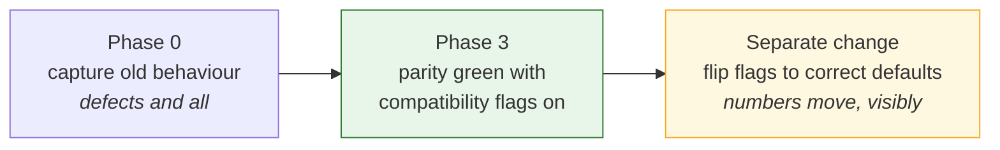

Fixing a bug and proving a refactor are two different tasks. Done in one
change, neither is verified: a parity failure could be the bug fix working or
the refactor broken, and there is no way to tell.

The other eight defects — lossy config round-trip, the un-constructable
config, per-sample static comparison, the catalog race, premature distributed
wrapping, the tuning `TypeError`, forced global determinism, pickled
modules — do not alter numerical output. They are fixed in the refactor with
no compatibility flag.

---

## 2. What is built

### 2.1 The capture script

`examples/rade_qnet/phase0_capture_baseline.py`

A standalone script that runs `rade_ml_pt`'s hybrid pipeline on a fixed,
checked-in input and writes the fixture. It imports **nothing** from `rade_qnet`
except `testkit.parity` helpers for writing, so no new code can influence what
is captured.

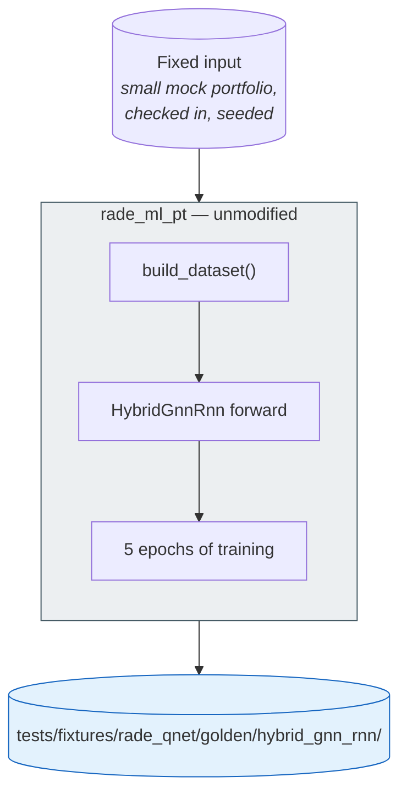

The input is deliberately small — a handful of elementary instruments, a
handful of targets, a few hundred scenarios. Large enough to exercise the graph
and the recurrence, small enough that the fixture can be committed and a parity
test can run in seconds. A parity suite that takes twenty minutes gets run
once.

### 2.2 The fixture

```text
tests/fixtures/rade_qnet/golden/hybrid_gnn_rnn/
├── manifest.json            what was captured, from which commit, with which config
├── input/
│   ├── portfolio.parquet    the exact input, checked in
│   └── config.json          the rade_ml_pt config used
├── level1_state/
│   ├── scaler_mean.npy      per-feature scaler statistics
│   ├── scaler_scale.npy
│   ├── selected_basis.json  selected elementary instruments, in order
│   ├── combined_features.npy
│   ├── adjacency_indices.npy
│   ├── adjacency_values.npy
│   ├── adjacency_shape.npy
│   ├── elementary_idx.npy
│   ├── target_idx.npy
│   └── universe.json
├── level2_tensors/
│   ├── split_indices.json   train / validation / test scenario indices
│   ├── train_batch_000.npz  first N batches per split, as produced
│   ├── val_batch_000.npz
│   └── test_batch_000.npz
├── level3_forward/
│   ├── state_dict.pt        weights at a fixed seed, before training
│   └── outputs.npy          forward-pass output for a fixed batch
└── level4_training/
    └── curve.json           train and validation loss, 5 epochs, fixed seed
```

Two details that are easy to get wrong and expensive to discover later.

**`selected_basis.json` records order, not just membership.** Basis selection
returns an ordered list, and that order determines column positions in every
downstream array. A refactor that selects the same instruments in a different
order passes a set comparison and fails everything after it.

**Index arrays are captured post-reduction.** `rade_ml_pt`'s `build_metadata`
*recomputes* `elementary_idx` as `0..n_e` and `target_idx` as
`n_e..n_e+n_t` **after** dimensionality reduction. Capturing pre-reduction
indices would make level 1 pass against the wrong thing.

### 2.3 `rade_qnet.testkit.parity`

The comparison harness, and the only `rade_qnet` code this phase writes.

| Function | Responsibility |
| --- | --- |
| `load_golden(name)` | Read a fixture and its manifest. |
| `compare_arrays(actual, expected, *, name, atol, rtol)` | Compare with a diagnostic on failure: shape, dtype, index of worst element, actual versus expected at that index. |
| `compare_state(actual, golden)` | Level 1 — exact. |
| `compare_tensors(actual, golden)` | Level 2 — exact. |
| `compare_forward(actual, golden, *, atol)` | Level 3. |
| `compare_curve(actual, golden, *, rtol)` | Level 4. |
| `ParityReport` | Per-level pass or fail with the worst deviation, so a failure is diagnosable from the report alone. |

`compare_arrays` is where the effort goes. "Arrays differ" wastes a day;
"element 4,117 of `combined_features`: expected 0.3471, got 0.3470, worst of
2 mismatches in 48,000" locates the bug immediately.

---

## 3. The five parity levels

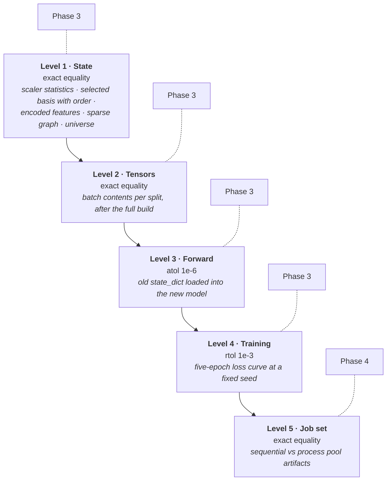

Tolerances widen down the list, and the reasoning is specific to each.

**Levels 1 and 2 are exact.** These are deterministic NumPy computations on
identical inputs. There is no floating-point excuse available: a difference
means different arithmetic, which is a bug.

**Level 3 allows `atol=1e-6`.** The old `state_dict` is loaded into the new
model and both are run on the same batch. Operations may be reassociated — a
fused kernel, a different reduction order — which perturbs the last bits
without changing the computation.

**Level 4 allows `rtol=1e-3`.** Five epochs of training accumulate
non-determinism from non-deterministic kernels and reduction order. A tighter
tolerance here would produce a test that fails occasionally and therefore gets
ignored, which is worse than a looser one that means something.

**Level 5 returns to exact.** Nothing about placement should change arithmetic.
If sequential and parallel runs differ at all, something is sharing state or
seeding per-worker incorrectly. This level is Phase 4's gate.

### Why the static/dynamic refactor is safe

Phase 2 moves static inputs out of per-sample collation into
`TensorBatchData.static`. That sounds like a behavioural change, and it is
worth stating why it is not.

`rade_ml_pt`'s `RadeDataset` merges every static tensor into every sample, and
`_collate_dict_batch` then runs `torch.equal` across the batch for each static
key and returns `values[0]` — the single unbatched tensor. **The network
already receives exactly one copy.** Moving the static tensors to a separate
field delivers the same object to the same place and deletes the per-sample
comparison. Level 2 confirms this: the batch contents are unchanged.

---

## 4. How this links to the rest of the framework

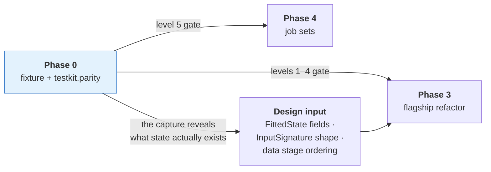

The fixture is more than a test. Capturing it forces an exhaustive inventory of
what `rade_ml_pt` actually fits and persists, which is the direct input to the
flagship's `FittedState` and `InputSignature` design. The twenty-odd sidecar
files of the old implementation are collapsed into one typed object precisely
because this phase enumerates them.

One concrete finding to carry forward: `_REQUIRED_KEYS` in the old model lists
seven keys, one of which — `elementary_indices` — is never read by the forward
pass. The new `InputSignature` should not declare it. Phase 3's parity run will
confirm it is genuinely unused.

---

## 5. Tests

`tests/rade_qnet/testkit/test_testkit_parity.py`

The harness that decides whether the refactor is correct has to be correct
itself. A parity suite that passes everything is worse than none, because it
provides false assurance. So it is tested in both directions.

| Test | Asserts |
| --- | --- |
| `test_identical_arrays_pass` | Comparing an array with itself passes at every tolerance. |
| `test_perturbation_above_tolerance_fails` | A deviation larger than `atol` fails. |
| `test_perturbation_below_tolerance_passes` | A deviation smaller than `atol` passes. |
| `test_shape_mismatch_fails_with_both_shapes` | A shape mismatch is reported as such, with both shapes, not as a value difference. |
| `test_dtype_mismatch_is_reported` | `float32` versus `float64` is flagged rather than silently upcast. |
| `test_failure_report_locates_worst_element` | The report names the worst index and its two values. |
| `test_reordered_basis_fails` | Same instruments in a different order **fails** — the trap described in §2.2. |
| `test_missing_golden_file_raises_clearly` | An incomplete fixture produces an actionable error, not a `KeyError`. |

Note what is *not* tested here: the fixture's contents. The fixture is data,
not code. Its correctness is established by the capture script running against
unmodified `rade_ml_pt`, and recorded in `manifest.json` with the source
commit.

---

## 6. Definition of done

Beyond the universal criteria in
[`IMPLEMENTATION.md` §5](../IMPLEMENTATION.md#5-definition-of-done--every-phase):

- [x] `examples/rade_qnet/phase0_capture_baseline.py` runs against unmodified
      `rade_ml_pt` and writes the complete fixture.
- [x] `rade_ml_pt` has **no** modifications made by this phase. One
      pre-existing modification to `standardiser.py` was found and verified
      irrelevant to the captured path — 47 insertions, 0 deletions, and the
      `standard` branch the capture uses is byte-identical to `HEAD`. Recorded
      in §8.
- [x] The fixture is committed at **132 KB**, well under 10 MB, and the whole
      `testkit` suite including the fixture guards runs in under a second.
- [x] `manifest.json` records the commit, the full data and model config, the
      seed, the library versions, the capture timestamp and the two
      deliberately preserved defects.
- [x] `selected_basis.json` records order, a test proves a reordering fails,
      and a further test proves the captured order is **not** the input order
      — without which the ordered and unordered comparisons would be
      indistinguishable on this data.
- [x] Index arrays are captured post-reduction, with a comment stating why,
      and `test_the_index_arrays_are_post_reduction` pins it. The fixture
      genuinely reduces 20 instruments to 8, so the trap is live rather than
      theoretical.
- [x] `testkit.parity` implements all five comparison levels.
- [x] `compare_arrays` failure output names the array, the worst *mismatching*
      element, both values, the difference and the mismatch count.
- [x] Every test in §5 passes, plus the fixture guards in §8.
- [x] The compatibility flags needed for parity (`basis.fit_on: all`,
      `split.kind: explicit`) are recorded here, in `manifest.json` under
      `preserved_defects`, and in the Phase 3 document.
- [x] Re-running the capture reproduces the fixture bit for bit, asserted by
      `phase0_capture_baseline.py --verify`.

---

## 7. Risks

| Risk | Why it matters | Mitigation |
| --- | --- | --- |
| `rade_ml_pt` is not deterministic enough to capture | No stable baseline exists, and the refactor cannot be verified | Capture twice and diff. If levels 1–2 differ, find the source of non-determinism and pin it **in the capture script**, never in `rade_ml_pt`. |
| The fixture is too large to commit | It stops being run, and parity becomes theoretical | Keep the input tiny; store first-N batches rather than all; assert the size limit in CI |
| Capture reveals a defect too severe to preserve | Reproducing it in new code would mean writing a known-wrong path | Record it here explicitly, skip the affected parity level with a written justification, and cover the behaviour with a direct unit test instead |
| A compatibility flag never gets flipped | The framework ships with a leakage path on by default | The flag's default is **already** the correct value; parity overrides it explicitly. Forgetting leaves the *correct* behaviour in place. |
| The fixture drifts as `rade_ml_pt` changes | Parity passes against a stale target | `manifest.json` pins the commit; the parity test warns if `rade_ml_pt`'s hybrid data build has changed since capture |

The fourth row is worth dwelling on. Defaults are set so that the *failure mode
of forgetting* is the safe one. `basis.fit_on` defaults to `train`; the parity
run has to opt into `all`. If the flag is never revisited, nothing is leaking.

---

## 8. Deviations

*Record here any departure from this document, with reasoning, at the time it
is made. A phase document that no longer matches the code is worse than no
document.*

| Deviation | Reason |
| --- | --- |
| The input is committed as `.npy` + `.json`, not `input/portfolio.parquet`, and the four pickles `rade_ml_pt`'s loader reads are materialised into a temporary directory at capture time | The loader reads four separate artifacts: two P&L frames and two attribute dictionaries whose columns hold lists, which a single parquet cannot represent. Checking in the pickles instead would put executable payload in a fixture whose whole purpose is to be trusted. The conversion is lossless, happens in the capture script, and leaves the committed artifact reviewable in a diff. |
| Level 4 uses an explicit training loop written in the capture script, not `rade_ml_pt`'s trainer | The trainer applies early stopping, learning-rate reduction and best-weight restoration. A curve captured through it would record those callbacks as much as the model, and the refactored framework implements its own callbacks by design — so comparing the curves would test whether two callback implementations agree, which is not the question. The narrower claim actually captured is: same architecture, same batches in the same order, same optimiser and loss produce the same losses. That isolates the model and the data, which is what the refactor moved. |
| The capture materialises the model's lazy parameters before constructing the optimiser | Defect 6: an optimiser built over uninitialised parameters holds placeholders and updates nothing. Doing it correctly here is not a modification to `rade_ml_pt` — it is the capture script avoiding a trap, which is permitted where editing the original is not. Had the capture reproduced the defect, level 4 would have recorded a flat curve and tested nothing. |
| The input is laid out as (underlying, product) groups of five rather than a flat book | Found while verifying the first capture. `dimension_reduction` runs basis selection **per group**, so the original two-instruments-per-group input reduced 16 of 16 — nothing was removed, `elementary_idx` came out equal to the pre-reduction indices, and the post-reduction trap went uncaptured. The fixture would have passed against a refactor that gets it wrong. Five per group driven by two factors reduces 20 to 8, and `test_the_fixture_can_still_fail` now asserts that it does. |
| A second test module, `test_testkit_golden_fixture.py`, guards the fixture's shape | §5 states correctly that the fixture's *values* are not tested. Its *shape* must be, because a fixture degrades silently: re-captured under a configuration where selection keeps everything, every parity test still passes while two of its sharpest checks have stopped testing anything. These guards assert it still reduces, that the surviving order is not the input order, and that the window spans more than one scenario. |
| `rade_ml_pt` carries one pre-existing modification: `features/transforms/standardiser.py` | Not made by this phase — it predates it. Verified not to affect the baseline: the diff is **47 insertions and 0 deletions**, and the only change to `get_transformer` is two new `elif` branches for `global` and `signed_log_global`. The capture uses `transform_type="standard"`, whose branch is byte-identical to `HEAD`. The code path the capture takes through `rade_ml_pt` is therefore unmodified, which is what the definition-of-done item is protecting. |
| `compare_arrays` treats a NaN on one side only as a mismatch, explicitly | Caught by `test_a_nan_on_one_side_only_fails` while writing the harness. The natural implementation subtracts and compares against a tolerance, but `nan - 2.0` is `nan` and `nan > tol` is **False**, so a refactor that started emitting NaN where the original emitted a number would have been reported as a **pass** — the most dangerous direction a parity harness can fail in. |
````

---

## 2. `src/rade_qnet/docs/phases/PHASE_1_CORE.md`

40634 bytes · SHA-256 `fa59c7242c850390`

````markdown
# Phase 1 — Core

**The framework's vocabulary, and the infrastructure every later phase
consumes.**


|                              |                                                                                                         |
| ---------------------------- | ------------------------------------------------------------------------------------------------------- |
| **Depends on**               | Scaffold                                                                                                |
| **Blocks**                   | Everything                                                                                              |
| **Delivers**                 | `core.spec`, `core.contract`, `core.authoring`, `core.lifecycle`, `storage`, `analysis` bases, `testkit` |
| **Can run in parallel with** | The baseline capture, now the first half of phase 0+3                                                   |
| **Nothing trains yet**       | That is Phase 2                                                                                         |
| **Status**                   | Complete — see [§5](#5-definition-of-done) and [§7](#7-deviations)                                      |


---

## 1. Purpose

This phase builds the words. Every later phase is a consumer of it, which has
two consequences worth internalising before starting.

**A compromise here is a compromise everywhere.** If `DataBundle` is awkward,
every data module, every engine and every pipeline is awkward. Later phases can
be refactored in isolation; this one cannot.

**It is the largest phase and produces nothing demonstrable.** No model trains.
What exists at the end is a run context, an instrumented step runner, a
component registry, an atomic bundle writer, a single-writer catalog, pure
metrics, a plotting style and a conformance suite. The temptation to rush it
and "get to the model" is exactly the pressure that produced the defects this
framework exists to fix.

The one rule that governs the whole phase: `core` **imports no training
library.** Only the standard library, `pydantic` and `numpy`. A specification
must be parseable, validatable and hashable in a process that has never
imported PyTorch, because a job set spawning sixteen workers pays every import
cost sixteen times. This is enforced by `test_scaffold.py` through an
allowlist.

---


## 2. What is built

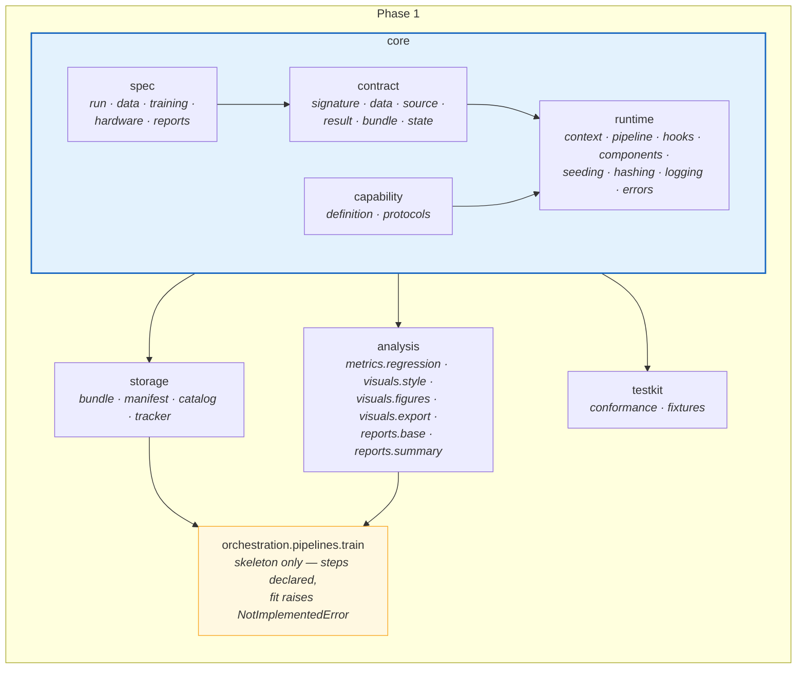


### 2.1 `core.spec`


| Module        | Contents                                                                               |
| ------------- | -------------------------------------------------------------------------------------- |
| `run.py`      | `RunSpec`, discriminated on `task` into `SupervisedRunSpec` and `ReinforcementRunSpec` |
| `data.py`     | `SourceSpec` union, `SplitSpec`, `LoaderSpec`                                          |
| `training.py` | `TrainingSpec`, discriminated on `engine`                                              |
| `hardware.py` | `HardwareSpec` — device, precision, compile, distribution, determinism                 |
| `reports.py`  | `ReportsSpec` — which writers are enabled                                              |


Rules, all of them testable:

- `model_config = ConfigDict(extra="forbid", frozen=True)`. A typo is a
load-time error; immutability means a spec cannot be mutated behind a
pipeline's back halfway through a run.
- Exact round-trip: `Spec.model_validate(spec.model_dump())` equals `spec`.
This is what makes a persisted spec a faithful record, and it is the property
defect 1 violated.
- Every spec is constructible with defaults. `Spec()` must not raise — defect 2
was exactly this, a required field hidden inside a default factory.
- Unions are discriminated, so a validation error names the field rather than
reporting five failed alternatives.
- Cross-field validation at the spec, not in the pipeline. Split fractions
summing to one or more is a `SpecError` before a file is read.

Two separations to preserve:

`SplitSpec` **and** `LoaderSpec` **are different objects.** The scenario split and
the batch order are unrelated decisions. Defect 3 came from one `shuffle` flag
driving both, which turned a chronological split into a random one.

`HardwareSpec` **is not** `PlacementSpec`**.** Hardware is how one job uses its
machine. Placement (Phase 4) is where jobs run. Conflating them is why "use the
GPU" and "run forty in parallel" become the same tangled flag.

`HardwareSpec.determinism` is `off | warn | strict`, replacing defect 8's
globally forced `use_deterministic_algorithms(True)` inside a swallowed
`try`/`except`. The cost — slower kernels, and some operations unsupported — is
a trade-off a user should make knowingly.

### 2.2 `core.contract`


| Module         | Contents                                                       |
| -------------- | -------------------------------------------------------------- |
| `signature.py` | `TensorSpec`, `InputSignature`, `PolicySignature`              |
| `data.py`      | `DataBundle[T]`, `TensorBatchData`, `DataLineage`. `ArrayData` was also built here and [retired in Phase 6](PHASE_6_ADDITIONAL_ENGINES.md#81-arraydata-and-enginecapabilitiespayload-are-retired) |
| `source.py`    | `BatchSource` protocol                                         |
| `result.py`    | `FitOutcome`, `TrainingResult`, `EvalResult`, `Predictions`    |
| `bundle.py`    | `ModelBundle`, `SavedBundle`, `Manifest`                       |
| `state.py`     | `FittedState` abstract base                                    |


`InputSignature` separates static from dynamic inputs:

```python
@dataclass(frozen=True)
class InputSignature:
    """Declared shapes and dtypes of a model's inputs and target."""

    static: Mapping[str, TensorSpec]    # constant across batches: graph, entity features
    dynamic: Mapping[str, TensorSpec]   # varies per sample: history windows
    target: TensorSpec
```

This one type does three jobs. It tells the engine which tensors to upload to
the device once rather than collating per sample (fixing defect 4). It lets a
model's lazy parameters be materialised by a dummy forward pass before any
optimiser or distributed wrapper touches them (fixing defect 6). And it is what
allows a model to be rebuilt from a saved bundle without re-running the data
build.

`FittedState` is the abstract base for everything fitted at training time and
needed again at inference:

```python
class FittedState(ABC):
    """Everything a model fits during training and needs again at inference."""

    @abstractmethod
    def save(self, directory: Path) -> None: ...

    @classmethod
    @abstractmethod
    def load(cls, directory: Path) -> Self: ...

    @abstractmethod
    def inverse_transform_targets(self, predictions: NDArray) -> NDArray: ...
```

`inverse_transform_targets` is abstract, not optional. A model that scales its
target and cannot invert the scaling produces metrics in standardised space —
numbers nobody can act on. Making it a required method means that failure is
impossible to ship rather than easy to forget.

`BatchSource` is the protocol that unifies supervised and reinforcement
learning. Defining it in Phase 1, before any source exists, is deliberate: a
protocol written after its implementations describes them instead of
constraining them.

### 2.3 `core.authoring`

`definition.py` holds `ModelDefinition` and its two specialisations,
`PredictorDefinition` and `PolicyDefinition`, plus the `@model` decorator. The
required surface is small — `spec`, and `build(spec, signature)` — because that
minimum is what keeps a simple model to one file.

`protocols.py` holds the five opt-in capabilities (`StaticInputs`,
`Precomputable`, `CustomStep`, `Routable`, `Inductive`), each a
`@runtime_checkable` `Protocol`. Protocols rather than base classes so a user's
model satisfies one by having the right methods — no import of ours, no
inheritance, and therefore a model can live outside this repository.

The property to test in both directions: a model implementing a capability is
detected, and a model implementing none is entirely unaffected by every
capability that exists. The second is what makes adding a capability later a
safe operation.

### 2.4 `core.lifecycle`


| Module          | Contents                                                                                   |
| --------------- | ------------------------------------------------------------------------------------------ |
| `context.py`    | `RunContext` — run id, directory, seed, bound logger, events, step cache, catalog, tracker |
| `pipeline.py`   | `Pipeline` base and the `step()` runner                                                    |
| `hooks.py`      | `PipelineHook` — `on_step_start`, `on_step_end`, `on_step_error`                           |
| `components.py` | `@model`, `@engine`, `@learner`, `@report` and their lookups                               |
| `seeding.py`    | `seed_everything(seed, determinism)`                                                       |
| `hashing.py`    | Stable hashes for specs, sources and files                                                 |
| `logging.py`    | Structured logging with contextual identifiers                                             |
| `errors.py`     | `RadeQNetError` and specialisations                                                          |


`step()` is the single choke point for every stage, and everything the
framework knows about a run passes through it:

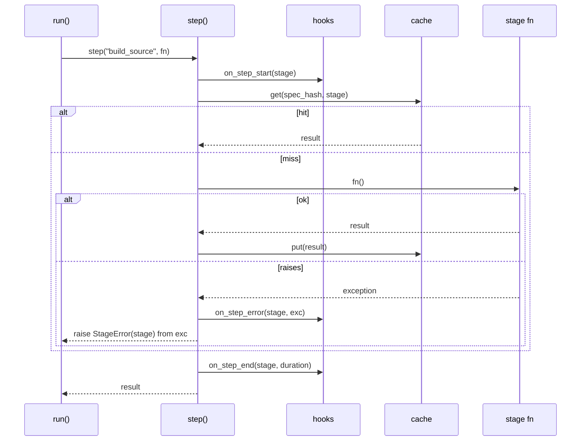


One function gives timing, event emission, caching, and a failure that always
names its stage. Retrofitting any of those onto hand-written stage calls means
touching every pipeline.

`hashing.py` matters more than it looks. The spec hash is the cache key, so an
unstable hash means tuning silently rebuilds the same dataset on every trial.
Tested explicitly: equal specs hash equally, dictionary key order is
irrelevant, and the hash survives a fresh interpreter (which rules out
`hash()`, whose string randomisation differs per process).

`errors.py` draws one distinction that the rest of the framework relies on: a
`SpecError` is actionable by the user, a `ContractError` is a framework bug.
Collapsing both into `ValueError` loses that information at the moment it is
most useful.

### 2.5 `storage`


| Module        | Contents                                     |
| ------------- | -------------------------------------------- |
| `bundle.py`   | `write_bundle`, `read_bundle`                |
| `manifest.py` | Manifest schema and per-file `sha256`        |
| `catalog.py`  | The bundle index, single-writer              |
| `tracker.py`  | Tracking behind one interface, no-op default |


Four properties, each fixing a specific failure:

**Atomic writes.** Build in `tmp/`, `os.replace` into place. An interrupted
write leaves nothing that *looks* valid — which is worse than leaving nothing,
because something that looks valid gets loaded.

**Content hashes.** Every file hashed in the manifest, so corruption is caught
at load rather than surfacing as inexplicable predictions.

**Single catalog writer.** Defect 5: an index updated by eight workers through
read-modify-write loses entries. Not often — just often enough that nobody
trusts the catalog.

**No pickled modules.** Defect 10: `torch.save(model)` embeds your class's
import path, so renaming the class makes every saved model unloadable — exactly
what a refactor does. `storage` accepts bytes from an engine and never imports
one, which keeps this structurally impossible.

### 2.6 `analysis` bases

Only the foundations in this phase: `metrics/regression.py`,
`visuals/style.py`, `visuals/primitives.py`, `visuals/export.py`,
`reports/base.py`, `reports/summary.py`.

The visual/report split is established here and everything later follows it. A
visual takes data and returns a figure; it does not save, show, close or mutate
global plotting state. Tested explicitly against a temporary directory —
a plotting function that writes as a side effect cannot be used from a
dashboard, a notebook or another test.

`visuals/style.py` applies the house style through a **context manager that
restores global state on exit**. Matplotlib's `rcParams` are process-global, so
a style applied and left in place changes the appearance of every subsequent
figure, including ones produced by unrelated code in the same process.

`reports/base.py` establishes that **no report is load-bearing**: a report that
raises produces a warning, not a lost run. Discarding four hours of training
because a figure failed to render is not a trade anyone would make
deliberately.

### 2.7 `testkit`

`conformance.py` and `fixtures.py`. The conformance suite is written now, in
its Phase 1 form, and extended by each later phase. It checks that a model
builds from its spec and signature, that its fitted state round-trips, that its
bundle reloads into an equivalent model, that metrics arrive in original target
units, and that scenario-axis transforms observed training rows only.

That last check must distinguish the two fitting axes. A rule saying "fitted
transforms may only see training indices" would be wrong and would falsely fail
the flagship, whose entity-axis graph construction legitimately spans the whole
instrument universe. See
`ARCHITECTURE.md` [§5](../ARCHITECTURE.md#two-fitting-axes-two-leakage-rules).

### 2.8 `TrainPipeline` skeleton

The stage sequence is declared and each step is a typed method, but `fit`
raises `NotImplementedError` — there is no engine yet. This exists in Phase 1
so the contracts are exercised by a real caller rather than only by unit tests.
A contract that nothing consumes tends to be subtly wrong in a way no test of
the contract itself will find.

---


## 3. How this links to the rest of the framework

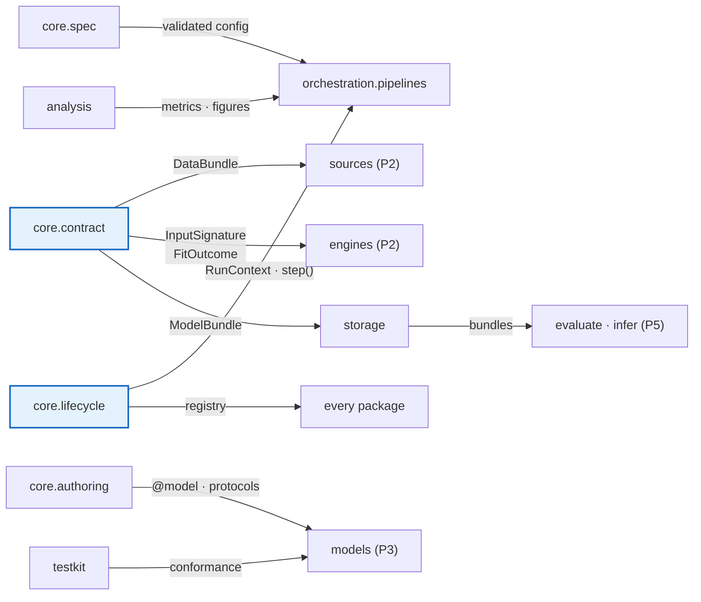


Every arrow leaving Phase 1 is a contract that cannot be changed cheaply once
its consumer exists. Four are worth extra scrutiny during review:


| Contract         | Consumed by                                       | Why it is hard to change later                       |
| ---------------- | ------------------------------------------------- | ---------------------------------------------------- |
| `DataBundle[T]`  | Every data module and engine                      | Changing it touches every model                      |
| `InputSignature` | Materialisation, bundle reload, static-input path | Three unrelated mechanisms depend on its exact shape |
| `FittedState`    | Every model, evaluate, infer                      | A model's persisted state format is a migration      |
| `BatchSource`    | Every loop and every source                       | The ML/RL unification rests on it                    |


---


## 4. Tests

Mirroring `tests/rade_qnet/core/`, `storage/`, `analysis/`, `testkit/`. The
planned module list is in each test package's `__init__.py`. The tests that
matter most:

### Specs


| Test                                             | Asserts                                                           |
| ------------------------------------------------ | ----------------------------------------------------------------- |
| `test_unknown_key_is_rejected`                   | `extra="forbid"` works; a typo fails at load                      |
| `test_round_trip_is_exact`                       | `model_validate(model_dump())` equals the original — defect 1     |
| `test_defaults_construct`                        | `Spec()` does not raise — defect 2                                |
| `test_split_and_loader_are_independent`          | Setting `loader.shuffle` does not change split indices — defect 3 |
| `test_discriminator_error_names_the_field`       | An invalid `engine` reports that, not five union failures         |
| `test_fractions_summing_to_one_raise_spec_error` | Cross-field validation fires at the spec                          |


### Runtime


| Test                                     | Asserts                                                    |
| ---------------------------------------- | ---------------------------------------------------------- |
| `test_step_failure_names_the_stage`      | `StageError` identifies the stage and chains the cause     |
| `test_step_cache_hit_skips_execution`    | Served from cache; the function is not called              |
| `test_cache_key_changes_with_spec`       | A different spec misses                                    |
| `test_hash_is_stable_across_processes`   | Hash computed in a subprocess matches — rules out `hash()` |
| `test_hash_ignores_key_order`            | Dictionary ordering is irrelevant                          |
| `test_seeding_reproduces_a_run`          | Same seed, same numbers                                    |
| `test_hook_error_does_not_abort_the_run` | A misbehaving hook cannot lose a run                       |
| `test_duplicate_registration_raises`     | Two models claiming one name fails loudly                  |


### Storage


| Test                                             | Asserts                                                    |
| ------------------------------------------------ | ---------------------------------------------------------- |
| `test_interrupted_write_leaves_nothing_loadable` | Fail before the rename; no partial bundle is readable      |
| `test_modified_file_fails_verification`          | Content hash catches a tampered file                       |
| `test_concurrent_catalog_writes_lose_no_entry`   | Several processes register; all entries present — defect 5 |
| `test_unreachable_tracker_warns_not_raises`      | Tracking never fails a completed run                       |
| `test_bundle_reload_rebuilds_the_model`          | Signature plus weights reconstruct an equivalent model     |


### Analysis


| Test                                          | Asserts                                                      |
| --------------------------------------------- | ------------------------------------------------------------ |
| `test_metric_matches_hand_computed_value`     | Against arithmetic done by hand, not a second implementation |
| `test_metric_degenerate_cases`                | Constant target, perfect prediction, single observation      |
| `test_visual_writes_nothing`                  | No file appears in a temporary working directory             |
| `test_style_restores_global_state`            | `rcParams` unchanged after the context manager exits         |
| `test_failing_report_warns_and_run_completes` | No report is load-bearing                                    |


### Conformance


| Test                                      | Asserts                                                       |
| ----------------------------------------- | ------------------------------------------------------------- |
| `test_compliant_model_passes`             | A correct minimal model passes every check                    |
| `test_each_check_fails_a_violating_model` | For each clause, a model breaking exactly that clause fails   |
| `test_entity_axis_fitting_is_not_flagged` | Full-universe entity fitting passes — the false-positive trap |


The second conformance test is the important one. A suite that passes
everything is worse than none, so each clause is verified against a model built
to violate it.

---


## 5. Definition of done

Beyond the universal criteria in
`IMPLEMENTATION.md` [§5](../IMPLEMENTATION.md#5-definition-of-done--every-phase).

Every box below is ticked against a named test, not against a reading of the
code. Where a test is not named, the claim is checked by the whole suite
passing and is marked as such.

- [x] All modules in §2.1–§2.8 exist, with docstrings stating their contracts.
- [x] `core` imports only stdlib and its allowlisted third-party packages —
      `test_scaffold.py::test_core_stays_free_of_training_libraries`. The
      allowlist is `numpy`, `pydantic`, `typing_extensions` and `yaml`; the
      addition of `yaml` is recorded in §7.1.
- [x] Every spec: `extra="forbid"`, `frozen=True`, exact round-trip, and bare
      constructible wherever it is reached through a `default_factory` —
      `test_scaffold.py`. The narrowing of the last clause is recorded in §7.1.
- [x] Split and loader concerns separate; hardware and placement separate.
      `SplitSpec` is realised as a discriminated union of
      `ChronologicalSplitSpec`, `PurgedKFoldSplitSpec`, `GroupedSplitSpec` and
      `ExplicitSplitSpec`, which is a stronger separation than the single
      class this document originally named: a chronological split cannot be
      handed a `n_folds`. `LoaderSpec` holds batch order and nothing else, so
      defect 3 is unexpressible.
- [x] `FittedState.inverse_transform_targets` is abstract —
      `test_contract_state.py`.
- [x] `BatchSource` is satisfiable by a class inheriting from nothing of ours —
      `test_contract_source.py`, and demonstrated by `SyntheticTensorSource`,
      which inherits from `object`.
- [x] All five capability protocols `@runtime_checkable`, detection tested in
      both directions — `test_capability_protocols.py`.
- [x] `step()` provides timing, events and stage-named failures —
      `test_runtime_pipeline.py`.
- [ ] `step()` provides caching. **Deferred to Phase 3**, with reasoning in
      §7.4. `CacheSpec` exists, so the configuration surface is in place; the
      mechanism is not.
- [x] Spec hash stable across processes, verified in a subprocess with hash
      randomisation explicitly enabled — `test_runtime_hashing.py`.
- [x] Bundles written atomically with per-file hashes; an interrupted write
      leaves nothing loadable — `test_storage_bundle.py`.
- [x] Catalog survives concurrent writes from several processes with no lost
      entry — `test_storage_catalog.py` runs four worker processes making four
      reservations each and asserts sixteen unique contiguous versions.
- [x] Tracking degrades to a warning when unavailable —
      `test_storage_tracker.py`.
- [x] Visuals return figures and write nothing; the style context manager
      restores global state — `test_visuals_style.py` additionally walks the
      AST of every module in the package to prove none imports pyplot.
- [x] A failing report warns and the run completes — `test_reports_base.py`.
- [x] Conformance suite passes a compliant model and fails one violating model
      per clause — `test_testkit_conformance.py` asserts per clause that the
      named clause is the one that failed, so a check cannot pass the suite by
      failing for the wrong reason.
- [x] `TrainPipeline` skeleton declares every stage with typed signatures —
      `test_pipelines_train.py`.
- [x] Defects 1, 2, 3, 5, 8 and 10 each have a test that would fail against the
      old behaviour:

      | Defect | Architectural fix delivered here | Test |
      | ------ | -------------------------------- | ---- |
      | 1 | Exact spec round-trip | `test_scaffold.py` round-trip check over every spec |
      | 2 | No required field hidden behind a default factory | `test_scaffold.py` bare-construction check |
      | 3 | `SplitSpec` and `LoaderSpec` separate objects | `test_spec_run.py`, and `extra="forbid"` makes a `shuffle` key on a split spec a validation error |
      | 5 | Single-writer append-oriented catalog | `test_storage_catalog.py` multi-process probe |
      | 8 | `determinism: off \| warn \| strict`, explicit per run | `test_runtime_seeding.py` |
      | 10 | Hashed manifest, no module pickling | `test_storage_manifest.py`, `test_storage_bundle.py` |

- [x] `examples/rade_qnet/phase1_specs_and_bundles.py` demonstrates: load a YAML
      spec, hash it, write a bundle with fitted state, reload it, verify the
      manifest. It also shows a corrupted bundle being refused and the summary
      report rendering from the bundle alone.
- [x] `ruff check` and `ruff format --check` clean over `src/rade_qnet`,
      `tests/rade_qnet` and `examples/rade_qnet`; full suite green.

---

## 6. Risks


| Risk                                                           | Why it matters                                                | Mitigation                                                                                                                                 |
| -------------------------------------------------------------- | ------------------------------------------------------------- | ------------------------------------------------------------------------------------------------------------------------------------------ |
| Contracts designed without a consumer                          | A contract written in the abstract fits nothing in particular | Build the `TrainPipeline` skeleton (§2.8) in this phase; write the Phase 2 and 3 call sites as comments and check the contract serves them |
| A heavy import leaks into `core`                               | Every worker's start-up slows; the layering erodes            | Allowlist-enforced by test, not by review                                                                                                  |
| `FittedState` too narrow for the flagship                      | Phase 3 widens it, and every Phase 1 test is rewritten        | The baseline capture at the start of phase 0+3 enumerates exactly what the flagship fits. Because that capture no longer precedes this phase, `FittedState` was instead kept to the narrowest contract that cannot be wrong — `save`, `load`, `describe` and an abstract `inverse_transform_targets` — leaving *what* is fitted entirely to the implementation |
| The phase overruns and gets cut short                          | The foundations stay weak and every later phase pays          | §2.6 is already the minimum viable `analysis`; cut *scope* (more metrics, more visuals) before cutting *rigour*                            |
| `extra="forbid"` plus `frozen=True` proves awkward in practice | Pressure to relax it, which reopens defects 1 and 2           | Relaxing either is a documented architecture decision, not a convenience fix                                                               |


The first risk is the real one. A contract designed with no consumer describes
an imagined use. This is why the pipeline skeleton is in scope despite not
being able to train: it forces the contracts to be consumed by something real
before they are frozen.

---


## 7. Deviations

Everything below is a decision taken during implementation that differs from
what this document specified before the code existed. Recorded rather than
quietly absorbed, because a plan that is silently edited to match the result
stops being useful as a plan.


### 7.1 Design decisions

| Deviation                                                                                                                                                                                 | Reason                                                                                                                                                                                                                                                                 |
| ----------------------------------------------------------------------------------------------------------------------------------------------------------------------------------------- | ---------------------------------------------------------------------------------------------------------------------------------------------------------------------------------------------------------------------------------------------------------------------- |
| **Spec-default rule narrowed.** "Every spec constructible with defaults" became "every spec reached through a `default_factory` must be bare-constructible".                               | The original rule is stronger than the need and forbids a required field anywhere in the tree. What actually has to hold is that `RunSpec(model=...)` succeeds, which only requires the specs it defaults into to be bare-constructible. `test_scaffold.py` checks that. |
| **`yaml` added to the `core` third-party allowlist.** Previously stdlib, `pydantic` and `numpy`.                                                                                           | `core.spec.run.load_run_spec` reads YAML, and the alternative is pushing spec loading out of `core` into a layer that may import it — inverting the dependency. `yaml` is a parser with no transitive weight, so it costs nothing the allowlist exists to prevent.       |
| **`SpecError` also inherits `ValueError`.**                                                                                                                                               | A pydantic field validator must raise `ValueError` for pydantic to collect it with a dotted field path. Inheriting both means one error type serves both the validator path and direct raising.                                                                         |
| **Two-level validation error policy.** Direct construction surfaces `ValidationError`; `parse_run_spec` reformats into a single `SpecError`.                                               | The two callers want different things. Framework code constructing a spec wants pydantic's structured error; a user with a bad YAML file wants one readable message naming the file. Converting for both would discard structure a programmer needs.                     |
| **`task` defaults at `parse_run_spec` rather than in the union.**                                                                                                                         | A discriminated union cannot default its own discriminator. Defaulting at the parse boundary means a file that omits `task` resolves to the supervised branch, which is what nearly every user wants to write.                                                          |
| **`apply_context_payload` replaces rather than merges.**                                                                                                                                  | Merging would let a stale key from a previous stage survive into the next one's log lines. A log field that is wrong is worse than one that is missing, because nobody doubts it.                                                                                        |
| **`object`, not `Any`, for engine-native model, environment and payload types.**                                                                                                          | Both are unconstrained, but `object` makes an attribute access a type error at the point where `core` would be reaching into something it must not understand. `Any` would silently permit it.                                                                          |
| **`EarlyStoppingSpec.enabled` defaults to `False`, not `True`.**                                                                                                                          | Two reasons. A run should train the epoch budget it was configured with, and early stopping silently changes which weights you end up with. And the default `monitor` is a validation metric, so defaulting to enabled makes a bare spec invalid for any run without a validation split. |
| **`examples/rade_qnet/ruff.toml` added.**                                                                                                                                                   | Examples sat under the repository root config, where `print` is not checked. An example is the first code a new user copies, so it is held to the framework standard with `T201` relaxed — and only `T201`.                                                             |
| **Autouse `_restore_framework_logging` fixture in `tests/rade_qnet/conftest.py`.**                                                                                                          | `configure_logging` sets `propagate = False`, which is right for an application and poisons `caplog` for every later test. Without the fixture, a test asserting that something was logged passes alone and fails only when ordered after a test that configures logging. |


### 7.2 Defects found and fixed during implementation

Found by writing the tests, not by reading the code — which is the argument
for the test tree landing in the same phase as the code.

| Defect                                                                                                                                     | Fix                                                                                                                                                  |
| ------------------------------------------------------------------------------------------------------------------------------------------ | ---------------------------------------------------------------------------------------------------------------------------------------------------- |
| `parse_run_spec` raised a bare `TypeError` on a non-mapping payload. A YAML file whose top level is a list is a common mistake and produced an error naming nothing a user could act on. | An `isinstance(payload, Mapping)` guard raising `SpecError` with the likely cause named.                                                              |
| `testkit.conformance.check_source` drained with `list(source.batches())`, which hangs forever on a source declaring itself unbounded — the exact case the `steps_per_epoch is None` contract exists to support. | Prefix draining with `islice` up to `UNBOUNDED_PROBE_BATCHES`. Surfaced only because the fixture gained an unbounded mode, which is why the fixture gained one. |


### 7.3 Testkit gaps closed

The testkit is public API: a model author outside this repository uses it to
test their own model. Each gap below made some legitimate assertion
unexpressible.

| Gap                                                                                 | Addition                                                                                                                       |
| ----------------------------------------------------------------------------------- | ------------------------------------------------------------------------------------------------------------------------------ |
| `SyntheticTensorSource` could not model an unbounded source, and ignored `static` in its derived signature. | `unbounded: bool` parameter; `static` now reflected as a real `TensorSpec`.                                                     |
| `make_tensor_bundle` / `make_array_bundle` always produced all three splits, so the no-validation path could not be tested. | A validated `splits` parameter, refusing unknown names or a missing `train`.                                                    |
| `make_training_result` only ever produced a `test` evaluation, leaving the multi-split reporting path unexercised. | `with_validation` now controls a validation evaluation too.                                                                     |
| `make_model_bundle` could not be given a recognisable model, state, spec or lineage, so no test could prove the bundle carried them through untouched. | `model`, `state`, `spec` and `lineage` parameters.                                                                             |
| `make_lineage` could not set `spec_digest`, so the link `write_bundle` relies on — manifest digest copied from lineage, not recomputed — was unprovable. | `spec_digest` parameter, defaulting to the named `PLACEHOLDER_DIGEST`. `make_lineage` was also missing from `__all__`.           |


### 7.4 Deferred: step-level caching

`step()` was specified here as providing "timing, events, caching and
stage-named failures". It provides three of the four. Caching is deferred to
Phase 3, deliberately.

The reason is the one §6 names as this phase's real risk: *a contract designed
without a consumer describes an imagined use.* A cache needs a key, and a
correct key is a digest over the spec fields the stage actually reads plus the
fingerprint of its inputs. Guessing at that set with no expensive stage in
existence would produce either a key so coarse it never hits or so fine it
is wrong — and the only stage worth caching is the flagship's data build,
which arrives in Phase 3.

What is in place is the configuration surface: `CacheSpec` exists and
round-trips, so turning caching on later is not a spec change. What is not in
place is any code that reads it, and no stage currently claims to be cached,
so nothing silently behaves as though caching worked.


### 7.5 Added beyond the plan: spec invariants enforced structurally

The four spec invariants — `extra="forbid"`, `frozen=True`, exact round-trip,
and bare-constructibility where defaulted — were tested per spec module in
`core/spec/test_spec_*.py`. Thorough for the specs that exist, and silent
about the ones that do not: a spec added in Phase 2 or 3 could ship without
any of the four being checked, and the person who forgot to test it is the
same person who would have had to add it to a list.

`test_scaffold.py::TestEverySpecObeysTheSpecInvariants` now discovers every
`Spec` subclass transitively through the class hierarchy and applies all four.
Three details are worth recording:

- It asserts that discovery found something. A structural test that silently
  collects nothing is worse than no test, because it reports a guarantee it
  never checked.
- Bare-constructibility is required only of specs reached through a
  `default_factory`, matching the narrowed rule in §7.1.
- Round-tripping is required of *anything* constructible with no arguments,
  which is a wider set. `SklearnTrainingSpec` is the case that motivated the
  distinction: nothing defaults into it, because it is a sibling of
  `TorchTrainingSpec` in the training union, but a user selects it with one
  line of YAML and it must round-trip like any other.


````

---

## 3. `src/rade_qnet/docs/phases/PHASE_2_TORCH_ENGINE.md`

28273 bytes · SHA-256 `5a4d2dcc551f2911`

````markdown
# Phase 2 — Torch engine

**The first phase that trains a model end to end.**

| | |
| --- | --- |
| **Depends on** | Phase 1 |
| **Blocks** | Phases 3 and 6 |
| **Delivers** | `engines.torch`, `sources.dataset`, `sources.batching.dataset`, a complete `TrainPipeline`, the data and training visuals and reports |
| **Milestone** | A simple supervised model trains, produces a bundle, metrics and reports |

---

## 1. Purpose

Phase 1 built the vocabulary. This phase makes it do something.

At the end, a user can point at a CSV, write a twenty-line model, and get a
trained model with a versioned bundle, leakage-aware splits, learning curves,
baseline comparisons and a data quality report — without writing a training
loop.

Three design decisions are implemented here, and all three are direct fixes to
defects in the previous implementation. They are described in §3 because they
are the substance of the phase, not details of it.

Note what is **not** here: the flagship model. A graph-temporal network is a
bad first customer for a new training loop, because a failure could be in
either. Phase 2 is proven with a model simple enough that any failure is
unambiguously the framework's.

---

## 2. What is built

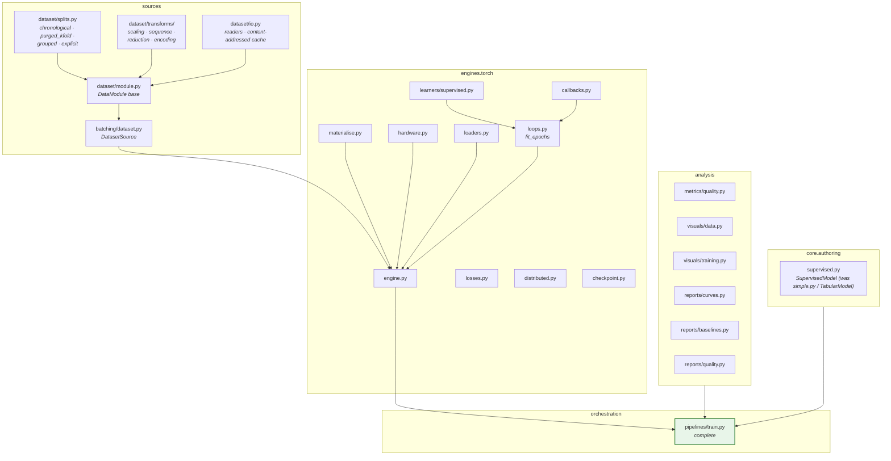

### 2.1 `sources.dataset`

`DataModule` is the base a model's data build subclasses. It declares the
stages the train pipeline drives:

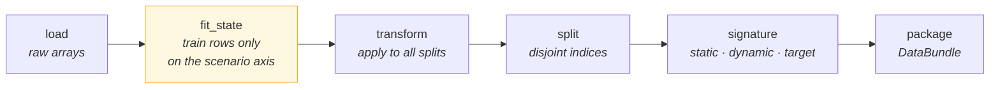

Stage ordering is the point. `fit_state` precedes `transform`, and it receives
train indices only on the scenario axis. A data module cannot accidentally fit
on everything, because it is never handed everything.

`splits.py` implements four strategies, all **sequence-aware**: no window may
straddle a split boundary. Without that gap, a window beginning in train
extends into validation, and the validation score is partly a memory of
training. `rade_ml_pt` had no such gap, so with `seq_length > 1` every split
boundary leaked.

`transforms/reduction.py` takes an explicit `fit_on: train | all`. This is
defect 9: basis selection in `rade_ml_pt` ran on the full scaled history
including validation and test. The default is `train`; `all` exists to
reproduce the old behaviour for Phase 0 parity and for nothing else.

### 2.2 `engines.torch`

The library split described in
[`ARCHITECTURE.md` §6](../ARCHITECTURE.md#6-one-protocol-for-ml-and-rl-batchsource):
the **loop** decides when to step, validate, checkpoint and stop; the
**learner** decides what one update means. Phase 2 delivers `fit_epochs` and
the supervised learner. Phase 7 adds `fit_steps` and four more learners against
an unchanged loop.

| Module | Responsibility |
| --- | --- |
| `engine.py` | The `Engine` implementation: build, materialise, fit, checkpoint, predict |
| `loops.py` | `fit_epochs` — passes over a finite source |
| `learners/supervised.py` | Forward, loss, backward |
| `callbacks.py` | Early stopping, checkpointing, learning-rate schedule, gradient-norm tracking |
| `losses.py` | The loss registry, including asymmetric and quantile objectives |
| `hardware.py` | Device, autocast, precision, `torch.compile` — resolved from `HardwareSpec` |
| `materialise.py` | One dummy forward from the signature, fixing lazy shapes |
| `distributed.py` | Distributed data-parallel setup and teardown |
| `checkpoint.py` | `state_dict` payloads, not pickled modules |
| `loaders.py` | `DataLoader` construction, collation, worker configuration |

### 2.3 `TrainPipeline`, complete

The Phase 1 skeleton's `fit` now works. Full sequence in
[`ARCHITECTURE.md` §5](../ARCHITECTURE.md#5-stage-contracts-and-the-train-pipeline).

### 2.4 `SupervisedModel`

A convenience base supplying a standard data module and split, so a
straightforward model needs no data code at all. This is what makes the
twenty-line model in §1 possible, and it is the mechanism Phase 6's baselines
rely on.

---

## 3. The three key decisions

### 3.1 Static inputs leave per-sample collation

**Defect 4.** `rade_ml_pt`'s `RadeDataset` merges every static tensor into
every sample. `_collate_dict_batch` then runs `torch.equal` across the batch
for each static key and returns `values[0]` — the single unbatched tensor.

So for every batch of every epoch, a graph adjacency matrix is compared against
itself `batch_size` times, to confirm what was true by construction.

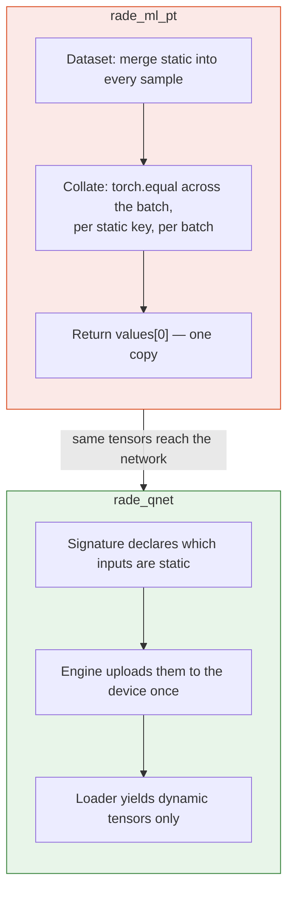

**Why this is safe, not a behavioural change:** the old collation already
returned one copy. The network already received exactly one. Moving static
tensors into `TensorBatchData.static` delivers the same object to the same
place and deletes the comparison. Phase 0 parity level 2 confirms the batch
contents are unchanged.

### 3.2 Materialise before wrapping

**Defect 6.** A model with lazily-shaped parameters has no parameters until it
has seen one batch. `rade_ml_pt` wrapped the model for distributed training
before that point, which gives the distributed wrapper an empty parameter group
to synchronise — either a crash deep inside the library or, worse, silent
non-synchronisation.

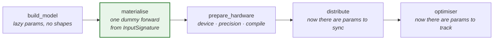

`materialise` is a pipeline stage rather than a helper called from inside the
engine, so the ordering is visible in the pipeline definition and cannot be
reordered by accident. This is also why `InputSignature` exists: the dummy
forward needs exact shapes and dtypes with no data present.

### 3.3 Split and shuffle are different decisions

**Defect 3.** One `shuffle` flag drove both the scenario split and the batch
order. `shuffle=True` — the natural choice for training throughput — produced a
*random* split of a time series. An example script in the repository does
exactly this.

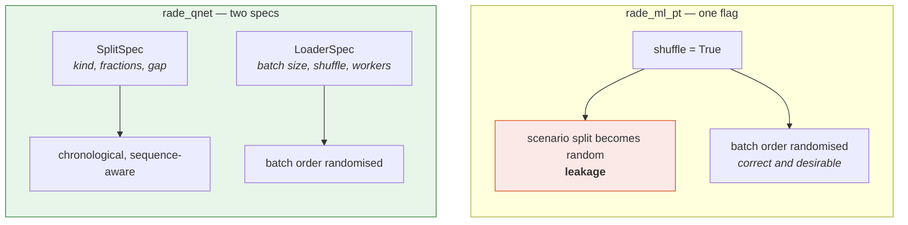

A dedicated test asserts that changing `loader.shuffle` leaves split indices
bit-identical. The two concerns cannot be re-entangled without that test
failing.

---

## 4. How this links to the rest of the framework

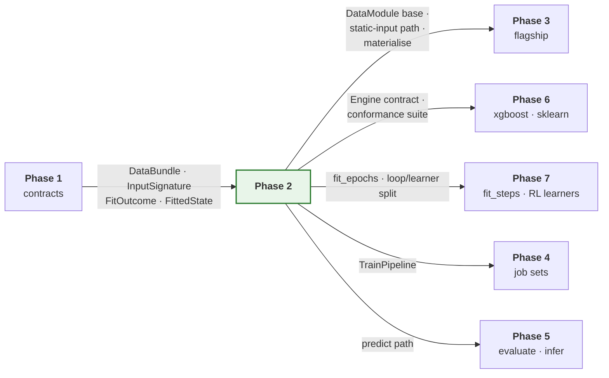

Phase 3 is the demanding consumer: it needs the `DataModule` stages to
accommodate a six-stage build, the static-input path to carry a sparse graph,
and materialisation to work on a model whose shapes depend on the data. Those
three requirements should be checked against the flagship's actual build
(documented in the Phase 3 document) *before* this phase is signed off.

The loop/learner split is what makes Phase 7 cheap. If training logic and
update logic are tangled here, every reinforcement-learning algorithm becomes a
new training script.

---

## 5. Tests

Modules listed in the `__init__.py` of `tests/rade_qnet/sources/dataset/`,
`tests/rade_qnet/sources/batching/` and `tests/rade_qnet/engines/torch/`. The ones
that matter most:

### Splits — the highest-value tests in the suite

These guard defects that do not announce themselves. A leaky split produces an
encouraging validation score and a model that fails in production.

| Test | Asserts |
| --- | --- |
| `test_splits_are_disjoint_and_cover_the_axis` | No index in two splits; none lost except declared gaps |
| `test_chronological_order_is_respected` | Every train index precedes every validation index |
| `test_no_window_straddles_a_boundary` | With `seq_length=20`, no window spans a split edge |
| `test_shuffle_does_not_change_split_indices` | Defect 3, asserted directly |
| `test_basis_fit_on_train_ignores_held_out_rows` | Defect 9: selection with and without held-out rows present gives the same basis under `fit_on=train` |
| `test_inverse_transform_recovers_the_target` | Round-trip to floating-point tolerance |

### Engine

| Test | Asserts |
| --- | --- |
| `test_lazy_params_materialise_before_optimiser` | Parameter count is non-zero before the optimiser is constructed — defect 6 |
| `test_static_inputs_are_not_collated_per_sample` | The loader's output contains no static key — defect 4 |
| `test_early_stopping_fires_at_the_right_epoch` | Against a synthetic loss sequence with a known minimum |
| `test_best_checkpoint_is_the_one_restored` | Not the last |
| `test_checkpoint_round_trips_as_state_dict` | Loads with `weights_only=True` — defect 10 |
| `test_losses_match_hand_computed_values` | Each loss against arithmetic done by hand |
| `test_determinism_strict_reproduces_a_run` | Two runs, identical weights |
| `test_hardware_falls_back_when_device_absent` | Requesting an absent device warns and degrades; it does not crash |

### End to end

| Test | Asserts |
| --- | --- |
| `test_simple_model_trains_and_produces_a_bundle` | The phase milestone, as one test |
| `test_bundle_reloads_and_predicts_identically` | Same inputs, same outputs after a reload |
| `test_metrics_are_in_original_target_units` | A model with a scaled target reports metrics on the original scale |

Distributed tests are marked and skipped when fewer than two devices are
present — visible as skipped, never silently omitted.

---

## 6. Definition of done

Beyond the universal criteria in
[`IMPLEMENTATION.md` §5](../IMPLEMENTATION.md#5-definition-of-done--every-phase):

- [x] All modules in §2 exist with contract-stating docstrings.
- [x] A simple supervised model trains end to end from a specification and
      produces a bundle, metrics and reports.
- [x] Its bundle reloads and predicts identically —
      `test_a_reloaded_bundle_predicts_identically`, which reopens the bundle
      from disk and rebuilds the model from the saved signature. It asserts the
      *unloaded* model predicts differently first, so it cannot pass on a
      weights file that was never read.
- [x] Metrics are reported in original target units, verified with a scaled
      target — `test_a_scaled_target_gives_the_same_errors_as_an_unscaled_one`.
      It compares `mae` and `rmse` rather than `r2`, because `r2` is
      scale-invariant and would be 1.0 whether or not the inversion happened.
- [x] All four split strategies implemented, sequence-aware, with the
      boundary-gap test passing.
- [x] `loader.shuffle` provably does not affect split indices — defect 3.
- [x] `basis.fit_on` defaults to `train`, with both paths tested — defect 9.
- [x] Static inputs absent from loader output; uploaded to the device once,
      asserted by tensor identity across batches — defect 4.
- [x] Lazy parameters materialised before the optimiser and before any
      distributed wrapper — defect 6, both halves.
- [x] Checkpoints are `state_dict` payloads loadable with `weights_only=True`,
      and a pickled payload is refused — defect 10.
- [x] `determinism: strict` reproduces a run bit for bit —
      `TestReproducibility` in the engine tests. This required adding
      `engines/torch/seeding.py`: `seed_everything` had been leaving Torch
      unseeded. See §8.3.
- [x] Every loss tested against a hand-computed value.
- [x] Engine satisfies the Phase 1 conformance suite.
- [x] The flagship's build requirements (Phase 3 §2) are reviewed against the
      `DataModule` stages — see §9. One mismatch was found and fixed.
- [x] `examples/rade_qnet/phase2_train_simple_model.py` trains a model from a
      CSV and prints the bundle path and test metrics.
- [ ] **Distributed tests marked and skipped, not omitted.** Partially met,
      and recorded honestly rather than ticked. The single-process paths are
      covered — the refusal to wrap an unmaterialised model, the rank and
      world-size readers, the wrapping and unwrapping — but there is no
      skip-marked test that actually spawns a second process. What is tested
      is every decision the framework makes; what is not is that the
      collective itself works. Deferred to Phase 4, which is the first phase
      with a reason to launch more than one process.

---

## 7. Risks

| Risk | Why it matters | Mitigation |
| --- | --- | --- |
| `DataModule` stages do not fit the flagship's six-stage build | Phase 3 reshapes the base, invalidating Phase 2's tests | Explicit sign-off item above; walk the flagship build before closing the phase |
| The loop acquires learner-specific logic | Phase 7 becomes four training scripts instead of four learners | Review rule: nothing in `loops.py` may name an algorithm |
| `torch.compile` or autocast breaks parity | Phase 3 parity fails for a reason unrelated to the refactor | Both off by default; parity runs with them off; enabling them is a separate measured change |
| Sequence-aware splitting is subtly wrong at edges | Silent leakage, which is the exact class of defect this phase exists to fix | Test the boundary cases explicitly: first window, last window, window longer than a split |
| Early stopping restores the wrong checkpoint | Reported metrics belong to a different model than the saved one | `test_best_checkpoint_is_the_one_restored`, with a loss sequence whose minimum is not last |

---

## 8. Deviations

Every row here is a difference between what §2 planned and what was built. The
table is the record, so a reader of the plan is never misled by it.

### 8.1 Scope moved between phases

| Deviation | Reason |
| --- | --- |
| `engines/base.py` delivered in Phase 2 rather than Phase 1 | The `Engine` protocol, `ModelHandle` and `EngineCapabilities` cannot be designed without a concrete engine to design them against. Written in Phase 1 they would have encoded guesses, and the first real engine would have changed all three. |
| `EngineError` added to `core.lifecycle.errors` | Engine faults are neither specification faults nor contract faults, and reporting them as either made the messages misleading about where to look. |
| `transforms/composite.py` added as a fifth transforms module | §2.1 listed four. A bundle carries *one* fitted state, so something has to compose the parts and own the question of which one inverts the target; leaving that to each caller is how two callers come to disagree. |
| `predict_in_batches` deliberately omitted from the `Engine` protocol | It is an implementation detail of how an engine walks a source, not part of the contract a pipeline depends on. In the protocol it would have forced every backend to expose a method only one of them needs. |

### 8.2 Corrections to the plan

| Deviation | Reason |
| --- | --- |
| §2.1 stage order corrected: `split` runs before `fit_state` | As written, the scaler would have been fitted over the whole history including the test period. The leak is invisible in the output -- metrics come out slightly too good in a way indistinguishable from a slightly better model. |
| §2.4 corrected: `SupervisedModel.data_module` is an abstract hook | It cannot default to the built-in tabular module, because `core` has an empty dependency set and cannot import `sources`. A default would invert the one-way dependency stack the architecture rests on. The cost is one line per subclass. |
| The chronological split's boundary gap is taken from the earlier split's tail | Taking it from the later split's head would discard the most recent scenarios of the training period, which are the most informative ones for a forecast. |
| `TorchEngine.fit` accepts `on_epoch_end` but does not forward it | The epoch loop already drives the callbacks it was given. A second notification path would let a hook and a callback observe the same epoch in an undefined order. Wired properly when hooks gain a reason to need it. |

### 8.3 Additions the plan did not anticipate

| Deviation | Reason |
| --- | --- |
| `OrderedSource` capability protocol, plus `DatasetSource.ordered()` | Scoring makes two passes over a split -- one for predictions, one for targets -- and pairs them row for row. A reshuffling training source gives two different orders, so a correctly trained model reported a negative r-squared on its own training split while every metric computed cleanly. Added as a separate protocol rather than a member of `BatchSource`, because a new required member would have dropped every structural implementer out of `isinstance`. |
| `DataLineage.quality` and `DataLineage.split_sizes` | The quality metrics have to be recorded at training time or lost: afterwards the dataset may not be reconstructable. They could not be computed in `sources`, which cannot import `analysis`, so the lineage carries them and the pipeline fills them in. |
| `TARGET_KEY` promoted into `core.contract.data` | It was defined independently in `sources.batching` and `engines.torch`. Two definitions of the key a batch holds its target under is one typo away from a silent misalignment. |
| `TorchEngine` substitutes `train_loss` for a `val*` monitor when a run has no validation split | `fit` warned that it would proceed without validation and then raised from the checkpoint, whose default monitor is `val_loss`. The warning and the behaviour contradicted each other. |
| `fit_epochs` refuses a non-finite training loss at the epoch it occurs | Once the loss is NaN the parameters are too, and no later epoch recovers. Left to finish its budget the run failed two stages later in scoring, with a message about non-finite predictions that pointed at the metrics rather than at the divergence. |
| `engines/torch/seeding.py` registers a Torch seeder | `seed_everything` seeded Python and NumPy and left Torch untouched, so two runs of one configuration differed in every weight initialisation while both reported the same seed. This is what makes `determinism: strict` mean anything for a Torch run. |
| `DataModule.signature` gained a keyword-only `state` | Found by the §9 flagship review, and a Phase 3 blocker. The flagship's signature stage must declare fitted static inputs and post-reduction index arrays, neither of which is derivable from the feature matrix. Without the state it would have had to stash it on `self` during `fit_state`, making the module stateful across stages -- a second build on one instance would reuse the first build's state. |
| `distributed.py` reads `WORLD_SIZE` and `LOCAL_RANK` through a defensive `_read_count` | These are set by the launcher, not by the framework, so a malformed value is a stray shell export rather than a bug in the job. `int()` on it crashed the run before the first batch, which pointed at the framework. |
| The closing line of `fit_epochs` reports a one-based best epoch | `EpochRecord.epoch` is zero-based and every per-epoch line was logged one-based, so one log read `epoch 1/3` and `best ... at epoch 0`. That reads as an off-by-one in the training rather than in the numbering. |
| `_select_basis` ravels its target before ranking columns | With a column-vector target the dot product is two-dimensional, so `argsort` sorted along a length-one axis and returned the columns unranked -- a basis that looked fitted and was in input order. Production passed a flat target, so the live path was correct; fixed defensively. |
| Empty-split guards in `split_chronologically` and `split_by_group` | A fraction that rounds to zero produced an empty split, and an epoch over an empty split completes instantly having trained on nothing. |
| `DatasetSource.__iter__` and `DataModule.batch_sources` | One object is both the source and the loader, so the pipeline never carries a parallel source map that could drift from the data bundle. |
| `TrainPipeline` runs eleven stages, not the seven §2.3 listed | `resolve`, `materialise`, `prepare_hardware` and `report` each carry meaning a caller can act on: resolution fails in milliseconds on an impossible combination, and materialisation has to precede both the optimiser and any wrapper. |
| `make_run_context` gained `catalog` and `job_id`; `make_signature` gained `dtype` | The first two are needed to test versioning and job-scoped output. The third is needed because the fixture was hardcoded to float64 while Torch parameters are float32, so the dummy forward pass failed on a dtype mismatch. |

---

## 9. Flagship readiness review

The Definition of Done requires the flagship's build requirements
([`PHASE_3_HYBRID_GNN_RNN.md` §2](PHASE_3_HYBRID_GNN_RNN.md#2-the-data-build-mapped-stage-by-stage))
to be checked against the `DataModule` stages as delivered, *before* Phase 3
starts. The point of doing it here is that a mismatch is cheap to fix while
the stage contract is still new and expensive to fix once a second module
depends on it. The review found one.

### 9.1 The mapping, confirmed

| Flagship stage (Phase 3 §2.2) | Delivered hook | Fits |
| --- | --- | --- |
| `load` — portfolio P&L, attributes, universe | `DataModule.load` | Yes |
| scalers, scenario axis, train rows only | `fit_state`, which receives `train_indices` | Yes |
| basis selection, scenario axis, `fit_on` flag | `fit_state` + `ReductionSpec.fit_on` | Yes |
| attribute encoder, entity axis, full universe | `fit_state` — no parameter restricts the entity axis | Yes, structurally |
| kNN graph, entity axis, full universe | `fit_state` | Yes, structurally |
| apply scalers and basis, build windows | `transform` | Yes |
| chronological, sequence-aware split | `split` + `SequenceSpec`, boundary gap from the earlier split's tail | Yes |
| `signature` — fitted static inputs, post-reduction indices | `signature` | **No — see §9.2** |
| `package` — `DataBundle[TensorBatchData]` | `batch_sources`, documented as the override point for several dynamic inputs or an entity axis | Yes |
| entity identity carried through the build | `n_entities`, `entity_ids` | Yes |
| static inputs delivered once, not per sample | `TensorBatchData.static` + `StaticInputs.from_source` | Yes, and this is defect 4 |

The entity-axis rows are the ones worth being precise about. They fit
*structurally* rather than by permission: `fit_state` has no parameter that
could restrict a fit to training entities, so fitting an encoder across the
full universe is not something the module is allowed to do, it is the only
thing it can do. That is deliberate — Phase 3 §2.4 explains why the entity
axis is not a leak — and it means the distinction cannot regress into a
conformance rule that falsely fails the flagship.

### 9.2 The one mismatch, and the fix

`signature` was delivered as `signature(spec, *, features)`. The flagship's
signature stage has to declare:

- `trade_features` — the **encoder's output**, whose width is whatever the
  fitted encoder produced;
- `adjacency_indices`, `adjacency_values`, `adjacency_dense_shape` — the
  **fitted graph**;
- `target_indices` — computed **after** basis selection, from the selected
  basis.

None of these is derivable from the transformed feature matrix. Every one of
them lives in the fitted state.

The workaround available without a change would have been for
`HybridDataModule` to stash the state on `self` during `fit_state` and read it
back in `signature`. That is worse than it looks. It makes the module stateful
across stages, so a second `build` on one instance silently reuses the first
build's state, and a cached dataset declares a signature fitted to data it was
not built from. Both failures produce a signature of the right shape with the
wrong content, which is the hardest kind to notice.

`signature` therefore now takes a keyword-only `state`, exactly as
`feature_names` already did and for the same reason: fitting changes what the
interface *is*. `TabularDataModule` discards it, and
`test_the_signature_stage_receives_the_fitted_state` asserts the stage is
handed the identical state object the dataset was built with, so the contract
Phase 3 depends on cannot quietly regress before Phase 3 arrives.

### 9.3 Deferred by design, not overlooked

Three flagship needs are *not* satisfied yet, and should not be:

- **`domains.pnl` readers.** Phase 3 §2.2 routes `load` through them. They do
  not exist; Phase 3 builds them, with a direct reader until then. Nothing in
  Phase 2 is blocked. (Superseded: the `domains` layer was later removed;
  see Phase 4 §8.9.)
- **Parity harness.** Phase 3's levels 1 to 3 compare against `rade_ml_pt`
  and need the Phase 0 captures. Phase 2 deliberately does not pre-empt them.
- **`elementary_indices` omitted from the signature.** Phase 3 §2.3 records
  that the old model declares it and never reads it. The decision to omit it
  belongs with the parity run that confirms the forward pass is unaffected.
````

---

## 4. `src/rade_qnet/docs/phases/PHASE_3_HYBRID_GNN_RNN.md`

25823 bytes · SHA-256 `5c38c8ee1e87f928`

````markdown
# Phase 3 — Flagship

**Refactor the hybrid graph-temporal network into the framework as a single
member, and prove it produces identical results.**

| | |
| --- | --- |
| **Depends on** | Phase 2 (engine and pipeline). The baseline capture specified in [`PHASE_0_BASELINE.md`](PHASE_0_BASELINE.md) is the first half of this merged phase, not a prior one |
| **Blocks** | Phases 4 and 5 |
| **Delivers** | `models/hybrid_gnn_rnn/*`, parity levels 1–4 green |
| **Explicitly out of scope** | Fan-out, parallelism, evaluate/infer/tune overrides |

---

## 1. Purpose

This is the phase that validates the architecture. Everything before it is
infrastructure justified by an argument; this is the argument being tested.

The flagship exercises almost every hard requirement at once: static inputs
constant across batches, lazy parameter shapes known only after the data build,
fitted state well beyond model weights, two fitting axes with different leakage
rules, and an expensive encoding worth precomputing. If the framework hosts
this cleanly, it will host most things. If it does not, the right response is
to fix the framework — not to add a special case to the model.

**One model, no fan-out.** Phase 4 adds fan-out to an already-verified model.
Doing both at once means debugging a new model and a new execution layer
simultaneously with no way to attribute a failure.

The deliverable is not "it trains". It is **parity levels 1–4 green** against
the Phase 0 fixture.

---

## 2. The data build, mapped stage by stage

This is the heart of the phase, and the question it answers is the one raised
when the architecture was agreed: *can `rade_ml_pt`'s data build be refactored
into this architecture and produce the same input dataset?*

### 2.1 What `rade_ml_pt` does

`src/rade_ml_pt/data/hybrid_gnn_rnn/build.py::build_dataset`, in order:

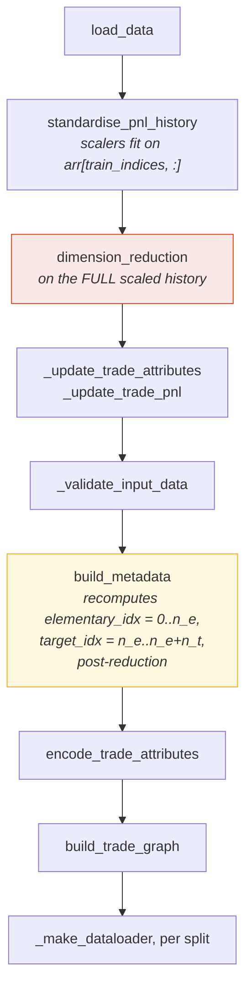

Two stages are flagged, and both are traps for a refactor.

**`dimension_reduction` (red)** runs on the full scaled history — validation
and test rows included. This is defect 9, selection leakage. Parity must
reproduce it; the default must not.

**`build_metadata` (amber)** *recomputes* the index arrays **after** reduction,
as `0..n_e` and `n_e..n_e+n_t`. Any refactor that carries pre-reduction indices
forward produces plausible arrays that are wrong in every downstream stage.

Its static inputs, as produced today:

```python
static_inputs = {
    "trade_features": encoder_results["combined_features"],
    "adjacency_indices": graph_result["sparse_indices"],
    "adjacency_values": graph_result["sparse_values"],
    "adjacency_dense_shape": np.array(graph_result["sparse_shape"], dtype=np.int64),
    "elementary_indices": metadata["elementary_idx"],
    "target_indices": metadata["target_idx"],
}
```

### 2.2 The mapping

| `rade_ml_pt` | `rade_qnet` | Axis | Fits on | Notes |
| --- | --- | --- | --- | --- |
| `load_data` | `HybridDataModule.load` | — | — | Reads the group directory directly; the `domains.pnl` route was dropped (Phase 4 §8.9) |
| `standardise_pnl_history` | `transforms.scaling`, in `fit_state` | Scenario | **Train rows only** | Already correct in `rade_ml_pt`; preserved |
| `dimension_reduction` | `transforms.reduction`, in `fit_state` | Scenario | `fit_on` flag | Parity: `all`. Default: `train`. Defect 9 |
| `_update_trade_attributes`, `_update_trade_pnl` | `transform` | — | — | Applies the reduced basis to attributes and history |
| `_validate_input_data` | Spec validation + `ContractError` | — | — | Moves earlier: most of it is now a spec constraint |
| `build_metadata` | `signature` | — | — | **Post-reduction indices.** See §2.3 |
| `encode_trade_attributes` | `features/encoder.py`, in `fit_state` | **Entity** | **Full universe** | Not leakage — see §2.4 |
| `build_trade_graph` | `features/graph.py`, in `fit_state` | **Entity** | **Full universe** | Not leakage — see §2.4 |
| `_make_dataloader` per split | `loaders.py` + `DatasetSource` | — | — | Static inputs now in `TensorBatchData.static` |

Mapped onto the framework's stages:

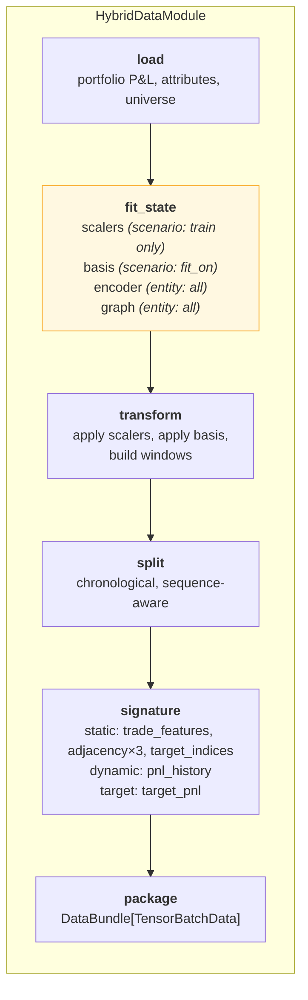

### 2.3 Three traps, stated explicitly

**Index arrays are post-reduction.** `build_metadata` recomputes
`elementary_idx` and `target_idx` after the basis is selected. The refactored
`signature` stage must do the same, and the code must carry a comment saying
so. Phase 0 captures these arrays post-reduction for exactly this reason.

**Basis order is part of the state.** Basis selection returns an *ordered*
list, and that order sets column positions in every array downstream. A
refactor selecting the same instruments in a different order passes a set
comparison and fails everything after it. `HybridState.selected_basis` is a
sequence, never a set, and parity level 1 compares it as such.

**`elementary_indices` is declared but never read.** The old model's
`_REQUIRED_KEYS` lists seven keys; the forward pass never consumes
`elementary_indices`. The new `InputSignature` should omit it. Parity level 3
confirms the forward pass is unaffected — and if it is affected, the finding is
that the old model had a latent dependency, which is worth knowing either way.

### 2.4 Why entity-axis fitting is not leakage

The attribute encoder and the nearest-neighbour graph are fitted across the
**whole instrument universe**, including instruments whose P&L appears only in
the test split. This is correct, and it is worth being precise about, because
the obvious conformance rule would reject it.

Which instruments exist, and what their attributes are — currency pair, tenor,
product type — is known before any P&L is observed. Restricting the graph to
training-period instruments would not remove information a trader lacks; it
would discard information they have.

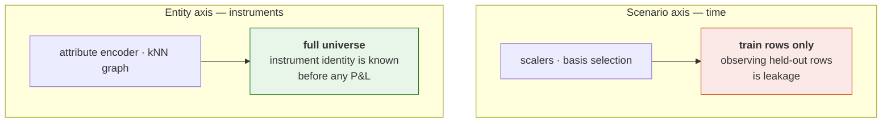

A conformance rule reading "fitted transforms may only see training indices"
would be wrong and would falsely fail this model. The Phase 1 suite
distinguishes the axes, and
`test_entity_axis_fitting_is_not_flagged` exists specifically to keep that
distinction from regressing.

---

## 3. What is built

```text
models/hybrid_gnn_rnn/
├── model.py              HybridGnnRnn — architecture only
├── layers/
│   ├── gnn.py            sparse neighbourhood attention
│   ├── rnn.py            P&L history encoding
│   ├── fusion.py         combine cross-sectional and temporal
│   ├── attention.py      target attention over elementary instruments
│   └── output.py         projection to replicated P&L
├── register.py           @model declaration: spec, data, state, pipelines
├── spec.py               HybridModelSpec, HybridDataSpec
├── state.py              HybridState(FittedState)
├── data.py               HybridDataModule
├── features/
│   ├── encoder.py        entity attribute encoding
│   └── graph.py          sparse graph construction
├── pipelines/train.py    adds graph and attention reports
├── reports.py            graph structure, per-target replication quality
└── visuals.py            attention weights, neighbourhood profiles
```

### `HybridState` — twenty-odd files become one object

The old implementation's `_save_training_artifacts` writes roughly twenty
sidecar files whose relationship to each other exists only in the loading code.
They collapse into:

```python
@dataclass
class HybridState(FittedState):
    """Everything the hybrid network fits at training time."""

    target_scalers: ScalerState        # scenario axis, train rows only
    selected_basis: Sequence[str]      # ordered — order is load-bearing
    entity_encoder: EncoderState       # entity axis, full universe
    graph: SparseGraphState            # entity axis, full universe
    universe: Universe                 # elementary and target identifiers

    def inverse_transform_targets(self, predictions: NDArray) -> NDArray:
        """Return predictions to original P&L units."""
```

One typed object that knows how to save itself, load itself, and return a
prediction to original units. `inverse_transform_targets` is inherited as
abstract from `FittedState`, so metrics in standardised space are structurally
impossible rather than merely discouraged.

### `model.py` and `register.py`

`model.py` holds the network and nothing else — it should read as a piece of
mathematics. `register.py` holds the wiring. See
[`ARCHITECTURE.md` §11](../ARCHITECTURE.md#11-writing-a-model) for both.

The old model's `_gnn_cache` and `_get_adjacency` are removed. Caching an
encoding of the static inputs inside the module is replaced by the
`Precomputable` capability: the model declares `precompute(static)`, and the
framework calls it once per evaluation pass. Model-held mutable cache state is
how two jobs sharing a process interfere with each other.

### `pipelines/train.py`

A **tier 2** override: it adds reports and nothing else. The framework's
training sequence is used unchanged. If this file needs to replace a step, that
is a finding about Phase 2 and should be raised rather than absorbed.

---

## 4. How this links to the rest of the framework

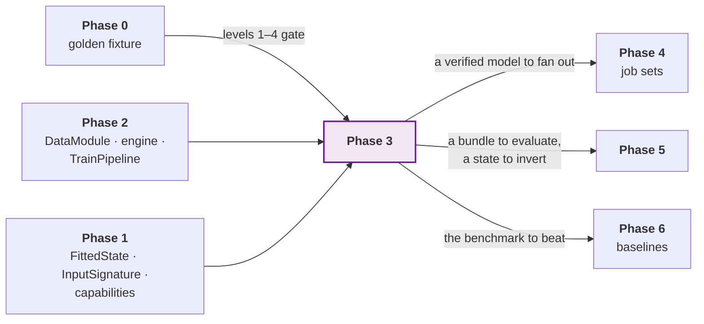

This phase is also the framework's first real **feedback** signal. Three
specific things to watch, because each is a verdict on an earlier decision:

| If this happens | It means | Do this |
| --- | --- | --- |
| `pipelines/train.py` has to override a step, not just add reports | The Phase 2 sequence is too coarse | Fix Phase 2's step granularity |
| `HybridState` needs a field that does not fit `FittedState` | The Phase 1 contract is too narrow | Widen the contract, not the model |
| A capability has to be added to make the model work | Phase 1's capability set was incomplete | Add it as a protocol, and check no existing model is affected |

Absorbing any of these into the model is how a framework becomes a framework
with one special case in it.

---

## 5. Tests

Model-specific suites were deferred while the framework was proven
model-independently. They arrive here, under
`tests/rade_qnet/models/hybrid_gnn_rnn/`, mirroring the source layout. The
mirroring rule in `test_scaffold.py` is extended to cover them in this phase.

### Layers — in isolation

Each block tested alone: known input shape in, asserted output shape, gradient
flow, and the invariances the block should have. Testing an architecture only
end to end makes every shape bug a bisection exercise.

| Test | Asserts |
| --- | --- |
| `test_gnn_attends_only_along_edges` | A node with no edges is unaffected by distant nodes |
| `test_gnn_cost_scales_with_edges` | Sparse, not dense — operation count against edge count |
| `test_rnn_output_shape_and_gradient` | Fixed-width summary; gradient reaches the first timestep |
| `test_fusion_is_permutation_sensitive` | Swapping the two inputs changes the output (they are not interchangeable) |
| `test_attention_weights_sum_to_one` | Per target, across elementary instruments |
| `test_output_projection_shape` | Matches the declared target spec |

### Parity — the phase gate

All four are green. The test names below are the ones delivered; they sit with
the code they cover rather than in one parity module, because a failure should
point at the stage that produced it.

| Level | Test | Tolerance |
| :---: | --- | --- |
| 1 | `test_data.py::TestParityAgainstTheBaseline::test_the_fitted_state_matches` | Exact — scalers, basis **with order**, features, graph, universe. Except `adjacency_values`, see §8.4 |
| 2 | `test_parity.py::TestLevel2Tensors` | Exact — per split, batch contents and window counts |
| 3 | `test_model.py::TestParityAgainstTheBaseline::test_the_forward_output_matches` | `torch.equal` — the old `state_dict` loaded into the new model. Tighter than the `atol=1e-6` planned here, and it held |
| 4 | `test_parity.py::TestLevel4TrainingCurve::test_the_loss_curve_matches` | `rtol=1e-3` — five epochs, fixed seed |

Levels 1–2 run with compatibility flags on, enumerated in §8.3, plus
`split.kind=explicit` with the fixture's captured indices. The flags are set in
the test, explicitly and with a comment, not in a configuration default.

### Behaviour

| Test | Asserts |
| --- | --- |
| `test_state_round_trips` | `HybridState` save and load returns an equal object |
| `test_inverse_transform_recovers_pnl_units` | Round-trip to floating-point tolerance |
| `test_precompute_matches_plain_path` | `Precomputable` gives identical results, just faster |
| `test_no_model_held_mutable_cache` | Two models in one process do not interfere |
| `test_conformance_suite_passes` | The full Phase 1 suite |
| `test_elementary_indices_is_absent_from_signature` | The unused key is genuinely unused |

---

## 6. Definition of done

Beyond the universal criteria in
[`IMPLEMENTATION.md` §5](../IMPLEMENTATION.md#5-definition-of-done--every-phase):

- [x] All modules in §3 exist; `model.py` contains architecture only.
- [x] **Parity levels 1–4 green** against the Phase 0 fixture.
- [x] Level 1 compares `selected_basis` as an ordered sequence, and a
      reordering fails.
- [x] Index arrays computed post-reduction, with a comment stating why.
- [x] Compatibility flags used only in parity tests, never as defaults.
      Enumerated in §8.3.
- [x] `HybridState` replaces every sidecar artifact; the old file list is
      enumerated in a comment and each item accounted for.
- [x] `inverse_transform_targets` implemented and round-trip tested.
- [x] `_gnn_cache` and `_get_adjacency` gone; `Precomputable` used instead.
- [x] No model-held mutable state — two instances in one process are
      independent.
- [x] `elementary_indices` absent from the signature, with parity confirming.
      Asserted in `test_data.py` and again at parity level 2, where the key is
      listed as permitted-missing rather than silently skipped.
- [x] Every layer tested in isolation.
- [x] Full conformance suite passes, including entity-axis fitting not being
      flagged.
- [x] `pipelines/train.py` is a tier 2 override (reports only). No step is
      overridden, and `test_the_stage_sequence_is_untouched` asserts it.
- [x] `tests/rade_qnet/models/hybrid_gnn_rnn/` mirrors the source layout, and
      `test_scaffold.py`'s mirroring rule is extended to cover it via
      `DELIVERED_TEST_SUBTREES`.
- [x] `examples/rade_qnet/phase3_train_hybrid_single_member.py` trains one member
      and prints metrics, bundle path and parity status.
- [x] Baseline features deliberately not ported are recorded in §8.1, and the
      defect found during the port in §8.2.

---

## 7. Risks

| Risk | Why it matters | Mitigation |
| --- | --- | --- |
| Parity level 1 or 2 fails on a detail like basis order | Days lost to a one-line cause | `compare_arrays` reports the worst element by name and index; check order first, it is the most likely cause |
| Parity level 4 is flaky | A gate that fails sometimes gets disabled | Fix the seed, set `determinism: strict`, keep `rtol=1e-3`; if still flaky, reduce to three epochs rather than loosening the tolerance |
| The framework needs a change to host the model | Real risk — it is what this phase is for | Change the framework. Raise it, fix the earlier phase, re-run its tests. Do not add a special case |
| The model is reshaped to fit the framework | Parity fails and the cause is ambiguous | The architecture is fixed by the fixture. Only *structure* moves in this phase, never mathematics |
| Scope creep into evaluate/infer/tune | Phase 3 never closes | They are Phase 5. A bundle that trains and matches parity is the whole deliverable |
| `Precomputable` changes numerical results | A performance feature corrupts correctness | `test_precompute_matches_plain_path` asserts identity, not approximation |

The third row is the one to be disciplined about. This phase exists to test the
architecture. A framework change here is the phase *succeeding*, and it is much
cheaper than the same change after Phases 4–7 are built on top.

---

## 8. Deviations

### 8.1 Baseline features deliberately not ported

Each of these exists in `rade_ml_pt` and is absent from `rade_qnet`. None is
reachable from the Phase 0 fixture, so none affects parity — but a reader
comparing the two trees will notice them, and "we forgot" and "we decided"
need to be distinguishable.

| Not ported | Reason |
| --- | --- |
| `GraphormerLayer` | Its `invalidate_cache` method *is* defect 5 — a model holding mutable state that has to be manually invalidated when the graph changes. Porting it means porting the defect; replacing it means designing a new layer, which is architecture work and not a refactor. Unreachable from any configuration the fixture uses. The `Precomputable` capability is the intended replacement for what the cache was for, and a Graphormer variant can be added on top of it later as an ordinary model change |
| RNN cell types `tcn` and `dense` | The `rnn_type` setting accepts `lstm`, `gru`, `tcn` and `dense` in the baseline. Only `lstm` and `gru` are ported. The other two are not recurrent at all — a temporal convolution and a flattened feed-forward layer behind a recurrent name — so they belong in the catalogue as their own models rather than as cases of this one. Neither is used by any captured configuration |
| Attention-conditioned scale and bias on the output head for unseen targets | The baseline optionally conditions the projection's scale and bias on the attention output for targets absent at fit time. The code path is dead in every captured configuration, the behaviour is untested upstream, and the neighbour-blend path that *is* ported (`new_target_blend`) covers the same case with a mechanism that can be reasoned about. Ported as a gap rather than as code, because porting an untested path produces an untested path |

### 8.2 Defect 11, found during the port

Not one of the ten in `ARCHITECTURE.md` §13, because it was found here.

The baseline's configuration names the setting `use_baseline_norm`; the layer
reads `use_baseline_weight_norm`. The config loader applies settings with a
`setattr` over everything it was given, so the mismatch does not raise — the
layer simply never sees the flag and silently keeps its default. The feature
has therefore never been switched on by configuration, which is why nothing
noticed.

The mechanism matters more than this instance: a loader that `setattr`s
whatever it is handed turns **every** typo in **every** configuration into a
silently ignored setting. `rade_qnet` validates specifications with Pydantic
models that reject unknown fields, so the same typo is a startup error naming
the field.

The feature itself is ported as `HybridModelSpec.baseline_weight_norm`,
defaulting to `False` — which is the behaviour every existing run actually
had, as opposed to the behaviour its configuration appeared to request.

### 8.3 Compatibility flags the parity replay sets

Every flag defaults to the *correct* behaviour, so forgetting one is the safe
failure. Each is set explicitly in the parity test with a comment, and nowhere
else.

| Flag | Replay value | Default | What it reproduces |
| --- | --- | --- | --- |
| `transforms.reduction.fit_on` | `all` | `train` | Defect 9: basis selection fitted on the full scaled history |
| `transforms.sequence.confine_to_split` | `True` | `False` | The baseline confined each window to its split, dropping the first `length - 1` labels. The framework instead assigns a window to the split of its final row and relies on the boundary gap, which keeps every label |
| `encoder.numeric_precision` | `float32` | `float32` | Attribute encoding precision |
| `graph.precision` | `float32` | `float32` | Neighbour-search precision |

The second is worth expanding, because it is a design difference rather than a
defect. Gap-based windowing and confinement are two correct answers to the same
question and they cost the same number of scenarios: the gap discards rows at
the boundary, confinement discards the labels whose windows would reach across
it. The framework's choice is the gap, because it is already enforced
structurally by `ChronologicalSplitSpec.gap_scenarios` and verified by
`windows_stay_within`. Confinement is offered so the baseline can be replayed,
not as an alternative to configure.

Note that `windows_stay_within` must call `usable_labels(..., confine=False)`
explicitly. Confining first and then checking that no window crosses a boundary
is tautological — confinement is *defined* as removing the windows that would.

### 8.4 Tolerance on graph edge weights

`ADJACENCY_VALUE_ATOL = 1e-7`, applied at parity levels 1 and 2 to
`adjacency_values` and to nothing else.

scikit-learn's float32 nearest-neighbour kernel (`ArgKmin32`) computes squared
distances with the expanded form `‖a‖² + ‖b‖² − 2a·b`, which cancels
catastrophically when the two points are close. The result is a one-ULP
difference in a handful of edge weights depending on the kernel's blocking,
which is not something the port can or should eliminate. Everything else at
levels 1 and 2 is compared exactly.

### 8.5 The Phase 0 fixture was re-captured for level 4

The original level-4 capture did not reproduce. Two causes, both in the
*capture* rather than in the port:

1. **Dropout.** The curve depended on the order in which the RNG was consumed
   by dropout masks, which no port can reproduce unless it draws from the same
   generator in the same order — a far stronger requirement than architectural
   equivalence, and not one worth designing for.
2. **Lazy parameters (defect 6).** A lazily shaped layer draws its initial
   values at its first forward pass, which is *after* the optimiser was built
   and at a different point in the RNG sequence than an eagerly shaped one.

The fixture is now captured with dropout zeroed and with the initial weights
loaded from the level-3 `state_dict` before the optimiser is constructed, and
the replay matches. The level-3 weights were verified unchanged by the
re-capture, so levels 1–3 are unaffected.

What this costs is honest: level 4 no longer tests the dropout implementation.
What it buys is a gate that fails only when the optimisation differs, rather
than one that fails whenever an RNG draw moves — which is the behaviour that
gets a gate disabled.

### 8.6 Framework changes this phase required

All four are in §7's third row: the phase succeeding. Each is a general
mechanism with its own tests, not a special case for this model.

| Change | What it fixes |
| --- | --- |
| `TrainPipeline.report_names()` | A model could only guarantee a report by overriding the `report` stage, which means reimplementing the fail-fast handling and the ordering. Now a tier 2 override extends a list |
| `analysis/reports/__init__.py` imports its report modules | `reports: {enabled: [summary]}` failed with "no report named 'summary'" from a correct configuration. The tests imported the modules directly, so the gap only appeared in a real run |
| `DataModule.static_inputs` → `PreparedDataset` → cache → `DatasetSource.static` | `DatasetSource.static` returned a hardcoded `{}` despite its own docstring describing the graph case. A graph model's adjacency had no route from the module that built it to the engine that uploads it, and the symptom was `forward() missing 5 required keyword-only arguments` |
| `usable_labels(..., confine=)` and `SequenceSpec.confine_to_split` | See §8.3 |
````

---

## 5. `src/rade_qnet/docs/phases/PHASE_4_JOB_SETS.md`

27412 bytes · SHA-256 `dda53aadcb5305e0`

````markdown
# Phase 4 — Job sets

**Run one model across many jobs, in parallel, without changing its results.**

| | |
| --- | --- |
| **Depends on** | Phase 3 |
| **Blocks** | — |
| **Delivers** | `core.spec.merge`, `core.spec.jobs`, `orchestration.compute`, `orchestration.jobs`, `domains.pnl`, `analysis.visuals.jobset`, `api`, parity level 5 |
| **Gate** | Sequential and parallel runs produce identical artifacts |

---

## 1. Purpose

A job set is **a list of jobs, each a full independent training run of the same
model**, differing in its data slice and — optionally — in its architecture
complexity. A liquid cluster with abundant history gets a wider, deeper
configuration than a sparse one, from the same specification file.

There is no ensemble model class, no shared parameters and no joint
optimisation. Fan-out is an execution concern, which is why `jobs` sits beside
`compute` rather than inside `models`.

Phase 3 proved one model. This phase runs forty of them.

### 1.1 What this phase is really testing

Every failure this phase exists to prevent is one that **passes sequentially
and fails under a pool** — or, worse, passes under a pool and silently returns
different numbers. That asymmetry is the whole difficulty. A feature that
works when you debug it and breaks when you deploy it is not a feature, and
the usual response is for people to stop trusting the parallel path and run
jobs one at a time by hand, which defeats the purpose of having built it.

So the gate is not "the pool runs". It is "the pool and the sequential
reference agree", with the sequential executor as the reference implementation
that everything else is measured against.

---

## 2. What is built

| Module | Delivers |
| --- | --- |
| `core.spec.merge` | `deep_merge` — shared defaults ⊕ per-job overrides, over *raw* mappings |
| `core.spec.jobs` | `JobSpec`, `PlacementSpec`, `JobSetSpec`, `parse_job_set_spec`, `load_job_set_spec` |
| `orchestration.compute.base` | `WorkItem`, `WorkResult`, `WorkFailure`, the `Executor` protocol |
| `orchestration.compute.local` | `LocalExecutor` — sequential, in-process, the reference |
| `orchestration.compute.processes` | `ProcessExecutor` — spawn pool with per-worker thread budgets |
| `orchestration.compute.gpus` | `GpuExecutor` — one worker per device, visibility pinned pre-import |
| `orchestration.compute.placement` | `choose_placement` — executor and worker count from hardware and set size |
| `orchestration.jobs.unit` | `run_job(payload)` — module-level and picklable; `JobPayload`, `JobOutcome` |
| `orchestration.jobs.manifest` | `JobRecord`, `JobSetManifest` — per-job status, metrics, version, wall time, reason |
| `orchestration.jobs.set` | `JobSetRunner` — expand, merge, dispatch, aggregate |
| `domains.pnl.universe` | `Universe` — the instrument identifier scheme, **moved out of the model** |
| `domains.pnl.portfolio` | Reads a portfolio of clusters; fingerprints the snapshot |
| `domains.pnl.clusters` | Expands a portfolio into the jobs a job set fans out over |
| `analysis.visuals.jobset` | Metric dispersion, ranking, status overview, wall time |
| `api` | `train`, `train_jobs` — the entry point `ARCHITECTURE.md` §12 documents |

Flow and the specification format are in
[`ARCHITECTURE.md` §8](../ARCHITECTURE.md#8-orchestration-one-run-and-many)
and §12.

---

## 3. Key decisions

### 3.1 Merge raw mappings, validate once

This is the most consequential decision in the phase and the least obvious.

Defaults and per-job overrides are merged as **raw mappings, before
validation**, and the merged result is validated once as a `RunSpec`. The
alternative — validate the defaults into a spec, validate each job into a
spec, merge the specs — is wrong, and wrong in a way that produces plausible
results rather than an error.

A validated spec cannot distinguish *"the user set this"* from *"this is the
default"*. Both are just fields with values. So given:

```yaml
defaults:
  model: {name: hybrid_gnn_rnn, units: 256}
jobs:
  - id: USDTRY
    model: {gnn_layers: 1}
```

validating the job's `model` fragment on its own yields `units=<default>`,
which then overwrites the shared `256`. The job silently trains at the wrong
width. Nothing raises, the run succeeds, and the only symptom is a model that
underperforms for no visible reason.

Merging raw mappings has no such failure mode: a key absent from the override
is absent from the merge, so the default survives untouched.

**The merge rules**, stated once here and again in `merge.py`:

| Case | Rule | Why |
| --- | --- | --- |
| Both sides are mappings | Recurse, key by key | The whole point — a nested override keeps its siblings |
| Override is not a mapping | It replaces, wholesale | A scalar has no parts to merge |
| Either side is a sequence | Replaces, wholesale | See below |
| Override value is `None` | It replaces, with `None` | `None` is a value, not an absence. The absence of a key is the absence |
| Key only in the override | Added | |
| Key only in the base | Kept | |

Sequences replace rather than concatenate because there is no identity to
merge their elements on, and because the one place it matters — `reports:
[summary]` on a job — must mean *those* reports rather than those plus the
defaults. "Deep merge" means at least three different things in common usage,
so each rule is tested at each nesting depth rather than assumed.

### 3.2 A job-set file is fragments of a run specification

The job-set schema introduces no new field names. `defaults` and each job's
overrides are **fragments of a `RunSpec`**, using the same field names a
single-run file uses, and the merged result is validated by the same
`parse_run_spec` a single run goes through.

One schema, no translation layer, and no second place for a field name to
drift. It also means every validation rule Phase 1 wrote — the sequence/split
compatibility check, the hardware combination checks — applies per job for
free.

See §8.2 for the correction this implies to `ARCHITECTURE.md` §12.

### 3.3 Placement cannot change results

An executor takes a list of work items and runs them. That is the whole
interface, and its narrowness is what keeps parallelism out of pipeline logic.
A pipeline cannot observe which executor is running it, so sequential and
parallel runs *must* agree — and parity level 5 verifies it by running both
and comparing artifacts.

Two properties the protocol fixes, both of which exist so that a manifest does
not depend on timing:

- **Results come back in input order**, never in completion order.
- **A job's seed is derived from the run seed and the job identifier**, by
  hash, never from a position, a process id or a clock. `RunContext.for_job`
  already does this, and it is why re-running one failed job alone reproduces
  exactly what the full set would have produced.

### 3.4 Three things that only break in parallel

Each works perfectly sequentially and fails under a pool, which is why they
are called out rather than discovered.

**Picklability.** Under the spawn start method a bound method or a closure
cannot cross the process boundary, and the error names the pickle protocol
rather than the design mistake. `run_job` is therefore a module-level
function, and `WorkItem` holds *a function and a payload separately* rather
than one opaque callable — so "is this picklable" is two mechanical checks on
two named things instead of one unanswerable question about a closure.

The payload carries the **ingredients** for a `RunContext`, not a context. A
context holds hooks, a catalog and a tracker; hooks are arbitrary user objects
and need not be picklable at all. The worker rebuilds its context from
primitives, which also means a worker's context is provably derived from the
specification rather than inherited from whatever the parent happened to hold.

**Thread oversubscription.** Eight workers each defaulting to every core
produces eight times the core count in threads, and throughput collapses below
sequential. Per-worker thread budgets are set in the pool **initialiser**,
which runs in the worker before any work item is unpickled and therefore
before the training library is imported.

**Device visibility.** `CUDA_VISIBLE_DEVICES` must be set in the worker
*before* the training library is imported, because visibility is cached at
import. Set it after, and every worker quietly shares device zero.

A pool initialiser receives the same arguments for every worker, so there is
no worker index to assign a device from. The device identifiers are therefore
handed out through a shared queue that each initialiser pops from once.

### 3.5 Partial failure is a feature

Forty clusters where one has insufficient history returns thirty-nine trained
models and one recorded failure with its reason. Executors therefore *return*
failures as `WorkResult` values rather than raising them.

A failure is captured as **text in the worker** — exception type, message and
formatted traceback — not as an exception object. An exception need not be
picklable (a custom `__init__` is enough to break it), and the one part that
actually matters, the traceback, does not survive pickling at all. Capturing
at the point of failure is the only way the reason reaches the manifest.

---

## 4. How this links to the rest of the framework

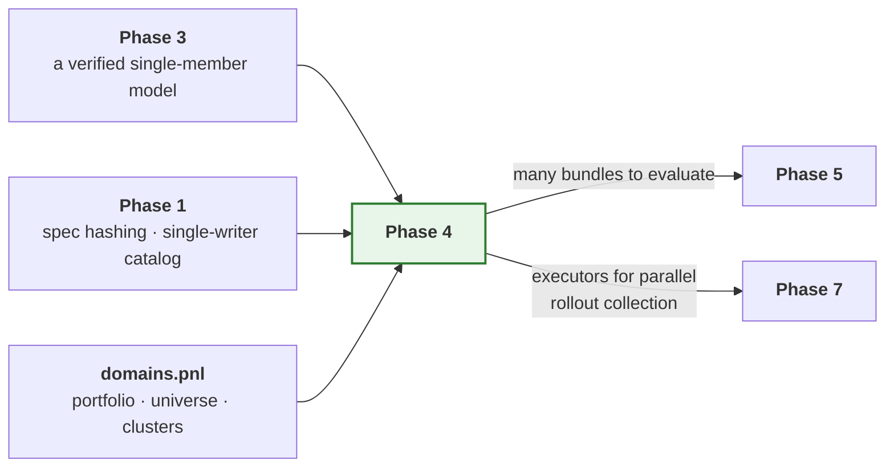

Phase 1's single-writer catalog is what makes this phase safe. Defect 5 — a
read-modify-write index losing entries under a process pool — is a Phase 4
failure caused by a Phase 1 decision, which is why it was fixed there. This
phase is where that fix is finally exercised against forty concurrent writers.

### 4.1 A layering constraint worth stating

`orchestration` may not import `domains` or `models`
(`test_scaffold.py::ALLOWED_DEPENDENCIES`). So `JobSetRunner` cannot ask
`domains.pnl` for a cluster list, and cannot import the flagship.

It does not need to. A job set is a *specification*, and expanding a portfolio
into jobs is something that happens **before** the runner sees it — by the
user, by `domains.pnl.clusters`, or by `api`. The runner receives jobs and
resolves the model through the registry, exactly as `TrainPipeline` does.

This is the layering doing its job: it forced the portfolio-to-jobs expansion
to be a separate, independently testable function instead of a branch inside
the runner.

---

## 5. Tests

| Test | Asserts |
| --- | --- |
| `test_sequential_and_parallel_artifacts_are_identical` | **Parity level 5** — the phase gate |
| `test_run_job_is_picklable` | Module-level and picklable under spawn |
| `test_the_payload_is_picklable_without_a_context` | Hooks and trackers never cross the boundary |
| `test_partial_failure_returns_other_results` | One failed job among many; the rest complete |
| `test_failure_reason_is_recorded` | The manifest names the type, the message and the traceback |
| `test_results_come_back_in_input_order` | Under both executors, regardless of completion order |
| `test_override_preserves_sibling_defaults` | Per nesting depth: one, two and three levels |
| `test_a_sequence_replaces_rather_than_concatenates` | The rule most often assumed otherwise |
| `test_an_explicit_none_overrides` | `None` is a value, absence is absence |
| `test_per_job_architecture_complexity_applies` | Two jobs, different widths, both honoured |
| `test_worker_thread_budget_is_applied` | Read back from the worker's own environment |
| `test_gpu_visibility_set_before_import` | Read back from the worker's own environment. Device-dependent parts skipped without an accelerator |
| `test_concurrent_catalog_registration_loses_nothing` | Forty jobs, forty entries |
| `test_manifest_written_atomically` | No partial manifest readable mid-write |
| `test_policy_selects_sane_defaults` | Across a range of simulated hardware and set sizes |
| `test_a_job_seed_depends_on_its_id_not_its_position` | Reordering the set changes nothing |

---

## 6. Definition of done

Beyond the universal criteria in
[`IMPLEMENTATION.md` §5](../IMPLEMENTATION.md#5-definition-of-done--every-phase):

- [x] **Parity level 5 green**: sequential and process-pool runs produce
      identical artifacts, under the comparison defined in §8.1 — including
      byte-identical weights, and subject to the two preconditions §8.1
      records.
- [x] The flagship runs across a multi-cluster portfolio with per-job
      architecture complexity.
- [x] `run_job` is module-level and proven picklable, and so is its payload.
- [x] Partial failure returns all successful results plus recorded failures.
- [x] Merge rules documented in `merge.py` and tested per nesting depth.
- [x] Thread budgets and device visibility verified in the worker environment.
- [x] Forty concurrent registrations lose no catalog entry. *(Covered by the
      Phase 1 catalog tests, which drive the single-writer path from a real
      process pool; Phase 4 is the first phase that uses it in anger.)*
- [x] `policy.py` picks a sensible executor and worker count unaided.
- [x] GPU tests marked and skipped, not omitted.
- [x] `examples/rade_qnet/phase4_train_groups.py` trains a multi-cluster
      portfolio and prints the job-set summary.

---

## 7. Risks

| Risk | Why it matters | Mitigation |
| --- | --- | --- |
| Parity level 5 fails from per-worker seeding | Parallel runs give different models, undermining reproducibility | Derive each job's seed deterministically from the run seed and job id; never from process id or clock. `RunContext.for_job` already does this and is tested |
| Oversubscription makes parallel slower than sequential | The feature is unusable and nobody says why | Thread budgets set in the pool initialiser and asserted from inside the worker |
| Memory exhaustion with large per-job datasets | Jobs die with an opaque kill signal | `policy.py` caps workers by a per-job memory figure when given one; a killed worker is reported as a failure naming the signal |
| A job set partially registers then fails | The catalog disagrees with the filesystem | Bundles registered per job on completion; the manifest is the set-level record and is written last, atomically |
| A test that spawns processes is slow or flaky in CI | Pool tests get disabled, and the gate with them | Pool tests use a trivial payload and two workers; only parity level 5 runs a real model, once |

---

## 8. Deviations

### 8.1 "Identical artifacts, byte for byte" is not the gate; this is

The outline stated the gate as sequential and parallel runs producing
identical artifacts byte for byte. Taken literally that is unachievable, and
stating an unachievable gate is worse than stating a weaker one — the first
time it fails for a trivial reason, somebody loosens it by hand and nobody
afterwards knows what it is supposed to mean.

A run directory legitimately differs between two executions regardless of
placement: a bundle manifest records `created_at`, a job record carries
`wall_seconds`, log files carry timestamps and process identifiers. None of
these is evidence of anything about placement.

So the gate compares a **named, reviewed set of things that placement must not
change**, with the exclusions equally named:

| Compared | Excluded |
| --- | --- |
| Model weights, byte for byte | `created_at` and any other timestamp |
| Metrics, exactly — not to a tolerance | `wall_seconds` and any other duration |
| Spec digest per job | Log files |
| The set of job identifiers, and their statuses | Absolute paths |
| Bundle version per job | Process identifiers |

The exclusion list is a module-level constant in the parity test, so widening
it is a visible, reviewable change rather than a quiet edit to an assertion.
Metrics are compared **exactly** rather than to a tolerance: placement
changing the eighth decimal place is still placement changing results, and
that is the entire proposition under test.

**Two preconditions the comparison requires, and why they are not evasions.**
Measured on the flagship model, an unpinned run fails this gate. Both causes
turned out to be real defects rather than reasons to soften the criterion,
and both are now fixed; the preconditions are what remains once they are.

*The specification must pin `hardware.threads_per_worker`.* The number of
intra-op threads decides the order in which a reduction accumulates, so it
decides the last few significant figures. A worker process gets its budget
from an environment variable set before it imports anything; the process that
launched it has already imported Torch, so the same variable does nothing
there. Sequential and pooled runs therefore ran at different thread counts
and scored differently — in the seventh significant figure, reproducibly,
with each value stable for its own thread count. That is defect 13. The fix
makes `hardware.threads_per_worker` a specification field that is applied
in-process, so the budget travels with the job instead of with the machine.
What remains is a genuine constraint: if the specification does not pin a
budget, the budget is whatever the host decided, and two hosts may disagree.
A run that wants reproducibility has to say what it wants.

*The specification must pin a deterministic device.* Under `device: auto` on
Apple silicon the run is not reproducible **against itself** — two sequential
runs of the same specification, in the same process, at `determinism:
strict`, differ. MPS kernels are non-deterministic and
`torch.use_deterministic_algorithms` does not cover them. This is not
something the framework can fix, and it is worth stating plainly rather than
burying: `determinism: strict` is a promise about what the framework
controls, and the backend is not that. On `device: cpu` the same
specification reproduces exactly, every time.

With both pinned, the flagship model's full metric mapping is bit-identical
between `local` and `processes`, for passing and failing jobs alike.

### 8.2 The job-set YAML in `ARCHITECTURE.md` §12 used pre-Phase-1 field names

The illustrative job-set file in §12 was written before Phase 1 fixed the
specification schema, and it does not validate. It uses `data:` where the spec
has `source:`, `seq_length:` where the spec nests
`transforms.sequence.length`, and `basis:` where the spec has
`transforms.reduction`.

Left as is, the documented format and the implemented format would differ,
and the first user to copy the documented one gets a validation error against
a file the architecture document told them to write.

Two options: build a translation layer so the documented names keep working,
or correct the document. The document is corrected. A translation layer is a
second schema with its own drift, its own error messages and its own tests,
bought in exchange for keeping an illustration that nobody has ever run.

### 8.3 `domains.pnl.metrics` is deferred to Phase 5

The outline placed replication quality metrics — unexplained P&L, tail
replication error, hedge-ratio stability — in this phase.

They are evaluation, and the evaluate pipeline is Phase 5. Shipping them here
means shipping metrics with no pipeline that calls them, which in practice
means metrics tested only against hand-constructed arrays and never against a
real model's output. That is how a metric ends up with the sign of its error
term reversed and nobody notices for a quarter.

Nothing in this phase needs them. The job-set manifest aggregates whatever
metrics the evaluate stage already produces, and it does so by name without
knowing what they mean.

### 8.4 `domains.pnl.universe` takes over `Universe` from the model

`Universe` currently lives in `models/hybrid_gnn_rnn/state.py`. A universe of
elementary and target instruments is a property of the **replication problem**,
not of the network that solves it — a ridge regression over the same portfolio
has exactly the same universe, and would otherwise either import it from a
model it has nothing to do with or define a second one.

It moves to `domains.pnl.universe` and the model imports it (`models` may
import `domains`; `domains` may not import `models`, which is the right way
round). No behaviour changes and the Phase 3 parity levels are re-run to
confirm it.

This is the kind of thing a second consumer is supposed to shake out, and it
is cheap now and expensive once three models have their own copy.

### 8.5 `api.py` was in no phase, and this phase needs it

`ARCHITECTURE.md` §12 presents `rade_qnet.api` — `api.train`, `api.train_jobs` —
as *the* way a user uses this framework. No phase delivers it. Every example
so far constructs a `RunContext`, digests a spec, resolves a definition from
the registry and instantiates a pipeline by hand: about twenty lines, every
one of them framework internals.

That is acceptable for a phase example demonstrating internals. It is not
acceptable as the published interface, and this is the phase where it starts
to cost something real — the natural entry point for a job set is one function
call, and the alternative is each user assembling a `JobSetRunner`, an
executor, a placement policy and a manifest path correctly and identically.

A deliberately small `api.py` is added here: `train` and `train_jobs`, taking
a path or a mapping. `evaluate`, `infer` and `tune` join it in Phase 5 when
there is something behind them. The CLI that §12 also documents stays
unbuilt — it is a thin shell over `api` and nothing else depends on it, so it
can land whenever it is wanted.

`api.py` sits at the top level of the package rather than inside one of the
nine, because it is the only module that legitimately sees all of them. The
layering test treats a top-level module as unconstrained, which is correct
here and would not be correct anywhere else.

### 8.6 Defect 12 — a registration that does not cross a process boundary

Found by running a job set from an entry point that did not import the
model. Components register as an import side effect, and nothing recorded
which import. A spawned worker starts with a bare interpreter, so the
flagship was resolvable there only because spawn re-imports `__main__` and
the launching script happened to import the model.

That is the worst shape a bug can have: it works, consistently, until
somebody changes the entry point — a CLI, a scheduler, a notebook — at which
point a correct specification fails with "no model named ...". Nothing in
the diff that broke it would mention models.

`RegistryEntry` now records each component's defining module, `JobPayload`
carries the module names, and the worker replays the imports before
resolving anything. Recorded rather than derived from the
`models/<name>/register.py` convention, so a model in a user's own package
behaves exactly as a built-in one does. Names are resolved in the parent, so
an unknown one fails where the error can list the alternatives rather than
inside a worker, where it would surface as a dead process.

### 8.7 Defect 13 — a thread budget that only half applied

Found by parity level 5 failing. A worker process receives its thread budget
through an environment variable read before it imports anything, which works
precisely because a worker is a fresh interpreter. The process that launched
it has already imported Torch, so the same variable does nothing there.

`HardwareSpec.threads_per_worker` already existed as a field. Nothing applied
it. So the sequential path ran at the host's default thread count and the
pooled path ran at the configured one, and because the number of threads
fixes the order a reduction accumulates in, the two scored differently —
reproducibly, in the seventh significant figure, with each value stable for
its own thread count.

The measurement that settled it, on the flagship:

| parent threads | worker threads | metrics identical |
| --- | --- | --- |
| 4 | 4 | yes |
| 1 | 1 | yes |
| 4 | 1 | no |
| 1 | 4 | no |

The score tracked the thread count and not the executor, which exonerates
placement and indicts the budget. `apply_thread_budget` now applies the
field in-process from `resolve_hardware`, so the budget travels in the
specification and holds wherever the job lands.

The executor still sets the environment variables for its workers. That is
not redundant: a pre-import variable is the only way to constrain BLAS
libraries that read their thread count at load time, which
`torch.set_num_threads` cannot retroactively undo. The two mechanisms cover
different windows, and only the specification one is authoritative for
reproducibility.

### 8.9 The `domains` layer is removed

*Decided after Phase 6, while preparing the framework for a second team.*

The design reserved a `domains` layer for business context, so that no
training loop would ever learn what a P&L is. The rule was right; the layer
was the wrong way to enforce it. Inspected file by file, `domains.pnl`
contained two kinds of thing, and neither was business context:

- **Generic machinery wearing business names.** `Portfolio`, `Cluster` and
  `read_portfolio` read a manifest of named data slices and expand them into
  a job set. Nothing in that is about P&L. It is now
  `orchestration.jobs.groups` (`GroupSet`, `DataGroup`, `read_group_set`,
  manifest `groups.json`) and `orchestration.jobs.fanout`
  (`job_set_for_groups`, `group_overrides`). `api.train_portfolio` is now
  `api.train_groups`.
- **One model's vocabulary.** `Universe` (elementary and target instruments)
  is how the flagship reads its data. A second model over the same files
  would read them its own way, in its own `data.py`. It moved back to
  `models/hybrid_gnn_rnn/state.py`, reversing §8.4.

The rule now reads: business vocabulary lives only in `models`, inside each
model's `data.py` (`ARCHITECTURE.md` §4). The group manifest's `input_ids` and
`target_ids` are provenance only; the model still reads its own columns. Any
other manifest key is kept as a free-form attribute that a per-group override
hook can read, which covers what the cluster's `asset_class` used to do
without the framework knowing the word.

The deferred `domains.pnl.metrics` (§8.3) and `domains.hedging` (Phase 7) are
not lost. Metrics a model wants belong in that model's `reports.py`; a hedging
environment belongs to the model that trains in it.

### 8.8 The record

| Date | Deviation | Reason |
| --- | --- | --- |
| Phase 4 | Gate restated as a named comparison with named exclusions | §8.1 |
| Phase 4 | `ARCHITECTURE.md` §12 job-set YAML corrected to the real schema | §8.2 |
| Phase 4 | `domains.pnl.metrics` deferred to Phase 5 | §8.3 |
| Phase 4 | `Universe` moved from the model to `domains.pnl` | §8.4 |
| Phase 4 | `api.py` added, having been in no phase | §8.5 |
| Phase 4 | Defect 12: registrations do not survive a process boundary | §8.6 |
| Phase 4 | Defect 13: thread budget moved from the executor to the spec | §8.7 |
| After Phase 6 | `domains` layer removed; group sets moved to `orchestration.jobs` | §8.9 |
````

---

## 6. `src/rade_qnet/docs/phases/PHASE_5_EVALUATE_INFER_TUNE.md`

22063 bytes · SHA-256 `f75ec71330030c3b`

````markdown
# Phase 5 — Evaluate, infer, tune

**The other three pipelines, completing the model lifecycle.**

| | |
| --- | --- |
| **Depends on** | Phase 3 |
| **Blocks** | Phase 7 |
| **Delivers** | `pipelines.evaluate`, `pipelines.infer`, `pipelines.tune`, `engines.torch.predictor`, `metrics.drift`, evaluation and tuning visuals, flagship overrides for all three |
| **Can run in parallel with** | Phases 4 and 6 |

---

## 1. Purpose

Phase 2 and 3 can train a model and save it. This phase makes a saved model
*useful*: scored on held-out data, searched over hyper-parameters, and served
in production with provenance.

Stage sequences for all three are in
[`ARCHITECTURE.md` §5](../ARCHITECTURE.md#5-stage-contracts-and-the-train-pipeline).

### 1.1 What this phase is really testing

Training is the easy half. A training run owns its data from end to end: it
reads the raw inputs, decides the split, fits the scalers and uses them
immediately. Nothing can get out of step because nothing is ever separated.

Everything in this phase breaks that. A bundle is loaded in a different
process, weeks later, possibly on a different machine, and asked to produce
numbers that are comparable to the ones it produced at training time. The
model's weights are the easy part — they are bytes on disk. The hard part is
everything *around* the weights: the same split, the same scalers, the same
column order, the same units.

Each of those has the same failure signature, and it is the worst one
available: **the run completes and the numbers are wrong.** A re-scored model
with a re-derived split reports a plausible metric. A production prediction
made with a re-fitted scaler is a plausible number. Nothing raises, nothing
logs, and the error is discovered — if ever — by someone noticing that
yesterday's number does not match today's.

So the phase is not really about three pipelines. It is about one invariant,
stated three ways:

> A saved model, re-loaded, must see its inputs exactly as it saw them during
> training — and when it cannot, it must refuse rather than approximate.

---

## 2. What is built

| Module | Delivers |
| --- | --- |
| `storage.bundle` (extended) | `load_spec`, and resolving a bundle's fitted-state type from its manifest |
| `sources.dataset.rebuild` | Rebuild a dataset from a bundle: re-read raw, apply the *saved* state, apply the *saved* split. Never fits, never splits |
| `orchestration.pipelines.evaluate` | Load bundle, rebuild source from lineage, predict, invert, score, report |
| `orchestration.pipelines.infer` | Load bundle, prepare inputs, predict, invert, emit with provenance |
| `orchestration.pipelines.tune` | Propose trials against one data build, score, select, optionally refit |
| `core.spec.tune` | `TuneSpec`, the search space, and validated trial overrides |
| `engines.torch.predictor` | Batched inference, including the precompute path |
| `analysis.metrics.drift` | Baseline-versus-live distribution distance |
| `analysis.visuals.evaluation` | Predicted versus actual, residuals, error by bucket, baseline comparison |
| `analysis.visuals.tuning` | Trial history, parameter importance, parallel coordinates |
| `models/hybrid_gnn_rnn/pipelines/{eval,tune}.py` | Flagship overrides. No `infer.py`: see §8.3 |
| `orchestration.stages.resolve` | Reads a model's override declaration. See §8.6 |
| `api` (extended) | `evaluate`, `infer`, `tune` |

---

## 3. Key decisions

### 3.1 Metrics are always in original target units

`invert_targets` is a required stage in both evaluate and infer, placed before
`analysis.metrics` is reached. A mean absolute error in standardised space is
not a quantity anyone can act on, and the inversion is available because
`FittedState.inverse_transform_targets` was made abstract in Phase 1 rather
than optional.

### 3.2 A source is rebuilt from lineage, and three things are never redone

This is the decision the whole phase turns on. `DataModule.build` does five
things in order:

```text
load  →  split  →  fit_state  →  transform  →  signature
```

A rebuild does **three** of them, and the two it skips are the two that would
silently invalidate the comparison:

```text
load  →  [split: READ FROM LINEAGE]  →  [fit_state: READ FROM BUNDLE]  →  transform  →  signature
```

*Why not re-split.* Re-deriving means a change to split logic silently
re-scores an old model against different data, and the comparison to its
original metrics becomes meaningless without anybody noticing. Worse, a
chronological split re-derived against a *longer* history moves the
boundaries, so the old model is now scored on rows it was trained on — and
scores beautifully.

*Why not re-fit.* The classic production failure. A scaler re-fitted on live
data standardises today's inputs by today's mean, while the model learned a
response to inputs standardised by the training mean. The model sees inputs on
a scale it has never encountered, and produces confident nonsense. Phase 1
made this avoidable by separating `fit_state` from `transform`; this phase is
where that separation earns its keep.

The rebuild verifies the fingerprint it was given against the one in the
lineage, and says so when they differ. A changed source is not necessarily an
error — re-scoring last month's model on this month's data is a legitimate
thing to want — but it must be a decision rather than an accident.

### 3.3 The data build happens once per search

Forty trials over the same dataset build it once. This is where an unstable
spec hash would cost most: a hash that varies across processes turns every
reuse into a miss, and the search spends its time rebuilding data instead of
training.

The outline specified a general step cache for this. It is delivered as an
in-memory reuse instead; see §8.1 for why, and for what is given up.

### 3.4 Trial overrides are typed and validated

Defect 7: `rade_ml_pt`'s `TunePipeline._resolve_trial_training_config` passed
`learning_rate` and `batch_size` into `dataclasses.replace(TrainingConfig)`,
raising `TypeError`. It was latent only because the hybrid model overrode the
method. Trial overrides here go through the same validated merge as job-set
overrides, so an unknown field fails at trial construction.

That is a stronger statement than it looks. A search proposes values for
*named* parameters, and the names come from a configuration file written by
hand. A typo in one of them has two possible behaviours: the search explores a
parameter that does not exist and reports that it makes no difference, or it
fails. Only the second is useful.

### 3.5 Unseen entities are a declared capability

The flagship can predict for target instruments absent from training, by
transferring from their nearest neighbours in the learned output space. That is
the `Inductive` capability, declared by the model. A model that does not
declare it gets a clear error rather than a plausible-looking prediction for an
instrument it has never seen.

### 3.6 A bundle is not self-describing, and should not pretend to be

Loading a bundle requires the model's package to be importable. The manifest
records a model *name*; turning that into a class, and into the fitted-state
type needed to read `fitted_state/`, goes through the registry.

This is the same constraint Phase 4 hit as defect 12, arriving from a
different direction, and it is not worth engineering away. The weights are
meaningless without the architecture that interprets them, so a process that
can load a bundle usefully is a process that has the model code anyway. What
*is* worth engineering is the error: "no model named 'hybrid_gnn_rnn'" from a
bundle directory should say that the bundle names a model this process has not
imported, not merely that a registry lookup missed.

### 3.7 Evaluate and infer differ in one thing: whether targets exist

They are otherwise the same pipeline. Evaluate has targets, so it can score;
infer does not, so it emits. Keeping them separate rather than giving evaluate
a `score: bool` is deliberate — the two have different outputs, different
failure modes and different audiences, and a flag would mean every stage
downstream of it carries an `if`.

What they share is the reload path, and that is shared as a *module* rather
than a base class: `sources.dataset.rebuild` plus the bundle loaders. Two
pipelines calling the same functions stay in step; two pipelines inheriting
from a common base diverge the first time one of them needs a stage the other
does not.

---

## 4. How this links to the rest of the framework

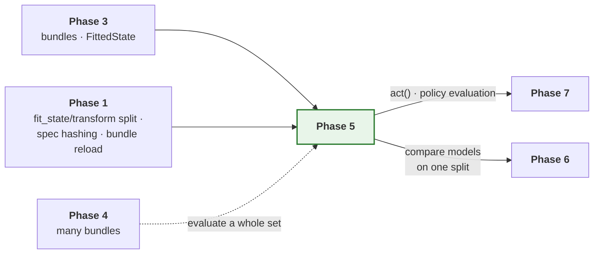

### 4.1 The layering constraint

`orchestration` may not import `models`. All three pipelines
resolve their model through the registry, exactly as `TrainPipeline` does, so
none of them knows what a flagship is.

`sources.dataset.rebuild` lives in `sources` and so may import only `core`.
That is the right home: rebuilding is a property of how a dataset was built,
and the module that built it is the module that knows how to rebuild it.

---

## 5. Tests

| Test | Asserts |
| --- | --- |
| `test_metrics_are_in_original_target_units` | A scaled target reports metrics on the original scale |
| `test_rebuild_uses_the_saved_split` | Changed split settings do not change an old bundle's split |
| `test_rebuild_does_not_refit_the_state` | Changed data does not change the scaler the model sees |
| `test_rebuild_reports_a_changed_fingerprint` | A different source is surfaced, not silently accepted |
| `test_evaluate_reproduces_training_metrics` | Re-scoring the training run's test split gives the same numbers |
| `test_data_build_is_reused_across_trials` | Built once for forty trials, verified by call count |
| `test_unknown_trial_override_fails_at_construction` | Defect 7 |
| `test_best_trial_selection_is_deterministic` | Fixed seed, same winner |
| `test_a_failed_trial_does_not_end_the_search` | Recorded with its reason, as with job sets |
| `test_an_inductive_model_is_allowed_through` | Declaring the capability routes rather than refuses |
| `test_an_unseen_entity_is_refused` | A clear error, not a plausible number |
| `test_precompute_matches_plain_path` | Identical results, lower cost |
| `test_predictions_carry_provenance` | Bundle version, spec hash, timestamp |
| `test_drift_of_identical_distributions_is_zero` | The degenerate case |

---

## 6. Definition of done

Beyond the universal criteria in
[`IMPLEMENTATION.md` §5](../IMPLEMENTATION.md#5-definition-of-done--every-phase):

- [x] All three pipelines complete, with the flagship's overrides — and
      reachable, which they were not. See §8.6.
- [x] Metrics always in original target units, verified with a scaled target.
- [x] Sources rebuilt from saved lineage; splits never re-derived and states
      never re-fitted, each with a test that fails against the naive version.
- [x] Re-evaluating a bundle reproduces its recorded metrics exactly.
- [x] Data built once per search, verified by call count.
- [x] Trial overrides typed and validated; defect 7 has a failing test against
      the old behaviour.
- [x] A failed trial is recorded and surfaced, not swallowed.
- [x] `Inductive` gate admits declaring models and refuses the rest clearly.
      The mechanism is deferred rather than faked — see §8.3.
- [x] Precompute path numerically identical to the plain path.
- [x] Predictions carry bundle version, spec hash and timestamp.
- [x] `examples/rade_qnet/phase5_evaluate_and_tune.py` evaluates a bundle, runs a
      small search and prints the best trial.

---

## 7. Risks

| Risk | Why it matters | Mitigation |
| --- | --- | --- |
| Re-evaluation does not reproduce training metrics | Either lineage is incomplete or training metrics were computed differently | A dedicated test; a discrepancy is a Phase 2 or 3 finding, not a Phase 5 workaround |
| A rebuild silently re-fits or re-splits | The two quiet failures this phase exists to prevent | Rebuild never calls `fit_state` or `split`; tests assert that changing each has no effect on a reloaded bundle |
| Reuse returns a stale build | A search optimises against the wrong data | Reuse is keyed on the data spec digest and the source fingerprint; a test asserts a changed source is not reused |
| Tuning hides a failing trial | A search reports a best trial from a partially broken sweep | Failed trials recorded with reasons and surfaced in the summary, as with job sets |
| Inference drifts from training preprocessing | The classic production failure | Inference uses the bundle's `FittedState`, never a re-fitted transform. Asserted by test |

---

## 8. Deviations

### 8.1 No general step cache; tuning reuses one build in memory

The outline specified a step cache in `core/runtime/cache.py`, keyed on the
spec hash and consulted by `Pipeline.step`, so that `build_data` is computed
once across a search.

Building it as specified means answering, for *every* stage, two questions
that only have good answers for one of them: how is this stage's output
serialised, and when is it invalid? A stage returning a dataset has an answer.
A stage returning a materialised Torch module, a prepared hardware handle or a
live engine handle does not — and a cache that silently declines to cache most
stages is a cache whose behaviour nobody can predict from reading the code.

There is also a correctness trap. A general cache keyed on "the spec hash"
must decide *which* spec. `build_data` depends on the source spec; `fit`
depends on nearly everything. Key too narrowly and a cache hit returns the
wrong thing; key on the whole run spec and a tuning search — which changes the
run spec on every trial — never hits at all, which is precisely the case the
cache was requested for.

So the requirement is met directly instead. `TunePipeline` builds the dataset
once and holds it for the search, passing the same `PreparedDataset` to every
trial. Across processes, the existing `DatasetCache` (Phase 1, keyed on source
spec digest plus source fingerprint plus framework version) already covers
reuse, and it is keyed on exactly the right things because it was built for
exactly this.

**What is given up.** No reuse of any stage other than the data build, and no
reuse of a data build across two separate searches in one process that do not
share a `TunePipeline`. Both are acceptable: the data build is the expensive
stage, and the second case is covered by `DatasetCache` the moment caching is
enabled. If a later phase finds a second stage worth caching, a targeted cache
for that stage will be easier to reason about than a general one.

### 8.2 `storage.bundle` could not load two of the things it writes

A bundle contains `spec.json` and `fitted_state/`. Phase 1 wrote both and
provided a loader for neither: there is no `load_spec`, and
`load_fitted_state` requires the caller to pass the concrete state type, which
is not recorded anywhere on disk.

That was invisible for four phases because nothing re-loaded a bundle. Both
are added here. The state type is resolved through the model definition named
in the manifest, which is the only place that knows it.

### 8.3 `Inductive` declares a capability but not a mechanism

`Inductive.supports_unseen_entities() -> bool` says whether a model *can*
predict for an unseen entity. It does not say how to ask it to. The
inference pipeline can therefore refuse correctly and can only succeed by
accident, because it has no interface to pass unseen entities through.

A `resolve_unseen` hook was written during this phase to close that, and then
removed before it shipped. The reason is worth recording, because the
reasoning applies to any capability protocol:

An entity absent from training is also absent from the **fitted state** that
a reloaded model applies. For the flagship that means no graph node, no entry
in `target_indices`, and no row in the encoded attribute table — all three
come from the saved `HybridState`, not from the inference source. A hook
handed only the unseen identifiers and the existing static tensors has
nothing to build the missing rows *from*. The signature that would work has
to carry the new entity's raw attributes, and settling what those look like
is the universe-handling problem, not an inference problem.

So the honest position for Phase 5 is: the declaration is real and load-
bearing, the mechanism is not yet designable, and shipping a protocol method
that nothing calls and nothing implements is worse than its absence because
it reads as a supported path. The declaration alone already pays for itself —
it is what lets the pipeline refuse a transductive model rather than hand
back a default embedding.

The alternative considered was putting the mechanism in the flagship's infer
override with the framework knowing nothing about it. That was rejected for
the original reason: it would make "unseen entity" a flagship feature rather
than a framework capability, and the next model with the same property would
invent its own interface. The point stands; it just does not force a protocol
method to exist before the signature is known.

### 8.4 `TuneSpec` was in no phase's module table

`ARCHITECTURE.md` §12 shows `api.tune("configs/hybrid_tune.yaml")`, and the
Phase 1 charter for `core/spec` lists no tuning spec. A search needs a
declared search space, a trial budget, an objective and a direction, and none
of those fit in a run spec.

It is added as `core.spec.tune`, following the job-set precedent: a shared
base configuration plus per-trial overrides merged as raw mappings before
validation, for the reasons in Phase 4 §3.1.

### 8.5 "Reproduces exactly" inherits Phase 4's preconditions

The gate says re-evaluating a bundle reproduces its recorded metrics exactly.
Phase 4 established that on this hardware two things break exactness
independently of anything the framework does: an unpinned thread budget
changes the order a reduction accumulates in, and MPS is non-deterministic
even against itself.

Re-evaluation is a weaker case than Phase 4's gate — the weights are fixed and
loaded from disk, so there is no optimiser accumulating differences, only a
forward pass. But it is the same arithmetic, so the same preconditions apply,
and the test pins both for the same reasons documented in
[Phase 4 §8.1](PHASE_4_JOB_SETS.md).

### 8.6 Model pipeline overrides had no reader

The largest finding of the phase, and it was not a Phase 5 defect. It was
found here only because this phase added three more instances of it.

A model declares its overrides on its framework definition:

```python
class HybridGnnRnnModel:
    pipelines = MappingProxyType({"train": HybridTrainPipeline})
```

Nothing in the framework read that mapping. `api.train`, `api.evaluate`,
`api.infer`, `api.tune` and the portfolio job runner all instantiated the
framework's own pipeline unconditionally. Every override was reachable only
by importing the subclass and constructing it by hand — which is exactly what
the Phase 3 and Phase 4 examples do, so the overrides worked, were tested, and
were nevertheless dead through every documented entry point.

This is the worst shape a defect can take. The feature exists. Its tests pass.
A user following the documentation gets the base pipeline, no error, and a
flagship model quietly missing its graph diagnostics.

`orchestration.stages.resolve.pipeline_for` is the reader, and it is
deliberately one function so there is one place the lookup can be wrong. It
refuses two things the declaration alone could not: an override that is not a
subclass of the pipeline it replaces — because `api.evaluate` promised its
caller an `EvaluationResult`, and a model has no standing to break that — and
an override declared under a key no lifecycle reads, which would otherwise
present as the override simply not running.

Connecting it immediately paid for itself twice. The flagship's new eval
override called `collect_targets` with the wrong arity, and then compared a
scaled forward pass against inverted targets — a per-target error an order of
magnitude too large, which reads as a broken model rather than a broken
comparison. Both were invisible while nothing ran the override. There is now a
test asserting that the mean of the per-target errors equals the pooled metric,
which is the invariant that catches a scale mismatch in general.

### 8.7 `TrainingResult` did not say where the model went

`api.train` returned metrics and no path. Training something and then
evaluating it — the headline Phase 5 workflow — therefore required
reconstructing a bundle directory from the run id, the model name and the
version, which is three things to get wrong and a private layout to depend on.

`TrainingResult.bundle_directory` is stamped after the persist stage rather
than before it, because until the bundle is written there is no directory to
name, and a result claiming a location before anything was saved there would
be wrong in the one case — a failed write — where it is read most carefully.

### 8.8 The record

| Date | Deviation | Reason |
| --- | --- | --- |
| Phase 5 | General step cache replaced by in-memory reuse in tune | §8.1 |
| Phase 5 | `load_spec` and state-type resolution added to `storage.bundle` | §8.2 |
| Phase 5 | `Inductive` stays declaration-only; the mechanism is deferred | §8.3 |
| Phase 5 | `core.spec.tune` added, having been in no phase | §8.4 |
| Phase 5 | Exactness gate inherits Phase 4's pinning preconditions | §8.5 |
| Phase 5 | `orchestration.stages.resolve` added; model overrides were dead | §8.6 |
| Phase 5 | `TrainingResult` gains `bundle_directory` | §8.7 |
````

---

## 7. `src/rade_qnet/docs/phases/PHASE_6_ADDITIONAL_ENGINES.md`

27391 bytes · SHA-256 `a8c4ca3da3c99b0c`

````markdown
# Phase 6 — More engines

**Prove the engine contract is genuinely library-agnostic, and prove simple
models stay simple.**

| | |
| --- | --- |
| **Depends on** | Phase 2 |
| **Blocks** | — |
| **Delivers** | `engines.sklearn`, `engines.xgboost`, the reference models, baseline comparison in reports |
| **Can run in parallel with** | Phases 4 and 5 |

---

## 1. Purpose

This phase is a test of the architecture dressed as a feature.

Two claims have been made repeatedly and neither has been checked. **That the
engine interface is library-agnostic** — if it only accommodates a model that
trains over epochs, it is a PyTorch interface with a generic name. **That
simple models stay cheap** — if a ridge regression needs more than one short
file, an abstraction above it has grown teeth, and users will work around the
framework rather than with it.

There is a second payoff. Every headline metric needs a reference point. A
graph-temporal network that cannot beat a ridge regression on the same split
has not earned its complexity, and the only way to know is to run both through
the same lifecycle on the same data.

### 1.1 What this phase is really testing

The previous five phases all added capability. This one adds almost none. Both
engines wrap libraries that already work, and all three baselines are models
anybody could write in twenty lines of NumPy. If the phase were measured by
what a user can newly do, it would barely register.

What it measures instead is whether the abstractions are *true*. Every phase
so far had exactly one engine, so every claim about the engine interface was
untested by construction: an interface with one implementation is not an
interface, it is a spelling of that implementation. The same is true of
`PredictorDefinition` and `SupervisedModel`, which have had precisely one real
consumer — a model with a graph, a recurrent stream, custom reports and a
bespoke data build. Nothing has yet asked whether the framework is pleasant
for a model with none of those things.

XGBoost is the harder of the two tests, because trees fit in a single call
with no loop at all. There is no epoch, no optimiser, no step, no device.
Almost every concept the Torch engine introduced is absent. If a one-shot fit
can satisfy the same contract and produce the same bundle, the same metrics
and the same reports as a neural network, the contract is real.

So the phase has one question behind it, stated as a bet:

> Adding a second and third engine should require **no change to any
> pipeline**. Every change forced above the `engines` package is a defect in
> the Phase 2 abstraction, and is recorded in §8 rather than absorbed.

That bet is deliberately falsifiable, and §8 already records one way it was
lost before the phase began: see §8.1.

---

## 2. What is built

| Module | Delivers |
| --- | --- |
| `engines.sklearn.engine` | Any `fit`/`predict` estimator, `joblib` persistence, one-shot capabilities |
| `engines.loaders` | Draining a `BatchSource` into a feature matrix, once, in one place |
| `engines.xgboost.engine` | `DMatrix` materialisation, native early stopping, JSON persistence |
| `models.ridge` | Ridge regression on flattened features |
| `models.xgb_tabular` | Gradient-boosted trees on tabular features |
| `models.lstm_tabular` | Recurrent network with no graph component |
| `analysis.reports.baselines` | Baseline comparison in a run's report |
| `core.spec.training` (extended) | `SklearnTrainingSpec`, `XgboostTrainingSpec` |

Retired rather than built: `core.contract.data.ArrayData` and
`EngineCapabilities.payload`. See §3.1 and §8.1.

---

## 3. Key decisions

### 3.1 One-shot engines consume `BatchSource`, and `ArrayData` is retired

This is the central decision of the phase and it reverses a Phase 1 one.

`core.contract.data` defines `ArrayData` — a feature matrix and a target, the
whole split at once — and `EngineCapabilities.payload` declares which of the
two payloads an engine wants. The docstrings are explicit about the intent:
*"Tree and linear models want the whole split at once, not a stream of
batches. Giving them their own payload type means the XGBoost engine does not
have to pretend to iterate."*

The design was reasonable and the need did not materialise, for a reason that
only became visible once there was something to check it against:

**The data layer is already library-agnostic.** `sources/` imports no training
library at all — batches are plain NumPy dictionaries. The payload split was
anticipating a mismatch between a tensor stream and an array consumer, and
there is no mismatch to bridge. A tree engine draining a `BatchSource` gets
NumPy arrays and concatenates them. That is one copy, and XGBoost immediately
makes another when it builds its `DMatrix`, so the copy the payload split
exists to avoid is absorbed into a copy that was happening anyway.

Against that, the cost of keeping it is concrete and large. Nothing in the
framework reads `capabilities().payload` today, and `source_for` refuses
`ArrayData` outright with *"neither TensorBatchData nor a BatchSource"*. To
make the array path live, **every** consumer would need an array branch:
`source_for`, `scoring_source`, `collect_targets`, `score_splits`, the train
pipeline's fit stage, the evaluate pipeline, the infer pipeline. That is the
first risk in this phase's own table — *tree engines get a parallel pipeline,
the lifecycle forks, and the claim of one lifecycle becomes false* — reached
not by accident but by following the design.

So: one payload type, one `source_for`, one scoring function, one evaluate
path. The engines drain, and `ArrayData` and `payload` are deleted rather than
left as declarations nothing reads. Phase 5 §8.6 is the argument for deleting
them: a declaration with no reader is worse than its absence, because it reads
as a supported path.

The draining itself lives in `engines.loaders` and is imported by the
XGBoost engine, so there is one implementation of "turn a source into a
matrix" rather than two that can disagree about row order.

### 3.2 A boosting round is an epoch

`FitOutcome` carries a history of `EpochRecord`. A tree engine has no epochs,
but it does have boosting rounds, and the two are the same thing for every
purpose the framework has: a unit of progress with a training loss, optionally
a validation loss, and an index that can be plotted.

So the XGBoost engine reports one `EpochRecord` per boosting round, and
`analysis.visuals` renders a boosting curve with no knowledge that it is one.
The sklearn engine reports exactly one record, because a closed-form fit has
one unit of progress and reporting zero would make `best_epoch` meaningless.

What the engine must **not** do is report epochs it did not have. Declaring
`supports_epochs=False` while returning a ten-record history would make the
capability a lie, and the conformance suite would not catch it because it
checks the shape of the outcome rather than its honesty. The relationship is
pinned by a test instead: an engine declaring no epoch support returns at most
one record.

### 3.3 Native facilities are translated, never reimplemented

XGBoost's early stopping operates per boosting round *inside* the library,
with access to state the framework cannot see. Anything layered on top would
be strictly worse and would also fight the library's own. The engine's job is
to translate the framework's spec into the library's arguments and the
library's output back into a `FitOutcome`.

The same applies to persistence. XGBoost's JSON format and scikit-learn's
`joblib` are used as-is, with the framework's manifest alongside rather than
instead. This is not merely convenient: a bundle whose weights are in the
library's own documented format can be read by someone who does not have this
framework, which is a property worth having when a model outlives its platform.

One consequence is worth stating plainly, because it looks like a violation of
the Phase 2 rule against pickling. `joblib` *is* a pickle, and the Phase 2
engine contract says implementations must write a parameter payload rather
than a pickled model object. The rule was written against a specific failure —
`torch.load(weights_only=False)` on a whole `nn.Module`, which made every
saved model refactor-fragile and made loading one equivalent to executing it.
Scikit-learn has no state-dict equivalent and `joblib` is its documented
format, so there is no alternative that is not a worse reimplementation. The
deviation is recorded in §8 rather than hidden, and the engine refuses to load
a payload whose estimator class does not match the model it was handed — which
recovers the half of the rule that was about silent mismatch.

### 3.4 An absent capability is refused, not ignored

A tree engine cannot clip gradients, use mixed precision, or shard across
devices. Three ways to handle a spec that asks for one:

1. Accept and ignore it.
2. Accept and warn.
3. Refuse.

The engine refuses, and it refuses in `prepare` — before the data build's work
is committed to and well before the fit. A silently ignored setting is the
worst of the three because the run completes, the number is plausible, and the
user believes a thing about their model that is not true. A warning is better
and still bad: warnings are read once and then filtered.

The exception, already in the Phase 2 contract, is a merely *absent* device. A
requested GPU that is not present degrades to the CPU with a warning rather
than failing, because the run would otherwise have succeeded and the user's
intent is served by running. The distinction is between "cannot" and "this
machine happens not to" — a tree engine asked for gradient clipping is being
asked for something that does not exist for it at all.

### 3.5 The line budget is a test, not an aspiration

Each baseline is one file with registration inside `model.py`, under **fifty
lines of code** excluding docstrings and comments.

Stating it in prose would make it a hope. It is asserted by
`test_each_baseline_is_under_the_line_budget`, which counts statements rather
than lines so that the framework's own documentation standard — which is
demanding, and deliberately so — is not what breaks the budget.

If a baseline exceeds it, **the finding is about the framework and is recorded
in §8**. The temptation will be to raise the number, and the number is only
informative if it is treated as a real constraint. This is the single clearest
signal available about whether `rade_qnet` is pleasant for a model that is not
the flagship, and the flagship is a bad judge of that: it is complex enough
that framework overhead disappears into it.

### 3.6 `lstm_tabular` is a measurement, not a model

Of the three baselines it is the only one nobody would deploy, and it is the
most informative. It is the flagship with the graph removed and nothing else
changed: same engine, same data build, same sequence handling, same loss.

The gap between the two is therefore an estimate of what the graph
contributes. That number has never been measured. It is being assumed every
time the graph is maintained, debugged, or explained to somebody, and if it is
small then a great deal of complexity is being carried for nothing.

It belongs in this phase rather than in Phase 3 because it only means anything
alongside the other two: a graph that beats an LSTM but loses to a ridge
regression is telling a different story than one that beats both.

### 3.7 XGBoost is an optional dependency

It is not installed in the base environment and must not become required.
`engines.xgboost` imports it at module import, which is correct — a host that
never trains trees never imports the module — and the registration pattern
from Phase 3 applies unchanged: importing the engine package is what registers
it.

The tests for it are marked and skipped when the library is absent, in the
same shape as Phase 2's distributed tests, so that a contributor without
XGBoost sees a skip rather than a failure and the suite stays green on a
minimal install.

### 3.8 Baselines are compared, not ranked

`analysis.reports.baselines` renders a comparison table. It does not declare a
winner, and the example prints metrics side by side rather than a verdict.

Picking a winner needs a metric, a split and a tolerance, and all three are
the user's judgement. A report that announced "ridge wins" on a difference of
0.0001 on a 400-row fixture would be worse than no report, because it would be
believed.

---

## 4. How this links to the rest of the framework

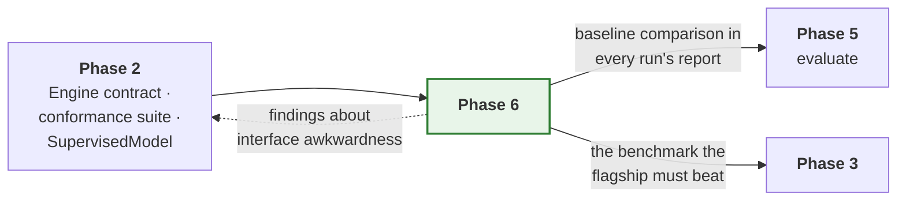

The dashed arrow is the point of the phase. Awkwardness discovered here is a
Phase 2 fix, applied before more weight is put on the interface.

What each new engine must satisfy, and where it comes from:

```mermaid
flowchart TD
    SPEC["RunSpec<br/><i>training.engine: 'xgboost'</i>"] --> PIPE["TrainPipeline<br/><i>unchanged</i>"]
    PIPE -->|"BatchSource per split"| ENG["Engine protocol"]
    ENG --> T["engines.torch<br/><i>epochs, optimiser, devices</i>"]
    ENG --> S["engines.sklearn<br/><i>one shot, closed form</i>"]
    ENG --> X["engines.xgboost<br/><i>one shot, boosting rounds</i>"]
    S -.->|"shared draining"| ADP["adapters.matrix_from"]
    X -.-> ADP
    T --> OUT["FitOutcome · bundle · reports<br/><i>identical for all three</i>"]
    S --> OUT
    X --> OUT
    style X fill:#e8f5e9,stroke:#2e7d32,stroke-width:2px
    style S fill:#e8f5e9,stroke:#2e7d32,stroke-width:2px
```

---

## 5. Tests

| Test | Asserts |
| --- | --- |
| `test_one_shot_engine_satisfies_the_contract` | The shared conformance suite, unmodified, against both engines |
| `test_draining_preserves_source_order` | The matrix rows are the source's rows, which every attribution depends on |
| `test_draining_refuses_an_unbounded_source` | A one-shot fit over an infinite stream has no end |
| `test_boosting_history_reported_as_fit_outcome` | Same `EpochRecord` contract as a neural network |
| `test_an_engine_without_epochs_reports_at_most_one_record` | The capability and the history agree — §3.2 |
| `test_native_early_stopping_selects_best_round` | Against a synthetic sequence with a known minimum |
| `test_unsupported_setting_is_rejected_not_ignored` | Gradient clipping on a tree engine raises in `prepare` |
| `test_an_absent_device_still_degrades_rather_than_failing` | The "cannot" versus "happens not to" distinction holds |
| `test_persisted_model_reloads_and_predicts_identically` | Both engines, bit for bit |
| `test_loading_a_mismatched_estimator_is_refused` | Recovers the half of the no-pickling rule that mattered |
| `test_each_baseline_is_under_the_line_budget` | The simplicity constraint, as a test — §3.5 |
| `test_baselines_train_through_the_full_lifecycle` | Bundles, metrics and reports, same as the flagship |
| `test_baselines_evaluate_and_infer_from_their_bundles` | Phase 5's pipelines work for one-shot engines too |
| `test_baselines_run_in_a_job_set` | Fan-out works for simple models |
| `test_a_baseline_is_tunable` | A search over `alpha` or `max_depth`, end to end |
| `test_no_pipeline_branches_on_engine_name` | The bet in §1.1, as an AST check over `orchestration` |
| `test_flagship_beats_baselines_on_the_fixture` | On the Phase 0 data. Marked, informational — a failure is a finding, not a broken build |

The last test is deliberately not a hard gate. On a tiny fixture a ridge
regression may legitimately win, and a test that fails for a correct reason
gets disabled. It reports rather than blocks.

`test_no_pipeline_branches_on_engine_name` is the one most worth reading. It
walks the `orchestration` package's syntax tree looking for comparisons
against engine names, in the same shape as the Phase 1 dependency test. It is
the only test here that can fail for the right reason and still mean the phase
succeeded — but it should fail loudly, because a pipeline that knows what
`"xgboost"` means is the exact failure this phase exists to detect.

---

## 6. Definition of done

Beyond the universal criteria in
[`IMPLEMENTATION.md` §5](../IMPLEMENTATION.md#5-definition-of-done--every-phase):

- [x] Both engines pass the shared conformance suite unmodified.
- [x] XGBoost reports boosting history through `FitOutcome`; sklearn reports
      one record and declares no epoch support.
- [x] Unsupported settings are rejected in `prepare`, never silently ignored.
- [x] Both engines' persisted models reload and predict identically, and a
      mismatched payload is refused.
- [x] All three baselines within the line budget, with registration in
      `model.py`.
- [x] Baselines get the full lifecycle: bundles, metrics, reports, job sets,
      evaluate, infer and tune.
- [x] Baseline comparison appears in a run's report.
- [x] No pipeline branches on engine name or type, verified by an AST test.
- [x] `ArrayData` and `EngineCapabilities.payload` retired, with
      `ARCHITECTURE.md` updated.
- [x] XGBoost tests skip cleanly when the library is absent.
- [x] Any interface awkwardness recorded in §8 and fixed in Phase 2.
- [x] `examples/rade_qnet/phase6_compare_models.py` trains the flagship and all
      three baselines on one split and prints a comparison table. The result
      is a finding rather than a demonstration — see §8.6.

---

## 7. Risks

| Risk | Why it matters | Mitigation |
| --- | --- | --- |
| The engine contract needs changing for a one-shot fit | A Phase 2 abstraction was wrong | That is the phase working. Fix Phase 2, re-run its tests, record it in §8 |
| A baseline exceeds its budget | The framework is not actually cheap for simple models | Treat it as a framework defect, not an acceptable cost. Do not raise the number |
| Tree engines get a parallel pipeline | The lifecycle forks and the claim of one lifecycle becomes false | One payload type (§3.1); declare absent capabilities; the AST test in §5 |
| `SupervisedModel`'s default split is wrong for trees | Silent leakage in a model nobody scrutinises because it is "just a baseline" | Baselines go through the same conformance suite, including the leakage checks |
| `joblib` reintroduces the pickling problem | A saved model becomes refactor-fragile and unsafe to load | Refuse a payload whose estimator class does not match; record the deviation (§3.3) |
| XGBoost becomes a hard dependency by accident | A host that trains no trees pays for the import | Import inside the engine package only; marked, skipping tests |
| The baseline comparison is read as a ranking | A 0.0001 difference on a 400-row fixture gets believed | Report side by side, declare no winner (§3.8) |

---

## 8. Deviations and findings

Interface awkwardness discovered in this phase is recorded here, because it is
a verdict on Phase 2 and the next reader needs to know what was changed and
why.

### 8.1 `ArrayData` and `EngineCapabilities.payload` are retired

Recorded before the phase began, because the finding is what settled §3.1.

Phase 1 built a second engine payload type for one-shot engines, and a
capability flag to route on it. Neither has a reader. `EngineCapabilities`
documents that *"the pipeline checks this against what the data build
produced"* and no pipeline does; `source_for` refuses `ArrayData` with a
message about gradient engines.

The reason the need did not materialise is in §3.1: the data layer turned out
to be library-agnostic already, so there is no tensor-to-array mismatch to
bridge. Making the path live would require an array branch in seven places and
would fork the lifecycle, which is this phase's own top risk.

This is the same defect class as Phase 5 §8.6 — a declaration nothing reads —
and it gets the same treatment, for the same reason. A reader of
`EngineCapabilities` today will reasonably conclude that writing an engine
with `payload="arrays"` is supported, and it is not.

### 8.2 Two OpenMP runtimes deadlock, and import order decides it

**The symptom.** A process that imports `xgboost` before `torch` hangs
forever on the first Torch operation that opens a parallel region. No error,
no traceback, no log line. It looks like a slow machine.

**The cause.** On macOS the Homebrew `libomp` that the XGBoost wheel links
against and the `libomp` the PyTorch wheel bundles are two different *images*
of the same library, loaded at different addresses. Sampling the hung process
shows the main thread in `__kmp_join_barrier` inside one image while the
worker threads sit in `__kmp_fork_barrier` inside the other. Each runtime is
waiting for threads that belong to the other one.

Whichever image loads first owns the process. Import order decides it and
*only* import order does — call order is irrelevant, and the libraries can be
used in either sequence once both are loaded correctly.

**How it was found.** `tests/rade_qnet/models` hung. Each test passed
in about three seconds alone. Bisecting the order gave it away: the engine
suites run `sklearn`, `torch`, `xgboost` alphabetically and had been passing
for exactly that reason, while the baselines run ridge, then trees, then the
network.

**The resolution.** `rade_qnet/engines/xgboost/__init__.py` imports Torch
before XGBoost when Torch is installed, guarded by `find_spec` so nothing is
imported that is not already present.

**Why the framework absorbs this rather than documenting it.** It is an
upstream packaging conflict and not a design defect, and there is a real
argument for leaving it alone. It was absorbed anyway, on three grounds. The
failure mode is a silent hang, which is the worst kind. Diagnosing it
requires sampling a process and recognising two `libomp` images, which is not
a reasonable thing to ask. And it fires in precisely the workflow this phase
exists to enable: comparing a tree against a network in one process.

Rejected alternatives: `KMP_DUPLICATE_LIB_OK=TRUE` does not fix it, verified.
`OMP_NUM_THREADS=1` does, by removing the thread pool rather than the
conflict, at a cost to every run on the host.

Pinned by `TestTheOpenMpWorkaround`, because an import with no visible
reference is indistinguishable from a mistake to a linter or a reviewer.

### 8.3 Column names could not survive both engines

`_feature_names` originally returned names only when every input happened to
be one column wide, which meant the common case — a single wide feature block
— was never named at all, and the coefficient table it exists for was always
empty.

Fixing it to emit `features_0`, `features_1` and so on surfaced a second
constraint immediately: the first attempt used bracket subscripts, and
XGBoost rejects `[`, `]` and `<` in feature names outright. Both engines
share these adapters, so a scheme one of them refuses is not a scheme. The
underscore form is the one that works everywhere.

Worth noting as a pattern rather than as an incident: the shared adapter is
the right design, and it means a convention has to clear the *union* of two
libraries' restrictions rather than either one's.

### 8.4 Test isolation was a snapshot, not an isolation

`isolated_registries()` snapshotted the registries and restored them on exit,
which restores *state* but does not give a test a clean slate. Several
support fixtures register a stand-in engine under the name `"sklearn"`,
chosen because `TrainingSpec` is a discriminated union over the engines the
framework ships and a test cannot invent a fourth tag.

That worked only while no real `sklearn` engine existed. The moment Phase 6
shipped one, 167 tests failed — but only when a suite that imports the real
engine happened to run first. The engine suites run `sklearn`, `torch`,
`xgboost` alphabetically and the baselines run trees before networks, so the
same tests passed or failed depending on which directory pytest reached
first.

`isolated_registries(empty=True)` now clears models and engines on entry.
Reports and learners are deliberately left alone: those are catalogues the
pipeline renders from rather than names a specification claims, and emptying
them changes what the pipeline does instead of isolating it. That distinction
cost two further failures before it was drawn correctly.

### 8.6 The Phase 0 fixture cannot discriminate between models

This is the phase's most useful finding and it is not about an engine.

`examples/rade_qnet/phase6_compare_models.py` runs all four models on the
golden fixture. Mean absolute error on the held-out split, on the same
target, in the same units:

| Model | Engine | Test MAE |
| --- | --- | --- |
| `ridge` | sklearn | 0.0013 |
| `lstm_tabular` | torch | 0.0055 |
| `xgb_tabular` | xgboost | 0.0096 |
| `hybrid_gnn_rnn` (target 0) | torch | 0.0070 |

A ridge regression beats the flagship by roughly five times.

**It is the fixture, not the flagship.** Fitting ordinary least squares from
the elementary P&L to each target directly gives an R² of 0.9984, 0.9995 and
0.9994, with a residual standard deviation of about 9.5e-4 — which is the
generator's noise floor. The fixture's targets *are* linear combinations of
its inputs plus noise. Ridge's 0.0013 is not a good score; it is the best
score available, and the problem contains nothing a graph or a recurrence
could add.

**What follows from it.** The fixture is fit for the purpose Phase 0 built it
for — pinning determinism and catching regressions — and unfit for the
purpose it would naturally be reached for next, which is justifying the
flagship's complexity. Anyone who compares models on it will conclude that
the simplest one wins, and will be right about the fixture and wrong about
the world.

The planned `test_flagship_beats_baselines_on_the_fixture` was therefore not
written. A test that cannot distinguish a working flagship from a broken one
is worse than no test. `test_the_targets_are_almost_exactly_linear_in_the_inputs`
replaces it and pins the actual finding: if the fixture ever gains nonlinear
structure, that test fails and the comparison becomes worth running.

**Open item for a later phase.** A second fixture with genuine nonlinearity
and genuine cross-instrument structure would make the comparison meaningful.
Until one exists, the flagship's value over a linear model is unmeasured —
which is a fair statement of where things actually stand, and better than a
number nobody should believe.

### 8.7 The record

| Date | Finding | Resolution |
| --- | --- | --- |
| Phase 6 | `ArrayData` and `payload` had no reader | Retired; one payload type — §8.1 |
| Phase 6 | XGBoost-then-Torch deadlocks on duplicate `libomp` | Torch imported first, guarded — §8.2 |
| Phase 6 | Flattened columns were never named | Per-column names, underscore form — §8.3 |
| Phase 6 | `drain` silently dropped static inputs | Refused in `drain` as well as `prepare` |
| Phase 6 | Registry isolation depended on collection order | `isolated_registries(empty=True)` — §8.4 |
| Phase 6 | The golden fixture is linear; ridge beats the flagship | Finding recorded, planned test replaced — §8.6 |
````

---

## 8. `src/rade_qnet/docs/phases/PHASE_7_REINFORCEMENT_LEARNING.md`

18076 bytes · SHA-256 `24dfc1d96d0e9ffe`

````markdown
# Phase 7 — Reinforcement learning

**Extend the framework to interactive learning, without a second lifecycle.**

| | |
| --- | --- |
| **Depends on** | Phase 5 |
| **Blocks** | — |
| **Delivers** | `sources.environment`, the interactive `BatchSource` adapters, the interactive learners, `fit_steps`, `engines.torch.risk`, `analysis.metrics.episode`, `analysis.visuals.episodes` |
| **Design status** | A clean redesign. Not a port of `q_learning` |
| **Status** | **Scaffold delivered.** The whole interactive path runs end to end with one learner that performs no update. No algorithm yet |

> **Detail level.** The scaffold is at implementation depth; the algorithms
> remain at outline depth. See the note in
> [Phase 4 §intro](PHASE_4_JOB_SETS.md).

---

## 1. Purpose

A policy should get everything a supervised model gets: validated specs,
leakage-aware data handling, versioned bundles, metrics, reports, fan-out
across jobs and reproducible placement. Reinforcement-learning code in research
repositories typically gets none of it, which is why so little of it reaches
production.

This phase is last on purpose. Phases 1–6 deliver a complete, production-used
supervised framework. Designing the interactive abstractions earlier would mean
designing them around a use case nobody was yet running, and the
`BatchSource` unification would have been shaped by speculation.

### On `q_learning`

This is a redesign, not a port. The existing `q_learning` package assumes
tabular, transition-based learning throughout: its agent and environment
protocols cannot express the pathwise case, and they do not compose with the
`BatchSource` abstraction that makes one training loop serve both paradigms.
Its *use cases* informed the requirements here. None of its structure carries
over.

### What is delivered so far

The scaffold, meaning every seam on the interactive path has a real consumer
and no algorithm is implemented. An environment is declared, a policy is built
from its spaces, actions are drawn from that policy, episodes run to their end,
transitions are batched, a step budget is counted, a bundle is written, and the
policy rebuilds from that bundle with no environment present.

The learner that drives all of it, `random`, samples an action from the
untrained policy and updates nothing. That is deliberate and it is worth
shipping: it is the **control**. When the first real algorithm does not improve
an agent, the question is whether the algorithm is wrong or the plumbing is,
and the only cheap way to answer it is to have a configuration that is *known*
to do nothing. An algorithm that cannot beat it has not learned; an algorithm
that cannot even match it is broken somewhere this learner already proved
works.

It also keeps the contracts honest in the meantime. A protocol with no
implementation is a guess about what an implementation will need, and
`EngineCapabilities` spent four phases as exactly that kind of guess — see
[`MODEL_IMPLEMENTATION.md`](../MODEL_IMPLEMENTATION.md). Nothing declared in
this phase is in that position.

---

## 2. What is built

| Module | Delivers | Status |
| --- | --- | --- |
| `sources.environment.protocol` | `Environment`, `StepOutcome` | Delivered |
| `core.authoring.policy` | `PolicyModel`, the third paradigm base | Delivered |
| `sources.batching.rollout` | `RolloutSource` — unbounded on-policy experience | Delivered |
| `engines.torch.training.loops.fit_steps` | The step-driven driver and `PolicyLearner` | Delivered |
| `engines.torch.learners.random` | `RandomLearner` — the no-update control | Delivered |
| `engines.base.InteractiveEngine` | The opt-in engine capability | Delivered |
| `orchestration.pipelines.reinforce` | `ReinforcePipeline` | Delivered |
| `sources.environment.protocol` | `DifferentiableEnvironment` | With `pathwise` |
| `sources.environment.spaces` | Helpers for building spaces | Planned |
| `sources.environment.vector` | Batched environments, synchronous and process-backed | Planned |
| `sources.environment.wrappers` | Observation, action and reward wrappers; each recorded in lineage | Planned |
| `sources.environment.recording` | Episode capture to transition tables | Planned |
| `sources.environment.gymnasium` | Third-party bridge | Planned |
| `sources.dataset.transitions` | Reads transition tables back as a dataset source | Planned |
| `sources.batching.{replay,offline,simulation}` | The remaining interactive adapters | Planned |
| `engines.torch.learners.{dqn,ppo,sac,pathwise}` | Four update rules | Planned |
| `engines.torch.risk` | Differentiable mean-variance, CVaR, entropic | Planned |
| `core.spec.batching` | `RolloutSpec`, `ReplaySpec`, `SimulationSpec` | Planned |
| `analysis.metrics.episode`, `analysis.visuals.episodes` | Interactive-run analysis | Planned |

### Where an environment lives

In the model package that trains in it, exactly as a model's data build
lives in the model package that consumes it.

An earlier version of this phase listed a `domains.hedging` module holding
hedging environments and their risk objectives. That layer was removed — see
[`PHASE_4_JOB_SETS.md` §8.9](PHASE_4_JOB_SETS.md) — and the reasoning applies
here with more force, not less. An environment *is* business vocabulary: its
state, its actions and above all its reward are the problem being solved. A
shared layer for them would mean one package owning the reward functions of
every agent in the firm, and a reward is the last thing that should be shared
by accident.

So `models.my_hedger` builds its own environment in `build_environment`, and
a hedging environment used by three models is a module inside whichever
package owns it, imported by the other two — an ordinary dependency between
models rather than a framework layer.

---

## 3. Key decisions

### 3.1 One lifecycle, two drivers, two learner protocols

This section originally read *"No new pipelines, and no new loop"*, and ended
by saying that if the phase needed either, that was the finding rather than a
licence to fork. The scaffold needed part of it. Recorded here, and again in
[`engines/torch/training/loops.py`](../../engines/torch/training/loops.py):

**The second driver was never the surprise.** `core.contract.source` has
specified since Phase 1 that a source reporting `steps_per_epoch=None` "is
driven by `fit_steps`", and `fit_epochs` has always refused an unbounded source
by name. Both drivers live in `loops.py`, are the same shape, and share their
callbacks, records and refusal logic.

**The learner protocol did not survive contact.** `Learner` takes
`(model, inputs, target)`, because `fit_epochs` splits each batch into inputs
and a target using the signature's declared target name. A policy has no
target: `PolicySignature` has an observation space and an action space and
nothing resembling one, and what an interactive update consumes is a whole
transition — observation, action, reward, next observation, and the two
episode-end flags — not a pair. Passing a reward as `target` would type-check
and would be a lie; a reward is not a label.

So there is a second protocol, `PolicyLearner`, with `act` and `update`. The
alternative — widening `Learner` so `target` is optional and adding the five
other fields — would have pushed the branch *into every supervised learner*,
which is the coupling the loop/learner split exists to prevent.

**The pipeline is a sibling, not a fork.** `ReinforcePipeline` has the same
stage names in the same order, produces the same `TrainingResult` into the same
bundle layout, resolves through the same `pipeline_for` mechanism and is
overridable in the same four tiers. Three stages genuinely differ — there is no
dataset to build, no target to declare, and no pass to make — and each
difference is a different *kind* of thing rather than a different parameter. A
single class covering both would have branched on `spec.task` in those three
stages, and a model author overriding `build_data` would then have had to know
which branch they were in. The four customisation tiers only work if a stage
means one thing.

```mermaid
flowchart LR
    subgraph UNCHANGED["Unchanged from Phase 2"]
        TP["TrainPipeline"]
        LOOP["the loop:<br/>when to step, validate,<br/>checkpoint, stop"]
    end
    subgraph NEW["New in Phase 7"]
        SRC["RolloutSource · ReplaySource ·<br/>OfflineSource · SimulationSource"]
        LRN["dqn · ppo · sac · pathwise"]
        DRV["fit_steps<br/><i>a second driver, not a second loop</i>"]
        PL["PolicyLearner<br/><i>a second protocol:<br/>a policy has no target</i>"]
        RP["ReinforcePipeline<br/><i>a sibling, not a fork</i>"]
    end
    SRC --> RP
    LRN --> PL
    PL --> DRV
    DRV --> LOOP
    TP -.->|"same stages,<br/>same bundle"| RP
    style UNCHANGED fill:#e8f5e9,stroke:#2e7d32
```

### 3.2 `DifferentiableEnvironment` is first-class

Most reinforcement-learning libraries model only step-and-reward dynamics, so a
hedging or replication problem must be forced into a transition interface —
which throws away the exact gradients that make it tractable.

When the dynamics are differentiable, a risk measure can be back-propagated
straight through a simulated path: no value function, no policy-gradient
estimator, no variance to fight. For a quantitative-finance framework this is
not an exotic case, so it gets its own protocol.

`pathwise.py` is the learner that exploits it, and it is tested against a
problem with a closed-form gradient.

**Not yet declared, on purpose.** A `runtime_checkable` protocol with no
distinguishing member is satisfied by every environment, so an `isinstance`
check against it would answer `True` for a plainly non-differentiable one. The
member it needs is whatever `pathwise` reads, and that does not exist to be
asked. It arrives with the learner that gives it meaning, together with
`simulation.py`. The design decision above stands; only the declaration waits.

### 3.3 Offline reinforcement learning reuses the dataset package

`recording.py` writes episodes to transition tables; `transitions.py` reads
them back as a `DatasetSource`. Offline learning therefore inherits the
leakage-aware splitting, caching and fitted-transform machinery already built
and tested in Phase 2, instead of acquiring a parallel data path.

### 3.4 Wrappers are recorded in lineage

A reward-shaping change alters what a policy optimises, which makes it as
load-bearing as a hyper-parameter. Every wrapper records itself in the run
lineage, so a bundle states exactly which reward it was trained against. A
reshaped reward invisible in the saved artifact is how two "identical" agents
end up incomparable.

---

## 4. How this links to the rest of the framework

```mermaid
flowchart LR
    P1["<b>Phase 1</b><br/>BatchSource protocol ·<br/>PolicySignature"] --> P7["<b>Phase 7</b>"]
    P2["<b>Phase 2</b><br/>loop/learner split ·<br/>dataset transforms"] --> P7
    P5["<b>Phase 5</b><br/>bundle loading ·<br/>act()"] --> P7
    P4["<b>Phase 4</b><br/>executors"] -.->|"parallel rollout<br/>collection"| P7
    MOD["<b>models.*</b><br/>each agent owns<br/>its environment"] --> P7
    style P7 fill:#fff3e0,stroke:#e65100,stroke-width:2px
```

`BatchSource` and `PolicySignature` were defined in Phase 1, before any
interactive source existed, specifically so this phase fits an existing
abstraction rather than reshaping one. Whether that worked is the clearest
verdict available on the Phase 1 design.

---

## 5. Tests

Environments are tested against deterministic toy dynamics with known closed
forms, so assertions are exact. A test that checks only "reward went up" cannot
distinguish a correct implementation from a lucky one.

Delivered, in the mirrored test tree:

| Test | Asserts |
| --- | --- |
| `test_environment_protocol` | A plain object with the four members satisfies `Environment`; one missing a member does not; `terminated` and `truncated` stay independent |
| `test_batching_rollout` | An episode ending mid-batch is flagged in the right position, the terminal observation is kept, statistics count episodes rather than batches, and only the first reset is seeded |
| `test_capability_policy` | The signature is *read* off the environment, proven by an environment whose `reset` and `step` raise |
| `test_learners_random` | Not one parameter changes, and no gradient is even accumulated |
| `test_torch_loops` (step driver) | The budget is counted in transitions handed over, each driver refuses the other's source, and early stopping works unchanged |
| `test_pipelines_reinforce` | A policy rebuilds from its bundle with no environment, and the supervised readers refuse that bundle by name |

Planned, with the algorithms:

| Test | Asserts |
| --- | --- |
| `test_gradient_flows_through_differentiable_dynamics` | The defining property of the differentiable protocol |
| `test_pathwise_gradient_matches_analytic` | On a problem with a closed form |
| `test_vectorised_matches_serial_stepping` | Element for element |
| `test_wrapper_order_is_respected` | Composition is not commutative |
| `test_wrappers_appear_in_lineage` | A reshaped reward is visible in the bundle |
| `test_recorded_episode_replays_identically` | Capture and replay round-trip |
| `test_offline_source_reuses_dataset_splitting` | No parallel data path |
| `test_dqn_target_network_sync` | At the right interval, with the right values |
| `test_ppo_clipping_at_ratio_bounds` | The boundary cases |
| `test_sac_entropy_term` | Against a hand-computed value |
| `test_risk_measures_match_analytic` | CVaR and entropic risk on a known distribution |
| `test_fit_steps_and_fit_epochs_share_the_loop` | No duplicated loop logic |
| `test_rl_run_produces_a_standard_bundle` | Same artifacts as a supervised run |

---

## 6. Definition of done

Beyond the universal criteria in
[`IMPLEMENTATION.md` §5](../IMPLEMENTATION.md#5-definition-of-done--every-phase):

- [x] One lifecycle. `fit_steps` is a driver sharing the loop's machinery, and
      `ReinforcePipeline` is a sibling of `TrainPipeline` rather than a forked
      lifecycle. The deviation — a second *learner protocol* — is recorded in
      §3.1 and §8.
- [x] `RolloutSource` satisfies `BatchSource` and is driven by an unmodified
      loop. The remaining three sources arrive with their algorithms.
- [ ] All four learners implemented and tested against hand-computed or
      analytic values.
- [ ] `DifferentiableEnvironment` is a first-class protocol; gradient flow
      asserted.
- [ ] Pathwise gradient matches an analytic gradient on a closed-form problem.
- [ ] Offline learning uses `sources.dataset`, not a parallel path.
- [ ] Every wrapper recorded in lineage; asserted by test.
- [ ] Vectorised stepping matches serial stepping exactly.
- [x] An interactive run produces the same bundle structure as a supervised
      one, and the policy rebuilds from it with no environment present.
- [x] A no-update control learner exists, so a later algorithm has something
      to be compared against.
- [ ] A policy runs in a job set with per-job overrides.
- [ ] No `q_learning` code imported or copied.
- [ ] `examples/rade_qnet/phase7_train_differentiable_hedger.py` trains a hedger
      on a differentiable environment and plots the hedging error path.

---

## 7. Risks

| Risk | Why it matters | Mitigation |
| --- | --- | --- |
| `BatchSource` does not fit an interactive source | The central unification claim fails | It was designed in Phase 1 against these five sources. If it fails, fix the protocol and re-verify Phase 2's sources against it |
| Reinforcement-learning runs are non-reproducible | A policy cannot be compared with its predecessor, and tuning is meaningless | Seed the environment, the vectorised workers and the replay sampler independently and deterministically from the run seed |
| The loop acquires algorithm-specific branches | Phase 2's split is undone and the next algorithm is another script | Review rule: nothing in `loops.py` may name an algorithm. Enforced as in Phase 2 |
| Learners tested only statistically | A subtly wrong update rule still learns something, slowly | Every learner tested against a hand-computed or analytic value on a closed-form problem |
| Scope expands to a reinforcement-learning library | The phase never ends | Four learners and five sources. Environments belong to the models that train in them, not to the framework. Anything further is a later phase |

---

## 8. Deviations

| Date | Deviation | Reason |
| --- | --- | --- |
| Scaffold | A second learner protocol, `PolicyLearner`, rather than reusing `Learner` | `Learner` takes `(model, inputs, target)` and a policy has no target. Widening it would have pushed an interactive branch into every supervised learner. Full reasoning in §3.1 |
| Scaffold | A second pipeline class, `ReinforcePipeline`, rather than branching inside `TrainPipeline` | Three stages differ in *kind*, and a model author overriding one has to know what the stage means. A sibling, not a fork: same stages, same result type, same bundle. §3.1 |
| Scaffold | `ModelBundle.signature` widened to `InputSignature \| PolicySignature` | The field means "what does the saved object expect", and for a policy that is the spaces. Recording the experience stream's tensor description instead would have type-checked and lost the discrete action count and the box bounds — so the policy could not be rebuilt from its own bundle, which is the one thing the field is for |
| Scaffold | `DifferentiableEnvironment` deferred, though §3.2 calls it first-class | A `runtime_checkable` protocol with no distinguishing member is satisfied by *every* environment, and the member it needs is whatever `pathwise` reads. It arrives with that learner, in one change, alongside `simulation.py` |
| Scaffold | No `evaluate` stage | Scoring a policy means running episodes with exploration off, and `PolicyLearner` declares `act`, not a greedy variant. A number produced from the exploring policy would look like a test metric and not be one |
````

