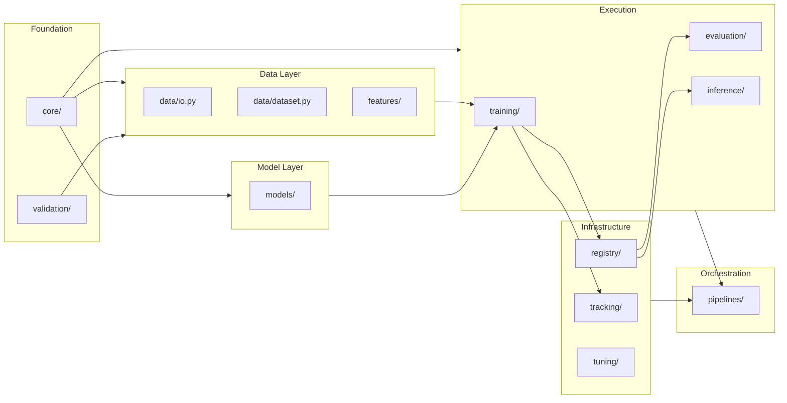
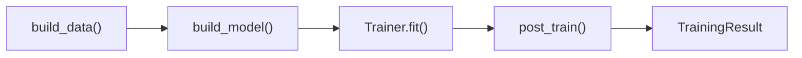
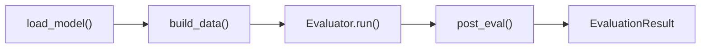
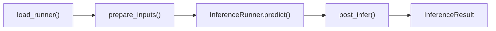
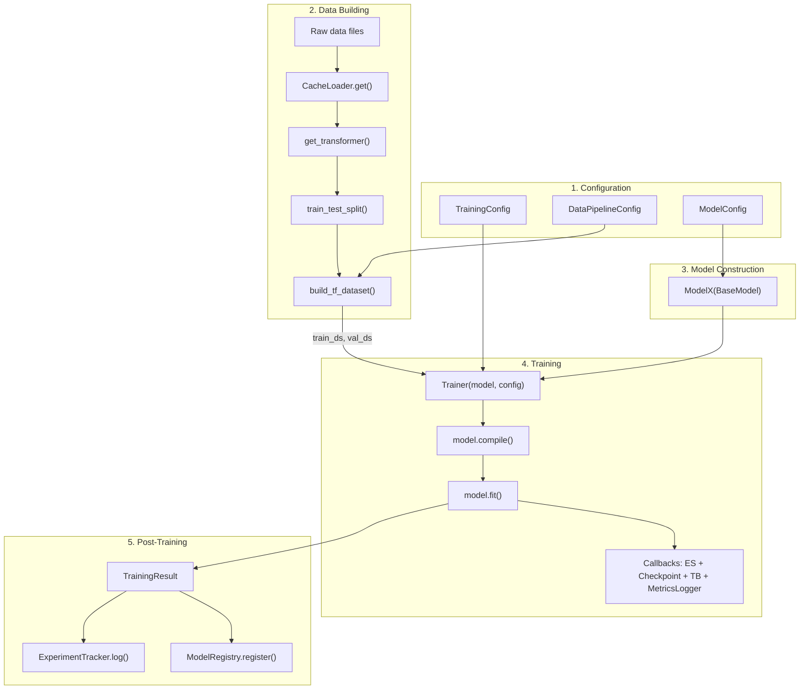
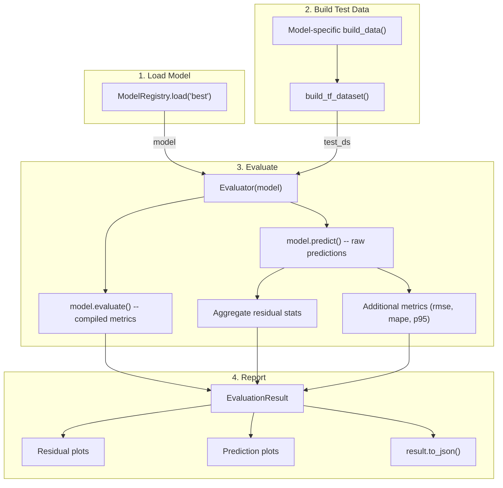
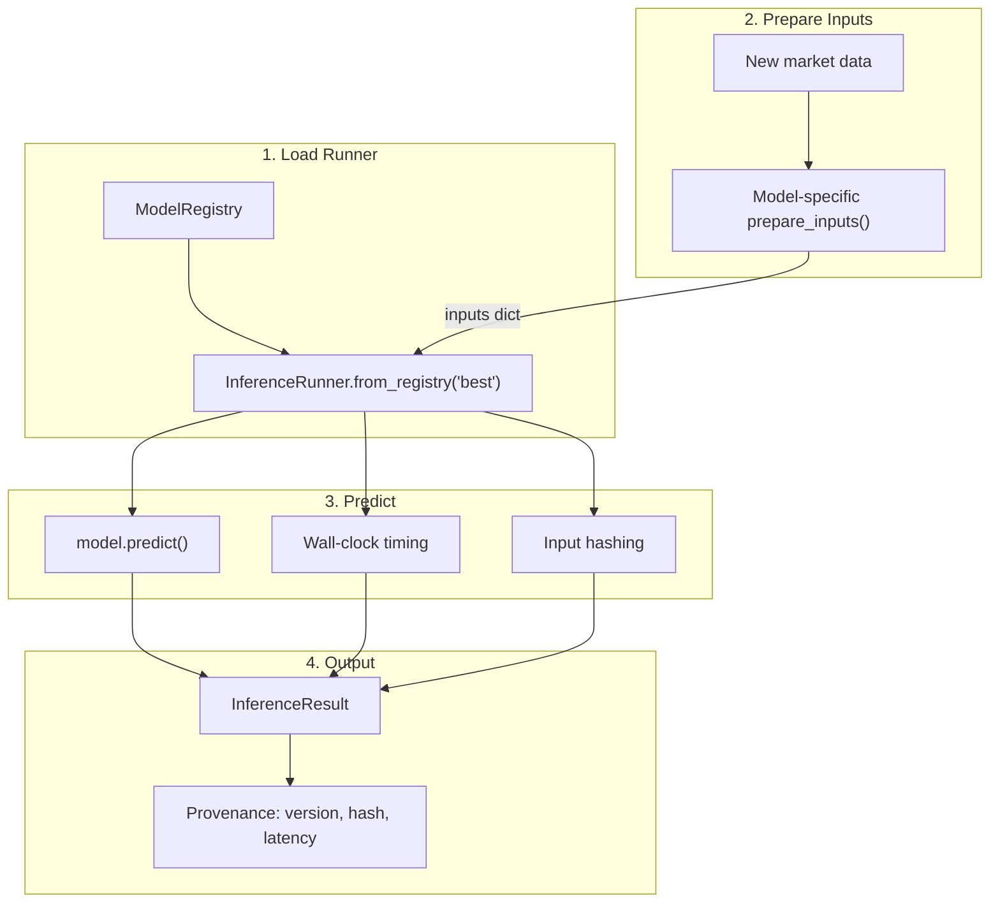
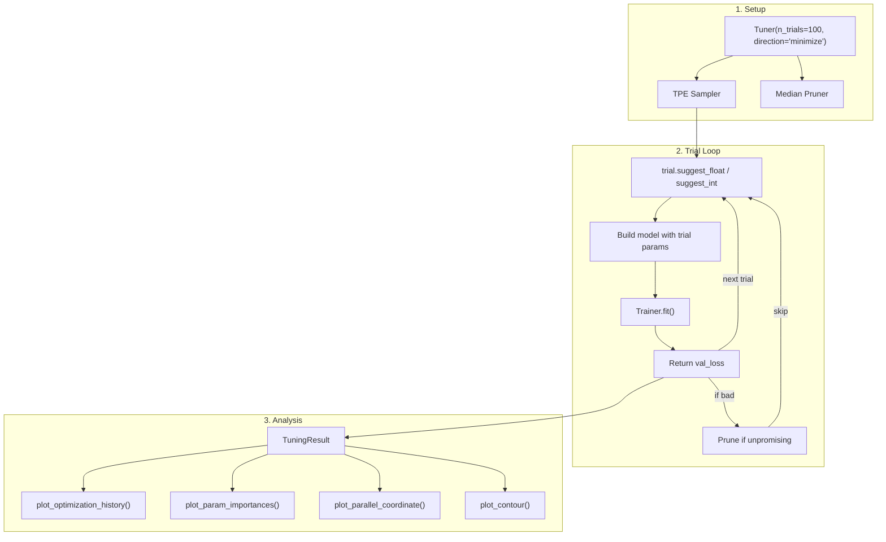

# rade_ml Framework Guide

## Overview

rade_ml is a production-grade machine learning framework designed for quantitative finance applications. It provides a model-independent infrastructure for training, evaluating, deploying, and tuning ML models with full provenance tracking, while supporting model-specific extensions through clean abstract interfaces.

The framework is built on TensorFlow/Keras and targets use cases such as full revaluation PnL prediction via static replication, derivative pricing, and calibration -- though its architecture is generic enough to accommodate any supervised learning model.

---

## Architecture

```
rade_ml/
  core/                 # Base classes, configs, result types
  data/                 # Dataset building, I/O, model-specific data builders
  features/             # Preprocessing transforms (sklearn wrappers)
  models/               # Model architectures (model-specific)
  training/             # Trainer, callbacks, LR schedules
  evaluation/           # Evaluator, metrics, diagnostic plots
  inference/            # InferenceRunner for production predictions
  registry/             # Model versioning and checkpoint storage
  tracking/             # Experiment logging and comparison
  tuning/               # Hyperparameter optimisation (Optuna)
  pipelines/            # Abstract pipeline orchestration
  utilities/            # Domain-specific helpers (graph builders, encoders)
  validation/           # Input validation, custom exceptions
```

### Dependency Flow



---

## Component Reference

### 1. core/ -- Foundation

The `core/` package provides the base classes and configuration dataclasses that every other module depends on.

#### core/base.py -- BaseModel

Abstract base class for all models. Inherits `tf.keras.Model` and adds metadata tracking, consistent serialisation, and architecture summary.

```python
from rade_ml.core.base import BaseModel

class MyModel(BaseModel):
    def __init__(self, units=64, **kwargs):
        super().__init__(name="my_model", **kwargs)
        self.dense = tf.keras.layers.Dense(units)

    def call(self, inputs, training=False):
        return self.dense(inputs["features"])

model = MyModel(units=128)
print(model.metadata)          # model name, class, framework version, timestamp
print(model.summary_dict())    # param counts, layer names
```

**Contract**: every model must implement `call(inputs, training)` where `inputs` is whatever your data builder emits (typically a dict of tensors).

#### core/config.py -- Configuration Dataclasses

All configuration is expressed as pure Python dataclasses with JSON serialisation.

| Dataclass | Purpose |
|---|---|
| `DataPipelineConfig` | Batch size, shuffle, cache, split ratios, transform type, seed |
| `TrainingConfig` | Epochs, optimizer, LR schedule, early stopping, checkpointing, loss, metrics |
| `OptimizerConfig` | Optimizer name + hyperparameters, with `.build()` to produce Keras optimizer |
| `LrScheduleConfig` | Schedule type + parameters, with `.build()` to produce Keras LR schedule |
| `EarlyStoppingConfig` | Patience, monitor, min_delta, restore_best_weights |
| `CheckpointConfig` | Save directory, frequency, monitor, best-only |
| `ReduceLrConfig` | Factor, patience, monitor, min_lr |

```python
from rade_ml.core.config import TrainingConfig, OptimizerConfig, EarlyStoppingConfig

config = TrainingConfig(
    epochs=200,
    optimizer=OptimizerConfig(name="adamw", learning_rate=3e-4, weight_decay=1e-5),
    early_stopping=EarlyStoppingConfig(patience=15),
    loss="mae",
    metrics=["mae", "mse"],
)

config.to_json("config.json")                   # persist
config = TrainingConfig.from_json("config.json") # reload
optimizer = config.optimizer.build()             # -> tf.keras.optimizers.AdamW
```

#### core/types.py -- Result Types

Canonical output containers used across the framework.

| Type | Produced by | Key fields |
|---|---|---|
| `TrainingResult` | `Trainer.fit()` | history, best_epoch, best_val_loss, training_time, config |
| `EvaluationResult` | `Evaluator.run()` | metrics, predictions, targets, residuals |
| `InferenceResult` | `InferenceRunner.predict()` | predictions, trade_ids, latency, model_version, input_hash |
| `CheckpointInfo` | Checkpoint callback | path, epoch, train_loss, val_loss, is_best |

All result types support `.to_json()` / `.from_json()` for persistence and audit.

---

### 2. data/ -- Data Layer

#### data/dataset.py -- build_tf_dataset

The single function for converting prepared arrays into a Keras-ready `tf.data.Dataset`.

```python
from rade_ml.data.dataset import build_tf_dataset
from rade_ml.core.config import DataPipelineConfig

config = DataPipelineConfig(batch_size=64, shuffle=True, cache=True)

# Pattern 1: Simple arrays
train_ds = build_tf_dataset(X_train, y_train, config)

# Pattern 2: Dict inputs with static data (e.g. GNN-RNN)
train_ds = build_tf_dataset(
    variable_inputs={"elem_pnl_history": elem_pnl},
    targets=target_pnl,
    config=config,
    static_inputs={
        "trade_features": features,
        "adjacency_matrix": adj,
    },
)
```

The function handles dtype casting, validation, batching, shuffling, caching, static input injection, and prefetching. It produces a dataset yielding `(inputs, targets)` tuples that Keras consumes directly.

#### data/io.py -- CacheLoader

Singleton-cached file I/O supporting `.pkl`, `.json`, `.csv`, and `.parquet`.

```python
from rade_ml.data.io import CacheLoader

# Load with caching (second call returns from memory)
portfolio = CacheLoader.get("portfolio", "data/portfolio.parquet")

# Direct load without caching
data = CacheLoader.load("data/raw.csv")

# Save
CacheLoader.save_data(results_df, "output/results.parquet")
```

#### data/result.py -- DataBuildResult

Base dataclass that every model-specific data builder must return.

```python
@dataclass
class DataBuildResult:
    train_ds: tf.data.Dataset
    val_ds: tf.data.Dataset
    test_ds: tf.data.Dataset
    metadata: dict
```

Model-specific subclasses add extra fields (scaler, graph structure, etc.) but the three dataset splits are the universal contract.

---

### 3. features/ -- Preprocessing

#### features/transforms/standardiser.py

Factory function wrapping sklearn scalers.

```python
from rade_ml.features.transforms import get_transformer

scaler = get_transformer("standard")   # -> StandardScaler
scaler = get_transformer("minmax")     # -> MinMaxScaler
scaler = get_transformer("robust")     # -> RobustScaler
scaler = get_transformer("power")      # -> PowerTransformer
```

#### features/transforms/dimensionality.py

Dimensionality reduction for high-dimensional trade universes. Uses SVD/PCA to determine effective rank, then pivoted QR for basis selection.

```python
from rade_ml.features.transforms.dimensionality import basis_selection_reduction

basis_trades = basis_selection_reduction(pnl_df, config, seed=42)
```

---

### 4. models/ -- Model Architectures

Model-specific packages live here. Each model has its own sub-package.

```
models/
  hybrid_gnn_rnn/
    model.py              # HybridGnnRnn(BaseModel) -- the full model
    config.py             # Model-specific architecture config
    layers/
      gnn_layers.py       # GraphSAGE, MixedGraphSAGE
      rnn_layers.py       # LSTM/GRU blocks
      attention_layer.py  # Target attention
      fusion_layer.py     # Gated cross-attention fusion
      projection_layer.py # Output projection with kNN
```

All models inherit `BaseModel` and implement `call(inputs, training)`.

---

### 5. training/ -- Training Infrastructure

#### training/trainer.py -- Trainer

High-level wrapper around `model.fit()` with automatic compilation, callback orchestration, and structured output.

```python
from rade_ml.training import Trainer
from rade_ml.core.config import TrainingConfig

config = TrainingConfig(epochs=100, loss="mae")
trainer = Trainer(model, config)

# Optional: override compile settings
trainer.compile(optimizer=custom_optimizer)

# Train
result = trainer.fit(train_ds, val_ds)

print(result.best_epoch)              # e.g. 47
print(result.best_val_loss)           # e.g. 0.00231
print(result.training_time_seconds)   # e.g. 142.3
result.plot_history()                 # loss curves
```

#### training/callbacks.py -- get_standard_callbacks

Factory that reads `TrainingConfig` and produces the appropriate Keras callbacks (EarlyStopping, ModelCheckpoint, ReduceLROnPlateau, TensorBoard, MetricsLogger).

```python
from rade_ml.training.callbacks import get_standard_callbacks

callbacks = get_standard_callbacks(config)
# Typically called internally by Trainer; rarely called directly
```

#### training/schedules.py -- WarmupCosineSchedule

Custom LR schedule with linear warmup then cosine decay.

```python
from rade_ml.training.schedules import WarmupCosineSchedule

schedule = WarmupCosineSchedule(
    initial_lr=1e-3,
    warmup_steps=500,
    decay_steps=9500,
    min_lr=1e-6,
)
```

---

### 6. evaluation/ -- Model Evaluation

#### evaluation/evaluator.py -- Evaluator

Runs inference on a test dataset and produces a structured `EvaluationResult`.

```python
from rade_ml.evaluation import Evaluator
from rade_ml.evaluation.metrics import rmse, mape

evaluator = Evaluator(model)
result = evaluator.run(
    test_ds,
    additional_metrics={"rmse": rmse, "mape": mape},
)

print(result.summary())
# ================================================
# EVALUATION RESULTS
# ================================================
# loss:                   0.001832
# mae:                    0.001832
# residual_p95:           0.004210
# rmse:                   0.002541
# ...
```

#### evaluation/metrics.py

Framework-agnostic metric functions operating on numpy arrays.

| Function | Description |
|---|---|
| `rmse(y_true, y_pred)` | Root Mean Squared Error |
| `mae(y_true, y_pred)` | Mean Absolute Error |
| `mse(y_true, y_pred)` | Mean Squared Error |
| `mape(y_true, y_pred)` | Mean Absolute Percentage Error (with zero-guard) |
| `r_squared(y_true, y_pred)` | Coefficient of determination |
| `max_absolute_error(y_true, y_pred)` | Worst-case error |
| `percentile_absolute_error(y_true, y_pred, p)` | Tail-risk metric (P95, P99) |

#### evaluation/plots/

Diagnostic visualisations accepting an `EvaluationResult`.

**Residual plots** (`evaluation/plots/residuals.py`):
- `plot_residual_distribution(result)` -- histogram + KDE + box plot
- `plot_qq(result)` -- QQ plot against standard normal
- `plot_residual_scatter(result)` -- residuals vs predicted with trend line
- `plot_residual_by_target(result)` -- per-target MAE bar chart

**Prediction plots** (`evaluation/plots/predictions.py`):
- `plot_predicted_vs_actual(result)` -- scatter with 45-degree reference
- `plot_error_distribution(result)` -- absolute error histogram with P95/P99
- `plot_cumulative_error(result)` -- empirical CDF of errors
- `plot_prediction_timeseries(result, target_idx)` -- time-series overlay

All plot functions accept an optional `save_path` for persisting figures.

---

### 7. inference/ -- Production Inference

#### inference/runner.py -- InferenceRunner

Loads a trained model and produces `InferenceResult` with full provenance.

```python
from rade_ml.inference import InferenceRunner

# From the model registry
runner = InferenceRunner.from_registry(registry, "best")

# From a direct path
runner = InferenceRunner.from_path("checkpoints/model.keras")

# Run inference
result = runner.predict(
    inputs=new_data_dict,
    trade_ids=target_trade_ids,
)

print(result.latency_seconds)   # forward pass timing
print(result.input_hash)        # deterministic hash for audit
print(result.model_version)     # registry version
```

The runner hashes inputs for reproducibility auditing, times the forward pass, and attaches full metadata to every prediction.

---

### 8. registry/ -- Model Versioning

#### registry/store.py -- ModelRegistry

Local filesystem registry storing checkpoints alongside structured metadata.

```python
from rade_ml.registry import ModelRegistry

registry = ModelRegistry(root_dir="./model_store")

# Register after training
entry = registry.register(
    model=trained_model,
    training_result=result,
    tags=["experiment-42", "gnn-rnn-v1"],
    description="2-layer GNN, 128 units, cosine LR",
)
print(entry.version)  # "20260127_143052_abc123"

# Load by tag
model, entry = registry.load("best")

# Find the best model across all versions
best = registry.get_best(metric="best_val_loss", mode="min")

# Tag management
registry.tag("20260127_143052_abc123", "prod")
registry.untag("20260127_143052_abc123", "staging")

# List all versions
for entry in registry.list_versions(tag_filter="gnn-rnn-v1"):
    print(entry)

# Delete a version
registry.delete("20260127_143052_abc123")
```

**Storage layout:**
```
model_store/
  20260127_143052_abc123/
    model.keras           # Keras SavedModel
    metadata.json         # RegistryEntry serialised
  20260128_091015_def456/
    model.keras
    metadata.json
  index.json              # tag -> version mapping
```

---

### 9. tracking/ -- Experiment Tracking

#### tracking/tracker.py -- ExperimentTracker

JSON-file-backed experiment log for audit and comparison.

```python
from rade_ml.tracking import ExperimentTracker

tracker = ExperimentTracker(store_dir="./experiments")

# Start a run
run = tracker.start_run(name="gnn-rnn-cosine-lr", tags=["lr-sweep"])

# Log config, result, and custom values
run.log_config(training_config)
run.log_result(training_result)
run.log_params({"dropout": 0.1, "gnn_layers": 2})
run.log_metric("test_p95", 0.0032)
run.set_model_version(entry.version)

# End and persist
tracker.end_run(run)

# Query runs
runs = tracker.list_runs(tag="lr-sweep", sort_by="best_val_loss")

# Compare runs side by side
df = tracker.compare_runs(
    ["run_abc123", "run_def456"],
    metrics=["best_val_loss", "best_train_loss"],
)
print(df)
```

**Storage layout:**
```
experiments/
  abc123def456/
    run.json    # human-readable JSON
  789012345678/
    run.json
```

---

### 10. tuning/ -- Hyperparameter Optimisation

#### tuning/tuner.py -- Tuner

Optuna-backed search with trial management, pruning, and analytics.

```python
from rade_ml.tuning import Tuner

def objective(trial):
    lr = trial.suggest_float("lr", 1e-5, 1e-2, log=True)
    units = trial.suggest_int("gnn_units", 32, 256, step=32)
    dropout = trial.suggest_float("dropout", 0.0, 0.5)

    model = MyModel(units=units, dropout=dropout)
    config = TrainingConfig(
        epochs=50,
        optimizer=OptimizerConfig(learning_rate=lr),
    )
    trainer = Trainer(model, config)
    result = trainer.fit(train_ds, val_ds)
    return result.best_val_loss

tuner = Tuner(n_trials=100, direction="minimize", pruner="median", seed=42)
result = tuner.run(objective)

print(result.best_params)    # {"lr": 0.00032, "gnn_units": 128, "dropout": 0.15}
print(result.best_value)     # 0.00187
result.to_json("tuning_results.json")
```

#### tuning/plots.py -- Tuning Visualisations

```python
from rade_ml.tuning import plot_optimization_history, plot_param_importances
from rade_ml.tuning import plot_parallel_coordinate, plot_contour, plot_slice

# From serialised result (no live study needed)
plot_optimization_history(result)

# From live study (Optuna's internal visualisation)
plot_param_importances(tuner.study)
plot_parallel_coordinate(tuner.study)
plot_contour(tuner.study, params=["lr", "gnn_units"])
plot_slice(tuner.study, params=["lr", "dropout"])
```

---

### 11. pipelines/ -- Orchestration

#### pipelines/base.py -- Abstract Pipeline Classes

Three abstract base classes define the contract for end-to-end workflows.

**TrainPipeline:**



**EvalPipeline:**



**InferencePipeline:**



#### pipelines/config.py -- PipelineConfig

Aggregates references to training config, data config, model config, and infrastructure paths.

```python
from rade_ml.pipelines import PipelineConfig

config = PipelineConfig(
    training_config={"epochs": 100, "loss": "mae"},
    data_config={"batch_size": 64, "shuffle": True},
    model_config={"gnn_units": 128, "rnn_units": 64},
    registry_dir="./model_store",
    tracking_dir="./experiments",
    version_or_tag="best",
    metadata={"run_name": "prod-retrain", "tags": ["production"]},
)
```

---

### 12. validation/ -- Input Validation

Custom exceptions (`MissingKeyFields`, `UndefinedModelArchitecture`, `UndefinedLayerType`, etc.) and validation helpers.

```python
from rade_ml.validation.base import validate_dict_keys

validate_dict_keys(
    input_dict=data,
    keys=["trade_features", "adjacency_matrix", "pnl_history"],
)
# Raises MissingKeyFields if any key is absent
```

---

## Workflow Diagrams

### Training Workflow



### Evaluation Workflow



### Inference Workflow



### Tuning Workflow



---

## Adding a New Model

This section walks through exactly what you need to implement to add a new model (`model_x`) to the framework.

### Step 1: Define the Model Architecture

Create `models/model_x/model.py`:

```python
import tensorflow as tf
from rade_ml.core.base import BaseModel

class ModelX(BaseModel):
    """
    Your model description.
    """

    def __init__(self, units: int = 64, dropout: float = 0.1, **kwargs):
        super().__init__(name="model_x", **kwargs)
        self.hidden = tf.keras.layers.Dense(units, activation="relu")
        self.dropout = tf.keras.layers.Dropout(dropout)
        self.output_layer = tf.keras.layers.Dense(1)

    def call(self, inputs, training=False):
        # inputs is the dict your data builder produces
        x = inputs["features"]
        x = self.hidden(x)
        x = self.dropout(x, training=training)
        return self.output_layer(x)

    def get_config(self):
        config = super().get_config()
        config.update({"units": self.hidden.units})
        return config
```

If your model has custom layers, place them in `models/model_x/layers/`.

### Step 2: Define Model-Specific Data Config

Create `data/model_x/config.py`:

```python
from dataclasses import dataclass
from rade_ml.core.config import DataPipelineConfig

@dataclass
class ModelXDataConfig(DataPipelineConfig):
    """Extends base config with model-specific data settings."""
    feature_columns: list = None
    target_column: str = "pnl"
    lookback_window: int = 20
```

### Step 3: Implement the Data Builder

Create `data/model_x/build.py`:

```python
from dataclasses import dataclass, field
from typing import Any

from sklearn.model_selection import train_test_split

from rade_ml.data.result import DataBuildResult
from rade_ml.data.dataset import build_tf_dataset
from rade_ml.data.io import CacheLoader
from rade_ml.features.transforms import get_transformer

@dataclass
class ModelXDataResult(DataBuildResult):
    """Model-specific data result with scaler for inverse transform."""
    scaler: Any = None

def build_model_x_data(config, data_paths):
    """
    End-to-end data pipeline for ModelX.

    Returns a ModelXDataResult with train/val/test datasets.
    """
    # 1. Load raw data
    raw_data = CacheLoader.get("raw", data_paths["features"])
    targets = CacheLoader.get("targets", data_paths["targets"])

    # 2. Preprocess
    scaler = get_transformer(config.transform_type)
    X_scaled = scaler.fit_transform(raw_data)

    # 3. Split
    X_train, X_temp, y_train, y_temp = train_test_split(
        X_scaled, targets, test_size=config.validation_split + config.test_split,
        random_state=config.seed,
    )
    relative_test = config.test_split / (config.validation_split + config.test_split)
    X_val, X_test, y_val, y_test = train_test_split(
        X_temp, y_temp, test_size=relative_test, random_state=config.seed,
    )

    # 4. Build tf.data.Datasets
    train_ds = build_tf_dataset(
        variable_inputs={"features": X_train}, targets=y_train, config=config,
    )
    val_ds = build_tf_dataset(
        variable_inputs={"features": X_val}, targets=y_val, config=config,
    )
    test_ds = build_tf_dataset(
        variable_inputs={"features": X_test}, targets=y_test, config=config,
    )

    return ModelXDataResult(
        train_ds=train_ds,
        val_ds=val_ds,
        test_ds=test_ds,
        scaler=scaler,
        metadata={"n_train": len(X_train), "n_val": len(X_val), "n_test": len(X_test)},
    )
```

### Step 4: Implement Pipeline Subclasses

Create `pipelines/model_x/train.py`:

```python
from rade_ml.pipelines import TrainPipeline, PipelineConfig
from rade_ml.data.result import DataBuildResult
from data.model_x.build import build_model_x_data
from data.model_x.config import ModelXDataConfig
from models.model_x.model import ModelX

class ModelXTrainPipeline(TrainPipeline):

    def build_data(self, config: PipelineConfig) -> DataBuildResult:
        data_config = ModelXDataConfig(**config.data_config)
        return build_model_x_data(data_config, config.metadata.get("data_paths", {}))

    def build_model(self, config: PipelineConfig, data_result) -> ModelX:
        model_config = config.model_config or {}
        return ModelX(**model_config)
```

Create `pipelines/model_x/eval.py`:

```python
from rade_ml.pipelines import EvalPipeline, PipelineConfig
from rade_ml.data.result import DataBuildResult
from data.model_x.build import build_model_x_data
from data.model_x.config import ModelXDataConfig

class ModelXEvalPipeline(EvalPipeline):

    def build_data(self, config: PipelineConfig) -> DataBuildResult:
        data_config = ModelXDataConfig(**config.data_config)
        return build_model_x_data(data_config, config.metadata.get("data_paths", {}))
```

Create `pipelines/model_x/infer.py`:

```python
from rade_ml.pipelines import InferencePipeline, PipelineConfig

class ModelXInferencePipeline(InferencePipeline):

    def prepare_inputs(self, config: PipelineConfig) -> dict:
        # Load and preprocess new data for inference
        # Must return {"inputs": ..., "trade_ids": [...]}
        ...
        return {"inputs": prepared_dict, "trade_ids": trade_ids}
```

### Step 5: Run

```python
from rade_ml.pipelines import PipelineConfig

config = PipelineConfig(
    training_config={"epochs": 100, "loss": "mae"},
    data_config={"batch_size": 64, "shuffle": True},
    model_config={"units": 128, "dropout": 0.1},
    registry_dir="./model_store",
    tracking_dir="./experiments",
    metadata={
        "run_name": "model_x_v1",
        "tags": ["baseline"],
        "data_paths": {"features": "data/features.parquet", "targets": "data/targets.parquet"},
    },
)

# Train
pipeline = ModelXTrainPipeline(config)
result = pipeline.run()

# Evaluate
eval_config = PipelineConfig(**{**config.__dict__, "version_or_tag": "latest"})
eval_pipeline = ModelXEvalPipeline(eval_config)
eval_result = eval_pipeline.run()

# Inference
infer_pipeline = ModelXInferencePipeline(eval_config)
infer_result = infer_pipeline.run()
```

### File Structure Checklist for a New Model

```
rade_ml/
  models/
    model_x/
      __init__.py
      model.py              # ModelX(BaseModel)
      config.py             # Architecture config (optional)
      layers/               # Custom layers (if any)
        __init__.py
        custom_layer.py
  data/
    model_x/
      __init__.py
      config.py             # ModelXDataConfig(DataPipelineConfig)
      build.py              # build_model_x_data() -> ModelXDataResult
      plots.py              # Data diagnostic plots (optional)
  pipelines/
    model_x/
      __init__.py
      train.py              # ModelXTrainPipeline(TrainPipeline)
      eval.py               # ModelXEvalPipeline(EvalPipeline)
      infer.py              # ModelXInferencePipeline(InferencePipeline)
```

---

## Standalone Usage (Without Pipelines)

Pipelines are optional. Every component works independently:

```python
import tensorflow as tf
from rade_ml.core.config import TrainingConfig, DataPipelineConfig
from rade_ml.data.dataset import build_tf_dataset
from rade_ml.training import Trainer
from rade_ml.evaluation import Evaluator
from rade_ml.evaluation.metrics import rmse, mape
from rade_ml.registry import ModelRegistry
from rade_ml.inference import InferenceRunner

# 1. Build data
config = DataPipelineConfig(batch_size=64, shuffle=True)
train_ds = build_tf_dataset(X_train, y_train, config)
val_ds = build_tf_dataset(X_val, y_val, config)
test_ds = build_tf_dataset(X_test, y_test, config)

# 2. Build model
model = MyModel(units=128)

# 3. Train
trainer = Trainer(model, TrainingConfig(epochs=100))
result = trainer.fit(train_ds, val_ds)

# 4. Evaluate
evaluator = Evaluator(model)
eval_result = evaluator.run(test_ds, additional_metrics={"rmse": rmse, "mape": mape})
print(eval_result.summary())

# 5. Register
registry = ModelRegistry("./model_store")
entry = registry.register(model, result, tags=["v1"])

# 6. Inference (later, possibly different process)
runner = InferenceRunner.from_registry(registry, "v1")
pred_result = runner.predict(new_inputs, trade_ids=["trade_001"])
```

---

## Reproducibility and Audit

The framework provides end-to-end reproducibility:

| Concern | How it's handled |
|---|---|
| **Random seeds** | `TrainingConfig.seed` sets TF and numpy seeds in `Trainer._setup_environment()` |
| **Config tracking** | All configs are JSON-serialisable; `TrainingResult.config` stores the exact config used |
| **Model versioning** | `ModelRegistry` stores checkpoint + metadata with unique version IDs |
| **Experiment logging** | `ExperimentTracker` logs config, metrics, model version per run |
| **Prediction provenance** | `InferenceResult` carries model_version, model_path, input_hash, timestamp |
| **Data lineage** | `DataBuildResult.metadata` carries split sizes, file paths, transform parameters |

Every prediction can be traced back through: `InferenceResult.model_version` -> `RegistryEntry` -> `TrainingResult.config` -> exact hyperparameters and data config.

---

## Logging

The framework uses Python's standard `logging` module. Every module creates its own logger:

```python
import logging
logger = logging.getLogger(__name__)
```

To enable framework logging:

```python
import logging
logging.basicConfig(level=logging.INFO)

# Or target specific modules
logging.getLogger("rade_ml.training").setLevel(logging.DEBUG)
logging.getLogger("rade_ml.registry").setLevel(logging.INFO)
```

Key log events:
- `Trainer`: compilation, training start/end, timing
- `Evaluator`: evaluation timing, sample count, loss
- `InferenceRunner`: inference timing, scenario count
- `ModelRegistry`: register, load, tag/untag, delete
- `ExperimentTracker`: run start/end, persist events
- `Tuner`: trial completion, best trial summary

---

## Error Handling

Custom exceptions in `validation/exceptions.py`:

| Exception | When raised |
|---|---|
| `MissingKeyFields` | Required dict keys missing from input data |
| `UndefinedModelArchitecture` | Unknown model type requested |
| `UndefinedLayerType` | Unknown layer type in config |
| `UndefinedTransformerType` | Unknown scaler/transformer name |
| `UndefinedReductionType` | Unknown dimensionality reduction method |
| `UndefinedComputationMethod` | Unknown SVD/PCA method |
| `CacheLoaderError` | Base exception for file I/O failures |
| `UnsupportedFileTypeError` | File extension not supported (.pkl, .json, .csv, .parquet) |
| `FileLoadError` | File reading or parsing failure |
| `FileSaveError` | File writing failure |

---

## Summary: Model-Independent vs Model-Dependent

| Component | Model-independent | Model-dependent |
|---|---|---|
| `core/` | **All** (BaseModel, configs, types) | -- |
| `data/dataset.py` | **build_tf_dataset** | -- |
| `data/io.py` | **CacheLoader** | -- |
| `data/model_x/` | -- | **build.py, config.py** |
| `features/` | **All** (scalers, dimensionality) | -- |
| `models/model_x/` | -- | **model.py, layers/** |
| `training/` | **All** (Trainer, callbacks, schedules) | -- |
| `evaluation/` | **All** (Evaluator, metrics, plots) | -- |
| `inference/` | **All** (InferenceRunner) | -- |
| `registry/` | **All** (ModelRegistry) | -- |
| `tracking/` | **All** (ExperimentTracker) | -- |
| `tuning/` | **All** (Tuner, plots) | Objective function body only |
| `pipelines/base.py` | **All** (abstract base classes) | -- |
| `pipelines/model_x/` | -- | **train.py, eval.py, infer.py** |
| `validation/` | **All** (exceptions, validators) | -- |
| `utilities/` | -- | **Model-specific** (graph builder, attribute encoder) |

**Ratio**: approximately 70% generic infrastructure, 30% model-specific code per model.
