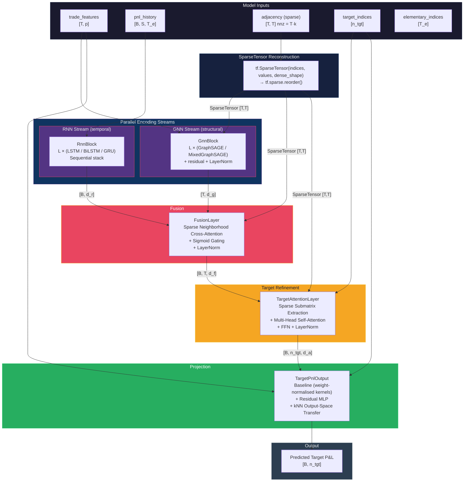
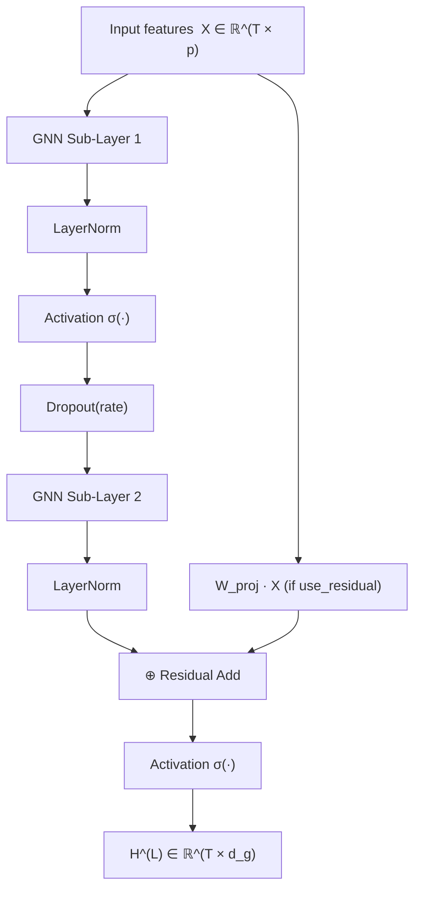

# HybridGnnRnn — Technical Model Documentation

> **Model class**: `src.rade_ml.models.hybrid_gnn_rnn.model.HybridGnnRnn`
> **Framework**: TensorFlow / Keras 3
> **Version**: 1.0
> **Authors**: Quantitative Research
> **Classification**: Internal — Model Risk

---

## Table of Contents

1. [Executive Summary](#1-executive-summary)
2. [Motivation and Objectives](#2-motivation-and-objectives)
3. [Industry Use Cases](#3-industry-use-cases)
4. [Architecture Overview](#4-architecture-overview)
5. [Data Pipeline](#5-data-pipeline)
6. [Layer-by-Layer Technical Detail](#6-layer-by-layer-technical-detail)
   - 6.1 [GnnBlock — Structural Embedding](#61-gnnblock--structural-embedding)
   - 6.2 [RnnBlock — Temporal Embedding](#62-rnnblock--temporal-embedding)
   - 6.3 [FusionLayer — Cross-Modal Attention with Gating](#63-fusionlayer--cross-modal-attention-with-gating)
   - 6.4 [TargetAttentionLayer — Inter-Trade Self-Attention](#64-targetattentionlayer--inter-trade-self-attention)
   - 6.5 [TargetPnlOutput — Dynamic Projection with kNN Transfer](#65-targetpnloutput--dynamic-projection-with-knn-transfer)
7. [Sparse Tensor Design and Scalability](#7-sparse-tensor-design-and-scalability)
8. [Loss Function and Training Objective](#8-loss-function-and-training-objective)
9. [Inference and Generalisation to New Trades](#9-inference-and-generalisation-to-new-trades)
10. [Hyperparameter Reference](#10-hyperparameter-reference)
11. [Numerical Stability and Reproducibility](#11-numerical-stability-and-reproducibility)
12. [Computational Complexity](#12-computational-complexity)
13. [Limitations and Future Work](#13-limitations-and-future-work)
14. [References](#14-references)

---

## 1. Executive Summary

**HybridGnnRnn** is a graph-temporal deep learning model designed for portfolio-level Profit & Loss (P&L) simulation. It jointly learns:

- **Structural relationships** between financial instruments (trades) via a Graph Neural Network (GNN) operating over a k-nearest-neighbor trade similarity graph.
- **Temporal dynamics** of portfolio P&L via a Recurrent Neural Network (RNN) operating over historical scenario time series.

The two representation streams are fused via a gated cross-attention mechanism, then projected to per-target-trade P&L predictions. The architecture is **inductive**: it generalises to unseen trades at inference time without retraining, using attribute-space nearest-neighbor transfer.

---

## 2. Motivation and Objectives

### 2.1 The Problem

Traditional approaches to portfolio P&L simulation fall into two categories:

1. **Full revaluation**: Re-price every instrument under each scenario using analytic or Monte Carlo engines. Accurate but computationally prohibitive for large portfolios ($\mathcal{O}(T \times S)$ pricing calls, where $T$ = trades, $S$ = scenarios).
2. **Taylor approximation (Greeks-based)**: Fast but inaccurate for large market moves, path-dependent products, or non-linear payoffs.

Neither approach captures the **cross-instrument correlation structure** inherent in a real portfolio, nor do they generalise to newly onboarded trades without re-running the full pipeline.

### 2.2 The Objective

HybridGnnRnn aims to:

1. **Learn a compressed, graph-aware representation** of the portfolio that captures how each trade's P&L co-moves with its structural neighbors (similar delta, vega, maturity, underlying, etc.).
2. **Model temporal regime dynamics** via recurrent processing of historical P&L scenarios, capturing autocorrelation, volatility clustering, and regime shifts.
3. **Fuse both streams** in a principled attention-based framework where the graph structure constrains which trades can influence each other, preventing attention weight dilution across unrelated instruments.
4. **Project to target-trade P&L** using a dual baseline + residual architecture that separates the learned amplitude (scale) from the learned shape (direction), enabling stable transfer to unseen trades via kNN output-space mixing.
5. **Scale to production portfolios** of 10,000+ trades with sub-quadratic memory via sparse neighborhood attention.

### 2.3 Design Principles

| Principle | Implementation |
|---|---|
| **Inductive** | GNN uses sampling-based aggregation (GraphSAGE [1]), not spectral filters tied to a fixed graph |
| **Sparse-first** | Adjacency stored as `tf.SparseTensor`; attention is $\mathcal{O}(T \cdot k)$ not $\mathcal{O}(T^2)$ |
| **Modular** | Each layer is independently configurable, serializable, and testable |
| **Transfer-capable** | Projection layer uses kNN output-space mixing for zero-shot new trade P&L |
| **Deterministic** | Full seed control for regulatory reproducibility |

---

## 3. Industry Use Cases

### 3.1 Front Office — Real-Time P&L Prediction

Desk-level P&L prediction for intra-day risk monitoring. The model replaces full revaluation for peripheral trades while the pricing engine focuses on material positions.

### 3.2 Risk Management — Scenario Analysis and Stress Testing

Generate portfolio P&L distributions under historical or hypothetical stress scenarios (e.g., 2008 credit crisis, 2020 COVID drawdown, bespoke regulatory scenarios). The graph structure ensures correlated instruments move together under stress.

### 3.3 xVA / Counterparty Credit Risk

Approximate CVA/DVA exposure profiles by simulating portfolio-level P&L paths. The temporal component captures wrong-way risk dynamics; the graph component models netting set dependencies.

### 3.4 Portfolio Construction and Optimisation

Evaluate the marginal impact of adding or removing trades from a portfolio. The inductive architecture allows scoring candidate trades without retraining.

### 3.5 Model Risk Management

Serve as a challenger model to production pricing engines, flagging instruments or scenarios where the pricing engine and the learned model diverge beyond tolerance.

### 3.6 Trade Lifecycle — New Trade Onboarding

When a new instrument is onboarded, extend the trade graph with its attribute-derived edges and generate P&L predictions immediately using kNN transfer from similar calibrated trades.

---

## 4. Architecture Overview

### 4.1 Model Workflow



### 4.2 Data Pipeline Workflow

```mermaid
flowchart LR
    subgraph raw ["Raw Data"]
        EP["Elementary P&L<br/>(S × T_e)"]
        TP["Target P&L<br/>(S × n_tgt)"]
        EA["Elementary Attrs"]
        TA["Target Attrs"]
    end

    subgraph preprocess ["Preprocessing"]
        STD["StandardScaler<br/>(z-score per trade)"]
        DIM["Dimensionality Reduction<br/>SVD + Pivoted QR<br/>basis selection"]
        ENC["TradeAttributeEncoder<br/>numeric · categorical · TTM decay"]
    end

    subgraph graph ["Graph Construction"]
        KNN["k-NN Graph Builder<br/>Euclidean distance on<br/>encoded attributes"]
        SP["tf.SparseTensor<br/>row-normalised weights"]
    end

    subgraph dataset ["tf.data.Dataset"]
        DS["Dataset Assembly<br/>variable: pnl_history [B,S,T_e]<br/>static: trade_features, adj components,<br/>elementary_idx, target_idx"]
    end

    EP --> STD
    TP --> STD
    STD --> DIM
    EA --> ENC
    TA --> ENC
    ENC --> KNN
    KNN --> SP
    DIM --> DS
    SP --> DS
    ENC --> DS

    style raw fill:#1a1a2e,stroke:#16213e,color:#eee
    style preprocess fill:#0f3460,stroke:#533483,color:#eee
    style graph fill:#533483,stroke:#e94560,color:#eee
    style dataset fill:#27ae60,stroke:#2ecc71,color:#fff
```

### 4.3 Tensor Dimensions Reference

| Symbol | Meaning | Typical Range |
|---|---|---|
| $T$ | Total trades (elementary + target) | 100 — 50,000+ |
| $T_e$ | Elementary trades (basis trades after dimensionality reduction) | 10 — 5,000 |
| $n_\text{tgt}$ | Target trades to predict | 1 — 500 |
| $B$ | Batch size (number of scenario windows) | 16 — 128 |
| $S$ | Sequence length (lookback window) | 1 — 252 |
| $p$ | Encoded trade attribute dimension | 10 — 50 |
| $k$ | k-NN graph degree | 4 — 100 |
| $d_g$ | GNN output dimension | 64 — 256 |
| $d_r$ | RNN output dimension | 64 — 256 |
| $d_f$ | Fusion output dimension | 32 — 128 |
| $d_a$ | Attention output dimension | 16 — 64 |
| $h$ | Number of attention heads | 1 — 8 |
| $d_h$ | Per-head dimension ($= d_f / h$) | 8 — 64 |

---

## 5. Data Pipeline

The data pipeline (`src.rade_ml.data.hybrid_gnn_rnn.build`) transforms raw portfolio data into model-ready `tf.data.Dataset` objects through the following stages.

### 5.1 P&L Loading and Standardisation

Elementary and target P&L matrices are loaded and standardised (zero mean, unit variance) using a fitted `StandardScaler`. For each trade $i$ with raw P&L vector $\mathbf{p}_i \in \mathbb{R}^S$:

$$\tilde{p}_{i,s} = \frac{p_{i,s} - \hat{\mu}_i}{\hat{\sigma}_i}, \quad \hat{\mu}_i = \frac{1}{S}\sum_s p_{i,s}, \quad \hat{\sigma}_i = \sqrt{\frac{1}{S-1}\sum_s (p_{i,s} - \hat{\mu}_i)^2}$$

The scaler parameters $(\hat{\mu}_i, \hat{\sigma}_i)$ are stored for inverse-transforming predictions back to P&L space at inference.

### 5.2 Dimensionality Reduction (Basis Selection)

For large portfolios where $T_e \gg d_r$, a pivoted QR decomposition on the SVD-compressed P&L covariance matrix selects a representative subset of elementary trades (the "basis"). Given the standardised P&L matrix $\tilde{\mathbf{P}} \in \mathbb{R}^{S \times T_e}$:

1. **Truncated SVD**: $\tilde{\mathbf{P}} = \mathbf{U} \boldsymbol{\Sigma} \mathbf{V}^\top$, retaining the top-$r$ singular values that capture $\geq 95\%$ of the variance.

2. **Pivoted QR on right singular vectors**: $\mathbf{V}_{:,1:r}^\top = \mathbf{Q}\mathbf{R}\boldsymbol{\Pi}^\top$, where $\boldsymbol{\Pi}$ is the column permutation matrix.

3. **Basis selection**: The first $r$ columns of $\boldsymbol{\Pi}$ identify the $r$ elementary trades that best span the dominant modes of P&L variation:

$$\text{basis} = \{\pi_1, \pi_2, \ldots, \pi_r\} \subset \{1, \ldots, T_e\}$$

This reduces the RNN input from $T_e$ to $r$ while preserving the spectral energy of the covariance structure.

### 5.3 Trade Attribute Encoding

Raw trade attributes (moneyness, maturity, Greeks, product type, etc.) are encoded into a fixed-length numeric vector $\mathbf{x}_i \in \mathbb{R}^p$ per trade by the `TradeAttributeEncoder`:

- **Numeric fields** (moneyness, delta, vega): standard-scaled to zero mean, unit variance.
- **Categorical fields** (product_type, product_subtype, trade_type): one-hot or ordinal encoded.
- **Time-to-maturity**: exponential decay features at multiple decay rates $\lambda_j$: $\phi_j(\tau_i) = e^{-\lambda_j \tau_i}$, providing multi-scale temporal resolution.
- **Multi-label fields** (underlying_risk_factors): multi-hot binary encoding.

### 5.4 Trade Graph Construction (k-NN)

A k-nearest-neighbor graph $\mathcal{G} = (\mathcal{V}, \mathcal{E})$ is built over the encoded attribute space. For each trade $v$, its $k$ nearest neighbours by Euclidean distance are connected:

$$\mathcal{N}(v) = \underset{u \in \mathcal{V} \setminus \{v\}}{\text{argmin-}k}\; \|\mathbf{x}_v - \mathbf{x}_u\|_2$$

The adjacency matrix $\mathbf{A} \in \mathbb{R}^{T \times T}$ is stored as a `tf.SparseTensor` with **row-normalised** weights:

$$a_{vu} = \begin{cases} \frac{1}{|\mathcal{N}(v)|} & \text{if } u \in \mathcal{N}(v) \\ 0 & \text{otherwise} \end{cases}$$

Row normalisation ensures that $\sum_u a_{vu} = 1$ for all $v$, making the mean aggregation in GraphSAGE a proper weighted average.

### 5.5 Dataset Assembly

The static tensors (trade features, adjacency components, index arrays) and per-scenario tensors (P&L windows) are combined into a `tf.data.Dataset`. The adjacency SparseTensor is decomposed into three dense component tensors for serialization compatibility:

| Tensor | Shape | Dtype | Description |
|---|---|---|---|
| `adjacency_indices` | $[\text{nnz}, 2]$ | int64 | Row-column pairs of non-zero entries |
| `adjacency_values` | $[\text{nnz}]$ | float32 | Edge weights |
| `adjacency_dense_shape` | $[2]$ | int64 | $[T, T]$ |

These are reassembled and reordered to row-major canonical form inside the model's `call()` method via `tf.sparse.reorder(tf.SparseTensor(...))`.

---

## 6. Layer-by-Layer Technical Detail

### 6.1 GnnBlock — Structural Embedding

**File**: `layers/gnn_layers.py`
**Input**: $(X, \mathbf{A})$ where $X \in \mathbb{R}^{T \times p}$ (trade features), $\mathbf{A} \in \mathbb{R}^{T \times T}$ (sparse adjacency)
**Output**: $\mathbf{H}^{(L)} \in \mathbb{R}^{T \times d_g}$
**Parameters**: $\mathcal{O}(L \cdot d_g^2)$ for $L$ sub-layers with hidden dimension $d_g$

#### 6.1.1 Purpose

Learns a $d_g$-dimensional embedding for every trade that encodes both its own attributes and its structural position in the portfolio graph. The inductive formulation (GraphSAGE [1]) ensures the learned weight matrices are independent of the specific graph topology, enabling inference on modified graphs at deployment.

#### 6.1.2 Block Architecture

The GnnBlock stacks $L$ GNN sub-layers with inter-layer regularisation:



Formally, for a block with $L$ sub-layers indexed $l = 0, \ldots, L-1$:

$$\mathbf{H}^{(0)} = X \in \mathbb{R}^{T \times p}$$

$$\mathbf{Z}^{(l)} = \text{GNNSubLayer}^{(l)}\!\left(\mathbf{H}^{(l)},\, \mathbf{A}\right) \in \mathbb{R}^{T \times d_g}$$

$$\hat{\mathbf{H}}^{(l)} = \text{LayerNorm}\!\left(\mathbf{Z}^{(l)}\right)$$

$$\mathbf{H}^{(l+1)} = \text{Dropout}\!\left(\sigma\!\left(\hat{\mathbf{H}}^{(l)}\right)\right) \quad \text{for } l < L-1$$

$$\mathbf{H}^{(L)} = \sigma\!\left(\mathbf{Z}^{(L-1)} + \mathbf{W}_{\text{proj}}\, \mathbf{H}^{(0)}\right)$$

where $\mathbf{W}_{\text{proj}} \in \mathbb{R}^{d_g \times p}$ is a learned projection aligning the input dimension to the GNN output dimension for the residual connection. LayerNorm is applied per-feature across the trade dimension with learned affine parameters $\gamma, \beta \in \mathbb{R}^{d_g}$:

$$\text{LayerNorm}(\mathbf{z}) = \gamma \odot \frac{\mathbf{z} - \mu}{\sqrt{\sigma^2 + \epsilon}} + \beta, \quad \mu = \frac{1}{d_g}\sum_j z_j, \quad \sigma^2 = \frac{1}{d_g}\sum_j (z_j - \mu)^2$$

#### 6.1.3 GraphSAGE Sub-Layer

Following Hamilton et al. [1], the inductive GraphSAGE update rule for trade $v$ at layer $l$ is:

$$\mathbf{h}_v^{(l+1)} = \sigma\!\left(\mathbf{W}_{\text{self}}^{(l)} \, \mathbf{h}_v^{(l)} \;+\; \mathbf{W}_{\text{neigh}}^{(l)} \, \text{AGG}\!\left(\left\{\mathbf{h}_u^{(l)} : u \in \mathcal{N}(v)\right\}\right)\right)$$

where:

- $\mathbf{h}_v^{(l)} \in \mathbb{R}^{d_l}$ is the feature representation of trade $v$ at depth $l$, with $d_0 = p$ (input), $d_l = d_g$ for $l \geq 1$.
- $\mathcal{N}(v) = \{u : a_{vu} > 0\}$ is the neighbor set from the k-NN adjacency.
- $\mathbf{W}_{\text{self}}^{(l)} \in \mathbb{R}^{d_{l+1} \times d_l}$ transforms the node's own representation.
- $\mathbf{W}_{\text{neigh}}^{(l)} \in \mathbb{R}^{d_{l+1} \times d_l}$ transforms the aggregated neighbor signal.
- $\sigma(\cdot)$ is the non-linearity (ReLU by default; the final sub-layer uses the block activation).

**Mean aggregation** (default). Since $\mathbf{A}$ is row-normalised, the mean aggregation is computed as a single sparse matrix-dense matrix product:

$$\text{AGG}_{\text{mean}}^{(l)} = \mathbf{A}\,\mathbf{H}^{(l)} \in \mathbb{R}^{T \times d_l}$$

$$\left[\text{AGG}_{\text{mean}}^{(l)}\right]_v = \sum_{u=1}^{T} a_{vu}\, \mathbf{h}_u^{(l)} = \frac{1}{|\mathcal{N}(v)|}\sum_{u \in \mathcal{N}(v)} \mathbf{h}_u^{(l)}$$

Implemented via `tf.sparse.sparse_dense_matmul(A, H)` in $\mathcal{O}(\text{nnz} \cdot d_l)$ time and $\mathcal{O}(T \cdot d_l)$ memory.

**Max aggregation**. The element-wise maximum over neighbor features:

$$\left[\text{AGG}_{\text{max}}^{(l)}\right]_{v,j} = \max_{u \in \mathcal{N}(v)} h_{u,j}^{(l)}, \quad j = 1, \ldots, d_l$$

Implemented via `tf.math.unsorted_segment_max` over the sparse edge list: for each edge $(v, u)$, gather $\mathbf{h}_u^{(l)}$ and take per-segment maximums. Complexity: $\mathcal{O}(\text{nnz} \cdot d_l)$. Isolated nodes (degree zero, though impossible in a k-NN graph) receive a zero vector via `tf.where(is_finite, x, 0)`.

**Parameter count per GraphSAGE sub-layer**: $2 \cdot d_l \cdot d_{l+1}$ (plus $2 \cdot d_{l+1}$ bias terms if `use_bias=True`).

#### 6.1.4 MixedGraphSage Sub-Layer

Concatenates the self-representation, mean-aggregated, and max-aggregated neighbor features into a single vector before applying a learned linear transformation:

$$\mathbf{h}_v^{(l+1)} = \sigma\!\left(\mathbf{W}_{\text{fuse}}^{(l)} \left[\mathbf{h}_v^{(l)} \;\Big\|\; \text{AGG}_{\text{mean}}^{(l)}(v) \;\Big\|\; \text{AGG}_{\text{max}}^{(l)}(v)\right]\right)$$

where $\|$ denotes concatenation and $\mathbf{W}_{\text{fuse}}^{(l)} \in \mathbb{R}^{d_{l+1} \times 3d_l}$.

The concatenation captures complementary information: the mean aggregator provides a smooth average of the neighborhood (robust to outliers, captures the central tendency), while the max aggregator preserves the most salient feature in each dimension (captures dominant/extreme neighbours). The self-connection preserves the node's own identity.

**Parameter count per MixedGraphSage sub-layer**: $3 \cdot d_l \cdot d_{l+1}$ (plus $d_{l+1}$ bias).

#### 6.1.5 Design Rationale and Literature Context

GraphSAGE [1] is chosen over spectral graph convolutions (ChebNet [2], GCN [3]) for three reasons:

1. **Inductive**: The learned weight matrices $\mathbf{W}_{\text{self}}, \mathbf{W}_{\text{neigh}}, \mathbf{W}_{\text{fuse}}$ are independent of the graph structure. At inference, when new trades modify $\mathcal{G}$, the same weights produce valid embeddings for the updated topology. Spectral methods require the graph Laplacian eigendecomposition, tying them to a fixed adjacency.

2. **Scalable**: Aggregation over the sparse k-NN graph is $\mathcal{O}(T \cdot k \cdot d)$ per layer, compared to $\mathcal{O}(T^2 \cdot d)$ for dense GCN or $\mathcal{O}(T \cdot K \cdot d)$ for $K$-hop Chebyshev polynomials (where $K$ is the polynomial order, typically $K < k$).

3. **Aggregator flexibility**: Mean and max aggregators are permutation-invariant set functions, satisfying the requirements of Theorem 2 in [1]. The mixed variant approximates a universal set function (per the results of Zaheer et al. [4]) while remaining computationally efficient.

---

### 6.2 RnnBlock — Temporal Embedding

**File**: `layers/rnn_layers.py`
**Input**: $\mathbf{P} \in \mathbb{R}^{B \times S \times T_e}$ (standardised P&L history)
**Output**: $\mathbf{r} \in \mathbb{R}^{B \times d_r}$
**Parameters**: $\mathcal{O}(L \cdot d_r \cdot (T_e + d_r))$ for $L$ LSTM layers

#### 6.2.1 Purpose

Compresses the historical P&L scenario window into a fixed-length temporal embedding per sample. This embedding captures autocorrelation structure, volatility clustering, regime dynamics, and cross-trade temporal co-movements that the GNN (operating on a single time-slice) cannot observe.

#### 6.2.2 Architecture

A stack of $L$ recurrent layers arranged as a `tf.keras.Sequential`. Layers $1, \ldots, L-1$ return full sequences (`return_sequences=True`), enabling the stacking of multiple recurrent layers. Layer $L$ returns only the final hidden state (`return_sequences=False`), producing the fixed-length temporal embedding.

Supported cell types:
- **LSTM** (default): Long Short-Term Memory [5] with forget gate, input gate, output gate.
- **BiLSTM**: Bidirectional LSTM — concatenates forward and backward final hidden states, producing output dimension $2 \cdot d_r$.
- **GRU**: Gated Recurrent Unit [6] with reset and update gates (fewer parameters than LSTM).

#### 6.2.3 LSTM Cell Mathematics

For each time step $t = 1, \ldots, S$, given input $\mathbf{x}_t \in \mathbb{R}^{T_e}$ (a single row of the P&L matrix for one scenario), the LSTM computes:

$$\mathbf{f}_t = \sigma\!\left(\mathbf{W}_f\, \mathbf{x}_t + \mathbf{U}_f\, \mathbf{h}_{t-1} + \mathbf{b}_f\right) \in \mathbb{R}^{d_r} \qquad \text{(forget gate)}$$

$$\mathbf{i}_t = \sigma\!\left(\mathbf{W}_i\, \mathbf{x}_t + \mathbf{U}_i\, \mathbf{h}_{t-1} + \mathbf{b}_i\right) \in \mathbb{R}^{d_r} \qquad \text{(input gate)}$$

$$\tilde{\mathbf{c}}_t = \tanh\!\left(\mathbf{W}_c\, \mathbf{x}_t + \mathbf{U}_c\, \mathbf{h}_{t-1} + \mathbf{b}_c\right) \in \mathbb{R}^{d_r} \qquad \text{(candidate cell)}$$

$$\mathbf{c}_t = \mathbf{f}_t \odot \mathbf{c}_{t-1} + \mathbf{i}_t \odot \tilde{\mathbf{c}}_t \in \mathbb{R}^{d_r} \qquad \text{(cell state update)}$$

$$\mathbf{o}_t = \sigma\!\left(\mathbf{W}_o\, \mathbf{x}_t + \mathbf{U}_o\, \mathbf{h}_{t-1} + \mathbf{b}_o\right) \in \mathbb{R}^{d_r} \qquad \text{(output gate)}$$

$$\mathbf{h}_t = \mathbf{o}_t \odot \tanh\!\left(\mathbf{c}_t\right) \in \mathbb{R}^{d_r} \qquad \text{(hidden state)}$$

where:

- $\mathbf{W}_{\{f,i,c,o\}} \in \mathbb{R}^{d_r \times T_e}$ are input-to-hidden weight matrices.
- $\mathbf{U}_{\{f,i,c,o\}} \in \mathbb{R}^{d_r \times d_r}$ are recurrent (hidden-to-hidden) weight matrices.
- $\mathbf{b}_{\{f,i,c,o\}} \in \mathbb{R}^{d_r}$ are bias vectors.
- $\sigma(\cdot)$ is the element-wise sigmoid (recurrent activation).
- $\odot$ denotes element-wise (Hadamard) multiplication.

The forget gate $\mathbf{f}_t$ controls the fraction of previous cell state retained; the input gate $\mathbf{i}_t$ controls what new information enters the cell; the output gate $\mathbf{o}_t$ controls what information is emitted as the hidden state. The cell state $\mathbf{c}_t$ acts as a linear "conveyor belt" that enables gradient flow across long time horizons (addressing the vanishing gradient problem [7]).

The final hidden state $\mathbf{h}_S \in \mathbb{R}^{d_r}$ serves as the temporal embedding for each sample in the batch:

$$\mathbf{r}_b = \mathbf{h}_S^{(b)} \in \mathbb{R}^{d_r}, \quad b = 1, \ldots, B$$

**Parameter count per LSTM layer**: $4 \cdot d_r \cdot (T_e + d_r + 1)$ — four gate/candidate weight matrices and bias vectors. For $d_r = 128$, $T_e = 20$: $\approx 76,\!000$ parameters per layer.

**Recurrent dropout**: Applied with probability $p_\text{drop}$ at each time step using the same dropout mask across all time steps (as per Gal & Ghahramani [8]), preventing co-adaptation of recurrent features while preserving the temporal signal.

#### 6.2.4 Initialisation

- **Kernel** ($\mathbf{W}$): Glorot uniform (Xavier) initialisation: $w \sim \mathcal{U}\!\left(-\sqrt{6/(d_\text{in} + d_\text{out})},\, \sqrt{6/(d_\text{in} + d_\text{out})}\right)$.
- **Recurrent kernel** ($\mathbf{U}$): Orthogonal initialisation, preserving gradient norms through time steps and reducing the risk of exploding/vanishing gradients.
- **Bias**: Zeros (with Keras default forget-gate bias initialised to 1.0 for improved gradient flow).

#### 6.2.5 Design Rationale

- **LSTM over Transformer**: For the typical sequence lengths in scenario analysis ($S = 1$ to $252$ business days), LSTM's inductive bias toward sequential processing and its gated memory are well-suited. The $\mathcal{O}(S)$ sequential cost is acceptable and provides stronger extrapolation to unseen sequence lengths than position-encoded self-attention. The cell state conveyor belt gives LSTMs an effective memory horizon that grows linearly with the forget gate's learned retention rate, which is appropriate for financial time series with regime-dependent memory.
- **Bidirectional option**: BiLSTM captures both past-to-future and future-to-past temporal context, useful when the full scenario window is available (not for online/streaming inference).

---

### 6.3 FusionLayer — Cross-Modal Attention with Gating

**File**: `layers/fusion_layer.py`
**Input**: $(\mathbf{G} \in \mathbb{R}^{T \times d_g},\, \mathbf{R} \in \mathbb{R}^{B \times d_r},\, \mathbf{A} \in \mathbb{R}^{T \times T})$ — GNN embeddings, RNN embeddings, sparse adjacency
**Output**: $\mathbf{F} \in \mathbb{R}^{B \times T \times d_f}$
**Parameters**: $\mathcal{O}(d_g \cdot d_f + d_r \cdot d_f + d_f^2)$

#### 6.3.1 Purpose

Merges the structural (GNN) and temporal (RNN) information streams into a single per-trade, per-scenario representation. This is the critical junction where "what a trade is" (its graph position, Greeks profile, product type) meets "what the market has done" (the recent P&L dynamics across scenarios). The design ensures that the fusion is **graph-constrained**: each trade's fused representation is influenced only by its structural neighbours, not by the entire portfolio.

#### 6.3.2 Broadcasting and Projection

The GNN embedding is static across the batch (shared structure); the RNN embedding is static across trades (shared temporal context). Both are broadcast and projected to a common dimension $d_f$:

$$\mathbf{E}^{\text{gnn}}_{b,v} = \mathbf{W}_{\text{gnn}} \, \mathbf{g}_v + \mathbf{b}_{\text{gnn}} \in \mathbb{R}^{d_f}, \quad \forall\, b \in [B],\; v \in [T]$$

$$\mathbf{E}^{\text{rnn}}_{b,v} = \mathbf{W}_{\text{rnn}} \, \mathbf{r}_b + \mathbf{b}_{\text{rnn}} \in \mathbb{R}^{d_f}, \quad \forall\, b \in [B],\; v \in [T]$$

where $\mathbf{W}_{\text{gnn}} \in \mathbb{R}^{d_f \times d_g}$, $\mathbf{W}_{\text{rnn}} \in \mathbb{R}^{d_f \times d_r}$ are learned projections.

#### 6.3.3 Joint Query Formation

Queries encode both temporal context and structural identity via an additive projection — each trade's query is a function of both "what the market is doing" (RNN) and "what this trade looks like" (GNN):

$$\mathbf{Q} = \mathbf{W}_Q^{\text{rnn}}\, \mathbf{E}^{\text{rnn}} + \mathbf{W}_Q^{\text{gnn}}\, \mathbf{E}^{\text{gnn}} \in \mathbb{R}^{B \times T \times d_f}$$

Keys and values are derived from the structural embedding alone (the GNN signal):

$$\mathbf{K} = \mathbf{W}_K\, \mathbf{E}^{\text{gnn}} \in \mathbb{R}^{B \times T \times d_f}, \qquad \mathbf{V} = \mathbf{W}_V\, \mathbf{E}^{\text{gnn}} \in \mathbb{R}^{B \times T \times d_f}$$

where $\mathbf{W}_Q^{\text{rnn}}, \mathbf{W}_Q^{\text{gnn}}, \mathbf{W}_K, \mathbf{W}_V \in \mathbb{R}^{d_f \times d_f}$ are learned (bias-free) projection matrices. This is a deliberate asymmetry: the temporal stream generates the "question" and the structural stream provides the "answer."

#### 6.3.4 Multi-Head Split

Following Vaswani et al. [9], Q, K, V are split into $h$ heads of dimension $d_h = d_f / h$ and transposed to $[B, h, T, d_h]$:

$$\mathbf{Q}^{(m)} = \mathbf{Q}_{:,:, (m-1)d_h : m \cdot d_h} \in \mathbb{R}^{B \times T \times d_h}, \quad m = 1, \ldots, h$$

Each head independently computes attention, enabling the model to attend to different aspects of structural similarity in parallel (e.g., head 1 may focus on maturity-similar neighbours, head 2 on delta-similar neighbours).

#### 6.3.5 Sparse Neighborhood Attention

This is the core scalability innovation. Rather than computing the full $T \times T$ attention matrix ($\mathcal{O}(T^2)$ memory), each trade attends **only to its $k$ neighbors** from the adjacency graph:

**Step 1 — Neighbor index extraction.** From the reordered sparse adjacency, extract per-row neighbor column indices into a padded matrix $\mathbf{N} \in \mathbb{Z}^{T \times k}$ and a validity mask $\mathbf{M}_{\text{pad}} \in \{0, 1\}^{T \times k}$. Rows with fewer than $k$ neighbors (edge case) are zero-padded with $M_{\text{pad}} = 0$ at those positions.

**Step 2 — Neighbor key/value gather.** Gather each trade's neighbor keys and values along the trade dimension:

$$\mathbf{K}^{\text{nbr}}_{b,m,v,j} = \mathbf{K}^{(m)}_{b, N_{v,j}} \in \mathbb{R}^{d_h}, \quad j = 1, \ldots, k$$

$$\mathbf{V}^{\text{nbr}}_{b,m,v,j} = \mathbf{V}^{(m)}_{b, N_{v,j}} \in \mathbb{R}^{d_h}, \quad j = 1, \ldots, k$$

Tensors: $\mathbf{K}^{\text{nbr}}, \mathbf{V}^{\text{nbr}} \in \mathbb{R}^{B \times h \times T \times k \times d_h}$.

**Step 3 — Scaled dot-product scores over neighbors only:**

$$s_{b,m,v,j} = \frac{\mathbf{q}_{b,m,v}^\top \, \mathbf{k}^{\text{nbr}}_{b,m,v,j}}{\sqrt{d_h}}, \quad j = 1, \ldots, k$$

The scaling factor $\sqrt{d_h}$ prevents the dot products from growing too large in magnitude (which would push the softmax into saturation regions where gradients vanish).

**Step 4 — Masked softmax.** Padded positions are driven to zero attention weight via a large negative sentinel:

$$\tilde{s}_{b,m,v,j} = \begin{cases} s_{b,m,v,j} & \text{if } [M_{\text{pad}}]_{v,j} = 1 \\ -10^9 & \text{otherwise} \end{cases}$$

$$\alpha_{b,m,v,j} = \frac{\exp(\tilde{s}_{b,m,v,j})}{\sum_{j'=1}^{k} \exp(\tilde{s}_{b,m,v,j'})}$$

Since $\exp(-10^9) < 10^{-434\,000\,000}$, which underflows to exactly $0.0$ in IEEE 754 float32, the masked positions contribute zero weight without requiring post-softmax correction.

**Step 5 — Weighted context aggregation:**

$$\mathbf{c}_{b,m,v} = \sum_{j=1}^{k} \alpha_{b,m,v,j}\, \mathbf{v}^{\text{nbr}}_{b,m,v,j} \in \mathbb{R}^{d_h}$$

**Step 6 — Head concatenation and output projection:**

$$\text{MultiHead}_{b,v} = \mathbf{W}_O\, \text{Concat}\!\left(\mathbf{c}_{b,1,v}, \ldots, \mathbf{c}_{b,h,v}\right) \in \mathbb{R}^{d_f}$$

**Memory analysis**: The score tensor is $[B, h, T, k]$ — at $T = 10\,000$, $k = 50$, $B = 16$, $h = 1$: $\approx 32$ MB (float32). Compared to the full $[B, h, T, T]$ attention: $\approx 6.4$ GB. Reduction factor: $T / k = 200\times$.

#### 6.3.6 Gated Fusion

The fusion output combines the attended structural signal with the temporal signal via a learned sigmoid gate (Highway Networks [10]):

$$\mathbf{g}_{b,v} = \sigma\!\left(\mathbf{W}_g\, \left[\text{MultiHead}_{b,v} \;\Big\|\; \mathbf{e}^{\text{rnn}}_{b,v}\right] + \mathbf{b}_g\right) \in [0, 1]^{d_f}$$

$$\hat{\mathbf{f}}_{b,v} = \mathbf{g}_{b,v} \odot \text{MultiHead}_{b,v} + (1 - \mathbf{g}_{b,v}) \odot \mathbf{e}^{\text{rnn}}_{b,v}$$

$$\mathbf{f}_{b,v} = \text{LayerNorm}\!\left(\hat{\mathbf{f}}_{b,v}\right) \in \mathbb{R}^{d_f}$$

The gate operates **per-element** across the $d_f$ dimensions, allowing fine-grained control: some dimensions may rely on structural information while others rely on temporal. The sigmoid initialisation (bias $\approx 0$) places the gate near $0.5$ at initialisation, providing an unbiased starting point.

#### 6.3.7 Design Rationale

- **Cross-attention (not self-attention)**: The asymmetric query formation (RNN + GNN) and key/value sourcing (GNN only) creates a directional information flow: the temporal context "asks" the structural graph "which trade relationships are relevant right now?" This prevents the temporal signal from being diluted by self-attending to itself.
- **Sparse masking via graph structure**: The k-NN graph provides a natural sparsification of the attention pattern. This is both a **regularisation** mechanism (prevents overfitting to spurious long-range correlations in large portfolios) and a **scalability** enabler ($\mathcal{O}(T \cdot k)$ vs $\mathcal{O}(T^2)$).
- **Gating over residual addition**: A simple residual ($\mathbf{c} + \mathbf{e}^{\text{rnn}}$) cannot suppress one stream when the other is more informative. The sigmoid gate learns per-dimension, per-trade interpolation weights that adapt to the data.

---

### 6.4 TargetAttentionLayer — Inter-Trade Self-Attention

**File**: `layers/attention_layer.py`
**Input**: $(\mathbf{F} \in \mathbb{R}^{B \times T \times d_f},\, \mathbf{A} \in \mathbb{R}^{T \times T},\, \text{tgt\_idx} \in \mathbb{Z}^{n_\text{tgt}})$
**Output**: $\mathbf{O} \in \mathbb{R}^{B \times n_\text{tgt} \times d_a}$
**Parameters**: $\mathcal{O}(d_f \cdot d_a + d_a^2)$

#### 6.4.1 Purpose

Refines the fused representations of target trades by allowing them to attend to each other, capturing inter-target dependencies. This is critical for correlated target positions: e.g., a butterfly spread's long and short legs should produce jointly consistent P&L predictions, and two target trades on the same underlying with different strikes should exhibit correlated behaviour.

#### 6.4.2 Sparse Submatrix Extraction

The full adjacency is $[T, T]$ sparse, but the target attention only needs the $[n_\text{tgt}, n_\text{tgt}]$ submatrix. Rather than materialising the dense $T \times T$ matrix (which would cost $\mathcal{O}(T^2)$ memory), the `_extract_target_submatrix` method performs an $\mathcal{O}(\text{nnz})$ scan:

1. Build a lookup table $\ell : [T] \to [-1] \cup [n_\text{tgt})$ mapping global trade ids to local target ids ($-1$ for non-targets).

2. For every sparse edge $(i, j)$ with $a_{ij} > 0$: compute $\ell(i)$ and $\ell(j)$.

3. Keep only edges where $\ell(i) \geq 0$ **and** $\ell(j) \geq 0$ (both endpoints are targets).

4. Build a small $[n_\text{tgt}, n_\text{tgt}]$ SparseTensor with binary values, reorder, and convert to dense:

$$\mathbf{M}_{\text{tgt}} \in \{0, 1\}^{n_\text{tgt} \times n_\text{tgt}}$$

Cost: $\mathcal{O}(\text{nnz}) + \mathcal{O}(n_\text{tgt}^2)$, which is trivial compared to $\mathcal{O}(T^2)$.

#### 6.4.3 Transformer Block (Pre-Norm Architecture)

The layer follows a standard Transformer encoder block [9] with pre-norm residual connections:

**Step 1 — Target feature extraction and projection:**

$$\mathbf{F}_{\text{tgt}} = \text{gather}(\mathbf{F}, \text{tgt\_idx}, \text{axis}=1) \in \mathbb{R}^{B \times n_\text{tgt} \times d_f}$$

$$\hat{\mathbf{F}} = \mathbf{W}_{\text{proj}} \mathbf{F}_{\text{tgt}} + \mathbf{b}_{\text{proj}} \in \mathbb{R}^{B \times n_\text{tgt} \times d_a}$$

**Step 2 — Multi-head self-attention.** Query, key, value projections:

$$\mathbf{Q} = \hat{\mathbf{F}}\, \mathbf{W}_Q \in \mathbb{R}^{B \times n_\text{tgt} \times d_a}, \quad \mathbf{K} = \hat{\mathbf{F}}\, \mathbf{W}_K, \quad \mathbf{V} = \hat{\mathbf{F}}\, \mathbf{W}_V$$

Split into $h$ heads, each of dimension $d_h^\text{attn} = d_a / h$:

$$\mathbf{Q}^{(m)}, \mathbf{K}^{(m)}, \mathbf{V}^{(m)} \in \mathbb{R}^{B \times n_\text{tgt} \times d_h^\text{attn}}, \quad m = 1, \ldots, h$$

**Step 3 — Adjacency-masked scaled dot-product attention:**

$$\mathbf{S}^{(m)} = \frac{\mathbf{Q}^{(m)} {\mathbf{K}^{(m)}}^\top}{\sqrt{d_h^\text{attn}}} \in \mathbb{R}^{B \times n_\text{tgt} \times n_\text{tgt}}$$

$$\tilde{\mathbf{S}}^{(m)}_{ij} = \begin{cases} S^{(m)}_{ij} & \text{if } [\mathbf{M}_\text{tgt}]_{ij} = 1 \\ -10^9 & \text{otherwise} \end{cases}$$

$$\boldsymbol{\alpha}^{(m)} = \text{softmax}\!\left(\tilde{\mathbf{S}}^{(m)},\, \text{axis}=-1\right) \in \mathbb{R}^{B \times n_\text{tgt} \times n_\text{tgt}}$$

$$\text{head}_m = \boldsymbol{\alpha}^{(m)}\, \mathbf{V}^{(m)} \in \mathbb{R}^{B \times n_\text{tgt} \times d_h^\text{attn}}$$

**Step 4 — Head concatenation, output projection, residual + LayerNorm:**

$$\text{MHA} = \text{Concat}(\text{head}_1, \ldots, \text{head}_h)\, \mathbf{W}_O \in \mathbb{R}^{B \times n_\text{tgt} \times d_a}$$

$$\mathbf{Z} = \text{LayerNorm}\!\left(\hat{\mathbf{F}} + \text{MHA}\right)$$

**Step 5 — Position-wise feed-forward network (FFN):**

$$\text{FFN}(\mathbf{z}) = \mathbf{W}_2\, \sigma\!\left(\mathbf{W}_1\, \mathbf{z} + \mathbf{b}_1\right) + \mathbf{b}_2$$

where $\mathbf{W}_1 \in \mathbb{R}^{4d_a \times d_a}$ (expansion factor 4), $\mathbf{W}_2 \in \mathbb{R}^{d_a \times 4d_a}$, and $\sigma$ is the configured activation (tanh by default). Dropout is applied after the first linear layer.

**Step 6 — Final residual + LayerNorm:**

$$\mathbf{O} = \text{LayerNorm}\!\left(\mathbf{Z} + \text{FFN}(\mathbf{Z})\right) \in \mathbb{R}^{B \times n_\text{tgt} \times d_a}$$

**Parameter count**: $d_f \cdot d_a$ (input projection) + $4 \cdot d_a^2$ (Q, K, V, O attention projections, bias-free) + $4 \cdot d_a \cdot 4d_a + 4d_a + d_a \cdot 4d_a + d_a$ (FFN) + $4 \cdot d_a$ (two LayerNorms) $\approx 12 \cdot d_a^2 + d_f \cdot d_a$.

#### 6.4.4 Design Rationale

- **Self-attention (not cross-attention)**: Unlike the fusion layer where streams have different roles, target trades are peers that should jointly inform each other's representations. Self-attention is the natural mechanism for this.
- **Adjacency masking**: Even among targets, attention should respect structural relationships. Two target trades on unrelated underlyings should not attend to each other — the adjacency mask prevents this information leakage.
- **FFN sublayer**: The position-wise MLP adds per-trade non-linear expressiveness that attention alone cannot provide (attention is a weighted average, which is inherently a linear combination operation over values).
- **Small matrix**: Since $n_\text{tgt} \ll T$ (typically 1–500 vs 10,000+), the full $\mathcal{O}(n_\text{tgt}^2)$ attention is cheap. Sparse neighborhood restriction is unnecessary here.

---

### 6.5 TargetPnlOutput — Dynamic Projection with kNN Transfer

**File**: `layers/projection_layer.py`
**Input**: $(\mathbf{X} \in \mathbb{R}^{T \times p},\, \mathbf{O} \in \mathbb{R}^{B \times n_\text{tgt} \times d_a},\, \text{tgt\_idx} \in \mathbb{Z}^{n_\text{tgt}})$
**Output**: $\hat{\mathbf{Y}} \in \mathbb{R}^{B \times n_\text{tgt}}$ (predicted P&L per target trade)
**Parameters**: $\mathcal{O}(n_0 \cdot d_a + d_a \cdot d_\text{hidden})$ where $n_0$ = number of trained targets

#### 6.5.1 Purpose

Projects the attended feature representation to a scalar P&L prediction per target trade. This layer implements the critical **train/new target split**: trained targets (seen during calibration) use dedicated learned parameters, while new targets (unseen) inherit predictions via kNN output-space mixing. This enables zero-shot generalisation.

#### 6.5.2 Dual Decomposition: Baseline + Residual

The predicted P&L for each target $i$ is decomposed into two additive terms:

$$\hat{y}_{b,i} = \underbrace{\beta_i(\mathbf{o}_{b,i})}_{\text{baseline}} + \underbrace{\rho_i(\mathbf{o}_{b,i}, \mathbf{x}_i)}_{\text{residual}}$$

where $\mathbf{o}_{b,i} \in \mathbb{R}^{d_a}$ is the attended representation and $\mathbf{x}_i \in \mathbb{R}^{p}$ is the trade's encoded attribute vector.

#### 6.5.3 Baseline — Trained Targets ($i \leq n_0$)

Each of the $n_0$ trained targets has a dedicated learned kernel $\mathbf{w}_i \in \mathbb{R}^{d_a}$ and bias $b_i \in \mathbb{R}$. When **weight normalisation** is enabled (default), the kernel is decomposed into direction and magnitude:

$$\hat{\mathbf{w}}_i = \frac{\mathbf{w}_i}{\|\mathbf{w}_i\|_2 + \epsilon} \in \mathbb{R}^{d_a} \qquad \text{(unit-norm direction)}$$

$$g_i = \text{softplus}(\tilde{g}_i) = \log(1 + e^{\tilde{g}_i}) > 0 \qquad \text{(learned positive gain)}$$

$$\beta_i^{\text{train}} = g_i \cdot \hat{\mathbf{w}}_i^\top \mathbf{o}_{b,i} + b_i$$

The softplus activation ensures $g_i > 0$ (the P&L amplitude is strictly positive), and the $\tilde{g}_i$ is initialised to $\log(e^1 - 1) \approx 0.5414$ so that $g_i \approx 1.0$ at the start of training.

**Why weight normalisation?** Decomposing the kernel into direction (learned shape) and magnitude (learned scale) decouples two learning tasks that operate at different rates. The direction converges relatively quickly to align with the principal axis of P&L variation for trade $i$; the gain then fine-tunes the amplitude. This improves optimisation stability, especially when target trades have very different P&L scales (e.g., a 1Y ATM swaption vs a 5Y 25D put on the same underlying).

Without weight normalisation, the baseline simplifies to a standard linear projection:

$$\beta_i^{\text{train}} = \mathbf{w}_i^\top \mathbf{o}_{b,i} + b_i$$

#### 6.5.4 Baseline — New Targets ($i > n_0$): kNN Output-Space Mixing

New targets have no calibrated kernel. Their baseline is constructed as a convex combination of trained target baselines, with weights determined by attribute-space proximity:

$$\beta_i^{\text{new}} = \sum_{j \in \text{kNN}_K(i)} w_{ij} \cdot \beta_j^{\text{train}}$$

where $\text{kNN}_K(i)$ denotes the $K$ nearest **trained** targets to trade $i$ in attribute space ($K$ = `knn_k`, default 5).

**Cosine softmax weighting** (default `knn_mode='cosine_softmax'`):

$$\text{sim}_{ij} = \cos(\mathbf{x}_i, \mathbf{x}_j) = \frac{\mathbf{x}_i^\top \mathbf{x}_j}{\|\mathbf{x}_i\| \cdot \|\mathbf{x}_j\|}$$

$$w_{ij} = \frac{\exp\!\left(\tau \cdot \text{sim}_{ij}\right)}{\sum_{j' \in \text{kNN}_K(i)} \exp\!\left(\tau \cdot \text{sim}_{ij'}\right)}$$

where $\tau > 0$ is a temperature parameter (default 5.0). Higher $\tau$ produces sharper weights (closer to hard assignment); lower $\tau$ produces more uniform weights (softer interpolation). The softmax ensures $\sum_j w_{ij} = 1$ and $w_{ij} \geq 0$ (convex combination).

**Inverse distance weighting** (alternative `knn_mode='idw'`):

$$d_{ij} = \|\mathbf{x}_i - \mathbf{x}_j\|_2$$

$$w_{ij} = \frac{d_{ij}^{-p}}{\sum_{j' \in \text{kNN}_K(i)} d_{ij'}^{-p}}$$

where $p > 0$ (default 2.0) is the distance exponent. Higher $p$ gives more weight to the nearest neighbour; $p = 0$ gives uniform weights.

**Why output-space mixing?** The interpolation is performed on the scalar baseline predictions $\beta_j^{\text{train}} \in \mathbb{R}$, not on the high-dimensional embeddings. This has three advantages:
1. The transferred signal has physically meaningful units (P&L in z-space).
2. The curse of dimensionality is avoided (interpolating in $\mathbb{R}^1$ vs $\mathbb{R}^{d_a}$).
3. The amplitude scale of the baseline is preserved (a simple average of calibrated predictions inherits their calibrated scale).

#### 6.5.5 Residual — All Targets

A shared 2-layer MLP processes the concatenation of attended features and trade attributes:

$$\mathbf{h}_i = \sigma\!\left(\mathbf{W}_1 \left[\mathbf{o}_{b,i} \;\Big\|\; \mathbf{x}_i\right] + \mathbf{b}_1\right) \in \mathbb{R}^{d_\text{hidden}}$$

$$\rho_i = \mathbf{w}_2^\top \mathbf{h}_i \in \mathbb{R}$$

where $\mathbf{W}_1 \in \mathbb{R}^{d_\text{hidden} \times (d_a + p)}$, $\mathbf{w}_2 \in \mathbb{R}^{d_\text{hidden}}$, and $\sigma$ is the configured activation (GELU by default). The residual captures non-linear corrections that the linear baseline cannot represent (e.g., convexity effects, smile dynamics).

For **new targets**, the residual is optionally damped:

$$\rho_i^{\text{new}} = \lambda_\text{damp} \cdot \rho_i, \quad \lambda_\text{damp} \in [0, 1]$$

The damping factor $\lambda_\text{damp}$ (default 1.0, i.e., no damping) can be reduced to suppress the MLP correction for unseen trades where the residual has not been explicitly calibrated.

#### 6.5.6 Optional Attention-Conditioned Modulation

For new targets only, optional learned scale and bias heads provide post-hoc modulation:

$$\hat{y}_i^{\text{new}} = \underbrace{\text{softplus}(\mathbf{w}_s^\top \mathbf{o}_{b,i})}_{\text{positive scale}} \cdot \hat{y}_i + \underbrace{\mathbf{w}_b^\top \mathbf{o}_{b,i}}_{\text{additive bias}}$$

Trained targets pass through unmodified ($\text{scale} = 1$, $\text{bias} = 0$). This separation ensures calibrated targets are never degraded by the modulation mechanism.

#### 6.5.7 Final Prediction Assembly

The full prediction for all $n_\text{tgt}$ targets is assembled by concatenating the trained and new components:

$$\hat{\mathbf{Y}} = \text{Concat}\!\left(\boldsymbol{\beta}^{\text{train}} + \boldsymbol{\rho}^{\text{train}},\;\; \boldsymbol{\beta}^{\text{new}} + \boldsymbol{\rho}^{\text{new}}\right) \in \mathbb{R}^{B \times n_\text{tgt}}$$

with optional attention-conditioned modulation applied to the new-target slice.

---

## 7. Sparse Tensor Design and Scalability

### 7.1 Adjacency Representation

The trade adjacency matrix is stored as a `tf.SparseTensor` with three component tensors:

| Component | Shape | Dtype | Description |
|---|---|---|---|
| `adjacency_indices` | $[\text{nnz}, 2]$ | int64 | Row-column pairs of non-zero entries |
| `adjacency_values` | $[\text{nnz}]$ | float32 | Edge weights (row-normalized) |
| `adjacency_dense_shape` | $[2]$ | int64 | $[T, T]$ |

For a k-NN graph: $\text{nnz} = T \cdot k$. At $T = 10\,000$ and $k = 50$: storage is 500,000 entries ($\approx 6$ MB) vs $10^8$ entries ($\approx 400$ MB) for the dense matrix.

### 7.2 SparseTensor in tf.data.Dataset

SparseTensors cannot be directly serialized in `tf.data.Dataset` pipelines. The three component tensors are passed as separate dense tensors and reconstructed inside the model's `call()` method:

```python
adjacency = tf.sparse.reorder(tf.SparseTensor(
    indices=inputs["adjacency_indices"],
    values=inputs["adjacency_values"],
    dense_shape=inputs["adjacency_dense_shape"],
))
```

`tf.sparse.reorder()` sorts indices into row-major (lexicographic) order, which is required by:
- `tf.sparse.to_dense()` — expects sorted indices for correct dense reconstruction.
- `tf.RaggedTensor.from_value_rowids()` — expects non-decreasing row ids.
- `tf.sparse.sparse_dense_matmul()` — correct under any ordering, but reorder enables the RaggedTensor path.

### 7.3 Memory Budget Comparison

At $T = 10\,000$, $k = 50$, $B = 16$, $h = 1$, $d_h = 64$:

| Component | Dense $\mathcal{O}(T^2)$ | Sparse $\mathcal{O}(T \cdot k)$ | Reduction |
|---|---|---|---|
| Adjacency storage | 400 MB | 6 MB | 67$\times$ |
| Fusion attention scores | 6.4 GB | 32 MB | 200$\times$ |
| Fusion attention weights | 6.4 GB | 32 MB | 200$\times$ |
| Target attention ($n_\text{tgt} = 50$) | 10 KB | 10 KB | 1$\times$ |
| GNN aggregation (per layer) | N/A (always sparse) | 25 MB | — |

---

## 8. Loss Function and Training Objective

### 8.1 Primary Loss

Mean Squared Error (MSE) over target trade P&L predictions in standardised (z-score) space:

$$\mathcal{L}(\theta) = \frac{1}{B \cdot n_{\text{tgt}}} \sum_{b=1}^{B} \sum_{i=1}^{n_{\text{tgt}}} \left(\hat{y}_{b,i}(\theta) - y_{b,i}\right)^2$$

where $\hat{y}_{b,i}(\theta)$ is the model prediction parameterised by $\theta$, and $y_{b,i}$ is the true standardised P&L for target trade $i$ in scenario $b$.

### 8.2 Why z-Space

Training in standardised P&L space (zero mean, unit variance per trade) ensures that:
1. All target trades contribute equally to the loss regardless of their natural P&L scale (a 1bp DV01 trade and a 100bp DV01 trade receive equal gradient magnitude).
2. The learning rate is effective across trades with different notional values.
3. Predictions are inverse-transformed to P&L space for evaluation and reporting: $\hat{p}_{b,i} = \hat{\sigma}_i \cdot \hat{y}_{b,i} + \hat{\mu}_i$.

### 8.3 Evaluation Metrics

| Metric | Formula | Interpretation |
|---|---|---|
| RMSE | $\sqrt{\frac{1}{n}\sum(\hat{y} - y)^2}$ | Average prediction error magnitude |
| MAE | $\frac{1}{n}\sum\|\hat{y} - y\|$ | Median-robust error magnitude |
| R-squared | $1 - \frac{\sum(y - \hat{y})^2}{\sum(y - \bar{y})^2}$ | Fraction of variance explained ($R^2 = 1$ is perfect) |
| MAPE | $\frac{100}{n}\sum\left\|\frac{y - \hat{y}}{y}\right\|$ | Percentage error (sensitive to near-zero P&L) |
| Residual P95/P99 | $\text{Percentile}_{95/99}(\|y - \hat{y}\|)$ | Tail risk of prediction error |

---

## 9. Inference and Generalisation to New Trades

### 9.1 Inference Pipeline

At inference, the pipeline:
1. Extends the trade attribute matrix with new target trades.
2. Re-encodes attributes using the fitted `TradeAttributeEncoder`.
3. Rebuilds the k-NN graph to include edges to/from new trades.
4. Passes the extended inputs through the model's `call()` method.

The GNN and FusionLayer process the full extended graph; the TargetAttentionLayer and ProjectionLayer operate only on the target subset.

### 9.2 New Trade Generalisation

The model generalises to unseen trades through three mechanisms:

1. **GNN (inductive)**: GraphSAGE aggregates neighbor features using learned weight matrices ($\mathbf{W}_\text{self}, \mathbf{W}_\text{neigh}$) that are independent of the specific graph topology. A new trade's embedding is computed by aggregating its $k$ nearest neighbors' features — no retraining required.

2. **Fusion + Attention**: The attention layers process arbitrary-length trade sequences; new trades participate in the attention mechanism via their position in the extended graph.

3. **Projection (kNN transfer)**: The `TargetPnlOutput` layer identifies that the new trade has no calibrated baseline kernel (index $> n_0$) and falls back to kNN output-space mixing from the $K$ nearest trained targets.

### 9.3 Cold-Start Behavior

For a completely novel trade (no similar trades in the training set):
- GNN embedding is a low-information aggregation (distant neighbours provide weak signal).
- kNN weights are approximately uniform over the $K$ nearest (dissimilar) trained targets.
- The model's prediction converges to a weighted average of the most similar trained targets' P&L, plus a residual correction — a conservative, regression-to-the-mean estimate that degrades gracefully.

---

## 10. Hyperparameter Reference

### 10.1 GNN Block

| Parameter | Default | Description |
|---|---|---|
| `layers` | 2 | Number of stacked GNN sub-layers |
| `layer_type` | `mixed_graph_sage` | Sub-layer class (`graph_sage` or `mixed_graph_sage`) |
| `units` | 128 | Output dimension per sub-layer ($d_g$) |
| `activation` | `relu` | Non-linearity applied at block output |
| `dropout_rate` | 0.1 | Dropout between sub-layers |
| `use_residual` | True | Skip connection from block input to output |
| `batch_norm` | True | LayerNorm between sub-layers |
| `aggregator_op` | `mean` | Neighbor aggregation function (`mean` or `max`) |

### 10.2 RNN Block

| Parameter | Default | Description |
|---|---|---|
| `layers` | 2 | Number of stacked RNN layers |
| `layer_type` | `lstm` | RNN cell type (`lstm`, `bilstm`, `gru`) |
| `units` | 128 | Hidden state dimension ($d_r$) |
| `activation` | `relu` | Cell activation |
| `recurrent_activation` | `sigmoid` | Gate activation |
| `dropout_rate` | 0.1 | Recurrent dropout rate |

### 10.3 Fusion Layer

| Parameter | Default | Description |
|---|---|---|
| `units` | 64 | Attention/projection dimension ($d_f$) |
| `num_heads` | 1 | Number of attention heads ($h$) |
| `k_nbrs` | 50 | Max neighbors per trade in sparse attention |
| `fusion_mode` | `gate` | Mixing strategy (`gate` or `add`) |
| `dropout_rate` | 0.1 | Attention dropout |

### 10.4 Target Attention Layer

| Parameter | Default | Description |
|---|---|---|
| `units` | 32 | Attention dimension ($d_a$) |
| `num_heads` | 1 | Number of attention heads |
| `dropout_rate` | 0.1 | Attention and FFN dropout |

### 10.5 Projection Layer

| Parameter | Default | Description |
|---|---|---|
| `units` | 32 | Residual MLP hidden dimension |
| `activation` | `gelu` | Residual MLP activation |
| `baseline_new_mode` | `output_mix` | Strategy for new target baselines |
| `use_baseline_weight_norm` | True | Separate kernel direction from gain |
| `knn_k` | 5 | Number of nearest trained targets for transfer ($K$) |
| `knn_mode` | `cosine_softmax` | kNN weight scheme (`cosine_softmax` or `idw`) |
| `knn_temperature` | 5.0 | Softmax temperature ($\tau$) |
| `knn_power` | 2.0 | IDW distance exponent ($p$) |
| `residual_new_damp` | 1.0 | Damping factor for new-trade residuals ($\lambda_\text{damp}$) |

---

## 11. Numerical Stability and Reproducibility

### 11.1 Seed Control

Full deterministic execution is achieved via:

```python
os.environ["TF_DETERMINISTIC_OPS"] = "1"
os.environ["PYTHONHASHSEED"] = str(seed)
tf.keras.utils.set_random_seed(seed)           # seeds Python, NumPy, TF
tf.config.experimental.enable_op_determinism()  # forces deterministic GPU kernels
```

The `tf.data.Dataset.shuffle()` call also receives an explicit seed, and `reshuffle_each_iteration=True` ensures deterministic per-epoch permutations.

### 11.2 Numerical Guards

- **Sparse reorder**: `tf.sparse.reorder()` is applied once at model entry to ensure row-major index ordering, required by `tf.sparse.to_dense` and `tf.RaggedTensor.from_value_rowids`.
- **Masked softmax**: Large negative sentinel ($-10^9$) drives masked positions to numerically exact zero after softmax in float32 ($\exp(-10^9) = 0.0$ in IEEE 754). No post-softmax masking or re-normalisation is needed.
- **Softplus for gains**: Baseline gain parameters use $\text{softplus}(x) = \log(1 + e^x)$, ensuring strict positivity without the gradient discontinuity of ReLU or the saturation of sigmoid at extreme values.
- **L2 normalisation epsilon**: All divisions in kNN weight computation and weight normalisation include $\epsilon = 10^{-8}$ to prevent division by zero for degenerate inputs.
- **Segment max guards**: `tf.math.unsorted_segment_max` returns $-\infty$ for empty segments; a `tf.where(is_finite, x, 0)` guard replaces these with zeros (relevant only for isolated nodes, which cannot occur in a k-NN graph but is defensive).
- **Training-only debug numerics**: `tf.debugging.check_numerics` runs on the RNN output during training only, catching NaN/Inf from exploding gradients without adding overhead to inference.

---

## 12. Computational Complexity

### 12.1 Per-Layer Complexity

| Layer | Time | Memory | Dominant Term |
|---|---|---|---|
| GnnBlock ($L$ layers) | $\mathcal{O}(L \cdot \text{nnz} \cdot d_g)$ | $\mathcal{O}(T \cdot d_g)$ | Sparse matmul |
| RnnBlock ($L$ layers) | $\mathcal{O}(L \cdot S \cdot B \cdot d_r^2)$ | $\mathcal{O}(B \cdot d_r)$ | LSTM gates |
| FusionLayer (sparse) | $\mathcal{O}(B \cdot h \cdot T \cdot k \cdot d_h)$ | $\mathcal{O}(B \cdot h \cdot T \cdot k)$ | Neighbor gather + scores |
| FusionLayer (dense fallback) | $\mathcal{O}(B \cdot h \cdot T^2 \cdot d_h)$ | $\mathcal{O}(B \cdot h \cdot T^2)$ | Full attention |
| TargetAttentionLayer | $\mathcal{O}(B \cdot h \cdot n_\text{tgt}^2 \cdot d_a)$ | $\mathcal{O}(B \cdot h \cdot n_\text{tgt}^2)$ | Full attention ($n_\text{tgt} \ll T$) |
| TargetPnlOutput | $\mathcal{O}(B \cdot n_\text{tgt} \cdot d_a)$ | $\mathcal{O}(n_\text{tgt} \cdot d_a)$ | Baseline + residual |
| **Total (sparse path)** | $\mathcal{O}(B \cdot T \cdot k \cdot d)$ | $\mathcal{O}(B \cdot T \cdot k)$ | **FusionLayer dominates** |

### 12.2 Scaling Characteristics

| Portfolio Size ($T$) | $k$ | nnz | Fusion Attention Memory | Training Time (relative) |
|---|---|---|---|---|
| 100 | 10 | 1,000 | ~100 KB | 1$\times$ |
| 1,000 | 30 | 30,000 | ~4 MB | ~10$\times$ |
| 10,000 | 50 | 500,000 | ~32 MB | ~100$\times$ |
| 50,000 | 50 | 2,500,000 | ~160 MB | ~500$\times$ |

The dominant cost scales **linearly** with $T$ (at fixed $k$), not quadratically.

---

## 13. Limitations and Future Work

### 13.1 Current Limitations

1. **Static graph within a training run**: The k-NN graph is built once during data preparation. Trades that become more/less similar during different market regimes are not dynamically re-connected.
2. **Homogeneous aggregation**: All GNN layers use the same aggregation scheme. Heterogeneous aggregation (different schemes for different edge types, e.g., same-underlying vs same-maturity edges) could capture richer structural patterns.
3. **Single-step P&L**: The current setup predicts P&L at a single horizon. Multi-step forecasting would require autoregressive decoding or a sequence-to-sequence output head.
4. **No uncertainty quantification**: Point predictions only. Conformal prediction or distributional outputs (e.g., mixture density networks) would provide prediction intervals required for VaR/ES calculations.
5. **Isotropic neighbourhood**: The k-NN graph uses Euclidean distance, weighting all encoded attribute dimensions equally. Learned or Mahalanobis distances could capture non-isotropic attribute importance.

### 13.2 Future Directions

- **Dynamic graph attention**: Re-compute k-NN edges per scenario based on market-conditioned attributes (e.g., trades become more similar when their underlyings are highly correlated in the current regime).
- **Temporal attention**: Replace or augment the LSTM with a lightweight temporal attention mechanism (e.g., Linear Attention [11]) for long-horizon lookback without quadratic cost.
- **Distributional output**: Replace MSE loss with a distributional loss (e.g., quantile regression, CRPS) for risk-aware predictions suitable for P&L distribution fitting.
- **Hierarchical graph**: Multi-level graph (trade $\to$ desk $\to$ portfolio $\to$ entity) for enterprise-wide P&L simulation.
- **Explainability**: Attention weight extraction for trade-level feature attribution (which neighbours most influenced a target's prediction?), providing model transparency for regulatory review.
- **Graph Transformer**: Replace the GraphSAGE layers with a sparse Graph Transformer (e.g., Graphormer [12]) for richer structural reasoning with positional encodings.

---

## 14. References

[1] Hamilton, W. L., Ying, R., & Leskovec, J. (2017). *Inductive Representation Learning on Large Graphs*. NeurIPS 2017.

[2] Defferrard, M., Bresson, X., & Vandergheynst, P. (2016). *Convolutional Neural Networks on Graphs with Fast Localized Spectral Filtering*. NeurIPS 2016.

[3] Kipf, T. N. & Welling, M. (2017). *Semi-Supervised Classification with Graph Convolutional Networks*. ICLR 2017.

[4] Zaheer, M., Kottur, S., Ravanbakhsh, S., Poczos, B., Salakhutdinov, R., & Smola, A. (2017). *Deep Sets*. NeurIPS 2017.

[5] Hochreiter, S. & Schmidhuber, J. (1997). *Long Short-Term Memory*. Neural Computation, 9(8), 1735–1780.

[6] Cho, K., van Merrienboer, B., Gulcehre, C., Bahdanau, D., Bougares, F., Schwenk, H., & Bengio, Y. (2014). *Learning Phrase Representations using RNN Encoder-Decoder for Statistical Machine Translation*. EMNLP 2014.

[7] Bengio, Y., Simard, P., & Frasconi, P. (1994). *Learning Long-Term Dependencies with Gradient Descent is Difficult*. IEEE Transactions on Neural Networks, 5(2), 157–166.

[8] Gal, Y. & Ghahramani, Z. (2016). *A Theoretically Grounded Application of Dropout in Recurrent Neural Networks*. NeurIPS 2016.

[9] Vaswani, A., Shazeer, N., Parmar, N., Uszkoreit, J., Jones, L., Gomez, A. N., Kaiser, L., & Polosukhin, I. (2017). *Attention Is All You Need*. NeurIPS 2017.

[10] Srivastava, R. K., Greff, K., & Schmidhuber, J. (2015). *Highway Networks*. ICML 2015 Deep Learning Workshop.

[11] Katharopoulos, A., Vyas, A., Pappas, N., & Fleuret, F. (2020). *Transformers are RNNs: Fast Autoregressive Transformers with Linear Attention*. ICML 2020.

[12] Ying, C., Cai, T., Luo, S., Zheng, S., Ke, G., He, D., Shen, Y., & Liu, T.-Y. (2021). *Do Transformers Really Perform Bad for Graph Representation?* NeurIPS 2021.

---

*Document version: 2.0 — Last updated 2026-02-22*
