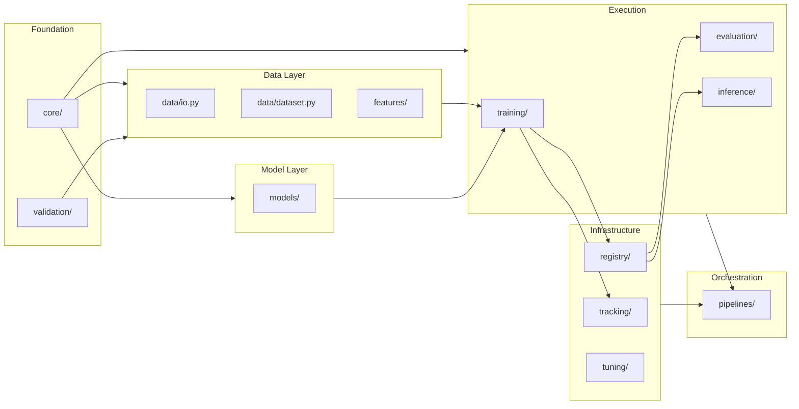
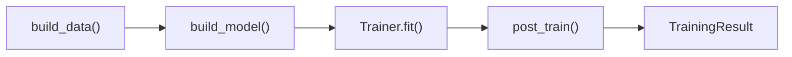
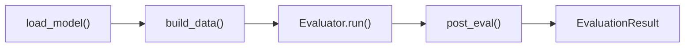
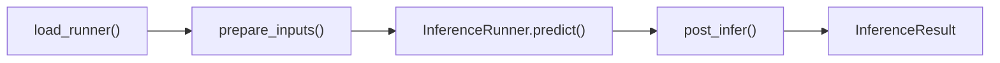
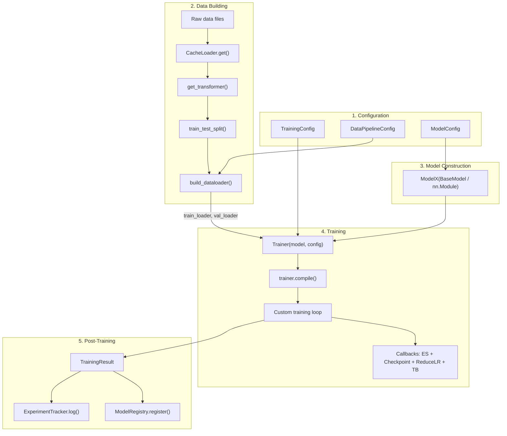
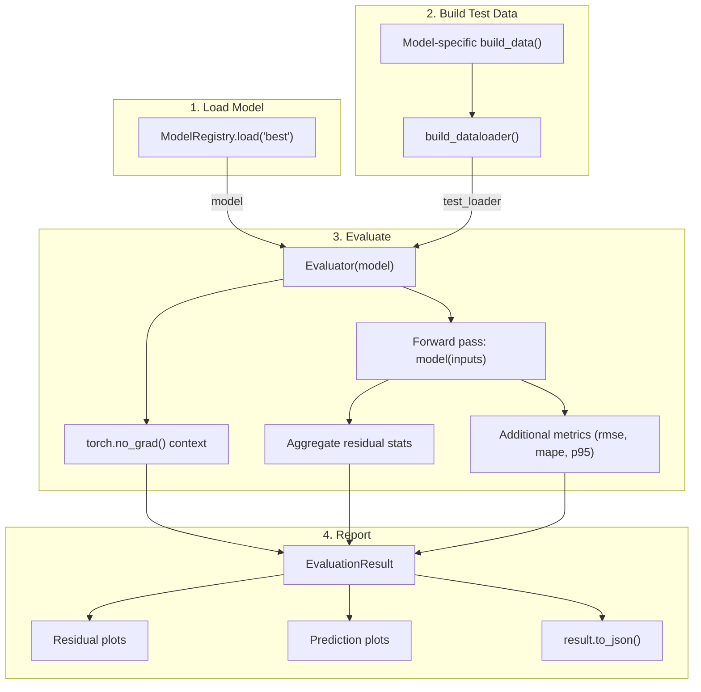
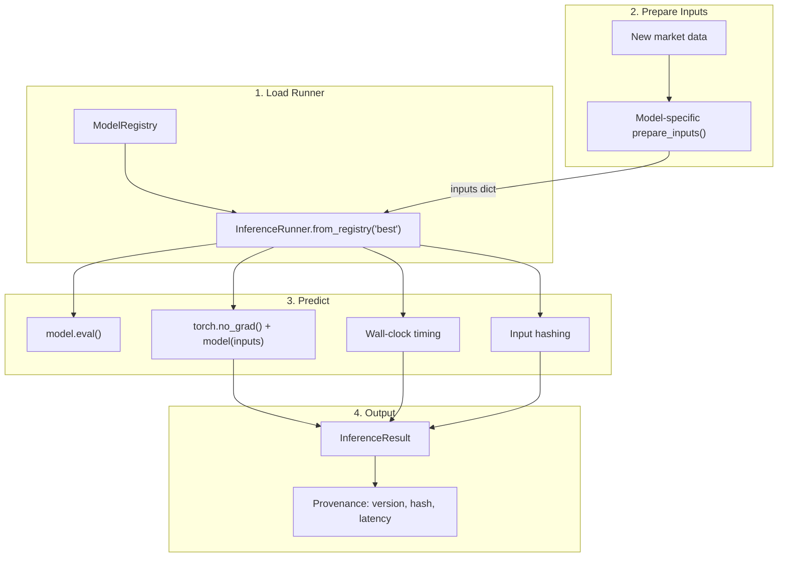
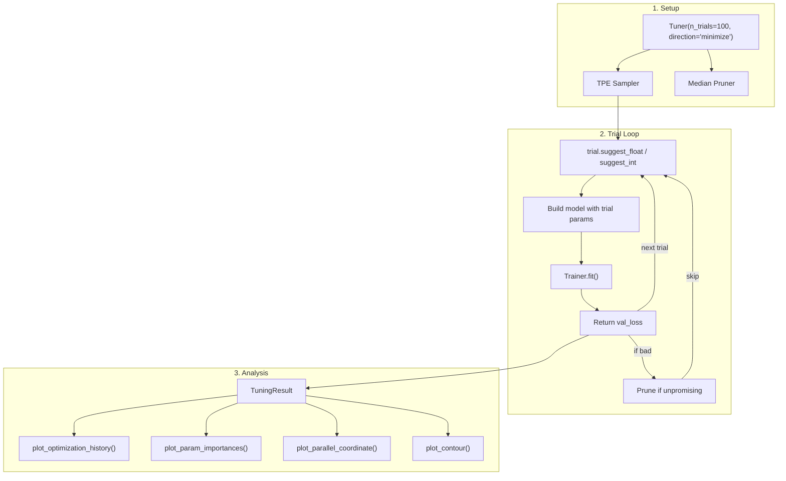

# rade_ml_pt Framework Guide

## Overview

rade_ml_pt is a production-grade machine learning framework designed for quantitative finance applications. It provides a model-independent infrastructure for training, evaluating, deploying, and tuning ML models with full provenance tracking, while supporting model-specific extensions through clean abstract interfaces.

The framework is built on **PyTorch** and targets use cases such as full revaluation PnL prediction via static replication, derivative pricing, and calibration -- though its architecture is generic enough to accommodate any supervised learning model.

### Table of Contents

| # | Section | Description |
|---|---------|-------------|
| 1 | [Architecture](#1-architecture) | Package layout and dependency flow |
| 2 | [Component Reference](#2-component-reference) | Detailed API guide for every module |
| 3 | [Workflow Diagrams](#3-workflow-diagrams) | Mermaid diagrams for train, eval, inference, and tuning |
| 4 | [Adding a New Model](#4-adding-a-new-model) | Step-by-step guide to integrate a new model |
| 5 | [Standalone Usage](#5-standalone-usage-without-pipelines) | Using components independently without pipelines |
| 6 | [Reproducibility and Audit](#6-reproducibility-and-audit) | Seeds, versioning, provenance tracking |
| 7 | [Logging](#7-logging) | Framework logging configuration |
| 8 | [Error Handling](#8-error-handling) | Custom exceptions reference |
| 9 | [Key Differences from rade_ml](#9-key-differences-from-rade_ml-tensorflow) | TensorFlow vs PyTorch migration reference |
| 10 | [Summary](#10-summary-model-independent-vs-model-dependent) | Model-independent vs model-dependent breakdown |

---

## 1. Architecture

```
rade_ml_pt/
  core/                 # Base classes, configs, result types
  data/                 # Dataset building, I/O, model-specific data builders
  features/             # Preprocessing transforms (sklearn wrappers)
  models/               # Model architectures (model-specific)
  training/             # Trainer, callbacks, LR schedules
  evaluation/           # Evaluator, metrics, diagnostic plots
  inference/            # InferenceRunner for production predictions
  registry/             # Model versioning and checkpoint storage
  tracking/             # Experiment logging and comparison
  tuning/               # Hyperparameter optimisation (Optuna)
  pipelines/            # Abstract pipeline orchestration
  utilities/            # Domain-specific helpers (graph builders, encoders)
  validation/           # Input validation, custom exceptions
```

### Dependency Flow



---

## 2. Component Reference

### 1. core/ -- Foundation

The `core/` package provides the base classes and configuration dataclasses that every other module depends on.

#### core/base.py -- BaseModel

Abstract base class for all models. Inherits `torch.nn.Module` and adds metadata tracking, configuration-based serialisation (`get_config()` / `from_config()` / `save_config()`), and architecture summary via `summary_dict()`.

```python
from rade_ml_pt.core.base import BaseModel

class MyModel(BaseModel):
    def __init__(self, units=64, **kwargs):
        super().__init__(name="my_model", **kwargs)
        self.dense = torch.nn.Linear(units, 1)

    def forward(self, inputs, **kwargs):
        return self.dense(inputs["features"])

model = MyModel(units=128)
print(model.metadata)          # model name, class, framework version, timestamp
print(model.summary_dict())    # param counts, layer names
```

**Contract**: every model must implement `forward(inputs, **kwargs)` where `inputs` is whatever your data builder emits (typically a dict of tensors).

#### core/config.py -- Configuration Dataclasses

All configuration is expressed as pure Python dataclasses with JSON serialisation.

| Dataclass | Purpose |
|---|---|
| `DataPipelineConfig` | Batch size, shuffle, cache, split ratios, transform type, seed |
| `TrainingConfig` | Epochs, optimizer, LR schedule, early stopping, checkpointing, loss, verbose, mixed_precision, compile_model, strategy |
| `OptimizerConfig` | Optimizer name + hyperparameters, with `.build(params)` to produce PyTorch optimizer |
| `LrScheduleConfig` | Schedule type + parameters, with `.build(optimizer)` to produce PyTorch LR scheduler |
| `EarlyStoppingConfig` | Patience, monitor, min_delta |
| `CheckpointConfig` | Save directory, frequency, monitor, best-only |
| `ReduceLrConfig` | Factor, patience, monitor, min_lr |

```python
from rade_ml_pt.core.config import TrainingConfig, OptimizerConfig, EarlyStoppingConfig

config = TrainingConfig(
    epochs=200,
    optimizer=OptimizerConfig(name="adamw", learning_rate=3e-4, weight_decay=1e-5),
    early_stopping=EarlyStoppingConfig(patience=15),
    loss="mae",
    verbose=True,
)

config.to_json("config.json")                   # persist
config = TrainingConfig.from_json("config.json") # reload
optimizer = config.optimizer.build(model.parameters())  # -> torch.optim.AdamW
```

#### core/types.py -- Result Types

Canonical output containers used across the framework.

| Type | Produced by | Key fields |
|---|---|---|
| `TrainingResult` | `Trainer.fit()` | history, final_epoch, best_epoch, best_train_loss, best_val_loss, training_time_seconds, stopped_early, config, checkpoints, model_summary |
| `EvaluationResult` | `Evaluator.run()` | metrics, loss, predictions, targets, residuals, dataset_info |
| `InferenceResult` | `InferenceRunner.predict()` | predictions, n_samples, sample_ids, latency_seconds, model_version, input_hash |
| `CheckpointInfo` | Checkpoint callback | path, epoch, train_loss, val_loss, is_best |

All result types support `.to_json()` / `.from_json()` for persistence and audit.

---

### 2. data/ -- Data Layer

#### data/dataset.py -- RadeDataset & build_dataloader

`RadeDataset` is a `torch.utils.data.Dataset` that holds per-sample variable inputs and targets, plus optional shared static inputs broadcast into every sample. `build_dataloader` is a thin helper to wrap arrays/dicts into a batched, shuffled `DataLoader`.

```python
from rade_ml_pt.data.dataset import build_dataloader
from rade_ml_pt.core.config import DataPipelineConfig

config = DataPipelineConfig(batch_size=64, shuffle=True)

# Pattern 1: Simple arrays
train_dl = build_dataloader(X_train, y_train, config)

# Pattern 2: Dict inputs with static data (e.g. GNN-RNN)
train_dl = build_dataloader(
    variable_inputs={"pnl_history": elem_pnl},
    targets=target_pnl,
    config=config,
    static_inputs={
        "trade_features": features,
        "adjacency_indices": adj_indices,
        "adjacency_values": adj_values,
        "adjacency_dense_shape": adj_shape,
    },
)
```

The function handles dtype casting, validation, batching, shuffling, and static input injection. It produces a `DataLoader` yielding `(inputs_dict, targets)` tuples.

#### data/io.py -- CacheLoader

Singleton-cached file I/O supporting `.pkl`, `.json`, `.csv`, and `.parquet`.

```python
from rade_ml_pt.data.io import CacheLoader

# Load with caching (second call returns from memory)
portfolio = CacheLoader.get("portfolio", "data/portfolio.parquet")

# Direct load without caching
data = CacheLoader.load("data/raw.csv")

# Save
CacheLoader.save_data(results_df, "output/results.parquet")
```

#### data/result.py -- DataBuildResult

Base dataclass that every model-specific data builder must return.

```python
@dataclass
class DataBuildResult:
    train_ds: Optional[DataLoader] = None
    val_ds: Optional[DataLoader] = None
    test_ds: Optional[DataLoader] = None
    metadata: Dict[str, Any] = field(default_factory=dict)
```

Model-specific subclasses add extra fields (scaler, graph structure, etc.) but the three DataLoader splits are the universal contract.

---

### 3. features/ -- Preprocessing

#### features/transforms/standardiser.py

Factory function wrapping sklearn scalers.

```python
from rade_ml_pt.features.transforms import get_transformer

scaler = get_transformer("standard")   # -> StandardScaler
scaler = get_transformer("minmax")     # -> MinMaxScaler
scaler = get_transformer("robust")     # -> RobustScaler
scaler = get_transformer("power")      # -> PowerTransformer
```

#### features/transforms/dimensionality.py

Dimensionality reduction for high-dimensional trade universes. Uses SVD/PCA to determine effective rank, then pivoted QR for basis selection.

```python
from rade_ml_pt.features.transforms.dimensionality import basis_selection_reduction

basis_trades = basis_selection_reduction(pnl_df, config, seed=42)
```

---

### 4. models/ -- Model Architectures

Model-specific packages live here. Each model has its own sub-package.

```
models/
  hybrid_gnn_rnn/
    model.py              # HybridGnnRnn(BaseModel) -- the full model
    config.py             # Model-specific architecture config
    layers/
      gnn_layers.py       # GraphSAGE, MixedGraphSAGE, GnnBlock
      rnn_layers.py       # LSTM/BiLSTM/GRU blocks (lazy build)
      fusion_layer.py     # Gated cross-attention fusion
      attention_layer.py  # Target self-attention with FFN
      projection_layer.py # Per-target projection with kNN transfer
```

All models inherit `BaseModel` (which inherits `torch.nn.Module`) and implement `forward(inputs, **kwargs)`.

Key PyTorch-specific design decisions:
- **Lazy initialisation**: `nn.LazyLinear` and `nn.UninitializedParameter` are used throughout so that input dimensions are inferred on the first forward pass, eliminating the need for manual shape calculation.
- **Sparse tensors**: `torch.sparse_coo_tensor` and `torch.sparse.mm` for adjacency operations.
- **Fused RNNs**: `nn.LSTM` / `nn.GRU` with `batch_first=True` leverage cuDNN fused kernels for performance.
- **No `training` flag**: Dropout behaviour is controlled by `model.train()` / `model.eval()`, not by a parameter.

---

### 5. training/ -- Training Infrastructure

#### training/trainer.py -- Trainer

Custom training loop replacing Keras `model.fit()`. Owns the optimizer, loss function, LR scheduler, callback lifecycle, and optional verbose epoch progress.

```python
from rade_ml_pt.training import Trainer
from rade_ml_pt.core.config import TrainingConfig

config = TrainingConfig(epochs=100, loss="mae", verbose=True)
trainer = Trainer(model, config)

# Optional: override compile settings
trainer.compile(loss="mse", optimizer=custom_optimizer)

# Train
result = trainer.fit(train_loader, val_loader)

print(result.best_epoch)              # e.g. 47
print(result.best_val_loss)           # e.g. 0.00231
print(result.training_time_seconds)   # e.g. 142.3
```

The training loop handles:
- Forward pass with `model(inputs)` (dict-based)
- Backward pass with `loss.backward()` and `optimizer.step()`
- Optional gradient clipping via `torch.nn.utils.clip_grad_norm_`
- Validation pass with `torch.no_grad()` context
- Callback dispatch (`on_epoch_begin`, `on_epoch_end`, `on_train_end`)
- Built-in verbose output: `Epoch 1/500  loss=0.0123  val_loss=0.0145  [2.3s]`

#### training/callbacks.py -- Callback System

Hook-based callback classes that receive epoch events from the Trainer.

| Callback | Purpose |
|---|---|
| `EarlyStopping` | Stops training when monitored metric stalls; sets `stop_training=True` |
| `ModelCheckpoint` | Saves `model.state_dict()` to disk; supports best-only and periodic modes |
| `ReduceLROnPlateau` | Wraps `torch.optim.lr_scheduler.ReduceLROnPlateau` |
| `MetricsLogger` | Writes epoch metrics to a log file when `log_dir` is set |
| `TensorBoardLogger` | Writes scalars to TensorBoard via `torch.utils.tensorboard.SummaryWriter` |

```python
from rade_ml_pt.training.callbacks import get_standard_callbacks

callbacks = get_standard_callbacks(config)
# Typically called internally by Trainer; rarely called directly
```

#### training/schedules.py -- WarmupCosineSchedule

Custom LR schedule with linear warmup then cosine decay. Subclasses `torch.optim.lr_scheduler.LambdaLR`.

```python
from rade_ml_pt.training.schedules import WarmupCosineSchedule

schedule = WarmupCosineSchedule(
    optimizer=optimizer,
    warmup_steps=500,
    total_steps=10000,
    min_lr=1e-6,
)
```

#### training/strategy.py -- Device Strategy

Utility for device selection (CPU, CUDA, MPS) and optional `torch.compile()`.

---

### 6. evaluation/ -- Model Evaluation

#### evaluation/evaluator.py -- Evaluator

Runs inference on a test DataLoader and produces a structured `EvaluationResult`.

```python
from rade_ml_pt.evaluation import Evaluator
from rade_ml_pt.evaluation.metrics import rmse, mape

evaluator = Evaluator(model)
result = evaluator.run(
    test_loader,
    additional_metrics={"rmse": rmse, "mape": mape},
)

print(result.summary())
# ================================================
# EVALUATION RESULTS
# ================================================
# loss:                   0.001832
# mae:                    0.001832
# residual_p95:           0.004210
# rmse:                   0.002541
# ...
```

The evaluator runs with `model.eval()` and `torch.no_grad()` for correct dropout/batchnorm behaviour and memory efficiency.

#### evaluation/metrics.py

Framework-agnostic metric functions operating on numpy arrays.

| Function | Description |
|---|---|
| `rmse(y_true, y_pred)` | Root Mean Squared Error |
| `mae(y_true, y_pred)` | Mean Absolute Error |
| `mse(y_true, y_pred)` | Mean Squared Error |
| `mape(y_true, y_pred)` | Mean Absolute Percentage Error (with zero-guard) |
| `r_squared(y_true, y_pred)` | Coefficient of determination |
| `max_absolute_error(y_true, y_pred)` | Worst-case error |
| `percentile_absolute_error(y_true, y_pred, p)` | Tail-risk metric (P95, P99) |

#### evaluation/plots/

Diagnostic visualisations accepting an `EvaluationResult`.

**Residual plots** (`evaluation/plots/residuals.py`):
- `plot_residual_distribution(result)` -- histogram + KDE + box plot
- `plot_qq(result)` -- QQ plot against standard normal
- `plot_residual_scatter(result)` -- residuals vs predicted with trend line
- `plot_residual_by_target(result)` -- per-target MAE bar chart

**Prediction plots** (`evaluation/plots/predictions.py`):
- `plot_predicted_vs_actual(result)` -- scatter with 45-degree reference
- `plot_error_distribution(result)` -- absolute error histogram with P95/P99
- `plot_cumulative_error(result)` -- empirical CDF of errors
- `plot_prediction_timeseries(result, target_idx)` -- time-series overlay

All plot functions accept an optional `save_path` for persisting figures.

---

### 7. inference/ -- Production Inference

#### inference/runner.py -- InferenceRunner

Loads a trained model and produces `InferenceResult` with full provenance.

```python
from rade_ml_pt.inference import InferenceRunner

# From the model registry
runner = InferenceRunner.from_registry(registry, "best")

# From a direct path
runner = InferenceRunner.from_path("checkpoints/model.pt")

# Run inference
result = runner.predict(
    inputs=new_data_dict,
    sample_ids=target_trade_ids,
)

print(result.latency_seconds)   # forward pass timing
print(result.input_hash)        # deterministic hash for audit
print(result.model_version)     # registry version
```

The runner uses `model.eval()` and `torch.no_grad()`, hashes inputs for reproducibility auditing, times the forward pass, and attaches full metadata to every prediction.

---

### 8. registry/ -- Model Versioning

#### registry/store.py -- ModelRegistry

Local filesystem registry storing full pickled models via `torch.save(model)` alongside structured metadata.

```python
from rade_ml_pt.registry import ModelRegistry

registry = ModelRegistry(root_dir="./model_store")

# Register after training
entry = registry.register(
    model=trained_model,
    training_result=result,
    tags=["experiment-42", "gnn-rnn-v1"],
    description="2-layer GNN, 128 units, cosine LR",
)
print(entry.version)  # "20260127_143052_abc123"

# Load by tag
model, entry = registry.load("best")

# Find the best model across all versions
best = registry.get_best(metric="best_val_loss", mode="min")

# Tag management
registry.tag("20260127_143052_abc123", "prod")
registry.untag("20260127_143052_abc123", "staging")

# List all versions
for entry in registry.list_versions(tag_filter="gnn-rnn-v1"):
    print(entry)

# Delete a version
registry.delete("20260127_143052_abc123")
```

**Storage layout:**
```
model_store/
  20260127_143052_abc123/
    model.pt              # Full model pickle (torch.save)
    metadata.json         # RegistryEntry serialised
  20260128_091015_def456/
    model.pt
    metadata.json
  index.json              # tag -> version mapping
```

---

### 9. tracking/ -- Experiment Tracking

#### tracking/tracker.py -- ExperimentTracker

JSON-file-backed experiment log for audit and comparison.

```python
from rade_ml_pt.tracking import ExperimentTracker

tracker = ExperimentTracker(store_dir="./experiments")

# Start a run
run = tracker.start_run(name="gnn-rnn-cosine-lr", tags=["lr-sweep"])

# Log config, result, and custom values
run.log_config(training_config)
run.log_result(training_result)
run.log_params({"dropout": 0.1, "gnn_layers": 2})
run.log_metric("test_p95", 0.0032)
run.set_model_version(entry.version)

# End and persist
tracker.end_run(run)

# Query runs
runs = tracker.list_runs(tag="lr-sweep", sort_by="best_val_loss")

# Compare runs side by side
df = tracker.compare_runs(
    ["run_abc123", "run_def456"],
    metrics=["best_val_loss", "best_train_loss"],
)
print(df)
```

**Storage layout:**
```
experiments/
  abc123def456/
    run.json    # human-readable JSON
  789012345678/
    run.json
```

---

### 10. tuning/ -- Hyperparameter Optimisation

#### tuning/tuner.py -- Tuner

Optuna-backed search with trial management, pruning, and analytics.

```python
from rade_ml_pt.tuning import Tuner

def objective(trial):
    lr = trial.suggest_float("lr", 1e-5, 1e-2, log=True)
    units = trial.suggest_int("gnn_units", 32, 256, step=32)
    dropout = trial.suggest_float("dropout", 0.0, 0.5)

    model = MyModel(units=units, dropout=dropout)
    config = TrainingConfig(
        epochs=50,
        optimizer=OptimizerConfig(learning_rate=lr),
    )
    trainer = Trainer(model, config)
    result = trainer.fit(train_loader, val_loader)
    return result.best_val_loss

tuner = Tuner(n_trials=100, direction="minimize", pruner="median", seed=42)
result = tuner.run(objective)

print(result.best_params)    # {"lr": 0.00032, "gnn_units": 128, "dropout": 0.15}
print(result.best_value)     # 0.00187
result.to_json("tuning_results.json")
```

#### tuning/plots.py -- Tuning Visualisations

```python
from rade_ml_pt.tuning import plot_optimization_history, plot_param_importances
from rade_ml_pt.tuning import plot_parallel_coordinate, plot_contour, plot_slice

# From serialised result (no live study needed)
plot_optimization_history(result)

# From live study (Optuna's internal visualisation)
plot_param_importances(tuner.study)
plot_parallel_coordinate(tuner.study)
plot_contour(tuner.study, params=["lr", "gnn_units"])
plot_slice(tuner.study, params=["lr", "dropout"])
```

---

### 11. pipelines/ -- Orchestration

#### pipelines/base.py -- Abstract Pipeline Classes

Three abstract base classes define the contract for end-to-end workflows.

**TrainPipeline:**



**EvalPipeline:**



**InferencePipeline:**



#### pipelines/config.py -- PipelineConfig

Aggregates references to training config, data config, model config, and infrastructure paths.

```python
from rade_ml_pt.pipelines import PipelineConfig

config = PipelineConfig(
    training_config={"epochs": 100, "loss": "mae"},
    data_config={"batch_size": 64, "shuffle": True},
    model_config={"gnn_units": 128, "rnn_units": 64},
    registry_dir="./model_store",
    tracking_dir="./experiments",
    version_or_tag="best",
    metadata={"run_name": "prod-retrain", "tags": ["production"]},
)
```

---

### 12. validation/ -- Input Validation

Custom exceptions (`MissingKeyFields`, `UndefinedModelArchitecture`, `UndefinedLayerType`, etc.) and validation helpers.

```python
from rade_ml_pt.validation.base import validate_dict_keys

validate_dict_keys(
    input_dict=data,
    keys=["trade_features", "adjacency_indices", "pnl_history"],
)
# Raises MissingKeyFields if any key is absent
```

---

## 3. Workflow Diagrams

### Training Workflow



### Evaluation Workflow



### Inference Workflow



### Tuning Workflow



---

## 4. Adding a New Model

This section walks through exactly what you need to implement to add a new model (`model_x`) to the framework.

### Step 1: Define the Model Architecture

Create `models/model_x/model.py`:

```python
import torch
import torch.nn as nn
from rade_ml_pt.core.base import BaseModel

class ModelX(BaseModel):
    """
    Your model description.
    """

    def __init__(self, units: int = 64, dropout: float = 0.1, **kwargs):
        super().__init__(name="model_x", **kwargs)
        self.hidden = nn.Linear(units, units)
        self.act = nn.ReLU()
        self.drop = nn.Dropout(dropout) if dropout > 0.0 else None
        self.output_layer = nn.Linear(units, 1)

    def forward(self, inputs, **kwargs):
        # inputs is the dict your data builder produces
        x = inputs["features"]
        x = self.act(self.hidden(x))
        if self.drop is not None:
            x = self.drop(x)
        return self.output_layer(x)

    def get_config(self):
        config = super().get_config()
        config.update({"units": self.hidden.in_features})
        return config
```

If your model has custom layers, place them in `models/model_x/layers/`.

### Step 2: Define Model-Specific Data Config

Create `data/model_x/config.py`:

```python
from dataclasses import dataclass
from rade_ml_pt.core.config import DataPipelineConfig

@dataclass
class ModelXDataConfig(DataPipelineConfig):
    """Extends base config with model-specific data settings."""
    feature_columns: list = None
    target_column: str = "pnl"
    lookback_window: int = 20
```

### Step 3: Implement the Data Builder

Create `data/model_x/build.py`:

```python
from dataclasses import dataclass, field
from typing import Any

from sklearn.model_selection import train_test_split

from rade_ml_pt.data.result import DataBuildResult
from rade_ml_pt.data.dataset import build_dataloader
from rade_ml_pt.data.io import CacheLoader
from rade_ml_pt.features.transforms import get_transformer

@dataclass
class ModelXDataResult(DataBuildResult):
    """Model-specific data result with scaler for inverse transform."""
    scaler: Any = None

def build_model_x_data(config, data_paths):
    """
    End-to-end data pipeline for ModelX.

    Returns a ModelXDataResult with train/val/test DataLoaders.
    """
    # 1. Load raw data
    raw_data = CacheLoader.get("raw", data_paths["features"])
    targets = CacheLoader.get("targets", data_paths["targets"])

    # 2. Preprocess
    scaler = get_transformer(config.transform_type)
    X_scaled = scaler.fit_transform(raw_data)

    # 3. Split
    X_train, X_temp, y_train, y_temp = train_test_split(
        X_scaled, targets, test_size=config.validation_split + config.test_split,
        random_state=config.seed,
    )
    relative_test = config.test_split / (config.validation_split + config.test_split)
    X_val, X_test, y_val, y_test = train_test_split(
        X_temp, y_temp, test_size=relative_test, random_state=config.seed,
    )

    # 4. Build DataLoaders
    train_dl = build_dataloader(
        variable_inputs={"features": X_train}, targets=y_train, config=config,
    )
    val_dl = build_dataloader(
        variable_inputs={"features": X_val}, targets=y_val, config=config,
    )
    test_dl = build_dataloader(
        variable_inputs={"features": X_test}, targets=y_test, config=config,
    )

    return ModelXDataResult(
        train_ds=train_dl,
        val_ds=val_dl,
        test_ds=test_dl,
        scaler=scaler,
        metadata={"n_train": len(X_train), "n_val": len(X_val), "n_test": len(X_test)},
    )
```

### Step 4: Implement Pipeline Subclasses

Create `pipelines/model_x/train.py`:

```python
from rade_ml_pt.pipelines import TrainPipeline, PipelineConfig
from rade_ml_pt.data.result import DataBuildResult
from data.model_x.build import build_model_x_data
from data.model_x.config import ModelXDataConfig
from models.model_x.model import ModelX

class ModelXTrainPipeline(TrainPipeline):

    def build_data(self, config: PipelineConfig) -> DataBuildResult:
        data_config = ModelXDataConfig(**config.data_config)
        return build_model_x_data(data_config, config.metadata.get("data_paths", {}))

    def build_model(self, config: PipelineConfig, data_result) -> ModelX:
        model_config = config.model_config or {}
        return ModelX(**model_config)
```

Create `pipelines/model_x/eval.py`:

```python
from rade_ml_pt.pipelines import EvalPipeline, PipelineConfig
from rade_ml_pt.data.result import DataBuildResult
from data.model_x.build import build_model_x_data
from data.model_x.config import ModelXDataConfig

class ModelXEvalPipeline(EvalPipeline):

    def build_data(self, config: PipelineConfig) -> DataBuildResult:
        data_config = ModelXDataConfig(**config.data_config)
        return build_model_x_data(data_config, config.metadata.get("data_paths", {}))
```

Create `pipelines/model_x/infer.py`:

```python
from rade_ml_pt.pipelines import InferencePipeline, PipelineConfig

class ModelXInferencePipeline(InferencePipeline):

    def prepare_inputs(self, config: PipelineConfig) -> dict:
        # Load and preprocess new data for inference
        # Must return {"inputs": ..., "trade_ids": [...]}
        ...
        return {"inputs": prepared_dict, "trade_ids": trade_ids}
```

### Step 5: Run

```python
from rade_ml_pt.pipelines import PipelineConfig

config = PipelineConfig(
    training_config={"epochs": 100, "loss": "mae"},
    data_config={"batch_size": 64, "shuffle": True},
    model_config={"units": 128, "dropout": 0.1},
    registry_dir="./model_store",
    tracking_dir="./experiments",
    metadata={
        "run_name": "model_x_v1",
        "tags": ["baseline"],
        "data_paths": {"features": "data/features.parquet", "targets": "data/targets.parquet"},
    },
)

# Train
pipeline = ModelXTrainPipeline(config)
result = pipeline.run()

# Evaluate
eval_config = PipelineConfig(**{**config.__dict__, "version_or_tag": "latest"})
eval_pipeline = ModelXEvalPipeline(eval_config)
eval_result = eval_pipeline.run()

# Inference
infer_pipeline = ModelXInferencePipeline(eval_config)
infer_result = infer_pipeline.run()
```

### File Structure Checklist for a New Model

```
rade_ml_pt/
  models/
    model_x/
      __init__.py
      model.py              # ModelX(BaseModel / nn.Module)
      config.py             # Architecture config (optional)
      layers/               # Custom layers (if any)
        __init__.py
        custom_layer.py
  data/
    model_x/
      __init__.py
      config.py             # ModelXDataConfig(DataPipelineConfig)
      build.py              # build_model_x_data() -> ModelXDataResult
      plots.py              # Data diagnostic plots (optional)
  pipelines/
    model_x/
      __init__.py
      train.py              # ModelXTrainPipeline(TrainPipeline)
      eval.py               # ModelXEvalPipeline(EvalPipeline)
      infer.py              # ModelXInferencePipeline(InferencePipeline)
```

---

## 5. Standalone Usage (Without Pipelines)

Pipelines are optional. Every component works independently:

```python
import torch
from rade_ml_pt.core.config import TrainingConfig, DataPipelineConfig
from rade_ml_pt.data.dataset import build_dataloader
from rade_ml_pt.training import Trainer
from rade_ml_pt.evaluation import Evaluator
from rade_ml_pt.evaluation.metrics import rmse, mape
from rade_ml_pt.registry import ModelRegistry
from rade_ml_pt.inference import InferenceRunner

# 1. Build data
config = DataPipelineConfig(batch_size=64, shuffle=True)
train_dl = build_dataloader(X_train, y_train, config)
val_dl = build_dataloader(X_val, y_val, config)
test_dl = build_dataloader(X_test, y_test, config)

# 2. Build model
model = MyModel(units=128)

# 3. Train
trainer = Trainer(model, TrainingConfig(epochs=100, verbose=True))
result = trainer.fit(train_dl, val_dl)

# 4. Evaluate
evaluator = Evaluator(model)
eval_result = evaluator.run(test_dl, additional_metrics={"rmse": rmse, "mape": mape})
print(eval_result.summary())

# 5. Register
registry = ModelRegistry("./model_store")
entry = registry.register(model, result, tags=["v1"])

# 6. Inference (later, possibly different process)
runner = InferenceRunner.from_registry(registry, "v1")
pred_result = runner.predict(new_inputs, sample_ids=["trade_001"])
```

---

## 6. Reproducibility and Audit

The framework provides end-to-end reproducibility:

| Concern | How it's handled |
|---|---|
| **Random seeds** | `setup_training_environment(seed=...)` sets `torch.manual_seed()`, `np.random.seed()`, and `torch.cuda.manual_seed_all()`. Seed is sourced from `DataPipelineConfig.seed` (default 42) and forwarded to `Trainer(seed=...)`. Optional `torch.use_deterministic_algorithms(True)` for bitwise reproducibility. |
| **Config tracking** | All configs are JSON-serialisable; `TrainingResult.config` stores the exact config used |
| **Model versioning** | `ModelRegistry` stores `torch.save(model)` + metadata with unique version IDs |
| **Experiment logging** | `ExperimentTracker` logs config, metrics, model version per run |
| **Prediction provenance** | `InferenceResult` carries model_version, model_path, input_hash, timestamp |
| **Data lineage** | `DataBuildResult.metadata` carries split sizes, file paths, transform parameters |

Every prediction can be traced back through: `InferenceResult.model_version` -> `RegistryEntry` -> `TrainingResult.config` -> exact hyperparameters and data config.

---

## 7. Logging

The framework uses Python's standard `logging` module. Every module creates its own logger:

```python
import logging
logger = logging.getLogger(__name__)
```

To enable framework logging:

```python
import logging
logging.basicConfig(level=logging.INFO)

# Or target specific modules
logging.getLogger("rade_ml_pt.training").setLevel(logging.DEBUG)
logging.getLogger("rade_ml_pt.registry").setLevel(logging.INFO)
```

Key log events:
- `Trainer`: compilation, training start/end, epoch progress, timing
- `Evaluator`: evaluation timing, sample count, loss
- `InferenceRunner`: inference timing, scenario count
- `ModelRegistry`: register, load, tag/untag, delete
- `ExperimentTracker`: run start/end, persist events
- `Tuner`: trial completion, best trial summary

---

## 8. Error Handling

Custom exceptions in `validation/exceptions.py`:

| Exception | When raised |
|---|---|
| `MissingKeyFields` | Required dict keys missing from input data |
| `UndefinedModelArchitecture` | Unknown model type requested |
| `UndefinedLayerType` | Unknown layer type in config |
| `UndefinedVariableType` | Unknown variable type |
| `UndefinedTransformerType` | Unknown scaler/transformer name |
| `UndefinedReductionType` | Unknown dimensionality reduction method |
| `UndefinedComputationMethod` | Unknown SVD/PCA method |
| `HybridModelNotAvailable` | Hybrid model not available or not loaded |
| `CacheLoaderError` | Base exception for file I/O failures |
| `UnsupportedFileTypeError` | File extension not supported (.pkl, .json, .csv, .parquet) |
| `FileLoadError` | File reading or parsing failure |
| `FileSaveError` | File writing failure |

---

## 9. Key Differences from rade_ml (TensorFlow)

| Aspect | rade_ml (TensorFlow) | rade_ml_pt (PyTorch) |
|---|---|---|
| **Base class** | `tf.keras.Model` | `torch.nn.Module` |
| **Forward method** | `call(inputs, training=False)` | `forward(inputs, **kwargs)` |
| **Training/eval mode** | `training` parameter | `model.train()` / `model.eval()` |
| **Training loop** | Keras `model.fit()` | Custom loop with `loss.backward()` + `optimizer.step()` |
| **Data pipeline** | `tf.data.Dataset` with `.batch().shuffle().prefetch()` | `torch.utils.data.DataLoader` with `RadeDataset` |
| **Dataset result** | `DataBuildResult.train_ds: tf.data.Dataset` | `DataBuildResult.train_ds: DataLoader` |
| **Lazy layers** | `tf.keras.layers.Dense` (always lazy) | `nn.LazyLinear` / `nn.UninitializedParameter` |
| **Sparse tensors** | `tf.SparseTensor` + `tf.sparse.reorder` | `torch.sparse_coo_tensor` + `.coalesce()` |
| **Sparse matmul** | `tf.sparse.sparse_dense_matmul` | `torch.sparse.mm` |
| **Scatter reduce** | `tf.math.unsorted_segment_max` | `scatter_reduce_(reduce="amax")` |
| **Optimizer build** | `config.optimizer.build()` -> Keras optimizer | `config.optimizer.build(model.parameters())` -> PyTorch optimizer |
| **LR schedule** | Keras `LearningRateSchedule` | `torch.optim.lr_scheduler.LambdaLR` subclass |
| **Checkpoints** | `.keras` SavedModel | `.pt` pickle via `torch.save()` |
| **Gradient clipping** | Keras callback or optimizer arg | `torch.nn.utils.clip_grad_norm_` in training loop |
| **Device strategy** | `tf.distribute.Strategy` / XLA | `torch.device` + optional `torch.compile()` |
| **Verbose output** | Keras `verbose=1` in `model.fit()` | Built-in `Trainer` epoch progress when `config.verbose=True` |

---

## 10. Summary: Model-Independent vs Model-Dependent

| Component | Model-independent | Model-dependent |
|---|---|---|
| `core/` | **All** (BaseModel, configs, types) | -- |
| `data/dataset.py` | **build_dataloader** | -- |
| `data/io.py` | **CacheLoader** | -- |
| `data/model_x/` | -- | **build.py, config.py** |
| `features/` | **All** (scalers, dimensionality) | -- |
| `models/model_x/` | -- | **model.py, layers/** |
| `training/` | **All** (Trainer, callbacks, schedules) | -- |
| `evaluation/` | **All** (Evaluator, metrics, plots) | -- |
| `inference/` | **All** (InferenceRunner) | -- |
| `registry/` | **All** (ModelRegistry) | -- |
| `tracking/` | **All** (ExperimentTracker) | -- |
| `tuning/` | **All** (Tuner, plots) | Objective function body only |
| `pipelines/base.py` | **All** (abstract base classes) | -- |
| `pipelines/model_x/` | -- | **train.py, eval.py, infer.py** |
| `validation/` | **All** (exceptions, validators) | -- |
| `utilities/` | -- | **Model-specific** (graph builder, attribute encoder) |

**Ratio**: approximately 70% generic infrastructure, 30% model-specific code per model.
