# rade_qnet — Architecture

A model-independent framework for machine learning and reinforcement learning
in quantitative finance.

> **Status.** The architecture below is agreed and locked. The code is being
> built against it in phases — see [`IMPLEMENTATION.md`](IMPLEMENTATION.md).
> Package charter docstrings state which phase delivers each module.

---

## Contents

1. [The problem](#1-the-problem)
2. [The central idea](#2-the-central-idea)
3. [The layer stack](#3-the-layer-stack)
4. [The vocabulary: `core`](#4-the-vocabulary-core)
5. [Stage contracts and the train pipeline](#5-stage-contracts-and-the-train-pipeline)
6. [One protocol for ML and RL: `BatchSource`](#6-one-protocol-for-ml-and-rl-batchsource)
7. [Engines](#7-engines)
8. [Orchestration: one run, and many](#8-orchestration-one-run-and-many)
9. [Storage: the system of record](#9-storage-the-system-of-record)
10. [Analysis: metrics, visuals, reports](#10-analysis-metrics-visuals-reports)
11. [Writing a model](#11-writing-a-model)
12. [Using the framework](#12-using-the-framework)
13. [Design decisions and the defects they fix](#13-design-decisions-and-the-defects-they-fix)
14. [Glossary](#14-glossary)

---

## 1. The problem

A quantitative researcher with a model idea currently has to build, before
learning anything: a data loader, a split that does not leak, a training loop,
checkpointing, early stopping, metric computation, plots, a way to save the
model so it can be reloaded in three months, a way to run it across forty
clusters, and a way to do all of that again on a GPU box.

That work is almost entirely independent of the model. It is also where the
expensive mistakes live. A split that shuffles before slicing, a scaler fitted
on the test set, a saved model that cannot be reloaded after a refactor — none
of these announce themselves. They produce encouraging numbers.

`rade_qnet` takes that work away and does it once, correctly. A model author
supplies three things:

| They supply | The framework supplies |
| --- | --- |
| The architecture (`model.py`) | Training, evaluation, inference, tuning |
| How its data is built (`data.py`) | Leakage-aware splits, fitted-state handling |
| What state it needs at inference (`state.py`) | Versioned bundles, catalog, provenance |
| *(optional)* pipeline step overrides | Metrics, figures, reports, fan-out, placement |

The flagship model, a hybrid graph-temporal network for P&L replication, is
deliberately the hardest case the framework has to serve. If the abstractions
hold for it, they will hold for most things. The `baselines` package exists to
check the opposite end: a ridge regression must still cost one short file.

---

## 2. The central idea

The framework owns the **lifecycle**; the model owns the **mathematics**.

Every model, regardless of library or complexity, moves through the same four
pipelines, and each pipeline is a *template method*: `run()` calls a sequence of
small, individually typed, individually overridable steps.

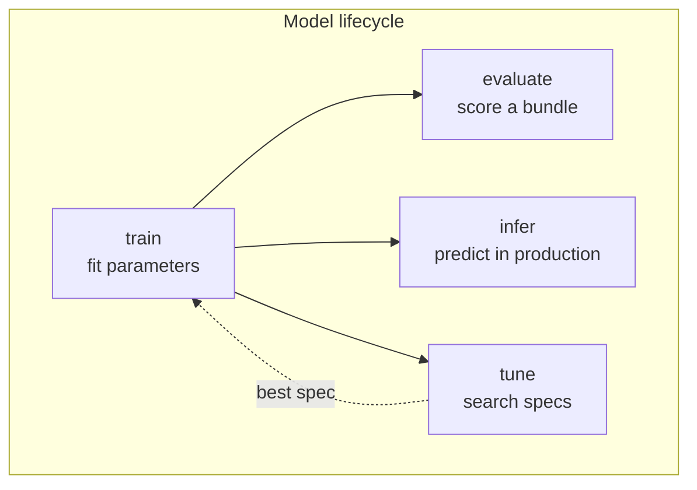

The granularity of the steps is the whole design. A model author who wants a
different loss overrides one step. They do not reimplement training, and they
do not fork the framework.

### Four customisation tiers

Use the lowest tier that works. Most models never leave tier 1.

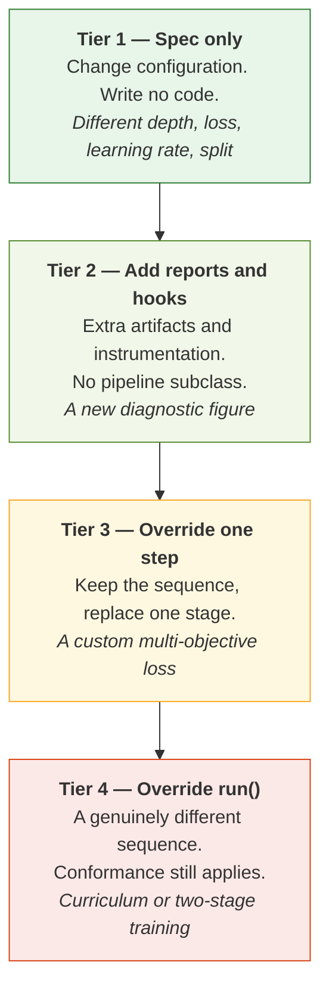

If a model needs tier 4 often, that is a signal about the framework, not about
the model, and it should be raised rather than worked around.

---

## 3. The layer stack

Eight top-level packages, forming a one-way stack. A package may import from
the packages below it and never from the packages above.

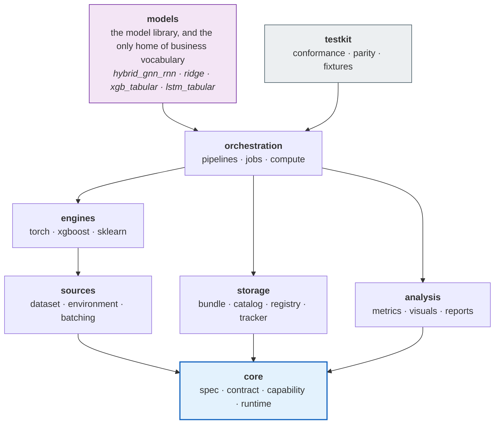

The permitted dependencies are not a convention. They are encoded in
`ALLOWED_DEPENDENCIES` in `tests/rade_qnet/test_scaffold.py` and checked by
walking the abstract syntax tree of every module in the package. Architectural
boundaries are rarely broken by a decision to break them; they are broken by
one convenient import in a hurry. The test turns that import into a CI failure
rather than a precedent.

Four of those rules carry most of the weight:

**`core` depends on nothing, and imports no training library.** Only the
standard library, `pydantic` and `numpy`. This is what lets a specification be
parsed, validated, hashed and shipped to a worker in a process that has never
imported PyTorch. A job set spawning sixteen workers pays every import cost
sixteen times, so this is a throughput property as much as a design one. It is
enforced by an allowlist, because what actually needs protecting is "`core`
stays cheap", and that is broken by the next heavy dependency nobody thought to
ban.

**`orchestration` may not import `models`.** Pipelines resolve a model by name
through the component registry. If a pipeline imported a model, the framework
would depend on the library it exists to serve, and no user could add a model
without editing the framework.

**Business vocabulary lives only in `models`.** Knowing that a number is a
P&L in a particular currency on a particular desk is a model's business,
expressed in its own `data.py`. The moment a training loop knows it, the
framework stops being reusable on the next problem. An earlier design gave
such knowledge its own `domains` layer; on inspection everything in it was
either generic machinery (now `orchestration.jobs.groups` and `.fanout`) or
one model's vocabulary (now in that model), so the layer was removed. The
test for where a new file belongs: *would it be different on another team's
problem?* If yes, it belongs in a model.

**`storage` may not import `engines`.** Serialising weights is the engine's
job — it knows what a `state_dict` is. Storage takes the bytes an engine hands
it and is responsible for getting them onto disk safely.

---

## 4. The vocabulary: `core`

`core` defines what things are called and what shape they have. Four
sub-packages, four distinct jobs.

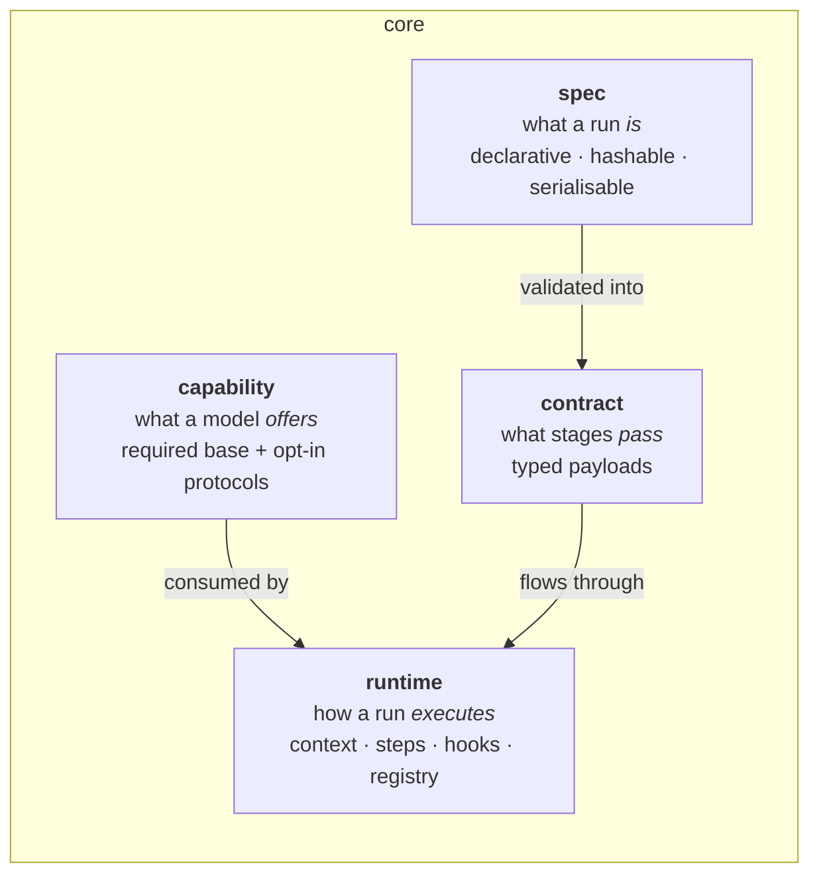

### 4.1 Specs — what a run is

Every spec is a `pydantic` model with `extra="forbid"`. A typo in a YAML key is
a load-time error, not a silently ignored setting. Specs round-trip exactly:
`Spec.model_validate(spec.model_dump())` returns an equal object, which is what
makes a persisted spec a faithful record of how a model was produced.

Specs describe *intent only*. They hold no fitted state, no file handles, no
tensors and no live objects, which keeps them cheap to hash, log and send
across a process boundary.

Unions are **discriminated**, so a validation error names the field rather than
reporting five failed alternatives:

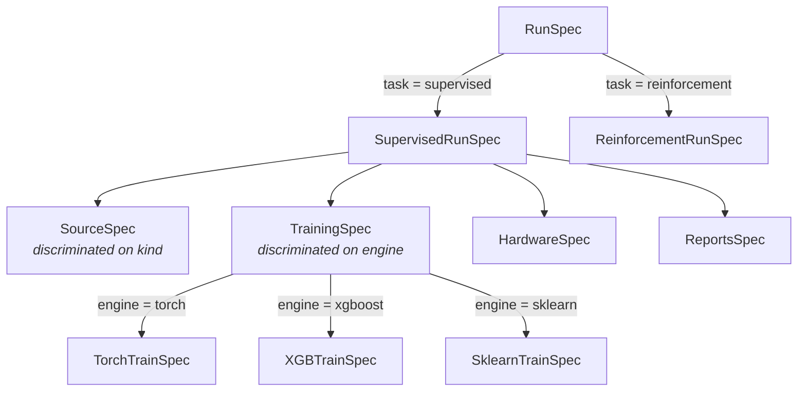

One separation is worth calling out. `HardwareSpec` answers *how does a single
job use its machine* — device, precision, compilation, distribution,
determinism. `PlacementSpec` (in the job-set spec) answers *where do jobs
run* — executor, worker count, visible GPUs. Conflating them is why
"run it on the GPU" and "run forty of them in parallel" so often turn into the
same tangled flag.

### 4.2 Contracts — what stages pass

A contract is the promise one stage makes to the next. Because the promise is a
declared type rather than a convention, a stage can be overridden, cached,
replayed or executed in another process without the neighbouring stages
changing.

Contracts are generic over the engine where it matters:

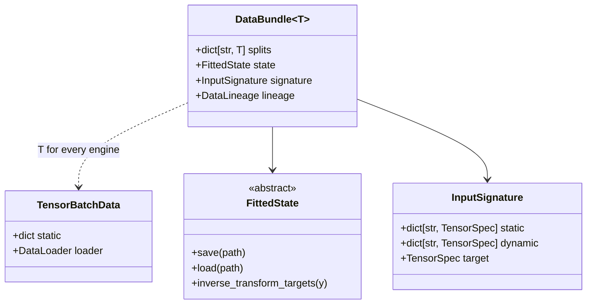

Two of these deserve emphasis.

**`InputSignature`** separates *static* from *dynamic* inputs. A static input
is constant across every batch — a graph, an entity feature matrix, an index
array. A dynamic input varies per sample. The distinction is what lets static
tensors be uploaded to the device once rather than collated per sample, and it
is also what lets a model be rebuilt from a saved bundle without re-running the
data build.

**`FittedState`** is the abstract base for everything a model fits during
training and needs again at inference time: target scalers, a selected feature
basis, an entity encoder, a graph. It replaces the sidecar-file sprawl of the
implementation this framework supersedes — roughly twenty loose artifacts whose
relationship to each other existed only in the loading code — with one typed,
self-describing object that knows how to save itself, load itself, and invert a
prediction back into the original target units.

### 4.3 Capabilities — what a model offers

The base class demands very little: build a model object from a spec and a
signature. That minimum is what keeps a simple model to a single file.

Everything beyond it is an **opt-in capability** — a narrow protocol a model
*may* implement. The framework checks with a runtime `isinstance` test, so a
model never pays for a feature it does not use, and a new capability never
breaks an existing model.

| Capability | The model is saying | The framework then |
| --- | --- | --- |
| `StaticInputs` | "Some of my inputs are the same every batch." | Moves them to the device once; keeps them out of collation. |
| `Precomputable` | "An expensive encoding of those can be reused." | Computes it once per evaluation pass. |
| `CustomStep` | "I own my loss computation." | Delegates the training step. |
| `Routable` | "I can be a member of a job set." | Records which targets this member covers. |
| `Inductive` | "I can predict for entities I never saw." | Enables the unseen-entity inference path. |

### 4.4 Runtime — how a run executes

Every stage goes through `Pipeline.step()`. That single choke point is where
the framework's observability comes from:

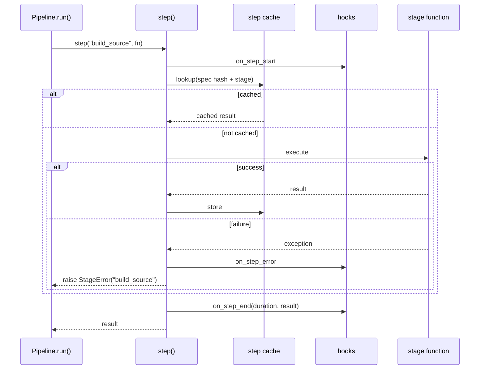

A failure therefore always names the stage it occurred in. A hook can observe
any stage without a pipeline change. And an expensive data build can be served
from cache, which is what makes a hyper-parameter search spend its time on
training rather than on rebuilding the same dataset forty times.

Also in `runtime`: the component registry (`@model`, `@engine`, `@learner`,
`@report`), which resolves a *name* in a spec to a class. Names rather than
importable dotted paths, so moving a class does not invalidate every saved
spec that referenced it.

---

## 5. Stage contracts and the train pipeline

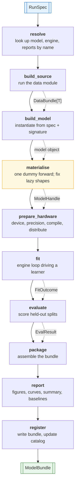

Two stages are easy to overlook and both exist because of real failures.

**`materialise` runs before `prepare_hardware`.** A model with lazily-shaped
parameters has no parameters at all until it has seen one batch. Wrapping it
for distributed training, handing it to an optimiser, or checkpointing it
before that point produces either an empty parameter group or a crash deep
inside the distributed library. The order here is not incidental.

**`register` is last, and nothing before it writes to the store.** A failed run
leaves no half-registered bundle.

The evaluate, infer and tune pipelines share the vocabulary and the step runner:

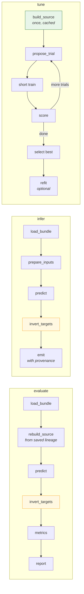

`invert_targets` is a required stage, not an optional nicety. A mean absolute
error reported in standardised space is not a quantity anyone can act on, so
predictions are returned to original units *before* `analysis.metrics` is
reached. Every number a user reads is in the units they think it is in.

### Two fitting axes, two leakage rules

This distinction matters enough to state precisely, because getting it wrong in
either direction is costly.

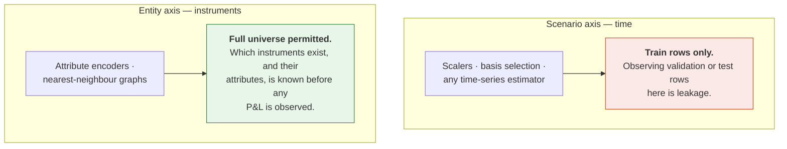

A conformance rule that simply said "fitted transforms may only see training
indices" would be wrong, and would falsely fail the flagship model — whose
graph construction legitimately spans the whole instrument universe. The
conformance suite distinguishes the axes.

---

## 6. One protocol for ML and RL: `BatchSource`

Supervised learning and reinforcement learning differ far less than their
tooling suggests. Both consume a stream of batches. They disagree only about
where the batches come from.

`BatchSource` makes that the *only* difference. Five implementations, one
protocol, one training loop:

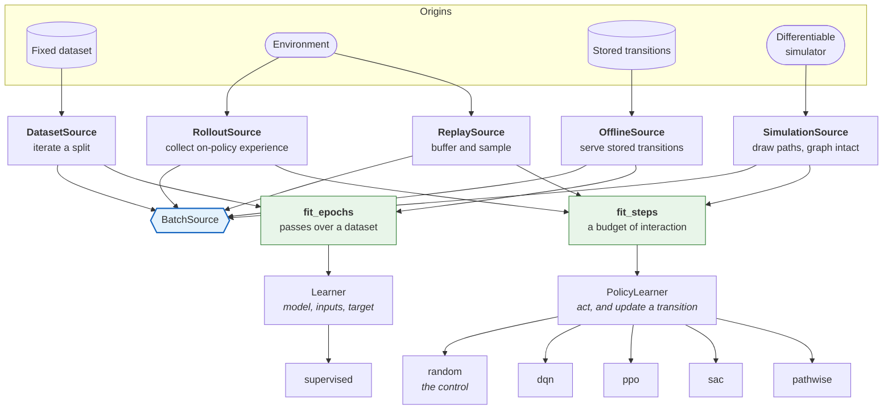

The loop decides *when* to step, validate, checkpoint and stop. The learner
decides *what one update means*. A supervised regression, a deep Q-network and
a pathwise hedging objective are then three learners sharing one loop shape,
instead of three training scripts that drift apart.

**Two drivers, chosen by the source and nothing else.** A source that reports
`steps_per_epoch=None` is unbounded, and that single value selects the driver:
`fit_epochs` for a finite dataset with a meaningful notion of a pass,
`fit_steps` for an environment where only the step count is meaningful. Each
driver refuses the other's source by name, rather than inventing the missing
number — an invented pass length would silently become the denominator of every
reported metric and the period of every schedule.

**Two learner protocols, because a policy has no target.** This is the one
place the unification is narrower than it first looks, and it is worth being
precise about. `Learner` takes `(model, inputs, target)`, because `fit_epochs`
splits each batch using the signature's declared target. `PolicySignature` has
an observation space and an action space and nothing resembling a target, and
an interactive update consumes a whole transition rather than a pair. So
`PolicyLearner` declares `act` and `update` instead.

The alternative — widening `Learner` so `target` is optional — would have
pushed an interactive branch into every supervised learner, which is the
coupling the loop/learner split exists to prevent. What the split bought is
still real: both drivers are the same shape, share their callbacks and
records, and the interactive pipeline is a sibling of the supervised one rather
than a forked lifecycle.

### Why `DifferentiableEnvironment` is first-class

Most reinforcement-learning libraries model only step-and-reward dynamics, so a
hedging or replication problem has to be forced into a transition-based
interface — which discards the exact gradients that make it tractable in the
first place.

When the dynamics are themselves differentiable, a risk measure can be
back-propagated straight through a simulated path. No value function, no policy
gradient estimator, no variance to fight. For a quantitative-finance framework
this is not an exotic case; it is a large fraction of the interesting problems,
so it gets its own protocol rather than an adapter.

The protocol is not declared yet, and the reason is a rule worth stating
generally: **a `runtime_checkable` protocol with no distinguishing member is
satisfied by everything.** An `isinstance` check against a
`DifferentiableEnvironment` that added no members would answer `True` for a
plainly non-differentiable environment, which is worse than having no check.
The member it needs is whatever the pathwise learner reads, so it arrives with
that learner.

**On the existing `q_learning` package:** the reinforcement-learning design
here is a clean redesign, not a port. `q_learning`'s agent and environment
protocols assume tabular and transition-based learning throughout, which cannot
express the pathwise case and does not compose with the `BatchSource`
unification. Its *use cases* informed the requirements; none of its structure
is carried over.

---

## 7. Engines

An engine is the only place in the framework permitted to know about a specific
training library. It answers a fixed set of questions for its library:

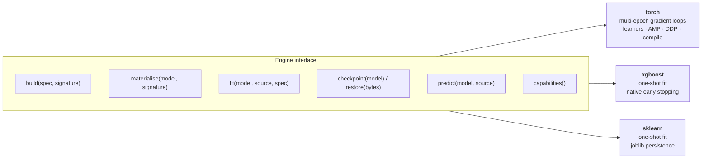

The XGBoost engine is the honesty test. Trees fit in a single call with no loop
at all. If the engine contract can only accommodate a model that trains over
epochs, then it is a PyTorch interface with a generic name. It is held to the
same shared conformance suite as the Torch engine, and it produces the same
artifacts — including a boosting history reported through the same `FitOutcome`
a neural network produces.

Because the pipelines talk only to this interface, adding a backend is a new
sub-package and one registration line. It is not a change to any pipeline.

---

## 8. Orchestration: one run, and many

### 8.1 What a job set is

A job set is deliberately unglamorous: **a list of jobs, each a full
independent training run of the same model**, differing in its data slice and —
optionally — in its architecture complexity. A liquid cluster with abundant
history can be given a wider, deeper configuration than a sparse one, from the
same specification file.

What a job set is *not* is a kind of model. There is no ensemble model class,
no shared parameters and no joint optimisation. Fan-out is an execution
concern, which is why `jobs` sits beside `compute` rather than inside `models`.

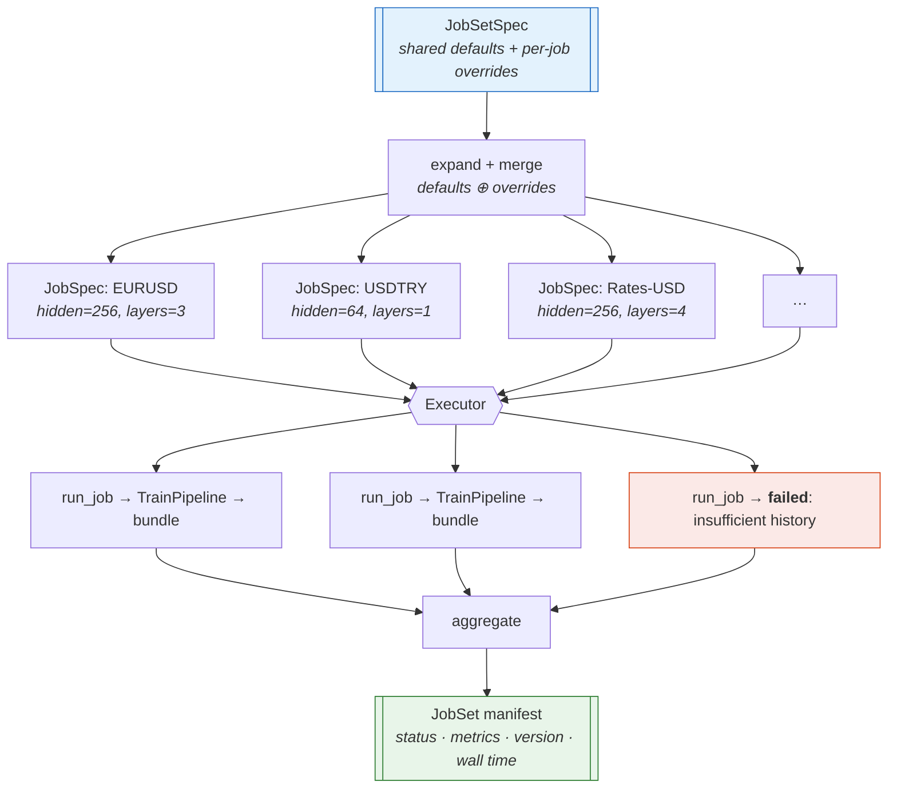

**Partial failure is first-class.** A set of forty clusters where one has
insufficient history returns thirty-nine trained models and one recorded
failure with its reason. Discarding thirty-nine good models because of one bad
input is the behaviour that makes a framework untrustworthy at scale.

### 8.2 Placement cannot change results

An executor takes a list of callables and runs them. That is the entire
interface, and its narrowness is what keeps parallelism out of pipeline logic.
A pipeline cannot observe which executor is running it, so moving from
sequential to eight processes is a configuration change that *cannot* alter
results — and the test suite verifies exactly that by running both and
comparing artifacts.

| Executor | Use | Why it exists |
| --- | --- | --- |
| `local` | Sequential, in-process | The reference implementation every other executor must reproduce, and the only sane way to debug |
| `processes` | CPU parallel | Spawn start method, with per-worker thread budgets so N workers do not each claim every core |
| `gpus` | One worker per device | Device visibility pinned *before* the training library is imported — the only point at which pinning reliably takes effect |
| `cluster` | Later | — |

`policy.py` picks a sensible executor and worker count from the hardware
actually present and the size of the job set, so placement need not be
hand-tuned to get reasonable throughput.

---

## 9. Storage: the system of record

A bundle is **self-describing**. Given only a bundle directory, the framework
can state which model produced it, from which spec, against which data
fingerprint, at which code version — and can rebuild the model and invert its
target transforms without consulting the original run.

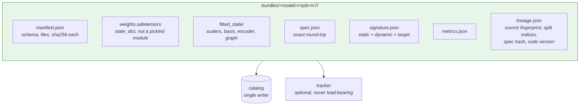

Four properties, each fixing a specific way this goes wrong:

**Atomic writes.** A bundle is built in a temporary directory and renamed into
place. An interrupted write leaves nothing that *looks* valid, which is worse
than leaving nothing at all.

**Content hashes.** Every file is hashed in the manifest, so corruption and
silent drift are detected at load rather than surfacing as inexplicable
predictions.

**`state_dict`, not pickled modules.** A pickled `nn.Module` embeds the import
path of your class. Rename the class and every saved model becomes
unloadable — which is precisely the situation a refactor creates. It also means
loading a model executes arbitrary code from the file.

**One catalog writer.** A catalog updated by eight worker processes through
read-modify-write loses entries. Not often. Just often enough that nobody
trusts the catalog, and the index gets rebuilt by hand.

**Decisions are events, not edits.** Choosing among runs -- by tag, by best
metric, by an alias such as `production` -- is `storage.runs.registry`. A tag
added after training, or a promotion, is appended to a log beside the
catalog rather than written into the bundle, so the record of what was
trained never depends on what was decided later, and the log is the audit
trail. Every run under one `output_root` shares one catalog, so a sweep's
variants and successive retrains can be compared. See `GUIDE.md` §12.

**Tracking is optional infrastructure.** A run must never fail because a
tracking server is unreachable. The default is a no-op.

---

## 10. Analysis: metrics, visuals, reports

The split between the last two is the one that usually gets lost in research
code, and it is worth being strict about.

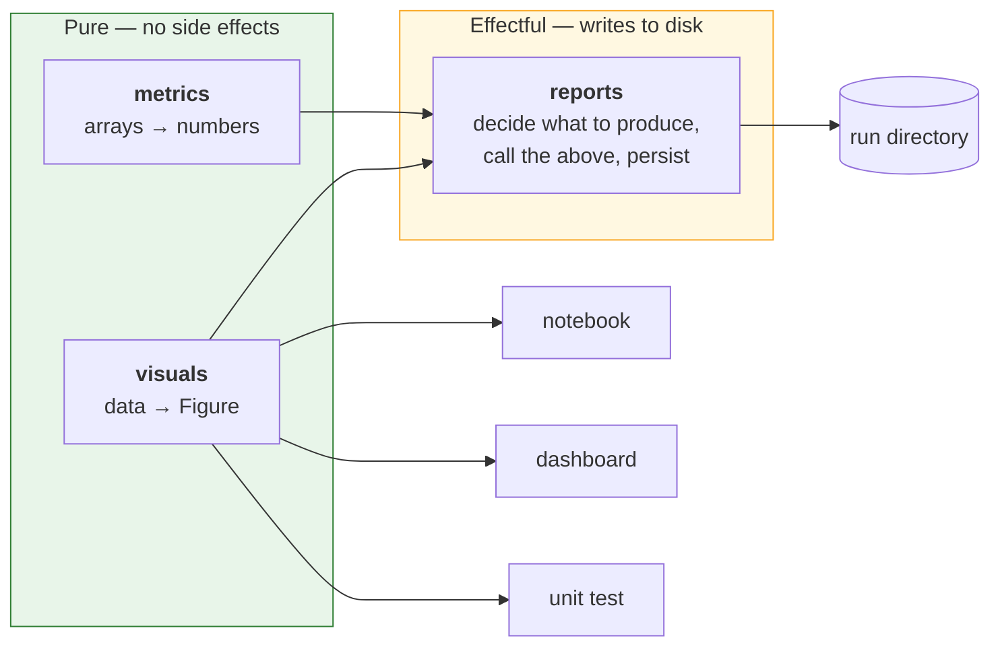

A visual takes data and returns a figure. It does not save, show, close or
mutate global plotting state. That purity is the entire reason the same
function can serve a saved report, a notebook, a dashboard and a test — and it
is what makes it testable at all, since a test can assert on axis labels,
series count and data limits without rendering anything.

A report, by contrast, is where the effects live. Reports are **declarative**
(enabled in the spec, resolved by name) and **never load-bearing**: a report
that raises produces a warning, not a lost training run. Discarding four hours
of training because a figure failed to render is not a trade anyone would make
deliberately.

---

## 11. Writing a model

Every model is a **package** under `rade_qnet/models/`, and every package has the
same five files whatever its size. Capability is added by *adding* files,
never by moving or renaming them.

> The full procedure -- tier classification, per-file contracts, flowcharts,
> the sign-off checklist and the failure-mode table -- is
> [`MODEL_IMPLEMENTATION.md`](MODEL_IMPLEMENTATION.md). This section states
> the design decision and its rationale; that document is how you follow it.

### One shape, four tiers

```text
models/<name>/
├── __init__.py     ALWAYS   the charter, and `from .register import …`
├── spec.py         ALWAYS   what can be configured
├── model.py        ALWAYS   what is computed      (imports no framework wiring)
├── data.py         ALWAYS   REQUIRES, and where the data comes from
├── register.py     ALWAYS   how it plugs in       (contains no mathematics)
├── state.py        TIER 2   the FittedState subclass
├── layers/         TIER 3   one architectural block per file
├── features/       TIER 3   model-specific feature construction
├── pipelines/      TIER 4   train.py · eval.py · tune.py  (no infer.py: see below)
└── reports.py, visuals.py   optional, any tier
```

There are no loose modules under `models/` and no category sub-folders:
`rade_qnet.models.<name>` is a model, always. The vocabulary above is closed
and `tests/rade_qnet/models/test_model_layout.py` enforces it, so a file named
anything else is a failing test rather than a convention somebody did not
know about.

### Why the smallest model pays the ceremony too

An earlier version of this document said *"a simple model is one file…
splitting fifty lines across four files helps nobody"*. That was reversed,
for three reasons:

1. **The rule was not true.** It stated that registration lived in
   `model.py`; no simple model had a `model.py` -- the file on disk was
   `ridge.py`. Anyone following the documentation would have written
   something that did not match the repository.
2. **The library had two incompatible shapes and no rule distinguishing
   them.** Simple models were loose files under `models/baselines/`; the
   flagship was a package. A contributor could not tell which applied, and
   either choice was inconsistent with half the library.
3. **The saving was smaller than claimed.** One-file `ridge` was 25
   statements; the split version is 30 before `data.py` and 51 with it.
   "Fifty lines across four files" was never the actual trade, and the
   increase that did arrive bought a checked input contract.

What the uniform shape buys: one procedure with no judgement call, no
migration when a model grows a capability, mathematics that can be read and
unit-tested with no framework present, and a reviewer who always knows which
file to open.

### The input contract

`data.py` is mandatory at every tier, and it carries more than a data module.
It exports a `REQUIRES` naming the inputs the model consumes and their ranks,
which the pipeline checks against the data build at `declare_signature` --
before the model is constructed.

That is the one place in a run where information flows model to data.
Everywhere else the build declares what it produced and the model copes, and
coping is what turns a wrong data build into a plausible loss curve rather
than an error. Two defects motivated it: a recurrent model that scanned the
batch and trained on whichever tensor the dictionary yielded first, and a
wrongly placed time axis that produced a tensor the recurrence accepted and
learned nonsense from. Both ran to completion and reported a falling loss.

`data.py` is required even when it returns the framework's own table module
in one line. The reason is that it almost never stays that way -- the moment
the data lives in a store rather than a CSV, `load()` is the user's -- and a
file that is present from the start means that change touches one function
instead of restructuring the package. See
[`MODEL_IMPLEMENTATION.md` §4.4](MODEL_IMPLEMENTATION.md).

### The `model.py` / `register.py` split

The load-bearing decision. `model.py` reads as a piece of mathematics -- a
reader asking *what does this compute?* opens it and finds nothing else.
`register.py` holds the wiring, for the reader asking *how does this plug
in?* The split is enforced: `model.py` may not import the registry, the run
spec or the training spec.

A tier 1 model, complete:

```python
# rade_qnet/models/ridge/model.py  -- no framework import anywhere
def build(settings: RidgeSpec) -> Ridge:
    return Ridge(alpha=settings.alpha, fit_intercept=settings.fit_intercept)
```

```python
# rade_qnet/models/ridge/data.py  -- what is required, and where it comes from
REQUIRES = InputRequirement.unconstrained()   # a flattening model has no constraints


def data_module(spec: SupervisedRunSpec) -> TabularDataModule:
    del spec
    return TabularDataModule()
```

```python
# rade_qnet/models/ridge/register.py
from ...engines import sklearn as _engine  # noqa: F401  -- registers the engine
from .data import REQUIRES, data_module

@model("ridge", engine="sklearn")
class RidgeModel(SupervisedModel):
    """Framework declaration for the ridge regression."""

    requires = REQUIRES
    spec = RidgeSpec

    def data_module(self, spec: SupervisedRunSpec) -> TabularDataModule:
        return data_module(spec)

    def build_model(
        self, spec: SupervisedRunSpec, signature: InputSignature
    ) -> Ridge:
        del signature
        return build(RidgeSpec.model_validate(dict(spec.model.params)))
```

Note that `build_model` receives the whole `SupervisedRunSpec` and validates
its own parameters out of it, rather than receiving a `RidgeSpec` directly.
The framework cannot type `model.params` -- it is the one block whose shape
only the model knows -- so the model is the thing that parses it.

Note also the engine import. `engine="sklearn"` is a *declaration*; importing
`rade_qnet.engines.sklearn` is what makes the name resolvable. Without it the
model works whenever something else in the process happened to import the
engine, and fails the first time it is run alone.

That model gets the full lifecycle: leakage-aware splits, a versioned bundle,
the standard metrics and reports, and fan-out across a job set. A framework
that only pays off for large models is a framework people work around.

### The same shape at tier 4

```python
# rade_qnet/models/hybrid_gnn_rnn/register.py
@model("hybrid_gnn_rnn", engine="torch")
class HybridGnnRnnModel(SupervisedModel):
    """Framework declaration for the hybrid graph-temporal network."""

    requires = REQUIRES             # the six inputs it consumes, by name
    spec = HybridModelSpec          # validates model.params
    data_spec = HybridDataSpec      # validates source.params
    state_cls = HybridState         # the FittedState subclass
    pipelines: Mapping[str, type] = MappingProxyType(
        {
            "train": HybridTrainPipeline,
            "eval": HybridEvalPipeline,
            "tune": HybridTunePipeline,
        }
    )

    def data_module(self, spec: SupervisedRunSpec) -> HybridDataModule:
        del spec
        return HybridDataModule()

    def build_model(
        self, spec: SupervisedRunSpec, signature: InputSignature
    ) -> HybridGnnRnn:
        ...
```

Four declarations more than `ridge`, in the same file, with the same two
methods. That is what makes the convention worth its ceremony: a reader who
has understood the smallest model has understood the largest one's wiring.

Separate files per stage rather than one `pipelines.py`: a model needing a
custom evaluation but standard training should not have to open a file that
also contains training code.

There is no `infer.py`. Inference is "load the bundle and run the model
forward", and a model that needs to change that has changed what its bundle
means -- which is a problem to fix in the bundle, not to paper over with a
fourth override.

---

## 12. Using the framework

### Train one model

```python
from rade_qnet import api

result = api.train("configs/hybrid_eurusd.yaml")
print(result.evaluations["test"].metrics["mae"])   # already in original target units
```

### Train it across many groups

```python
manifest = api.train_jobs("configs/hybrid_portfolio.yaml")
print(manifest.summary())                      # "39 of 40 job(s) succeeded in 1842.3s"
for record in manifest.failed:                 # a failed job is a record, not an exception
    print(record.job_id, record.failure_kind, record.failure_message)
```

Or, when the jobs are the groups of a dataset described by a `groups.json`
manifest rather than a hand-written list — which is the usual case:

```python
manifest = api.train_groups(
    "data/eod",
    defaults={...},                            # the fragment every group shares
    output_root="artifacts/eod",
    overrides_for=lambda group: {              # per-group complexity
        "model": {"params": {"units": min(32, len(group.input_ids))}}
    },
)
```

```yaml
# configs/hybrid_portfolio.yaml
model: hybrid_gnn_rnn           # shorthand for defaults.model.name

defaults:                       # a run-specification fragment, shared by every job
  source:
    kind: model                 # the model's own data module reads the directory
    split: {kind: chronological, validation_fraction: 0.15, test_fraction: 0.15}
    transforms:
      sequence: {length: 20}
      reduction: {method: basis_selection, fit_on: train}   # no selection leakage
  training:
    engine: torch
    epochs: 200
    early_stopping: {patience: 20, monitor: val_loss}
  hardware:
    device: cpu
    precision: fp32
    threads_per_worker: 1       # pinned, so placement cannot change the numbers
  reports: {enabled: [summary, curves, quality, graph_structure]}

jobs:                           # per-job overrides, including complexity
  - id: FX__G10
    source: {params: {directory: data/books/eod/FX__G10}}
    model: {params: {units: 256, gnn_layers: 3}}
  - id: FX__EM
    source: {params: {directory: data/books/eod/FX__EM}}
    model: {params: {units: 64, gnn_layers: 1}}    # sparse history, smaller model
  - id: RATES__USD
    source: {params: {directory: data/books/eod/RATES__USD}}
    model: {params: {units: 256, gnn_layers: 4}}

placement:
  executor: gpus                # or processes, local, or auto
  workers: 4
```

Each job's overrides are deep-merged **over** `defaults`, as raw mappings,
before validation. Naming one field leaves its siblings alone at every
depth: `FX__EM` above changes two model parameters and keeps every training,
hardware and transform setting the set declared. Merging *validated*
specifications instead would be simpler and silently wrong — once a mapping
has been through the schema, a field the user never mentioned is
indistinguishable from one they set, so every job would carry its own copy
of every default and overwrite the shared ones.

A note on `hardware.threads_per_worker`. It is pinned here because the
number of intra-op threads fixes the order a reduction accumulates in, and
therefore the last few significant figures of every metric. Pinned, a set
scores identically whether it ran sequentially or across eight processes;
left unset, the budget is whatever each host decided. See
`phases/PHASE_4_JOB_SETS.md` §8.1.

### Evaluate, tune, infer

```python
api.evaluate(bundle="hybrid_gnn_rnn/FX__G10/v7", split="test")
api.tune("configs/hybrid_tune.yaml")              # data built once, reused per trial
api.act(bundle="hedger/USD/v3", observation=obs)  # reinforcement-learning path
```

Or from the command line:

```bash
rade-qnet train      configs/hybrid_eurusd.yaml
rade-qnet train-set  configs/hybrid_portfolio.yaml --executor processes --workers 8
rade-qnet evaluate   hybrid_gnn_rnn/FX__G10/v7 --split test
rade-qnet tune       configs/hybrid_tune.yaml --trials 50
```

### Add your own model

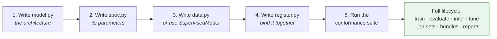

Step 5 is not optional and not a formality. `rade_qnet.testkit.conformance`
checks that the model builds from its spec and signature, that its fitted state
round-trips, that its bundle reloads into an equivalent model, that metrics come
back in original target units, and that scenario-axis transforms saw training
rows only. A documented contract that nothing executes is a contract that gets
violated.

---

## 13. Design decisions and the defects they fix

Much of this architecture is a direct response to specific, diagnosed failures
in the implementation it supersedes (`rade_ml_pt`). Recording them here is what
stops them being reintroduced — and several were silent, which is why they
survived.

| # | Defect | Consequence | Architectural fix |
| --- | --- | --- | --- |
| 1 | Data config `to_dict`/`from_dict` dropped inherited fields | Saved config was lossy; `seq_length=5` reloaded as `1` | Pydantic specs with exact round-trip, verified by test |
| 2 | Data config could not be constructed with defaults | `Config()` raised | Specs validate standalone; no required field hidden in a default factory |
| 3 | One `shuffle` flag drove both the scenario split and batch order | Random, leaky splits; with `seq_length>1`, windows straddled splits | `SplitSpec` and `LoaderSpec` are separate objects |
| 4 | Collation compared every static tensor for every sample | Pure overhead on every batch of every epoch | Static inputs live in `TensorBatchData.static`, uploaded once |
| 5 | Registry index read-modify-write | Lost entries under a process pool | Single-writer catalog, append-oriented |
| 6 | Distributed wrapper applied before lazy parameters materialised | Empty parameter groups or a crash in the distributed library | `materialise` is a pipeline stage, ordered before `prepare_hardware` |
| 7 | Tune passed unknown fields to a frozen training config | `TypeError` (latent — masked by a model override) | Typed trial-override merge with validation |
| 8 | Global deterministic algorithms forced inside a swallowed `try`/`except` | Unpredictable performance; failures invisible | `determinism: off \| warn \| strict`, explicit and per-run |
| 9 | Basis selection fitted on the full scaled history | Selection leakage from validation and test | `basis.fit_on: train \| all`, defaulting to `train` |
| 10 | Registry pickled whole modules, loaded with `weights_only=False` | Refactor-fragile; executes arbitrary code on load | `state_dict` / safetensors with a hashed manifest |
| 11 | Config loader `setattr`s every key it is handed onto the target object | Any misspelled setting is silently ignored. Found via `use_baseline_norm` in the config against `use_baseline_weight_norm` on the layer — a feature that had never once been switched on | Specs are Pydantic models that reject unknown fields, so the same typo is a startup error naming the field |
| 12 | Components register as an import side effect, with nothing recording which import | Under a process pool the worker resolves a name only if the *entry point* happened to import the model, because spawn re-imports `__main__`. The same job set works from one script and fails with "no model named ..." from another | `RegistryEntry.defining_module` records the module; `JobPayload.registration_modules` carries it; the worker replays the imports. Resolved in the parent, so an unknown name fails where the error can list the alternatives |
| 13 | Thread budget set only by environment variable, before a worker imports its libraries | Works for a worker (fresh interpreter), silently does nothing for the launching process (already imported). The number of threads fixes the order of a reduction, so the same job scored differently sequentially than pooled — seventh significant figure, reproducible | `HardwareSpec.threads_per_worker` is applied in-process by `apply_thread_budget`, so the budget travels in the specification and holds wherever the job lands |

Defect 11 was found during Phase 3 rather than during the Phase 0 audit, which
is itself the argument for the parity gate: a silent setting is invisible to
every test that does not already know it exists. Detail in
[`phases/PHASE_3_HYBRID_GNN_RNN.md` §8.2](phases/PHASE_3_HYBRID_GNN_RNN.md#82-defect-11-found-during-the-port).

### Refactor parity

The flagship is not rewritten on trust. A golden fixture is captured from the
current implementation *before* any new code is written, and the refactor must
reproduce it at five levels:

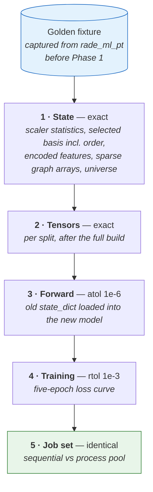

Tolerances widen down the list for a reason. Levels 1 and 2 are deterministic
array computations and must match exactly; anything else is a bug, not noise.
Level 3 allows accumulated floating-point reassociation. Level 4 allows
kernel-level non-determinism across a short training run. Level 5 is back to
exact, because placement must not change results.

Where a defect in the table above changes behaviour, parity is asserted against
the *old* behaviour via a compatibility flag — `basis.fit_on: all` reproduces
defect 9 — and the flag is then flipped to the correct default in a separate,
visible, reviewable change. Fixing bugs and proving a refactor are two
different tasks, and doing them in one commit means neither is verified.

Full detail: [`phases/PHASE_0_BASELINE.md`](phases/PHASE_0_BASELINE.md).

---

## 14. Glossary

| Term | Meaning |
| --- | --- |
| **Spec** | A declarative, validated, hashable description of intent. Holds no state. |
| **Contract** | A typed payload passed between pipeline stages. |
| **Capability** | A narrow protocol a model may optionally implement to unlock behaviour. |
| **Engine** | The adapter for one training library. The only code that imports it. |
| **Learner** | An update rule — what one optimisation step means. |
| **Loop driver** | `fit_epochs` or `fit_steps` — when to step, validate, checkpoint, stop. |
| **`BatchSource`** | The single protocol every training loop consumes. |
| **`DataBundle`** | Splits, fitted state, input signature and lineage, from a data module. |
| **`FittedState`** | Everything fitted at training time and needed again at inference. |
| **`InputSignature`** | Declared shapes and dtypes of static inputs, dynamic inputs and target. |
| **Static input** | An input constant across every batch (a graph, entity features). |
| **Scenario axis** | The time axis. Fitting here may observe training rows only. |
| **Entity axis** | The instrument axis. Fitting here may observe the full universe. |
| **Bundle** | The self-describing, versioned on-disk artifact of a completed run. |
| **Lineage** | Source fingerprint, split indices, spec hash and code version. |
| **Job** | One independent training run within a job set. |
| **Job set** | A list of jobs for the same model, each with optional overrides. |
| **Executor** | Runs a list of callables. Cannot be observed by a pipeline. |
| **Report** | A declarative, never-load-bearing writer of run artifacts. |
| **Visual** | A pure function returning a figure. Writes nothing. |
| **Conformance** | The executable check that a model satisfies the framework's contracts. |
| **Parity** | The executable check that a refactored model reproduces a golden fixture. |

---

## Where to go next

- [`GUIDE.md`](GUIDE.md) — **how to use the framework**: the contracts you
  must satisfy, worked examples at every level of complexity, the flagship in
  single-member and portfolio mode, and what running this in production
  asks of you. Start there if you want to *build* something; stay here if you
  want to know why it is shaped this way.

| You want to | Read |
| --- | --- |
| Build the framework | [`IMPLEMENTATION.md`](IMPLEMENTATION.md) |
| Know the standard code is held to | [`CODING_STANDARDS.md`](CODING_STANDARDS.md) |
| Understand one phase in depth | [`phases/`](phases/) |
| Know what belongs in a package | That package's `__init__.py` charter |
