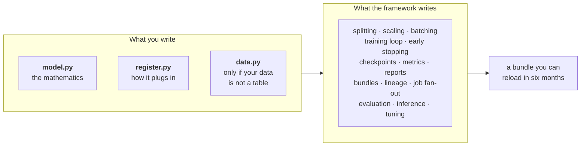
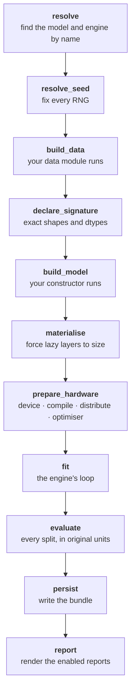

# rade_qnet — The Guide

**How to use the framework, what it will ask of you, and what it gives back.**

This is the companion to [`ARCHITECTURE.md`](ARCHITECTURE.md). That document
answers *why is the framework shaped like this*. This one answers *how do I
use it*, and it is written to be read front to back by somebody who has never
seen the codebase.

Every code block below is real. The examples are taken from working modules
and the outputs are from actual runs, not illustrations.

---

## Contents

1. [The one idea](#1-the-one-idea)
2. [The lifecycle, stage by stage](#2-the-lifecycle-stage-by-stage)
3. [The four tiers of model](#3-the-four-tiers-of-model)
4. [Tier 1 — the smallest complete model](#4-tier-1--the-smallest-complete-model)
5. [Still tier 1 — your own architecture](#5-still-tier-1--your-own-architecture)
6. [Tier 3 — your own data: the flagship, single member](#6-tier-3--your-own-data-the-flagship-single-member)
7. [Tier 4 — your own pipeline stages](#7-tier-4--your-own-pipeline-stages)
8. [Group mode — one model, many slices of data](#8-group-mode--one-model-many-slices-of-data)
9. [The contracts, precisely](#9-the-contracts-precisely)
10. [The registry](#10-the-registry)
11. [The run specification](#11-the-run-specification)
12. [What you get back](#12-what-you-get-back)
13. [Running in production](#13-running-in-production)
14. [Failure modes the framework catches for you](#14-failure-modes-the-framework-catches-for-you)

---

## 1. The one idea

A machine-learning run is the same shape every time. Build the data, declare
the interface, build the model, fit it, score it, save it, report it. What
changes between a ridge regression and a graph-temporal network is *what goes
in each box*, not the boxes.

So the framework owns the boxes and you own the contents.



The practical consequence is the thing worth internalising: **you never write
a training loop.** If you find yourself writing one, you are fighting the
framework and something above you is wrong.

### Who owns what

| Concern | Owner | Why it is there and not elsewhere |
| --- | --- | --- |
| What the model computes | You | It is the only part that is actually your problem |
| How raw inputs become arrays | You, if non-tabular | Only you know what a trade file looks like |
| Splitting, scaling, windowing | Framework | Every model needs it and every model gets it wrong the same way |
| The training loop | Framework | Writing it per model is how two models stop being comparable |
| Early stopping, checkpointing | Engine | It is backend-specific and nothing above needs to know |
| Metrics, reports, bundles | Framework | A result that cannot be compared to another result is not a result |
| Running one model many times | Framework | Fan-out is an operational concern, not a modelling one |

---

## 2. The lifecycle, stage by stage

Four pipelines exist: **train**, **evaluate**, **infer**, **tune**. Each is a
named sequence of stages. The stage names are not decorative — they appear in
logs, in error messages, and they are the unit you override.

### The train pipeline



Two of those deserve explanation because they are not obvious.

**`declare_signature`** produces an `InputSignature`: the exact name, shape
and dtype of every input the model will see, plus the target. It exists so
that `build_model` can size every layer *before* a single batch is loaded. A
model with lazily-sized layers has no parameters until its first forward
pass, and an optimiser built over an empty parameter set reports success and
updates nothing — the loss curve looks normal because the layers that *did*
exist still train. The signature is also what makes a saved bundle reloadable
without the original data.

**`materialise`** runs a dummy forward pass built from the signature, to force
any remaining lazy layers to size. It happens *before* `prepare_hardware`,
and the order is a contract: device placement, then compilation, then
distribution, then the optimiser. Each depends on the previous one having
happened.

### The other three

```
evaluate:  load → rebuild_data → restore → score → report
infer:     load → prepare_inputs → restore → predict → invert → attribute
tune:      resolve → propose → build_data → run_trials → select → refit
```

`evaluate` **rebuilds** the data rather than re-deriving it: the split indices
and the fitted scalers come out of the bundle. That is what makes a re-score
of unchanged data reproduce the training metrics *exactly* rather than
approximately.

`infer` has an `invert` stage because predictions come out of the model in
scaled units and nobody wants those. It also has `attribute`, which attaches
the bundle version, the spec digest and the data fingerprints to the numbers,
so a prediction can be reconciled three weeks later.

---

## 3. The four tiers of model

The framework is built so that complexity is **paid for only when used**. The
tiers are not formal categories; they are a description of how much you end
up writing.

| Tier | You add | Files | Example |
| --- | --- | --- | --- |
| 1 | A spec, a constructor and an input contract | the five required | `ridge`, `xgb_tabular`, `lstm_tabular` |
| 2 | …a fitted artefact that must survive to inference | `+ state.py` | — |
| 3 | …your own data build (in the `data.py` you already have) | `+ layers/`, `features/` | `hybrid_gnn_rnn` |
| 4 | …pipeline stage overrides | `+ pipelines/` | `hybrid_gnn_rnn` |

Every model is a package with the **same five files** whatever its tier;
higher tiers *add* files and never rename or move them. The exact rules,
the per-file contracts and the enforcement are in
[`MODEL_IMPLEMENTATION.md`](MODEL_IMPLEMENTATION.md) — this section is the
tour, that document is the procedure.

The important property is that **tier 1 does not know tiers 3 and 4 exist**.
Nothing in `models/ridge/` imports a pipeline, a data module or a state class.

Note what does *not* raise the tier: a custom `nn.Module` is still tier 1.
`lstm_tabular` writes its own network and remains five files, because a
custom architecture lives in `model.py` — which every model has anyway.
Needing your own *data build* is what moves you up, and even that adds no
file: it changes what `data.py` returns.

Most real models end up at tier 3, and that is the expected destination
rather than an advanced case. `TabularDataModule` reads a CSV; anything
behind a store, a warehouse or an internal service needs its own `load()`.
`data.py` exists from tier 1 precisely so that change touches one function.

---

## 4. Tier 1 — the smallest complete model

Here is a complete, registered, production-usable model: three short files
plus a charter, shown minus their docstrings.

```python
# src/rade_qnet/models/ridge/spec.py        — what can be configured

class RidgeSpec(Spec):
    alpha: float = Field(default=1.0, gt=0.0)
    fit_intercept: bool = True
```

```python
# src/rade_qnet/models/ridge/model.py       — what is computed
# Imports no registry, no run spec, no engine. Callable from a notebook.

def build(settings: RidgeSpec) -> Ridge:
    return Ridge(alpha=settings.alpha, fit_intercept=settings.fit_intercept)
```

```python
# src/rade_qnet/models/ridge/data.py        — what data is required, and from where
# REQUIRES is checked against the data build before the model is constructed.
REQUIRES = InputRequirement.unconstrained()   # ridge flattens whatever it is given


def data_module(spec: SupervisedRunSpec) -> TabularDataModule:
    del spec
    return TabularDataModule()
```

```python
# src/rade_qnet/models/ridge/register.py    — how it plugs in
from ...engines import sklearn as _engine  # noqa: F401  — registers the engine
from .data import REQUIRES, data_module


@model("ridge", engine="sklearn")
class RidgeModel(SupervisedModel):
    requires = REQUIRES
    spec = RidgeSpec

    def data_module(self, spec: SupervisedRunSpec) -> TabularDataModule:
        return data_module(spec)

    def build_model(
        self, spec: SupervisedRunSpec, signature: InputSignature
    ) -> Ridge:
        del signature
        return build(RidgeSpec.model_validate(dict(spec.model.params)))
```

```python
# src/rade_qnet/models/ridge/__init__.py    — the charter
from .register import RidgeModel
from .spec import RidgeSpec
```

That is the whole contract for a simple model: **say what your settings are,
say where your data comes from, and return an unfitted model.**

Why four files rather than one is argued in
[`MODEL_IMPLEMENTATION.md` §2.3](MODEL_IMPLEMENTATION.md); the short version
is that the split is what lets `build` be unit-tested with no framework
present, and what means a model growing a data build *adds* a file instead
of being taken apart.

### What each piece does

`class RidgeSpec(Spec)` — a Pydantic model that validates the `model.params`
block of a run specification. `alpha` is constrained to be positive, so a
specification with `alpha: -1` is rejected when it is parsed rather than
producing an obscure failure inside scikit-learn twenty minutes later.

`@model("ridge", engine="sklearn")` — registers the class under the name
`"ridge"` and declares that it trains on the sklearn engine. This is what
makes `{"model": {"name": "ridge"}}` resolve.

`SupervisedModel` — the base class for any model that learns from inputs
with known targets, whatever shape the data takes (a table, sequences, a
graph). It supplies `build_data`, `signature` and `rebuild_data` for you. You override
only `data_module` and `build_model`.

`del spec` / `del signature` — an explicit statement that the argument is
genuinely unused, rather than silence that could be an oversight.

`from ...engines import sklearn` — importing the engine package is what puts
`"sklearn"` in the engine registry. The decorator *declares* the engine; this
import is what makes the declaration resolvable. Omit it and the model works
whenever something else in the process happened to import the engine, and
fails the first time it runs alone.

### Running it

```python
from rade_qnet.api import train, evaluate, infer
import rade_qnet.models.ridge  # registers it

result = train({
    "task": "supervised",
    "model": {"name": "ridge", "params": {"alpha": 0.1}},
    "source": {"kind": "tabular", "path": "data/book.csv"},
    "training": {"engine": "sklearn"},
}, output_root="artifacts/demo")

print(result.metric("test", "mae"))

bundle = result.bundle_directory
evaluate(bundle)                    # re-scores, identically
infer(bundle)                       # predicts, with provenance attached
```

### What you did not write

Splitting. Scaling. Batching. The fit call. Metric computation. Inverse
transforms so the metrics are in original units. The bundle. The lineage
record. Four reports. Re-scoring from disk. Inference with provenance. All of
it came from declaring two methods.

---

## 5. Still tier 1 — your own architecture

When the network is yours but the data is still a table, you write
`model.py` and change nothing else. **This is still tier 1** — a custom
architecture does not raise the tier, because `model.py` is a file every
model has. What raises it is needing a fitted artefact of your own (tier 2)
or a data build of your own (tier 3).

That is worth stating plainly, because "my model is complicated, so it must
need the complicated machinery" is the most common way people over-build
here. `lstm_tabular` is a recurrent network written from scratch and it is
four files, the same four as `ridge`.

```python
# src/rade_qnet/models/lstm_tabular/  (abridged)

class LstmTabular(nn.Module):
    def __init__(self, settings: LstmTabularSpec, *, n_features: int) -> None:
        super().__init__()
        self.rnn = nn.LSTM(
            input_size=n_features,
            hidden_size=settings.units,
            num_layers=settings.layers,
            batch_first=True,
        )
        self.head = nn.Linear(settings.units, 1)

    def forward(self, **inputs: Tensor) -> Tensor:
        sequence = _sequence_of(inputs)
        output, _ = self.rnn(sequence)
        return self.head(output[:, -1, :])


@model("lstm_tabular", engine="torch")
class LstmTabularModel(SupervisedModel):
    spec = LstmTabularSpec

    def data_module(self, spec: SupervisedRunSpec) -> TabularDataModule:
        del spec
        return TabularDataModule()

    def build_model(self, spec, signature) -> LstmTabular:
        settings = LstmTabularSpec.model_validate(dict(spec.model.params))
        return LstmTabular(settings, n_features=_feature_width(signature))
```

Three things to copy from this.

**Inputs arrive as keyword arguments.** The engine calls
`model(**batch)`, by name rather than position, because a model with four
inputs cannot afford positional arguments. The target is *not* among them —
the loader removes it before calling, so there is nothing to filter out.

**Size from the signature, not from a first batch.** `n_features` comes from
`signature`, which is why `build_model` receives it. This is the lazy-layer
trap described in §2 and it is worth taking seriously.

**Changing engine is a one-word change.** `engine="torch"` here versus
`engine="sklearn"` in §4. Nothing else in either file differs structurally,
and no pipeline code knows which is which.

---

## 6. Tier 3 — your own data: the flagship, single member

`hybrid_gnn_rnn` is the model the framework was built to hold. Its data is not
a table: it is a set of trades with attributes, a graph over them, and P&L
time series. So it brings its own data module.

### The package layout

```
models/hybrid_gnn_rnn/
├── model.py          the network's forward pass
├── layers/           the blocks it is made of
│   ├── gnn.py            graph encoder
│   ├── rnn.py            temporal encoder
│   ├── fusion.py         how the two combine
│   └── attention.py      target attention
├── features/         basis selection, attribute encoding, graph building
├── data.py           HybridDataModule: raw files → arrays
├── state.py          HybridState: the fitted transforms
├── spec.py           HybridModelSpec, HybridDataSpec
├── register.py       the framework declaration
└── pipelines/        train.py, eval.py, tune.py  (tier 4, see §7)
```

The separation between `model.py` and `register.py` is deliberate and worth
copying. `model.py` is what a quant reads and argues with. `register.py` is
what a platform engineer maintains. Interleaving them means neither can skim
their own half — and in practice the wiring wins, because a reader looking for
the mathematics finds registration boilerplate first and gives up.

### The registration

```python
# src/rade_qnet/models/hybrid_gnn_rnn/register.py  (abridged)

@model("hybrid_gnn_rnn", engine="torch")
class HybridGnnRnnModel(SupervisedModel):
    spec = HybridModelSpec          # validates model.params
    data_spec = HybridDataSpec      # validates source.params
    state_cls = HybridState         # what the data build fits
    pipelines = MappingProxyType({
        "train": HybridTrainPipeline,
        "eval": HybridEvalPipeline,
        "tune": HybridTunePipeline,
    })

    def data_module(self, spec: SupervisedRunSpec) -> HybridDataModule:
        del spec
        return HybridDataModule()

    def build_model(self, spec, signature) -> HybridGnnRnn:
        return HybridGnnRnn(
            HybridModelSpec.model_validate(dict(spec.model.params)), signature
        )
```

Compare this to `ridge.py`. It is *the same four declarations* plus three
optional ones. There is no separate "advanced" API: the complex model uses
more of the same surface, not a different surface.

**`spec` and `data_spec` are separate types on purpose.** The data build and
the network are configured independently. Changing the recurrent width should
not invalidate a cached dataset, and two distinct types is what makes that
structurally true rather than merely intended.

### The data module contract

If your data is not a table, you implement five methods:

| Method | Returns | What it is for |
| --- | --- | --- |
| `load(spec)` | your raw type | Read files. The only method that touches disk |
| `n_scenarios(raw)` | `int` | How many rows exist, so the framework can split them |
| `fit_state(raw, indices, spec)` | a `FittedState` | Fit scalers **on train only** |
| `transform(raw, state, spec)` | arrays | Apply the fitted state |
| `signature(…)` | `InputSignature` | Declare exact shapes and dtypes |

The split between `fit_state` and `transform` is the framework's leakage rule
made structural. `fit_state` receives the *training* indices and nothing else,
so fitting a scaler on the test set is not something you have to remember not
to do — there is no code path that would let you.

### Running it on one cluster

```python
import rade_qnet.models.hybrid_gnn_rnn  # registers it

result = train({
    "task": "supervised",
    "name": "eurusd-member",
    "seed": 0,
    "model": {"name": "hybrid_gnn_rnn", "params": {"units": 16}},
    "source": {
        "kind": "model",                       # use the model's data module
        "transforms": {"sequence": {"length": 4}},
        "split": {
            "kind": "chronological",
            "validation_fraction": 0.15,
            "test_fraction": 0.15,
        },
        "loader": {"batch_size": 16, "shuffle": True},
        "params": {                            # validated by HybridDataSpec
            "directory": "data/clusters/EURUSD",
            "variance_threshold": 0.99,
            "encoder": {},
            "graph": {"n_neighbours": 5},
        },
    },
    "training": {"engine": "torch", "epochs": 30, "loss": "mse"},
    "hardware": {"device": "cpu"},
}, output_root="artifacts/member")
```

`"kind": "model"` is the switch. It means *do not look for a CSV; call the
model's own data module and hand it `source.params`*. That block is validated
by `HybridDataSpec`, so `n_neighbours: 0` is rejected at parse time.

The split is **chronological**, which matters for a time series: a random
split lets the model see the future. The framework also inserts a boundary gap
so a four-step window cannot straddle two splits — and it refuses the
combination it cannot make safe:

> sequence length 4 with an explicit split: the framework cannot insert a
> boundary gap into caller-supplied indices, so a window could straddle two
> splits.

---

## 7. Tier 4 — your own pipeline stages

Sometimes the standard lifecycle is right in shape but incomplete in content.
The flagship overrides three of the four, and each override is worth
understanding because they are three different *kinds* of override.

### Additive: `train`

`HybridTrainPipeline` runs the framework's train pipeline unchanged and adds
model-specific reports at the end. It changes no numbers.

### Corrective: `eval`

`HybridEvalPipeline` adds a per-target error breakdown. The pooled error of a
model predicting three targets hides the case where it replicates two well and
one badly — which is the case a desk needs to know about.

This override is also where a real bug was caught. The first version compared
a scaled forward pass against inverted targets and reported errors ten times
too large. The fix, and the test that now pins it:

```python
predictions = data.state.inverse_transform_targets(
    np.asarray(self._engine(loaded).predict(handle, source), dtype=np.float64)
)
targets = collect_targets(data, source, split="test")
```

> `test_the_mean_of_the_per_target_errors_is_the_pooled_error`

### Restrictive: `tune`

`HybridTunePipeline` overrides `propose` to discard infeasible trials before
they are spent. A fusion width of 24 cannot be split into 4 equal heads, and a
naive grid discovers that one wasted trial at a time. The framework cannot
know this constraint; the model can.

### How an override is wired

```python
pipelines = MappingProxyType({"train": ..., "eval": ..., "tune": ...})
```

Four keys are legal: `train`, `eval`, `infer`, `tune`. An override must be a
subclass of the pipeline it replaces. All three conditions are enforced:

```python
# orchestration/pipelines/resolve.py
LIFECYCLES = frozenset({"train", "eval", "infer", "tune"})

def pipeline_for(definition, lifecycle, default): ...
```

A typo like `"evaluate"` raises `ComponentError` naming the valid keys rather
than silently never being read. Note the flagship deliberately has **no**
`infer` override — inheriting the framework's is the right answer and the
absence is documented so a reader does not assume it was forgotten.

---

## 8. Group mode — one model, many slices of data

Group mode is not a different model or a different code path. It is the same
model run once per data group, with per-group configuration. A group is
whatever slice your problem has -- a region, a desk, a product line, one
cluster of a P&L book. The framework does not care what a group means; it
only needs a manifest naming the groups and a directory per group.

### The layout

```
data/
├── groups.json            the manifest
├── FX__G10/               one directory per group
├── FX__EM/
└── RATES__USD/
```

```json
{
  "groups": [
    {"name": "FX__G10", "input_ids": ["..."], "target_ids": ["..."],
     "asset_class": "FX"},
    {"name": "FX__EM",  "input_ids": ["..."], "target_ids": ["..."],
     "asset_class": "FX"}
  ]
}
```

`name` is required and becomes the job id. `input_ids` and `target_ids` are
optional and used only for provenance and log lines -- the model reads its
own columns through its own `data.py`. Any other key (`asset_class` above) is
kept as a free-form attribute your override hook can read.

### Running it

```python
from rade_qnet import api

manifest = api.train_groups(
    "data",
    defaults={
        "model": {"name": "hybrid_gnn_rnn"},
        "source": {"kind": "model", "transforms": {"sequence": {"length": 4}}},
        "training": {"engine": "torch", "epochs": 30},
        "hardware": {"device": "cpu", "determinism": "strict",
                     "threads_per_worker": 1},
    },
    output_root="artifacts/groups",
    name="nightly",
    overrides_for=complexity_for,
)

print(manifest.summary())
print(manifest.metric_by_job("test", "mae"))
```

### The hook that makes it worth having

```python
def complexity_for(group) -> dict:
    units = max(8, min(32, len(group.input_ids)))
    return {"model": {"params": {"units": units}}}
```

This is why a group set is a job set rather than a `for` loop. Forcing one
configuration on every group means underfitting the data-rich ones or
overfitting the thin ones. The rule is written against the group -- its
column counts and its attributes -- so it does not go stale the first time
the data changes.

### Three properties that matter operationally

**Partial failure is a result, not a crash.** One broken group does not take
down the run. The manifest records which jobs succeeded and which did not, and
the successful bundles are on disk.

**Placement cannot change the numbers.** Running across processes or
sequentially produces bit-identical metrics, provided the thread budget is
pinned in the specification. This is a tested gate, not an aspiration:

> `tests/rade_qnet/orchestration/jobs/test_jobs_parity.py`

The reason `threads_per_worker: 1` appears in the defaults above is exactly
this: the thread count fixes the order a floating-point reduction accumulates
in, and therefore the last few significant figures.

**Every job is an ordinary run.** Each group produces a normal bundle, tagged
with the snapshot fingerprint of the data it was trained on. You evaluate,
infer from and compare them with the same functions you use for a single
model. There is no group-specific artefact format to learn.

---

## 9. The contracts, precisely

This is the reference section. Everything above is an application of it.

### `ModelDefinition` → `PredictorDefinition` → `SupervisedModel`

What you must implement, by base class:

| Base | Abstract methods | Use when |
| --- | --- | --- |
| `PredictorDefinition` | `build_data`, `signature`, `build_model` | Your data module cannot return the standard prepared dataset and you want full control |
| `SupervisedModel` | `data_module`, `build_model` | Almost always |
| `PolicyDefinition` | `build_environment`, `signature`, `build_policy` | Reinforcement learning (Phase 7) |

Optional class attributes on any of them:

| Attribute | Type | Default |
| --- | --- | --- |
| `spec` | `type[Spec]` | validates `model.params` |
| `data_spec` | `type[Spec]` | validates `source.params` |
| `state_cls` | `type[FittedState]` | what the data build fits |
| `pipelines` | `Mapping[str, type]` | lifecycle overrides |

### `BatchSource` — the protocol everything iterates

```python
class BatchSource(Protocol):
    @property
    def signature(self) -> InputSignature: ...
    @property
    def static(self) -> Mapping[str, TensorLike]: ...
    @property
    def steps_per_epoch(self) -> int | None: ...
    @property
    def n_samples(self) -> int | None: ...
    def batches(self) -> Iterator[Batch]: ...
```

Note which are **properties** and which are **methods** — `signature` and
`steps_per_epoch` are properties, `batches()` is a method.

Two things make this protocol carry more weight than it looks:

- `steps_per_epoch` returning `None` means *unbounded*. That is how an
  interactive, reinforcement-learning source behaves, and it is the only
  field that distinguishes the two cases to a training loop. One protocol
  therefore covers both supervised and RL.
- A source must be **re-iterable**. A source backed by a bare generator
  yields nothing from the second epoch onwards, and the symptom is a training
  curve that flatlines for no visible reason.

### `DataBundle` — what the data build produces

```python
@dataclass
class DataBundle[PayloadT]:
    splits: Mapping[str, PayloadT]   # must contain "train"
    signature: InputSignature
    state: FittedState
    lineage: DataLineage
    entity_ids: tuple[str, ...] | None = None
```

### `FittedState` — what must survive to inference

```python
class FittedState(ABC):
    @abstractmethod
    def save(self, directory: Path) -> None: ...
    @classmethod
    @abstractmethod
    def load(cls, directory: Path) -> Self: ...
    @abstractmethod
    def inverse_transform_targets(self, predictions): ...
```

`inverse_transform_targets` is the method that keeps every metric in the units
the desk thinks in. A pipeline that forgets to call it reports an error about
*σ* times too small, which looks like a very good model.

### `Engine` — the backend contract

```python
class Engine(Protocol):
    def capabilities(self) -> EngineCapabilities: ...
    def materialise(self, model, signature): ...
    def prepare(self, model, *, hardware, training, static=None) -> ModelHandle: ...
    def fit(self, handle, sources, training, *, on_epoch_end=None) -> FitOutcome: ...
    def predict(self, handle, source) -> NDArray[np.floating]: ...
    def save_weights(self, handle, path) -> None: ...
    def load_weights(self, model, path) -> object: ...
```

Three engines ship: `torch`, `sklearn`, `xgboost`. If you write a fourth, run
the conformance suite against it:

```python
from rade_qnet.testkit.conformance import check_engine

report = check_engine(
    MyEngine(),
    model_factory=lambda: MyModel(),
    source_factory=make_source,
    signature=signature,
    directory=tmp_path,
    training=MyTrainingSpec(),
    hardware=HardwareSpec(device="cpu"),
)
assert report.passed, report.describe()
```

Seven clauses, each corresponding to a failure that otherwise produces a run
which completes and reports plausible numbers. The most valuable is
`engine.fit_is_an_improvement`, which catches an engine that trains a *copy*
and leaves the caller's model untouched — easy to do when a wrapper is
involved and invisible in a `FitOutcome`.

---

## 10. The registry

Four registries, one decorator each:

```python
from rade_qnet.core.runtime.components import model, engine, learner, report

@model("my_model", engine="torch")   # MODELS
@engine("my_engine")                 # ENGINES
@learner("my_learner", engine="torch")  # LEARNERS  (RL)
@report("my_report")                 # REPORTS
```

### Importing is registration

There is no plugin scan and no entry-point discovery. **A component is
registered when its module is imported, and not before.** The framework
deliberately does not import every model on its own behalf: a host that only
wants a ridge regression should not pay for Torch to load.

The consequence to internalise: if you see

> `ComponentError: no model named 'hybrid_gnn_rnn'; available: <none registered>`

…from a correct specification, you have not imported the model package.

```python
import rade_qnet.models.hybrid_gnn_rnn  # this line is the fix
```

A model package should import the engine it declares, for the same reason —
`register.py` above does `from ...engines import torch as _torch_engine`, so
that declaring `engine="torch"` cannot resolve to an empty registry.

### Your model does not have to live in this repository

This is the question that matters most for production use, so it gets a
direct answer: **a model in your own package, importing `rade_qnet` as a
third-party dependency, works identically to one that ships here.** There is
no plugin interface to implement and no manifest to write, because
registration is just an import.

```python
# acme_alpha/model.py  —  a different distribution entirely

from pydantic import Field
from sklearn.ensemble import RandomForestRegressor

from rade_qnet.core.capability.supervised import SupervisedModel
from rade_qnet.core.runtime.components import model
from rade_qnet.core.spec.base import Spec
from rade_qnet.engines import sklearn as _engine     # registers the engine
from rade_qnet.sources.dataset.module import TabularDataModule


class AcmeMomentumSpec(Spec):
    n_estimators: int = Field(default=50, ge=1)
    max_depth: int = Field(default=4, ge=1)


@model("acme_momentum", engine="sklearn")
class AcmeMomentum(SupervisedModel):
    spec = AcmeMomentumSpec

    def data_module(self, spec) -> TabularDataModule:
        del spec
        return TabularDataModule()

    def build_model(self, spec, signature) -> RandomForestRegressor:
        del signature
        settings = AcmeMomentumSpec.model_validate(dict(spec.model.params))
        return RandomForestRegressor(
            n_estimators=settings.n_estimators,
            max_depth=settings.max_depth,
            random_state=0,
        )
```

```python
from rade_qnet.api import train, evaluate, infer
import acme_alpha          # the import is the registration

result = train({
    "task": "supervised",
    "model": {"name": "acme_momentum", "params": {"n_estimators": 30}},
    "source": {"kind": "tabular", "path": "book.csv"},
    "training": {"engine": "sklearn"},
    "reports": {"enabled": ["summary", "baselines"]},
}, output_root="runs")

evaluate(result.bundle_directory)   # re-scores identically
infer(result.bundle_directory)      # predicts, with provenance
```

Six public names is the entire surface: `SupervisedModel`, `model`, `Spec`, a
data module, the engine package, and `api`. Everything in §12 — the bundle,
the lineage, the reports, exact re-scoring — comes with it.

This is pinned by `tests/rade_qnet/test_extensibility.py`, which deliberately
uses only those public names. If any of them moves, that test fails, which is
the point: it is a test of whether the public surface is *sufficient*, not of
whether the internals exist.

### Duplicate names are refused

Registering two things under one name raises. It would otherwise be a
last-import-wins race: which model a name refers to would depend on import
order, and a specification would silently train a different model than it
named.

### Isolating registries in tests

```python
from rade_qnet.testkit.fixtures import isolated_registries

with isolated_registries(empty=True):
    ...
```

Pass `empty=True` when your test *claims* a name a shipped component also
uses. Without it, whether the test passes depends on what an earlier test
imported — which is a real failure this framework has already had once.

---

## 11. The run specification

A specification is a dict, a YAML file, or a validated `RunSpec`. All three
reach the same object.

```yaml
task: supervised           # or: reinforcement
name: eurusd-nightly       # label; appears in the run id
seed: 0
output_root: artifacts/rade_qnet
tags: [nightly, fx]

model:
  name: hybrid_gnn_rnn     # registry key
  params: {units: 16}      # validated by the model's `spec`

source:
  kind: model              # "model" (its own data module) or "tabular" (a CSV)
  params: {...}            # validated by the model's `data_spec`
  transforms:
    sequence: {length: 4}
    scaling: {...}
    reduction: {...}
  split:
    kind: chronological    # chronological | purged_kfold | grouped | explicit
    validation_fraction: 0.15
    test_fraction: 0.15
  loader: {batch_size: 16, shuffle: true}
  cache: {...}

training:                  # discriminated on `engine`
  engine: torch            # torch | sklearn | xgboost
  epochs: 30
  loss: mse

hardware:
  device: cpu              # cpu | cuda | mps
  determinism: strict
  threads_per_worker: 1

reports:
  enabled: [summary, curves, quality, baselines]
```

`model.params` and `source.params` are the only deliberately open-ended
blocks, and both are narrow and named. Everything else is strictly validated,
so a typo is a parse error rather than a silently ignored key.

The `training` block is a **discriminated union** on `engine`. Handing a Torch
spec to the XGBoost engine does not quietly run with partially-matching
settings; it raises, because an epoch budget silently read as a round budget
is the kind of bug that is never found.

---

## 12. What you get back

### The bundle

```
artifacts/demo/ridge-8ec065234d59/
├── bundles/ridge/v1/
│   ├── manifest.json          what this is, and its digests
│   ├── spec.json              the exact specification that produced it
│   ├── signature.json         input shapes and dtypes
│   ├── lineage.json           data fingerprints
│   ├── result.json            every metric, every epoch
│   ├── weights.bin            the model
│   └── fitted_state/          the scalers, saved
└── reports/
    ├── summary.md
    ├── baselines.md
    ├── data_quality.md
    └── *.png
```

The bundle is **self-describing**. `signature.json` plus `weights.bin` is
sufficient to rebuild the identical object with no access to the original
data, which is what makes a six-month-old model reloadable at all.

### The results

```python
result.metric("test", "mae")       # one number
result.evaluations                 # EvalResult per split
result.fit.history                 # EpochRecord per epoch
result.fit.best_epoch              # and whether it was restored
result.bundle_directory            # where it went
result.notes                       # model-specific extras
```

Every `EvalResult` carries `in_original_units`, which is checked rather than
assumed, and `baseline_metrics` — the score of a predictor with no
information. A mean absolute error of 0.03 is either excellent or embarrassing
and only the baseline says which.

### Choosing among runs: tags, best, aliases

Every run under one `output_root` is recorded in one catalog, whether it came
from `api.train`, `api.train_jobs` or `api.train_groups`. `api.registry`
reads that catalog. It answers the questions that follow a batch of training,
and records the answer to the last one:

```python
from rade_qnet import api

# Train with tags: they are written into each bundle's manifest.
for lr in (1e-2, 1e-3, 1e-4):
    api.train({**config, "tags": ["lr-sweep"],
               "training": {**config["training"], "learning_rate": lr}})

runs = api.registry("artifacts/eod")

runs.runs(tags=["lr-sweep"])                               # which runs are the sweep?
best = runs.best("mae", direction="minimise", tags=["lr-sweep"])   # which was best?
runs.promote(best, "production")                           # this one is in production
runs.tag(best, "reviewed")                                 # recorded after the fact

live = runs.get("ridge", alias="production")               # later, from anywhere
api.infer(live.directory, source=new_data)
for event in runs.history(model="ridge"):                  # who promoted what, and when
    print(event.describe())
```

There are two kinds of label:

| | Tag | Alias |
| --- | --- | --- |
| Says what a run… | *was* — `lr-sweep`, `baseline`, `reviewed` | *is for* — `production`, `champion` |
| Points at | any number of runs | exactly one version per model and job |
| Set | at training time (`tags:` in the spec), or later with `tag()` | with `promote()`, moved by promoting another run |

Aliases are scoped per job, so in a group set each group has its own
`production` model. `latest` always means the highest version.

**Bundles are never rewritten.** A tag added later and every promotion are
appended to `registry.jsonl` beside the catalog, under the same
cross-process lock. Two people promoting at once both get recorded, and the
log doubles as the audit trail. A tag set at training time is part of the
bundle's record and cannot be removed.

**`best` needs a direction.** `r2` is maximised and `mae` minimised. A
guess based on the metric's name would eventually guess wrong on a custom
metric and quietly select the worst run.

**There is no `delete`.** Removing bundles is a retention decision: how
long, which ones, who may. A one-line delete makes the irreversible
operation the easy one. To stop a run being selected, untag or demote it.
To reclaim disk, act on the bundle directories deliberately.

---

## 13. Running in production

A checklist, each item backed by something in the framework rather than by
discipline.

**Pin the hardware.** `determinism: strict` and `threads_per_worker: 1`.
Without the thread pin, the same run on a busier machine produces different
last digits, because a floating-point reduction accumulates in a different
order.

**Pin the seed.** `seed` is a required field with a default, and
`resolve_seed` is a named stage, so there is no path through the pipeline that
leaves an RNG unseeded.

**Let partial failure happen.** In a group run, one bad group should not
block the other forty. Check `manifest.jobs` for `succeeded` and alert on the
count, not on the exception.

**Re-score before you trust.** `evaluate(bundle)` reproduces the training
metrics exactly if everything is sound. Make that a post-training gate; it
catches a surprising amount.

**Treat the conformance suite as a gate for custom components.**
`check_engine`, `check_source`, `check_data_bundle`, `check_fitted_state` and
`check_model_capabilities` exist precisely so that a contributed component
fails loudly in CI rather than quietly in production.

**Know your optional dependencies.** `xgboost` and `torch` are optional. On
macOS, importing `xgboost` before `torch` deadlocks on duplicate OpenMP
runtimes — the engine package handles this for you, but do not reach around
it with a direct `import xgboost` ahead of it.

**Do not use the Phase 0 golden fixture to justify a model.** Its targets are
near-exact linear combinations of its inputs (R² ≈ 0.999), so a ridge
regression reaches the noise floor and beats the flagship on it. It is sound
for pinning determinism and unsound for comparing architectures. See
[`PHASE_6` §8.6](phases/PHASE_6_ADDITIONAL_ENGINES.md#86-the-phase-0-fixture-cannot-discriminate-between-models).

---

## 14. Failure modes the framework catches for you

The design is largely a list of answers to "how does a run complete and report
plausible numbers that are wrong?". These are the ones worth knowing, because
each is invisible without the guard.

| Failure | What you would see | The guard |
| --- | --- | --- |
| Optimiser built over an empty parameter set | A normal-looking loss curve, a model that never learned | `materialise` before `prepare` |
| Scaler fitted on the test split | Excellent metrics, bad live performance | `fit_state` only receives train indices |
| Metrics reported in scaled units | An error *σ* times too small | `in_original_units`, checked |
| Engine trains a copy of your model | Correct `FitOutcome`, untrained bundle | `engine.fit_is_an_improvement` |
| Sequence window straddles a split | Mild lookahead, hard to spot | Boundary gap, and refusal when impossible |
| Source is a bare generator | Flat curve from epoch two | Re-iterability checked by `check_source` |
| Early stopping fires but prediction uses the last round | Served model worse than the reported one | `best_iteration` honoured in `predict` |
| Two components registered under one name | Depends on import order | Duplicate registration refused |
| Thread count varies between hosts | Metrics differ in the last digits | `threads_per_worker` pinned and parity-tested |

---

## Where to go next

- [`ARCHITECTURE.md`](ARCHITECTURE.md) — why the framework is shaped this way
- [`IMPLEMENTATION.md`](IMPLEMENTATION.md) — the phase plan and current status
- `examples/rade_qnet/` — runnable scripts for every phase, in order
- `src/rade_qnet/models/ridge/` — the shortest complete model in the codebase
- `src/rade_qnet/testkit/conformance.py` — the suite your custom components must pass
