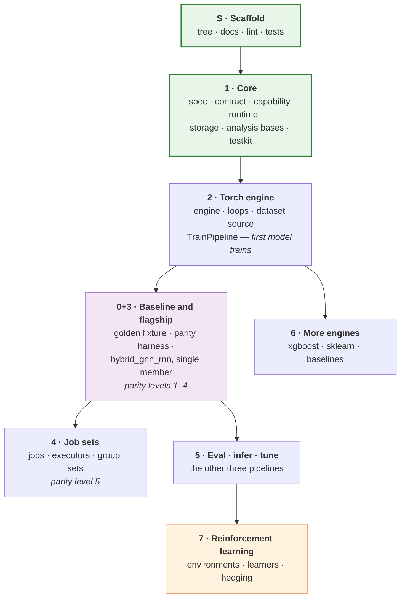

# rade_qnet — Implementation Plan

How `rade_qnet` gets built: in what order, why that order, and how each phase
proves it is finished.

> **Read [`ARCHITECTURE.md`](ARCHITECTURE.md) first.** This document assumes
> the vocabulary defined there — specs, contracts, capabilities, engines,
> sources, bundles, jobs.

---

## Contents

1. [How to use this document](#1-how-to-use-this-document)
2. [Current state](#2-current-state)
3. [Build order, and why](#3-build-order-and-why)
4. [Phase map](#4-phase-map)
5. [Definition of done — every phase](#5-definition-of-done--every-phase)
6. [The phases](#6-the-phases)
7. [Open items needing a decision](#7-open-items-needing-a-decision)
8. [Tracking progress](#8-tracking-progress)

---

## 1. How to use this document

**If you are picking up the build** — human or agent — start here:

1. Read [`ARCHITECTURE.md`](ARCHITECTURE.md) for the design.
2. Read [`CODING_STANDARDS.md`](CODING_STANDARDS.md) for the standard.
3. Find the lowest phase in [§4](#4-phase-map) not marked complete.
4. Open that phase's document in [`phases/`](phases/). It is the detailed
   specification: module by module, decision by decision, test by test.
5. Build it. Satisfy the phase's definition of done *and*
   [§5](#5-definition-of-done--every-phase).
6. Update the status in [§4](#4-phase-map).

Do not start a phase whose dependencies are incomplete. The ordering is not
bureaucratic — each phase is verified against components already proven in the
phase before it, which is what keeps a failure attributable.

**If you are looking for one specific thing:** the `__init__.py` charter of any
package lists its modules and the phase that delivers each. That is the fastest
route from "where does X live?" to the right document.

---

## 2. Current state

**Phase S (scaffold) — complete.**

| Delivered | Where |
| --- | --- |
| Package tree, 9 top-level packages, every directory a documented package | `src/rade_qnet/` |
| Charter docstring in all 33 `__init__.py` files, naming modules and phases | `src/rade_qnet/**/__init__.py` |
| Architecture, coding standard, this plan, 8 phase documents | `src/rade_qnet/docs/` |
| Lint and format configuration, scoped to the package | `src/rade_qnet/ruff.toml` |
| Test tree mirroring the source tree, with planned modules listed | `tests/rade_qnet/` |
| Structural test suite: layering, mirroring, documentation, charters | `tests/rade_qnet/test_scaffold.py` |

```bash
.venv/bin/python -m ruff check src/rade_qnet tests/rade_qnet     # zero findings
.venv/bin/python -m ruff format --check src/rade_qnet tests/rade_qnet
.venv/bin/python -m pytest tests/rade_qnet -q                  # all pass
```

No framework logic exists yet. `test_scaffold.py` is already load-bearing: its
layering test walks the abstract syntax tree of every module and fails any
import that crosses a dependency boundary, so the architecture is enforced from
the first line of Phase 1 rather than audited after the fact.

---

## 3. Build order, and why

Three principles determine the order, and they occasionally override the
instinct to build the exciting part first.

**Capture the baseline before changing the thing it describes.** A golden
fixture is taken from the existing `rade_ml_pt` implementation, and it must be
captured before that implementation is touched: once a refactor is underway,
the temptation to "fix" the old code while capturing it is irresistible, and a
baseline that has been improved is not a baseline.

What this constrains is ordering against `rade_ml_pt`, not ordering against
`rade_qnet` — which is why the capture now sits inside Phase 3 rather than ahead
of Phase 1 (see the note under §4). Nothing in Phases 1 or 2 modifies
`rade_ml_pt`, so nothing in them can spoil the capture.

**Build the contract before the thing it constrains.** `core` precedes every
consumer, because a contract retrofitted to code that already works is a
description of that code rather than a constraint on it.

**Prove the hardest model early, but on narrow foundations.** The flagship
lands in Phase 3 — as a *single member*, against the plain training pipeline,
with no fan-out and no parallelism. Phase 4 then adds fan-out to an already-
verified model. Doing it the other way round means debugging a new model and a
new execution layer simultaneously, with no way to tell which is at fault.

A fourth consideration shapes where the finish line sits: **the framework has
to earn its keep before the RL work starts.** Phases 1–6 deliver a complete,
production-usable supervised framework with three engines. Phase 7 extends it
to interactive learning. If Phase 7 were earlier, the abstractions would be
designed around a use case nobody was yet running.

---

## 4. Phase map

| Phase | Name | Delivers | Depends on | Status |
| :---: | --- | --- | :---: | :---: |
| **S** | Scaffold | Tree, docs, lint, test skeleton | — | ✅ |
| **1** | [Core](phases/PHASE_1_CORE.md) | `core`, `storage`, `analysis` bases, `testkit` | S | ✅ |
| **2** | [Torch engine](phases/PHASE_2_TORCH_ENGINE.md) | `engines.torch`, `sources.dataset`, `TrainPipeline`; first model trains | 1 | ✅ |
| **0+3** | [Baseline](phases/PHASE_0_BASELINE.md) + [Flagship](phases/PHASE_3_HYBRID_GNN_RNN.md) | Golden fixture, `testkit.parity`, `hybrid_gnn_rnn` single member, parity levels 1–4 | 2 | ✅ |
| **4** | [Job sets](phases/PHASE_4_JOB_SETS.md) | `jobs` (incl. group sets), `compute`, `api`; parity level 5 | 3 | ✅ |
| **5** | [Evaluate · infer · tune](phases/PHASE_5_EVALUATE_INFER_TUNE.md) | The other three pipelines, plus flagship overrides | 3 | ✅ |
| **6** | [More engines](phases/PHASE_6_ADDITIONAL_ENGINES.md) | `engines.xgboost`, `engines.sklearn`, `baselines` | 2 | ✅ |
| **7** | [Reinforcement learning](phases/PHASE_7_REINFORCEMENT_LEARNING.md) | `environment`, rollout/replay/offline/simulation, learners, `domains.hedging` | 5 | ⬜ |



Phases 5 and 6 are independent once 0+3 lands. The critical path is
**S → 1 → 2 → 0+3 → 4**.

> **Phase 0 merged into Phase 3.** Originally a standalone phase, the baseline
> capture now runs at the start of the flagship refactor. The documents stay
> separate because [`PHASE_0_BASELINE.md`](phases/PHASE_0_BASELINE.md) is the
> specification for the fixture and the parity harness, and
> [`PHASE_3_HYBRID_GNN_RNN.md`](phases/PHASE_3_HYBRID_GNN_RNN.md) is the
> specification for the model.
>
> **The one discipline the merge must not lose:** capture the fixture *first*,
> against **unmodified** `rade_ml_pt`, before writing any `rade_qnet` model code.
> The reason Phase 0 came first was never sequencing — it was that reading the
> old implementation closely enough to capture it means noticing its defects,
> and once new code exists to compare against, "fix it while capturing it"
> becomes irresistible. At that point the baseline records intended behaviour
> rather than actual behaviour, and the parity claim is worthless. The Phase 0
> definition-of-done item "`rade_ml_pt` has **no** modifications in this
> phase's diff" is now the gate between the two halves of the merged phase.

### What becomes usable, and when

| After | A user can |
| --- | --- |
| 2 | Train a simple supervised model end to end, with bundles, metrics and reports |
| 3 | Train the flagship as a single member, verified identical to the old implementation |
| 4 | Run the flagship across a whole portfolio, in parallel, on GPUs |
| 5 | Evaluate a saved bundle, tune hyper-parameters, serve inference |
| 6 | Plug in tree and linear models, and compare them against the flagship |
| 7 | Train policies and differentiable hedgers in the same framework |

---

## 5. Definition of done — every phase

These apply to **every** phase, in addition to the phase's own criteria. A
phase is not complete until all of them hold.

### Code

- [ ] `ruff check src/rade_qnet tests/rade_qnet` — zero findings.
- [ ] `ruff format --check src/rade_qnet tests/rade_qnet` — zero changes needed.
- [ ] Every new module has a docstring; every new package has a charter.
- [ ] Every signature fully annotated; no bare `Any`.
- [ ] [`CODING_STANDARDS.md`](CODING_STANDARDS.md) §10 checklist satisfied.

### Tests

- [ ] `pytest tests/rade_qnet` passes.
- [ ] Every new module has a corresponding test module.
- [ ] Failure paths tested, not only happy paths.
- [ ] Tests deterministic: fixed seeds, no clock, no network, no shared state.
- [ ] `test_scaffold.py` passes — layering and mirroring intact.

### Architecture

- [ ] No new dependency crosses a layer boundary. (Enforced by test; if you
      changed `ALLOWED_DEPENDENCIES`, that change is the subject of review, not
      a detail of it.)
- [ ] `core` still imports only stdlib, `pydantic` and `numpy`.
- [ ] New extension points are protocols, not base classes.
- [ ] New configuration is a spec with `extra="forbid"` and exact round-trip.

### Documentation

- [ ] Package charters updated: modules that landed no longer say "planned".
- [ ] [`ARCHITECTURE.md`](ARCHITECTURE.md) updated if any decision changed.
- [ ] Status in [§4](#4-phase-map) updated.
- [ ] Any deviation from the phase document recorded in that document, with
      reasoning. A phase document that no longer matches the code is worse
      than none.

### Demonstration

- [ ] An example script under `examples/rade_qnet/` runs end to end and shows
      what the phase made possible. A phase that cannot be demonstrated has
      not delivered anything a user can use.

---

## 6. The phases

Each summary below is an orientation, not a specification. The linked document
is the specification: module-by-module detail, the design decisions and their
reasoning, the component interactions, the tests to write, and the phase's own
definition of done.

### Phase 0 — [Baseline](phases/PHASE_0_BASELINE.md)

*Now the first half of the merged phase 0+3, run immediately before the model
refactor begins.*

Capture a golden fixture from `rade_ml_pt`: the built dataset, the fitted
state, a forward pass, a short training curve. Build `testkit.parity` to
compare a run against it at a chosen tolerance.

The refactor's correctness claim rests entirely on this fixture. The ten known
defects in `rade_ml_pt` are captured **as they are**, with compatibility flags
recorded, so parity is proven against real old behaviour and the fixes land
separately and visibly. See the merge note in [§4](#4-phase-map) for the
discipline this sequencing exists to protect.

### Phase 1 — [Core](phases/PHASE_1_CORE.md)

The framework's vocabulary and its supporting infrastructure: `core.spec`,
`core.contract`, `core.authoring`, `core.lifecycle`, plus `storage`, the
`analysis` bases and `testkit`.

*The largest phase, and the one most worth getting right.* Nothing trains yet.
What exists is a run context, an instrumented step runner, a component
registry, an atomic bundle writer, a single-writer catalog, pure metrics, the
visual style and the conformance suite. Every later phase is a consumer of
this one, so a contract compromised here is a compromise everywhere.

### Phase 2 — [Torch engine](phases/PHASE_2_TORCH_ENGINE.md)

The PyTorch engine, the dataset source and transforms, `DatasetSource`, and
`TrainPipeline`. **At the end of this phase a model trains end to end** and
produces a bundle, metrics and reports.

Includes the lazy-parameter materialisation stage, the static-input path that
keeps constant tensors out of per-sample collation, and leakage-aware splits
with the scenario split decoupled from batch shuffling.

### Phase 3 — [Flagship](phases/PHASE_3_HYBRID_GNN_RNN.md)

Refactor the hybrid graph-temporal network into the framework as a single
member: `model.py`, `layers/`, `register.py`, `spec.py`, `state.py`, `data.py`,
`features/`, and the train-pipeline override that adds graph and attention
reports.

*The phase that validates the architecture.* Parity levels 1–4 must go green
against the Phase 0 fixture. The twenty-odd sidecar artifacts of the old
implementation collapse into one `FittedState`. No fan-out, no parallelism —
one model, proven identical.

**Delivered.** All four levels are green, with level 3 holding at `torch.equal`
rather than the planned `atol=1e-6`. Hosting the model required four framework
changes, which is this phase working as intended rather than against it: a
`report_names()` hook so a model can add a report without owning the `report`
stage, eager report registration, a route for static inputs from the data
module to the engine, and a `confine_to_split` windowing flag. Each is general
and separately tested. Three baseline features were deliberately not ported and
one further defect was found. All of it is recorded in
[`PHASE_3_HYBRID_GNN_RNN.md` §8](phases/PHASE_3_HYBRID_GNN_RNN.md#8-deviations).

### Phase 4 — [Job sets](phases/PHASE_4_JOB_SETS.md)

Fan-out: `orchestration.jobs`, `orchestration.compute` (local, processes,
GPUs), the override merge, the job-set manifest, and the readers that supply
each job's data slice (delivered as `domains.pnl`, since moved to
`orchestration.jobs.groups` and `.fanout` — see
[`PHASE_4_JOB_SETS.md` §8.9](phases/PHASE_4_JOB_SETS.md#89-the-domains-layer-is-removed)).

Parity level 5 — sequential and parallel runs producing identical artifacts —
is the gate. Partial failure is a feature: one unusable cluster must not
discard thirty-nine good models.

**Delivered.** Also `rade_qnet.api` (`train`, `train_jobs`, and what is now
`train_groups`), `core.spec.merge`, `core.spec.jobs` and
`analysis.visuals.jobset`. `Universe` was moved out of the flagship and later
moved back, once the `domains` layer was removed: its vocabulary is the
flagship's own.

Two defects surfaced, both only visible once a job crossed a process
boundary, and both found by the parity comparison failing rather than by
review:

- **Defect 12.** Components register as an import side effect, with nothing
  recording which import. A spawned worker resolved the flagship only
  because spawn re-imports `__main__` and the example script happened to
  import it; the same job set launched from a CLI would have failed with
  "no model named ...". The registry now records each component's defining
  module and the job payload carries it.
- **Defect 13.** The thread budget was set by environment variable, which a
  fresh worker reads and an already-running parent cannot. The two paths ran
  at different thread counts, and because the thread count fixes the order a
  reduction accumulates in, they scored differently in the seventh
  significant figure. `hardware.threads_per_worker` is now applied
  in-process, so the budget travels in the specification.

Parity level 5 is green with the budget and the device pinned, including
byte-identical weights. Under `device: auto` on Apple silicon the flagship is
not reproducible against itself at any determinism level, which is an MPS
property rather than a framework one and is stated in
`phases/PHASE_4_JOB_SETS.md` §8.1 rather than worked around.

### Phase 5 — [Evaluate, infer, tune](phases/PHASE_5_EVALUATE_INFER_TUNE.md)

The remaining three pipelines, plus the flagship's overrides. Bundle loading,
source reconstruction from saved lineage, target inversion before metrics, and
a tuning loop that builds the data once and reuses it across trials.

Also `analysis.metrics.drift`, the evaluation and tuning visuals, and
`orchestration.stages.resolve` — which reads a model's pipeline override
declaration, a thing nothing had done since the declaration was introduced in
Phase 3. See the phase charter's §8.6; every override was reachable only by
constructing it by hand, so the examples worked and `api` silently did not.

Unseen-entity inference is deliberately *not* delivered. `Inductive` remains a
declaration the inference pipeline uses to refuse a transductive model, which
is the half that matters; the mechanism needs a universe that can supply the
missing entity's attributes and is deferred rather than faked. See §8.3.

### Phase 6 — [More engines](phases/PHASE_6_ADDITIONAL_ENGINES.md)

`engines.xgboost`, `engines.sklearn`, and three baseline models.

*A test of the abstractions as much as a feature.* A one-shot tree fit must
satisfy the same engine contract as a multi-epoch gradient loop, and a ridge
regression must cost one short file. If either is awkward, the interface needs
fixing before more weight is put on it.

**Delivered, and the abstractions held.** Both engines pass the conformance
suite unmodified, no pipeline branches on an engine name, and the three
baselines came in at 25, 25 and 48 statements against a budget of 50. The
awkwardness that did surface was elsewhere and is recorded in
[§8](phases/PHASE_6_ADDITIONAL_ENGINES.md#8-deviations-and-findings) — most
importantly §8.6, that the Phase 0 golden fixture is linear enough for a
ridge regression to beat the flagship on it, which makes it unusable for
justifying complexity even though it remains sound for pinning determinism.

### Phase 7 — [Reinforcement learning](phases/PHASE_7_REINFORCEMENT_LEARNING.md)

`sources.environment`, the interactive `BatchSource` adapters, the DQN, PPO,
SAC and pathwise learners, `fit_steps`, and differentiable risk measures.
Environments belong to the model packages that train in them, for the reason
the `domains` layer was removed: an environment's reward *is* the business
problem.

**Scaffold delivered.** The whole interactive path runs end to end —
`Environment`, `RolloutSource`, `PolicyModel`, `fit_steps`, `PolicyLearner`,
`InteractiveEngine`, `ReinforcePipeline` — driven by a `random` learner that
samples from the untrained policy and updates nothing. That learner is the
control a real algorithm is measured against, and it is what gives every new
contract a reader from the day it is declared. Three deviations from the
phase's own decisions are recorded in its §8; the load-bearing one is that a
policy has no target, so interactive learners implement a second protocol
rather than `Learner`.

A clean redesign, not a port of `q_learning`. `DifferentiableEnvironment` is
first-class by design, because hedging and replication problems have
differentiable dynamics and forcing them through a transition interface throws
away the exact gradients that make them tractable — but it is declared with
the pathwise learner rather than ahead of it, since a runtime-checkable
protocol with no distinguishing member is satisfied by every environment.

---

## 7. Open items needing a decision

These affect the build and are flagged rather than decided unilaterally.

### 7.1 Dependencies not declared — resolved

Declared in `pyproject.toml`, split the same way the
`requirements_rade_qnet*.txt` files split them: a small base set, and one
optional extra per engine (`torch`, `xgboost`, `sklearn`), plus `hybrid`,
`parquet`, `all` and `dev`.

### 7.2 Import prefix and packaging — resolved

`pyproject.toml` now packages `rade_qnet` -- and only `rade_qnet`, discovered by
pattern so the sibling packages under `src/` are not swept in -- so it installs
with `pip install -e .` and imports as `rade_qnet`. `rade_qnet` uses relative
imports internally, so it behaves identically under either path; the test
suite keeps importing `src.rade_qnet` to match the rest of the repository.

### 7.3 No continuous integration

Nothing currently runs the lint and test commands automatically. The definition
of done is therefore enforced by discipline. A minimal workflow running the
three commands in [§2](#2-current-state) against `src/rade_qnet` and
`tests/rade_qnet` would make it enforced by machine. Recommended before Phase 2,
when the code starts to matter.

### 7.4 Comment density

[`CODING_STANDARDS.md` §3](CODING_STANDARDS.md#3-comments) deliberately departs
from a literal "comment every line" reading of the requirement, and explains
why. Flagged here because it is a standing decision affecting every file. If
literal per-line commenting is wanted, say so and the standard changes.

---

## 8. Tracking progress

Status lives in the [phase map](#4-phase-map) — one row per phase, updated when
it completes. Deviations are recorded in the phase document itself, next to the
decision they changed, because that is where the next reader will look.

Legend: ⬜ not started · 🟡 in progress · ✅ complete

| Document | Purpose |
| --- | --- |
| [`ARCHITECTURE.md`](ARCHITECTURE.md) | What the framework is and how it works |
| [`CODING_STANDARDS.md`](CODING_STANDARDS.md) | The standard code is held to |
| `IMPLEMENTATION.md` | This plan |
| [`phases/`](phases/) | Per-phase specifications |
| Package `__init__.py` | What belongs in a package, and which phase delivers it |
