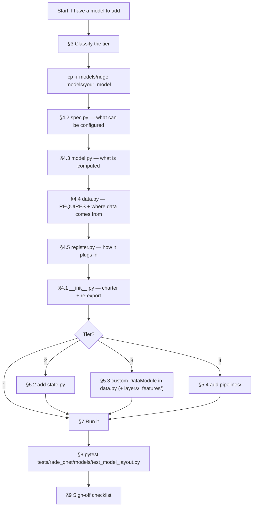
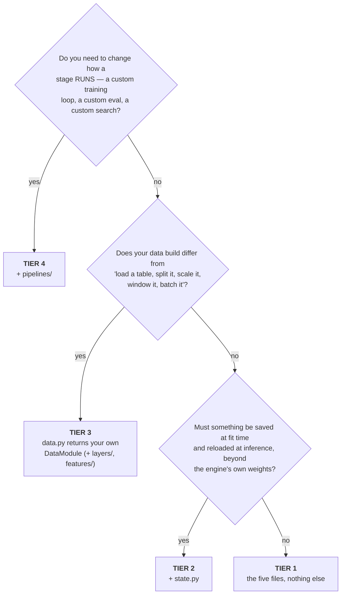
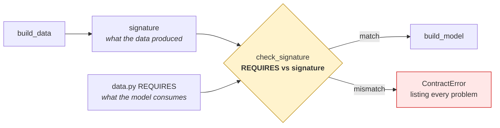
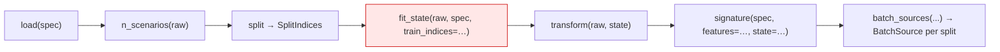
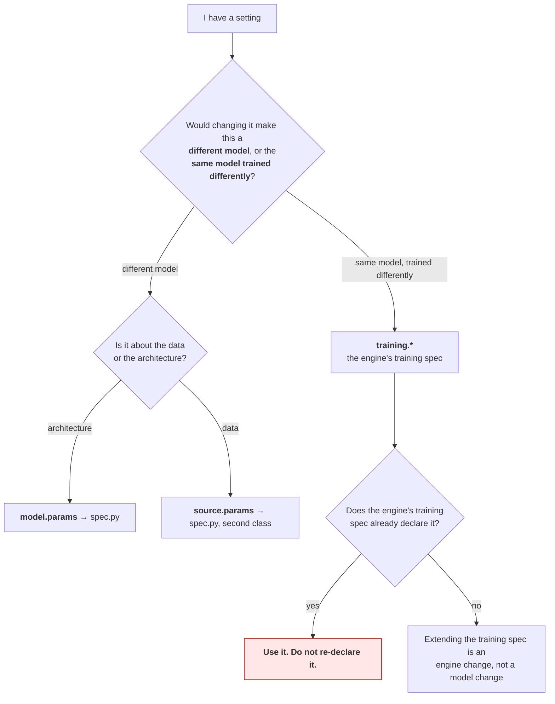
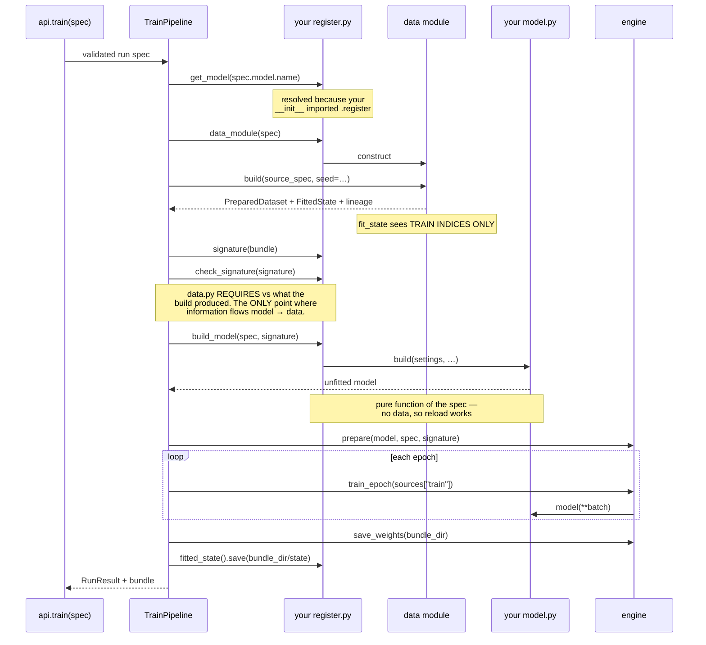

# Implementing a Model in `rade_qnet`

**Document type** Procedure · **Audience** Anyone adding a model · **Status** Normative
**Enforced by** `tests/rade_qnet/models/test_model_layout.py` · **Companion** [`GUIDE.md`](GUIDE.md) (concepts), [`ARCHITECTURE.md`](ARCHITECTURE.md) (design rationale)

---

## 0. How to read this document

| If you are… | Read |
|---|---|
| Adding a model and want the shortest correct path | §1 (one page), then the one tier walkthrough in §5 that matches |
| Reviewing someone else's model | §9 sign-off checklist |
| Deciding where a setting belongs | §6 |
| Debugging "it doesn't run" | §10 failure modes |
| Trying to understand *why* the layout is like this | §2.3, and `rade_qnet/models/__init__.py` |

This document is **normative**: where it states a rule, a test enforces it.
A rule here that no test enforces is a defect in this document, and §8
lists exactly which checks exist so you can tell the difference.

---

## 1. The one-page summary

Every model is a package under `rade_qnet/models/`. It always contains the
same five files. Capability is added by **adding files**, never by moving
or renaming them.

```
rade_qnet/models/<your_model>/
│
├── __init__.py    ← ALWAYS   the charter: what this is, its tier, and `from .register import …`
├── spec.py        ← ALWAYS   what can be configured
├── model.py       ← ALWAYS   what is computed            (imports no framework wiring)
├── data.py        ← ALWAYS   what data is REQUIRED, and where it comes from
├── register.py    ← ALWAYS   how it plugs in             (contains no mathematics)
│
├── state.py       ← TIER 2+  a fitted artefact beyond the engine's weights
├── layers/        ← TIER 3+  when model.py outgrows one file
├── features/      ← TIER 3+  model-specific feature construction
├── pipelines/     ← TIER 4   train.py · eval.py · tune.py stage overrides
│
├── reports.py     ← optional, any tier
└── visuals.py     ← optional, any tier
```

**There is no other legal file name.** A `utils.py` or a `helpers.py` is a
failing test, not a style disagreement — see §2.3 for why that strictness
is deliberate.

### The whole procedure



---

## 2. The convention, and why it is this strict

### 2.1 One shape, four tiers

`rade_qnet.models.<name>` is a model. Always. There are no loose modules in
the library and no category sub-folders, so the addressing rule is one
sentence long and a model never moves as it grows.

### 2.2 Why `model.py` and `register.py` are separate files

This is the load-bearing split, and the reason for it is a question of
*who reads what*:

| Reader | Question | Opens | Must not have to read |
|---|---|---|---|
| Quant / model validator | "What does this compute? Is the mathematics right?" | `model.py` | registry, specs, engines |
| Platform engineer | "How does this plug in? Which engine? What's tunable?" | `register.py` | the mathematics |
| Someone configuring a run | "What can I set?" | `spec.py` | either of the above |
| Someone wiring up a source | "What data does this need?" | `data.py` | all of the above |

The split is **enforced**: `test_model_py_does_not_import_the_frameworks_wiring`
fails if `model.py` imports the registry, the run spec or the training spec.
That one check is what keeps the three columns above true over time.

The practical payoff is in the test suite. Compare:

```python
# tests/rade_qnet/models/ridge/test_model.py — no framework at all
estimator = build(RidgeSpec(alpha=0.25, fit_intercept=False))
assert estimator.alpha == 0.25
```

against what the same assertion costs if the spec, the mathematics and the
registration live in one file: a run specification, a registry in a known
state, and an engine. Milliseconds become seconds, and a failure stops
telling you which half is broken.

### 2.3 Why the smallest model pays the ceremony too

`ridge` is about thirty statements. It could be one file. Making it three
costs a reader perhaps a minute and buys four things:

| Property | What it means in practice |
|---|---|
| **One procedure** | No "is this simple enough for one file?" judgement call. No boundary to argue about, no review where the answer differs from last time. |
| **No migration** | A model that grows a fitted state *adds* `state.py`. It does not get taken apart first. The commit that adds capability contains only the capability. |
| **Framework-free mathematics** | `model.py` can be read, reviewed and unit-tested with no registry, no run spec and no engine. |
| **Real unit tests** | `build(settings)` is callable directly. |

> **This reverses an earlier decision.** `ARCHITECTURE.md` previously said
> *"a simple model is one file… splitting fifty lines across four files
> helps nobody."* That text was also self-contradictory — it claimed
> registration lived in `model.py` while the file on disk was `ridge.py` —
> and the library had genuinely drifted into two incompatible shapes. See
> §11 for the full reversal record.

### 2.4 Why the file vocabulary is closed

Requiring five files is a *floor*. Without also forbidding everything
else, the layout drifts anyway — one `utils.py` at a time — and the
convention stops being something a reader can rely on. The closed
vocabulary is what turns "these five files exist" into "these are the only
files", which is the difference between a guideline and a guarantee.

If a model genuinely needs a concept the vocabulary lacks, add it to
`OPTIONAL_FILES` in the layout test *and* to `rade_qnet/models/__init__.py`
in the same commit. The decision is then made once for the library, in
review, rather than privately inside one model.

---

## 3. Tier classification

### 3.1 The decision tree

Answer in order. The **first** "yes" sets your tier.



### 3.2 What each tier costs

| Tier | Files | Base class | `data.py` holds | Example | Budget enforced? |
|---|---|---|---|---|---|
| **1** | 5 | `SupervisedModel` | `REQUIRES` + one-line `data_module` | `ridge`, `xgb_tabular`, `lstm_tabular` | Yes — ≤ 55 statements of ceremony |
| **2** | 6 | `SupervisedModel` | same | *(none yet)* | No |
| **3** | 6+ | `PredictorDefinition` | `REQUIRES` + your `DataModule` subclass | *(none yet)* | No |
| **4** | 9+ | `PredictorDefinition` | same | `hybrid_gnn_rnn` | No |

The tier is **not** "do you have a `data.py`" — everyone does. It is "is
the data module in it yours?" The budget excludes `model.py`, because the
mathematics is not the framework's tax to charge.

### 3.3 Three traps in classification

| Trap | Reality |
|---|---|
| "My model is a custom `nn.Module`, so it's tier 3." | **No.** `lstm_tabular` is a custom network and is tier 1. A custom *architecture* does not raise the tier; needing your own *data build* does. |
| "My model has lots of hyper-parameters, so it's tier 2." | **No.** Hyper-parameters go in `spec.py` at every tier. Tier 2 is about a fitted artefact — a scaler, an encoder, a graph — that must survive to inference. |
| "I'll start at tier 1 and refactor later." | **Correct, and there is no refactor.** Moving up a tier means adding a file, or changing what `data.py` returns. No file is ever renamed or moved. |
| "My data comes from a CSV in the tutorial, so I'm tier 1 forever." | **Almost certainly not.** `TabularDataModule` reads a CSV. The moment your data lives in a store, a warehouse or an internal API, `load()` is yours and you are tier 3. That is the normal destination, not an advanced case. |

### 3.4 Tier 1 vs Tier 2, concretely

The tier 2 question is: *at inference time, with only the saved bundle, can
you reproduce what the model expects?*

| Situation | Tier |
|---|---|
| Framework's standardiser scales your features | **1** — the framework saves its own `DatasetState` |
| You fit a target-specific transform the framework doesn't know about | **2** |
| You learn an entity→index mapping the model's embedding depends on | **2** |
| You compute a correlation graph from the training split | **2** |

The test: if `inverse_transform_targets` or the forward pass needs
something that was learned from the training data and is not in the
engine's weights, it needs a `state.py`.

---

## 4. The five required files

### 4.1 `__init__.py` — the charter

| Must | Why |
|---|---|
| Open with a docstring naming the model, its **tier**, and why it exists | It is the first thing anyone opening the package reads |
| `from .register import <YourModel>` | **This is the registration mechanism.** There is no plugin scan. |
| Re-export the spec and any public architecture class | So users import from the package, not its internals |

```python
"""
Ridge regression: the cheapest thing that can be called a model.

Tier
----
1 -- a library estimator, the framework's own data module, no custom state.

Importing this package registers the model under ``"ridge"``.
"""

from .register import RidgeModel
from .spec import RidgeSpec

__all__ = ["RidgeModel", "RidgeSpec"]
```

> **The single most common mistake** is an `__init__.py` that imports only
> `spec`. The package looks complete, passes every other check, and is
> invisible to a specification that names it.
> `test_importing_the_package_registers_the_model` exists for exactly this.

### 4.2 `spec.py` — what can be configured

| Must | Must not |
|---|---|
| Subclass `rade_qnet.core.spec.base.Spec` | Contain any logic beyond validation |
| Constrain every field (`gt`, `ge`, `Literal`) | Re-declare a setting the **engine's training spec** already owns (§6) |
| Document each field in the class docstring | Import anything from `model.py` |

`Spec` forbids extra keys, so a misspelled or misplaced setting is a
validation error naming the field — not a silently ignored one.

**An empty spec is a legitimate answer.** `XgbTabularSpec` has no fields,
because `XGBoostTrainingSpec` describes the booster completely. The file
still exists, because the layout is the same at every tier and "this model
has no settings" is worth saying explicitly.

A model with its own data build declares a **second** class here, validating
`source.params`:

```python
class HybridModelSpec(Spec):   # validates  model.params
    ...
class HybridDataSpec(Spec):    # validates source.params
    ...
```

### 4.3 `model.py` — what is computed

| Must | Must not |
|---|---|
| Export a class (an `nn.Module`) **or** a `build(...)` factory | Import `core.lifecycle.components` |
| Be readable as mathematics | Import `core.spec.run` or `core.spec.training` |
| Take plain arguments: settings, widths, a signature | Touch the registry or any engine |

Importing *contracts* — `InputSignature`, `ContractError` — is fine. The
line is at things that only exist because the model is being run by this
framework.

Two shapes, both correct:

```python
# Library estimator: a factory, because there is no state to hold.
def build(settings: RidgeSpec) -> Ridge:
    return Ridge(alpha=settings.alpha, fit_intercept=settings.fit_intercept)
```

```python
# Custom architecture: a class, plus a factory that applies the sizing rule.
class LstmTabular(nn.Module):
    def __init__(self, settings: LstmTabularSpec, *, n_features: int) -> None:
        ...
    def forward(self, **inputs: Tensor) -> Tensor:
        ...

def build(settings: LstmTabularSpec, signature: InputSignature) -> LstmTabular:
    return LstmTabular(settings, n_features=_feature_width(signature))
```

Put the sizing rule in `build`, not in `register.py`. Anything that could
be called a modelling decision belongs on this side of the line.

#### The `forward` contract (Torch engine)

The engine calls `model(**batch)` with the target already removed.

| Rule | Consequence of breaking it |
|---|---|
| Accept `**inputs`, not positional arguments | `TypeError: forward() got an unexpected keyword argument 'features'` |
| Do not hard-code the input's key name | Works on your fixture, fails on the first user whose column block is named differently |
| Return shape `(samples, n_targets)` | Silent broadcasting against the target |

### 4.4 `data.py` — what data is required, and where it comes from

Two exports, always:

| Export | Answers | Checked? |
|---|---|---|
| `REQUIRES` | What the model consumes: names, ranks, optionally dtype and shape | **Yes** — against the data build, before the model is built |
| `data_module(spec)` | Where the data comes from and how it is prepared | Indirectly, by running |

#### Why `REQUIRES` exists

`InputSignature` says what the data build **produced**. Until this existed
there was nothing saying what a model **requires**, so information only
ever flowed data → model and the model had to cope at runtime. Coping
looks reasonable and fails quietly. The recurrent baseline used to read
its window like this:

```python
for value in inputs.values():
    if isinstance(value, Tensor):
        return value
```

Handed two feature blocks, it trained on whichever one the dictionary
yielded first. Reordering the data build changed the model — no
exception, no warning, a plausible loss curve, a different model.

`REQUIRES` is the fix, and it is enforced at `declare_signature`:



This is the **only** point in a run where information flows model → data.

#### Writing a `REQUIRES`

| Your model… | Declare |
|---|---|
| flattens everything it is handed (`ridge`, `xgb_tabular`) | `InputRequirement.unconstrained()` |
| reads one input, name irrelevant (`lstm_tabular`) | one unnamed `RequiredInput(rank=…)` |
| has inputs that are not interchangeable (`hybrid_gnn_rnn`) | one named `RequiredInput` each |

```python
# Accepts anything — the honest answer for a model that flattens.
REQUIRES = InputRequirement.unconstrained()
```

```python
# Exactly one dynamic input, rank 3 or 2, under any name.
REQUIRES = InputRequirement(
    dynamic=(RequiredInput(rank=(3, 2), description="the feature window"),),
)
```

```python
# Named, because these are not interchangeable.
REQUIRES = InputRequirement(
    dynamic=(RequiredInput(name="pnl_history", rank=3, dtype="float32"),),
    static=(
        RequiredInput(name="adjacency_indices", rank=2, dtype="int64",
                      shape=(None, 2)),   # endpoints come in pairs
        ...
    ),
)
```

| Rule | Why |
|---|---|
| `rank` is required | It is the property a build can get wrong while still producing something that runs |
| `dtype`, `shape` are optional | Most models don't care; **don't pin a feature width** — the signature already carries it, and two copies of a number can disagree |
| At most one unnamed entry per group | Two would be indistinguishable, so matching would depend on ordering — the exact defect this removes |
| `exact=True` by default | An input the model never reads is either wasted work or, worse, a user believing the model sees data it cannot |
| `unconstrained()` is a real answer | But write it. "No constraints" and "not thought about" look identical otherwise. |

#### Why `data_module` lives here too

For `ridge` it is one line returning `TabularDataModule()`. That is
deliberate: the question "where does this model's data come from?" has the
same answer location at every tier, so you never have to know what shape a
model is before you know where to look.

> **This will not stay one line.** `TabularDataModule` reads a CSV. A desk
> reads parquet, a warehouse, or an internal service — so `load()` becomes
> yours, and this function returns your `DataModule` subclass instead.
> **Nothing else in the package moves.** That is the whole reason the file
> is mandatory from the start rather than appearing at tier 3.

See §5.3 for the `DataModule` contract.

### 4.5 `register.py` — how it plugs in

| Must | Must not |
|---|---|
| Hold **exactly one** `@model(name, engine=…)` class | Contain mathematics |
| Bind `requires = REQUIRES` and `spec` | Re-declare anything `data.py` owns |
| At tier 3+ also set `data_spec`, `state_cls`, `pipelines` | Register anything else |
| Import its engine package for the registration side effect | — |
| Implement `data_module` and `build_model` | — |

```python
from ...engines import sklearn as _engine  # noqa: F401   ← see the warning below
from .data import REQUIRES, data_module

@model("ridge", engine="sklearn")
class RidgeModel(SupervisedModel):
    requires = REQUIRES
    spec = RidgeSpec

    def data_module(self, spec: SupervisedRunSpec) -> TabularDataModule:
        return data_module(spec)

    def build_model(self, spec, signature) -> Ridge:
        del signature
        return build(RidgeSpec.model_validate(dict(spec.model.params)))
```

> **Always import your engine package here.** `engine="sklearn"` is a
> *declaration*; importing `rade_qnet.engines.sklearn` is what makes the name
> resolvable. Without it the model works whenever something else in the
> process happened to import the engine, and fails with
> `no engine named 'sklearn'` the first time it is run on its own. This is
> a declaration with no reader — the most common defect class in this
> codebase.
>
> Import the **package**, not the module. For XGBoost on macOS the package
> `__init__` loads Torch first, and the reverse order deadlocks with no
> traceback at all. See `PHASE_6_ADDITIONAL_ENGINES.md` §8.2.

#### `build_model` must be a pure function of the spec

No data. A bundle reloaded six months later rebuilds the model from the
saved spec and signature alone — if `build_model` reads the dataset, that
reload path cannot work.

---

## 5. Tier-by-tier procedure

### 5.1 Tier 1 — walkthrough

```bash
cp -r src/rade_qnet/models/ridge src/rade_qnet/models/your_model
mkdir -p tests/rade_qnet/models/your_model
```

| # | Step | File |
|---|---|---|
| 1 | Rename the spec class; declare and constrain your fields | `spec.py` |
| 2 | Write the architecture or the factory | `model.py` |
| 3 | Write `REQUIRES`; leave `data_module` returning `TabularDataModule()` | `data.py` |
| 4 | Rename the class, bind `requires`/`spec`, set `@model("your_model", engine=…)`, import the engine | `register.py` |
| 5 | Rewrite the charter; fix the re-exports | `__init__.py` |
| 6 | Add `"models/your_model"` to `DELIVERED_TEST_SUBTREES` | `tests/rade_qnet/test_scaffold.py` |
| 7 | Add `test_model.py` (no framework) and `test_register.py` (wiring only) | `tests/…/your_model/` |

Then §7 and §8.

### 5.2 Tier 2 — add `state.py`

`FittedState` has three abstract members:

| Member | Signature | Purpose |
|---|---|---|
| `save` | `(self, directory: Path) -> None` | Write everything needed to reconstruct |
| `load` | *classmethod* `(directory: Path) -> Self` | Read it back |
| `inverse_transform_targets` | `(self, predictions: NDArray) -> NDArray` | Put predictions back in the target's units |

Then declare it: `state_cls = YourState` on the class in `register.py`.

> **The trap:** `save`/`load` must round-trip *exactly*. A state that
> loses a float in serialisation produces a bundle that re-scores
> differently from the run that created it, and every comparison made from
> that run's report is then about a model that was never saved. Assert
> equality, not closeness.

### 5.3 Tier 3 — your own data build

No new file: `data.py` already exists. What changes is what `data_module`
returns — your `DataModule` subclass instead of the framework's. Move the
definition from `SupervisedModel` to `PredictorDefinition`.

This is where most real models end up. `TabularDataModule` reads a CSV;
anything behind a store, a warehouse or a service needs its own `load()`.

The five abstract methods:

| Method | Returns | Called |
|---|---|---|
| `load(spec)` | your raw type | once, first |
| `n_scenarios(raw)` | `int` | before splitting |
| `fit_state(raw, spec, *, train_indices)` | `FittedState` | **train split only** |
| `transform(raw, state)` | `(features, targets)` | per split |
| `signature(spec, *, features, state)` | `InputSignature` | after transform |



> **`fit_state` receives `train_indices` for a reason.** It is the single
> leakage boundary in the framework. Fitting a scaler on all the data and
> then splitting is the most common way to produce a model that is
> excellent in backtest and worthless live — and the signature is shaped so
> that doing it requires ignoring an argument you were handed.

Add `data_spec = YourDataSpec` to `register.py` to validate `source.params`.

And **revisit `REQUIRES`**. A custom build is exactly the situation the
contract exists for: the framework's own `DatasetSource` already refuses a
multi-block signature, so a user on `TabularDataModule` is protected
without any contract at all. Once the build is yours, that guard is gone
and `REQUIRES` is what remains.

Optional at this tier: `layers/` when `model.py` outgrows one file, and
`features/` for model-specific feature construction.

#### `BatchSource` — the two things people get wrong

| Member | Kind | Note |
|---|---|---|
| `signature` · `static` · `steps_per_epoch` · `n_samples` | **properties** | not methods |
| `batches()` | **method** | returns a fresh iterator |

A source must be **re-iterable**. Returning a generator that is exhausted
after one pass produces a run where epoch 1 trains and epochs 2…N see
nothing, while the loss curve still looks plausible.

### 5.4 Tier 4 — add `pipelines/`

Only `train.py`, `eval.py`, `tune.py`. **There is no `infer.py`:**
inference is "load the bundle and run the model forward", and a model that
needs to change that has changed what its bundle means — fix the bundle.

```python
pipelines: Mapping[str, type] = MappingProxyType(
    {
        "train": HybridTrainPipeline,
        "eval":  HybridEvalPipeline,
        "tune":  HybridTunePipeline,
    }
)
```

Subclass the base pipeline and override the narrowest hook that does the
job. Before you do, check this table:

| You want to… | Override a pipeline? |
|---|---|
| Change the loss | **No** — `training.loss` |
| Add a metric | **No** — a report |
| Change batching | **No** — `data.py` |
| Change the optimiser or schedule | **No** — the training spec |
| Evaluate per-target rather than pooled | **Yes** — `eval.py` |
| Train several heads in one loop | **Yes** — `train.py` |
| Prune a search on a model-specific signal | **Yes** — `tune.py` |

A pipeline override is the most expensive thing in this document: it opts
out of improvements to the base pipeline forever.

---

## 6. Which spec owns a setting?

Two schemas describe a run. Getting this wrong is silent.



| Setting | Belongs to | Why |
|---|---|---|
| `units`, `layers`, `dropout` | `model.params` | A different architecture |
| `window`, `horizon`, feature selection | `source.params` | A different dataset |
| `epochs`, `learning_rate`, `early_stopping` | `training.*` | Same model, trained differently |
| `max_depth`, `subsample`, `n_estimators` | `training.*` | `XGBoostTrainingSpec` already owns them |
| `device`, `threads_per_worker` | `hardware.*` | A property of the machine |

### 6.1 A worked example of getting this wrong

`XgbTabularSpec` originally re-declared `max_depth`, `min_child_weight`
and `reg_lambda`, with the same defaults as `XGBoostTrainingSpec`. The
engine merges them model-last:

```python
{**_booster_params(spec), **model.params}   # model wins
```

So a user who set `training.max_depth: 12` trained at depth **6** and was
told nothing. Both numbers were plausible, the run succeeded, and the only
symptom was a model slightly worse than it should have been.

The fix was to delete the duplication, leaving the spec empty. The lesson
is the general one: **a setting declared in two places has a winner, and it
is rarely the one the user typed.**

---

## 7. The lifecycle: where your files are called



| Stage | Your file | What it must guarantee |
|---|---|---|
| Resolve | `__init__.py` | importing the package registers the model |
| Validate | `spec.py` | a bad config fails here, not mid-run |
| Build data | `data.py` | nothing outside the train split touches `fit_state` |
| Check inputs | `data.py` `REQUIRES` | a mismatched model/source pairing fails before anything is built |
| Build model | `register.py` → `model.py` | pure function of the spec |
| Train | `model.py` | `forward(**inputs)` returns `(samples, n_targets)` |
| Persist | `state.py` *(T2+)* | exact round-trip |

---

## 8. Conformance: what is actually enforced

`tests/rade_qnet/models/test_model_layout.py` runs against **every** model
package automatically — adding a package adds the checks.

| Check | Fails when |
|---|---|
| `test_there_are_no_loose_modules_in_the_library` | A `.py` sits directly under `models/` |
| `test_the_five_required_files_are_present` | Any of the five is missing |
| `test_data_py_declares_an_input_contract` | `data.py` has no `REQUIRES`, or `register.py` doesn't bind it |
| `test_no_file_is_named_outside_the_vocabulary` | A `utils.py` appears |
| `test_no_directory_is_named_outside_the_vocabulary` | A directory other than `layers/`, `features/`, `pipelines/` |
| `test_pipeline_overrides_are_named_for_their_stage` | An `infer.py`, or anything not a stage name |
| `test_model_py_does_not_import_the_frameworks_wiring` | `model.py` imports the registry or a run/training spec |
| `test_registration_happens_in_register_py_and_nowhere_else` | Zero or two `@model` decorators, or one outside `register.py` |
| `test_importing_the_package_registers_the_model` | `__init__.py` does not reach `.register` |
| `test_a_tier_1_model_fits_in_the_budget` | A reference model exceeds 55 statements of ceremony (excluding `model.py`) |

The last one is a **measurement of the framework, not of the model**. If
it fails, something above the model now demands boilerplate. Raising the
budget to make it pass deletes the only signal that said so.

```bash
pytest tests/rade_qnet/models/test_model_layout.py -q
ruff check src/rade_qnet/models/your_model
```

---

## 9. Sign-off checklist

**Layout**
- [ ] `models/<name>/` with `__init__.py`, `spec.py`, `model.py`, `data.py`, `register.py`
- [ ] No file outside the vocabulary
- [ ] Tier declared in the `__init__.py` docstring

**Separation**
- [ ] `model.py` imports no registry, no run spec, no training spec
- [ ] `register.py` contains no mathematics
- [ ] Exactly one `@model(...)`, in `register.py`

**Wiring**
- [ ] `__init__.py` does `from .register import …`
- [ ] `register.py` imports its **engine package**
- [ ] `register.py` binds `requires = REQUIRES`
- [ ] `build_model` reads no data

**Input contract**
- [ ] `data.py` exports `REQUIRES`
- [ ] It is the real contract, not `unconstrained()` chosen to avoid thinking
- [ ] No feature width pinned in a `shape` (the signature already carries it)
- [ ] You have tried running against a source it should reject

**Specs**
- [ ] Every field constrained and documented
- [ ] No setting duplicated between `model.params` and `training.*` (§6)

**Data**
- [ ] `data_module` returns the right module *(tier 3+: yours)*
- [ ] `fit_state` uses `train_indices` and nothing else
- [ ] `BatchSource` is re-iterable; `signature`/`static`/`steps_per_epoch`/`n_samples` are properties

**Persistence** *(tier 2+)*
- [ ] `save`/`load` round-trip exactly; reload re-scores **identically**

**Tests**
- [ ] `tests/rade_qnet/models/<name>/` with `test_model.py` and `test_register.py`
- [ ] `"models/<name>"` added to `DELIVERED_TEST_SUBTREES`
- [ ] `pytest tests/rade_qnet -q` green; `ruff check` clean

**Proof of life**
- [ ] `train` → `evaluate(bundle)` returns the **same** metric
- [ ] `infer(bundle)` returns predictions

---

## 10. Failure modes

| Symptom | Cause | Fix |
|---|---|---|
| `no model named 'x'` | `__init__.py` doesn't import `.register`, or the package was never imported | §4.1 |
| `no engine named 'sklearn'` | `register.py` doesn't import the engine package | §4.5 |
| **Silent hang, no traceback** (macOS) | Two OpenMP runtimes; XGBoost loaded before Torch | Import `rade_qnet.engines.xgboost` (the package) |
| `forward() got an unexpected keyword argument` | `forward` takes positional arguments | Use `**inputs` |
| `the data build does not match what 'x' consumes` | `REQUIRES` and the build disagree — **this is the system working** | Read the listed problems; fix whichever side is wrong |
| Model silently reads the wrong feature block | `REQUIRES` is `unconstrained()` when it shouldn't be | §4.4 |
| `input.size(-1) must be equal to input_size` | `torch.atleast_3d` *appends* the axis | `value.unsqueeze(1)` |
| Setting has no effect | Declared in both `model.params` and `training.*` | §6 |
| Reloaded bundle scores differently | `state.py` doesn't round-trip | §5.2 |
| Epoch 1 trains, later epochs don't | `BatchSource` isn't re-iterable | §5.3 |
| Great backtest, useless live | `fit_state` saw more than the train split | §5.3 |
| `feature_names must be string, and may not contain [, ] or <` | Bracketed column names | Underscores |

---

## 11. Record: the reversal of "a simple model is one file"

| | Before | After |
|---|---|---|
| Simple model | one file, `models/baselines/ridge.py` | package, `models/ridge/` |
| Complex model | package, `models/hybrid_gnn_rnn/` | package, `models/hybrid_gnn_rnn/` |
| Registration (simple) | in the single file | `register.py`, always |
| Grouping | `baselines/` sub-folder | none — flat under `models/` |
| Enforcement | a line-count test over `baselines/*.py` | `test_model_layout.py` over every package |
| Data decision | `data_module()` inside `register.py`; `data.py` only at tier 3 | `data.py`, always |
| Input contract | derived from the build; never declared | declared in `data.py`, checked by the pipeline |

**Why it was reversed.** Three reasons, in order of weight:

1. *The documented rule was not true.* `ARCHITECTURE.md` said registration
   lived in `model.py`; no baseline had a `model.py`. A contributor
   following the documentation would have written a file that did not
   exist in the shape described.
2. *The library had two incompatible shapes with no rule distinguishing
   them.* A contributor could not tell which applied to them, and either
   choice was inconsistent with half the library.
3. *The saving was smaller than claimed.* The one-file version of `ridge`
   was 25 statements; the three-file version is 30. The "fifty lines across
   four files" the original text objected to was never the actual trade.

**What was given up.** A reader of `ridge` now opens three files instead of
one. That is a real cost, paid once per reading, in exchange for a
procedure with no judgement calls and a growth path with no refactors.

### Record: `TabularModel` renamed to `SupervisedModel`

*Decided after Phase 6.* The base was `TabularModel` in
`core/authoring/simple.py`. Both names described the wrong thing. Every
model using it is supervised, but not every one is tabular: the flagship
is a graph-plus-recurrent model and always used this base. "Simple" was
worse, since it implied the base had a ceiling it does not have.

The bases are now named for the **learning paradigm**, because that is
what decides which pipeline trains the model:

| Paradigm | Base | Status |
| --- | --- | --- |
| Supervised — inputs with known targets | `SupervisedModel` (`core.authoring.supervised`) | Delivered |
| Reinforcement — learns by acting in an environment | policy base (`core.authoring.policy`) | Phase 7 |
| Unsupervised — no targets | — | Not provided until a pipeline can train one |

There is no unsupervised base yet on purpose. A base class with no pipeline
behind it would register fine and then fail at train time. The framework
would be making a promise it cannot keep.

---

## 12. Reference index

| Contract | Module |
|---|---|
| `Spec` | `rade_qnet.core.spec.base` |
| `SupervisedRunSpec`, `ComponentRef` | `rade_qnet.core.spec.run` |
| `TorchTrainingSpec`, `XGBoostTrainingSpec`, `SklearnTrainingSpec` | `rade_qnet.core.spec.training` |
| `SupervisedModel` | `rade_qnet.core.authoring.supervised` |
| `PredictorDefinition`, `PolicyDefinition` | `rade_qnet.core.authoring.definition` |
| `FittedState` | `rade_qnet.core.contract.state` |
| `InputSignature`, `TensorSpec` | `rade_qnet.core.contract.signature` |
| `InputRequirement`, `RequiredInput` | `rade_qnet.core.contract.requirement` |
| `BatchSource` | `rade_qnet.core.contract.source` |
| `DataBundle`, `DataLineage` | `rade_qnet.core.contract.data` |
| `ModelBundle`, `SavedBundle` | `rade_qnet.core.contract.bundle` |
| `@model`, `MODELS`, `get_model` | `rade_qnet.core.lifecycle.components` |
| `DataModule`, `TabularDataModule` | `rade_qnet.sources.dataset.module` |

| Example | Tier | Shows |
|---|---|---|
| `models/ridge` | 1 | The template, unembellished |
| `models/xgb_tabular` | 1 | An empty spec; engine-owned settings |
| `models/lstm_tabular/data.py` | 1 | A real `REQUIRES`, and why each clause is load-bearing |
| `models/lstm_tabular` | 1 | A custom `nn.Module` that is still tier 1 |
| `models/hybrid_gnn_rnn` | 4 | Every optional file |
| `examples/rade_qnet/phase6_compare_models.py` | — | All four, side by side |
