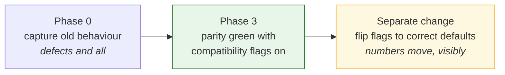
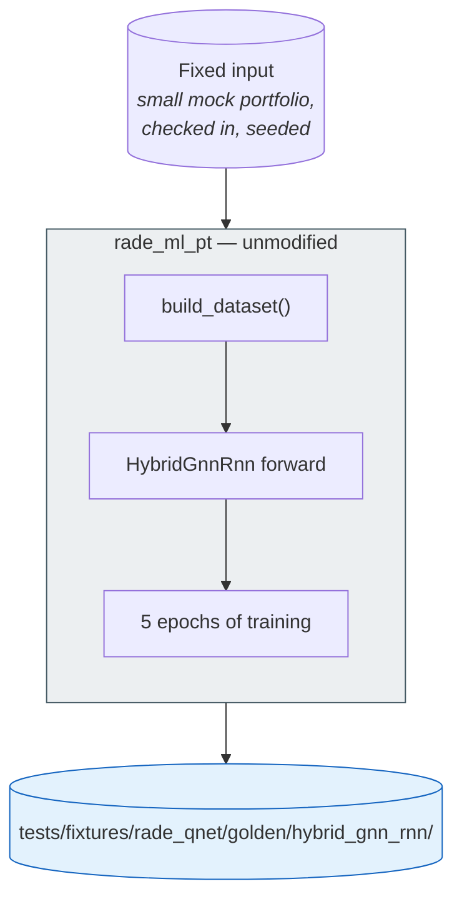
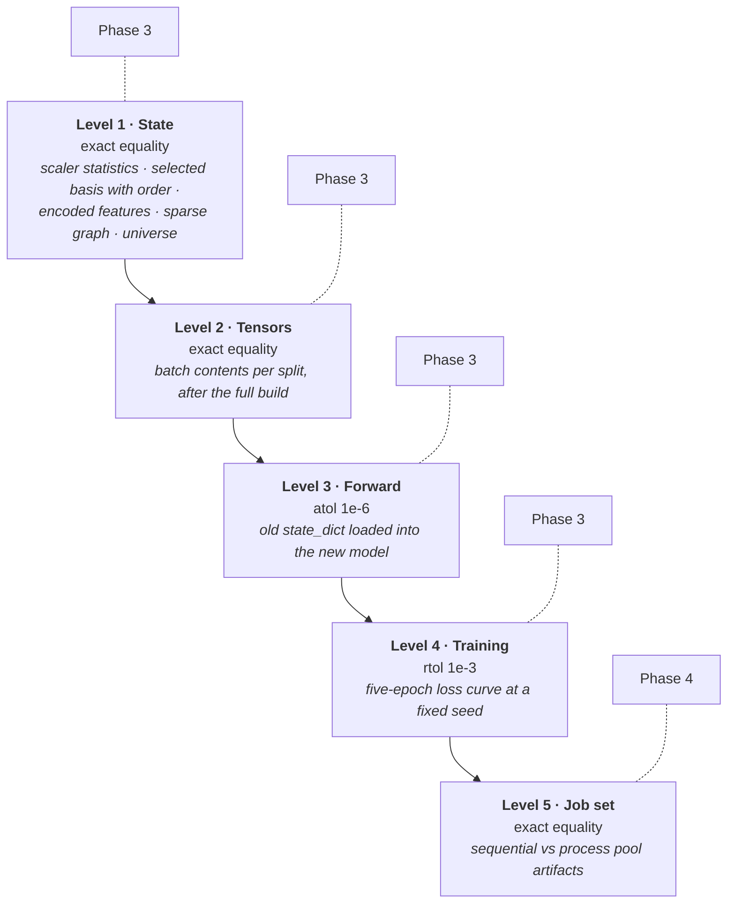
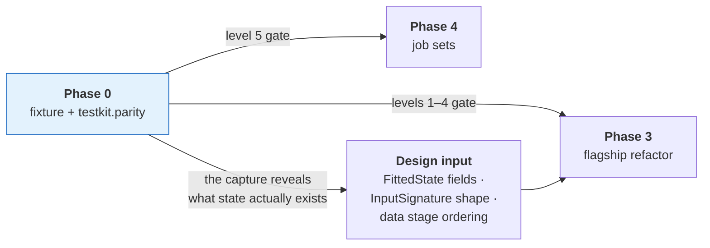

# Phase 0 — Baseline

**Capture a golden fixture from `rade_ml_pt`, and build the harness that
compares a run against it.**

> **No longer a standalone phase.** This work now runs as the *first half* of
> the merged phase **0+3**, immediately before the flagship refactor begins —
> see the merge note in
> [`IMPLEMENTATION.md` §4](../IMPLEMENTATION.md#4-phase-map). This document
> remains the specification for the fixture and the parity harness; it is the
> *scheduling* that changed, not the content.
>
> The one discipline the merge must not lose is the definition-of-done item
> that `rade_ml_pt` has **no** modifications in the capture's diff. That is now
> the gate between the two halves of the merged phase, and it is the reason
> this work was originally sequenced first.

| | |
| --- | --- |
| **Depends on** | Scaffold |
| **Runs as** | The first half of phase 0+3, before any `rade_qnet` flagship code |
| **Blocks** | The flagship refactor (second half of phase 0+3) |
| **Delivers** | A frozen fixture, `rade_qnet.testkit.parity`, and a documented list of behaviours being preserved versus fixed |

---

## 1. Purpose

The refactor's entire correctness claim is: *the flagship model in `rade_qnet`
produces the same results as the flagship model in `rade_ml_pt`.* That claim is
either backed by a frozen artifact captured before anything changed, or it is
an assertion.

This phase produces the artifact.

### Why this is Phase 0 and not Phase 3

Capturing the baseline later does not work, for a reason that is about people
rather than code. Reading `rade_ml_pt` closely enough to capture its behaviour
means noticing its defects — all ten listed in
[`ARCHITECTURE.md` §13](../ARCHITECTURE.md#13-design-decisions-and-the-defects-they-fix)
were found exactly that way. Once new code exists to compare against, "fix it
while capturing it" becomes irresistible, and the baseline silently becomes a
record of intended behaviour rather than actual behaviour.

The fixture must record what `rade_ml_pt` **does**, defects included.

### The crucial distinction: preserve versus fix

Two of the ten known defects change numerical output. They are handled by
capturing the old behaviour *and* giving the new implementation a flag that
reproduces it:

| Defect | Old behaviour | Parity approach |
| --- | --- | --- |
| **9 — basis selection leakage.** `dimension_reduction` runs on the full scaled history, including validation and test rows. | Basis chosen with knowledge of held-out data. | New code takes `data.basis.fit_on: train \| all`. Parity runs with `all`. The default is `train`. |
| **3 — shuffled scenario split.** One `shuffle` flag drives both the split and batch order, so `shuffle=True` produces a random split. | Random, leaky splits; with `seq_length>1`, windows straddle boundaries. | Fixture captures the **exact split indices**, which the new code reproduces via `split: {kind: explicit}`. |

So the sequence is:



Fixing a bug and proving a refactor are two different tasks. Done in one
change, neither is verified: a parity failure could be the bug fix working or
the refactor broken, and there is no way to tell.

The other eight defects — lossy config round-trip, the un-constructable
config, per-sample static comparison, the catalog race, premature distributed
wrapping, the tuning `TypeError`, forced global determinism, pickled
modules — do not alter numerical output. They are fixed in the refactor with
no compatibility flag.

---

## 2. What is built

### 2.1 The capture script

`examples/rade_qnet/phase0_capture_baseline.py`

A standalone script that runs `rade_ml_pt`'s hybrid pipeline on a fixed,
checked-in input and writes the fixture. It imports **nothing** from `rade_qnet`
except `testkit.parity` helpers for writing, so no new code can influence what
is captured.



The input is deliberately small — a handful of elementary instruments, a
handful of targets, a few hundred scenarios. Large enough to exercise the graph
and the recurrence, small enough that the fixture can be committed and a parity
test can run in seconds. A parity suite that takes twenty minutes gets run
once.

### 2.2 The fixture

```text
tests/fixtures/rade_qnet/golden/hybrid_gnn_rnn/
├── manifest.json            what was captured, from which commit, with which config
├── input/
│   ├── portfolio.parquet    the exact input, checked in
│   └── config.json          the rade_ml_pt config used
├── level1_state/
│   ├── scaler_mean.npy      per-feature scaler statistics
│   ├── scaler_scale.npy
│   ├── selected_basis.json  selected elementary instruments, in order
│   ├── combined_features.npy
│   ├── adjacency_indices.npy
│   ├── adjacency_values.npy
│   ├── adjacency_shape.npy
│   ├── elementary_idx.npy
│   ├── target_idx.npy
│   └── universe.json
├── level2_tensors/
│   ├── split_indices.json   train / validation / test scenario indices
│   ├── train_batch_000.npz  first N batches per split, as produced
│   ├── val_batch_000.npz
│   └── test_batch_000.npz
├── level3_forward/
│   ├── state_dict.pt        weights at a fixed seed, before training
│   └── outputs.npy          forward-pass output for a fixed batch
└── level4_training/
    └── curve.json           train and validation loss, 5 epochs, fixed seed
```

Two details that are easy to get wrong and expensive to discover later.

**`selected_basis.json` records order, not just membership.** Basis selection
returns an ordered list, and that order determines column positions in every
downstream array. A refactor that selects the same instruments in a different
order passes a set comparison and fails everything after it.

**Index arrays are captured post-reduction.** `rade_ml_pt`'s `build_metadata`
*recomputes* `elementary_idx` as `0..n_e` and `target_idx` as
`n_e..n_e+n_t` **after** dimensionality reduction. Capturing pre-reduction
indices would make level 1 pass against the wrong thing.

### 2.3 `rade_qnet.testkit.parity`

The comparison harness, and the only `rade_qnet` code this phase writes.

| Function | Responsibility |
| --- | --- |
| `load_golden(name)` | Read a fixture and its manifest. |
| `compare_arrays(actual, expected, *, name, atol, rtol)` | Compare with a diagnostic on failure: shape, dtype, index of worst element, actual versus expected at that index. |
| `compare_state(actual, golden)` | Level 1 — exact. |
| `compare_tensors(actual, golden)` | Level 2 — exact. |
| `compare_forward(actual, golden, *, atol)` | Level 3. |
| `compare_curve(actual, golden, *, rtol)` | Level 4. |
| `ParityReport` | Per-level pass or fail with the worst deviation, so a failure is diagnosable from the report alone. |

`compare_arrays` is where the effort goes. "Arrays differ" wastes a day;
"element 4,117 of `combined_features`: expected 0.3471, got 0.3470, worst of
2 mismatches in 48,000" locates the bug immediately.

---

## 3. The five parity levels



Tolerances widen down the list, and the reasoning is specific to each.

**Levels 1 and 2 are exact.** These are deterministic NumPy computations on
identical inputs. There is no floating-point excuse available: a difference
means different arithmetic, which is a bug.

**Level 3 allows `atol=1e-6`.** The old `state_dict` is loaded into the new
model and both are run on the same batch. Operations may be reassociated — a
fused kernel, a different reduction order — which perturbs the last bits
without changing the computation.

**Level 4 allows `rtol=1e-3`.** Five epochs of training accumulate
non-determinism from non-deterministic kernels and reduction order. A tighter
tolerance here would produce a test that fails occasionally and therefore gets
ignored, which is worse than a looser one that means something.

**Level 5 returns to exact.** Nothing about placement should change arithmetic.
If sequential and parallel runs differ at all, something is sharing state or
seeding per-worker incorrectly. This level is Phase 4's gate.

### Why the static/dynamic refactor is safe

Phase 2 moves static inputs out of per-sample collation into
`TensorBatchData.static`. That sounds like a behavioural change, and it is
worth stating why it is not.

`rade_ml_pt`'s `RadeDataset` merges every static tensor into every sample, and
`_collate_dict_batch` then runs `torch.equal` across the batch for each static
key and returns `values[0]` — the single unbatched tensor. **The network
already receives exactly one copy.** Moving the static tensors to a separate
field delivers the same object to the same place and deletes the per-sample
comparison. Level 2 confirms this: the batch contents are unchanged.

---

## 4. How this links to the rest of the framework



The fixture is more than a test. Capturing it forces an exhaustive inventory of
what `rade_ml_pt` actually fits and persists, which is the direct input to the
flagship's `FittedState` and `InputSignature` design. The twenty-odd sidecar
files of the old implementation are collapsed into one typed object precisely
because this phase enumerates them.

One concrete finding to carry forward: `_REQUIRED_KEYS` in the old model lists
seven keys, one of which — `elementary_indices` — is never read by the forward
pass. The new `InputSignature` should not declare it. Phase 3's parity run will
confirm it is genuinely unused.

---

## 5. Tests

`tests/rade_qnet/testkit/test_testkit_parity.py`

The harness that decides whether the refactor is correct has to be correct
itself. A parity suite that passes everything is worse than none, because it
provides false assurance. So it is tested in both directions.

| Test | Asserts |
| --- | --- |
| `test_identical_arrays_pass` | Comparing an array with itself passes at every tolerance. |
| `test_perturbation_above_tolerance_fails` | A deviation larger than `atol` fails. |
| `test_perturbation_below_tolerance_passes` | A deviation smaller than `atol` passes. |
| `test_shape_mismatch_fails_with_both_shapes` | A shape mismatch is reported as such, with both shapes, not as a value difference. |
| `test_dtype_mismatch_is_reported` | `float32` versus `float64` is flagged rather than silently upcast. |
| `test_failure_report_locates_worst_element` | The report names the worst index and its two values. |
| `test_reordered_basis_fails` | Same instruments in a different order **fails** — the trap described in §2.2. |
| `test_missing_golden_file_raises_clearly` | An incomplete fixture produces an actionable error, not a `KeyError`. |

Note what is *not* tested here: the fixture's contents. The fixture is data,
not code. Its correctness is established by the capture script running against
unmodified `rade_ml_pt`, and recorded in `manifest.json` with the source
commit.

---

## 6. Definition of done

Beyond the universal criteria in
[`IMPLEMENTATION.md` §5](../IMPLEMENTATION.md#5-definition-of-done--every-phase):

- [x] `examples/rade_qnet/phase0_capture_baseline.py` runs against unmodified
      `rade_ml_pt` and writes the complete fixture.
- [x] `rade_ml_pt` has **no** modifications made by this phase. One
      pre-existing modification to `standardiser.py` was found and verified
      irrelevant to the captured path — 47 insertions, 0 deletions, and the
      `standard` branch the capture uses is byte-identical to `HEAD`. Recorded
      in §8.
- [x] The fixture is committed at **132 KB**, well under 10 MB, and the whole
      `testkit` suite including the fixture guards runs in under a second.
- [x] `manifest.json` records the commit, the full data and model config, the
      seed, the library versions, the capture timestamp and the two
      deliberately preserved defects.
- [x] `selected_basis.json` records order, a test proves a reordering fails,
      and a further test proves the captured order is **not** the input order
      — without which the ordered and unordered comparisons would be
      indistinguishable on this data.
- [x] Index arrays are captured post-reduction, with a comment stating why,
      and `test_the_index_arrays_are_post_reduction` pins it. The fixture
      genuinely reduces 20 instruments to 8, so the trap is live rather than
      theoretical.
- [x] `testkit.parity` implements all five comparison levels.
- [x] `compare_arrays` failure output names the array, the worst *mismatching*
      element, both values, the difference and the mismatch count.
- [x] Every test in §5 passes, plus the fixture guards in §8.
- [x] The compatibility flags needed for parity (`basis.fit_on: all`,
      `split.kind: explicit`) are recorded here, in `manifest.json` under
      `preserved_defects`, and in the Phase 3 document.
- [x] Re-running the capture reproduces the fixture bit for bit, asserted by
      `phase0_capture_baseline.py --verify`.

---

## 7. Risks

| Risk | Why it matters | Mitigation |
| --- | --- | --- |
| `rade_ml_pt` is not deterministic enough to capture | No stable baseline exists, and the refactor cannot be verified | Capture twice and diff. If levels 1–2 differ, find the source of non-determinism and pin it **in the capture script**, never in `rade_ml_pt`. |
| The fixture is too large to commit | It stops being run, and parity becomes theoretical | Keep the input tiny; store first-N batches rather than all; assert the size limit in CI |
| Capture reveals a defect too severe to preserve | Reproducing it in new code would mean writing a known-wrong path | Record it here explicitly, skip the affected parity level with a written justification, and cover the behaviour with a direct unit test instead |
| A compatibility flag never gets flipped | The framework ships with a leakage path on by default | The flag's default is **already** the correct value; parity overrides it explicitly. Forgetting leaves the *correct* behaviour in place. |
| The fixture drifts as `rade_ml_pt` changes | Parity passes against a stale target | `manifest.json` pins the commit; the parity test warns if `rade_ml_pt`'s hybrid data build has changed since capture |

The fourth row is worth dwelling on. Defaults are set so that the *failure mode
of forgetting* is the safe one. `basis.fit_on` defaults to `train`; the parity
run has to opt into `all`. If the flag is never revisited, nothing is leaking.

---

## 8. Deviations

*Record here any departure from this document, with reasoning, at the time it
is made. A phase document that no longer matches the code is worse than no
document.*

| Deviation | Reason |
| --- | --- |
| The input is committed as `.npy` + `.json`, not `input/portfolio.parquet`, and the four pickles `rade_ml_pt`'s loader reads are materialised into a temporary directory at capture time | The loader reads four separate artifacts: two P&L frames and two attribute dictionaries whose columns hold lists, which a single parquet cannot represent. Checking in the pickles instead would put executable payload in a fixture whose whole purpose is to be trusted. The conversion is lossless, happens in the capture script, and leaves the committed artifact reviewable in a diff. |
| Level 4 uses an explicit training loop written in the capture script, not `rade_ml_pt`'s trainer | The trainer applies early stopping, learning-rate reduction and best-weight restoration. A curve captured through it would record those callbacks as much as the model, and the refactored framework implements its own callbacks by design — so comparing the curves would test whether two callback implementations agree, which is not the question. The narrower claim actually captured is: same architecture, same batches in the same order, same optimiser and loss produce the same losses. That isolates the model and the data, which is what the refactor moved. |
| The capture materialises the model's lazy parameters before constructing the optimiser | Defect 6: an optimiser built over uninitialised parameters holds placeholders and updates nothing. Doing it correctly here is not a modification to `rade_ml_pt` — it is the capture script avoiding a trap, which is permitted where editing the original is not. Had the capture reproduced the defect, level 4 would have recorded a flat curve and tested nothing. |
| The input is laid out as (underlying, product) groups of five rather than a flat book | Found while verifying the first capture. `dimension_reduction` runs basis selection **per group**, so the original two-instruments-per-group input reduced 16 of 16 — nothing was removed, `elementary_idx` came out equal to the pre-reduction indices, and the post-reduction trap went uncaptured. The fixture would have passed against a refactor that gets it wrong. Five per group driven by two factors reduces 20 to 8, and `test_the_fixture_can_still_fail` now asserts that it does. |
| A second test module, `test_testkit_golden_fixture.py`, guards the fixture's shape | §5 states correctly that the fixture's *values* are not tested. Its *shape* must be, because a fixture degrades silently: re-captured under a configuration where selection keeps everything, every parity test still passes while two of its sharpest checks have stopped testing anything. These guards assert it still reduces, that the surviving order is not the input order, and that the window spans more than one scenario. |
| `rade_ml_pt` carries one pre-existing modification: `features/transforms/standardiser.py` | Not made by this phase — it predates it. Verified not to affect the baseline: the diff is **47 insertions and 0 deletions**, and the only change to `get_transformer` is two new `elif` branches for `global` and `signed_log_global`. The capture uses `transform_type="standard"`, whose branch is byte-identical to `HEAD`. The code path the capture takes through `rade_ml_pt` is therefore unmodified, which is what the definition-of-done item is protecting. |
| `compare_arrays` treats a NaN on one side only as a mismatch, explicitly | Caught by `test_a_nan_on_one_side_only_fails` while writing the harness. The natural implementation subtracts and compares against a tolerance, but `nan - 2.0` is `nan` and `nan > tol` is **False**, so a refactor that started emitting NaN where the original emitted a number would have been reported as a **pass** — the most dangerous direction a parity harness can fail in. |
