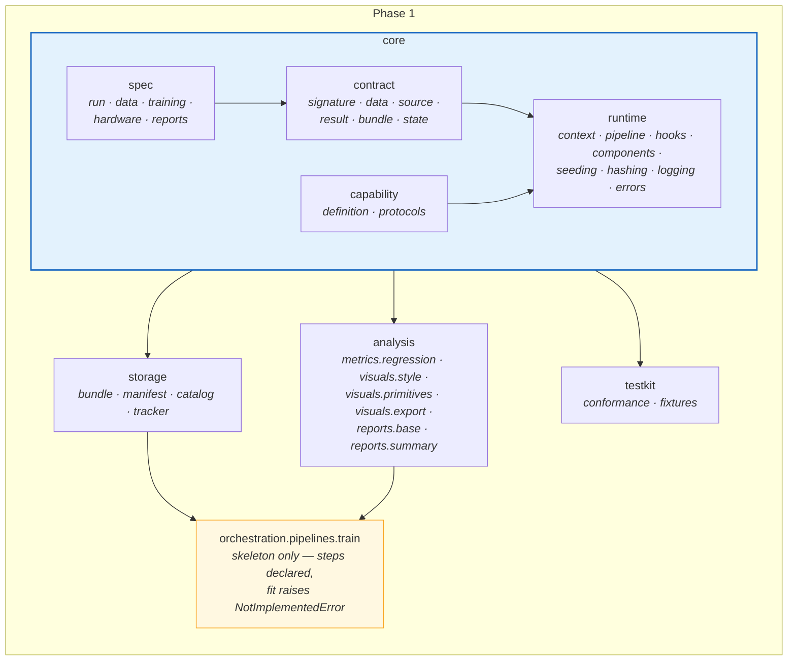
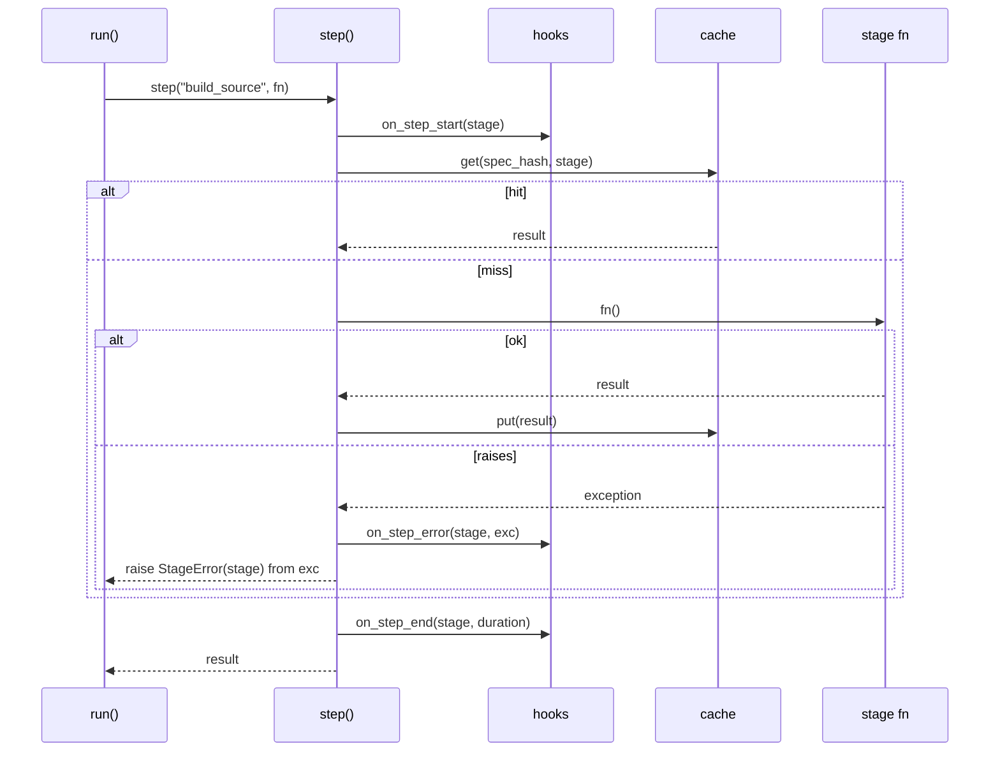
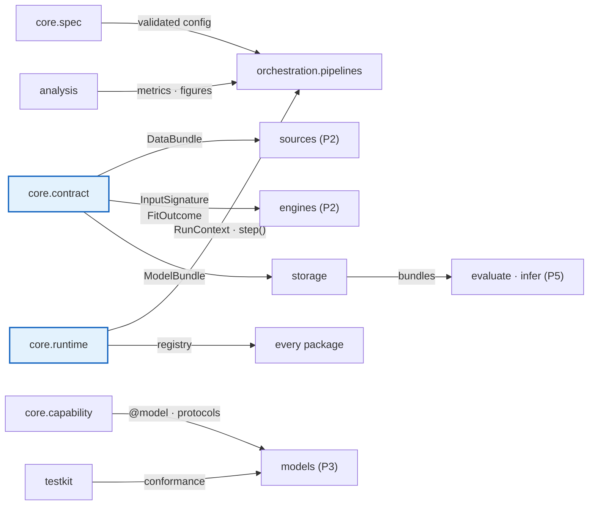

# Phase 1 — Core

**The framework's vocabulary, and the infrastructure every later phase
consumes.**


|                              |                                                                                                         |
| ---------------------------- | ------------------------------------------------------------------------------------------------------- |
| **Depends on**               | Scaffold                                                                                                |
| **Blocks**                   | Everything                                                                                              |
| **Delivers**                 | `core.spec`, `core.contract`, `core.capability`, `core.runtime`, `storage`, `analysis` bases, `testkit` |
| **Can run in parallel with** | The baseline capture, now the first half of phase 0+3                                                   |
| **Nothing trains yet**       | That is Phase 2                                                                                         |
| **Status**                   | Complete — see [§5](#5-definition-of-done) and [§7](#7-deviations)                                      |


---

## 1. Purpose

This phase builds the words. Every later phase is a consumer of it, which has
two consequences worth internalising before starting.

**A compromise here is a compromise everywhere.** If `DataBundle` is awkward,
every data module, every engine and every pipeline is awkward. Later phases can
be refactored in isolation; this one cannot.

**It is the largest phase and produces nothing demonstrable.** No model trains.
What exists at the end is a run context, an instrumented step runner, a
component registry, an atomic bundle writer, a single-writer catalog, pure
metrics, a plotting style and a conformance suite. The temptation to rush it
and "get to the model" is exactly the pressure that produced the defects this
framework exists to fix.

The one rule that governs the whole phase: `core` **imports no training
library.** Only the standard library, `pydantic` and `numpy`. A specification
must be parseable, validatable and hashable in a process that has never
imported PyTorch, because a job set spawning sixteen workers pays every import
cost sixteen times. This is enforced by `test_scaffold.py` through an
allowlist.

---


## 2. What is built




### 2.1 `core.spec`


| Module        | Contents                                                                               |
| ------------- | -------------------------------------------------------------------------------------- |
| `run.py`      | `RunSpec`, discriminated on `task` into `SupervisedRunSpec` and `ReinforcementRunSpec` |
| `data.py`     | `SourceSpec` union, `SplitSpec`, `LoaderSpec`                                          |
| `training.py` | `TrainingSpec`, discriminated on `engine`                                              |
| `hardware.py` | `HardwareSpec` — device, precision, compile, distribution, determinism                 |
| `reports.py`  | `ReportsSpec` — which writers are enabled                                              |


Rules, all of them testable:

- `model_config = ConfigDict(extra="forbid", frozen=True)`. A typo is a
load-time error; immutability means a spec cannot be mutated behind a
pipeline's back halfway through a run.
- Exact round-trip: `Spec.model_validate(spec.model_dump())` equals `spec`.
This is what makes a persisted spec a faithful record, and it is the property
defect 1 violated.
- Every spec is constructible with defaults. `Spec()` must not raise — defect 2
was exactly this, a required field hidden inside a default factory.
- Unions are discriminated, so a validation error names the field rather than
reporting five failed alternatives.
- Cross-field validation at the spec, not in the pipeline. Split fractions
summing to one or more is a `SpecError` before a file is read.

Two separations to preserve:

`SplitSpec` **and** `LoaderSpec` **are different objects.** The scenario split and
the batch order are unrelated decisions. Defect 3 came from one `shuffle` flag
driving both, which turned a chronological split into a random one.

`HardwareSpec` **is not** `PlacementSpec`**.** Hardware is how one job uses its
machine. Placement (Phase 4) is where jobs run. Conflating them is why "use the
GPU" and "run forty in parallel" become the same tangled flag.

`HardwareSpec.determinism` is `off | warn | strict`, replacing defect 8's
globally forced `use_deterministic_algorithms(True)` inside a swallowed
`try`/`except`. The cost — slower kernels, and some operations unsupported — is
a trade-off a user should make knowingly.

### 2.2 `core.contract`


| Module         | Contents                                                       |
| -------------- | -------------------------------------------------------------- |
| `signature.py` | `TensorSpec`, `InputSignature`, `PolicySignature`              |
| `data.py`      | `DataBundle[T]`, `TensorBatchData`, `DataLineage`. `ArrayData` was also built here and [retired in Phase 6](PHASE_6_ADDITIONAL_ENGINES.md#81-arraydata-and-enginecapabilitiespayload-are-retired) |
| `source.py`    | `BatchSource` protocol                                         |
| `result.py`    | `FitOutcome`, `TrainingResult`, `EvalResult`, `Predictions`    |
| `bundle.py`    | `ModelBundle`, `SavedBundle`, `Manifest`                       |
| `state.py`     | `FittedState` abstract base                                    |


`InputSignature` separates static from dynamic inputs:

```python
@dataclass(frozen=True)
class InputSignature:
    """Declared shapes and dtypes of a model's inputs and target."""

    static: Mapping[str, TensorSpec]    # constant across batches: graph, entity features
    dynamic: Mapping[str, TensorSpec]   # varies per sample: history windows
    target: TensorSpec
```

This one type does three jobs. It tells the engine which tensors to upload to
the device once rather than collating per sample (fixing defect 4). It lets a
model's lazy parameters be materialised by a dummy forward pass before any
optimiser or distributed wrapper touches them (fixing defect 6). And it is what
allows a model to be rebuilt from a saved bundle without re-running the data
build.

`FittedState` is the abstract base for everything fitted at training time and
needed again at inference:

```python
class FittedState(ABC):
    """Everything a model fits during training and needs again at inference."""

    @abstractmethod
    def save(self, directory: Path) -> None: ...

    @classmethod
    @abstractmethod
    def load(cls, directory: Path) -> Self: ...

    @abstractmethod
    def inverse_transform_targets(self, predictions: NDArray) -> NDArray: ...
```

`inverse_transform_targets` is abstract, not optional. A model that scales its
target and cannot invert the scaling produces metrics in standardised space —
numbers nobody can act on. Making it a required method means that failure is
impossible to ship rather than easy to forget.

`BatchSource` is the protocol that unifies supervised and reinforcement
learning. Defining it in Phase 1, before any source exists, is deliberate: a
protocol written after its implementations describes them instead of
constraining them.

### 2.3 `core.capability`

`definition.py` holds `ModelDefinition` and its two specialisations,
`PredictorDefinition` and `PolicyDefinition`, plus the `@model` decorator. The
required surface is small — `spec`, and `build(spec, signature)` — because that
minimum is what keeps a simple model to one file.

`protocols.py` holds the five opt-in capabilities (`StaticInputs`,
`Precomputable`, `CustomStep`, `Routable`, `Inductive`), each a
`@runtime_checkable` `Protocol`. Protocols rather than base classes so a user's
model satisfies one by having the right methods — no import of ours, no
inheritance, and therefore a model can live outside this repository.

The property to test in both directions: a model implementing a capability is
detected, and a model implementing none is entirely unaffected by every
capability that exists. The second is what makes adding a capability later a
safe operation.

### 2.4 `core.runtime`


| Module          | Contents                                                                                   |
| --------------- | ------------------------------------------------------------------------------------------ |
| `context.py`    | `RunContext` — run id, directory, seed, bound logger, events, step cache, catalog, tracker |
| `pipeline.py`   | `Pipeline` base and the `step()` runner                                                    |
| `hooks.py`      | `PipelineHook` — `on_step_start`, `on_step_end`, `on_step_error`                           |
| `components.py` | `@model`, `@engine`, `@learner`, `@report` and their lookups                               |
| `seeding.py`    | `seed_everything(seed, determinism)`                                                       |
| `hashing.py`    | Stable hashes for specs, sources and files                                                 |
| `logging.py`    | Structured logging with contextual identifiers                                             |
| `errors.py`     | `RadeQNetError` and specialisations                                                          |


`step()` is the single choke point for every stage, and everything the
framework knows about a run passes through it:




One function gives timing, event emission, caching, and a failure that always
names its stage. Retrofitting any of those onto hand-written stage calls means
touching every pipeline.

`hashing.py` matters more than it looks. The spec hash is the cache key, so an
unstable hash means tuning silently rebuilds the same dataset on every trial.
Tested explicitly: equal specs hash equally, dictionary key order is
irrelevant, and the hash survives a fresh interpreter (which rules out
`hash()`, whose string randomisation differs per process).

`errors.py` draws one distinction that the rest of the framework relies on: a
`SpecError` is actionable by the user, a `ContractError` is a framework bug.
Collapsing both into `ValueError` loses that information at the moment it is
most useful.

### 2.5 `storage`


| Module        | Contents                                     |
| ------------- | -------------------------------------------- |
| `bundle.py`   | `write_bundle`, `read_bundle`                |
| `manifest.py` | Manifest schema and per-file `sha256`        |
| `catalog.py`  | The bundle index, single-writer              |
| `tracker.py`  | Tracking behind one interface, no-op default |


Four properties, each fixing a specific failure:

**Atomic writes.** Build in `tmp/`, `os.replace` into place. An interrupted
write leaves nothing that *looks* valid — which is worse than leaving nothing,
because something that looks valid gets loaded.

**Content hashes.** Every file hashed in the manifest, so corruption is caught
at load rather than surfacing as inexplicable predictions.

**Single catalog writer.** Defect 5: an index updated by eight workers through
read-modify-write loses entries. Not often — just often enough that nobody
trusts the catalog.

**No pickled modules.** Defect 10: `torch.save(model)` embeds your class's
import path, so renaming the class makes every saved model unloadable — exactly
what a refactor does. `storage` accepts bytes from an engine and never imports
one, which keeps this structurally impossible.

### 2.6 `analysis` bases

Only the foundations in this phase: `metrics/regression.py`,
`visuals/style.py`, `visuals/primitives.py`, `visuals/export.py`,
`reports/base.py`, `reports/summary.py`.

The visual/report split is established here and everything later follows it. A
visual takes data and returns a figure; it does not save, show, close or mutate
global plotting state. Tested explicitly against a temporary directory —
a plotting function that writes as a side effect cannot be used from a
dashboard, a notebook or another test.

`visuals/style.py` applies the house style through a **context manager that
restores global state on exit**. Matplotlib's `rcParams` are process-global, so
a style applied and left in place changes the appearance of every subsequent
figure, including ones produced by unrelated code in the same process.

`reports/base.py` establishes that **no report is load-bearing**: a report that
raises produces a warning, not a lost run. Discarding four hours of training
because a figure failed to render is not a trade anyone would make
deliberately.

### 2.7 `testkit`

`conformance.py` and `fixtures.py`. The conformance suite is written now, in
its Phase 1 form, and extended by each later phase. It checks that a model
builds from its spec and signature, that its fitted state round-trips, that its
bundle reloads into an equivalent model, that metrics arrive in original target
units, and that scenario-axis transforms observed training rows only.

That last check must distinguish the two fitting axes. A rule saying "fitted
transforms may only see training indices" would be wrong and would falsely fail
the flagship, whose entity-axis graph construction legitimately spans the whole
instrument universe. See
`ARCHITECTURE.md` [§5](../ARCHITECTURE.md#two-fitting-axes-two-leakage-rules).

### 2.8 `TrainPipeline` skeleton

The stage sequence is declared and each step is a typed method, but `fit`
raises `NotImplementedError` — there is no engine yet. This exists in Phase 1
so the contracts are exercised by a real caller rather than only by unit tests.
A contract that nothing consumes tends to be subtly wrong in a way no test of
the contract itself will find.

---


## 3. How this links to the rest of the framework




Every arrow leaving Phase 1 is a contract that cannot be changed cheaply once
its consumer exists. Four are worth extra scrutiny during review:


| Contract         | Consumed by                                       | Why it is hard to change later                       |
| ---------------- | ------------------------------------------------- | ---------------------------------------------------- |
| `DataBundle[T]`  | Every data module and engine                      | Changing it touches every model                      |
| `InputSignature` | Materialisation, bundle reload, static-input path | Three unrelated mechanisms depend on its exact shape |
| `FittedState`    | Every model, evaluate, infer                      | A model's persisted state format is a migration      |
| `BatchSource`    | Every loop and every source                       | The ML/RL unification rests on it                    |


---


## 4. Tests

Mirroring `tests/rade_qnet/core/`, `storage/`, `analysis/`, `testkit/`. The
planned module list is in each test package's `__init__.py`. The tests that
matter most:

### Specs


| Test                                             | Asserts                                                           |
| ------------------------------------------------ | ----------------------------------------------------------------- |
| `test_unknown_key_is_rejected`                   | `extra="forbid"` works; a typo fails at load                      |
| `test_round_trip_is_exact`                       | `model_validate(model_dump())` equals the original — defect 1     |
| `test_defaults_construct`                        | `Spec()` does not raise — defect 2                                |
| `test_split_and_loader_are_independent`          | Setting `loader.shuffle` does not change split indices — defect 3 |
| `test_discriminator_error_names_the_field`       | An invalid `engine` reports that, not five union failures         |
| `test_fractions_summing_to_one_raise_spec_error` | Cross-field validation fires at the spec                          |


### Runtime


| Test                                     | Asserts                                                    |
| ---------------------------------------- | ---------------------------------------------------------- |
| `test_step_failure_names_the_stage`      | `StageError` identifies the stage and chains the cause     |
| `test_step_cache_hit_skips_execution`    | Served from cache; the function is not called              |
| `test_cache_key_changes_with_spec`       | A different spec misses                                    |
| `test_hash_is_stable_across_processes`   | Hash computed in a subprocess matches — rules out `hash()` |
| `test_hash_ignores_key_order`            | Dictionary ordering is irrelevant                          |
| `test_seeding_reproduces_a_run`          | Same seed, same numbers                                    |
| `test_hook_error_does_not_abort_the_run` | A misbehaving hook cannot lose a run                       |
| `test_duplicate_registration_raises`     | Two models claiming one name fails loudly                  |


### Storage


| Test                                             | Asserts                                                    |
| ------------------------------------------------ | ---------------------------------------------------------- |
| `test_interrupted_write_leaves_nothing_loadable` | Fail before the rename; no partial bundle is readable      |
| `test_modified_file_fails_verification`          | Content hash catches a tampered file                       |
| `test_concurrent_catalog_writes_lose_no_entry`   | Several processes register; all entries present — defect 5 |
| `test_unreachable_tracker_warns_not_raises`      | Tracking never fails a completed run                       |
| `test_bundle_reload_rebuilds_the_model`          | Signature plus weights reconstruct an equivalent model     |


### Analysis


| Test                                          | Asserts                                                      |
| --------------------------------------------- | ------------------------------------------------------------ |
| `test_metric_matches_hand_computed_value`     | Against arithmetic done by hand, not a second implementation |
| `test_metric_degenerate_cases`                | Constant target, perfect prediction, single observation      |
| `test_visual_writes_nothing`                  | No file appears in a temporary working directory             |
| `test_style_restores_global_state`            | `rcParams` unchanged after the context manager exits         |
| `test_failing_report_warns_and_run_completes` | No report is load-bearing                                    |


### Conformance


| Test                                      | Asserts                                                       |
| ----------------------------------------- | ------------------------------------------------------------- |
| `test_compliant_model_passes`             | A correct minimal model passes every check                    |
| `test_each_check_fails_a_violating_model` | For each clause, a model breaking exactly that clause fails   |
| `test_entity_axis_fitting_is_not_flagged` | Full-universe entity fitting passes — the false-positive trap |


The second conformance test is the important one. A suite that passes
everything is worse than none, so each clause is verified against a model built
to violate it.

---


## 5. Definition of done

Beyond the universal criteria in
`IMPLEMENTATION.md` [§5](../IMPLEMENTATION.md#5-definition-of-done--every-phase).

Every box below is ticked against a named test, not against a reading of the
code. Where a test is not named, the claim is checked by the whole suite
passing and is marked as such.

- [x] All modules in §2.1–§2.8 exist, with docstrings stating their contracts.
- [x] `core` imports only stdlib and its allowlisted third-party packages —
      `test_scaffold.py::test_core_stays_free_of_training_libraries`. The
      allowlist is `numpy`, `pydantic`, `typing_extensions` and `yaml`; the
      addition of `yaml` is recorded in §7.1.
- [x] Every spec: `extra="forbid"`, `frozen=True`, exact round-trip, and bare
      constructible wherever it is reached through a `default_factory` —
      `test_scaffold.py`. The narrowing of the last clause is recorded in §7.1.
- [x] Split and loader concerns separate; hardware and placement separate.
      `SplitSpec` is realised as a discriminated union of
      `ChronologicalSplitSpec`, `PurgedKFoldSplitSpec`, `GroupedSplitSpec` and
      `ExplicitSplitSpec`, which is a stronger separation than the single
      class this document originally named: a chronological split cannot be
      handed a `n_folds`. `LoaderSpec` holds batch order and nothing else, so
      defect 3 is unexpressible.
- [x] `FittedState.inverse_transform_targets` is abstract —
      `test_contract_state.py`.
- [x] `BatchSource` is satisfiable by a class inheriting from nothing of ours —
      `test_contract_source.py`, and demonstrated by `SyntheticTensorSource`,
      which inherits from `object`.
- [x] All five capability protocols `@runtime_checkable`, detection tested in
      both directions — `test_capability_protocols.py`.
- [x] `step()` provides timing, events and stage-named failures —
      `test_runtime_pipeline.py`.
- [ ] `step()` provides caching. **Deferred to Phase 3**, with reasoning in
      §7.4. `CacheSpec` exists, so the configuration surface is in place; the
      mechanism is not.
- [x] Spec hash stable across processes, verified in a subprocess with hash
      randomisation explicitly enabled — `test_runtime_hashing.py`.
- [x] Bundles written atomically with per-file hashes; an interrupted write
      leaves nothing loadable — `test_storage_bundle.py`.
- [x] Catalog survives concurrent writes from several processes with no lost
      entry — `test_storage_catalog.py` runs four worker processes making four
      reservations each and asserts sixteen unique contiguous versions.
- [x] Tracking degrades to a warning when unavailable —
      `test_storage_tracker.py`.
- [x] Visuals return figures and write nothing; the style context manager
      restores global state — `test_visuals_style.py` additionally walks the
      AST of every module in the package to prove none imports pyplot.
- [x] A failing report warns and the run completes — `test_reports_base.py`.
- [x] Conformance suite passes a compliant model and fails one violating model
      per clause — `test_testkit_conformance.py` asserts per clause that the
      named clause is the one that failed, so a check cannot pass the suite by
      failing for the wrong reason.
- [x] `TrainPipeline` skeleton declares every stage with typed signatures —
      `test_pipelines_train.py`.
- [x] Defects 1, 2, 3, 5, 8 and 10 each have a test that would fail against the
      old behaviour:

      | Defect | Architectural fix delivered here | Test |
      | ------ | -------------------------------- | ---- |
      | 1 | Exact spec round-trip | `test_scaffold.py` round-trip check over every spec |
      | 2 | No required field hidden behind a default factory | `test_scaffold.py` bare-construction check |
      | 3 | `SplitSpec` and `LoaderSpec` separate objects | `test_spec_run.py`, and `extra="forbid"` makes a `shuffle` key on a split spec a validation error |
      | 5 | Single-writer append-oriented catalog | `test_storage_catalog.py` multi-process probe |
      | 8 | `determinism: off \| warn \| strict`, explicit per run | `test_runtime_seeding.py` |
      | 10 | Hashed manifest, no module pickling | `test_storage_manifest.py`, `test_storage_bundle.py` |

- [x] `examples/rade_qnet/phase1_specs_and_bundles.py` demonstrates: load a YAML
      spec, hash it, write a bundle with fitted state, reload it, verify the
      manifest. It also shows a corrupted bundle being refused and the summary
      report rendering from the bundle alone.
- [x] `ruff check` and `ruff format --check` clean over `src/rade_qnet`,
      `tests/rade_qnet` and `examples/rade_qnet`; full suite green.

---

## 6. Risks


| Risk                                                           | Why it matters                                                | Mitigation                                                                                                                                 |
| -------------------------------------------------------------- | ------------------------------------------------------------- | ------------------------------------------------------------------------------------------------------------------------------------------ |
| Contracts designed without a consumer                          | A contract written in the abstract fits nothing in particular | Build the `TrainPipeline` skeleton (§2.8) in this phase; write the Phase 2 and 3 call sites as comments and check the contract serves them |
| A heavy import leaks into `core`                               | Every worker's start-up slows; the layering erodes            | Allowlist-enforced by test, not by review                                                                                                  |
| `FittedState` too narrow for the flagship                      | Phase 3 widens it, and every Phase 1 test is rewritten        | The baseline capture at the start of phase 0+3 enumerates exactly what the flagship fits. Because that capture no longer precedes this phase, `FittedState` was instead kept to the narrowest contract that cannot be wrong — `save`, `load`, `describe` and an abstract `inverse_transform_targets` — leaving *what* is fitted entirely to the implementation |
| The phase overruns and gets cut short                          | The foundations stay weak and every later phase pays          | §2.6 is already the minimum viable `analysis`; cut *scope* (more metrics, more visuals) before cutting *rigour*                            |
| `extra="forbid"` plus `frozen=True` proves awkward in practice | Pressure to relax it, which reopens defects 1 and 2           | Relaxing either is a documented architecture decision, not a convenience fix                                                               |


The first risk is the real one. A contract designed with no consumer describes
an imagined use. This is why the pipeline skeleton is in scope despite not
being able to train: it forces the contracts to be consumed by something real
before they are frozen.

---


## 7. Deviations

Everything below is a decision taken during implementation that differs from
what this document specified before the code existed. Recorded rather than
quietly absorbed, because a plan that is silently edited to match the result
stops being useful as a plan.


### 7.1 Design decisions

| Deviation                                                                                                                                                                                 | Reason                                                                                                                                                                                                                                                                 |
| ----------------------------------------------------------------------------------------------------------------------------------------------------------------------------------------- | ---------------------------------------------------------------------------------------------------------------------------------------------------------------------------------------------------------------------------------------------------------------------- |
| **Spec-default rule narrowed.** "Every spec constructible with defaults" became "every spec reached through a `default_factory` must be bare-constructible".                               | The original rule is stronger than the need and forbids a required field anywhere in the tree. What actually has to hold is that `RunSpec(model=...)` succeeds, which only requires the specs it defaults into to be bare-constructible. `test_scaffold.py` checks that. |
| **`yaml` added to the `core` third-party allowlist.** Previously stdlib, `pydantic` and `numpy`.                                                                                           | `core.spec.run.load_run_spec` reads YAML, and the alternative is pushing spec loading out of `core` into a layer that may import it — inverting the dependency. `yaml` is a parser with no transitive weight, so it costs nothing the allowlist exists to prevent.       |
| **`SpecError` also inherits `ValueError`.**                                                                                                                                               | A pydantic field validator must raise `ValueError` for pydantic to collect it with a dotted field path. Inheriting both means one error type serves both the validator path and direct raising.                                                                         |
| **Two-level validation error policy.** Direct construction surfaces `ValidationError`; `parse_run_spec` reformats into a single `SpecError`.                                               | The two callers want different things. Framework code constructing a spec wants pydantic's structured error; a user with a bad YAML file wants one readable message naming the file. Converting for both would discard structure a programmer needs.                     |
| **`task` defaults at `parse_run_spec` rather than in the union.**                                                                                                                         | A discriminated union cannot default its own discriminator. Defaulting at the parse boundary means a file that omits `task` resolves to the supervised branch, which is what nearly every user wants to write.                                                          |
| **`apply_context_payload` replaces rather than merges.**                                                                                                                                  | Merging would let a stale key from a previous stage survive into the next one's log lines. A log field that is wrong is worse than one that is missing, because nobody doubts it.                                                                                        |
| **`object`, not `Any`, for engine-native model, environment and payload types.**                                                                                                          | Both are unconstrained, but `object` makes an attribute access a type error at the point where `core` would be reaching into something it must not understand. `Any` would silently permit it.                                                                          |
| **`EarlyStoppingSpec.enabled` defaults to `False`, not `True`.**                                                                                                                          | Two reasons. A run should train the epoch budget it was configured with, and early stopping silently changes which weights you end up with. And the default `monitor` is a validation metric, so defaulting to enabled makes a bare spec invalid for any run without a validation split. |
| **`examples/rade_qnet/ruff.toml` added.**                                                                                                                                                   | Examples sat under the repository root config, where `print` is not checked. An example is the first code a new user copies, so it is held to the framework standard with `T201` relaxed — and only `T201`.                                                             |
| **Autouse `_restore_framework_logging` fixture in `tests/rade_qnet/conftest.py`.**                                                                                                          | `configure_logging` sets `propagate = False`, which is right for an application and poisons `caplog` for every later test. Without the fixture, a test asserting that something was logged passes alone and fails only when ordered after a test that configures logging. |


### 7.2 Defects found and fixed during implementation

Found by writing the tests, not by reading the code — which is the argument
for the test tree landing in the same phase as the code.

| Defect                                                                                                                                     | Fix                                                                                                                                                  |
| ------------------------------------------------------------------------------------------------------------------------------------------ | ---------------------------------------------------------------------------------------------------------------------------------------------------- |
| `parse_run_spec` raised a bare `TypeError` on a non-mapping payload. A YAML file whose top level is a list is a common mistake and produced an error naming nothing a user could act on. | An `isinstance(payload, Mapping)` guard raising `SpecError` with the likely cause named.                                                              |
| `testkit.conformance.check_source` drained with `list(source.batches())`, which hangs forever on a source declaring itself unbounded — the exact case the `steps_per_epoch is None` contract exists to support. | Prefix draining with `islice` up to `UNBOUNDED_PROBE_BATCHES`. Surfaced only because the fixture gained an unbounded mode, which is why the fixture gained one. |


### 7.3 Testkit gaps closed

The testkit is public API: a model author outside this repository uses it to
test their own model. Each gap below made some legitimate assertion
unexpressible.

| Gap                                                                                 | Addition                                                                                                                       |
| ----------------------------------------------------------------------------------- | ------------------------------------------------------------------------------------------------------------------------------ |
| `SyntheticTensorSource` could not model an unbounded source, and ignored `static` in its derived signature. | `unbounded: bool` parameter; `static` now reflected as a real `TensorSpec`.                                                     |
| `make_tensor_bundle` / `make_array_bundle` always produced all three splits, so the no-validation path could not be tested. | A validated `splits` parameter, refusing unknown names or a missing `train`.                                                    |
| `make_training_result` only ever produced a `test` evaluation, leaving the multi-split reporting path unexercised. | `with_validation` now controls a validation evaluation too.                                                                     |
| `make_model_bundle` could not be given a recognisable model, state, spec or lineage, so no test could prove the bundle carried them through untouched. | `model`, `state`, `spec` and `lineage` parameters.                                                                             |
| `make_lineage` could not set `spec_digest`, so the link `write_bundle` relies on — manifest digest copied from lineage, not recomputed — was unprovable. | `spec_digest` parameter, defaulting to the named `PLACEHOLDER_DIGEST`. `make_lineage` was also missing from `__all__`.           |


### 7.4 Deferred: step-level caching

`step()` was specified here as providing "timing, events, caching and
stage-named failures". It provides three of the four. Caching is deferred to
Phase 3, deliberately.

The reason is the one §6 names as this phase's real risk: *a contract designed
without a consumer describes an imagined use.* A cache needs a key, and a
correct key is a digest over the spec fields the stage actually reads plus the
fingerprint of its inputs. Guessing at that set with no expensive stage in
existence would produce either a key so coarse it never hits or so fine it
is wrong — and the only stage worth caching is the flagship's data build,
which arrives in Phase 3.

What is in place is the configuration surface: `CacheSpec` exists and
round-trips, so turning caching on later is not a spec change. What is not in
place is any code that reads it, and no stage currently claims to be cached,
so nothing silently behaves as though caching worked.


### 7.5 Added beyond the plan: spec invariants enforced structurally

The four spec invariants — `extra="forbid"`, `frozen=True`, exact round-trip,
and bare-constructibility where defaulted — were tested per spec module in
`core/spec/test_spec_*.py`. Thorough for the specs that exist, and silent
about the ones that do not: a spec added in Phase 2 or 3 could ship without
any of the four being checked, and the person who forgot to test it is the
same person who would have had to add it to a list.

`test_scaffold.py::TestEverySpecObeysTheSpecInvariants` now discovers every
`Spec` subclass transitively through the class hierarchy and applies all four.
Three details are worth recording:

- It asserts that discovery found something. A structural test that silently
  collects nothing is worse than no test, because it reports a guarantee it
  never checked.
- Bare-constructibility is required only of specs reached through a
  `default_factory`, matching the narrowed rule in §7.1.
- Round-tripping is required of *anything* constructible with no arguments,
  which is a wider set. `SklearnTrainingSpec` is the case that motivated the
  distinction: nothing defaults into it, because it is a sibling of
  `TorchTrainingSpec` in the training union, but a user selects it with one
  line of YAML and it must round-trip like any other.


