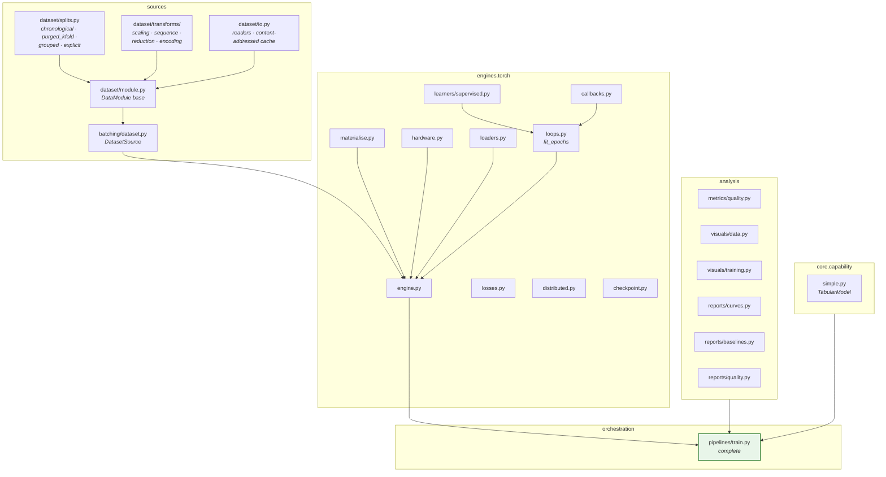
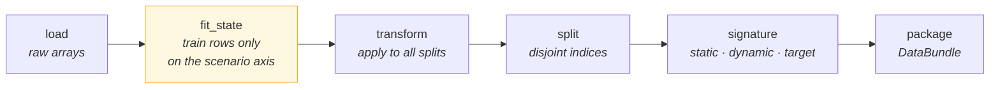
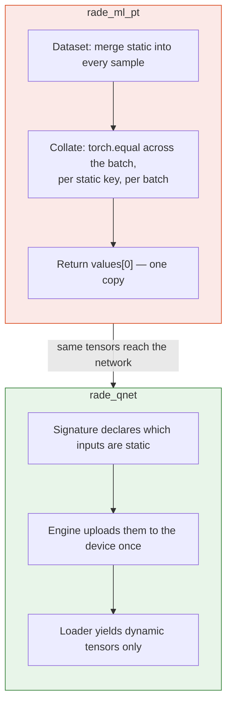
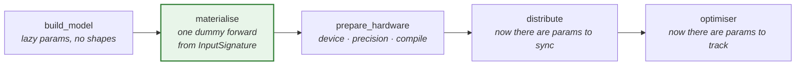
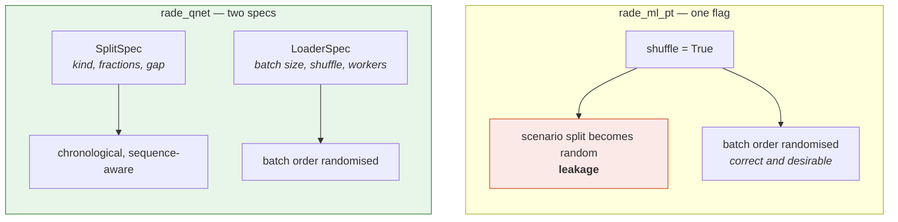
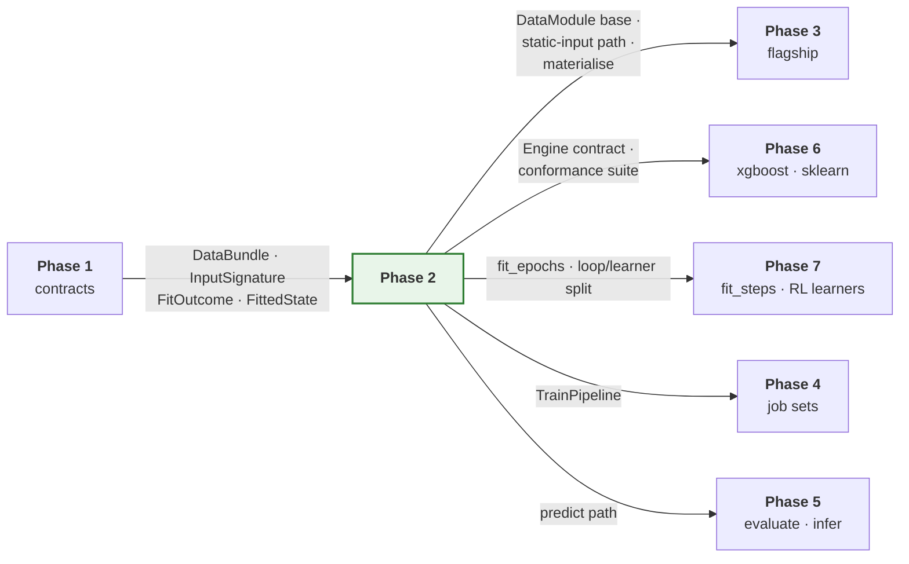

# Phase 2 — Torch engine

**The first phase that trains a model end to end.**

| | |
| --- | --- |
| **Depends on** | Phase 1 |
| **Blocks** | Phases 3 and 6 |
| **Delivers** | `engines.torch`, `sources.dataset`, `sources.batching.dataset`, a complete `TrainPipeline`, the data and training visuals and reports |
| **Milestone** | A simple supervised model trains, produces a bundle, metrics and reports |

---

## 1. Purpose

Phase 1 built the vocabulary. This phase makes it do something.

At the end, a user can point at a CSV, write a twenty-line model, and get a
trained model with a versioned bundle, leakage-aware splits, learning curves,
baseline comparisons and a data quality report — without writing a training
loop.

Three design decisions are implemented here, and all three are direct fixes to
defects in the previous implementation. They are described in §3 because they
are the substance of the phase, not details of it.

Note what is **not** here: the flagship model. A graph-temporal network is a
bad first customer for a new training loop, because a failure could be in
either. Phase 2 is proven with a model simple enough that any failure is
unambiguously the framework's.

---

## 2. What is built

### 2.1 `sources.dataset`

`DataModule` is the base a model's data build subclasses. It declares the
stages the train pipeline drives:

Stage ordering is the point. `fit_state` precedes `transform`, and it receives
train indices only on the scenario axis. A data module cannot accidentally fit
on everything, because it is never handed everything.

`splits.py` implements four strategies, all **sequence-aware**: no window may
straddle a split boundary. Without that gap, a window beginning in train
extends into validation, and the validation score is partly a memory of
training. `rade_ml_pt` had no such gap, so with `seq_length > 1` every split
boundary leaked.

`transforms/reduction.py` takes an explicit `fit_on: train | all`. This is
defect 9: basis selection in `rade_ml_pt` ran on the full scaled history
including validation and test. The default is `train`; `all` exists to
reproduce the old behaviour for Phase 0 parity and for nothing else.

### 2.2 `engines.torch`

The library split described in
[`ARCHITECTURE.md` §6](../ARCHITECTURE.md#6-one-protocol-for-ml-and-rl-batchsource):
the **loop** decides when to step, validate, checkpoint and stop; the
**learner** decides what one update means. Phase 2 delivers `fit_epochs` and
the supervised learner. Phase 7 adds `fit_steps` and four more learners against
an unchanged loop.

| Module | Responsibility |
| --- | --- |
| `engine.py` | The `Engine` implementation: build, materialise, fit, checkpoint, predict |
| `loops.py` | `fit_epochs` — passes over a finite source |
| `learners/supervised.py` | Forward, loss, backward |
| `callbacks.py` | Early stopping, checkpointing, learning-rate schedule, gradient-norm tracking |
| `losses.py` | The loss registry, including asymmetric and quantile objectives |
| `hardware.py` | Device, autocast, precision, `torch.compile` — resolved from `HardwareSpec` |
| `materialise.py` | One dummy forward from the signature, fixing lazy shapes |
| `distributed.py` | Distributed data-parallel setup and teardown |
| `checkpoint.py` | `state_dict` payloads, not pickled modules |
| `loaders.py` | `DataLoader` construction, collation, worker configuration |

### 2.3 `TrainPipeline`, complete

The Phase 1 skeleton's `fit` now works. Full sequence in
[`ARCHITECTURE.md` §5](../ARCHITECTURE.md#5-stage-contracts-and-the-train-pipeline).

### 2.4 `TabularModel`

A convenience base supplying a standard data module and split, so a
straightforward model needs no data code at all. This is what makes the
twenty-line model in §1 possible, and it is the mechanism Phase 6's baselines
rely on.

---

## 3. The three key decisions

### 3.1 Static inputs leave per-sample collation

**Defect 4.** `rade_ml_pt`'s `RadeDataset` merges every static tensor into
every sample. `_collate_dict_batch` then runs `torch.equal` across the batch
for each static key and returns `values[0]` — the single unbatched tensor.

So for every batch of every epoch, a graph adjacency matrix is compared against
itself `batch_size` times, to confirm what was true by construction.

**Why this is safe, not a behavioural change:** the old collation already
returned one copy. The network already received exactly one. Moving static
tensors into `TensorBatchData.static` delivers the same object to the same
place and deletes the comparison. Phase 0 parity level 2 confirms the batch
contents are unchanged.

### 3.2 Materialise before wrapping

**Defect 6.** A model with lazily-shaped parameters has no parameters until it
has seen one batch. `rade_ml_pt` wrapped the model for distributed training
before that point, which gives the distributed wrapper an empty parameter group
to synchronise — either a crash deep inside the library or, worse, silent
non-synchronisation.

`materialise` is a pipeline stage rather than a helper called from inside the
engine, so the ordering is visible in the pipeline definition and cannot be
reordered by accident. This is also why `InputSignature` exists: the dummy
forward needs exact shapes and dtypes with no data present.

### 3.3 Split and shuffle are different decisions

**Defect 3.** One `shuffle` flag drove both the scenario split and the batch
order. `shuffle=True` — the natural choice for training throughput — produced a
*random* split of a time series. An example script in the repository does
exactly this.

A dedicated test asserts that changing `loader.shuffle` leaves split indices
bit-identical. The two concerns cannot be re-entangled without that test
failing.

---

## 4. How this links to the rest of the framework

Phase 3 is the demanding consumer: it needs the `DataModule` stages to
accommodate a six-stage build, the static-input path to carry a sparse graph,
and materialisation to work on a model whose shapes depend on the data. Those
three requirements should be checked against the flagship's actual build
(documented in the Phase 3 document) *before* this phase is signed off.

The loop/learner split is what makes Phase 7 cheap. If training logic and
update logic are tangled here, every reinforcement-learning algorithm becomes a
new training script.

---

## 5. Tests

Modules listed in the `__init__.py` of `tests/rade_qnet/sources/dataset/`,
`tests/rade_qnet/sources/batching/` and `tests/rade_qnet/engines/torch/`. The ones
that matter most:

### Splits — the highest-value tests in the suite

These guard defects that do not announce themselves. A leaky split produces an
encouraging validation score and a model that fails in production.

| Test | Asserts |
| --- | --- |
| `test_splits_are_disjoint_and_cover_the_axis` | No index in two splits; none lost except declared gaps |
| `test_chronological_order_is_respected` | Every train index precedes every validation index |
| `test_no_window_straddles_a_boundary` | With `seq_length=20`, no window spans a split edge |
| `test_shuffle_does_not_change_split_indices` | Defect 3, asserted directly |
| `test_basis_fit_on_train_ignores_held_out_rows` | Defect 9: selection with and without held-out rows present gives the same basis under `fit_on=train` |
| `test_inverse_transform_recovers_the_target` | Round-trip to floating-point tolerance |

### Engine

| Test | Asserts |
| --- | --- |
| `test_lazy_params_materialise_before_optimiser` | Parameter count is non-zero before the optimiser is constructed — defect 6 |
| `test_static_inputs_are_not_collated_per_sample` | The loader's output contains no static key — defect 4 |
| `test_early_stopping_fires_at_the_right_epoch` | Against a synthetic loss sequence with a known minimum |
| `test_best_checkpoint_is_the_one_restored` | Not the last |
| `test_checkpoint_round_trips_as_state_dict` | Loads with `weights_only=True` — defect 10 |
| `test_losses_match_hand_computed_values` | Each loss against arithmetic done by hand |
| `test_determinism_strict_reproduces_a_run` | Two runs, identical weights |
| `test_hardware_falls_back_when_device_absent` | Requesting an absent device warns and degrades; it does not crash |

### End to end

| Test | Asserts |
| --- | --- |
| `test_simple_model_trains_and_produces_a_bundle` | The phase milestone, as one test |
| `test_bundle_reloads_and_predicts_identically` | Same inputs, same outputs after a reload |
| `test_metrics_are_in_original_target_units` | A model with a scaled target reports metrics on the original scale |

Distributed tests are marked and skipped when fewer than two devices are
present — visible as skipped, never silently omitted.

---

## 6. Definition of done

Beyond the universal criteria in
[`IMPLEMENTATION.md` §5](../IMPLEMENTATION.md#5-definition-of-done--every-phase):

- [x] All modules in §2 exist with contract-stating docstrings.
- [x] A simple supervised model trains end to end from a specification and
      produces a bundle, metrics and reports.
- [x] Its bundle reloads and predicts identically —
      `test_a_reloaded_bundle_predicts_identically`, which reopens the bundle
      from disk and rebuilds the model from the saved signature. It asserts the
      *unloaded* model predicts differently first, so it cannot pass on a
      weights file that was never read.
- [x] Metrics are reported in original target units, verified with a scaled
      target — `test_a_scaled_target_gives_the_same_errors_as_an_unscaled_one`.
      It compares `mae` and `rmse` rather than `r2`, because `r2` is
      scale-invariant and would be 1.0 whether or not the inversion happened.
- [x] All four split strategies implemented, sequence-aware, with the
      boundary-gap test passing.
- [x] `loader.shuffle` provably does not affect split indices — defect 3.
- [x] `basis.fit_on` defaults to `train`, with both paths tested — defect 9.
- [x] Static inputs absent from loader output; uploaded to the device once,
      asserted by tensor identity across batches — defect 4.
- [x] Lazy parameters materialised before the optimiser and before any
      distributed wrapper — defect 6, both halves.
- [x] Checkpoints are `state_dict` payloads loadable with `weights_only=True`,
      and a pickled payload is refused — defect 10.
- [x] `determinism: strict` reproduces a run bit for bit —
      `TestReproducibility` in the engine tests. This required adding
      `engines/torch/seeding.py`: `seed_everything` had been leaving Torch
      unseeded. See §8.3.
- [x] Every loss tested against a hand-computed value.
- [x] Engine satisfies the Phase 1 conformance suite.
- [x] The flagship's build requirements (Phase 3 §2) are reviewed against the
      `DataModule` stages — see §9. One mismatch was found and fixed.
- [x] `examples/rade_qnet/phase2_train_simple_model.py` trains a model from a
      CSV and prints the bundle path and test metrics.
- [ ] **Distributed tests marked and skipped, not omitted.** Partially met,
      and recorded honestly rather than ticked. The single-process paths are
      covered — the refusal to wrap an unmaterialised model, the rank and
      world-size readers, the wrapping and unwrapping — but there is no
      skip-marked test that actually spawns a second process. What is tested
      is every decision the framework makes; what is not is that the
      collective itself works. Deferred to Phase 4, which is the first phase
      with a reason to launch more than one process.

---

## 7. Risks

| Risk | Why it matters | Mitigation |
| --- | --- | --- |
| `DataModule` stages do not fit the flagship's six-stage build | Phase 3 reshapes the base, invalidating Phase 2's tests | Explicit sign-off item above; walk the flagship build before closing the phase |
| The loop acquires learner-specific logic | Phase 7 becomes four training scripts instead of four learners | Review rule: nothing in `loops.py` may name an algorithm |
| `torch.compile` or autocast breaks parity | Phase 3 parity fails for a reason unrelated to the refactor | Both off by default; parity runs with them off; enabling them is a separate measured change |
| Sequence-aware splitting is subtly wrong at edges | Silent leakage, which is the exact class of defect this phase exists to fix | Test the boundary cases explicitly: first window, last window, window longer than a split |
| Early stopping restores the wrong checkpoint | Reported metrics belong to a different model than the saved one | `test_best_checkpoint_is_the_one_restored`, with a loss sequence whose minimum is not last |

---

## 8. Deviations

Every row here is a difference between what §2 planned and what was built. The
table is the record, so a reader of the plan is never misled by it.

### 8.1 Scope moved between phases

| Deviation | Reason |
| --- | --- |
| `engines/base.py` delivered in Phase 2 rather than Phase 1 | The `Engine` protocol, `ModelHandle` and `EngineCapabilities` cannot be designed without a concrete engine to design them against. Written in Phase 1 they would have encoded guesses, and the first real engine would have changed all three. |
| `EngineError` added to `core.runtime.errors` | Engine faults are neither specification faults nor contract faults, and reporting them as either made the messages misleading about where to look. |
| `transforms/composite.py` added as a fifth transforms module | §2.1 listed four. A bundle carries *one* fitted state, so something has to compose the parts and own the question of which one inverts the target; leaving that to each caller is how two callers come to disagree. |
| `predict_in_batches` deliberately omitted from the `Engine` protocol | It is an implementation detail of how an engine walks a source, not part of the contract a pipeline depends on. In the protocol it would have forced every backend to expose a method only one of them needs. |

### 8.2 Corrections to the plan

| Deviation | Reason |
| --- | --- |
| §2.1 stage order corrected: `split` runs before `fit_state` | As written, the scaler would have been fitted over the whole history including the test period. The leak is invisible in the output -- metrics come out slightly too good in a way indistinguishable from a slightly better model. |
| §2.4 corrected: `TabularModel.data_module` is an abstract hook | It cannot default to the built-in tabular module, because `core` has an empty dependency set and cannot import `sources`. A default would invert the one-way dependency stack the architecture rests on. The cost is one line per subclass. |
| The chronological split's boundary gap is taken from the earlier split's tail | Taking it from the later split's head would discard the most recent scenarios of the training period, which are the most informative ones for a forecast. |
| `TorchEngine.fit` accepts `on_epoch_end` but does not forward it | The epoch loop already drives the callbacks it was given. A second notification path would let a hook and a callback observe the same epoch in an undefined order. Wired properly when hooks gain a reason to need it. |

### 8.3 Additions the plan did not anticipate

| Deviation | Reason |
| --- | --- |
| `OrderedSource` capability protocol, plus `DatasetSource.ordered()` | Scoring makes two passes over a split -- one for predictions, one for targets -- and pairs them row for row. A reshuffling training source gives two different orders, so a correctly trained model reported a negative r-squared on its own training split while every metric computed cleanly. Added as a separate protocol rather than a member of `BatchSource`, because a new required member would have dropped every structural implementer out of `isinstance`. |
| `DataLineage.quality` and `DataLineage.split_sizes` | The quality metrics have to be recorded at training time or lost: afterwards the dataset may not be reconstructable. They could not be computed in `sources`, which cannot import `analysis`, so the lineage carries them and the pipeline fills them in. |
| `TARGET_KEY` promoted into `core.contract.data` | It was defined independently in `sources.batching` and `engines.torch`. Two definitions of the key a batch holds its target under is one typo away from a silent misalignment. |
| `TorchEngine` substitutes `train_loss` for a `val*` monitor when a run has no validation split | `fit` warned that it would proceed without validation and then raised from the checkpoint, whose default monitor is `val_loss`. The warning and the behaviour contradicted each other. |
| `fit_epochs` refuses a non-finite training loss at the epoch it occurs | Once the loss is NaN the parameters are too, and no later epoch recovers. Left to finish its budget the run failed two stages later in scoring, with a message about non-finite predictions that pointed at the metrics rather than at the divergence. |
| `engines/torch/seeding.py` registers a Torch seeder | `seed_everything` seeded Python and NumPy and left Torch untouched, so two runs of one configuration differed in every weight initialisation while both reported the same seed. This is what makes `determinism: strict` mean anything for a Torch run. |
| `DataModule.signature` gained a keyword-only `state` | Found by the §9 flagship review, and a Phase 3 blocker. The flagship's signature stage must declare fitted static inputs and post-reduction index arrays, neither of which is derivable from the feature matrix. Without the state it would have had to stash it on `self` during `fit_state`, making the module stateful across stages -- a second build on one instance would reuse the first build's state. |
| `distributed.py` reads `WORLD_SIZE` and `LOCAL_RANK` through a defensive `_read_count` | These are set by the launcher, not by the framework, so a malformed value is a stray shell export rather than a bug in the job. `int()` on it crashed the run before the first batch, which pointed at the framework. |
| The closing line of `fit_epochs` reports a one-based best epoch | `EpochRecord.epoch` is zero-based and every per-epoch line was logged one-based, so one log read `epoch 1/3` and `best ... at epoch 0`. That reads as an off-by-one in the training rather than in the numbering. |
| `_select_basis` ravels its target before ranking columns | With a column-vector target the dot product is two-dimensional, so `argsort` sorted along a length-one axis and returned the columns unranked -- a basis that looked fitted and was in input order. Production passed a flat target, so the live path was correct; fixed defensively. |
| Empty-split guards in `split_chronologically` and `split_by_group` | A fraction that rounds to zero produced an empty split, and an epoch over an empty split completes instantly having trained on nothing. |
| `DatasetSource.__iter__` and `DataModule.batch_sources` | One object is both the source and the loader, so the pipeline never carries a parallel source map that could drift from the data bundle. |
| `TrainPipeline` runs eleven stages, not the seven §2.3 listed | `resolve`, `materialise`, `prepare_hardware` and `report` each carry meaning a caller can act on: resolution fails in milliseconds on an impossible combination, and materialisation has to precede both the optimiser and any wrapper. |
| `make_run_context` gained `catalog` and `job_id`; `make_signature` gained `dtype` | The first two are needed to test versioning and job-scoped output. The third is needed because the fixture was hardcoded to float64 while Torch parameters are float32, so the dummy forward pass failed on a dtype mismatch. |

---

## 9. Flagship readiness review

The Definition of Done requires the flagship's build requirements
([`PHASE_3_HYBRID_GNN_RNN.md` §2](PHASE_3_HYBRID_GNN_RNN.md#2-the-data-build-mapped-stage-by-stage))
to be checked against the `DataModule` stages as delivered, *before* Phase 3
starts. The point of doing it here is that a mismatch is cheap to fix while
the stage contract is still new and expensive to fix once a second module
depends on it. The review found one.

### 9.1 The mapping, confirmed

| Flagship stage (Phase 3 §2.2) | Delivered hook | Fits |
| --- | --- | --- |
| `load` — portfolio P&L, attributes, universe | `DataModule.load` | Yes |
| scalers, scenario axis, train rows only | `fit_state`, which receives `train_indices` | Yes |
| basis selection, scenario axis, `fit_on` flag | `fit_state` + `ReductionSpec.fit_on` | Yes |
| attribute encoder, entity axis, full universe | `fit_state` — no parameter restricts the entity axis | Yes, structurally |
| kNN graph, entity axis, full universe | `fit_state` | Yes, structurally |
| apply scalers and basis, build windows | `transform` | Yes |
| chronological, sequence-aware split | `split` + `SequenceSpec`, boundary gap from the earlier split's tail | Yes |
| `signature` — fitted static inputs, post-reduction indices | `signature` | **No — see §9.2** |
| `package` — `DataBundle[TensorBatchData]` | `batch_sources`, documented as the override point for several dynamic inputs or an entity axis | Yes |
| entity identity carried through the build | `n_entities`, `entity_ids` | Yes |
| static inputs delivered once, not per sample | `TensorBatchData.static` + `StaticInputs.from_source` | Yes, and this is defect 4 |

The entity-axis rows are the ones worth being precise about. They fit
*structurally* rather than by permission: `fit_state` has no parameter that
could restrict a fit to training entities, so fitting an encoder across the
full universe is not something the module is allowed to do, it is the only
thing it can do. That is deliberate — Phase 3 §2.4 explains why the entity
axis is not a leak — and it means the distinction cannot regress into a
conformance rule that falsely fails the flagship.

### 9.2 The one mismatch, and the fix

`signature` was delivered as `signature(spec, *, features)`. The flagship's
signature stage has to declare:

- `trade_features` — the **encoder's output**, whose width is whatever the
  fitted encoder produced;
- `adjacency_indices`, `adjacency_values`, `adjacency_dense_shape` — the
  **fitted graph**;
- `target_indices` — computed **after** basis selection, from the selected
  basis.

None of these is derivable from the transformed feature matrix. Every one of
them lives in the fitted state.

The workaround available without a change would have been for
`HybridDataModule` to stash the state on `self` during `fit_state` and read it
back in `signature`. That is worse than it looks. It makes the module stateful
across stages, so a second `build` on one instance silently reuses the first
build's state, and a cached dataset declares a signature fitted to data it was
not built from. Both failures produce a signature of the right shape with the
wrong content, which is the hardest kind to notice.

`signature` therefore now takes a keyword-only `state`, exactly as
`feature_names` already did and for the same reason: fitting changes what the
interface *is*. `TabularDataModule` discards it, and
`test_the_signature_stage_receives_the_fitted_state` asserts the stage is
handed the identical state object the dataset was built with, so the contract
Phase 3 depends on cannot quietly regress before Phase 3 arrives.

### 9.3 Deferred by design, not overlooked

Three flagship needs are *not* satisfied yet, and should not be:

- **`domains.pnl` readers.** Phase 3 §2.2 routes `load` through them. They do
  not exist; Phase 3 builds them, with a direct reader until then. Nothing in
  Phase 2 is blocked.
- **Parity harness.** Phase 3's levels 1 to 3 compare against `rade_ml_pt`
  and need the Phase 0 captures. Phase 2 deliberately does not pre-empt them.
- **`elementary_indices` omitted from the signature.** Phase 3 §2.3 records
  that the old model declares it and never reads it. The decision to omit it
  belongs with the parity run that confirms the forward pass is unaffected.
