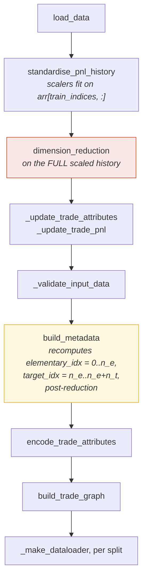
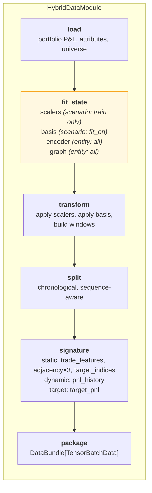
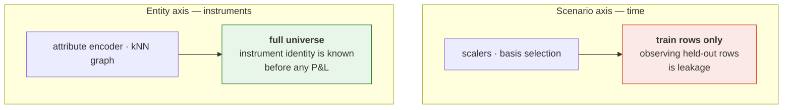
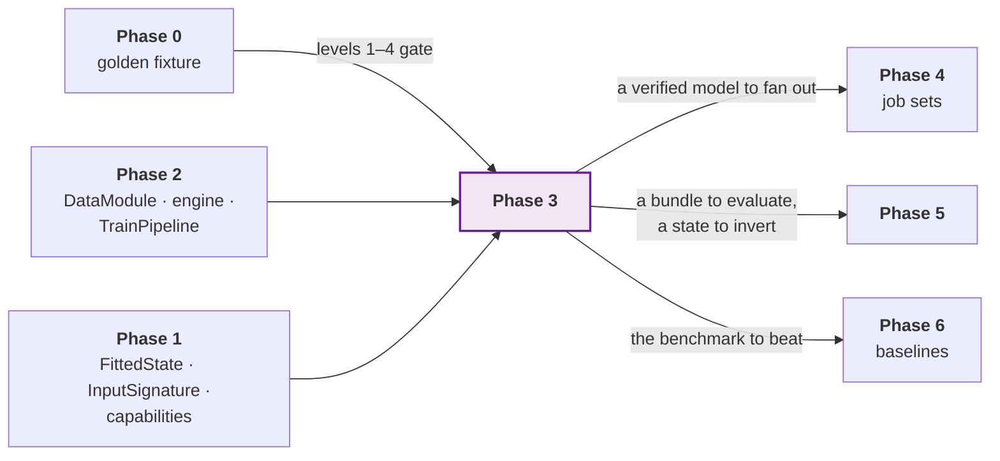

# Phase 3 — Flagship

**Refactor the hybrid graph-temporal network into the framework as a single
member, and prove it produces identical results.**

| | |
| --- | --- |
| **Depends on** | Phase 2 (engine and pipeline). The baseline capture specified in [`PHASE_0_BASELINE.md`](PHASE_0_BASELINE.md) is the first half of this merged phase, not a prior one |
| **Blocks** | Phases 4 and 5 |
| **Delivers** | `models/hybrid_gnn_rnn/*`, parity levels 1–4 green |
| **Explicitly out of scope** | Fan-out, parallelism, evaluate/infer/tune overrides |

---

## 1. Purpose

This is the phase that validates the architecture. Everything before it is
infrastructure justified by an argument; this is the argument being tested.

The flagship exercises almost every hard requirement at once: static inputs
constant across batches, lazy parameter shapes known only after the data build,
fitted state well beyond model weights, two fitting axes with different leakage
rules, and an expensive encoding worth precomputing. If the framework hosts
this cleanly, it will host most things. If it does not, the right response is
to fix the framework — not to add a special case to the model.

**One model, no fan-out.** Phase 4 adds fan-out to an already-verified model.
Doing both at once means debugging a new model and a new execution layer
simultaneously with no way to attribute a failure.

The deliverable is not "it trains". It is **parity levels 1–4 green** against
the Phase 0 fixture.

---

## 2. The data build, mapped stage by stage

This is the heart of the phase, and the question it answers is the one raised
when the architecture was agreed: *can `rade_ml_pt`'s data build be refactored
into this architecture and produce the same input dataset?*

### 2.1 What `rade_ml_pt` does

`src/rade_ml_pt/data/hybrid_gnn_rnn/build.py::build_dataset`, in order:



Two stages are flagged, and both are traps for a refactor.

**`dimension_reduction` (red)** runs on the full scaled history — validation
and test rows included. This is defect 9, selection leakage. Parity must
reproduce it; the default must not.

**`build_metadata` (amber)** *recomputes* the index arrays **after** reduction,
as `0..n_e` and `n_e..n_e+n_t`. Any refactor that carries pre-reduction indices
forward produces plausible arrays that are wrong in every downstream stage.

Its static inputs, as produced today:

```python
static_inputs = {
    "trade_features": encoder_results["combined_features"],
    "adjacency_indices": graph_result["sparse_indices"],
    "adjacency_values": graph_result["sparse_values"],
    "adjacency_dense_shape": np.array(graph_result["sparse_shape"], dtype=np.int64),
    "elementary_indices": metadata["elementary_idx"],
    "target_indices": metadata["target_idx"],
}
```

### 2.2 The mapping

| `rade_ml_pt` | `rade_qnet` | Axis | Fits on | Notes |
| --- | --- | --- | --- | --- |
| `load_data` | `HybridDataModule.load` | — | — | Reads through `domains.pnl` from Phase 4; a direct reader until then |
| `standardise_pnl_history` | `transforms.scaling`, in `fit_state` | Scenario | **Train rows only** | Already correct in `rade_ml_pt`; preserved |
| `dimension_reduction` | `transforms.reduction`, in `fit_state` | Scenario | `fit_on` flag | Parity: `all`. Default: `train`. Defect 9 |
| `_update_trade_attributes`, `_update_trade_pnl` | `transform` | — | — | Applies the reduced basis to attributes and history |
| `_validate_input_data` | Spec validation + `ContractError` | — | — | Moves earlier: most of it is now a spec constraint |
| `build_metadata` | `signature` | — | — | **Post-reduction indices.** See §2.3 |
| `encode_trade_attributes` | `features/encoder.py`, in `fit_state` | **Entity** | **Full universe** | Not leakage — see §2.4 |
| `build_trade_graph` | `features/graph.py`, in `fit_state` | **Entity** | **Full universe** | Not leakage — see §2.4 |
| `_make_dataloader` per split | `loaders.py` + `DatasetSource` | — | — | Static inputs now in `TensorBatchData.static` |

Mapped onto the framework's stages:



### 2.3 Three traps, stated explicitly

**Index arrays are post-reduction.** `build_metadata` recomputes
`elementary_idx` and `target_idx` after the basis is selected. The refactored
`signature` stage must do the same, and the code must carry a comment saying
so. Phase 0 captures these arrays post-reduction for exactly this reason.

**Basis order is part of the state.** Basis selection returns an *ordered*
list, and that order sets column positions in every array downstream. A
refactor selecting the same instruments in a different order passes a set
comparison and fails everything after it. `HybridState.selected_basis` is a
sequence, never a set, and parity level 1 compares it as such.

**`elementary_indices` is declared but never read.** The old model's
`_REQUIRED_KEYS` lists seven keys; the forward pass never consumes
`elementary_indices`. The new `InputSignature` should omit it. Parity level 3
confirms the forward pass is unaffected — and if it is affected, the finding is
that the old model had a latent dependency, which is worth knowing either way.

### 2.4 Why entity-axis fitting is not leakage

The attribute encoder and the nearest-neighbour graph are fitted across the
**whole instrument universe**, including instruments whose P&L appears only in
the test split. This is correct, and it is worth being precise about, because
the obvious conformance rule would reject it.

Which instruments exist, and what their attributes are — currency pair, tenor,
product type — is known before any P&L is observed. Restricting the graph to
training-period instruments would not remove information a trader lacks; it
would discard information they have.



A conformance rule reading "fitted transforms may only see training indices"
would be wrong and would falsely fail this model. The Phase 1 suite
distinguishes the axes, and
`test_entity_axis_fitting_is_not_flagged` exists specifically to keep that
distinction from regressing.

---

## 3. What is built

```text
models/hybrid_gnn_rnn/
├── model.py              HybridGnnRnn — architecture only
├── layers/
│   ├── gnn.py            sparse neighbourhood attention
│   ├── rnn.py            P&L history encoding
│   ├── fusion.py         combine cross-sectional and temporal
│   ├── attention.py      target attention over elementary instruments
│   └── output.py         projection to replicated P&L
├── register.py           @model declaration: spec, data, state, pipelines
├── spec.py               HybridModelSpec, HybridDataSpec
├── state.py              HybridState(FittedState)
├── data.py               HybridDataModule
├── features/
│   ├── encoder.py        entity attribute encoding
│   └── graph.py          sparse graph construction
├── pipelines/train.py    adds graph and attention reports
├── reports.py            graph structure, per-target replication quality
└── visuals.py            attention weights, neighbourhood profiles
```

### `HybridState` — twenty-odd files become one object

The old implementation's `_save_training_artifacts` writes roughly twenty
sidecar files whose relationship to each other exists only in the loading code.
They collapse into:

```python
@dataclass
class HybridState(FittedState):
    """Everything the hybrid network fits at training time."""

    target_scalers: ScalerState        # scenario axis, train rows only
    selected_basis: Sequence[str]      # ordered — order is load-bearing
    entity_encoder: EncoderState       # entity axis, full universe
    graph: SparseGraphState            # entity axis, full universe
    universe: Universe                 # elementary and target identifiers

    def inverse_transform_targets(self, predictions: NDArray) -> NDArray:
        """Return predictions to original P&L units."""
```

One typed object that knows how to save itself, load itself, and return a
prediction to original units. `inverse_transform_targets` is inherited as
abstract from `FittedState`, so metrics in standardised space are structurally
impossible rather than merely discouraged.

### `model.py` and `register.py`

`model.py` holds the network and nothing else — it should read as a piece of
mathematics. `register.py` holds the wiring. See
[`ARCHITECTURE.md` §11](../ARCHITECTURE.md#11-writing-a-model) for both.

The old model's `_gnn_cache` and `_get_adjacency` are removed. Caching an
encoding of the static inputs inside the module is replaced by the
`Precomputable` capability: the model declares `precompute(static)`, and the
framework calls it once per evaluation pass. Model-held mutable cache state is
how two jobs sharing a process interfere with each other.

### `pipelines/train.py`

A **tier 2** override: it adds reports and nothing else. The framework's
training sequence is used unchanged. If this file needs to replace a step, that
is a finding about Phase 2 and should be raised rather than absorbed.

---

## 4. How this links to the rest of the framework



This phase is also the framework's first real **feedback** signal. Three
specific things to watch, because each is a verdict on an earlier decision:

| If this happens | It means | Do this |
| --- | --- | --- |
| `pipelines/train.py` has to override a step, not just add reports | The Phase 2 sequence is too coarse | Fix Phase 2's step granularity |
| `HybridState` needs a field that does not fit `FittedState` | The Phase 1 contract is too narrow | Widen the contract, not the model |
| A capability has to be added to make the model work | Phase 1's capability set was incomplete | Add it as a protocol, and check no existing model is affected |

Absorbing any of these into the model is how a framework becomes a framework
with one special case in it.

---

## 5. Tests

Model-specific suites were deferred while the framework was proven
model-independently. They arrive here, under
`tests/rade_qnet/models/hybrid_gnn_rnn/`, mirroring the source layout. The
mirroring rule in `test_scaffold.py` is extended to cover them in this phase.

### Layers — in isolation

Each block tested alone: known input shape in, asserted output shape, gradient
flow, and the invariances the block should have. Testing an architecture only
end to end makes every shape bug a bisection exercise.

| Test | Asserts |
| --- | --- |
| `test_gnn_attends_only_along_edges` | A node with no edges is unaffected by distant nodes |
| `test_gnn_cost_scales_with_edges` | Sparse, not dense — operation count against edge count |
| `test_rnn_output_shape_and_gradient` | Fixed-width summary; gradient reaches the first timestep |
| `test_fusion_is_permutation_sensitive` | Swapping the two inputs changes the output (they are not interchangeable) |
| `test_attention_weights_sum_to_one` | Per target, across elementary instruments |
| `test_output_projection_shape` | Matches the declared target spec |

### Parity — the phase gate

All four are green. The test names below are the ones delivered; they sit with
the code they cover rather than in one parity module, because a failure should
point at the stage that produced it.

| Level | Test | Tolerance |
| :---: | --- | --- |
| 1 | `test_data.py::TestParityAgainstTheBaseline::test_the_fitted_state_matches` | Exact — scalers, basis **with order**, features, graph, universe. Except `adjacency_values`, see §8.4 |
| 2 | `test_parity.py::TestLevel2Tensors` | Exact — per split, batch contents and window counts |
| 3 | `test_model.py::TestParityAgainstTheBaseline::test_the_forward_output_matches` | `torch.equal` — the old `state_dict` loaded into the new model. Tighter than the `atol=1e-6` planned here, and it held |
| 4 | `test_parity.py::TestLevel4TrainingCurve::test_the_loss_curve_matches` | `rtol=1e-3` — five epochs, fixed seed |

Levels 1–2 run with compatibility flags on, enumerated in §8.3, plus
`split.kind=explicit` with the fixture's captured indices. The flags are set in
the test, explicitly and with a comment, not in a configuration default.

### Behaviour

| Test | Asserts |
| --- | --- |
| `test_state_round_trips` | `HybridState` save and load returns an equal object |
| `test_inverse_transform_recovers_pnl_units` | Round-trip to floating-point tolerance |
| `test_precompute_matches_plain_path` | `Precomputable` gives identical results, just faster |
| `test_no_model_held_mutable_cache` | Two models in one process do not interfere |
| `test_conformance_suite_passes` | The full Phase 1 suite |
| `test_elementary_indices_is_absent_from_signature` | The unused key is genuinely unused |

---

## 6. Definition of done

Beyond the universal criteria in
[`IMPLEMENTATION.md` §5](../IMPLEMENTATION.md#5-definition-of-done--every-phase):

- [x] All modules in §3 exist; `model.py` contains architecture only.
- [x] **Parity levels 1–4 green** against the Phase 0 fixture.
- [x] Level 1 compares `selected_basis` as an ordered sequence, and a
      reordering fails.
- [x] Index arrays computed post-reduction, with a comment stating why.
- [x] Compatibility flags used only in parity tests, never as defaults.
      Enumerated in §8.3.
- [x] `HybridState` replaces every sidecar artifact; the old file list is
      enumerated in a comment and each item accounted for.
- [x] `inverse_transform_targets` implemented and round-trip tested.
- [x] `_gnn_cache` and `_get_adjacency` gone; `Precomputable` used instead.
- [x] No model-held mutable state — two instances in one process are
      independent.
- [x] `elementary_indices` absent from the signature, with parity confirming.
      Asserted in `test_data.py` and again at parity level 2, where the key is
      listed as permitted-missing rather than silently skipped.
- [x] Every layer tested in isolation.
- [x] Full conformance suite passes, including entity-axis fitting not being
      flagged.
- [x] `pipelines/train.py` is a tier 2 override (reports only). No step is
      overridden, and `test_the_stage_sequence_is_untouched` asserts it.
- [x] `tests/rade_qnet/models/hybrid_gnn_rnn/` mirrors the source layout, and
      `test_scaffold.py`'s mirroring rule is extended to cover it via
      `DELIVERED_TEST_SUBTREES`.
- [x] `examples/rade_qnet/phase3_train_hybrid_single_member.py` trains one member
      and prints metrics, bundle path and parity status.
- [x] Baseline features deliberately not ported are recorded in §8.1, and the
      defect found during the port in §8.2.

---

## 7. Risks

| Risk | Why it matters | Mitigation |
| --- | --- | --- |
| Parity level 1 or 2 fails on a detail like basis order | Days lost to a one-line cause | `compare_arrays` reports the worst element by name and index; check order first, it is the most likely cause |
| Parity level 4 is flaky | A gate that fails sometimes gets disabled | Fix the seed, set `determinism: strict`, keep `rtol=1e-3`; if still flaky, reduce to three epochs rather than loosening the tolerance |
| The framework needs a change to host the model | Real risk — it is what this phase is for | Change the framework. Raise it, fix the earlier phase, re-run its tests. Do not add a special case |
| The model is reshaped to fit the framework | Parity fails and the cause is ambiguous | The architecture is fixed by the fixture. Only *structure* moves in this phase, never mathematics |
| Scope creep into evaluate/infer/tune | Phase 3 never closes | They are Phase 5. A bundle that trains and matches parity is the whole deliverable |
| `Precomputable` changes numerical results | A performance feature corrupts correctness | `test_precompute_matches_plain_path` asserts identity, not approximation |

The third row is the one to be disciplined about. This phase exists to test the
architecture. A framework change here is the phase *succeeding*, and it is much
cheaper than the same change after Phases 4–7 are built on top.

---

## 8. Deviations

### 8.1 Baseline features deliberately not ported

Each of these exists in `rade_ml_pt` and is absent from `rade_qnet`. None is
reachable from the Phase 0 fixture, so none affects parity — but a reader
comparing the two trees will notice them, and "we forgot" and "we decided"
need to be distinguishable.

| Not ported | Reason |
| --- | --- |
| `GraphormerLayer` | Its `invalidate_cache` method *is* defect 5 — a model holding mutable state that has to be manually invalidated when the graph changes. Porting it means porting the defect; replacing it means designing a new layer, which is architecture work and not a refactor. Unreachable from any configuration the fixture uses. The `Precomputable` capability is the intended replacement for what the cache was for, and a Graphormer variant can be added on top of it later as an ordinary model change |
| RNN cell types `tcn` and `dense` | The `rnn_type` setting accepts `lstm`, `gru`, `tcn` and `dense` in the baseline. Only `lstm` and `gru` are ported. The other two are not recurrent at all — a temporal convolution and a flattened feed-forward layer behind a recurrent name — so they belong in the catalogue as their own models rather than as cases of this one. Neither is used by any captured configuration |
| Attention-conditioned scale and bias on the output head for unseen targets | The baseline optionally conditions the projection's scale and bias on the attention output for targets absent at fit time. The code path is dead in every captured configuration, the behaviour is untested upstream, and the neighbour-blend path that *is* ported (`new_target_blend`) covers the same case with a mechanism that can be reasoned about. Ported as a gap rather than as code, because porting an untested path produces an untested path |

### 8.2 Defect 11, found during the port

Not one of the ten in `ARCHITECTURE.md` §13, because it was found here.

The baseline's configuration names the setting `use_baseline_norm`; the layer
reads `use_baseline_weight_norm`. The config loader applies settings with a
`setattr` over everything it was given, so the mismatch does not raise — the
layer simply never sees the flag and silently keeps its default. The feature
has therefore never been switched on by configuration, which is why nothing
noticed.

The mechanism matters more than this instance: a loader that `setattr`s
whatever it is handed turns **every** typo in **every** configuration into a
silently ignored setting. `rade_qnet` validates specifications with Pydantic
models that reject unknown fields, so the same typo is a startup error naming
the field.

The feature itself is ported as `HybridModelSpec.baseline_weight_norm`,
defaulting to `False` — which is the behaviour every existing run actually
had, as opposed to the behaviour its configuration appeared to request.

### 8.3 Compatibility flags the parity replay sets

Every flag defaults to the *correct* behaviour, so forgetting one is the safe
failure. Each is set explicitly in the parity test with a comment, and nowhere
else.

| Flag | Replay value | Default | What it reproduces |
| --- | --- | --- | --- |
| `transforms.reduction.fit_on` | `all` | `train` | Defect 9: basis selection fitted on the full scaled history |
| `transforms.sequence.confine_to_split` | `True` | `False` | The baseline confined each window to its split, dropping the first `length - 1` labels. The framework instead assigns a window to the split of its final row and relies on the boundary gap, which keeps every label |
| `encoder.numeric_precision` | `float32` | `float32` | Attribute encoding precision |
| `graph.precision` | `float32` | `float32` | Neighbour-search precision |

The second is worth expanding, because it is a design difference rather than a
defect. Gap-based windowing and confinement are two correct answers to the same
question and they cost the same number of scenarios: the gap discards rows at
the boundary, confinement discards the labels whose windows would reach across
it. The framework's choice is the gap, because it is already enforced
structurally by `ChronologicalSplitSpec.gap_scenarios` and verified by
`windows_stay_within`. Confinement is offered so the baseline can be replayed,
not as an alternative to configure.

Note that `windows_stay_within` must call `usable_labels(..., confine=False)`
explicitly. Confining first and then checking that no window crosses a boundary
is tautological — confinement is *defined* as removing the windows that would.

### 8.4 Tolerance on graph edge weights

`ADJACENCY_VALUE_ATOL = 1e-7`, applied at parity levels 1 and 2 to
`adjacency_values` and to nothing else.

scikit-learn's float32 nearest-neighbour kernel (`ArgKmin32`) computes squared
distances with the expanded form `‖a‖² + ‖b‖² − 2a·b`, which cancels
catastrophically when the two points are close. The result is a one-ULP
difference in a handful of edge weights depending on the kernel's blocking,
which is not something the port can or should eliminate. Everything else at
levels 1 and 2 is compared exactly.

### 8.5 The Phase 0 fixture was re-captured for level 4

The original level-4 capture did not reproduce. Two causes, both in the
*capture* rather than in the port:

1. **Dropout.** The curve depended on the order in which the RNG was consumed
   by dropout masks, which no port can reproduce unless it draws from the same
   generator in the same order — a far stronger requirement than architectural
   equivalence, and not one worth designing for.
2. **Lazy parameters (defect 6).** A lazily shaped layer draws its initial
   values at its first forward pass, which is *after* the optimiser was built
   and at a different point in the RNG sequence than an eagerly shaped one.

The fixture is now captured with dropout zeroed and with the initial weights
loaded from the level-3 `state_dict` before the optimiser is constructed, and
the replay matches. The level-3 weights were verified unchanged by the
re-capture, so levels 1–3 are unaffected.

What this costs is honest: level 4 no longer tests the dropout implementation.
What it buys is a gate that fails only when the optimisation differs, rather
than one that fails whenever an RNG draw moves — which is the behaviour that
gets a gate disabled.

### 8.6 Framework changes this phase required

All four are in §7's third row: the phase succeeding. Each is a general
mechanism with its own tests, not a special case for this model.

| Change | What it fixes |
| --- | --- |
| `TrainPipeline.report_names()` | A model could only guarantee a report by overriding the `report` stage, which means reimplementing the fail-fast handling and the ordering. Now a tier 2 override extends a list |
| `analysis/reports/__init__.py` imports its report modules | `reports: {enabled: [summary]}` failed with "no report named 'summary'" from a correct configuration. The tests imported the modules directly, so the gap only appeared in a real run |
| `DataModule.static_inputs` → `PreparedDataset` → cache → `DatasetSource.static` | `DatasetSource.static` returned a hardcoded `{}` despite its own docstring describing the graph case. A graph model's adjacency had no route from the module that built it to the engine that uploads it, and the symptom was `forward() missing 5 required keyword-only arguments` |
| `usable_labels(..., confine=)` and `SequenceSpec.confine_to_split` | See §8.3 |
