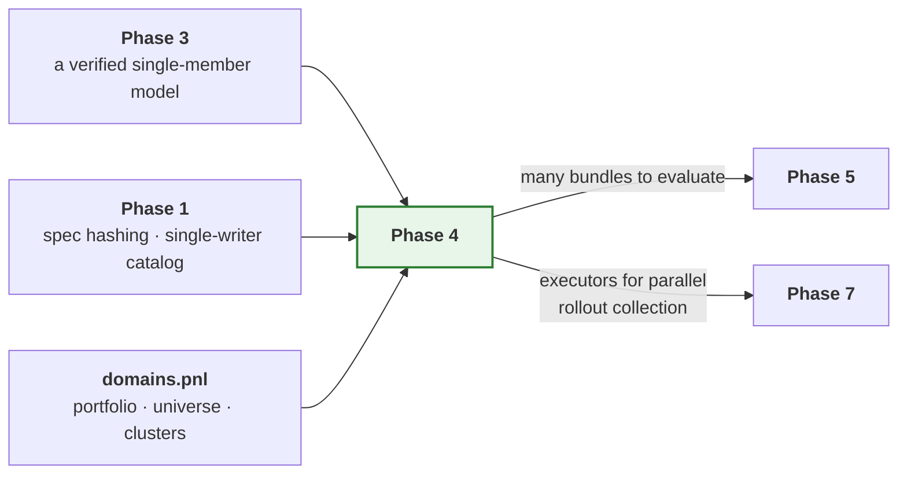

# Phase 4 — Job sets

**Run one model across many jobs, in parallel, without changing its results.**

| | |
| --- | --- |
| **Depends on** | Phase 3 |
| **Blocks** | — |
| **Delivers** | `core.spec.merge`, `core.spec.jobs`, `orchestration.compute`, `orchestration.jobs`, `domains.pnl`, `analysis.visuals.jobset`, `api`, parity level 5 |
| **Gate** | Sequential and parallel runs produce identical artifacts |

---

## 1. Purpose

A job set is **a list of jobs, each a full independent training run of the same
model**, differing in its data slice and — optionally — in its architecture
complexity. A liquid cluster with abundant history gets a wider, deeper
configuration than a sparse one, from the same specification file.

There is no ensemble model class, no shared parameters and no joint
optimisation. Fan-out is an execution concern, which is why `jobs` sits beside
`compute` rather than inside `models`.

Phase 3 proved one model. This phase runs forty of them.

### 1.1 What this phase is really testing

Every failure this phase exists to prevent is one that **passes sequentially
and fails under a pool** — or, worse, passes under a pool and silently returns
different numbers. That asymmetry is the whole difficulty. A feature that
works when you debug it and breaks when you deploy it is not a feature, and
the usual response is for people to stop trusting the parallel path and run
jobs one at a time by hand, which defeats the purpose of having built it.

So the gate is not "the pool runs". It is "the pool and the sequential
reference agree", with the sequential executor as the reference implementation
that everything else is measured against.

---

## 2. What is built

| Module | Delivers |
| --- | --- |
| `core.spec.merge` | `deep_merge` — shared defaults ⊕ per-job overrides, over *raw* mappings |
| `core.spec.jobs` | `JobSpec`, `PlacementSpec`, `JobSetSpec`, `parse_job_set_spec`, `load_job_set_spec` |
| `orchestration.compute.base` | `WorkItem`, `WorkResult`, `WorkFailure`, the `Executor` protocol |
| `orchestration.compute.local` | `LocalExecutor` — sequential, in-process, the reference |
| `orchestration.compute.processes` | `ProcessExecutor` — spawn pool with per-worker thread budgets |
| `orchestration.compute.gpus` | `GpuExecutor` — one worker per device, visibility pinned pre-import |
| `orchestration.compute.placement` | `choose_placement` — executor and worker count from hardware and set size |
| `orchestration.jobs.unit` | `run_job(payload)` — module-level and picklable; `JobPayload`, `JobOutcome` |
| `orchestration.jobs.manifest` | `JobRecord`, `JobSetManifest` — per-job status, metrics, version, wall time, reason |
| `orchestration.jobs.set` | `JobSetRunner` — expand, merge, dispatch, aggregate |
| `domains.pnl.universe` | `Universe` — the instrument identifier scheme, **moved out of the model** |
| `domains.pnl.portfolio` | Reads a portfolio of clusters; fingerprints the snapshot |
| `domains.pnl.clusters` | Expands a portfolio into the jobs a job set fans out over |
| `analysis.visuals.jobset` | Metric dispersion, ranking, status overview, wall time |
| `api` | `train`, `train_jobs` — the entry point `ARCHITECTURE.md` §12 documents |

Flow and the specification format are in
[`ARCHITECTURE.md` §8](../ARCHITECTURE.md#8-orchestration-one-run-and-many)
and §12.

---

## 3. Key decisions

### 3.1 Merge raw mappings, validate once

This is the most consequential decision in the phase and the least obvious.

Defaults and per-job overrides are merged as **raw mappings, before
validation**, and the merged result is validated once as a `RunSpec`. The
alternative — validate the defaults into a spec, validate each job into a
spec, merge the specs — is wrong, and wrong in a way that produces plausible
results rather than an error.

A validated spec cannot distinguish *"the user set this"* from *"this is the
default"*. Both are just fields with values. So given:

```yaml
defaults:
  model: {name: hybrid_gnn_rnn, units: 256}
jobs:
  - id: USDTRY
    model: {gnn_layers: 1}
```

validating the job's `model` fragment on its own yields `units=<default>`,
which then overwrites the shared `256`. The job silently trains at the wrong
width. Nothing raises, the run succeeds, and the only symptom is a model that
underperforms for no visible reason.

Merging raw mappings has no such failure mode: a key absent from the override
is absent from the merge, so the default survives untouched.

**The merge rules**, stated once here and again in `merge.py`:

| Case | Rule | Why |
| --- | --- | --- |
| Both sides are mappings | Recurse, key by key | The whole point — a nested override keeps its siblings |
| Override is not a mapping | It replaces, wholesale | A scalar has no parts to merge |
| Either side is a sequence | Replaces, wholesale | See below |
| Override value is `None` | It replaces, with `None` | `None` is a value, not an absence. The absence of a key is the absence |
| Key only in the override | Added | |
| Key only in the base | Kept | |

Sequences replace rather than concatenate because there is no identity to
merge their elements on, and because the one place it matters — `reports:
[summary]` on a job — must mean *those* reports rather than those plus the
defaults. "Deep merge" means at least three different things in common usage,
so each rule is tested at each nesting depth rather than assumed.

### 3.2 A job-set file is fragments of a run specification

The job-set schema introduces no new field names. `defaults` and each job's
overrides are **fragments of a `RunSpec`**, using the same field names a
single-run file uses, and the merged result is validated by the same
`parse_run_spec` a single run goes through.

One schema, no translation layer, and no second place for a field name to
drift. It also means every validation rule Phase 1 wrote — the sequence/split
compatibility check, the hardware combination checks — applies per job for
free.

See §8.2 for the correction this implies to `ARCHITECTURE.md` §12.

### 3.3 Placement cannot change results

An executor takes a list of work items and runs them. That is the whole
interface, and its narrowness is what keeps parallelism out of pipeline logic.
A pipeline cannot observe which executor is running it, so sequential and
parallel runs *must* agree — and parity level 5 verifies it by running both
and comparing artifacts.

Two properties the protocol fixes, both of which exist so that a manifest does
not depend on timing:

- **Results come back in input order**, never in completion order.
- **A job's seed is derived from the run seed and the job identifier**, by
  hash, never from a position, a process id or a clock. `RunContext.for_job`
  already does this, and it is why re-running one failed job alone reproduces
  exactly what the full set would have produced.

### 3.4 Three things that only break in parallel

Each works perfectly sequentially and fails under a pool, which is why they
are called out rather than discovered.

**Picklability.** Under the spawn start method a bound method or a closure
cannot cross the process boundary, and the error names the pickle protocol
rather than the design mistake. `run_job` is therefore a module-level
function, and `WorkItem` holds *a function and a payload separately* rather
than one opaque callable — so "is this picklable" is two mechanical checks on
two named things instead of one unanswerable question about a closure.

The payload carries the **ingredients** for a `RunContext`, not a context. A
context holds hooks, a catalog and a tracker; hooks are arbitrary user objects
and need not be picklable at all. The worker rebuilds its context from
primitives, which also means a worker's context is provably derived from the
specification rather than inherited from whatever the parent happened to hold.

**Thread oversubscription.** Eight workers each defaulting to every core
produces eight times the core count in threads, and throughput collapses below
sequential. Per-worker thread budgets are set in the pool **initialiser**,
which runs in the worker before any work item is unpickled and therefore
before the training library is imported.

**Device visibility.** `CUDA_VISIBLE_DEVICES` must be set in the worker
*before* the training library is imported, because visibility is cached at
import. Set it after, and every worker quietly shares device zero.

A pool initialiser receives the same arguments for every worker, so there is
no worker index to assign a device from. The device identifiers are therefore
handed out through a shared queue that each initialiser pops from once.

### 3.5 Partial failure is a feature

Forty clusters where one has insufficient history returns thirty-nine trained
models and one recorded failure with its reason. Executors therefore *return*
failures as `WorkResult` values rather than raising them.

A failure is captured as **text in the worker** — exception type, message and
formatted traceback — not as an exception object. An exception need not be
picklable (a custom `__init__` is enough to break it), and the one part that
actually matters, the traceback, does not survive pickling at all. Capturing
at the point of failure is the only way the reason reaches the manifest.

---

## 4. How this links to the rest of the framework



Phase 1's single-writer catalog is what makes this phase safe. Defect 5 — a
read-modify-write index losing entries under a process pool — is a Phase 4
failure caused by a Phase 1 decision, which is why it was fixed there. This
phase is where that fix is finally exercised against forty concurrent writers.

### 4.1 A layering constraint worth stating

`orchestration` may not import `domains` or `models`
(`test_scaffold.py::ALLOWED_DEPENDENCIES`). So `JobSetRunner` cannot ask
`domains.pnl` for a cluster list, and cannot import the flagship.

It does not need to. A job set is a *specification*, and expanding a portfolio
into jobs is something that happens **before** the runner sees it — by the
user, by `domains.pnl.clusters`, or by `api`. The runner receives jobs and
resolves the model through the registry, exactly as `TrainPipeline` does.

This is the layering doing its job: it forced the portfolio-to-jobs expansion
to be a separate, independently testable function instead of a branch inside
the runner.

---

## 5. Tests

| Test | Asserts |
| --- | --- |
| `test_sequential_and_parallel_artifacts_are_identical` | **Parity level 5** — the phase gate |
| `test_run_job_is_picklable` | Module-level and picklable under spawn |
| `test_the_payload_is_picklable_without_a_context` | Hooks and trackers never cross the boundary |
| `test_partial_failure_returns_other_results` | One failed job among many; the rest complete |
| `test_failure_reason_is_recorded` | The manifest names the type, the message and the traceback |
| `test_results_come_back_in_input_order` | Under both executors, regardless of completion order |
| `test_override_preserves_sibling_defaults` | Per nesting depth: one, two and three levels |
| `test_a_sequence_replaces_rather_than_concatenates` | The rule most often assumed otherwise |
| `test_an_explicit_none_overrides` | `None` is a value, absence is absence |
| `test_per_job_architecture_complexity_applies` | Two jobs, different widths, both honoured |
| `test_worker_thread_budget_is_applied` | Read back from the worker's own environment |
| `test_gpu_visibility_set_before_import` | Read back from the worker's own environment. Device-dependent parts skipped without an accelerator |
| `test_concurrent_catalog_registration_loses_nothing` | Forty jobs, forty entries |
| `test_manifest_written_atomically` | No partial manifest readable mid-write |
| `test_policy_selects_sane_defaults` | Across a range of simulated hardware and set sizes |
| `test_a_job_seed_depends_on_its_id_not_its_position` | Reordering the set changes nothing |

---

## 6. Definition of done

Beyond the universal criteria in
[`IMPLEMENTATION.md` §5](../IMPLEMENTATION.md#5-definition-of-done--every-phase):

- [x] **Parity level 5 green**: sequential and process-pool runs produce
      identical artifacts, under the comparison defined in §8.1 — including
      byte-identical weights, and subject to the two preconditions §8.1
      records.
- [x] The flagship runs across a multi-cluster portfolio with per-job
      architecture complexity.
- [x] `run_job` is module-level and proven picklable, and so is its payload.
- [x] Partial failure returns all successful results plus recorded failures.
- [x] Merge rules documented in `merge.py` and tested per nesting depth.
- [x] Thread budgets and device visibility verified in the worker environment.
- [x] Forty concurrent registrations lose no catalog entry. *(Covered by the
      Phase 1 catalog tests, which drive the single-writer path from a real
      process pool; Phase 4 is the first phase that uses it in anger.)*
- [x] `policy.py` picks a sensible executor and worker count unaided.
- [x] GPU tests marked and skipped, not omitted.
- [x] `examples/rade_qnet/phase4_train_groups.py` trains a multi-cluster
      portfolio and prints the job-set summary.

---

## 7. Risks

| Risk | Why it matters | Mitigation |
| --- | --- | --- |
| Parity level 5 fails from per-worker seeding | Parallel runs give different models, undermining reproducibility | Derive each job's seed deterministically from the run seed and job id; never from process id or clock. `RunContext.for_job` already does this and is tested |
| Oversubscription makes parallel slower than sequential | The feature is unusable and nobody says why | Thread budgets set in the pool initialiser and asserted from inside the worker |
| Memory exhaustion with large per-job datasets | Jobs die with an opaque kill signal | `policy.py` caps workers by a per-job memory figure when given one; a killed worker is reported as a failure naming the signal |
| A job set partially registers then fails | The catalog disagrees with the filesystem | Bundles registered per job on completion; the manifest is the set-level record and is written last, atomically |
| A test that spawns processes is slow or flaky in CI | Pool tests get disabled, and the gate with them | Pool tests use a trivial payload and two workers; only parity level 5 runs a real model, once |

---

## 8. Deviations

### 8.1 "Identical artifacts, byte for byte" is not the gate; this is

The outline stated the gate as sequential and parallel runs producing
identical artifacts byte for byte. Taken literally that is unachievable, and
stating an unachievable gate is worse than stating a weaker one — the first
time it fails for a trivial reason, somebody loosens it by hand and nobody
afterwards knows what it is supposed to mean.

A run directory legitimately differs between two executions regardless of
placement: a bundle manifest records `created_at`, a job record carries
`wall_seconds`, log files carry timestamps and process identifiers. None of
these is evidence of anything about placement.

So the gate compares a **named, reviewed set of things that placement must not
change**, with the exclusions equally named:

| Compared | Excluded |
| --- | --- |
| Model weights, byte for byte | `created_at` and any other timestamp |
| Metrics, exactly — not to a tolerance | `wall_seconds` and any other duration |
| Spec digest per job | Log files |
| The set of job identifiers, and their statuses | Absolute paths |
| Bundle version per job | Process identifiers |

The exclusion list is a module-level constant in the parity test, so widening
it is a visible, reviewable change rather than a quiet edit to an assertion.
Metrics are compared **exactly** rather than to a tolerance: placement
changing the eighth decimal place is still placement changing results, and
that is the entire proposition under test.

**Two preconditions the comparison requires, and why they are not evasions.**
Measured on the flagship model, an unpinned run fails this gate. Both causes
turned out to be real defects rather than reasons to soften the criterion,
and both are now fixed; the preconditions are what remains once they are.

*The specification must pin `hardware.threads_per_worker`.* The number of
intra-op threads decides the order in which a reduction accumulates, so it
decides the last few significant figures. A worker process gets its budget
from an environment variable set before it imports anything; the process that
launched it has already imported Torch, so the same variable does nothing
there. Sequential and pooled runs therefore ran at different thread counts
and scored differently — in the seventh significant figure, reproducibly,
with each value stable for its own thread count. That is defect 13. The fix
makes `hardware.threads_per_worker` a specification field that is applied
in-process, so the budget travels with the job instead of with the machine.
What remains is a genuine constraint: if the specification does not pin a
budget, the budget is whatever the host decided, and two hosts may disagree.
A run that wants reproducibility has to say what it wants.

*The specification must pin a deterministic device.* Under `device: auto` on
Apple silicon the run is not reproducible **against itself** — two sequential
runs of the same specification, in the same process, at `determinism:
strict`, differ. MPS kernels are non-deterministic and
`torch.use_deterministic_algorithms` does not cover them. This is not
something the framework can fix, and it is worth stating plainly rather than
burying: `determinism: strict` is a promise about what the framework
controls, and the backend is not that. On `device: cpu` the same
specification reproduces exactly, every time.

With both pinned, the flagship model's full metric mapping is bit-identical
between `local` and `processes`, for passing and failing jobs alike.

### 8.2 The job-set YAML in `ARCHITECTURE.md` §12 used pre-Phase-1 field names

The illustrative job-set file in §12 was written before Phase 1 fixed the
specification schema, and it does not validate. It uses `data:` where the spec
has `source:`, `seq_length:` where the spec nests
`transforms.sequence.length`, and `basis:` where the spec has
`transforms.reduction`.

Left as is, the documented format and the implemented format would differ,
and the first user to copy the documented one gets a validation error against
a file the architecture document told them to write.

Two options: build a translation layer so the documented names keep working,
or correct the document. The document is corrected. A translation layer is a
second schema with its own drift, its own error messages and its own tests,
bought in exchange for keeping an illustration that nobody has ever run.

### 8.3 `domains.pnl.metrics` is deferred to Phase 5

The outline placed replication quality metrics — unexplained P&L, tail
replication error, hedge-ratio stability — in this phase.

They are evaluation, and the evaluate pipeline is Phase 5. Shipping them here
means shipping metrics with no pipeline that calls them, which in practice
means metrics tested only against hand-constructed arrays and never against a
real model's output. That is how a metric ends up with the sign of its error
term reversed and nobody notices for a quarter.

Nothing in this phase needs them. The job-set manifest aggregates whatever
metrics the evaluate stage already produces, and it does so by name without
knowing what they mean.

### 8.4 `domains.pnl.universe` takes over `Universe` from the model

`Universe` currently lives in `models/hybrid_gnn_rnn/state.py`. A universe of
elementary and target instruments is a property of the **replication problem**,
not of the network that solves it — a ridge regression over the same portfolio
has exactly the same universe, and would otherwise either import it from a
model it has nothing to do with or define a second one.

It moves to `domains.pnl.universe` and the model imports it (`models` may
import `domains`; `domains` may not import `models`, which is the right way
round). No behaviour changes and the Phase 3 parity levels are re-run to
confirm it.

This is the kind of thing a second consumer is supposed to shake out, and it
is cheap now and expensive once three models have their own copy.

### 8.5 `api.py` was in no phase, and this phase needs it

`ARCHITECTURE.md` §12 presents `rade_qnet.api` — `api.train`, `api.train_jobs` —
as *the* way a user uses this framework. No phase delivers it. Every example
so far constructs a `RunContext`, digests a spec, resolves a definition from
the registry and instantiates a pipeline by hand: about twenty lines, every
one of them framework internals.

That is acceptable for a phase example demonstrating internals. It is not
acceptable as the published interface, and this is the phase where it starts
to cost something real — the natural entry point for a job set is one function
call, and the alternative is each user assembling a `JobSetRunner`, an
executor, a placement policy and a manifest path correctly and identically.

A deliberately small `api.py` is added here: `train` and `train_jobs`, taking
a path or a mapping. `evaluate`, `infer` and `tune` join it in Phase 5 when
there is something behind them. The CLI that §12 also documents stays
unbuilt — it is a thin shell over `api` and nothing else depends on it, so it
can land whenever it is wanted.

`api.py` sits at the top level of the package rather than inside one of the
nine, because it is the only module that legitimately sees all of them. The
layering test treats a top-level module as unconstrained, which is correct
here and would not be correct anywhere else.

### 8.6 Defect 12 — a registration that does not cross a process boundary

Found by running a job set from an entry point that did not import the
model. Components register as an import side effect, and nothing recorded
which import. A spawned worker starts with a bare interpreter, so the
flagship was resolvable there only because spawn re-imports `__main__` and
the launching script happened to import the model.

That is the worst shape a bug can have: it works, consistently, until
somebody changes the entry point — a CLI, a scheduler, a notebook — at which
point a correct specification fails with "no model named ...". Nothing in
the diff that broke it would mention models.

`RegistryEntry` now records each component's defining module, `JobPayload`
carries the module names, and the worker replays the imports before
resolving anything. Recorded rather than derived from the
`models/<name>/register.py` convention, so a model in a user's own package
behaves exactly as a built-in one does. Names are resolved in the parent, so
an unknown one fails where the error can list the alternatives rather than
inside a worker, where it would surface as a dead process.

### 8.7 Defect 13 — a thread budget that only half applied

Found by parity level 5 failing. A worker process receives its thread budget
through an environment variable read before it imports anything, which works
precisely because a worker is a fresh interpreter. The process that launched
it has already imported Torch, so the same variable does nothing there.

`HardwareSpec.threads_per_worker` already existed as a field. Nothing applied
it. So the sequential path ran at the host's default thread count and the
pooled path ran at the configured one, and because the number of threads
fixes the order a reduction accumulates in, the two scored differently —
reproducibly, in the seventh significant figure, with each value stable for
its own thread count.

The measurement that settled it, on the flagship:

| parent threads | worker threads | metrics identical |
| --- | --- | --- |
| 4 | 4 | yes |
| 1 | 1 | yes |
| 4 | 1 | no |
| 1 | 4 | no |

The score tracked the thread count and not the executor, which exonerates
placement and indicts the budget. `apply_thread_budget` now applies the
field in-process from `resolve_hardware`, so the budget travels in the
specification and holds wherever the job lands.

The executor still sets the environment variables for its workers. That is
not redundant: a pre-import variable is the only way to constrain BLAS
libraries that read their thread count at load time, which
`torch.set_num_threads` cannot retroactively undo. The two mechanisms cover
different windows, and only the specification one is authoritative for
reproducibility.

### 8.9 The `domains` layer is removed

*Decided after Phase 6, while preparing the framework for a second team.*

The design reserved a `domains` layer for business context, so that no
training loop would ever learn what a P&L is. The rule was right; the layer
was the wrong way to enforce it. Inspected file by file, `domains.pnl`
contained two kinds of thing, and neither was business context:

- **Generic machinery wearing business names.** `Portfolio`, `Cluster` and
  `read_portfolio` read a manifest of named data slices and expand them into
  a job set. Nothing in that is about P&L. It is now
  `orchestration.jobs.groups` (`GroupSet`, `DataGroup`, `read_group_set`,
  manifest `groups.json`) and `orchestration.jobs.fanout`
  (`job_set_for_groups`, `group_overrides`). `api.train_portfolio` is now
  `api.train_groups`.
- **One model's vocabulary.** `Universe` (elementary and target instruments)
  is how the flagship reads its data. A second model over the same files
  would read them its own way, in its own `data.py`. It moved back to
  `models/hybrid_gnn_rnn/state.py`, reversing §8.4.

The rule now reads: business vocabulary lives only in `models`, inside each
model's `data.py` (`ARCHITECTURE.md` §4). The group manifest's `input_ids` and
`target_ids` are provenance only; the model still reads its own columns. Any
other manifest key is kept as a free-form attribute that a per-group override
hook can read, which covers what the cluster's `asset_class` used to do
without the framework knowing the word.

The deferred `domains.pnl.metrics` (§8.3) and `domains.hedging` (Phase 7) are
not lost. Metrics a model wants belong in that model's `reports.py`; a hedging
environment belongs to the model that trains in it.

### 8.8 The record

| Date | Deviation | Reason |
| --- | --- | --- |
| Phase 4 | Gate restated as a named comparison with named exclusions | §8.1 |
| Phase 4 | `ARCHITECTURE.md` §12 job-set YAML corrected to the real schema | §8.2 |
| Phase 4 | `domains.pnl.metrics` deferred to Phase 5 | §8.3 |
| Phase 4 | `Universe` moved from the model to `domains.pnl` | §8.4 |
| Phase 4 | `api.py` added, having been in no phase | §8.5 |
| Phase 4 | Defect 12: registrations do not survive a process boundary | §8.6 |
| Phase 4 | Defect 13: thread budget moved from the executor to the spec | §8.7 |
| After Phase 6 | `domains` layer removed; group sets moved to `orchestration.jobs` | §8.9 |
