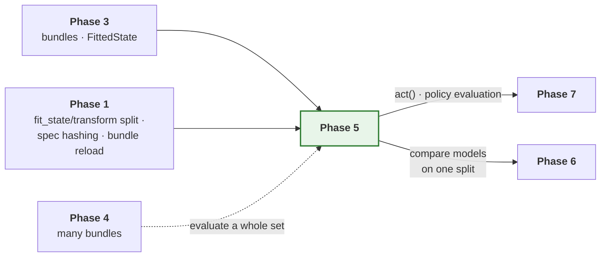

# Phase 5 — Evaluate, infer, tune

**The other three pipelines, completing the model lifecycle.**

| | |
| --- | --- |
| **Depends on** | Phase 3 |
| **Blocks** | Phase 7 |
| **Delivers** | `pipelines.evaluate`, `pipelines.infer`, `pipelines.tune`, `engines.torch.predictor`, `metrics.drift`, evaluation and tuning visuals, flagship overrides for all three |
| **Can run in parallel with** | Phases 4 and 6 |

---

## 1. Purpose

Phase 2 and 3 can train a model and save it. This phase makes a saved model
*useful*: scored on held-out data, searched over hyper-parameters, and served
in production with provenance.

Stage sequences for all three are in
[`ARCHITECTURE.md` §5](../ARCHITECTURE.md#5-stage-contracts-and-the-train-pipeline).

### 1.1 What this phase is really testing

Training is the easy half. A training run owns its data from end to end: it
reads the raw inputs, decides the split, fits the scalers and uses them
immediately. Nothing can get out of step because nothing is ever separated.

Everything in this phase breaks that. A bundle is loaded in a different
process, weeks later, possibly on a different machine, and asked to produce
numbers that are comparable to the ones it produced at training time. The
model's weights are the easy part — they are bytes on disk. The hard part is
everything *around* the weights: the same split, the same scalers, the same
column order, the same units.

Each of those has the same failure signature, and it is the worst one
available: **the run completes and the numbers are wrong.** A re-scored model
with a re-derived split reports a plausible metric. A production prediction
made with a re-fitted scaler is a plausible number. Nothing raises, nothing
logs, and the error is discovered — if ever — by someone noticing that
yesterday's number does not match today's.

So the phase is not really about three pipelines. It is about one invariant,
stated three ways:

> A saved model, re-loaded, must see its inputs exactly as it saw them during
> training — and when it cannot, it must refuse rather than approximate.

---

## 2. What is built

| Module | Delivers |
| --- | --- |
| `storage.bundle` (extended) | `load_spec`, and resolving a bundle's fitted-state type from its manifest |
| `sources.dataset.rebuild` | Rebuild a dataset from a bundle: re-read raw, apply the *saved* state, apply the *saved* split. Never fits, never splits |
| `orchestration.pipelines.evaluate` | Load bundle, rebuild source from lineage, predict, invert, score, report |
| `orchestration.pipelines.infer` | Load bundle, prepare inputs, predict, invert, emit with provenance |
| `orchestration.pipelines.tune` | Propose trials against one data build, score, select, optionally refit |
| `core.spec.tune` | `TuneSpec`, the search space, and validated trial overrides |
| `engines.torch.predictor` | Batched inference, including the precompute path |
| `analysis.metrics.drift` | Baseline-versus-live distribution distance |
| `analysis.visuals.evaluation` | Predicted versus actual, residuals, error by bucket, baseline comparison |
| `analysis.visuals.tuning` | Trial history, parameter importance, parallel coordinates |
| `models/hybrid_gnn_rnn/pipelines/{eval,tune}.py` | Flagship overrides. No `infer.py`: see §8.3 |
| `orchestration.pipelines.resolve` | Reads a model's override declaration. See §8.6 |
| `api` (extended) | `evaluate`, `infer`, `tune` |

---

## 3. Key decisions

### 3.1 Metrics are always in original target units

`invert_targets` is a required stage in both evaluate and infer, placed before
`analysis.metrics` is reached. A mean absolute error in standardised space is
not a quantity anyone can act on, and the inversion is available because
`FittedState.inverse_transform_targets` was made abstract in Phase 1 rather
than optional.

### 3.2 A source is rebuilt from lineage, and three things are never redone

This is the decision the whole phase turns on. `DataModule.build` does five
things in order:

```text
load  →  split  →  fit_state  →  transform  →  signature
```

A rebuild does **three** of them, and the two it skips are the two that would
silently invalidate the comparison:

```text
load  →  [split: READ FROM LINEAGE]  →  [fit_state: READ FROM BUNDLE]  →  transform  →  signature
```

*Why not re-split.* Re-deriving means a change to split logic silently
re-scores an old model against different data, and the comparison to its
original metrics becomes meaningless without anybody noticing. Worse, a
chronological split re-derived against a *longer* history moves the
boundaries, so the old model is now scored on rows it was trained on — and
scores beautifully.

*Why not re-fit.* The classic production failure. A scaler re-fitted on live
data standardises today's inputs by today's mean, while the model learned a
response to inputs standardised by the training mean. The model sees inputs on
a scale it has never encountered, and produces confident nonsense. Phase 1
made this avoidable by separating `fit_state` from `transform`; this phase is
where that separation earns its keep.

The rebuild verifies the fingerprint it was given against the one in the
lineage, and says so when they differ. A changed source is not necessarily an
error — re-scoring last month's model on this month's data is a legitimate
thing to want — but it must be a decision rather than an accident.

### 3.3 The data build happens once per search

Forty trials over the same dataset build it once. This is where an unstable
spec hash would cost most: a hash that varies across processes turns every
reuse into a miss, and the search spends its time rebuilding data instead of
training.

The outline specified a general step cache for this. It is delivered as an
in-memory reuse instead; see §8.1 for why, and for what is given up.

### 3.4 Trial overrides are typed and validated

Defect 7: `rade_ml_pt`'s `TunePipeline._resolve_trial_training_config` passed
`learning_rate` and `batch_size` into `dataclasses.replace(TrainingConfig)`,
raising `TypeError`. It was latent only because the hybrid model overrode the
method. Trial overrides here go through the same validated merge as job-set
overrides, so an unknown field fails at trial construction.

That is a stronger statement than it looks. A search proposes values for
*named* parameters, and the names come from a configuration file written by
hand. A typo in one of them has two possible behaviours: the search explores a
parameter that does not exist and reports that it makes no difference, or it
fails. Only the second is useful.

### 3.5 Unseen entities are a declared capability

The flagship can predict for target instruments absent from training, by
transferring from their nearest neighbours in the learned output space. That is
the `Inductive` capability, declared by the model. A model that does not
declare it gets a clear error rather than a plausible-looking prediction for an
instrument it has never seen.

### 3.6 A bundle is not self-describing, and should not pretend to be

Loading a bundle requires the model's package to be importable. The manifest
records a model *name*; turning that into a class, and into the fitted-state
type needed to read `fitted_state/`, goes through the registry.

This is the same constraint Phase 4 hit as defect 12, arriving from a
different direction, and it is not worth engineering away. The weights are
meaningless without the architecture that interprets them, so a process that
can load a bundle usefully is a process that has the model code anyway. What
*is* worth engineering is the error: "no model named 'hybrid_gnn_rnn'" from a
bundle directory should say that the bundle names a model this process has not
imported, not merely that a registry lookup missed.

### 3.7 Evaluate and infer differ in one thing: whether targets exist

They are otherwise the same pipeline. Evaluate has targets, so it can score;
infer does not, so it emits. Keeping them separate rather than giving evaluate
a `score: bool` is deliberate — the two have different outputs, different
failure modes and different audiences, and a flag would mean every stage
downstream of it carries an `if`.

What they share is the reload path, and that is shared as a *module* rather
than a base class: `sources.dataset.rebuild` plus the bundle loaders. Two
pipelines calling the same functions stay in step; two pipelines inheriting
from a common base diverge the first time one of them needs a stage the other
does not.

---

## 4. How this links to the rest of the framework



### 4.1 The layering constraint

`orchestration` may not import `models`. All three pipelines
resolve their model through the registry, exactly as `TrainPipeline` does, so
none of them knows what a flagship is.

`sources.dataset.rebuild` lives in `sources` and so may import only `core`.
That is the right home: rebuilding is a property of how a dataset was built,
and the module that built it is the module that knows how to rebuild it.

---

## 5. Tests

| Test | Asserts |
| --- | --- |
| `test_metrics_are_in_original_target_units` | A scaled target reports metrics on the original scale |
| `test_rebuild_uses_the_saved_split` | Changed split settings do not change an old bundle's split |
| `test_rebuild_does_not_refit_the_state` | Changed data does not change the scaler the model sees |
| `test_rebuild_reports_a_changed_fingerprint` | A different source is surfaced, not silently accepted |
| `test_evaluate_reproduces_training_metrics` | Re-scoring the training run's test split gives the same numbers |
| `test_data_build_is_reused_across_trials` | Built once for forty trials, verified by call count |
| `test_unknown_trial_override_fails_at_construction` | Defect 7 |
| `test_best_trial_selection_is_deterministic` | Fixed seed, same winner |
| `test_a_failed_trial_does_not_end_the_search` | Recorded with its reason, as with job sets |
| `test_an_inductive_model_is_allowed_through` | Declaring the capability routes rather than refuses |
| `test_an_unseen_entity_is_refused` | A clear error, not a plausible number |
| `test_precompute_matches_plain_path` | Identical results, lower cost |
| `test_predictions_carry_provenance` | Bundle version, spec hash, timestamp |
| `test_drift_of_identical_distributions_is_zero` | The degenerate case |

---

## 6. Definition of done

Beyond the universal criteria in
[`IMPLEMENTATION.md` §5](../IMPLEMENTATION.md#5-definition-of-done--every-phase):

- [x] All three pipelines complete, with the flagship's overrides — and
      reachable, which they were not. See §8.6.
- [x] Metrics always in original target units, verified with a scaled target.
- [x] Sources rebuilt from saved lineage; splits never re-derived and states
      never re-fitted, each with a test that fails against the naive version.
- [x] Re-evaluating a bundle reproduces its recorded metrics exactly.
- [x] Data built once per search, verified by call count.
- [x] Trial overrides typed and validated; defect 7 has a failing test against
      the old behaviour.
- [x] A failed trial is recorded and surfaced, not swallowed.
- [x] `Inductive` gate admits declaring models and refuses the rest clearly.
      The mechanism is deferred rather than faked — see §8.3.
- [x] Precompute path numerically identical to the plain path.
- [x] Predictions carry bundle version, spec hash and timestamp.
- [x] `examples/rade_qnet/phase5_evaluate_and_tune.py` evaluates a bundle, runs a
      small search and prints the best trial.

---

## 7. Risks

| Risk | Why it matters | Mitigation |
| --- | --- | --- |
| Re-evaluation does not reproduce training metrics | Either lineage is incomplete or training metrics were computed differently | A dedicated test; a discrepancy is a Phase 2 or 3 finding, not a Phase 5 workaround |
| A rebuild silently re-fits or re-splits | The two quiet failures this phase exists to prevent | Rebuild never calls `fit_state` or `split`; tests assert that changing each has no effect on a reloaded bundle |
| Reuse returns a stale build | A search optimises against the wrong data | Reuse is keyed on the data spec digest and the source fingerprint; a test asserts a changed source is not reused |
| Tuning hides a failing trial | A search reports a best trial from a partially broken sweep | Failed trials recorded with reasons and surfaced in the summary, as with job sets |
| Inference drifts from training preprocessing | The classic production failure | Inference uses the bundle's `FittedState`, never a re-fitted transform. Asserted by test |

---

## 8. Deviations

### 8.1 No general step cache; tuning reuses one build in memory

The outline specified a step cache in `core/runtime/cache.py`, keyed on the
spec hash and consulted by `Pipeline.step`, so that `build_data` is computed
once across a search.

Building it as specified means answering, for *every* stage, two questions
that only have good answers for one of them: how is this stage's output
serialised, and when is it invalid? A stage returning a dataset has an answer.
A stage returning a materialised Torch module, a prepared hardware handle or a
live engine handle does not — and a cache that silently declines to cache most
stages is a cache whose behaviour nobody can predict from reading the code.

There is also a correctness trap. A general cache keyed on "the spec hash"
must decide *which* spec. `build_data` depends on the source spec; `fit`
depends on nearly everything. Key too narrowly and a cache hit returns the
wrong thing; key on the whole run spec and a tuning search — which changes the
run spec on every trial — never hits at all, which is precisely the case the
cache was requested for.

So the requirement is met directly instead. `TunePipeline` builds the dataset
once and holds it for the search, passing the same `PreparedDataset` to every
trial. Across processes, the existing `DatasetCache` (Phase 1, keyed on source
spec digest plus source fingerprint plus framework version) already covers
reuse, and it is keyed on exactly the right things because it was built for
exactly this.

**What is given up.** No reuse of any stage other than the data build, and no
reuse of a data build across two separate searches in one process that do not
share a `TunePipeline`. Both are acceptable: the data build is the expensive
stage, and the second case is covered by `DatasetCache` the moment caching is
enabled. If a later phase finds a second stage worth caching, a targeted cache
for that stage will be easier to reason about than a general one.

### 8.2 `storage.bundle` could not load two of the things it writes

A bundle contains `spec.json` and `fitted_state/`. Phase 1 wrote both and
provided a loader for neither: there is no `load_spec`, and
`load_fitted_state` requires the caller to pass the concrete state type, which
is not recorded anywhere on disk.

That was invisible for four phases because nothing re-loaded a bundle. Both
are added here. The state type is resolved through the model definition named
in the manifest, which is the only place that knows it.

### 8.3 `Inductive` declares a capability but not a mechanism

`Inductive.supports_unseen_entities() -> bool` says whether a model *can*
predict for an unseen entity. It does not say how to ask it to. The
inference pipeline can therefore refuse correctly and can only succeed by
accident, because it has no interface to pass unseen entities through.

A `resolve_unseen` hook was written during this phase to close that, and then
removed before it shipped. The reason is worth recording, because the
reasoning applies to any capability protocol:

An entity absent from training is also absent from the **fitted state** that
a reloaded model applies. For the flagship that means no graph node, no entry
in `target_indices`, and no row in the encoded attribute table — all three
come from the saved `HybridState`, not from the inference source. A hook
handed only the unseen identifiers and the existing static tensors has
nothing to build the missing rows *from*. The signature that would work has
to carry the new entity's raw attributes, and settling what those look like
is the universe-handling problem, not an inference problem.

So the honest position for Phase 5 is: the declaration is real and load-
bearing, the mechanism is not yet designable, and shipping a protocol method
that nothing calls and nothing implements is worse than its absence because
it reads as a supported path. The declaration alone already pays for itself —
it is what lets the pipeline refuse a transductive model rather than hand
back a default embedding.

The alternative considered was putting the mechanism in the flagship's infer
override with the framework knowing nothing about it. That was rejected for
the original reason: it would make "unseen entity" a flagship feature rather
than a framework capability, and the next model with the same property would
invent its own interface. The point stands; it just does not force a protocol
method to exist before the signature is known.

### 8.4 `TuneSpec` was in no phase's module table

`ARCHITECTURE.md` §12 shows `api.tune("configs/hybrid_tune.yaml")`, and the
Phase 1 charter for `core/spec` lists no tuning spec. A search needs a
declared search space, a trial budget, an objective and a direction, and none
of those fit in a run spec.

It is added as `core.spec.tune`, following the job-set precedent: a shared
base configuration plus per-trial overrides merged as raw mappings before
validation, for the reasons in Phase 4 §3.1.

### 8.5 "Reproduces exactly" inherits Phase 4's preconditions

The gate says re-evaluating a bundle reproduces its recorded metrics exactly.
Phase 4 established that on this hardware two things break exactness
independently of anything the framework does: an unpinned thread budget
changes the order a reduction accumulates in, and MPS is non-deterministic
even against itself.

Re-evaluation is a weaker case than Phase 4's gate — the weights are fixed and
loaded from disk, so there is no optimiser accumulating differences, only a
forward pass. But it is the same arithmetic, so the same preconditions apply,
and the test pins both for the same reasons documented in
[Phase 4 §8.1](PHASE_4_JOB_SETS.md).

### 8.6 Model pipeline overrides had no reader

The largest finding of the phase, and it was not a Phase 5 defect. It was
found here only because this phase added three more instances of it.

A model declares its overrides on its framework definition:

```python
class HybridGnnRnnModel:
    pipelines = MappingProxyType({"train": HybridTrainPipeline})
```

Nothing in the framework read that mapping. `api.train`, `api.evaluate`,
`api.infer`, `api.tune` and the portfolio job runner all instantiated the
framework's own pipeline unconditionally. Every override was reachable only
by importing the subclass and constructing it by hand — which is exactly what
the Phase 3 and Phase 4 examples do, so the overrides worked, were tested, and
were nevertheless dead through every documented entry point.

This is the worst shape a defect can take. The feature exists. Its tests pass.
A user following the documentation gets the base pipeline, no error, and a
flagship model quietly missing its graph diagnostics.

`orchestration.pipelines.resolve.pipeline_for` is the reader, and it is
deliberately one function so there is one place the lookup can be wrong. It
refuses two things the declaration alone could not: an override that is not a
subclass of the pipeline it replaces — because `api.evaluate` promised its
caller an `EvaluationResult`, and a model has no standing to break that — and
an override declared under a key no lifecycle reads, which would otherwise
present as the override simply not running.

Connecting it immediately paid for itself twice. The flagship's new eval
override called `collect_targets` with the wrong arity, and then compared a
scaled forward pass against inverted targets — a per-target error an order of
magnitude too large, which reads as a broken model rather than a broken
comparison. Both were invisible while nothing ran the override. There is now a
test asserting that the mean of the per-target errors equals the pooled metric,
which is the invariant that catches a scale mismatch in general.

### 8.7 `TrainingResult` did not say where the model went

`api.train` returned metrics and no path. Training something and then
evaluating it — the headline Phase 5 workflow — therefore required
reconstructing a bundle directory from the run id, the model name and the
version, which is three things to get wrong and a private layout to depend on.

`TrainingResult.bundle_directory` is stamped after the persist stage rather
than before it, because until the bundle is written there is no directory to
name, and a result claiming a location before anything was saved there would
be wrong in the one case — a failed write — where it is read most carefully.

### 8.8 The record

| Date | Deviation | Reason |
| --- | --- | --- |
| Phase 5 | General step cache replaced by in-memory reuse in tune | §8.1 |
| Phase 5 | `load_spec` and state-type resolution added to `storage.bundle` | §8.2 |
| Phase 5 | `Inductive` stays declaration-only; the mechanism is deferred | §8.3 |
| Phase 5 | `core.spec.tune` added, having been in no phase | §8.4 |
| Phase 5 | Exactness gate inherits Phase 4's pinning preconditions | §8.5 |
| Phase 5 | `orchestration.pipelines.resolve` added; model overrides were dead | §8.6 |
| Phase 5 | `TrainingResult` gains `bundle_directory` | §8.7 |
