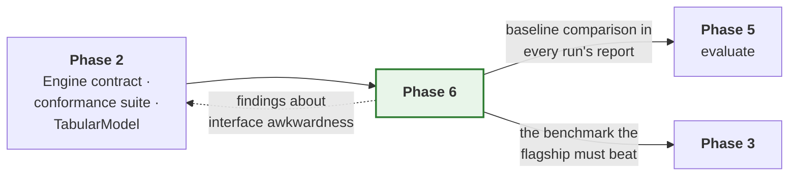
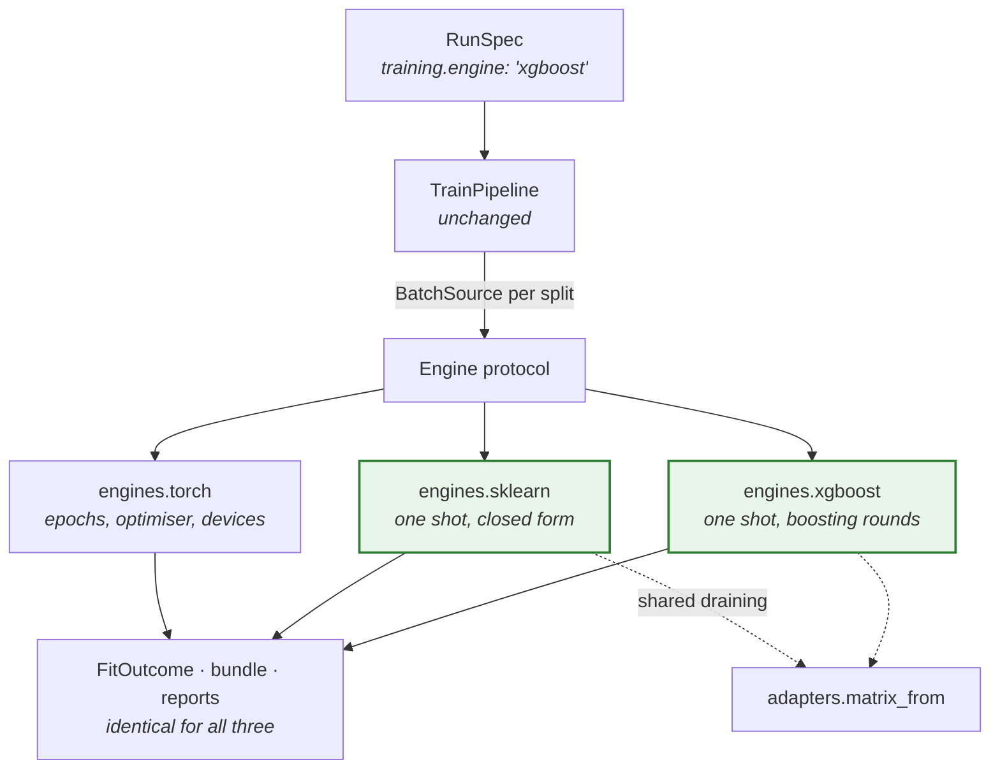

# Phase 6 — More engines

**Prove the engine contract is genuinely library-agnostic, and prove simple
models stay simple.**

| | |
| --- | --- |
| **Depends on** | Phase 2 |
| **Blocks** | — |
| **Delivers** | `engines.sklearn`, `engines.xgboost`, the reference models, baseline comparison in reports |
| **Can run in parallel with** | Phases 4 and 5 |

---

## 1. Purpose

This phase is a test of the architecture dressed as a feature.

Two claims have been made repeatedly and neither has been checked. **That the
engine interface is library-agnostic** — if it only accommodates a model that
trains over epochs, it is a PyTorch interface with a generic name. **That
simple models stay cheap** — if a ridge regression needs more than one short
file, an abstraction above it has grown teeth, and users will work around the
framework rather than with it.

There is a second payoff. Every headline metric needs a reference point. A
graph-temporal network that cannot beat a ridge regression on the same split
has not earned its complexity, and the only way to know is to run both through
the same lifecycle on the same data.

### 1.1 What this phase is really testing

The previous five phases all added capability. This one adds almost none. Both
engines wrap libraries that already work, and all three baselines are models
anybody could write in twenty lines of NumPy. If the phase were measured by
what a user can newly do, it would barely register.

What it measures instead is whether the abstractions are *true*. Every phase
so far had exactly one engine, so every claim about the engine interface was
untested by construction: an interface with one implementation is not an
interface, it is a spelling of that implementation. The same is true of
`PredictorDefinition` and `TabularModel`, which have had precisely one real
consumer — a model with a graph, a recurrent stream, custom reports and a
bespoke data build. Nothing has yet asked whether the framework is pleasant
for a model with none of those things.

XGBoost is the harder of the two tests, because trees fit in a single call
with no loop at all. There is no epoch, no optimiser, no step, no device.
Almost every concept the Torch engine introduced is absent. If a one-shot fit
can satisfy the same contract and produce the same bundle, the same metrics
and the same reports as a neural network, the contract is real.

So the phase has one question behind it, stated as a bet:

> Adding a second and third engine should require **no change to any
> pipeline**. Every change forced above the `engines` package is a defect in
> the Phase 2 abstraction, and is recorded in §8 rather than absorbed.

That bet is deliberately falsifiable, and §8 already records one way it was
lost before the phase began: see §8.1.

---

## 2. What is built

| Module | Delivers |
| --- | --- |
| `engines.sklearn.engine` | Any `fit`/`predict` estimator, `joblib` persistence, one-shot capabilities |
| `engines.sklearn.adapters` | Draining a `BatchSource` into a feature matrix, once, in one place |
| `engines.xgboost.engine` | `DMatrix` materialisation, native early stopping, JSON persistence |
| `models.ridge` | Ridge regression on flattened features |
| `models.xgb_tabular` | Gradient-boosted trees on tabular features |
| `models.lstm_tabular` | Recurrent network with no graph component |
| `analysis.reports.baselines` | Baseline comparison in a run's report |
| `core.spec.training` (extended) | `SklearnTrainingSpec`, `XgboostTrainingSpec` |

Retired rather than built: `core.contract.data.ArrayData` and
`EngineCapabilities.payload`. See §3.1 and §8.1.

---

## 3. Key decisions

### 3.1 One-shot engines consume `BatchSource`, and `ArrayData` is retired

This is the central decision of the phase and it reverses a Phase 1 one.

`core.contract.data` defines `ArrayData` — a feature matrix and a target, the
whole split at once — and `EngineCapabilities.payload` declares which of the
two payloads an engine wants. The docstrings are explicit about the intent:
*"Tree and linear models want the whole split at once, not a stream of
batches. Giving them their own payload type means the XGBoost engine does not
have to pretend to iterate."*

The design was reasonable and the need did not materialise, for a reason that
only became visible once there was something to check it against:

**The data layer is already library-agnostic.** `sources/` imports no training
library at all — batches are plain NumPy dictionaries. The payload split was
anticipating a mismatch between a tensor stream and an array consumer, and
there is no mismatch to bridge. A tree engine draining a `BatchSource` gets
NumPy arrays and concatenates them. That is one copy, and XGBoost immediately
makes another when it builds its `DMatrix`, so the copy the payload split
exists to avoid is absorbed into a copy that was happening anyway.

Against that, the cost of keeping it is concrete and large. Nothing in the
framework reads `capabilities().payload` today, and `source_for` refuses
`ArrayData` outright with *"neither TensorBatchData nor a BatchSource"*. To
make the array path live, **every** consumer would need an array branch:
`source_for`, `scoring_source`, `collect_targets`, `score_splits`, the train
pipeline's fit stage, the evaluate pipeline, the infer pipeline. That is the
first risk in this phase's own table — *tree engines get a parallel pipeline,
the lifecycle forks, and the claim of one lifecycle becomes false* — reached
not by accident but by following the design.

So: one payload type, one `source_for`, one scoring function, one evaluate
path. The engines drain, and `ArrayData` and `payload` are deleted rather than
left as declarations nothing reads. Phase 5 §8.6 is the argument for deleting
them: a declaration with no reader is worse than its absence, because it reads
as a supported path.

The draining itself lives in `engines.sklearn.adapters` and is imported by the
XGBoost engine, so there is one implementation of "turn a source into a
matrix" rather than two that can disagree about row order.

### 3.2 A boosting round is an epoch

`FitOutcome` carries a history of `EpochRecord`. A tree engine has no epochs,
but it does have boosting rounds, and the two are the same thing for every
purpose the framework has: a unit of progress with a training loss, optionally
a validation loss, and an index that can be plotted.

So the XGBoost engine reports one `EpochRecord` per boosting round, and
`analysis.visuals` renders a boosting curve with no knowledge that it is one.
The sklearn engine reports exactly one record, because a closed-form fit has
one unit of progress and reporting zero would make `best_epoch` meaningless.

What the engine must **not** do is report epochs it did not have. Declaring
`supports_epochs=False` while returning a ten-record history would make the
capability a lie, and the conformance suite would not catch it because it
checks the shape of the outcome rather than its honesty. The relationship is
pinned by a test instead: an engine declaring no epoch support returns at most
one record.

### 3.3 Native facilities are translated, never reimplemented

XGBoost's early stopping operates per boosting round *inside* the library,
with access to state the framework cannot see. Anything layered on top would
be strictly worse and would also fight the library's own. The engine's job is
to translate the framework's spec into the library's arguments and the
library's output back into a `FitOutcome`.

The same applies to persistence. XGBoost's JSON format and scikit-learn's
`joblib` are used as-is, with the framework's manifest alongside rather than
instead. This is not merely convenient: a bundle whose weights are in the
library's own documented format can be read by someone who does not have this
framework, which is a property worth having when a model outlives its platform.

One consequence is worth stating plainly, because it looks like a violation of
the Phase 2 rule against pickling. `joblib` *is* a pickle, and the Phase 2
engine contract says implementations must write a parameter payload rather
than a pickled model object. The rule was written against a specific failure —
`torch.load(weights_only=False)` on a whole `nn.Module`, which made every
saved model refactor-fragile and made loading one equivalent to executing it.
Scikit-learn has no state-dict equivalent and `joblib` is its documented
format, so there is no alternative that is not a worse reimplementation. The
deviation is recorded in §8 rather than hidden, and the engine refuses to load
a payload whose estimator class does not match the model it was handed — which
recovers the half of the rule that was about silent mismatch.

### 3.4 An absent capability is refused, not ignored

A tree engine cannot clip gradients, use mixed precision, or shard across
devices. Three ways to handle a spec that asks for one:

1. Accept and ignore it.
2. Accept and warn.
3. Refuse.

The engine refuses, and it refuses in `prepare` — before the data build's work
is committed to and well before the fit. A silently ignored setting is the
worst of the three because the run completes, the number is plausible, and the
user believes a thing about their model that is not true. A warning is better
and still bad: warnings are read once and then filtered.

The exception, already in the Phase 2 contract, is a merely *absent* device. A
requested GPU that is not present degrades to the CPU with a warning rather
than failing, because the run would otherwise have succeeded and the user's
intent is served by running. The distinction is between "cannot" and "this
machine happens not to" — a tree engine asked for gradient clipping is being
asked for something that does not exist for it at all.

### 3.5 The line budget is a test, not an aspiration

Each baseline is one file with registration inside `model.py`, under **fifty
lines of code** excluding docstrings and comments.

Stating it in prose would make it a hope. It is asserted by
`test_each_baseline_is_under_the_line_budget`, which counts statements rather
than lines so that the framework's own documentation standard — which is
demanding, and deliberately so — is not what breaks the budget.

If a baseline exceeds it, **the finding is about the framework and is recorded
in §8**. The temptation will be to raise the number, and the number is only
informative if it is treated as a real constraint. This is the single clearest
signal available about whether `rade_qnet` is pleasant for a model that is not
the flagship, and the flagship is a bad judge of that: it is complex enough
that framework overhead disappears into it.

### 3.6 `lstm_tabular` is a measurement, not a model

Of the three baselines it is the only one nobody would deploy, and it is the
most informative. It is the flagship with the graph removed and nothing else
changed: same engine, same data build, same sequence handling, same loss.

The gap between the two is therefore an estimate of what the graph
contributes. That number has never been measured. It is being assumed every
time the graph is maintained, debugged, or explained to somebody, and if it is
small then a great deal of complexity is being carried for nothing.

It belongs in this phase rather than in Phase 3 because it only means anything
alongside the other two: a graph that beats an LSTM but loses to a ridge
regression is telling a different story than one that beats both.

### 3.7 XGBoost is an optional dependency

It is not installed in the base environment and must not become required.
`engines.xgboost` imports it at module import, which is correct — a host that
never trains trees never imports the module — and the registration pattern
from Phase 3 applies unchanged: importing the engine package is what registers
it.

The tests for it are marked and skipped when the library is absent, in the
same shape as Phase 2's distributed tests, so that a contributor without
XGBoost sees a skip rather than a failure and the suite stays green on a
minimal install.

### 3.8 Baselines are compared, not ranked

`analysis.reports.baselines` renders a comparison table. It does not declare a
winner, and the example prints metrics side by side rather than a verdict.

Picking a winner needs a metric, a split and a tolerance, and all three are
the user's judgement. A report that announced "ridge wins" on a difference of
0.0001 on a 400-row fixture would be worse than no report, because it would be
believed.

---

## 4. How this links to the rest of the framework

The dashed arrow is the point of the phase. Awkwardness discovered here is a
Phase 2 fix, applied before more weight is put on the interface.

What each new engine must satisfy, and where it comes from:

---

## 5. Tests

| Test | Asserts |
| --- | --- |
| `test_one_shot_engine_satisfies_the_contract` | The shared conformance suite, unmodified, against both engines |
| `test_draining_preserves_source_order` | The matrix rows are the source's rows, which every attribution depends on |
| `test_draining_refuses_an_unbounded_source` | A one-shot fit over an infinite stream has no end |
| `test_boosting_history_reported_as_fit_outcome` | Same `EpochRecord` contract as a neural network |
| `test_an_engine_without_epochs_reports_at_most_one_record` | The capability and the history agree — §3.2 |
| `test_native_early_stopping_selects_best_round` | Against a synthetic sequence with a known minimum |
| `test_unsupported_setting_is_rejected_not_ignored` | Gradient clipping on a tree engine raises in `prepare` |
| `test_an_absent_device_still_degrades_rather_than_failing` | The "cannot" versus "happens not to" distinction holds |
| `test_persisted_model_reloads_and_predicts_identically` | Both engines, bit for bit |
| `test_loading_a_mismatched_estimator_is_refused` | Recovers the half of the no-pickling rule that mattered |
| `test_each_baseline_is_under_the_line_budget` | The simplicity constraint, as a test — §3.5 |
| `test_baselines_train_through_the_full_lifecycle` | Bundles, metrics and reports, same as the flagship |
| `test_baselines_evaluate_and_infer_from_their_bundles` | Phase 5's pipelines work for one-shot engines too |
| `test_baselines_run_in_a_job_set` | Fan-out works for simple models |
| `test_a_baseline_is_tunable` | A search over `alpha` or `max_depth`, end to end |
| `test_no_pipeline_branches_on_engine_name` | The bet in §1.1, as an AST check over `orchestration` |
| `test_flagship_beats_baselines_on_the_fixture` | On the Phase 0 data. Marked, informational — a failure is a finding, not a broken build |

The last test is deliberately not a hard gate. On a tiny fixture a ridge
regression may legitimately win, and a test that fails for a correct reason
gets disabled. It reports rather than blocks.

`test_no_pipeline_branches_on_engine_name` is the one most worth reading. It
walks the `orchestration` package's syntax tree looking for comparisons
against engine names, in the same shape as the Phase 1 dependency test. It is
the only test here that can fail for the right reason and still mean the phase
succeeded — but it should fail loudly, because a pipeline that knows what
`"xgboost"` means is the exact failure this phase exists to detect.

---

## 6. Definition of done

Beyond the universal criteria in
[`IMPLEMENTATION.md` §5](../IMPLEMENTATION.md#5-definition-of-done--every-phase):

- [x] Both engines pass the shared conformance suite unmodified.
- [x] XGBoost reports boosting history through `FitOutcome`; sklearn reports
      one record and declares no epoch support.
- [x] Unsupported settings are rejected in `prepare`, never silently ignored.
- [x] Both engines' persisted models reload and predict identically, and a
      mismatched payload is refused.
- [x] All three baselines within the line budget, with registration in
      `model.py`.
- [x] Baselines get the full lifecycle: bundles, metrics, reports, job sets,
      evaluate, infer and tune.
- [x] Baseline comparison appears in a run's report.
- [x] No pipeline branches on engine name or type, verified by an AST test.
- [x] `ArrayData` and `EngineCapabilities.payload` retired, with
      `ARCHITECTURE.md` updated.
- [x] XGBoost tests skip cleanly when the library is absent.
- [x] Any interface awkwardness recorded in §8 and fixed in Phase 2.
- [x] `examples/rade_qnet/phase6_compare_models.py` trains the flagship and all
      three baselines on one split and prints a comparison table. The result
      is a finding rather than a demonstration — see §8.6.

---

## 7. Risks

| Risk | Why it matters | Mitigation |
| --- | --- | --- |
| The engine contract needs changing for a one-shot fit | A Phase 2 abstraction was wrong | That is the phase working. Fix Phase 2, re-run its tests, record it in §8 |
| A baseline exceeds its budget | The framework is not actually cheap for simple models | Treat it as a framework defect, not an acceptable cost. Do not raise the number |
| Tree engines get a parallel pipeline | The lifecycle forks and the claim of one lifecycle becomes false | One payload type (§3.1); declare absent capabilities; the AST test in §5 |
| `TabularModel`'s default split is wrong for trees | Silent leakage in a model nobody scrutinises because it is "just a baseline" | Baselines go through the same conformance suite, including the leakage checks |
| `joblib` reintroduces the pickling problem | A saved model becomes refactor-fragile and unsafe to load | Refuse a payload whose estimator class does not match; record the deviation (§3.3) |
| XGBoost becomes a hard dependency by accident | A host that trains no trees pays for the import | Import inside the engine package only; marked, skipping tests |
| The baseline comparison is read as a ranking | A 0.0001 difference on a 400-row fixture gets believed | Report side by side, declare no winner (§3.8) |

---

## 8. Deviations and findings

Interface awkwardness discovered in this phase is recorded here, because it is
a verdict on Phase 2 and the next reader needs to know what was changed and
why.

### 8.1 `ArrayData` and `EngineCapabilities.payload` are retired

Recorded before the phase began, because the finding is what settled §3.1.

Phase 1 built a second engine payload type for one-shot engines, and a
capability flag to route on it. Neither has a reader. `EngineCapabilities`
documents that *"the pipeline checks this against what the data build
produced"* and no pipeline does; `source_for` refuses `ArrayData` with a
message about gradient engines.

The reason the need did not materialise is in §3.1: the data layer turned out
to be library-agnostic already, so there is no tensor-to-array mismatch to
bridge. Making the path live would require an array branch in seven places and
would fork the lifecycle, which is this phase's own top risk.

This is the same defect class as Phase 5 §8.6 — a declaration nothing reads —
and it gets the same treatment, for the same reason. A reader of
`EngineCapabilities` today will reasonably conclude that writing an engine
with `payload="arrays"` is supported, and it is not.

### 8.2 Two OpenMP runtimes deadlock, and import order decides it

**The symptom.** A process that imports `xgboost` before `torch` hangs
forever on the first Torch operation that opens a parallel region. No error,
no traceback, no log line. It looks like a slow machine.

**The cause.** On macOS the Homebrew `libomp` that the XGBoost wheel links
against and the `libomp` the PyTorch wheel bundles are two different *images*
of the same library, loaded at different addresses. Sampling the hung process
shows the main thread in `__kmp_join_barrier` inside one image while the
worker threads sit in `__kmp_fork_barrier` inside the other. Each runtime is
waiting for threads that belong to the other one.

Whichever image loads first owns the process. Import order decides it and
*only* import order does — call order is irrelevant, and the libraries can be
used in either sequence once both are loaded correctly.

**How it was found.** `tests/rade_qnet/models` hung. Each test passed
in about three seconds alone. Bisecting the order gave it away: the engine
suites run `sklearn`, `torch`, `xgboost` alphabetically and had been passing
for exactly that reason, while the baselines run ridge, then trees, then the
network.

**The resolution.** `rade_qnet/engines/xgboost/__init__.py` imports Torch
before XGBoost when Torch is installed, guarded by `find_spec` so nothing is
imported that is not already present.

**Why the framework absorbs this rather than documenting it.** It is an
upstream packaging conflict and not a design defect, and there is a real
argument for leaving it alone. It was absorbed anyway, on three grounds. The
failure mode is a silent hang, which is the worst kind. Diagnosing it
requires sampling a process and recognising two `libomp` images, which is not
a reasonable thing to ask. And it fires in precisely the workflow this phase
exists to enable: comparing a tree against a network in one process.

Rejected alternatives: `KMP_DUPLICATE_LIB_OK=TRUE` does not fix it, verified.
`OMP_NUM_THREADS=1` does, by removing the thread pool rather than the
conflict, at a cost to every run on the host.

Pinned by `TestTheOpenMpWorkaround`, because an import with no visible
reference is indistinguishable from a mistake to a linter or a reviewer.

### 8.3 Column names could not survive both engines

`_feature_names` originally returned names only when every input happened to
be one column wide, which meant the common case — a single wide feature block
— was never named at all, and the coefficient table it exists for was always
empty.

Fixing it to emit `features_0`, `features_1` and so on surfaced a second
constraint immediately: the first attempt used bracket subscripts, and
XGBoost rejects `[`, `]` and `<` in feature names outright. Both engines
share these adapters, so a scheme one of them refuses is not a scheme. The
underscore form is the one that works everywhere.

Worth noting as a pattern rather than as an incident: the shared adapter is
the right design, and it means a convention has to clear the *union* of two
libraries' restrictions rather than either one's.

### 8.4 Test isolation was a snapshot, not an isolation

`isolated_registries()` snapshotted the registries and restored them on exit,
which restores *state* but does not give a test a clean slate. Several
support fixtures register a stand-in engine under the name `"sklearn"`,
chosen because `TrainingSpec` is a discriminated union over the engines the
framework ships and a test cannot invent a fourth tag.

That worked only while no real `sklearn` engine existed. The moment Phase 6
shipped one, 167 tests failed — but only when a suite that imports the real
engine happened to run first. The engine suites run `sklearn`, `torch`,
`xgboost` alphabetically and the baselines run trees before networks, so the
same tests passed or failed depending on which directory pytest reached
first.

`isolated_registries(empty=True)` now clears models and engines on entry.
Reports and learners are deliberately left alone: those are catalogues the
pipeline renders from rather than names a specification claims, and emptying
them changes what the pipeline does instead of isolating it. That distinction
cost two further failures before it was drawn correctly.

### 8.6 The Phase 0 fixture cannot discriminate between models

This is the phase's most useful finding and it is not about an engine.

`examples/rade_qnet/phase6_compare_models.py` runs all four models on the
golden fixture. Mean absolute error on the held-out split, on the same
target, in the same units:

| Model | Engine | Test MAE |
| --- | --- | --- |
| `ridge` | sklearn | 0.0013 |
| `lstm_tabular` | torch | 0.0055 |
| `xgb_tabular` | xgboost | 0.0096 |
| `hybrid_gnn_rnn` (target 0) | torch | 0.0070 |

A ridge regression beats the flagship by roughly five times.

**It is the fixture, not the flagship.** Fitting ordinary least squares from
the elementary P&L to each target directly gives an R² of 0.9984, 0.9995 and
0.9994, with a residual standard deviation of about 9.5e-4 — which is the
generator's noise floor. The fixture's targets *are* linear combinations of
its inputs plus noise. Ridge's 0.0013 is not a good score; it is the best
score available, and the problem contains nothing a graph or a recurrence
could add.

**What follows from it.** The fixture is fit for the purpose Phase 0 built it
for — pinning determinism and catching regressions — and unfit for the
purpose it would naturally be reached for next, which is justifying the
flagship's complexity. Anyone who compares models on it will conclude that
the simplest one wins, and will be right about the fixture and wrong about
the world.

The planned `test_flagship_beats_baselines_on_the_fixture` was therefore not
written. A test that cannot distinguish a working flagship from a broken one
is worse than no test. `test_the_targets_are_almost_exactly_linear_in_the_inputs`
replaces it and pins the actual finding: if the fixture ever gains nonlinear
structure, that test fails and the comparison becomes worth running.

**Open item for a later phase.** A second fixture with genuine nonlinearity
and genuine cross-instrument structure would make the comparison meaningful.
Until one exists, the flagship's value over a linear model is unmeasured —
which is a fair statement of where things actually stand, and better than a
number nobody should believe.

### 8.7 The record

| Date | Finding | Resolution |
| --- | --- | --- |
| Phase 6 | `ArrayData` and `payload` had no reader | Retired; one payload type — §8.1 |
| Phase 6 | XGBoost-then-Torch deadlocks on duplicate `libomp` | Torch imported first, guarded — §8.2 |
| Phase 6 | Flattened columns were never named | Per-column names, underscore form — §8.3 |
| Phase 6 | `drain` silently dropped static inputs | Refused in `drain` as well as `prepare` |
| Phase 6 | Registry isolation depended on collection order | `isolated_registries(empty=True)` — §8.4 |
| Phase 6 | The golden fixture is linear; ridge beats the flagship | Finding recorded, planned test replaced — §8.6 |
