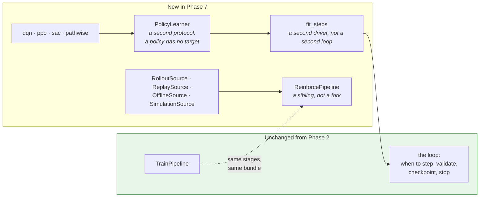
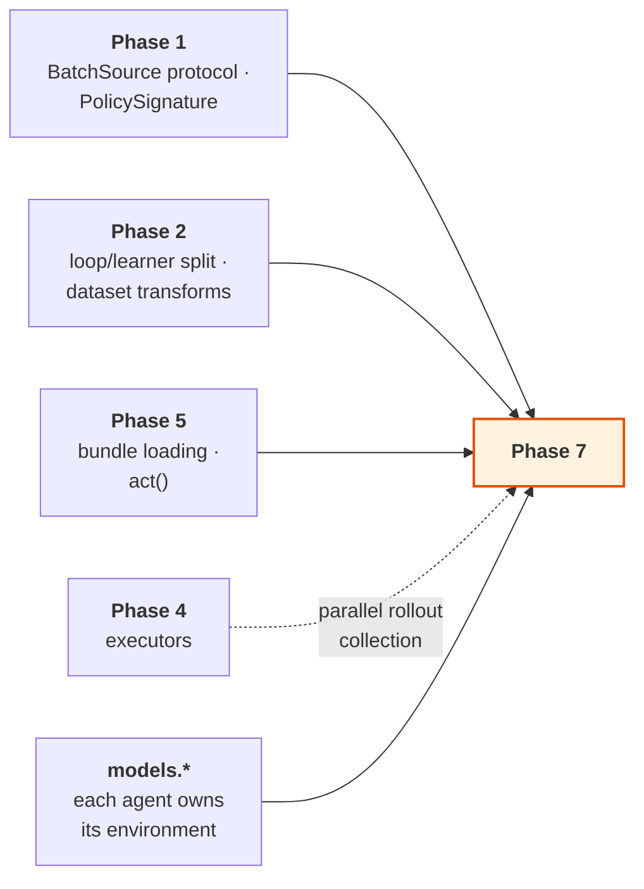

# Phase 7 — Reinforcement learning

**Extend the framework to interactive learning, without a second lifecycle.**

| | |
| --- | --- |
| **Depends on** | Phase 5 |
| **Blocks** | — |
| **Delivers** | `sources.environment`, the interactive `BatchSource` adapters, the interactive learners, `fit_steps`, `engines.torch.risk`, `analysis.metrics.episode`, `analysis.visuals.episodes` |
| **Design status** | A clean redesign. Not a port of `q_learning` |
| **Status** | **Scaffold delivered.** The whole interactive path runs end to end with one learner that performs no update. No algorithm yet |

> **Detail level.** The scaffold is at implementation depth; the algorithms
> remain at outline depth. See the note in
> [Phase 4 §intro](PHASE_4_JOB_SETS.md).

---

## 1. Purpose

A policy should get everything a supervised model gets: validated specs,
leakage-aware data handling, versioned bundles, metrics, reports, fan-out
across jobs and reproducible placement. Reinforcement-learning code in research
repositories typically gets none of it, which is why so little of it reaches
production.

This phase is last on purpose. Phases 1–6 deliver a complete, production-used
supervised framework. Designing the interactive abstractions earlier would mean
designing them around a use case nobody was yet running, and the
`BatchSource` unification would have been shaped by speculation.

### On `q_learning`

This is a redesign, not a port. The existing `q_learning` package assumes
tabular, transition-based learning throughout: its agent and environment
protocols cannot express the pathwise case, and they do not compose with the
`BatchSource` abstraction that makes one training loop serve both paradigms.
Its *use cases* informed the requirements here. None of its structure carries
over.

### What is delivered so far

The scaffold, meaning every seam on the interactive path has a real consumer
and no algorithm is implemented. An environment is declared, a policy is built
from its spaces, actions are drawn from that policy, episodes run to their end,
transitions are batched, a step budget is counted, a bundle is written, and the
policy rebuilds from that bundle with no environment present.

The learner that drives all of it, `random`, samples an action from the
untrained policy and updates nothing. That is deliberate and it is worth
shipping: it is the **control**. When the first real algorithm does not improve
an agent, the question is whether the algorithm is wrong or the plumbing is,
and the only cheap way to answer it is to have a configuration that is *known*
to do nothing. An algorithm that cannot beat it has not learned; an algorithm
that cannot even match it is broken somewhere this learner already proved
works.

It also keeps the contracts honest in the meantime. A protocol with no
implementation is a guess about what an implementation will need, and
`EngineCapabilities` spent four phases as exactly that kind of guess — see
[`MODEL_IMPLEMENTATION.md`](../MODEL_IMPLEMENTATION.md). Nothing declared in
this phase is in that position.

---

## 2. What is built

| Module | Delivers | Status |
| --- | --- | --- |
| `sources.environment.protocol` | `Environment`, `StepOutcome` | Delivered |
| `core.authoring.policy` | `PolicyModel`, the third paradigm base | Delivered |
| `sources.batching.rollout` | `RolloutSource` — unbounded on-policy experience | Delivered |
| `engines.torch.training.loops.fit_steps` | The step-driven driver and `PolicyLearner` | Delivered |
| `engines.torch.learners.random` | `RandomLearner` — the no-update control | Delivered |
| `engines.base.InteractiveEngine` | The opt-in engine capability | Delivered |
| `orchestration.pipelines.reinforce` | `ReinforcePipeline` | Delivered |
| `sources.environment.protocol` | `DifferentiableEnvironment` | With `pathwise` |
| `sources.environment.spaces` | Helpers for building spaces | Planned |
| `sources.environment.vector` | Batched environments, synchronous and process-backed | Planned |
| `sources.environment.wrappers` | Observation, action and reward wrappers; each recorded in lineage | Planned |
| `sources.environment.recording` | Episode capture to transition tables | Planned |
| `sources.environment.gymnasium` | Third-party bridge | Planned |
| `sources.dataset.transitions` | Reads transition tables back as a dataset source | Planned |
| `sources.batching.{replay,offline,simulation}` | The remaining interactive adapters | Planned |
| `engines.torch.learners.{dqn,ppo,sac,pathwise}` | Four update rules | Planned |
| `engines.torch.risk` | Differentiable mean-variance, CVaR, entropic | Planned |
| `core.spec.batching` | `RolloutSpec`, `ReplaySpec`, `SimulationSpec` | Planned |
| `analysis.metrics.episode`, `analysis.visuals.episodes` | Interactive-run analysis | Planned |

### Where an environment lives

In the model package that trains in it, exactly as a model's data build
lives in the model package that consumes it.

An earlier version of this phase listed a `domains.hedging` module holding
hedging environments and their risk objectives. That layer was removed — see
[`PHASE_4_JOB_SETS.md` §8.9](PHASE_4_JOB_SETS.md) — and the reasoning applies
here with more force, not less. An environment *is* business vocabulary: its
state, its actions and above all its reward are the problem being solved. A
shared layer for them would mean one package owning the reward functions of
every agent in the firm, and a reward is the last thing that should be shared
by accident.

So `models.my_hedger` builds its own environment in `build_environment`, and
a hedging environment used by three models is a module inside whichever
package owns it, imported by the other two — an ordinary dependency between
models rather than a framework layer.

---

## 3. Key decisions

### 3.1 One lifecycle, two drivers, two learner protocols

This section originally read *"No new pipelines, and no new loop"*, and ended
by saying that if the phase needed either, that was the finding rather than a
licence to fork. The scaffold needed part of it. Recorded here, and again in
[`engines/torch/training/loops.py`](../../engines/torch/training/loops.py):

**The second driver was never the surprise.** `core.contract.source` has
specified since Phase 1 that a source reporting `steps_per_epoch=None` "is
driven by `fit_steps`", and `fit_epochs` has always refused an unbounded source
by name. Both drivers live in `loops.py`, are the same shape, and share their
callbacks, records and refusal logic.

**The learner protocol did not survive contact.** `Learner` takes
`(model, inputs, target)`, because `fit_epochs` splits each batch into inputs
and a target using the signature's declared target name. A policy has no
target: `PolicySignature` has an observation space and an action space and
nothing resembling one, and what an interactive update consumes is a whole
transition — observation, action, reward, next observation, and the two
episode-end flags — not a pair. Passing a reward as `target` would type-check
and would be a lie; a reward is not a label.

So there is a second protocol, `PolicyLearner`, with `act` and `update`. The
alternative — widening `Learner` so `target` is optional and adding the five
other fields — would have pushed the branch *into every supervised learner*,
which is the coupling the loop/learner split exists to prevent.

**The pipeline is a sibling, not a fork.** `ReinforcePipeline` has the same
stage names in the same order, produces the same `TrainingResult` into the same
bundle layout, resolves through the same `pipeline_for` mechanism and is
overridable in the same four tiers. Three stages genuinely differ — there is no
dataset to build, no target to declare, and no pass to make — and each
difference is a different *kind* of thing rather than a different parameter. A
single class covering both would have branched on `spec.task` in those three
stages, and a model author overriding `build_data` would then have had to know
which branch they were in. The four customisation tiers only work if a stage
means one thing.

### 3.2 `DifferentiableEnvironment` is first-class

Most reinforcement-learning libraries model only step-and-reward dynamics, so a
hedging or replication problem must be forced into a transition interface —
which throws away the exact gradients that make it tractable.

When the dynamics are differentiable, a risk measure can be back-propagated
straight through a simulated path: no value function, no policy-gradient
estimator, no variance to fight. For a quantitative-finance framework this is
not an exotic case, so it gets its own protocol.

`pathwise.py` is the learner that exploits it, and it is tested against a
problem with a closed-form gradient.

**Not yet declared, on purpose.** A `runtime_checkable` protocol with no
distinguishing member is satisfied by every environment, so an `isinstance`
check against it would answer `True` for a plainly non-differentiable one. The
member it needs is whatever `pathwise` reads, and that does not exist to be
asked. It arrives with the learner that gives it meaning, together with
`simulation.py`. The design decision above stands; only the declaration waits.

### 3.3 Offline reinforcement learning reuses the dataset package

`recording.py` writes episodes to transition tables; `transitions.py` reads
them back as a `DatasetSource`. Offline learning therefore inherits the
leakage-aware splitting, caching and fitted-transform machinery already built
and tested in Phase 2, instead of acquiring a parallel data path.

### 3.4 Wrappers are recorded in lineage

A reward-shaping change alters what a policy optimises, which makes it as
load-bearing as a hyper-parameter. Every wrapper records itself in the run
lineage, so a bundle states exactly which reward it was trained against. A
reshaped reward invisible in the saved artifact is how two "identical" agents
end up incomparable.

---

## 4. How this links to the rest of the framework

`BatchSource` and `PolicySignature` were defined in Phase 1, before any
interactive source existed, specifically so this phase fits an existing
abstraction rather than reshaping one. Whether that worked is the clearest
verdict available on the Phase 1 design.

---

## 5. Tests

Environments are tested against deterministic toy dynamics with known closed
forms, so assertions are exact. A test that checks only "reward went up" cannot
distinguish a correct implementation from a lucky one.

Delivered, in the mirrored test tree:

| Test | Asserts |
| --- | --- |
| `test_environment_protocol` | A plain object with the four members satisfies `Environment`; one missing a member does not; `terminated` and `truncated` stay independent |
| `test_batching_rollout` | An episode ending mid-batch is flagged in the right position, the terminal observation is kept, statistics count episodes rather than batches, and only the first reset is seeded |
| `test_capability_policy` | The signature is *read* off the environment, proven by an environment whose `reset` and `step` raise |
| `test_learners_random` | Not one parameter changes, and no gradient is even accumulated |
| `test_torch_loops` (step driver) | The budget is counted in transitions handed over, each driver refuses the other's source, and early stopping works unchanged |
| `test_pipelines_reinforce` | A policy rebuilds from its bundle with no environment, and the supervised readers refuse that bundle by name |

Planned, with the algorithms:

| Test | Asserts |
| --- | --- |
| `test_gradient_flows_through_differentiable_dynamics` | The defining property of the differentiable protocol |
| `test_pathwise_gradient_matches_analytic` | On a problem with a closed form |
| `test_vectorised_matches_serial_stepping` | Element for element |
| `test_wrapper_order_is_respected` | Composition is not commutative |
| `test_wrappers_appear_in_lineage` | A reshaped reward is visible in the bundle |
| `test_recorded_episode_replays_identically` | Capture and replay round-trip |
| `test_offline_source_reuses_dataset_splitting` | No parallel data path |
| `test_dqn_target_network_sync` | At the right interval, with the right values |
| `test_ppo_clipping_at_ratio_bounds` | The boundary cases |
| `test_sac_entropy_term` | Against a hand-computed value |
| `test_risk_measures_match_analytic` | CVaR and entropic risk on a known distribution |
| `test_fit_steps_and_fit_epochs_share_the_loop` | No duplicated loop logic |
| `test_rl_run_produces_a_standard_bundle` | Same artifacts as a supervised run |

---

## 6. Definition of done

Beyond the universal criteria in
[`IMPLEMENTATION.md` §5](../IMPLEMENTATION.md#5-definition-of-done--every-phase):

- [x] One lifecycle. `fit_steps` is a driver sharing the loop's machinery, and
      `ReinforcePipeline` is a sibling of `TrainPipeline` rather than a forked
      lifecycle. The deviation — a second *learner protocol* — is recorded in
      §3.1 and §8.
- [x] `RolloutSource` satisfies `BatchSource` and is driven by an unmodified
      loop. The remaining three sources arrive with their algorithms.
- [ ] All four learners implemented and tested against hand-computed or
      analytic values.
- [ ] `DifferentiableEnvironment` is a first-class protocol; gradient flow
      asserted.
- [ ] Pathwise gradient matches an analytic gradient on a closed-form problem.
- [ ] Offline learning uses `sources.dataset`, not a parallel path.
- [ ] Every wrapper recorded in lineage; asserted by test.
- [ ] Vectorised stepping matches serial stepping exactly.
- [x] An interactive run produces the same bundle structure as a supervised
      one, and the policy rebuilds from it with no environment present.
- [x] A no-update control learner exists, so a later algorithm has something
      to be compared against.
- [ ] A policy runs in a job set with per-job overrides.
- [ ] No `q_learning` code imported or copied.
- [ ] `examples/rade_qnet/phase7_train_differentiable_hedger.py` trains a hedger
      on a differentiable environment and plots the hedging error path.

---

## 7. Risks

| Risk | Why it matters | Mitigation |
| --- | --- | --- |
| `BatchSource` does not fit an interactive source | The central unification claim fails | It was designed in Phase 1 against these five sources. If it fails, fix the protocol and re-verify Phase 2's sources against it |
| Reinforcement-learning runs are non-reproducible | A policy cannot be compared with its predecessor, and tuning is meaningless | Seed the environment, the vectorised workers and the replay sampler independently and deterministically from the run seed |
| The loop acquires algorithm-specific branches | Phase 2's split is undone and the next algorithm is another script | Review rule: nothing in `loops.py` may name an algorithm. Enforced as in Phase 2 |
| Learners tested only statistically | A subtly wrong update rule still learns something, slowly | Every learner tested against a hand-computed or analytic value on a closed-form problem |
| Scope expands to a reinforcement-learning library | The phase never ends | Four learners and five sources. Environments belong to the models that train in them, not to the framework. Anything further is a later phase |

---

## 8. Deviations

| Date | Deviation | Reason |
| --- | --- | --- |
| Scaffold | A second learner protocol, `PolicyLearner`, rather than reusing `Learner` | `Learner` takes `(model, inputs, target)` and a policy has no target. Widening it would have pushed an interactive branch into every supervised learner. Full reasoning in §3.1 |
| Scaffold | A second pipeline class, `ReinforcePipeline`, rather than branching inside `TrainPipeline` | Three stages differ in *kind*, and a model author overriding one has to know what the stage means. A sibling, not a fork: same stages, same result type, same bundle. §3.1 |
| Scaffold | `ModelBundle.signature` widened to `InputSignature \| PolicySignature` | The field means "what does the saved object expect", and for a policy that is the spaces. Recording the experience stream's tensor description instead would have type-checked and lost the discrete action count and the box bounds — so the policy could not be rebuilt from its own bundle, which is the one thing the field is for |
| Scaffold | `DifferentiableEnvironment` deferred, though §3.2 calls it first-class | A `runtime_checkable` protocol with no distinguishing member is satisfied by *every* environment, and the member it needs is whatever `pathwise` reads. It arrives with that learner, in one change, alongside `simulation.py` |
| Scaffold | No `evaluate` stage | Scoring a policy means running episodes with exploration off, and `PolicyLearner` declares `act`, not a greedy variant. A number produced from the exploring policy would look like a test metric and not be one |
