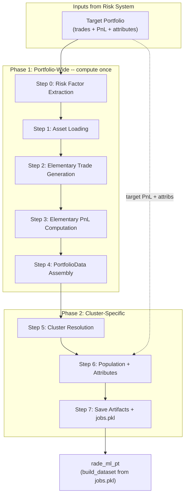

# Static Replication Preprocessing Pipeline

## 1. Overview

`rade_sr` is the static replication preprocessing library. It transforms a target trade
portfolio and market data into the input tensors that downstream ML models consume.

The pipeline follows a **portfolio-first** architecture: all market data is loaded, all
elementary trades are generated, and all elementary trade PnL is computed **once at
portfolio level** before any clustering logic is applied. Clusters are resolved as
a second phase and populated by slicing the pre-computed portfolio data.

Every intermediate artifact is stored in a dictionary keyed by **risk factor name**.
Three dictionaries share the same key space throughout the pipeline:

```
assets:             Dict[risk_factor, Asset]
elementary_trades:  Dict[risk_factor, List[ElementaryTrade]]
trade_pnls:        Dict[risk_factor, Dict[trade_id, ElementaryTradePnL]]
```

This document is the ground truth specification for implementation.

---

## 2. Directory Structure

```
src/rade_sr/
├── assets/                    # Market data layer
│   ├── asset.py               # Asset ABC (loading orchestration)
│   ├── fx.py                  # FXAsset + FXConfig
│   ├── rates.py               # IRAsset + IRConfig
│   └── types.py               # AssetConfig, Curve, VolSurface, VolCube, FXShocks, IRShocks
│
├── instruments/               # Elementary trade definitions
│   ├── base.py                # InstrumentSpec ABC, StrikeGrid, TenorGrid
│   ├── fx.py                  # FXForward, FXVanillaOption, FXDigital, generate_fx_elementary_trades()
│   └── rates.py               # IRSwap, IRSwaption, IRCapFloor, generate_ir_elementary_trades()
│
├── pricing/                   # Pricing engine
│   ├── option_pricer.py       # OptionPricer (batch dispatcher)
│   └── kernels/               # @njit compiled numeric functions
│       ├── _math.py           # norm_cdf, norm_pdf, df_from_rate, compute_annuity, compute_forward_swap_rate
│       ├── fx.py              # price_fx_forward, price_fx_vanilla, price_fx_digital, price_fx_vanilla_batch
│       └── rates.py           # price_ir_swap, price_ir_swaption_bachelier/black, price_ir_capfloor_bachelier/black
│
├── core/                      # Domain types and contracts
│   ├── types.py               # ElementaryTrade, ElementaryTradePnL, PortfolioData, PortfolioSlice, ReplicationJob, ClusterPaths
│   ├── protocols.py           # ClusterResolver, PathResolver, RiskFactorBuilder, TradeGenerator, PnLEngine
│   └── exceptions.py          # PipelineError, TradeGenerationError, PnLComputationError, UnknownAssetClassError
│
├── replication/               # Pipeline engine, stages, and orchestration
│   ├── pipeline.py            # PipelineConfig, PreprocessingPipeline
│   ├── orchestrator.py        # build_pipeline(), run_preprocessing()
│   ├── registry.py            # RiskFactorRegistry (decorator-based dispatch)
│   ├── builders.py            # FXRiskFactorBuilder, RatesRiskFactorBuilder
│   ├── trade_generator.py     # RiskFactorAwareTradeGenerator
│   ├── pnl_engine.py          # VectorisedPnLEngine
│   ├── cluster_resolver.py    # ClusterResolver wrapper
│   ├── path_resolver.py       # ConventionPathResolver
│   └── portfolio.py           # PortfolioManager (aggregates ReplicationJobs)
│
├── config/                    # Configuration loading
│   └── loader.py              # ConfigLoader (YAML → PipelineConfig)
│
└── api/                       # Internal API client stub
    └── client.py              # InternalAPIClient
```

---

## 3. Pipeline Architecture



### Design Principles

1. **Compute once, slice many.** All pricing happens at portfolio level. Clusters
   receive pre-computed slices. No re-pricing.
2. **Risk-factor-keyed dictionaries.** A single key space flows unchanged from
   Step 1 through Step 7. Slicing, aggregation, and audit are trivial.
3. **Self-contained assets.** An `FXAsset` loads its own IR curve dependencies
   internally. The pipeline never couples to asset-class-specific loading logic.
4. **Protocol-driven stages.** Every pipeline stage depends on a Protocol from
   `core/protocols.py`, not on concrete classes. Any stage can be swapped at
   construction time.
5. **Registry dispatch.** New asset classes are added by decorating a builder
   class. Zero pipeline code changes.

---

## 4. Phase 1: Portfolio-Wide Computation

### Step 0 -- Portfolio Ingestion and Risk Factor Extraction

**Purpose:** Accept a target trade portfolio and extract the set of unique risk
factors that need market data.

**Input:** Target trade portfolio in any of:

| Format | Example |
|--------|---------|
| `pd.DataFrame` | Columns: `trade_id`, `asset_class`, `risk_factor`, `product_type`, `notional`, `expiry`, `strike`, ... |
| `List[dict]` | JSON records from an internal risk system API |
| File path | CSV or Parquet file loaded at runtime |

Required columns (or dict keys): `asset_class` and `risk_factor`.

**Output:** `asset_config: Dict[str, Dict[str, Any]]`

```python
# Example output:
{
    "EURUSD":  {"asset_class": "fx",    "pair": "EURUSD"},
    "GBPUSD":  {"asset_class": "fx",    "pair": "GBPUSD"},
    "EUR_OIS": {"asset_class": "rates", "currency": "EUR", "curve_type": "ois"},
}
```

One entry per unique risk factor. The key is the risk factor name. The value
contains `asset_class` (used for registry dispatch) and any asset-specific
metadata carried forward from the portfolio or enriched by convention.

**Logic:**

1. Normalise input to DataFrame.
2. Validate required columns exist.
3. Group by `risk_factor`, take first row's `asset_class`.
4. Validate each risk factor maps to exactly one asset class.
5. Extract asset-specific metadata (pair, currency, curve_type) from portfolio
   columns or apply naming conventions.

**Integration point:** This is where you connect to your work environment's risk
system exports. The target portfolio (trades, PnL, attributes) downloaded from
your internal systems feeds into this step.

---

### Step 1 -- Asset Loading

**Purpose:** Build one fully loaded, self-contained `Asset` per unique risk factor.

**Input:** `asset_config: Dict[str, Dict[str, Any]]` from Step 0.

**Output:** `assets: Dict[str, Asset]`

**Dispatch mechanism -- `RiskFactorRegistry`:**

The registry maps `asset_class` strings to builder instances. Registration happens
at import time via the `@RiskFactorRegistry.register` decorator:

```python
# In builders.py:

@RiskFactorRegistry.register
class FXRiskFactorBuilder:
    asset_class = "fx"
    def build(self, factor_id, factor_config) -> FXAsset: ...

@RiskFactorRegistry.register
class RatesRiskFactorBuilder:
    asset_class = "rates"
    def build(self, factor_id, factor_config) -> IRAsset: ...
```

**Registry contents after import:**

```python
{"fx": FXRiskFactorBuilder(), "rates": RatesRiskFactorBuilder()}
```

**Pipeline code (in `PreprocessingPipeline._load_all_assets`):**

```python
for factor_id, factor_cfg in config.asset_config.items():
    builder = self._registry.get(factor_cfg["asset_class"])
    assets[factor_id] = builder.build(factor_id, factor_cfg)
```

For `"EURUSD"`: `registry.get("fx")` returns `FXRiskFactorBuilder`, which:

1. Constructs `AssetConfig(asset_class="fx", asset_name="EURUSD", extra={...})`.
2. Creates `FXAsset(config)` -- this parses `FXConfig` from `extra`.
3. Calls `asset.load(api_client)` -- triggers the loading sequence below.

#### Asset Loading Sequence

`Asset.load()` runs four hooks in order:

```
1. _load_dependencies(api_client)  →  Dict[str, Asset]
2. _load(api_client)               →  sets spot, spot_series, + asset-specific fields
3. _load_shocks(api_client)        →  sets self._shocks (typed dataclass)
4. validate()                      →  returns bool
```

**FXAsset loading detail:**

```
FXAsset("EURUSD").load(api_client)
│
├─ _load_dependencies()
│   ├─ IRAsset("EUR_DISC").load(api_client)    ← recursive, full load
│   └─ IRAsset("USD_DISC").load(api_client)    ← recursive, full load
│   └─ returns {"domestic_ir": IRAsset, "foreign_ir": IRAsset}
│
├─ _load()
│   ├─ _fetch_spot()            → _build_spot()            → self.spot, self.spot_series
│   ├─ _fetch_forward_points()  → _build_forward_points()  → self.forward_points
│   └─ _fetch_atm_vol()    ─┐
│      _fetch_smile_vol()   ─┤→ _build_vol_surface()       → self.vol_surface (VolSurface)
│
├─ _load_shocks()
│   └─ _fetch_shocks()         → _build_shocks()           → self._shocks (FXShocks)
│
└─ validate()
    ├─ Presence checks (spot, vol_surface, dependencies, shocks)
    └─ FXShocks.validate_shapes() + grid alignment checks
```

**IRAsset loading detail:**

```
IRAsset("EUR_OIS").load(api_client)
│
├─ _load_dependencies()  →  {}   (leaf node)
│
├─ _load()
│   ├─ _fetch_curve()           → _build_curve()           → self.curve (Curve)
│   ├─ self.spot = self.par_swap_rate(reference_tenor)      → derived from curve
│   ├─ _fetch_history()         → _build_history()          → self.rate_history (DataFrame), self.spot_series
│   └─ _fetch_atm_vol()    ─┐
│      _fetch_smile_vol()   ─┤→ _build_vol_cube()          → self.vol_cube (VolCube)
│                            └─ _extract_atm_surface()      → self.vol_surface (VolSurface, ATM slice)
│
├─ _load_shocks()
│   └─ _fetch_shocks()         → _build_shocks()           → self._shocks (IRShocks)
│
└─ validate()
```

**Integration points:** Every `_fetch_*()` method raises `NotImplementedError` and
is annotated with the expected return format. These are the methods you wire to
your internal market data and scenario API. The `_build_*()` methods are fully
implemented and construct the typed market data objects from the raw API response.

#### Market Data Objects After Loading

| Asset | Field | Type | Description |
|-------|-------|------|-------------|
| **FXAsset** | `spot` | `float` | Current spot rate |
| | `spot_series` | `pd.Series` | Historical spot (date-indexed) |
| | `vol_surface` | `VolSurface` | Tenors x delta-strikes, with `vol_at(T, K)` interpolator |
| | `forward_points` | `pd.Series` | Tenor-indexed forward points |
| | `domestic_ir` | `IRAsset` | Base currency IR asset (via `_dependencies`) |
| | `foreign_ir` | `IRAsset` | Quote currency IR asset (via `_dependencies`) |
| | `shocks` | `FXShocks` | Labelled shock arrays for all risk factors |
| **IRAsset** | `spot` | `float` | Par swap rate at reference tenor |
| | `spot_series` | `pd.Series` | Historical reference rate (date-indexed) |
| | `curve` | `Curve` | Discount/projection curve with `rate_at(T)` interpolator |
| | `rate_history` | `pd.DataFrame` | Historical curve panel (dates x tenors) |
| | `vol_cube` | `VolCube` | Expiry x swap_tenor x strike |
| | `vol_surface` | `VolSurface` | ATM slice of vol_cube |
| | `shocks` | `IRShocks` | Labelled shock arrays for curve + vol |

#### Shock Dataclasses

Shocks are typed dataclasses that carry their own axis labels to eliminate
positional ambiguity.

**`FXShocks`** fields:

| Field | Shape | Description |
|-------|-------|-------------|
| `spot` | `(n_scenarios,)` | Shocked spot levels |
| `vol_surface` | `(n_scenarios, n_expiries, n_strikes)` | Shocked vol surface |
| `vol_expiries` | `(n_expiries,)` | Axis labels for vol dimension 1 |
| `vol_strikes` | `(n_strikes,)` | Axis labels for vol dimension 2 |
| `domestic_rate` | `(n_scenarios, n_dom_pillars)` | Shocked domestic IR curve |
| `domestic_tenors` | `(n_dom_pillars,)` | Axis labels for domestic pillars |
| `foreign_rate` | `(n_scenarios, n_for_pillars)` | Shocked foreign IR curve |
| `foreign_tenors` | `(n_for_pillars,)` | Axis labels for foreign pillars |
| `forward_points` | `(n_scenarios, n_fwd_tenors)` | Optional shocked forward points |
| `forward_tenors` | `(n_fwd_tenors,)` | Optional axis labels for forward points |

**`IRShocks`** fields:

| Field | Shape | Description |
|-------|-------|-------------|
| `curve` | `(n_scenarios, n_pillars)` | Shocked curve values (additive) |
| `curve_tenors` | `(n_pillars,)` | Axis labels for curve pillars |
| `vol` | `(n_scenarios, n_exp, n_ten, n_strikes)` | Optional shocked vol cube |
| `vol_expiries` | `(n_exp,)` | Optional axis labels |
| `vol_swap_tenors` | `(n_ten,)` | Optional axis labels |
| `vol_strikes` | `(n_strikes,)` | Optional axis labels |

Both dataclasses provide `n_scenarios` (property) and `validate_shapes()` for
internal consistency checks.

---

### Step 2 -- Elementary Trade Generation

**Purpose:** Generate a universe of elementary (replicating) instruments for each
risk factor, using user-defined grids resolved against the asset's reference level.

**Input:**
- `assets: Dict[str, Asset]` from Step 1
- `trade_config: Dict[str, Any]` -- user-defined generation parameters

**Output:** `elementary_trades: Dict[str, List[ElementaryTrade]]`

#### trade_config Schema

```python
trade_config = {
    "fx": {
        "strike_pcts": [0.70, 0.80, 0.90, 0.95, 1.00, 1.05, 1.10, 1.20, 1.30],
        "maturities": [0.25, 0.5, 1.0, 2.0, 5.0],
        "include_forwards": True,
        "include_vanillas": True,
        "include_digitals": True,
        "notional": 1.0,
    },
    "rates": {
        "strike_offsets_bp": [-200, -100, -50, -25, 0, 25, 50, 100, 200],
        "maturities": [1.0, 2.0, 5.0, 10.0, 20.0, 30.0],
        "include_swaps": True,
        "include_swaptions": True,
        "include_caps_floors": True,
        "notional": 1_000_000.0,
    },
}
```

| Parameter | Asset Class | Meaning |
|-----------|------------|---------|
| `strike_pcts` | FX | Percentages of spot. `1.0` = ATM. Resolved as `pct * asset.spot`. |
| `strike_offsets_bp` | IR | Basis point offsets from par swap rate. `0` = ATM. Resolved as `asset.spot + bp / 10_000`. |
| `maturities` | Both | Year fractions for expiry/maturity grid. User-defined, not derived from market data. |

#### Dispatch: `_generate_for_factor()`

The trade generator dispatches on `asset.asset_class`:

```
_generate_for_factor(factor_id, asset, trade_config)
│
├─ asset.asset_class == "fx"
│   ├─ abs_strikes = [pct * asset.spot for pct in trade_config["fx"]["strike_pcts"]]
│   ├─ StrikeGrid(values=abs_strikes, convention="absolute", reference_level=asset.spot)
│   ├─ TenorGrid(values=trade_config["fx"]["maturities"])
│   └─ generate_fx_elementary_trades(factor_id, tenor_grid, strike_grid, ...)
│       └─ Cross-product: tenors x {forwards} + tenors x strikes x {vanilla call/put, digital call/put}
│
├─ asset.asset_class == "rates"
│   ├─ abs_strikes = [asset.spot + bp/10_000 for bp in trade_config["rates"]["strike_offsets_bp"]]
│   ├─ StrikeGrid(values=abs_strikes, convention="absolute", reference_level=asset.spot)
│   ├─ TenorGrid(values=trade_config["rates"]["maturities"])
│   └─ generate_ir_elementary_trades(factor_id, tenor_grid, strike_grid, ...)
│       └─ Cross-product: tenors x {swap pay/receive} + tenors x strikes x {swaption, cap/floor}
│
└─ returns List[ElementaryTrade]
```

#### Trade Universe Sizing (example)

**FX** with 9 strikes, 5 maturities, all instrument types:
- Forwards: 5 maturities x 2 directions = 10
- Vanillas: 5 x 9 x 2 (call/put) = 90
- Digitals: 5 x 9 x 2 = 90
- **Total: 190 trades per FX risk factor**

**IR** with 9 strikes, 6 maturities, all instrument types:
- Swaps: 6 maturities x 2 (pay/receive) = 12
- Swaptions: 6 x 9 x 2 (payer/receiver) = 108
- Caps/floors: 6 x 9 x 2 (cap/floor) = 108
- **Total: 228 trades per IR risk factor**

#### InstrumentSpec to ElementaryTrade Conversion

Each `InstrumentSpec` (the rich OOP instrument) is converted to an `ElementaryTrade`
(the flat, serialisable transfer object) via:

```python
ElementaryTrade(
    trade_id=inst.to_trade_id(factor_id),   # deterministic, globally unique
    asset_class=ac,                          # "fx" or "rates"
    payoff_type=inst.payoff_type,            # "vanilla", "forward", "swap", "swaption", ...
    factor_id=factor_id,                     # "EURUSD", "EUR_OIS", ...
    parameters=inst.to_pricer_params(),      # flat dict of numeric parameters
    notional=notional,
)
```

`to_pricer_params()` produces the parameter dict that `OptionPricer.extract_params()`
later consumes for batch pricing.

#### Instrument Types

**FX instruments** (`instruments/fx.py`):

| Class | `payoff_type` | Key Parameters | Pricing Kernel |
|-------|--------------|----------------|----------------|
| `FXForward` | `"forward"` | expiry, forward_rate, direction | `price_fx_forward` (GK forward) |
| `FXVanillaOption` | `"vanilla"` | expiry, strike, option_type | `price_fx_vanilla` (Garman-Kohlhagen) |
| `FXDigital` | `"digital"` | expiry, strike, option_type, payout | `price_fx_digital` (cash-or-nothing) |

**IR instruments** (`instruments/rates.py`):

| Class | `payoff_type` | Key Parameters | Pricing Kernel |
|-------|--------------|----------------|----------------|
| `IRSwap` | `"swap"` | maturity, fixed_rate, pay_receive, frequency | `price_ir_swap` (annuity-based) |
| `IRSwaption` | `"swaption"` | option_expiry, swap_tenor, strike, option_type, vol_type | `price_ir_swaption_bachelier` / `_black` |
| `IRCapFloor` | `"cap_floor"` | maturity, strike, option_type, frequency, vol_type | `price_ir_capfloor_bachelier` / `_black` |

Each instrument class also provides `price(market_data)` and `sensitivities(market_data)`
methods for single-instrument evaluation outside the batch pipeline.

---

### Step 3 -- PnL Computation

**Purpose:** Compute `PnL = shocked_pv - base_pv` for every elementary trade
across all shock scenarios.

**Input:**
- `elementary_trades: Dict[str, List[ElementaryTrade]]` from Step 2
- `assets: Dict[str, Asset]` from Step 1 (provides market data + shocks)

**Output:** `trade_pnls: Dict[str, Dict[str, ElementaryTradePnL]]`

**Computation:** `VectorisedPnLEngine.compute_batch()` iterates factor groups.
Factor groups are processed in parallel via `ProcessPoolExecutor`.

#### Per-Factor Pricing Flow

For each risk factor:

```
_price_group(factor_id, trades, asset)
│
├─ 1. Extract parameters
│   param_matrix = np.array([pricer.extract_params(t) for t in trades])
│   └─ Shape: (n_trades, n_params)
│
├─ 2. Convert typed shocks to pricer dict
│   scenarios = shocks_to_scenarios(asset)
│   └─ FX: {"spot": (N,), "vol_surface": (N,E,K), "domestic_rate": (N,P), "foreign_rate": (N,P)}
│   └─ IR: {"rate": (N,P), "vol": (N,E,T,K)}
│
├─ 3. Batch price via OptionPricer
│   pnl_matrix = pricer.price_batch(param_matrix, asset, scenarios)
│   └─ Shape: (n_trades, n_scenarios)
│
└─ 4. Split into per-trade PnL objects
    {trade.trade_id: ElementaryTradePnL(pnl_vector=pnl_matrix[i]) for i, trade in enumerate(trades)}
```

#### OptionPricer Dispatch

`OptionPricer.price_batch()` dispatches on `asset.asset_class`:

```
price_batch(params, market_data, scenarios)
│
├─ asset_class == "fx"  →  _price_fx_batch()
│   ├─ Extract: S_base, r_dom, r_for from FXAsset
│   ├─ Resolve per-trade sigma from vol_surface.vol_at(T, K)
│   └─ Call @njit kernel: price_fx_vanilla_batch(S_base, S_scenarios, strikes, ...)
│       └─ For each trade i, each scenario j:
│          pnl[i, j] = price_fx_vanilla(S_scenarios[j], ...) - price_fx_vanilla(S_base, ...)
│
└─ asset_class == "rates"  →  _price_ir_batch()
    ├─ Extract: curve_tenors, curve_values from IRAsset.curve
    ├─ curve_shocks = scenarios["rate"]   (additive, shape n_scenarios x n_pillars)
    └─ Dispatch on n_params (trade type):
        ├─ 5 cols → swap    → price_ir_swap_vec(curve_tenors, curve_values, curve_shocks, ...)
        ├─ 7 cols → swaption → bump-and-reprice loop with price_ir_swaption_bachelier
        └─ 6 cols → cap/floor → bump-and-reprice loop with price_ir_capfloor_bachelier
```

#### Kernel Architecture

All pricing kernels are `@njit(cache=True)` compiled functions in `pricing/kernels/`.
They take only primitive floats and NumPy arrays -- no Python objects cross the
JIT boundary.

```
pricing/kernels/
├── _math.py    ← norm_cdf, norm_pdf, df_from_rate, compute_annuity, compute_forward_swap_rate
├── fx.py       ← price_fx_forward, price_fx_vanilla, price_fx_digital, price_fx_vanilla_batch
└── rates.py    ← price_ir_swap, price_ir_swap_vec, price_ir_swaption_bachelier/black, price_ir_capfloor_bachelier/black
```

Naming convention:
- `price_*` -- single-trade present value
- `greeks_*` -- tuple of first-order sensitivities
- `price_*_vec` -- vectorised over scenarios, returns `(n_scenarios,)` PnL
- `price_*_batch` -- vectorised over trades and scenarios, returns `(n_trades, n_scenarios)` PnL

#### ElementaryTradePnL

```python
@dataclass
class ElementaryTradePnL:
    trade_id: str           # matches ElementaryTrade.trade_id
    factor_id: str          # risk factor this PnL was computed against
    pnl_vector: np.ndarray  # shape (n_scenarios,) — one PnL per shock scenario
```

Only the PnL vector is stored. No base PV, no greeks. The downstream ML model
consumes the PnL matrix directly.

---

### Step 4 -- PortfolioData Assembly

**Purpose:** Combine the three dictionaries into a single source of truth.

```python
portfolio = PortfolioData(
    assets=assets,                    # Dict[str, Asset]
    elementary_trades=all_trades,     # Dict[str, List[ElementaryTrade]]
    trade_pnls=all_pnls,             # Dict[str, Dict[str, ElementaryTradePnL]]
)
```

`PortfolioData` provides:

| Method / Property | Returns | Purpose |
|-------------------|---------|---------|
| `slice(risk_factors)` | `PortfolioSlice` | Subset all three dicts for a set of risk factor keys |
| `all_trades_flat()` | `List[ElementaryTrade]` | Flatten trades across all factors |
| `all_pnls_flat()` | `Dict[str, ElementaryTradePnL]` | Flatten PnL dict |
| `n_factors` | `int` | Number of loaded risk factors |
| `n_trades` | `int` | Total elementary trades |
| `n_scenarios` | `int` | Number of shock scenarios |
| `risk_factors` | `Set[str]` | All risk factor names |

---

## 5. Target Trade Data

Target trades are the **actual desk positions** -- the real portfolio downloaded
from your internal risk system. They flow through the pipeline separately from
elementary trades and are attached to each cluster during population.

### What the Pipeline Receives

The target portfolio provides two artifacts per risk factor:

| Artifact | Type | Shape | Source |
|----------|------|-------|--------|
| **Target PnL** | `pd.DataFrame` | `(n_scenarios, n_target_trades)` | Risk system scenario PnL export |
| **Target Attributes** | `pd.DataFrame` | `(n_target_trades, n_features)` | Risk system trade attribute export |

These are loaded from your internal systems and passed to the pipeline
via `PipelineConfig`:

```python
config = PipelineConfig(
    ...
    target_data={
        "target_pnl": target_pnl_df,             # pd.DataFrame (n_scenarios x n_trades)
        "target_attributes": target_attributes_df, # pd.DataFrame (n_trades x n_features)
        "risk_factor_column": "risk_factor",       # column that maps trades → risk factors
    },
)
```

Columns in `target_attributes` typically include:

```
trade_id, risk_factor, asset_class, product_type, expiry, strike, notional,
ccy_pair, currency, desk, book, ...
```

The `risk_factor` column is the join key that connects target trades to the
pipeline's risk-factor-keyed dictionaries.

### How Target Data Flows

During Phase 1, after `PortfolioData` is assembled, target data is grouped
by risk factor:

```python
target_pnl_by_rf:   Dict[str, pd.DataFrame]   # rf → (n_scenarios, n_target_trades_for_rf)
target_attrs_by_rf: Dict[str, pd.DataFrame]    # rf → (n_target_trades_for_rf, n_features)
```

During cluster population (Phase 2), the cluster's risk factors select the
relevant subsets:

```python
cluster_target_pnl = pd.concat([target_pnl_by_rf[rf] for rf in risk_factors], axis=1)
cluster_target_attrs = pd.concat([target_attrs_by_rf[rf] for rf in risk_factors])
```

**Integration point:** The target PnL and attributes are produced by your internal
risk system. The pipeline does not compute them -- it receives them as input,
groups them by risk factor, and slices them per cluster.

---

## 6. Attribute Construction

The downstream ML model (`rade_ml_pt`) requires four parquet files per cluster.
These are the artifacts referenced by `ClusterPaths`:

```
{root}/{cluster_id}/
├── target_pnl.parquet            # Target trade PnL (from risk system)
├── target_attributes.parquet     # Target trade attributes (from risk system)
├── elem_pnl.parquet              # Elementary trade PnL (computed by pipeline)
└── elem_attributes.parquet       # Elementary trade attributes (built from ElementaryTrade)
```

### Elementary Trade Attributes

Elementary trade attributes are **built by the pipeline** from the
`ElementaryTrade.parameters` dicts during cluster population. Each elementary
trade already carries all the information needed:

```python
def build_elementary_attributes(trades: List[ElementaryTrade]) -> pd.DataFrame:
    """Build attributes DataFrame from elementary trades."""
    rows = []
    for t in trades:
        row = {
            "trade_id": t.trade_id,
            "asset_class": t.asset_class,
            "payoff_type": t.payoff_type,
            "factor_id": t.factor_id,
            "notional": t.notional,
        }
        row.update(t.parameters)  # expiry, strike, option_type, etc.
        rows.append(row)
    return pd.DataFrame(rows).set_index("trade_id")
```

Example output for FX elementary trades:

```
                                    asset_class  payoff_type  factor_id  notional  expiry   strike  option_type
trade_id
EURUSD|EURUSD|VAN|1.0000|1.084200|C  fx          vanilla      EURUSD     1.0       1.0      1.0842  call
EURUSD|EURUSD|VAN|1.0000|1.084200|P  fx          vanilla      EURUSD     1.0       1.0      1.0842  put
EURUSD|EURUSD|FWD|1.0000|B           fx          forward      EURUSD     1.0       1.0      0.0     NaN
...
```

### Elementary Trade PnL DataFrame

The PnL matrix is built from the `ElementaryTradePnL` vectors:

```python
def build_elementary_pnl(trades: List[ElementaryTrade],
                         pnls: Dict[str, ElementaryTradePnL]) -> pd.DataFrame:
    """Build PnL DataFrame: columns = trade_ids, rows = scenarios."""
    trade_ids = [t.trade_id for t in trades]
    matrix = np.column_stack([pnls[tid].pnl_vector for tid in trade_ids])
    return pd.DataFrame(matrix, columns=trade_ids)
```

Shape: `(n_scenarios, n_elementary_trades)` -- columns are trade IDs, rows are
scenario indices.

### Where Attributes Are Built

Attribute and PnL DataFrames are constructed during **cluster population**
(Step 7) as part of assembling each `ReplicationJob`. The `ReplicationJob`
should provide methods to build these:

| Method | Returns | Saved To |
|--------|---------|----------|
| `build_elementary_attributes()` | `pd.DataFrame (n_elem_trades, n_features)` | `elem_attributes.parquet` |
| `build_elementary_pnl_df()` | `pd.DataFrame (n_scenarios, n_elem_trades)` | `elem_pnl.parquet` |
| `target_pnl` | `pd.DataFrame (n_scenarios, n_target_trades)` | `target_pnl.parquet` |
| `target_attributes` | `pd.DataFrame (n_target_trades, n_features)` | `target_attributes.parquet` |

---

## 7. Phase 2: Cluster-Specific Processing

### Step 5 -- Cluster Resolution

**Purpose:** Group target trades into clusters. Each cluster maps to a set of
risk factor names.

**Input:** `cluster_config: Dict[str, Any]` (from `PipelineConfig`).

**Output:** `cluster_map: Dict[str, List[str]]` -- `cluster_id` to list of
risk factor names.

The `ClusterResolver` wraps your existing clustering logic (simple key grouping,
k-means, hierarchical, etc.):

| Method | Result |
|--------|--------|
| Key grouping (by ccy pair) | `{"EURUSD": ["EURUSD"], "GBPUSD": ["GBPUSD"]}` |
| Key grouping (by desk) | `{"G10_FX": ["EURUSD", "GBPUSD"]}` |
| K-means | `{"cluster_0": ["EURUSD", "GBPUSD"], "cluster_1": ["EUR_OIS"]}` |

**Constraint:** All risk factors in a single cluster must share the same
`asset_class`. The pipeline validates this and raises `PipelineError` if
a cluster contains mixed asset classes (e.g. FX + IR).

**Integration point:** Wire `ClusterResolver.resolve()` to your existing
`ClusterManager` or equivalent.

---

### Step 6 -- Cluster Population and Attribute Construction

**Purpose:** Slice `PortfolioData` and target trade data to populate each
cluster with its complete set of artifacts, including attribute DataFrames.

For each cluster:

```python
# 1. Validate asset class homogeneity
_validate_asset_class_homogeneity(cluster_id, risk_factors, portfolio)

# 2. Slice portfolio-level data by this cluster's risk factors
s = portfolio.slice(risk_factors)

# 3. Slice target trade data for this cluster's risk factors
cluster_target_pnl = slice_target_pnl(target_pnl_by_rf, risk_factors)
cluster_target_attrs = slice_target_attrs(target_attrs_by_rf, risk_factors)

# 4. Build elementary trade attribute DataFrame
elem_attrs = build_elementary_attributes(s.all_trades_flat())

# 5. Build elementary trade PnL DataFrame
elem_pnl_df = build_elementary_pnl(s.all_trades_flat(), s.all_pnls_flat())

# 6. Resolve filesystem paths
paths = path_resolver.resolve(cluster_id, path_config)

# 7. Assemble the job
    job = ReplicationJob(
    cluster_id=cluster_id,
    cluster_paths=paths,
    assets=s.assets,
    elementary_trades=s.elementary_trades,
    trade_pnls=s.trade_pnls,
    target_pnl=cluster_target_pnl,
    target_attributes=cluster_target_attrs,
    elementary_attributes=elem_attrs,
)
```

---

### Step 7 -- Save Artifacts and Assemble Output

**Purpose:** Save the four per-cluster parquet files to disk and serialize the
complete job list.

#### Per-Cluster Artifact Save

Each cluster's four DataFrames are saved to the paths defined by `ClusterPaths`:

```python
for job in jobs:
    paths = job.cluster_paths
    os.makedirs(paths.target_pnl.parent, exist_ok=True)

    job.target_pnl.to_parquet(paths.target_pnl)
    job.target_attributes.to_parquet(paths.target_attributes)
    job.build_elementary_pnl_df().to_parquet(paths.elem_pnl)
    job.build_elementary_attributes().to_parquet(paths.elem_attributes)
```

Filesystem after save:

```
/data/replication/run_2026_03_30/
├── EURUSD/
│   ├── target_pnl.parquet
│   ├── target_attributes.parquet
│   ├── elem_pnl.parquet
│   └── elem_attributes.parquet
├── GBPUSD/
│   ├── ...
├── EUR_OIS/
│   ├── ...
└── jobs.pkl                      ← serialized List[ReplicationJob]
```

#### Pipeline Endpoint: `jobs.pkl`

The final output of the entire `rade_sr` preprocessing module is a single
pickle file containing the complete list of `ReplicationJob` objects:

```python
import pickle
from pathlib import Path

output_path = Path(config.path_config["root"]) / "jobs.pkl"
with open(output_path, "wb") as f:
    pickle.dump(jobs, f)
```

This `jobs.pkl` is the handoff artifact between `rade_sr` (preprocessing) and
`rade_ml_pt` (ML training). It contains everything the downstream model needs:

```python
# In rade_ml_pt:
with open("jobs.pkl", "rb") as f:
    jobs = pickle.load(f)

for job in jobs:
    job_dict = job.to_job_dict()
    result = build_dataset(job_dict, data_config)
```

The `to_job_dict()` method produces the dictionary that `rade_ml_pt.build_dataset()`
expects, including the `cluster_info` paths that point to the four parquet files:

```python
{
    "cluster_info": {
        "target_pnl_path": "/data/.../EURUSD/target_pnl.parquet",
        "target_attribs_path": "/data/.../EURUSD/target_attributes.parquet",
        "elementary_pnl_path": "/data/.../EURUSD/elem_pnl.parquet",
        "elementary_attribs_path": "/data/.../EURUSD/elem_attributes.parquet",
    },
    "cluster_id": "EURUSD",
    "n_trades": 190,
    "n_scenarios": 1000,
}
```

#### Downstream Consumption (`rade_ml_pt`)

`rade_ml_pt.build_dataset()` loads the four parquet files from the paths in
`cluster_info` and runs its own data pipeline:

```
0. Load: target_pnl, elementary_pnl, target_attribs, elementary_attribs
1. Standardise PnL (fit scaler on train split, transform all)
2. Dimensionality reduction on elementary trades
3. Encode trade attributes (one-hot, multi-label, numeric)
4. Build trade graph (k-NN adjacency with RBF kernel)
5. Construct DataLoaders for train / val / test splits
```

The `rade_sr` pipeline's job is complete once `jobs.pkl` and the per-cluster
parquet files are saved to disk.

---

### ReplicationJob API

| Method / Property | Returns | Purpose |
|-------------------|---------|---------|
| `pnl_matrix()` | `np.ndarray (n_elem_trades, n_scenarios)` | Stacked elementary PnL matrix |
| `build_elementary_pnl_df()` | `pd.DataFrame (n_scenarios, n_elem_trades)` | Elementary PnL as DataFrame for parquet save |
| `build_elementary_attributes()` | `pd.DataFrame (n_elem_trades, n_features)` | Elementary trade attributes from parameters |
| `target_pnl` | `pd.DataFrame (n_scenarios, n_target_trades)` | Target PnL (from risk system, sliced per cluster) |
| `target_attributes` | `pd.DataFrame (n_target_trades, n_features)` | Target attributes (from risk system, sliced per cluster) |
| `all_trades_flat()` | `List[ElementaryTrade]` | Ordered elementary trade list |
| `all_pnls_flat()` | `Dict[str, ElementaryTradePnL]` | Flat PnL lookup |
| `n_trades` | `int` | Total elementary trades in this cluster |
| `n_scenarios` | `int` | Number of scenarios |
| `trade_ids` | `List[str]` | Elementary trade IDs in flattened order |
| `risk_factor_ids` | `List[str]` | Risk factor names in this cluster |
| `to_job_dict()` | `Dict[str, Any]` | Dict for `rade_ml_pt` compatibility |

---

## 8. Configuration

### PipelineConfig

```python
@dataclass
class PipelineConfig:
    cluster_config: Dict[str, Any]   # passed to ClusterResolver.resolve()
    path_config: Dict[str, Any]      # root dir + filename conventions
    asset_config: Dict[str, Any]     # {risk_factor: {asset_class, ...}}  (from Step 0 or YAML)
    trade_config: Dict[str, Any]     # user-defined generation grids (see Step 2)
    target_data: Dict[str, Any]      # target PnL + attributes from risk system
    fail_fast: bool = True           # abort on first stage failure
```

### Full Configuration Example

```python
config = PipelineConfig(
    cluster_config={
        "method": "key_grouping",
        "cluster_key": "ccy_pair",
    },
    path_config={
        "root": "/data/replication/run_2026_03_30",
        "target_pnl_file": "target_pnl.parquet",
        "target_attr_file": "target_attributes.parquet",
        "elem_pnl_file": "elem_pnl.parquet",
        "elem_attr_file": "elem_attributes.parquet",
    },
    asset_config={
        "EURUSD":  {"asset_class": "fx",    "pair": "EURUSD"},
        "GBPUSD":  {"asset_class": "fx",    "pair": "GBPUSD"},
        "EUR_OIS": {"asset_class": "rates", "currency": "EUR", "curve_type": "ois"},
    },
    trade_config={
        "fx": {
            "strike_pcts": [0.70, 0.80, 0.90, 0.95, 1.00, 1.05, 1.10, 1.20, 1.30],
            "maturities": [0.25, 0.5, 1.0, 2.0, 5.0],
        "include_forwards": True,
        "include_vanillas": True,
            "include_digitals": True,
            "notional": 1.0,
        },
        "rates": {
            "strike_offsets_bp": [-200, -100, -50, 0, 50, 100, 200],
            "maturities": [1.0, 2.0, 5.0, 10.0, 20.0, 30.0],
            "include_swaps": True,
            "include_swaptions": True,
            "include_caps_floors": True,
            "notional": 1_000_000.0,
        },
    },
    target_data={
        "target_pnl": target_pnl_df,             # pd.DataFrame (n_scenarios x n_target_trades)
        "target_attributes": target_attributes_df, # pd.DataFrame (n_target_trades x n_features)
        "risk_factor_column": "risk_factor",       # column in target_attributes for grouping
    },
)
```

---

## 9. Orchestrator

The orchestrator (`replication/orchestrator.py`) is the outermost wiring layer.
It imports concrete implementations from every module, constructs them, and hands
them to the `PreprocessingPipeline`. It is the only file that touches concrete
stage classes directly -- the pipeline itself depends only on Protocols.

### `build_pipeline()`

Constructs a fully wired `PreprocessingPipeline` from your work-environment
components:

```python
def build_pipeline(
    cluster_manager,     # your ClusterManager instance
    pricer,              # OptionPricer or your PnlFactory
    max_workers=4,       # ProcessPoolExecutor concurrency
    hooks=None,          # post-assembly hooks per job
) -> PreprocessingPipeline:
    return PreprocessingPipeline(
        cluster_resolver=ClusterResolver(cluster_manager),
        path_resolver=ConventionPathResolver(),
        trade_generator=RiskFactorAwareTradeGenerator(),
        pnl_engine=VectorisedPnLEngine(pricer, max_workers=max_workers),
        hooks=hooks,
    )
```

### `run_preprocessing()`

Executes the pipeline, saves artifacts, and returns the job list:

```python
def run_preprocessing(
    pipeline: PreprocessingPipeline,
    config: PipelineConfig,
) -> List[ReplicationJob]:
jobs = pipeline.run(config)

    # Save per-cluster artifacts
    save_cluster_artifacts(jobs)

    # Save the final jobs.pkl
    output_path = Path(config.path_config["root"]) / "jobs.pkl"
    save_jobs(jobs, output_path)

    return jobs
```

### Call Hierarchy

```
run_preprocessing(pipeline, config)
│
├─ pipeline.run(config)
│   │
│   ├─ Phase 1: Portfolio-Wide
│   │   ├─ _load_all_assets(config)            → assets: Dict[rf, Asset]
│   │   ├─ _generate_all_trades(assets, config) → elementary_trades: Dict[rf, List[ElemTrade]]
│   │   ├─ _pnl_engine.compute_batch(...)       → trade_pnls: Dict[rf, Dict[tid, PnL]]
│   │   └─ PortfolioData(assets, elementary_trades, trade_pnls)
│   │
│   ├─ Phase 2: Cluster-Specific
│   │   ├─ _cluster_resolver.resolve(cluster_config) → Dict[cluster_id, [risk_factors]]
│   │   └─ _populate_clusters(cluster_map, portfolio, config)
│   │       ├─ validate asset class homogeneity
│   │       ├─ portfolio.slice(risk_factors)
│   │       ├─ slice target data (target_pnl, target_attributes)
│   │       ├─ build elementary attributes DataFrame
│   │       ├─ path_resolver.resolve(cluster_id, path_config)
│   │       └─ ReplicationJob(...)
│   │
│   └─ return List[ReplicationJob]
│
├─ save_cluster_artifacts(jobs)                  → 4 parquet files per cluster
├─ save_jobs(jobs, "jobs.pkl")                   → serialized job list
└─ return jobs
```

### How to Use the Orchestrator

```python
from src.rade_sr.replication.orchestrator import build_pipeline, run_preprocessing
from src.rade_sr.replication.pipeline import PipelineConfig
from src.rade_sr.pricing.option_pricer import OptionPricer

# 1. Build the pipeline (one-time setup)
pipeline = build_pipeline(
    cluster_manager=my_cluster_manager,
    pricer=OptionPricer(),
    max_workers=8,
)

# 2. Build the config (per-run)
config = PipelineConfig(
    asset_config=asset_config,
    trade_config=trade_config,
    cluster_config=cluster_config,
    path_config=path_config,
    target_data=target_data,
)

# 3. Run -- returns jobs AND saves jobs.pkl + parquet artifacts
jobs = run_preprocessing(pipeline, config)
```

---

## 10. Dispatch Reference

Every dispatch in the pipeline is driven by `asset_class`:

| Step | Dispatch Key | Dispatcher | Concrete Handlers |
|------|-------------|------------|-------------------|
| Asset loading | `factor_cfg["asset_class"]` | `RiskFactorRegistry.get()` | `FXRiskFactorBuilder`, `RatesRiskFactorBuilder` |
| Asset dependencies | Hardcoded in subclass | `Asset._load_dependencies()` | FX creates 2 IRAssets; IR returns `{}` |
| Trade generation | `asset.asset_class` | `_generate_for_factor()` | `generate_fx_elementary_trades()`, `generate_ir_elementary_trades()` |
| Grid resolution | `asset.asset_class` | `_generate_for_factor()` | FX: `pct * spot`; IR: `par + bp / 10_000` |
| PnL batch pricing | `market_data.asset_class` | `OptionPricer.price_batch()` | `_price_fx_batch()`, `_price_ir_batch()` |
| Shock adaptation | `asset.asset_class` | `shocks_to_scenarios()` | FX: spot/vol/rates dict; IR: rate/vol dict |
| Kernel selection | `n_params` (column count) | `_price_fx_batch`, `_price_ir_batch` | Vanilla/forward/digital (FX); swap/swaption/capfloor (IR) |

---

## 11. Data Contract Summary

All three portfolio dictionaries share the same key space:

```
Key:   risk_factor_name   (e.g. "EURUSD", "EUR_OIS")
```

| Dictionary | Type | Example |
|------------|------|---------|
| `assets` | `Dict[str, Asset]` | `{"EURUSD": FXAsset(spot=1.0842, ...)}` |
| `elementary_trades` | `Dict[str, List[ElementaryTrade]]` | `{"EURUSD": [190 trades]}` |
| `trade_pnls` | `Dict[str, Dict[str, ElementaryTradePnL]]` | `{"EURUSD": {"tid_1": PnL, ...}}` |

**Array shapes:**

| Object | Shape |
|--------|-------|
| `ElementaryTradePnL.pnl_vector` | `(n_scenarios,)` |
| `OptionPricer.price_batch()` return | `(n_trades, n_scenarios)` |
| `ReplicationJob.pnl_matrix()` | `(n_trades_in_cluster, n_scenarios)` |
| `FXShocks.spot` | `(n_scenarios,)` |
| `FXShocks.vol_surface` | `(n_scenarios, n_expiries, n_strikes)` |
| `IRShocks.curve` | `(n_scenarios, n_pillars)` |
| `IRShocks.vol` | `(n_scenarios, n_expiries, n_swap_tenors, n_strikes)` |

---

## 12. Protocols

Every pipeline stage depends on a Protocol, not a concrete class:

```python
# core/protocols.py

class ClusterResolver(Protocol):
    def resolve(self, config: Dict) -> Dict[str, List[str]]: ...

class PathResolver(Protocol):
    def resolve(self, cluster_id: str, path_config: Dict) -> ClusterPaths: ...

class RiskFactorBuilder(Protocol):
    asset_class: str
    def build(self, factor_id: str, factor_config: Dict) -> Any: ...

class TradeGenerator(Protocol):
    def generate(self, assets: Dict[str, Any], trade_config: Dict) -> Dict[str, List[ElementaryTrade]]: ...

class PnLEngine(Protocol):
    def compute_batch(self, trades: Dict[str, List[ElementaryTrade]], risk_factors: Dict[str, Any]) -> Dict[str, Dict[str, ElementaryTradePnL]]: ...
```

Swap any implementation at pipeline construction time without changing
pipeline code.

---

## 13. Integration Points

The following methods are marked `TODO(wire)` and require work-environment-specific
implementation. Everything else is fully implemented.

### Market Data API (`assets/fx.py`, `assets/rates.py`)

| Method | Asset | Expected Return Format |
|--------|-------|----------------------|
| `_fetch_spot()` | FX | `{"spot": float, "dates": [str], "values": [float]}` |
| `_fetch_forward_points()` | FX | `{"tenors": [str], "points": [float]}` |
| `_fetch_atm_vol()` | FX | `{"1W": 0.082, "1M": 0.091, ...}` (tenor → vol) |
| `_fetch_smile_vol()` | FX | `{"1W": {"10DP": 0.092, ...}, ...}` (tenor → delta → vol) |
| `_fetch_shocks()` | FX | See `FXAsset._fetch_shocks()` docstring |
| `_fetch_curve()` | IR | `{"tenors": [str], "rates": [float]}` |
| `_fetch_history()` | IR | `{"dates": [str], "tenors": [str], "values": [[float]]}` |
| `_fetch_atm_vol()` | IR | `{"expiries": [str], "swap_tenors": [str], "values": [[float]]}` |
| `_fetch_smile_vol()` | IR | `{"expiries": [str], "swap_tenors": [str], "strikes": [float], "values": [[[float]]]}` |
| `_fetch_shocks()` | IR | See `IRAsset._fetch_shocks()` docstring |

### API Client (`api/client.py`)

Wire `InternalAPIClient` (or your equivalent) to your internal market data and
scenario generation systems. The `RiskFactorBuilder.build()` methods in
`builders.py` construct and pass this client to `Asset.load()`.

### Cluster Resolution (`cluster_resolver.py`)

Wire `ClusterResolver.resolve()` to your existing `ClusterManager` or
equivalent clustering logic.

### Portfolio Ingestion (Step 0)

Wire `RiskFactorExtractor` to accept your target trade portfolio exports
(downloaded from your internal risk systems). The extractor normalises the
input and extracts unique risk factors.

---

## 14. Adding a New Asset Class

Adding a new asset class (e.g. Equity) requires three files and zero pipeline
code changes:

**1. Create the asset class** (`assets/equity.py`):

```python
class EQAsset(Asset):
    def _load_dependencies(self, api_client):
        return {"risk_free_ir": IRAsset(...)}

    def _load(self, api_client):
        # Load spot, dividends, vol surface, etc.
        ...

    def _load_shocks(self, api_client):
        # Load EQShocks
        ...

    def validate(self):
        ...
```

**2. Register a builder** (`builders.py`):

```python
@RiskFactorRegistry.register
class EqRiskFactorBuilder:
    asset_class = "eq"

    def build(self, factor_id, factor_config):
        config = AssetConfig(asset_class="eq", asset_name=factor_id, extra=factor_config)
        asset = EQAsset(config)
        asset.load(api_client)
        return asset
```

**3. Create instruments** (`instruments/equity.py`):

```python
class EQVanillaOption(InstrumentSpec):
    ...

def generate_eq_elementary_trades(factor_id, tenor_grid, strike_grid, ...) -> List[InstrumentSpec]:
    ...
```

Then add an `elif ac == "eq"` branch in `_generate_for_factor()` and
`OptionPricer.price_batch()`. The registry discovers the new builder
automatically via the decorator.

---

## 15. End-to-End Usage

### Complete Example

```python
import pandas as pd
import pickle
from pathlib import Path

from src.rade_sr.replication.orchestrator import build_pipeline, run_preprocessing
from src.rade_sr.replication.pipeline import PipelineConfig
from src.rade_sr.pricing.option_pricer import OptionPricer

# ── 0. Load target portfolio from risk system ──────────────────────
target_pnl = pd.read_parquet("/data/exports/target_pnl.parquet")
target_attributes = pd.read_parquet("/data/exports/target_attributes.parquet")

# ── 1. Extract unique risk factors from portfolio ──────────────────
extractor = RiskFactorExtractor()
asset_config = extractor.extract(target_attributes)

# ── 2. Build pipeline (one-time setup) ─────────────────────────────
pipeline = build_pipeline(
    cluster_manager=my_cluster_manager,
    pricer=OptionPricer(),
    max_workers=8,
)

# ── 3. Build config (per-run) ─────────────────────────────────────
config = PipelineConfig(
    asset_config=asset_config,
    trade_config={
        "fx": {
            "strike_pcts": [0.70, 0.80, 0.90, 0.95, 1.00, 1.05, 1.10, 1.20, 1.30],
            "maturities": [0.25, 0.5, 1.0, 2.0, 5.0],
            "include_forwards": True,
            "include_vanillas": True,
            "include_digitals": True,
            "notional": 1.0,
        },
        "rates": {
            "strike_offsets_bp": [-200, -100, -50, 0, 50, 100, 200],
            "maturities": [1.0, 2.0, 5.0, 10.0, 20.0, 30.0],
            "include_swaps": True,
            "include_swaptions": True,
            "include_caps_floors": True,
            "notional": 1_000_000.0,
        },
    },
    cluster_config={
        "method": "key_grouping",
        "cluster_key": "ccy_pair",
    },
    path_config={
        "root": "/data/replication/run_2026_03_30",
        "target_pnl_file": "target_pnl.parquet",
        "target_attr_file": "target_attributes.parquet",
        "elem_pnl_file": "elem_pnl.parquet",
        "elem_attr_file": "elem_attributes.parquet",
    },
    target_data={
        "target_pnl": target_pnl,
        "target_attributes": target_attributes,
        "risk_factor_column": "risk_factor",
    },
)

# ── 4. Run pipeline ───────────────────────────────────────────────
# This:
#   - Loads all assets (market data + shocks)
#   - Generates all elementary trades
#   - Computes all elementary trade PnL
#   - Resolves clusters
#   - Builds target + elementary attributes per cluster
#   - Saves 4 parquet files per cluster
#   - Saves jobs.pkl
jobs = run_preprocessing(pipeline, config)

# ── 5. Inspect results ────────────────────────────────────────────
for job in jobs:
    print(f"Cluster {job.cluster_id}:")
    print(f"  Risk factors: {job.risk_factor_ids}")
    print(f"  Elementary trades: {job.n_trades}")
    print(f"  Scenarios: {job.n_scenarios}")
    print(f"  Target trades: {len(job.target_attributes)}")
```

### What Gets Saved

```
/data/replication/run_2026_03_30/
├── EURUSD/
│   ├── target_pnl.parquet            (1000 x 45)   — 45 target trades, 1000 scenarios
│   ├── target_attributes.parquet     (45 x 12)     — 45 trades, 12 attribute columns
│   ├── elem_pnl.parquet              (1000 x 190)  — 190 elem trades, 1000 scenarios
│   └── elem_attributes.parquet       (190 x 8)     — 190 trades, 8 attribute columns
├── GBPUSD/
│   └── ...
├── EUR_OIS/
│   └── ...
└── jobs.pkl                          — List[ReplicationJob], the handoff to rade_ml_pt
```

### Downstream: `rade_ml_pt` Consumption

```python
import pickle

# Load the preprocessed jobs
with open("/data/replication/run_2026_03_30/jobs.pkl", "rb") as f:
    jobs = pickle.load(f)

# Feed each job to the ML data builder
for job in jobs:
    job_dict = job.to_job_dict()
    result = build_dataset(job_dict, data_config)
    # result.elementary_pnl, result.target_pnl, result.train_ds, result.val_ds, ...
```

`build_dataset()` loads the four parquet files from `cluster_info` paths and
runs: standardisation, dimensionality reduction, attribute encoding, graph
construction, and DataLoader assembly.
