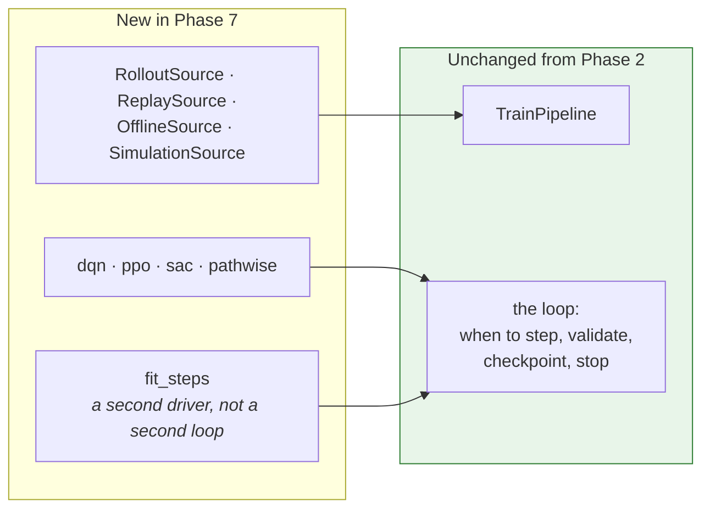
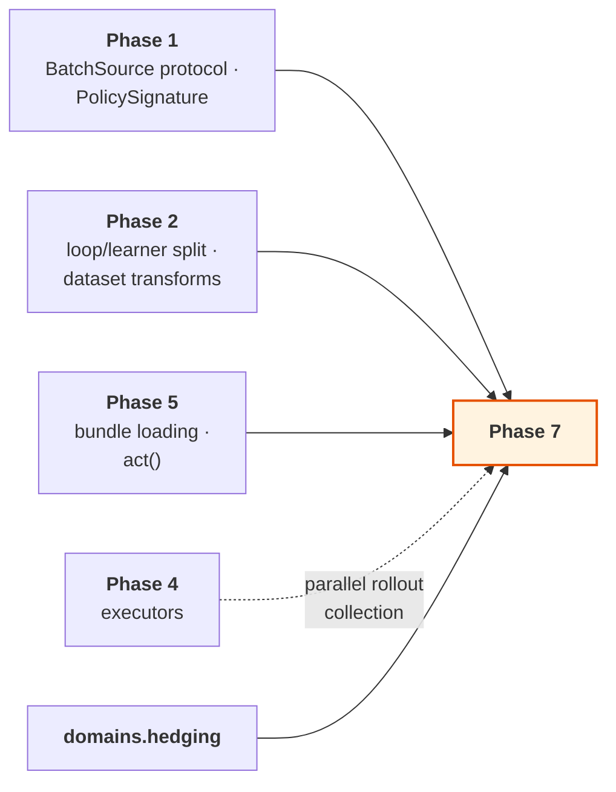

# Phase 7 — Reinforcement learning

**Extend the framework to interactive learning, without a second lifecycle.**

| | |
| --- | --- |
| **Depends on** | Phase 5 |
| **Blocks** | — |
| **Delivers** | `sources.environment`, the four interactive `BatchSource` adapters, four learners, `fit_steps`, `engines.torch.risk`, `domains.hedging`, `analysis.metrics.episode`, `analysis.visuals.episodes` |
| **Design status** | A clean redesign. Not a port of `q_learning` |

> **Detail level.** Outline depth, to be expanded before the phase starts. See
> the note in [Phase 4 §intro](PHASE_4_JOB_SETS.md).

---

## 1. Purpose

A policy should get everything a supervised model gets: validated specs,
leakage-aware data handling, versioned bundles, metrics, reports, fan-out
across jobs and reproducible placement. Reinforcement-learning code in research
repositories typically gets none of it, which is why so little of it reaches
production.

This phase is last on purpose. Phases 1–6 deliver a complete, production-used
supervised framework. Designing the interactive abstractions earlier would mean
designing them around a use case nobody was yet running, and the
`BatchSource` unification would have been shaped by speculation.

### On `q_learning`

This is a redesign, not a port. The existing `q_learning` package assumes
tabular, transition-based learning throughout: its agent and environment
protocols cannot express the pathwise case, and they do not compose with the
`BatchSource` abstraction that makes one training loop serve both paradigms.
Its *use cases* informed the requirements here. None of its structure carries
over.

---

## 2. What is built

| Module | Delivers |
| --- | --- |
| `sources.environment.protocol` | `Environment`, `DifferentiableEnvironment` |
| `sources.environment.spaces` | Observation and action spaces; `PolicySignature` |
| `sources.environment.vector` | Batched environments, synchronous and process-backed |
| `sources.environment.wrappers` | Observation, action and reward wrappers; each recorded in lineage |
| `sources.environment.recording` | Episode capture to transition tables |
| `sources.environment.adapters.gymnasium` | Third-party bridge |
| `sources.dataset.transitions` | Reads transition tables back as a dataset source |
| `sources.batching.{rollout,replay,offline,simulation}` | The four interactive adapters |
| `engines.torch.loops.fit_steps` | The step-driven loop |
| `engines.torch.learners.{dqn,ppo,sac,pathwise}` | Four update rules |
| `engines.torch.risk` | Differentiable mean-variance, CVaR, entropic |
| `core.spec.{environment,batching}` | `EnvSpec`, `VectorSpec`, `WrapperSpec`, `RolloutSpec`, `ReplaySpec`, `SimulationSpec` |
| `core.contract.experience` | `Transition`, `Trajectory`, `Batch`, `EpisodeStats` |
| `domains.hedging` | Hedging environments and their risk objectives |
| `analysis.metrics.episode`, `analysis.visuals.episodes` | Interactive-run analysis |

---

## 3. Key decisions

### 3.1 No new pipelines, and no new loop

The train pipeline is unchanged. A reinforcement-learning run differs only in
which `BatchSource` is built and which `Learner` is used — both already
abstractions from Phases 1 and 2.

If this phase requires a new pipeline or a second loop, the Phase 2 split
between loop and learner was wrong, and that is the finding — not a reason to
fork the lifecycle.

### 3.2 `DifferentiableEnvironment` is first-class

Most reinforcement-learning libraries model only step-and-reward dynamics, so a
hedging or replication problem must be forced into a transition interface —
which throws away the exact gradients that make it tractable.

When the dynamics are differentiable, a risk measure can be back-propagated
straight through a simulated path: no value function, no policy-gradient
estimator, no variance to fight. For a quantitative-finance framework this is
not an exotic case, so it gets its own protocol.

`pathwise.py` is the learner that exploits it, and it is tested against a
problem with a closed-form gradient.

### 3.3 Offline reinforcement learning reuses the dataset package

`recording.py` writes episodes to transition tables; `transitions.py` reads
them back as a `DatasetSource`. Offline learning therefore inherits the
leakage-aware splitting, caching and fitted-transform machinery already built
and tested in Phase 2, instead of acquiring a parallel data path.

### 3.4 Wrappers are recorded in lineage

A reward-shaping change alters what a policy optimises, which makes it as
load-bearing as a hyper-parameter. Every wrapper records itself in the run
lineage, so a bundle states exactly which reward it was trained against. A
reshaped reward invisible in the saved artifact is how two "identical" agents
end up incomparable.

---

## 4. How this links to the rest of the framework

`BatchSource` and `PolicySignature` were defined in Phase 1, before any
interactive source existed, specifically so this phase fits an existing
abstraction rather than reshaping one. Whether that worked is the clearest
verdict available on the Phase 1 design.

---

## 5. Tests

Environments are tested against deterministic toy dynamics with known closed
forms, so assertions are exact. A test that checks only "reward went up" cannot
distinguish a correct implementation from a lucky one.

| Test | Asserts |
| --- | --- |
| `test_gradient_flows_through_differentiable_dynamics` | The defining property of the differentiable protocol |
| `test_pathwise_gradient_matches_analytic` | On a problem with a closed form |
| `test_vectorised_matches_serial_stepping` | Element for element |
| `test_wrapper_order_is_respected` | Composition is not commutative |
| `test_wrappers_appear_in_lineage` | A reshaped reward is visible in the bundle |
| `test_recorded_episode_replays_identically` | Capture and replay round-trip |
| `test_offline_source_reuses_dataset_splitting` | No parallel data path |
| `test_dqn_target_network_sync` | At the right interval, with the right values |
| `test_ppo_clipping_at_ratio_bounds` | The boundary cases |
| `test_sac_entropy_term` | Against a hand-computed value |
| `test_risk_measures_match_analytic` | CVaR and entropic risk on a known distribution |
| `test_fit_steps_and_fit_epochs_share_the_loop` | No duplicated loop logic |
| `test_rl_run_produces_a_standard_bundle` | Same artifacts as a supervised run |

---

## 6. Definition of done

Beyond the universal criteria in
[`IMPLEMENTATION.md` §5](../IMPLEMENTATION.md#5-definition-of-done--every-phase):

- [ ] No new pipeline and no second loop. `fit_steps` is a driver sharing the
      loop's machinery.
- [ ] All four interactive sources satisfy `BatchSource` and pass its shared
      contract suite unmodified.
- [ ] All four learners implemented and tested against hand-computed or
      analytic values.
- [ ] `DifferentiableEnvironment` is a first-class protocol; gradient flow
      asserted.
- [ ] Pathwise gradient matches an analytic gradient on a closed-form problem.
- [ ] Offline learning uses `sources.dataset`, not a parallel path.
- [ ] Every wrapper recorded in lineage; asserted by test.
- [ ] Vectorised stepping matches serial stepping exactly.
- [ ] An interactive run produces the same bundle structure as a supervised
      one.
- [ ] A policy runs in a job set with per-job overrides.
- [ ] No `q_learning` code imported or copied.
- [ ] `examples/rade_xl/phase7_train_differentiable_hedger.py` trains a hedger
      on a differentiable environment and plots the hedging error path.

---

## 7. Risks

| Risk | Why it matters | Mitigation |
| --- | --- | --- |
| `BatchSource` does not fit an interactive source | The central unification claim fails | It was designed in Phase 1 against these five sources. If it fails, fix the protocol and re-verify Phase 2's sources against it |
| Reinforcement-learning runs are non-reproducible | A policy cannot be compared with its predecessor, and tuning is meaningless | Seed the environment, the vectorised workers and the replay sampler independently and deterministically from the run seed |
| The loop acquires algorithm-specific branches | Phase 2's split is undone and the next algorithm is another script | Review rule: nothing in `loops.py` may name an algorithm. Enforced as in Phase 2 |
| Learners tested only statistically | A subtly wrong update rule still learns something, slowly | Every learner tested against a hand-computed or analytic value on a closed-form problem |
| Scope expands to a reinforcement-learning library | The phase never ends | Four learners, five sources, one domain. Anything further is a later phase |

---

## 8. Deviations

| Date | Deviation | Reason |
| --- | --- | --- |
| — | — | — |
